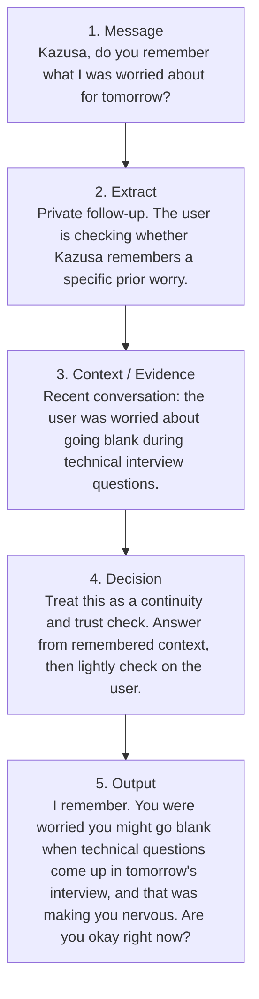
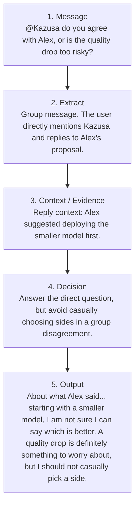
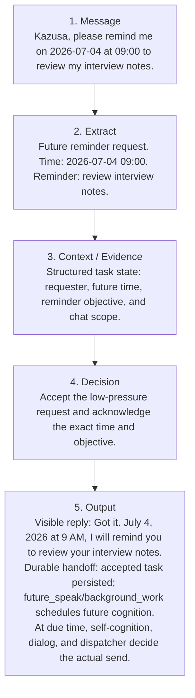
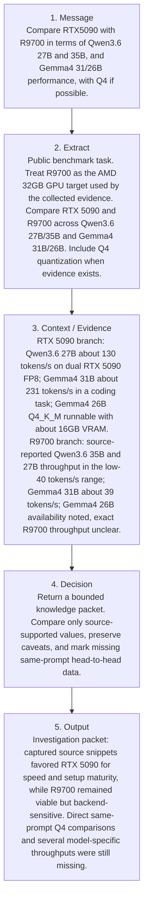
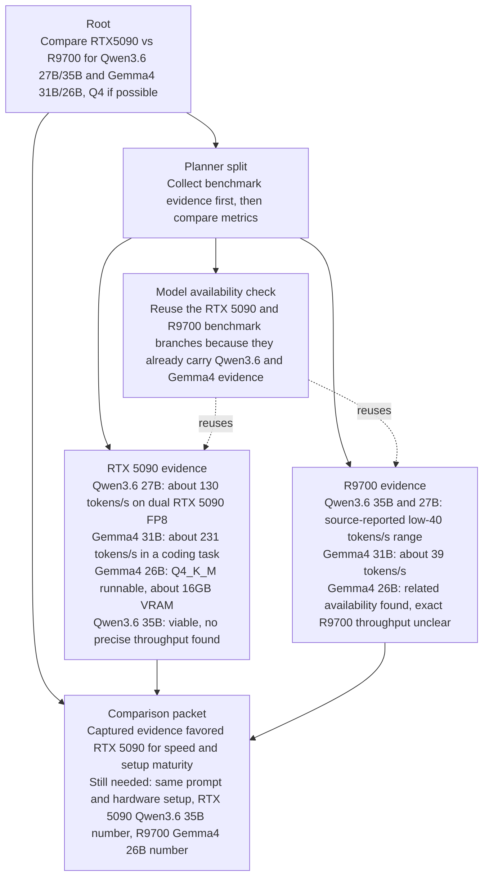

<div align="center">
  

<h1>Kazusa Cognitive Core</h1>

<p><strong>A self-evolving character cognition runtime for persistent digital presence.</strong></p>

<p>
    <a href="README_CN.md">简体中文</a>
    ·
    <a href="docs/HOWTO.md">HOWTO</a>
  </p>

<p>
    
    
    
    
    
  </p>
</div>

## What Kazusa Achieves

Kazusa is not a generic assistant shell. It is a psychological model of a
self-evolving character brain: a runtime that keeps identity, relationship
continuity, retrieval, cognition, dialog, memory, reflection, and future
follow-through inside one inspectable service core.

The same brain can be reached from Discord, NapCat QQ, the browser debug UI, or
another adapter that speaks the service API. Adapters stay thin. The brain
service consumes typed message-envelope fields instead of parsing raw Discord,
QQ, or debug-wire syntax.

For local setup, jump to [Quick Start](#quick-start) and the
[HOWTO](docs/HOWTO.md). For subsystem ownership, use
[Runtime Layers](#runtime-layers).

Core terms used throughout this README:

- **Adapter**: platform transport that normalizes Discord, QQ, debug UI, or
  future events into the brain service API.
- **MessageEnvelope**: the typed inbound message contract consumed by the
  brain, RAG, and cognition stages.
- **RAG3 local context resolver**: cognition-selected local/private context
  evidence resolver; it returns evidence and does not decide persona stance or
  final wording.
- **Cognition resolver**: the bounded L1/L2/L2d loop that decides stance,
  action needs, and whether more evidence is needed.
- **L3/dialog**: the final visible wording stage after cognition has decided
  what kind of surface should exist.
- **Accepted task/background work**: durable delayed work accepted by the
  character, persisted by deterministic code, and re-entered through cognition.

At a high level, Kazusa provides:

| Capability                       | What it means                                                                                                                      |
| -------------------------------- | ---------------------------------------------------------------------------------------------------------------------------------- |
| Platform-neutral character brain | Discord, QQ, debug UI, and future adapters feed the same FastAPI brain service.                                                    |
| Typed message boundary           | Platform syntax is normalized into `MessageEnvelope` fields before cognition or RAG sees it.                                       |
| Bounded live response path       | Typed intake, frontline relevance, turn settlement, settled relevance, the cognition resolver, selected evidence capabilities, action routing, and L3 surfaces are explicit stages with caps and inspectable payloads. |
| Multi-horizon memory             | Recent chat, short-term conversation flow, retrieved evidence, durable memory, and scheduled commitments remain separate.          |
| Internal monologue residue       | A short private residue lane carries bounded first-person reasons from completed episodes into the next L2a cognition pass.       |
| RAG3 local context recall        | Demand-driven graph resolver dispatches local evidence subagents and projects prompt-safe local/private evidence, including session image observations, when cognition asks through `local_context_recall`. |
| Layered cognition                | Cognition decides stance, boundaries, judgment, style, action needs, and response goals before selected L3 surfaces render output. |
| Background consolidation         | Completed episodes update durable memory, relationship state, Cache2 invalidation, images, and progress from text plus action/surface traces. |
| Accepted delayed work            | Accepted reminders, text tasks, and coding tasks are persisted, routed to internal background workers, and returned through cognition rather than sent directly. |
| Reflection outside chat          | Hourly, daily, and promoted reflection runs are stored as audit records and only promoted context can enter normal cognition.      |
| Idle self-cognition              | Background source cases can enter the same resolver-backed persona path, with source-bound delivery and normal consolidation rules. |
| Calendar follow-through          | Accepted future promises and due commitments can become durable calendar triggers that run fresh cognition later.                  |
| Event logging observability      | Runtime, LLM, RAG, action routing, surfaces, reflection, self-cognition, dispatcher, consolidation, and DB operations emit sanitized operational events. |

## What You Can Build

| Use case                             | Why Kazusa fits                                                                                                                  |
| ------------------------------------ | -------------------------------------------------------------------------------------------------------------------------------- |
| Persistent character companion       | The runtime keeps relationship memory, short-term flow, character state, and reflection separate but connected.                  |
| Group-chat character bot             | Frontline relevance and turn settlement handle noisy channels.                                                                 |
| Local model character lab            | Route-specific OpenAI-compatible model settings let weaker local models handle narrower, staged prompts.                         |
| Memory and RAG experiments           | RAG3, Cache2, retired RAG2 helper coverage, scoped user memory, shared memory evolution, and conversation search are modular enough to inspect independently. |
| Cross-platform adapter experiments   | New adapters only need to normalize platform events into the service contract and render returned messages.                      |
| Idle cognition and reflection labs   | Self-cognition and reflection use bounded source packets and shared cognition boundaries without turning adapters into agents.   |
| Promise and follow-through workflows | Accepted future commitments can be validated, persisted, deduplicated, and revisited later through durable calendar triggers.    |

## Supported LLMs

Kazusa is designed around OpenAI-compatible endpoints rather than one hosted
vendor. All OpenAI-compatible chat completion endpoints are technically
supported, and route-specific configuration lets different stages use different
models when needed.

In practice, Kazusa can be configured like a model routing table: lightweight
or local models can handle most structured reasoning, while a different hosted
model can be assigned to a stage where you want stronger voice or generation
quality. The route names below are the configuration handles documented in the
HOWTO. One working-style configuration looks like this:

| Route                      | Example model                            | Example source             |
| -------------------------- | ---------------------------------------- | -------------------------- |
| `RELEVANCE_AGENT_LLM`      | `local-model`                            | `http://localhost:1234/v1` |
| `VISION_DESCRIPTOR_LLM`    | `local-model`                            | `http://localhost:1234/v1` |
| `MSG_DECONTEXTUALIZER_LLM` | `local-model`                            | `http://localhost:1234/v1` |
| `RAG_PLANNER_LLM`          | `local-model`                            | `http://localhost:1234/v1` |
| `RAG_SUBAGENT_LLM`         | `local-model`                            | `http://localhost:1234/v1` |
| `WEB_SEARCH_LLM`           | `local-model`                            | `http://localhost:1234/v1` |
| `COGNITION_LLM`            | `local-model`                            | `http://localhost:1234/v1` |
| `BOUNDARY_CORE_LLM`        | `local-model`                            | `http://localhost:1234/v1` |
| `BACKGROUND_WORK_LLM`      | `local-model`                            | `http://localhost:1234/v1` |
| `CODING_AGENT_PM_LLM`      | `local-model`                            | `http://localhost:1234/v1` |
| `CODING_AGENT_PROGRAMMER_LLM` | `local-model`                          | `http://localhost:1234/v1` |
| `DIALOG_GENERATOR_LLM`     | `deepseek-v4-flash`                      | `https://api.deepseek.com` |
| `CONSOLIDATION_LLM`        | `local-model`                            | `http://localhost:1234/v1` |
| `JSON_REPAIR_LLM`          | `local-model`                            | `http://localhost:1234/v1` |
| `EMBEDDING`                | `text-embedding-nomic-embed-text-v2-moe` | `http://localhost:1234/v1` |

The table is an example, not a fixed requirement. Any route can point to any
OpenAI-compatible endpoint that can satisfy that stage's latency and quality
needs.

Code-reading uses separate required routes for PM decisions and programmer
workers. Final synthesis intentionally reuses `CODING_AGENT_PM_LLM`; there is
no independent synthesizer route. Each code-reading route must define its base
URL, API key, and model.

Chat LLM calls are routed through `LLInterface`. Each module owns its route,
model, generation budget, and thinking toggle via `LLMCallConfig`; the
interface owns backend detection, provider sessions, request mapping, response
normalization, and reload retry. Public token budget config uses
`max_completion_tokens`. Thinking is disabled by default. When enabled, the
interface currently maps provider-specific thinking controls for Gemma 4,
Qwen3-family model names, and Qwen-compatible Qwopus 3.x model names. The
runtime contract is documented in the
[LLM Interface ICD](src/kazusa_ai_chatbot/llm_interface/README.md).

Tested chat model families:

- Gemma 4 26B MoE
- Qwen3.6 27B
- DeepSeek v4

Kazusa also requires an OpenAI-compatible embeddings endpoint for conversation
history, memory retrieval, and vector search features. Local deployments
commonly use LM Studio or another OpenAI-compatible endpoint.

## Architecture At A Glance

This is the complete top-level map, not the shortest path through one chat
turn. Read the solid live path first:
`adapter -> brain service -> queue/intake -> evidence -> cognition -> dialog -> persistence/scheduler`.
Then use the subgraphs as ownership maps for helper agents, resolver
capabilities, web sources, complex-task research, accepted tasks, background
workers, and durable maintenance systems.

Ownership tags in node labels are intentional: `[LLM]` nodes make semantic
judgments, `[deterministic]` nodes validate or move state, and `[worker]` nodes
execute bounded delayed work. Exact subagent naming and documentation
vocabulary are covered by the
[Subagent Interface Guide](docs/SUBAGENT_INTERFACES.md).

The active chat intake path has two bounded relevance decisions. The frontline
route is a compact per-message `discard/start/append` judge. Accepted group
messages settle in a six-second quiet window with a ten-second hard deadline;
the settled route then chooses `ignore/proceed/wait`. Private-message timing
and adjacency-only private coalescing remain intact. The settlement coordinator
owns open-slot projection, bounded silent-prelude promotion, enqueue-time
deadlines, and the pre-deadline ingress barrier. One response owner receives
the assembled reply; appended request futures complete silently. A valid
`proceed` is atomically claimed before persona preparation and cognition run.
Coalesced private fragments are shown to frontline as one logical input. The
four-image description budget is shared across reassessments, and omitted
media is explicit so settled relevance can fail closed before cognition.

```mermaid
flowchart TD
    A["Adapters<br/>Discord, NapCat QQ, debug UI, future adapters"]
    B["FastAPI brain service<br/>/chat, health, ops snapshots, delivery receipts, runtime adapter registry"]
    C["Process-local chat queue<br/>private adjacency coalescing, inbound persistence"]
    D["Typed fragment intake and turn settlement<br/>MessageEnvelope, frontline relevance, deadlines, version claim"]
    E{"Service graph"}
    F["Media descriptor<br/>accepted media, max four unique images"]
    G["Settled relevance gate<br/>ignore/proceed/wait"]
    H["Prompt-safe context lanes<br/>conversation_progress<br/>internal_monologue_residue<br/>past_dialog_cognition<br/>promoted reflection and growth context"]
    N["No persona turn<br/>empty ChatResponse"]
    J["Adapter delivery boundary<br/>ChatResponse messages, mentions, delivery receipts"]
    K["Post-turn state work<br/>conversation progress, residue, consolidation, Cache2 invalidation"]
    DB[("MongoDB through DB facade<br/>conversation, profiles, user memory, shared memory, calendar, reflection, traces, event logs")]
    SUP["Shared support<br/>LLM interface and route configs<br/>Cache2 and embeddings<br/>web/MCP runtimes<br/>sanitized event logging and protected LLM tracing"]

    A -->|ChatRequest + MessageEnvelope| B
    B --> C
    C --> D
    D --> E
    E -->|attachments| F
    F --> G
    E -->|text-only or described media| G
    G -->|should respond| H
    G -->|should not respond| N
    H --> P0
    P3 -->|visible text surfaces| J
    P4 -->|private action or no visible surface| K
    J --> K
    K --> CONS
    K --> DB
    SUP -.-> B

    subgraph Persona["Persona turn"]
        P0["Stage 0<br/>message decontextualizer"]
        P1["Stage 1<br/>bounded cognition resolver"]
        P2["Stage 2<br/>memory lifecycle specialist"]
        P2A["Stage 2a<br/>accepted-task and background-work enqueue"]
        P3["Stage 3<br/>L3 text surface and dialog"]
        P4["Private finalization<br/>no-response/action trace"]
        PT["EpisodeTrace<br/>action results and surface outputs"]
        P0 --> P1
        P1 --> P2
        P2 --> P2A
        P2A -->|speak selected| P3
        P2A -->|no visible text surface| P4
        P3 --> PT
        P4 --> PT
    end

    subgraph Resolver["Cognition resolver recurrence"]
        R0["Resolver state<br/>goal progress, observations, pending resume"]
        R1["L1<br/>affect and interaction subtext"]
        R2["L2a<br/>consciousness"]
        R3["L2b<br/>boundary appraisal"]
        R4["L2c1 + L2c2<br/>judgment and social context"]
        R5["L2d [LLM]<br/>action and capability selection"]
        R0 --> R1
        R1 --> R2
        R2 --> R3
        R3 --> R4
        R4 --> R5
    end

    subgraph ResolverCaps["Cognition-selected resolver capabilities"]
        RC0["Deterministic capability executor [deterministic]<br/>one immediate request per cycle"]
        RC1["local_context_recall<br/>RAG3 local context evidence"]
        RC2["public_answer_research<br/>complex task resolver"]
        RC3["human_clarification<br/>pending HIL row"]
        RC4["approval_preparation<br/>pending approval row"]
        RC5["self_goal_resolution<br/>private internal-source handling"]
        RC6["Resolver observation<br/>prompt-safe result for next cycle"]
        RC0 --> RC1
        RC0 --> RC2
        RC0 --> RC3
        RC0 --> RC4
        RC0 --> RC5
        RC1 --> RC6
        RC2 --> RC6
        RC3 --> RC6
        RC4 --> RC6
        RC5 --> RC6
    end

    subgraph RAG3["RAG3 local context resolver"]
        LC0["resolve_local_context<br/>stable public IO"]
        LC1["graph planner<br/>bounded semantic tasks"]
        LC2["active node resolver<br/>one dependency-ready node"]
        LC3["collapse review<br/>optional duplicate node merge"]
        LC4["bottom-up synthesis<br/>known/lacking/boundary packet"]
        LC5["rag_result projection<br/>retained prompt-facing evidence"]
        LC0 --> LC1
        LC1 --> LC2
        LC2 --> LC3
        LC3 --> LC2
        LC2 --> LC4
        LC4 --> LC5
    end

    subgraph Web3["web_agent3 source subagents"]
        W0["router/generator -> executor -> evaluator -> finalizer"]
        W1["web_read<br/>direct HTTP(S) URL read"]
        W2["web_search<br/>SearXNG search when configured"]
        W3["nhentai<br/>metadata/search when token enabled"]
        W4["bilibili<br/>public read/search when SDK available"]
        W0 --> W1
        W0 --> W2
        W0 --> W3
        W0 --> W4
    end

    subgraph Complex["Complex task resolver"]
        X0["Public IO<br/>resolve_complex_task request/context/options"]
        X1["graph planner"]
        X2["active node resolver"]
        X3["collapse review"]
        X4["bottom-up synthesis<br/>knowledge packet"]
        X5["evidence subagent<br/>collect_evidence"]
        X6["algorithmic subagent<br/>evaluate_expression / missing_expression"]
        X0 --> X1
        X1 --> X2
        X2 --> X5
        X2 --> X6
        X2 --> X3
        X3 --> X2
        X2 --> X4
    end

    subgraph Actions["Action spec, accepted tasks, and background workers"]
        A0["ActionSpec materialization and evaluator [deterministic]"]
        A1["Visible/private capabilities<br/>speak<br/>memory_lifecycle_update<br/>accepted_task_request<br/>accepted_task_status_check<br/>future_speak<br/>trigger_future_cognition"]
        A2["Internal executable actions<br/>apply_memory_lifecycle_update<br/>background_work_request"]
        AT["accepted_task lifecycle<br/>identity, duplicate rejection, result-ready state"]
        BW0["background_work runtime [LLM route only]<br/>router chooses worker only"]
        BW1["text_artifact worker [worker]<br/>task router + generator"]
        BW2["future_speak worker [deterministic worker]<br/>schedules future cognition"]
        BW3["coding_agent worker [worker]<br/>code-reading answers / new-artifact proposals<br/>no patch apply or command execution"]
        A0 --> A1
        A1 --> A2
        A2 --> AT
        AT --> BW0
        BW0 --> BW1
        BW0 --> BW2
        BW0 --> BW3
    end

    subgraph Maintenance["Background and durable subsystems"]
        CAL["calendar_scheduler<br/>future_cognition, commitment_due_cognition, reflection_phase_slot, recurring_self_check"]
        SC["self_cognition worker<br/>active commitment, recent dialog, topic follow-up, group review cases"]
        REF["reflection_cycle worker<br/>hourly slot, daily channel, global promotion, affect settling"]
        ME["memory_evolution<br/>shared memory insert, supersede, merge, seed reset"]
        GG["global_character_growth<br/>promoted trait drift"]
        CONS["consolidation<br/>target plan -> source views -> lane router -> lane review -> write-intent validation -> persistence"]
        DISP["dispatcher [deterministic]<br/>registered adapter callback delivery for trusted sends"]
        PRO["proactive_output<br/>permissioned preview/outbox contract, no production send path"]
        CAL --> SC
        CAL --> REF
        REF --> ME
        REF --> GG
        REF --> SC
        SC --> DISP
        SC --> CONS
        CONS --> ME
        GG --> H
        ME --> H
    end

    P1 --> R0
    R5 -->|capability requested| RC0
    RC6 -->|observation or pending resume| R0
    R5 -->|terminal semantic action requests| A0
    A0 --> P2
    P2A --> AT
    BW1 -->|accepted_task_result_ready| P1
    BW3 -->|accepted_task_result_ready| P1
    BW2 --> CAL
    CAL -->|future or due source case| SC
    SC -->|shared cognition path| P0
    RC1 --> LC0
    LC5 --> RC6
    RC2 --> X0
    X4 --> RC6
    X5 --> W0
    CONS --> DB
    AT --> DB
    BW0 --> DB
    CAL --> DB
    REF --> DB
    ME --> DB
    GG --> DB
    SUP -.-> R1
    SUP -.-> LC0
    SUP -.-> K
```



Kazusa's live response path is a cognition core, not a chatbot shell or a
generic tool harness. Adapters normalize platform events into the typed service
contract; the brain service owns queueing, identity, reply hydration, history,
episode construction, and graph execution.

The named specialist boxes are family-local subagents and workers, not one
universal runtime abstraction. RAG3 resolves local context through
resolver-local stage agents and projects retained `rag_result` evidence;
retired RAG2 helper modules remain source-level evidence tooling and tests.
`web_agent3` owns its
source subagents; the complex-task resolver owns resolver-local evidence and
algorithmic subagents; background work owns delayed-work workers. The
top-level map keeps the coding-agent worker coarse; its fetching, reading,
writing, PM, and programmer roles are owned by the
[Coding Agent ICD](src/kazusa_ai_chatbot/coding_agent/README.md).

The resolver preserves the same L1 -> L2 -> L2d cognition stack on every
cycle. L2d may finish with selected action specs, or it may request one bounded
capability observation through `local_context_recall`, `public_answer_research`,
`human_clarification`, `approval_preparation`, or `self_goal_resolution`. The
observation is projected into the next cognition cycle; evidence never speaks
as persona by itself.

RAG3 local context recall runs only when L2d selects
`local_context_recall`. The separate first-cycle shared-memory prewarm may
project confirmed shared-memory rows into L2a before the first cognition pass;
it is not a resolver capability observation and it does not let retrieved
evidence become persona.

Selected visible text surfaces go back to adapters through `ChatResponse` and
delivery receipts. Private action results, no-visible-output decisions, and
surface traces can still feed post-turn progress, consolidation, Cache2
invalidation, residue recording, calendar state, reflection, and
self-cognition without creating a platform send.

Delayed user work is selected by cognition as an accepted task. L2d sees the
semantic `accepted_task_request` and `accepted_task_status_check` affordances;
deterministic action-spec execution materializes new accepted tasks into the
internal `background_work` executor only after duplicate rejection and durable
lifecycle persistence. A route-only background-work router chooses the worker
after the live turn. Worker-local classification stays inside the selected
worker: the text-artifact worker has its own task router/generator, and the
coding-agent worker has its own read-versus-write supervisor before returning
bounded answers or proposal artifacts. Completed accepted tasks return as
`accepted_task_result_ready` cognition rather than being sent directly by
workers. Legacy background-artifact and legacy background-work rows remain
compatibility data, not the new model-facing runtime contract.

## Real Debug Example Flows

The first three examples below were captured through the real debug `/chat`
interface, a local/debug path that sends the same typed chat request shape into
the brain service as runtime adapters. Example 4 was captured through the
complex-task resolver entry point, which returns a research packet rather than
visible chat text. The examples were captured on July 2, 2026, then translated
to English and condensed for a README audience. They are not full trace dumps.
Internal ids, cache keys, raw database rows, and implementation field names are
intentionally omitted. The diagrams render typed payloads as readable prose.

Read each diagram from left to right. Every example uses the same five
checkpoints:

1. **Message / Request** is what the chat platform, debug client, or resolver
   entry point receives.
2. **Extract** is a human-readable summary of the typed, platform-neutral
   message envelope and hydrated context the brain receives.
3. **Context / Evidence** is retrieved conversation evidence, reply context, or
   structured task state used for the decision.
4. **Decision** is the character-level judgment for chat turns, or the
   resolver-level synthesis rule for non-chat task packets.
5. **Output** is what the user sees, the durable handoff created for later
   work, or the semantic packet returned to the next stage.

This mirrors the system boundary: adapters normalize platform events, RAG
returns evidence, cognition decides the character stance, dialog owns visible
wording, and deterministic subsystems own validation, persistence, scheduling,
adapter delivery, and durable task lifecycle.

### Example 1: Private Continuity Recall

This private-chat example shows how the system answers a follow-up question by
using recent conversation context instead of treating the message as isolated.



The important transfer is the remembered concern. The adapter only needs to
send a clean private message into the brain. RAG/retrieval supplies the earlier
interview worry as evidence, but it does not write the reply. Cognition decides
that the user is testing continuity, so the dialog response confirms the memory
and adds a small emotional check-in.

### Example 2: Group Reply And Mention Grounding

This group-chat example shows how a reply target and a direct mention become
semantic context. The character understands both the technical question and
the social pressure of being asked to take sides.



The important transfer is the combination of direct address and reply context.
The adapter normalizes platform-specific mention and reply syntax into typed
envelope fields; the README diagram renders those fields as readable prose.
Cognition can then judge the social situation: Kazusa was invited into a
disagreement, so the visible answer acknowledges the quality risk without
pretending to have enough basis to overrule either person.

### Example 3: Accepted Future Reminder Handoff

This example shows a user-facing delayed task. The character accepts the
reminder in the live chat, while deterministic subsystems create durable work
for the future.



The important transfer is the future task, not the queue machinery. Cognition
decides whether Kazusa should accept the reminder. After that decision,
deterministic code stores the accepted task and queues the internal future
work. In implementation terms, cognition selects an `accepted_task_request`
action spec; deterministic execution persists it, creates the internal
`background_work` request, and `future_speak` schedules a `future_cognition`
calendar run. At due time, self-cognition, dialog, and dispatcher decide
whether and how to send the reminder. The background worker does not write
final chat text directly.

### Example 4: Complex Public Research Packet

This non-chat resolver case shows how a broad benchmark request is decomposed
into source-bound evidence and a comparison packet. It does not produce visible
dialog; it returns the packet for later cognition, inspection, or answer
synthesis. The benchmark numbers are captured trace content from July 2, 2026,
not current hardware guidance.



The captured resolver tree shows how the task is broken down. The planner first
separates evidence collection from comparison. Evidence branches collect facts
for each GPU, model-availability checks reuse already-collected evidence, and
the final packet keeps unsupported comparisons explicit.



The important transfer is the boundary between evidence and conclusion. The
resolver turns one broad request into smaller evidence jobs. Each job returns a
short source-bound summary plus caveats. When a later branch asks something
already answered, the tree points back to that existing evidence instead of
treating it as a new fact. The final packet is useful to an AI developer
because it separates what the system can say now from what still needs
verification before making a confident public comparison.

## Design Principles

**LLM-first semantics, deterministic mechanics**

LLM stages judge meaning: response relevance, missing evidence, memory meaning,
accepted promises, character stance, action choice, and surface intent.
Deterministic code owns validation, persistence, limits, cache invalidation,
scheduling, adapter delivery, and auditability.

**Evidence is not persona**

RAG answers "what is known?" Cognition answers "what does this mean for Kazusa
right now?" L2d answers "which actions or surfaces are needed?" L3/dialog
answers "how should the selected surface render it?"

**Memory has ownership**

Kazusa does not flatten all context into one prompt. Immediate surface text,
conversation progress, retrieved evidence, durable memory, promoted reflection,
and calendar-scheduled commitments each have a separate lifecycle.

The internal monologue residue lane is a separate short-lived lane. It stores
one compact first-person reason from a completed episode and projects it only
into L2a as `internal_monologue_residue_context`. It is not
`reflection_summary`, durable memory, visible dialog planning, or calendar
input.

**Reflection does not shortcut into live chat**

Reflection is slower sense-making work. Raw reflection output is stored for
inspection, but normal cognition only receives bounded, promoted, gated context.
The reflection worker also owns the daily sleep/wake affect-settling pass that
smooths persistent character mood and global vibe outside the live response
path.

**Adapters are transport edges**

Platform adapters parse platform events, normalize typed envelopes, call the
brain service, and deliver returned messages. Character identity, memory, RAG,
cognition, and calendar scheduling remain in the platform-neutral core.

## Runtime Layers

| Layer                    | Owns                                                                                    | Key docs                                                                               |
| ------------------------ | --------------------------------------------------------------------------------------- | -------------------------------------------------------------------------------------- |
| Adapters                 | Discord, NapCat QQ, debug UI transport and platform rendering                           | [Adapter ICD](src/adapters/README.md), [HOWTO](docs/HOWTO.md#adapters)                |
| Control console          | Local operator auth, service lifecycle, process logs, audit, static UI, debug-chat handoff | [Control Console ICD](src/control_console/README.md)                                  |
| Brain service            | HTTP API, queue, graph startup, health, delivery receipts, runtime adapter registration | [Brain Service ICD](src/kazusa_ai_chatbot/brain_service/README.md)                     |
| Message envelope         | Typed inbound content, mentions, replies, attachments, addressees, broadcast state      | [Message Envelope ICD](src/kazusa_ai_chatbot/message_envelope/README.md)               |
| LLM interface            | Backend-compatible chat LLM invocation, provider sessions, diagnostics, and reload retry | [LLM Interface ICD](src/kazusa_ai_chatbot/llm_interface/README.md)                    |
| Conversation progress    | Short-term episode state used by cognition to avoid loops and stale reopenings          | [Conversation Progress](src/kazusa_ai_chatbot/conversation_progress/README.md)         |
| Internal monologue residue | Short-lived private first-person residue loaded only into L2a cognition               | [Internal Monologue Residue ICD](src/kazusa_ai_chatbot/internal_monologue_residue/README.md) |
| Cognition resolver       | Bounded recurrence state, capability observations, HIL/pending resume, and cycle traces | [Cognition Resolver ICD](src/kazusa_ai_chatbot/cognition_resolver/README.md)            |
| Local context resolver   | RAG3 local/private evidence graph, projection, and production `local_context_recall`    | [Local Context Resolver ICD](src/kazusa_ai_chatbot/local_context_resolver/README.md)   |
| Retired RAG 2 helpers    | Historical slot-driven helper-agent retrieval and Cache2 evidence projection           | [Retired RAG 2](src/kazusa_ai_chatbot/rag/README.md)                                  |
| Cognition and dialog     | Character stance, boundaries, judgment, style, visual directives, and final wording     | [Cognition Nodes](src/kazusa_ai_chatbot/nodes/README.md)                              |
| Action spec              | L2d action residues, capability registry, evaluator, results, surfaces, and traces      | [Action Spec](src/kazusa_ai_chatbot/action_spec/README.md)                            |
| Accepted task            | User-facing lifecycle for delayed work accepted by the character                        | [Accepted Task ICD](src/kazusa_ai_chatbot/accepted_task/README.md)                    |
| Background work          | Internal delayed-work executor, worker routing, and result handoff                      | [Background Work ICD](src/kazusa_ai_chatbot/background_work/README.md)                |
| Coding agent             | Standalone coding-task supervisor, source fetching, read-only answers, and new-artifact proposals | [Coding Agent ICD](src/kazusa_ai_chatbot/coding_agent/README.md)            |
| Consolidation            | Durable target planning, lane routing/review, write-intent validation, and target-specific persistence | [Consolidation ICD](src/kazusa_ai_chatbot/consolidation/README.md)                    |
| Database                 | MongoDB collection ownership, embeddings, indexes, public persistence helpers           | [Database ICD](src/kazusa_ai_chatbot/db/README.md)                                     |
| Event logging            | Sanitized operational telemetry, status snapshots, statistics, and export contracts     | [Event Logging ICD](src/kazusa_ai_chatbot/event_logging/README.md)                     |
| Calendar scheduler       | Durable typed trigger timing for future cognition, commitment due checks, and reflection phase slots | [Calendar Scheduler ICD](src/kazusa_ai_chatbot/calendar_scheduler/README.md) |
| Dispatcher               | Adapter-facing delivery validation and callback transport helpers                       | [Dispatcher](src/kazusa_ai_chatbot/dispatcher/README.md)                               |
| Self-cognition           | Idle source collection, self-cognition episodes, route tracking, and source-bound delivery | [Self-Cognition](src/kazusa_ai_chatbot/self_cognition/README.md)                    |
| Reflection cycle         | Background reflection runs, promotion gates, prompt-safe reflection context             | [Reflection Cycle ICD](src/kazusa_ai_chatbot/reflection_cycle/README.md)               |
| Memory evolution         | Curated shared memory lifecycle, lineage, seed reset, promoted memory writes            | [Memory Evolution ICD](src/kazusa_ai_chatbot/memory_evolution/README.md)               |
| Global character growth  | Slow promoted-trait drift from approved reflection memory                               | [Global Character Growth ICD](src/kazusa_ai_chatbot/global_character_growth/README.md) |
| Proactive output         | Permissioned preview/outbox contracts for future autonomous contact paths               | [Proactive Output ICD](src/kazusa_ai_chatbot/proactive_output/README.md)               |

Other project documents:

| Document                                                | Purpose                                                           |
| ------------------------------------------------------- | ----------------------------------------------------------------- |
| [README_CN.md](README_CN.md)                            | Simplified Chinese project overview                               |
| [docs/HOWTO.md](docs/HOWTO.md)                          | Local setup, environment variables, run commands, adapters, tests |
| [Documentation Guide](docs/DOCUMENTATION_GUIDE.md)      | Document roles, source hierarchy, module README rules, parity     |
| [Subagent Interface Guide](docs/SUBAGENT_INTERFACES.md) | Cross-family subagent and worker documentation vocabulary         |
| [Development Plans Registry](development_plans/README.md) | Active, archived, reference, and roadmap documents              |

## Quick Start

Kazusa expects MongoDB plus OpenAI-compatible chat and embedding endpoints. LM
Studio works for local development, but any compatible endpoint can be used.
Before starting the service, create a local `.env` with MongoDB, chat route,
and embedding settings. All route-specific model environment variables are
documented in [docs/HOWTO.md](docs/HOWTO.md#local-setup).

```powershell
python -m venv venv
venv\Scripts\activate
pip install -U pip
pip install -e ".[dev]"
```

Load a character profile before starting the brain:

```powershell
python -m scripts.load_character_profile personalities/kazusa.json
```

Normal local operation starts the buildless Python/FastAPI control console,
then uses the console to start or stop the brain and adapters:

```powershell
kazusa-control-console --host 127.0.0.1 --port 8765
```

Run the brain service directly only when bypassing the console for
development:

```powershell
kazusa-brain --host 0.0.0.0 --port 8000
```

Or use Uvicorn directly:

```powershell
uvicorn kazusa_ai_chatbot.service:app --host 0.0.0.0 --port 8000
```

Run the browser debug adapter:

```powershell
python -m adapters.debug_adapter --brain-url http://localhost:8000 --port 8080
```

Then open `http://localhost:8080`.

## Repository Map

```text
src/
  control_console/              Local operator console, lifecycle, logs, audit, static UI
  adapters/                    Platform adapters and debug UI
  kazusa_ai_chatbot/
    brain_service/             Service API, graph, intake, health, post-turn glue
    message_envelope/          Typed adapter-to-brain message contract
    llm_interface/             Chat LLM invocation compatibility layer and ICD
    cognition_resolver/        Bounded resolver loop, capability observations, HIL state
    nodes/                     Persona, cognition, and dialog stages
    action_spec/               Modality-neutral action contracts, registry, results
    accepted_task/             User-facing accepted delayed-work lifecycle
    background_work/           Internal delayed-work executor and workers
    coding_agent/              Standalone coding-task supervisor and subagents
    consolidation/             Durable consolidation helpers, lane routing, and ICD
    local_context_resolver/    RAG3 local/private evidence graph and retained projection
    rag/                       Retired RAG2 helper agents, hybrid retrieval, Cache2
    conversation_progress/     Short-term episode memory
    internal_monologue_residue/ Short-lived private residue lane for L2a
    db/                        MongoDB facade, schemas, collection owners
    event_logging/             Sanitized operational telemetry interface and ICD
    calendar_scheduler/        Durable typed trigger scheduler and migration script support
    dispatcher/                Adapter-facing delivery validation and handoff
    self_cognition/            Idle self-cognition triggers, tracking, and delivery
    reflection_cycle/          Background reflection and promotion
    memory_evolution/          Shared memory lifecycle and seed reset
    global_character_growth/   Slow promoted character-growth traits
    proactive_output/          Permissioned proactive preview contracts
  scripts/                     Operator and maintenance CLIs
docs/
  HOWTO.md                     Setup, runtime commands, environment, tests
development_plans/             Approved, archived, and reference plan registry
tests/                         Deterministic, live DB, and live LLM test suites
resources/
  avatar.png                   README avatar asset
```

## Testing

Default test runs exclude live DB and live LLM tests through `pytest.ini`.

```powershell
venv\Scripts\python -m pytest -q
```

Live LLM tests must be run one case at a time with output inspected. Live DB
tests require MongoDB. See [docs/HOWTO.md](docs/HOWTO.md#testing) for the
project testing contract.

## Project Status

Kazusa Cognitive Core is alpha-stage experimental infrastructure for a
persistent digital character. The main runtime is usable as a local brain
service with adapters, memory, retrieval, self-cognition, reflection, and
scheduling, but some autonomous-contact surfaces intentionally remain
permissioned preview contracts rather than production sends.

## License

Kazusa Cognitive Core is released under the
[GNU Affero General Public License v3.0](LICENSE).
