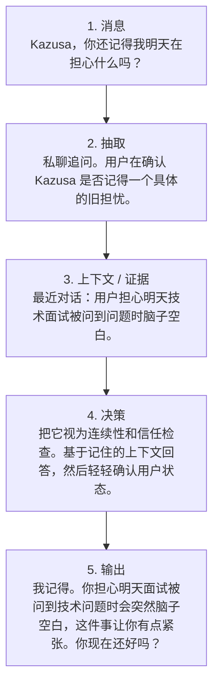
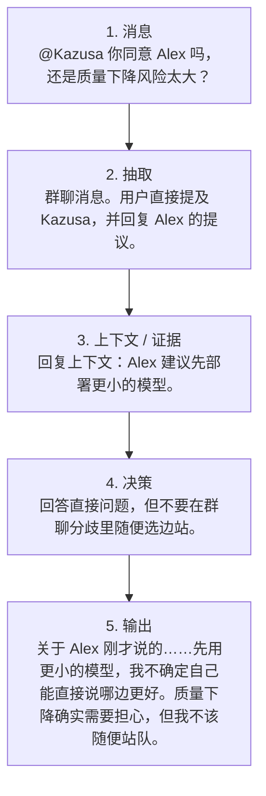
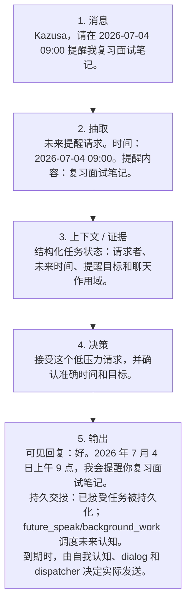
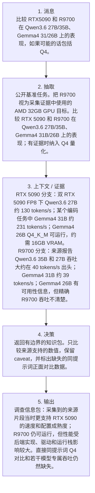
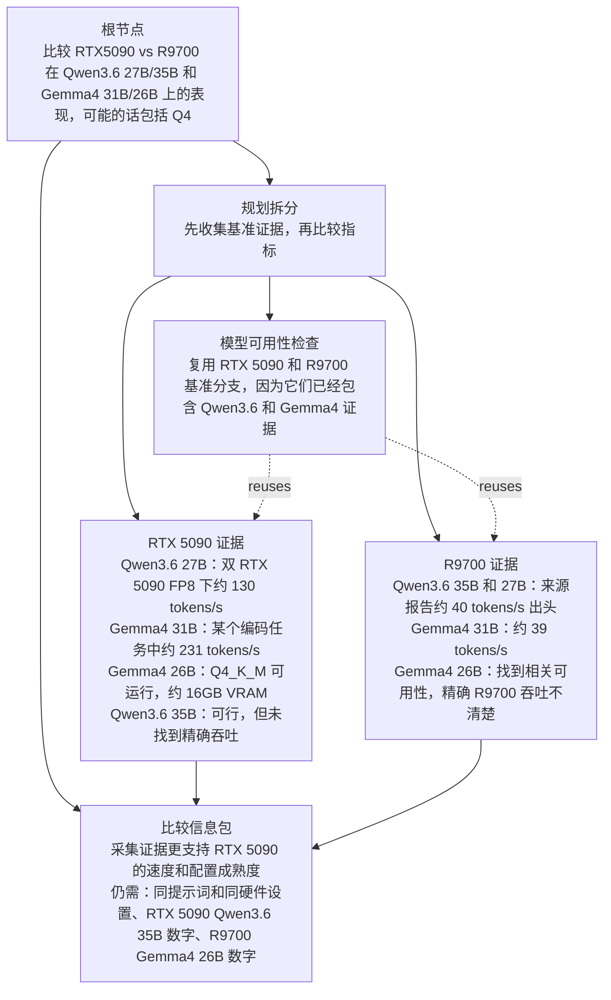

<div align="center">
  

<h1>Kazusa 认知核心</h1>

<p><strong>面向长期在线数字角色的自演化认知运行时。</strong></p>

<p>
    <a href="README.md">English</a>
    ·
    <a href="docs/HOWTO.md">运行指南</a>
  </p>

<p>
    
    
    
    
    
  </p>
</div>

## Kazusa 能实现什么

Kazusa 不是一个通用助手外壳。它是一套承载自演化角色大脑的认知运行时：
把身份、关系连续性、检索、认知、对话、记忆、反思和未来跟进
放在同一个可检查的服务核心里。

同一个大脑可以被 Discord、NapCat QQ、浏览器调试界面，或者任何遵守
服务 API 的新适配器调用。适配器保持轻量，只负责平台接入与投递边界。大脑服务
消费的是类型化的消息信封字段，而不是把 Discord、QQ 或调试通道协议的
原始语法当作认知主输入来解析。

如果只是想本地跑起来，可以直接看 [快速开始](#快速开始) 和
[运行指南](docs/HOWTO.md)。如果想理解子系统所有权，可以看
[运行分层](#运行分层)。

本文会反复用到几个核心术语：

- **适配器**：平台传输边界，把 Discord、QQ、调试界面或未来平台事件
  规范化成大脑服务 API。
- **MessageEnvelope**：类型化入站消息合约，供大脑、RAG 和认知阶段消费。
- **RAG 2**：返回证据的检索辅助智能体；它不决定角色立场，也不写最终措辞。
- **认知解析器**：有上限的 L1/L2/L2d 循环，决定立场、动作需求，以及是否还需要证据。
- **L3/dialog**：认知决定输出类型之后，负责最终可见措辞的阶段。
- **输出表面（surface）**：系统可产出的结果通道，例如可见文本、私有动作或无回复轨迹。
- **已接受任务（accepted task）/后台工作（background work）**：角色接受的持久延迟任务，由确定性代码持久化，
  路由给内部 worker，再通过认知重新进入系统。

从高层看，Kazusa 提供：

| 能力 | 含义 |
| --- | --- |
| 平台无关的角色大脑 | Discord、QQ、调试界面和未来适配器都接入同一个 FastAPI 大脑服务。 |
| 类型化消息边界 | 平台语法先被规范化为 `MessageEnvelope` 字段，再进入认知或 RAG。 |
| 有边界的实时回复路径 | 队列、相关性、认知解析器、被选择的证据能力、动作路由和 L3 输出表面都是显式阶段，有上限，也能检查负载。 |
| 多时间尺度记忆 | 最近聊天、短期对话进展、检索证据、持久记忆和已调度承诺彼此分开。 |
| 私念残留 | 已完成回合会留下很短的第一人称私人原因，只投给下一次 L2a 认知。 |
| RAG 2 证据检索 | 当认知提出需要时，辅助智能体检索用户资料、记忆、历史对话、实时事实、网页证据和召回状态。 |
| 分层认知 | 认知先决定立场、边界、判断、风格、动作需求和回复目标，再由被选择的 L3 输出表面渲染结果。 |
| 后台整合 | 已完成回合会根据文本、动作轨迹和输出表面更新持久记忆、关系状态、Cache2 失效、图片和进展。 |
| 已接受的延迟任务 | 已接受的提醒、文本任务和代码任务会被持久化、路由给内部后台 worker，并通过认知返回，而不是由 worker 直接发送。 |
| 聊天外反思 | 小时、每日和已提升反思作为审计记录保存；只有被提升后的上下文可以进入普通认知。 |
| 空闲自我认知 | 后台来源案例可以进入同一套解析器支持的角色路径，并遵守来源绑定投递和普通整合规则。 |
| 日历式后续行动 | 已接受的未来承诺和到期约定可以成为持久日历触发器，稍后运行新的认知。 |
| 事件日志可观测性 | 运行时、LLM、RAG、动作路由、输出表面、反思、自我认知、dispatcher、整合和数据库操作都会发出脱敏运行事件。 |

## 你可以用它构建什么

| 场景 | 为什么适合 |
| --- | --- |
| 长期陪伴型角色 | 关系记忆、短期对话流、角色状态和反思系统相互分离，但能在回复中协同。 |
| 群聊角色机器人 | 队列裁剪、类型化被提及对象、原生回复补全和适配器级投递，让大脑能承受嘈杂频道。 |
| 本地模型角色实验室 | 路由级 OpenAI 兼容模型配置，让较弱的本地模型处理更窄、更分阶段的提示词。 |
| 记忆和 RAG 实验 | RAG 2、Cache2、用户作用域记忆、共享记忆演化和历史对话搜索都足够模块化，便于单独检查。 |
| 跨平台适配器实验 | 新适配器只需要把平台事件规范化成服务合约，并渲染返回消息。 |
| 空闲认知和反思实验 | 自我认知和反思使用有边界的来源包与共享认知边界，不把平台适配器变成代理。 |
| 承诺与后续行动流程 | 已接受的未来承诺可以被校验、持久化、去重，并在之后通过持久日历触发重新进入系统。 |

## 支持的 LLM

Kazusa 围绕 OpenAI 兼容接口设计，而不是绑定某一个托管供应商。技术上，
所有 OpenAI 兼容的聊天补全接口都可以接入；路由级配置也允许不同阶段使用不同模型。

实践中，可以把 Kazusa 配成一张模型路由表：轻量或本地模型处理大部分
结构化推理；在更看重表达或生成质量的阶段，可以换用另一个托管模型。
下面这些路由名就是运行指南中记录的配置句柄。一种可运行的配置示例如下：

| 路由 | 示例模型 | 示例来源 |
| --- | --- | --- |
| `RELEVANCE_AGENT_LLM` | `local-model` | `http://localhost:1234/v1` |
| `VISION_DESCRIPTOR_LLM` | `local-model` | `http://localhost:1234/v1` |
| `MSG_DECONTEXTUALIZER_LLM` | `local-model` | `http://localhost:1234/v1` |
| `RAG_PLANNER_LLM` | `local-model` | `http://localhost:1234/v1` |
| `RAG_SUBAGENT_LLM` | `local-model` | `http://localhost:1234/v1` |
| `WEB_SEARCH_LLM` | `local-model` | `http://localhost:1234/v1` |
| `COGNITION_LLM` | `local-model` | `http://localhost:1234/v1` |
| `BOUNDARY_CORE_LLM` | `local-model` | `http://localhost:1234/v1` |
| `BACKGROUND_WORK_LLM` | `local-model` | `http://localhost:1234/v1` |
| `CODING_AGENT_PM_LLM` | `local-model` | `http://localhost:1234/v1` |
| `CODING_AGENT_PROGRAMMER_LLM` | `local-model` | `http://localhost:1234/v1` |
| `DIALOG_GENERATOR_LLM` | `deepseek-v4-flash` | `https://api.deepseek.com` |
| `CONSOLIDATION_LLM` | `local-model` | `http://localhost:1234/v1` |
| `JSON_REPAIR_LLM` | `local-model` | `http://localhost:1234/v1` |
| `EMBEDDING` | `text-embedding-nomic-embed-text-v2-moe` | `http://localhost:1234/v1` |

这张表只是示例，不是固定要求。任何路由都可以指向任意 OpenAI 兼容端点，
前提是它能满足该阶段的延迟和质量需求。

代码代理使用独立的一等 PM 和 programmer 路由。最终综合有意复用
`CODING_AGENT_PM_LLM`；没有单独的代码综合器路由。每个代码代理路由都必须配置
base URL、API key 和模型。

聊天 LLM 调用统一通过 `LLInterface`。每个模块通过 `LLMCallConfig`
拥有自己的路由、模型、生成预算和 thinking 开关；接口层负责后端识别、
provider 会话、请求映射、响应归一化和模型卸载重试。公开的 token 预算
配置使用 `max_completion_tokens`。Thinking 默认关闭。启用后，接口目前会
为 Gemma 4、Qwen3 系列模型名，以及 Qwen 兼容的 Qwopus 3.x 模型名映射
provider 专属 thinking 控制。运行时合约见
[LLM 接口文档](src/kazusa_ai_chatbot/llm_interface/README.md)。

已测试的聊天模型家族：

- Gemma 4 26B MoE
- Qwen3.6 27B
- DeepSeek v4

Kazusa 还需要一个 OpenAI 兼容的嵌入端点，用于历史对话、记忆检索和向量
搜索功能。本地部署通常使用 LM Studio，也可以使用其他 OpenAI 兼容端点。

## 架构总览

这是完整的顶层地图，不是单个聊天回合的最短路径。先读这条实线实时路径：
`adapter -> brain service -> queue/intake -> evidence -> cognition -> dialog -> persistence/scheduler`。
然后再把各个子图当作所有权地图：辅助智能体、解析器能力、网页来源、
复杂任务研究、已接受任务、后台 worker 和持久后台系统分别由谁负责。

节点标签里的所有权标记是有意保留的：`[LLM]` 节点做语义判断，
`[deterministic]` 节点负责校验或移动状态，`[worker]` 节点执行有边界的
延迟工作。精确的子智能体命名和文档词汇见
[子智能体接口指南](docs/SUBAGENT_INTERFACES.md)。

```mermaid
flowchart TD
    A["适配器<br/>Discord、NapCat QQ、调试界面、未来适配器"]
    B["FastAPI 大脑服务<br/>/chat、health、ops 快照、发送回执、运行时适配器注册表"]
    C["进程内聊天队列<br/>丢弃/合并策略、入站持久化"]
    D["入口处理与类型化回合组装<br/>MessageEnvelope、回复补全、历史、媒体、来源作用域"]
    E{"服务图"}
    F["媒体描述器<br/>图片/音频观察"]
    G["相关性门控"]
    H["提示词安全上下文通道<br/>conversation_progress<br/>internal_monologue_residue<br/>past_dialog_cognition<br/>已提升反思和成长上下文"]
    N["不进入角色回合<br/>空 ChatResponse"]
    J["适配器投递边界<br/>ChatResponse messages、mentions、delivery receipts"]
    K["回合后状态工作<br/>对话进展、残留、整合、Cache2 失效"]
    DB[("通过 DB facade 访问 MongoDB<br/>conversation、profiles、user memory、shared memory、calendar、reflection、traces、event logs")]
    SUP["共享支撑<br/>LLM 接口和路由配置<br/>Cache2 和 embeddings<br/>web/MCP 运行时<br/>脱敏事件日志和受保护 LLM trace"]

    A -->|ChatRequest + MessageEnvelope| B
    B --> C
    C --> D
    D --> E
    E -->|attachments| F
    F --> G
    E -->|text-only or described media| G
    G -->|should respond| H
    G -->|should not respond| N
    H --> P0
    P3 -->|visible text surfaces| J
    P4 -->|private action or no visible surface| K
    J --> K
    K --> CONS
    K --> DB
    SUP -.-> B

    subgraph Persona["角色回合"]
        P0["Stage 0<br/>消息去语境化"]
        P1["Stage 1<br/>有边界的认知解析器"]
        P2["Stage 2<br/>记忆生命周期专门处理"]
        P2A["Stage 2a<br/>已接受任务和 background-work 入队"]
        P3["Stage 3<br/>L3 文本表面和对话"]
        P4["私有最终化<br/>无回复/动作轨迹"]
        PT["EpisodeTrace<br/>动作结果和输出表面"]
        P0 --> P1
        P1 --> P2
        P2 --> P2A
        P2A -->|speak selected| P3
        P2A -->|no visible text surface| P4
        P3 --> PT
        P4 --> PT
    end

    subgraph Resolver["认知解析器循环"]
        R0["解析器状态<br/>目标进展、观察、待恢复项"]
        R1["L1<br/>情绪和互动潜台词"]
        R2["L2a<br/>意识"]
        R3["L2b<br/>边界评估"]
        R4["L2c1 + L2c2<br/>判断和社交语境"]
        R5["L2d [LLM]<br/>动作和能力选择"]
        R0 --> R1
        R1 --> R2
        R2 --> R3
        R3 --> R4
        R4 --> R5
    end

    subgraph ResolverCaps["认知选择的解析器能力"]
        RC0["确定性能力执行器 [deterministic]<br/>每轮一个即时请求"]
        RC1["local_context_recall<br/>RAG 2 证据"]
        RC2["public_answer_research<br/>复杂任务解析器"]
        RC3["human_clarification<br/>待处理 HIL 行"]
        RC4["approval_preparation<br/>待审批行"]
        RC5["self_goal_resolution<br/>私有内部来源处理"]
        RC6["解析器观察<br/>下一轮使用的提示词安全结果"]
        RC0 --> RC1
        RC0 --> RC2
        RC0 --> RC3
        RC0 --> RC4
        RC0 --> RC5
        RC1 --> RC6
        RC2 --> RC6
        RC3 --> RC6
        RC4 --> RC6
        RC5 --> RC6
    end

    subgraph RAG2["RAG 2 辅助智能体家族"]
        RG0["call_quote_aware_rag_supervisor"]
        RG1["rag_initializer<br/>slot planning"]
        RG2["rag_dispatcher / executor / evaluator<br/>清空 unknown slots"]
        RG3["rag_finalizer<br/>紧凑证据答案"]
        RA1["live_context_agent<br/>runtime_context_provider、目标解析、网页委派"]
        RA2["conversation_evidence_agent<br/>conversation_search_agent<br/>conversation_filter_agent<br/>conversation_aggregate_agent<br/>conversation_keyword_agent"]
        RA3["memory_evidence_agent<br/>persistent_memory_search_agent<br/>persistent_memory_keyword_agent<br/>user_memory_evidence_agent"]
        RA4["person_context_agent<br/>user_lookup_agent<br/>user_list_agent<br/>user_profile_agent<br/>relationship_agent<br/>user_image_retriever_agent"]
        RA5["web_agent3"]
        RA6["recall_agent<br/>ProgressCollector<br/>ActiveCommitmentCollector<br/>CalendarRunCollector<br/>HistoryEvidenceCollector"]
        RG0 --> RG1
        RG1 --> RG2
        RG2 --> RA1
        RG2 --> RA2
        RG2 --> RA3
        RG2 --> RA4
        RG2 --> RA5
        RG2 --> RA6
        RA1 --> RG3
        RA2 --> RG3
        RA3 --> RG3
        RA4 --> RG3
        RA5 --> RG3
        RA6 --> RG3
    end

    subgraph Web3["web_agent3 来源子智能体"]
        W0["router/generator -> executor -> evaluator -> finalizer"]
        W1["web_read<br/>直接读取 HTTP(S) URL"]
        W2["web_search<br/>配置后使用 SearXNG 搜索"]
        W3["nhentai<br/>启用 token 后可查 metadata/search"]
        W4["bilibili<br/>SDK 可用时公开读取/搜索"]
        W0 --> W1
        W0 --> W2
        W0 --> W3
        W0 --> W4
    end

    subgraph Complex["复杂任务解析器"]
        X0["公开 IO<br/>resolve_complex_task request/context/options"]
        X1["图规划器"]
        X2["活动节点解析器"]
        X3["折叠审查"]
        X4["自底向上综合<br/>知识包"]
        X5["证据子智能体<br/>collect_evidence"]
        X6["算法子智能体<br/>evaluate_expression / missing_expression"]
        X0 --> X1
        X1 --> X2
        X2 --> X5
        X2 --> X6
        X2 --> X3
        X3 --> X2
        X2 --> X4
    end

    subgraph Actions["动作规格、已接受任务和后台 worker"]
        A0["ActionSpec 物化和评估器 [deterministic]"]
        A1["可见/私有能力<br/>speak<br/>memory_lifecycle_update<br/>accepted_task_request<br/>accepted_task_status_check<br/>future_speak<br/>trigger_future_cognition"]
        A2["内部可执行动作<br/>apply_memory_lifecycle_update<br/>background_work_request"]
        AT["accepted_task 生命周期<br/>身份、重复拒绝、result-ready 状态"]
        BW0["background_work 运行时 [LLM route only]<br/>router 只选择 worker"]
        BW1["text_artifact worker [worker]<br/>任务 router + generator"]
        BW2["future_speak worker [deterministic worker]<br/>调度未来认知"]
        BW3["coding_agent worker [worker]<br/>代码阅读答案 / 新 artifact 提案<br/>不应用 patch、不执行命令"]
        A0 --> A1
        A1 --> A2
        A2 --> AT
        AT --> BW0
        BW0 --> BW1
        BW0 --> BW2
        BW0 --> BW3
    end

    subgraph Maintenance["后台和持久子系统"]
        CAL["calendar_scheduler<br/>future_cognition、commitment_due_cognition、reflection_phase_slot、recurring_self_check"]
        SC["self_cognition worker<br/>active commitment、recent dialog、topic follow-up、group review cases"]
        REF["reflection_cycle worker<br/>hourly slot、daily channel、global promotion、affect settling"]
        ME["memory_evolution<br/>共享记忆插入、替换、合并、种子重置"]
        GG["global_character_growth<br/>已提升特质漂移"]
        CONS["consolidation<br/>目标计划 -> 来源视图 -> 通道路由 -> 通道审查 -> 写入意图校验 -> 持久化"]
        DISP["dispatcher [deterministic]<br/>可信发送的已注册适配器回调投递"]
        PRO["proactive_output<br/>带权限的预览/outbox 合约，无生产发送路径"]
        CAL --> SC
        CAL --> REF
        REF --> ME
        REF --> GG
        REF --> SC
        SC --> DISP
        SC --> CONS
        CONS --> ME
        GG --> H
        ME --> H
    end

    P1 --> R0
    R5 -->|capability requested| RC0
    RC6 -->|observation or pending resume| R0
    R5 -->|terminal semantic action requests| A0
    A0 --> P2
    P2A --> AT
    BW1 -->|accepted_task_result_ready| P1
    BW3 -->|accepted_task_result_ready| P1
    BW2 --> CAL
    CAL -->|future or due source case| SC
    SC -->|shared cognition path| P0
    RC1 --> RG0
    RG3 --> RC6
    RC2 --> X0
    X4 --> RC6
    RA5 --> W0
    X5 --> W0
    CONS --> DB
    AT --> DB
    BW0 --> DB
    CAL --> DB
    REF --> DB
    ME --> DB
    GG --> DB
    SUP -.-> R1
    SUP -.-> RG0
    SUP -.-> K
```



Kazusa 的实时回复路径是一个认知核心，不是聊天机器人外壳，也不是通用工具
执行框架。适配器把平台事件规范化成类型化服务合约；大脑服务负责队列、
身份、回复补全、历史、回合构造和图执行。

图中命名的专门组件是各自家族内部的子智能体和 worker，不是一套全局通用的
运行时抽象。RAG 辅助智能体检索本地、资料、记忆、对话、召回、实时和网页
证据；`web_agent3` 拥有自己的来源子智能体；复杂任务解析器拥有解析器内部的
证据和算法子智能体；后台工作拥有延迟任务 worker。顶层地图只粗略呈现
coding-agent worker；它内部的 fetching、reading、writing、PM 和 programmer
角色由 [Coding Agent ICD](src/kazusa_ai_chatbot/coding_agent/README.md) 负责。

解析器在每个循环里都保留同一套 L1 -> L2 -> L2d 认知栈。L2d 可以用被选择的
动作规格结束，也可以通过 `local_context_recall`、`public_answer_research`、
`human_clarification`、`approval_preparation` 或 `self_goal_resolution` 请求
一次有边界的能力观察。观察会投射进下一轮认知；证据永远不会自己作为角色说话。

完整 RAG 2 只在 L2d 选择 `local_context_recall` 时运行。另有一条独立的
第一轮共享记忆预热通道，可能会在第一次认知前把已确认的共享记忆行投射到
L2a；它不是解析器能力观察，也不会让检索证据变成角色人格。

被选择的可见文本输出会通过 `ChatResponse` 和发送回执返回给适配器。私有动作
结果、无可见输出的决定和输出表面轨迹，仍然可以进入回合后进展、整合、
Cache2 失效、残留记录、日历状态、反思和自我认知，而不会创建平台发送。

延迟用户任务由认知选择为已接受任务。L2d 看到的是语义化的
`accepted_task_request` 和 `accepted_task_status_check` affordance；确定性
ActionSpec 执行只有在重复拒绝和持久生命周期保存之后，才会把新的已接受任务
物化到内部 `background_work` 执行器。只负责路由的 background-work router
会在实时回合之后只选择 worker。worker 本地分类留在被选中的 worker 内：
text-artifact worker 有自己的任务 router/generator，coding-agent worker 有自己的
读/写主管，再返回有边界的答案或提案 artifact。已完成的 accepted task 会作为
`accepted_task_result_ready` 认知返回，而不是由 worker 直接发送。旧的
background-artifact 和旧的 background-work 行仍然只是兼容数据，不是新的
面向模型的运行时合约。

## 真实调试示例流程

下面前三个例子来自真实 debug `/chat` 接口。这个本地调试路径会把与运行时
适配器相同形状的类型化聊天请求送进大脑服务。例 4 来自复杂任务解析器入口，
它返回的是研究信息包（packet），而不是可见聊天文本。这些例子采集于 2026 年 7 月 2 日，
之后翻译成中文并为 README 读者压缩。它们不是完整 trace dump。内部 id、
cache key、原始数据库行和实现字段名都被有意省略。图里把类型化 payload
渲染成可读文本。

每张图从左往右读。所有例子都使用同样五个检查点：

1. **消息 / 请求** 是聊天平台、调试客户端或解析器入口收到的内容。
2. **抽取** 是大脑收到的类型化、平台无关消息信封和已补全上下文的人类可读摘要。
3. **上下文 / 证据** 是用于决策的已检索对话证据、回复上下文或结构化任务状态。
4. **决策** 是聊天回合中的角色级判断，或非聊天任务信息包的解析器级综合规则。
5. **输出** 是用户看到的内容、为后续工作创建的持久交接，或返回给下一阶段的语义信息包。

这对应系统边界：适配器规范化平台事件，RAG 返回证据，认知决定角色立场，
dialog 拥有可见措辞，确定性子系统拥有校验、持久化、调度、适配器投递和持久任务生命周期。

### 示例 1：私聊连续性召回

这个私聊例子展示系统如何借助最近对话上下文回答追问，而不是把消息当成孤立问题。



关键传递的是“被记住的担忧”。适配器只需要把干净的私聊消息送进大脑。
RAG/检索提供之前关于面试担忧的证据，但它不写回复。认知判断用户是在检查
连续性，因此 dialog 回复会确认这段记忆，并加上一句轻量的情绪关照。

### 示例 2：群聊回复与提及解析

这个群聊例子展示回复目标和直接提及如何变成语义上下文。角色既理解技术问题，
也理解被要求站队的社交压力。



关键传递的是直接点名和回复上下文的组合。适配器把平台特有的提及和回复语法
规范化为类型化消息信封字段；README 图把这些字段渲染成可读文本。认知随后
判断社交情境：Kazusa 被拉进了分歧里，所以可见回答会承认质量风险，但不会在
缺乏足够依据时替任何一方下结论。

### 示例 3：已接受未来提醒交接

这个例子展示面向用户的延迟任务。角色在实时聊天里接受提醒，同时由确定性
子系统为未来创建持久工作。



关键传递的是未来任务，而不是队列机制。认知决定 Kazusa 是否应该接受提醒。
做出这个决定之后，确定性代码保存 accepted task，并把内部未来工作入队。
实现上，认知选择 `accepted_task_request` action spec；确定性执行持久化它，
创建内部 `background_work` 请求，并由 `future_speak` 调度一次
`future_cognition` 日历运行。到期时，自我认知、dialog 和 dispatcher 再决定
是否以及如何发送提醒。后台 worker 不直接写最终聊天文本。

### 示例 4：复杂公开研究信息包

这个非聊天解析器案例展示一个宽泛基准请求如何被拆成来源绑定的证据和比较信息包。
它不会产生可见 dialog；它返回研究信息包，供之后的认知、检查或答案综合使用。
这些基准数字是 2026 年 7 月 2 日采集到的 trace 内容，不是当前硬件建议。



采集到的解析器树展示了任务如何拆解。规划器先把证据收集和比较分开。
证据分支分别收集每块 GPU 的事实，模型可用性检查复用已经收集的证据，
最终信息包会明确保留不被证据支持的比较。



关键传递的是证据和结论之间的边界。解析器把一个宽泛请求拆成更小的证据工作。
每个工作返回很短的来源绑定摘要和 caveat。当后续分支询问已经回答过的内容时，
树会指回现有证据，而不是把它当成新事实。最终信息包对 AI 开发者有用，是因为
它把系统现在能说什么，和在做出有信心的公开比较前仍需验证什么，清楚地区分开。

## 设计原则

**LLM 负责语义，确定性代码负责机制**

LLM 阶段判断意义：回复相关性、缺失证据、记忆含义、已接受承诺、角色立场、
动作选择和输出意图。确定性代码负责校验、持久化、限制、缓存失效、调度、
适配器投递和可审计性。

**证据不是人格**

RAG 回答“我们知道什么？”认知回答“这对当前 Kazusa 意味着什么？”
L2d 回答“需要哪些动作或输出表面？”L3/dialog 回答“被选择的输出应该如何渲染？”

**记忆有所有权边界**

Kazusa 不把所有上下文压平成一个提示词。即时表面文本、对话进展、检索证据、
持久记忆、已提升反思和日历调度承诺，各自有独立生命周期。

私念残留通道是一个单独的短期通道。它保存已完成回合中的一条紧凑第一人称原因，
并且只作为 `internal_monologue_residue_context` 投射到 L2a。它不是
`reflection_summary`，不是持久记忆，不是可见 dialog 计划，也不是日历输入。

**反思不能绕过实时聊天**

反思是更慢的意义整理工作。原始反思输出会保存以供检查，但普通认知只接收有边界、
已提升、经过门控的上下文。反思 worker 还拥有每日睡眠/醒来情绪沉降流程，
在实时回复路径之外平滑持久角色心情和整体气氛。

**适配器是传输边缘**

平台适配器解析平台事件，规范化类型化信封，调用大脑服务，并投递返回消息。
角色身份、记忆、RAG、认知和日历调度都留在平台无关核心里。

## 运行分层

| 层 | 负责 | 关键文档 |
| --- | --- | --- |
| 适配器 | Discord、NapCat QQ、调试界面传输和平台渲染 | [适配器 ICD](src/adapters/README.md), [运行指南](docs/HOWTO.md#adapters) |
| 控制台 | 本地操作者认证、服务生命周期、进程日志、审计、静态 UI、调试聊天交接 | [控制台 ICD](src/control_console/README.md) |
| 大脑服务 | HTTP API、队列、图启动、健康检查、发送回执、运行时适配器注册 | [大脑服务 ICD](src/kazusa_ai_chatbot/brain_service/README.md) |
| 消息信封 | 类型化入站内容、提及、回复、附件、收件人和广播状态 | [消息信封 ICD](src/kazusa_ai_chatbot/message_envelope/README.md) |
| LLM 接口 | 后端兼容聊天 LLM 调用、provider 会话、诊断和卸载重试 | [LLM 接口 ICD](src/kazusa_ai_chatbot/llm_interface/README.md) |
| 对话进展 | 认知使用的短期回合状态，用来避免循环和过时重开 | [对话进展](src/kazusa_ai_chatbot/conversation_progress/README.md) |
| 私念残留 | 只加载到 L2a 认知的短期私人第一人称残留 | [私念残留 ICD](src/kazusa_ai_chatbot/internal_monologue_residue/README.md) |
| 认知解析器 | 有边界的循环状态、能力观察、HIL/待恢复项和循环 trace | [认知解析器 ICD](src/kazusa_ai_chatbot/cognition_resolver/README.md) |
| RAG 2 | slot 驱动的辅助智能体检索和 Cache2 证据投射 | [RAG 2](src/kazusa_ai_chatbot/rag/README.md) |
| 认知和 dialog | 角色立场、边界、判断、风格、视觉指令和最终措辞 | [认知节点](src/kazusa_ai_chatbot/nodes/README.md) |
| 动作规格 | L2d 动作残留、能力注册表、评估器、结果、输出表面和 trace | [动作规格](src/kazusa_ai_chatbot/action_spec/README.md) |
| 已接受任务 | 角色接受的用户延迟工作生命周期 | [已接受任务 ICD](src/kazusa_ai_chatbot/accepted_task/README.md) |
| 后台工作 | 内部延迟工作执行器、worker 路由和结果交接 | [后台工作 ICD](src/kazusa_ai_chatbot/background_work/README.md) |
| 代码代理 | 独立代码任务主管、源码获取、只读代码答案和新 artifact 提案 | [Coding Agent ICD](src/kazusa_ai_chatbot/coding_agent/README.md) |
| 整合 | 持久目标规划、通道路由/审查、写入意图校验和按目标分离的持久化 | [整合 ICD](src/kazusa_ai_chatbot/consolidation/README.md) |
| 数据库 | MongoDB 集合所有权、embeddings、索引和公开持久化 helper | [数据库 ICD](src/kazusa_ai_chatbot/db/README.md) |
| 事件日志 | 脱敏运行遥测、状态快照、统计和导出合约 | [事件日志 ICD](src/kazusa_ai_chatbot/event_logging/README.md) |
| 日历调度器 | 未来认知、到期承诺检查和反思阶段槽位的持久类型化触发时间 | [日历调度器 ICD](src/kazusa_ai_chatbot/calendar_scheduler/README.md) |
| Dispatcher | 面向适配器的投递校验和回调传输 helper | [Dispatcher](src/kazusa_ai_chatbot/dispatcher/README.md) |
| 自我认知 | 空闲来源收集、自我认知回合、路由追踪和来源绑定投递 | [自我认知](src/kazusa_ai_chatbot/self_cognition/README.md) |
| 反思循环 | 后台反思运行、提升门控、提示词安全反思上下文 | [反思循环 ICD](src/kazusa_ai_chatbot/reflection_cycle/README.md) |
| 记忆演化 | curated 共享记忆生命周期、谱系、种子重置、已提升记忆写入 | [记忆演化 ICD](src/kazusa_ai_chatbot/memory_evolution/README.md) |
| 全局角色成长 | 从已批准反思记忆中缓慢漂移出的已提升特质 | [全局角色成长 ICD](src/kazusa_ai_chatbot/global_character_growth/README.md) |
| 主动输出 | 未来自主联系路径的权限化预览/outbox 合约 | [主动输出 ICD](src/kazusa_ai_chatbot/proactive_output/README.md) |

其他项目文档：

| 文档 | 用途 |
| --- | --- |
| [README.md](README.md) | 英文项目概览和架构地图 |
| [docs/HOWTO.md](docs/HOWTO.md) | 本地设置、环境变量、运行命令、适配器、测试 |
| [文档指南](docs/DOCUMENTATION_GUIDE.md) | 文档角色、事实来源层级、模块 README 规则和中英文一致性 |
| [子智能体接口指南](docs/SUBAGENT_INTERFACES.md) | 跨家族子智能体和 worker 文档词汇 |
| [开发计划注册表](development_plans/README.md) | 活跃、归档、参考和路线图文档 |

## 快速开始

Kazusa 需要 MongoDB，以及 OpenAI 兼容的聊天和嵌入端点。LM Studio 适合本地开发，
但也可以使用任何兼容端点。启动服务之前，请创建本地 `.env`，写入 MongoDB、
聊天路由和嵌入设置。所有路由级模型环境变量都记录在
[docs/HOWTO.md](docs/HOWTO.md#local-setup)。

```powershell
python -m venv venv
venv\Scripts\activate
pip install -U pip
pip install -e ".[dev]"
```

启动大脑之前，先加载角色档案：

```powershell
python -m scripts.load_character_profile personalities/kazusa.json
```

普通本地运行会先启动 buildless Python/FastAPI 控制台，再通过控制台启动或停止
大脑和适配器：

```powershell
kazusa-control-console --host 127.0.0.1 --port 8765
```

只有绕过控制台做开发时，才直接运行大脑服务：

```powershell
kazusa-brain --host 0.0.0.0 --port 8000
```

也可以直接使用 Uvicorn：

```powershell
uvicorn kazusa_ai_chatbot.service:app --host 0.0.0.0 --port 8000
```

启动浏览器调试适配器：

```powershell
python -m adapters.debug_adapter --brain-url http://localhost:8000 --port 8080
```

然后打开 `http://localhost:8080`。

## 仓库结构

```text
src/
  control_console/              本地操作者控制台、生命周期、日志、审计、静态 UI
  adapters/                    平台适配器和调试 UI
  kazusa_ai_chatbot/
    brain_service/             服务 API、图、入口处理、健康检查、回合后衔接
    message_envelope/          适配器到大脑的类型化消息合约
    llm_interface/             聊天 LLM 调用兼容层和 ICD
    cognition_resolver/        有边界的解析器循环、能力观察、HIL 状态
    nodes/                     角色人格、认知和 dialog 阶段
    action_spec/               模态无关动作合约、注册表、结果
    accepted_task/             用户可见的已接受延迟任务生命周期
    background_work/           内部延迟工作执行器和 worker
    coding_agent/              独立代码任务主管和子智能体
    consolidation/             持久整合 helper、通道路由和 ICD
    rag/                       RAG 2 辅助智能体、混合检索、Cache2
    conversation_progress/     短期回合记忆
    internal_monologue_residue/ L2a 使用的私念残留通道
    db/                        MongoDB facade、schema、集合所有者
    event_logging/             脱敏运行遥测接口和 ICD
    calendar_scheduler/        持久类型化触发调度器和迁移脚本支持
    dispatcher/                面向适配器的投递校验和交接
    self_cognition/            空闲自我认知触发、追踪和投递
    reflection_cycle/          后台反思和提升
    memory_evolution/          共享记忆生命周期和种子重置
    global_character_growth/   缓慢的已提升角色成长特质
    proactive_output/          权限化主动输出预览合约
  scripts/                     运维和维护 CLI
docs/
  HOWTO.md                     设置、运行命令、环境变量、测试
development_plans/             已批准、已归档和参考计划注册表
tests/                         确定性、live DB 和 live LLM 测试套件
resources/
  avatar.png                   README 头像资源
```

## 测试

默认测试运行会通过 `pytest.ini` 排除 live DB 和 live LLM 测试。

```powershell
venv\Scripts\python -m pytest -q
```

Live LLM 测试必须一次只运行一个，并检查输出。Live DB 测试需要 MongoDB。
项目测试约定见 [docs/HOWTO.md](docs/HOWTO.md#testing)。

## 项目状态

Kazusa 认知核心是 alpha 阶段的实验基础设施，用于长期在线数字角色。主运行时
已经可以作为本地大脑服务使用，包含适配器、记忆、检索、自我认知、反思和调度；
但部分自主联系表面仍然有意停留在权限化预览合约中，而不是生产发送路径。

## 许可证

Kazusa 认知核心使用 [GNU Affero General Public License v3.0](LICENSE) 发布。
