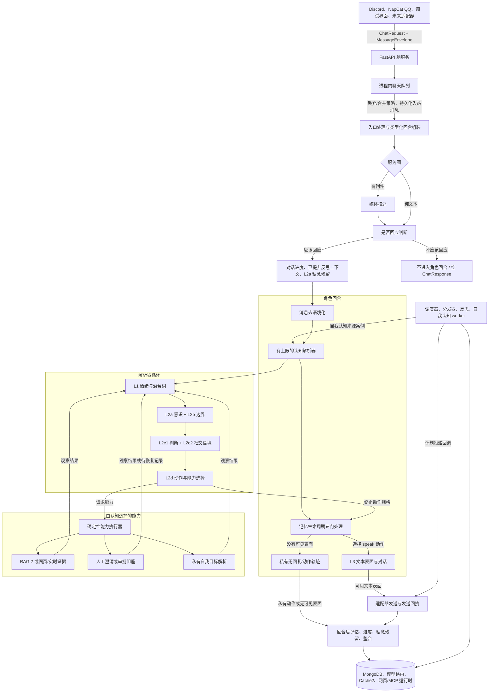

<div align="center">
  

<h1>Kazusa 认知核心</h1>

<p><strong>面向持久在线角色的自演化认知运行时。</strong></p>

<p>
    <a href="README.md">English</a>
    ·
    <a href="docs/HOWTO.md">运行指南</a>
  </p>

<p>
    
    
    
    
    
  </p>
</div>

## 项目定位

Kazusa 认知核心不是“给聊天平台套一层模型”的自动回复程序。它更像一个长期在线角色的心理与记忆运行时：角色有稳定身份，有和用户逐步积累的关系，有短期对话状态，也有后台反思和自我调整。

Discord、NapCat QQ、浏览器调试界面，或者未来的新平台，都只是入口。平台适配器负责接收事件、整理消息、发送回复；角色的大脑、记忆、检索、认知、对话和调度都留在同一个平台无关的服务核心里。

这套边界的目的很明确：让角色不是依赖某个平台语法活着，而是通过统一的服务协议在不同平台上保持同一个自己。

## 核心能力

| 能力         | 说明                                         |
| ---------- | ------------------------------------------ |
| 平台无关的大脑服务  | Discord、QQ、调试界面和未来适配器都调用同一个 FastAPI 服务。    |
| 类型化消息入口    | 平台原始语法先被整理成 `MessageEnvelope`，再进入检索和认知。    |
| 有上限的实时链路   | 队列、是否回应、认知解析器、按需证据能力、动作路由和表面输出都有明确边界与上限。 |
| 多层记忆       | 最近对话、短期话题进度、检索证据、长期记忆、已提升反思和定时承诺分开管理。      |
| 私念残留       | 已完成回合会留下很短的第一人称私人原因，只投给下一次 L2a 认知参考。        |
| RAG 2 检索系统 | 由认知按需调用的辅助智能体负责查用户资料、长期记忆、历史对话、实时信息、网页证据和当前承诺。 |
| 分层认知       | 认知阶段决定立场、边界、判断、风格和回复目标；对话阶段只负责最终表达。        |
| 后台整合       | 回复返回后，再写入长期记忆、关系状态、图片摘要、短期进度，并让过期缓存失效。     |
| 聊天外反思      | 小时反思、每日反思和全局提升都在实时回复路径之外运行；原始反思不会直接进入普通认知。 |
| 空闲自我认知     | 后台来源案例可以进入同一套认知解析角色路径，并遵守来源绑定投递和正常整合规则。     |
| 未来承诺执行     | 被角色接受的未来承诺可以转成经过校验的计划任务，稍后通过已注册的平台适配器发送。   |
| 事件日志可观测性   | 运行时、LLM、检索、对话、反思、自我认知、调度和数据库操作都会写入脱敏事件。       |

## 适合做什么

| 场景      | 为什么适合                                          |
| ------- | ---------------------------------------------- |
| 长期陪伴型角色 | 关系记忆、短期对话状态、角色状态和反思系统彼此独立，又能在回复中协同。            |
| 群聊角色    | 队列会合并连续补充、丢弃突发噪声，并保留“谁在对谁说话”的结构信息。             |
| 本地模型实验  | 每个阶段可以配置不同的 OpenAI 兼容模型，弱一些的本地模型也只需处理边界清晰的小任务。 |
| 记忆和检索研究 | RAG 2、Cache2、用户作用域记忆、共享记忆演化、历史对话检索都可以单独观察和替换。  |
| 新平台接入   | 新平台只需要把平台事件整理成服务协议，再把服务返回的消息发回平台。              |
| 空闲认知和反思实验 | 自我认知与反思使用有边界的来源包和共享认知链路，不把平台适配器变成角色代理。       |
| 承诺与后续行动 | 已接受的未来事项会经过校验、去重、持久化和调度，而不是靠模型临场记住。            |

## 支持的模型

Kazusa 使用 OpenAI 兼容接口，不绑定某一家模型服务。只要提供 OpenAI 兼容的聊天补全接口，技术上都可以接入；不同阶段也可以配置不同模型。

可以把它理解成一张“模型分工表”：大部分结构化判断可以交给本地模型，某些更看重表达质量的阶段则可以单独接入托管模型。表里的“路由”就是运行指南中对应的配置项名称。下面是一种实际配置风格：

| 路由                         | 示例模型                                     | 示例来源                       |
| -------------------------- | ---------------------------------------- | -------------------------- |
| `RELEVANCE_AGENT_LLM`      | `local-model`                            | `http://localhost:1234/v1` |
| `VISION_DESCRIPTOR_LLM`    | `local-model`                            | `http://localhost:1234/v1` |
| `MSG_DECONTEXTUALIZER_LLM` | `local-model`                            | `http://localhost:1234/v1` |
| `RAG_PLANNER_LLM`          | `local-model`                            | `http://localhost:1234/v1` |
| `RAG_SUBAGENT_LLM`         | `local-model`                            | `http://localhost:1234/v1` |
| `WEB_SEARCH_LLM`           | `local-model`                            | `http://localhost:1234/v1` |
| `COGNITION_LLM`            | `local-model`                            | `http://localhost:1234/v1` |
| `DIALOG_GENERATOR_LLM`     | `deepseek-v4-flash`                      | `https://api.deepseek.com` |
| `DIALOG_EVALUATOR_LLM`     | `local-model`                            | `http://localhost:1234/v1` |
| `CONSOLIDATION_LLM`        | `local-model`                            | `http://localhost:1234/v1` |
| `JSON_REPAIR_LLM`          | `local-model`                            | `http://localhost:1234/v1` |
| `EMBEDDING`                | `text-embedding-nomic-embed-text-v2-moe` | `http://localhost:1234/v1` |

这张表只是示例，不是固定要求。每个路由都可以指向任意 OpenAI 兼容接口，前提是它能满足对应阶段的延迟和质量要求。

已经测试过的聊天模型包括：

- Gemma 4 26B MoE
- Qwen3.6 27B
- DeepSeek v4

除此之外，系统还需要一个 OpenAI 兼容的嵌入向量接口，用于历史对话、长期记忆和向量检索。本地部署通常可以使用 LM Studio，也可以换成其他 OpenAI 兼容后端服务。

## 高层架构



Kazusa 的实时链路是角色认知核心，不是给平台套一层自动回复，也不是通用工具执行框架。平台适配器把事件整理成类型化服务协议；脑服务负责排队、身份解析、回复上下文补全、历史读取、认知回合构造和图执行。

认知解析器在每一轮都保留同一套 L1 -> L2 -> L2d 认知。L2d 可以直接产出动作规格，也可以选择一次有上限的能力观察，例如 RAG 2 证据、网页/实时证据、人工澄清、审批准备，或只允许私有来源使用的自我目标解析。观察结果会投回下一轮认知；证据本身不会代替角色说话。

被选中的可见文本表面通过 `ChatResponse` 返回给适配器，并由发送回执补全平台消息 id。私有动作结果、无可见输出的判断和表面轨迹，仍然可以进入回合后的对话进度、整合、Cache2 失效、私念残留、调度、反思和自我认知流程，但不会自动变成平台发送。

## 设计原则

**语义判断交给 LLM，工程机制交给确定性代码**

是否回应、缺什么证据、记忆代表什么、承诺是否成立、角色此刻的立场和意图，这些属于语义判断。校验、持久化、限流、缓存失效、任务调度、平台投递和审计，则由确定性代码负责。

**证据不等于人格**

RAG 2 回答“现在知道什么”。认知解析器先判断当前目标和缺口；只有认知需要证据时，才把 RAG 2 当作能力调用。认知系统回答“这些信息对当前角色意味着什么”，对话系统回答“角色应该怎样说出来”。

**记忆必须分层**

Kazusa 不把所有上下文塞进一个超长提示词。最近文本、短期话题进度、检索证据、长期记忆、已提升反思、定时承诺，各自有独立生命周期。

私念残留是单独的短期通道。它只保存已完成回合里仍可能影响下一次理解的一条第一人称私人原因，并且只作为 `internal_monologue_residue_context` 进入 L2a。它不是 `reflection_summary`，不是长期记忆，不是可见对话计划，也不是调度器输入。

**反思不能绕过实时回复边界**

反思是后台的慢速理解过程。原始反思会被保存，方便检查和追溯；普通回复只能读取经过提升、门控和压缩后的反思上下文。

**平台只是边缘，不是大脑**

适配器负责平台语法和投递。角色身份、记忆、检索、认知、调度都属于平台无关核心。

## 运行分层

| 层      | 负责内容                                | 文档                                                                    |
| ------ | ----------------------------------- | --------------------------------------------------------------------- |
| 平台适配器  | Discord、NapCat QQ、调试界面的事件接入和消息投递    | [运行指南](docs/HOWTO.md)                                                 |
| 脑服务    | HTTP 接口、输入队列、图启动、健康检查、发送回执、运行时适配器注册 | [脑服务接口文档](src/kazusa_ai_chatbot/brain_service/README.md)              |
| 消息信封   | 入站文本、提及、回复、附件、收件人和广播状态              | [消息信封接口文档](src/kazusa_ai_chatbot/message_envelope/README.md)          |
| 对话进度   | 供认知使用的短期话题状态，避免重复和重开旧话题             | [对话进度](src/kazusa_ai_chatbot/conversation_progress/README.md)         |
| 私念残留   | 只进入 L2a 的短期第一人称私人原因通道                  | [私念残留接口文档](src/kazusa_ai_chatbot/internal_monologue_residue/README.md) |
| 认知解析器  | 有上限的循环状态、能力观察、人工澄清/恢复和解析轨迹            | [认知解析器](src/kazusa_ai_chatbot/cognition_resolver/)                    |
| RAG 2  | 基于待查事项的辅助智能体检索和 Cache2 证据投影         | [RAG 2](src/kazusa_ai_chatbot/rag/README.md)                          |
| 认知与对话  | 角色立场、边界、判断、风格、视觉指令和最终措辞             | [认知节点文档](src/kazusa_ai_chatbot/nodes/README.md)                    |
| 动作规格   | L2d 动作残留、能力注册表、评估器、结果、表面输出和追踪        | [动作规格](src/kazusa_ai_chatbot/action_spec/README.md)                  |
| 整合路由   | 持久化目标路由、写入意图校验和按目标分离的持久化             | [整合接口文档](src/kazusa_ai_chatbot/consolidation/README.md)             |
| 数据库层   | MongoDB 集合所有权、嵌入向量、索引和公共持久化接口       | [数据库接口文档](src/kazusa_ai_chatbot/db/README.md)                         |
| 事件日志   | 脱敏运行遥测、状态快照、统计和导出合约                   | [事件日志接口文档](src/kazusa_ai_chatbot/event_logging/README.md)              |
| 调度层    | 已接受未来承诺的校验、持久化、去重和延迟投递              | [调度器](src/kazusa_ai_chatbot/dispatcher/README.md)                     |
| 自我认知   | 空闲来源收集、自我认知回合、路由追踪和来源绑定投递             | [自我认知](src/kazusa_ai_chatbot/self_cognition/README.md)                |
| 反思循环   | 后台反思、提升门控和可进入提示词的反思上下文              | [反思循环接口文档](src/kazusa_ai_chatbot/reflection_cycle/README.md)          |
| 记忆演化   | 共享记忆的生命周期、谱系、种子重置和已提升记忆写入           | [记忆演化接口文档](src/kazusa_ai_chatbot/memory_evolution/README.md)          |
| 全局角色成长 | 从已提升反思记忆中缓慢形成的全局成长特质                | [全局角色成长接口文档](src/kazusa_ai_chatbot/global_character_growth/README.md) |
| 主动输出合约 | 未来自主联系路径的权限、预览和发件箱合约                | [主动输出接口文档](src/kazusa_ai_chatbot/proactive_output/README.md)          |

## 快速开始

Kazusa 需要 MongoDB、OpenAI 兼容的聊天补全接口，以及 OpenAI 兼容的嵌入向量接口。模型路由、环境变量、适配器启动方式和测试命令都放在 [运行指南](docs/HOWTO.md) 中。

```powershell
python -m venv venv
venv\Scripts\activate
pip install -U pip
pip install -e ".[dev]"
```

启动脑服务前，先加载角色档案：

```powershell
python -m scripts.load_character_profile personalities/kazusa.json
```

运行脑服务：

```powershell
kazusa-brain --host 0.0.0.0 --port 8000
```

也可以直接通过 Uvicorn 启动：

```powershell
uvicorn kazusa_ai_chatbot.service:app --host 0.0.0.0 --port 8000
```

启动浏览器调试界面：

```powershell
python -m adapters.debug_adapter --brain-url http://localhost:8000 --port 8080
```

然后打开 `http://localhost:8080`。

## 仓库结构

```text
src/
  adapters/                    平台适配器和调试界面
  kazusa_ai_chatbot/
    brain_service/             服务接口、图、入口处理、健康检查、回合后处理
    message_envelope/          适配器到脑服务的类型化消息合约
    cognition_resolver/        有上限的解析循环、能力观察和人工澄清状态
    nodes/                     角色、认知、对话和整合阶段
    action_spec/               模态无关的动作合约、注册表和结果
    consolidation/             持久化目标路由和整合接口文档
    rag/                       RAG 2 辅助智能体、混合检索和 Cache2
    conversation_progress/     短期话题状态
    internal_monologue_residue/ 只供 L2a 使用的短期私念残留通道
    db/                        MongoDB 门面、数据结构和集合所有者
    event_logging/             脱敏运行遥测接口和接口文档
    dispatcher/                延迟任务校验和平台投递衔接
    self_cognition/            空闲自我认知触发、追踪和投递
    reflection_cycle/          后台反思和提升
    memory_evolution/          共享记忆生命周期和种子重置
    global_character_growth/   缓慢形成的全局角色成长特质
    proactive_output/          带权限的主动输出合约
  scripts/                     运维和维护命令
docs/
  HOWTO.md                     安装、运行、环境变量和测试说明
development_plans/             已批准、已归档和参考计划
tests/                         确定性测试、live DB 测试和 live LLM 测试
resources/
  avatar.png                   README 顶部头像
```

## 测试

默认测试会通过 `pytest.ini` 排除 live DB 和 live LLM 用例。

```powershell
venv\Scripts\python -m pytest -q
venv\Scripts\python -m pytest -m "not live_db and not live_llm" -q
```

live LLM 用例需要一次只跑一个，并人工检查输出。live DB 用例需要可用的 MongoDB。完整约定见 [运行指南](docs/HOWTO.md#testing)。

## 项目状态

Kazusa 认知核心仍处于 alpha 阶段。当前主运行时已经可以作为本地脑服务使用，具备平台适配器、记忆、检索、自我认知、反思和调度能力；部分自主联系能力仍停留在带权限的预览合约中，还不是生产发送路径。

## 文档索引

| 文档                                                           | 用途                    |
| ------------------------------------------------------------ | --------------------- |
| [README.md](README.md)                                       | 英文项目概览与架构地图           |
| [README_CN.md](README_CN.md)                                 | 中文项目概览                |
| [运行指南](docs/HOWTO.md)                                        | 本地设置、环境变量、运行命令、适配器和测试 |
| [脑服务接口文档](src/kazusa_ai_chatbot/brain_service/README.md)     | HTTP 接口合约和适配器义务       |
| [消息信封接口文档](src/kazusa_ai_chatbot/message_envelope/README.md) | 类型化入站消息合约             |
| [数据库接口文档](src/kazusa_ai_chatbot/db/README.md)                | 持久化所有权和集合合约           |
| [私念残留接口文档](src/kazusa_ai_chatbot/internal_monologue_residue/README.md) | 短期私念残留生命周期和 L2a 专用边界 |
| [动作规格](src/kazusa_ai_chatbot/action_spec/README.md)              | 模态无关动作合约和追踪衔接        |
| [整合接口文档](src/kazusa_ai_chatbot/consolidation/README.md)         | 持久化目标路由和写入意图校验       |
| [事件日志接口文档](src/kazusa_ai_chatbot/event_logging/README.md)     | 脱敏遥测接口、事件分类和运维统计      |
| [认知解析器](src/kazusa_ai_chatbot/cognition_resolver/)                 | 有上限的解析循环、能力观察、人工澄清和轨迹 |
| [RAG 2](src/kazusa_ai_chatbot/rag/README.md)                 | 检索架构和证据投影             |
| [认知节点文档](src/kazusa_ai_chatbot/nodes/README.md)             | 分层认知、对话和节点包设计合约      |
| [自我认知](src/kazusa_ai_chatbot/self_cognition/README.md)              | 空闲认知来源收集、追踪和来源绑定投递    |
| [开发计划注册表](development_plans/README.md)                       | 当前计划、归档计划、参考文档和长期路线   |

## 许可证

Kazusa 认知核心使用 [GNU Affero General Public License v3.0](LICENSE) 发布。
