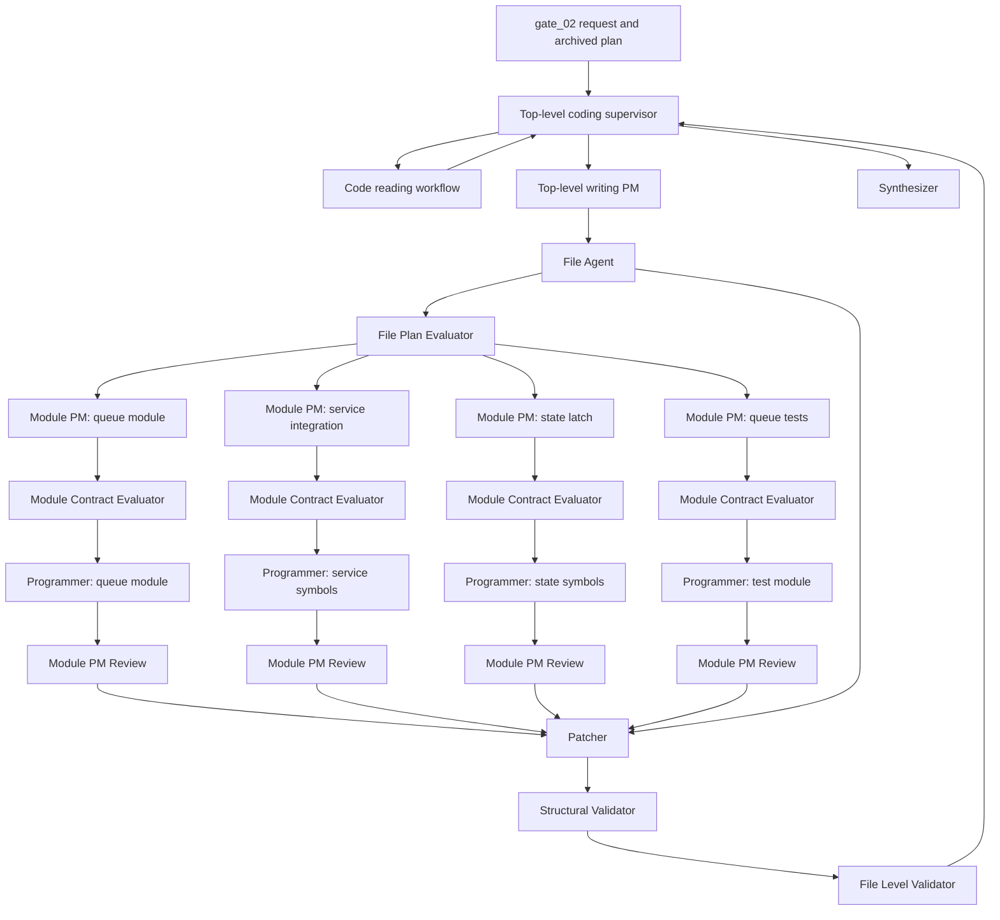

# Chat Input Queue Role IO Contract

Status: Phase 2 gate_02 final role-boundary contract.

This document records the expected role IO flow for the chat input queue task.
It is the target contract for prompt and workflow development. The flow uses
one top-level writing PM, one Module PM per accepted module/file assignment, and
module-level programmer calls. The only PM layers in this contract are the
top-level writing PM and Module PM.

## Gate Source

```json
{
  "case_id": "gate_02",
  "mode": "edit_existing_repository",
  "repo_url": "https://github.com/eamars/KazusaAIChatbot",
  "requested_ref": "06116589c8b68e9e8edc644fdf5e55eb8ecd34d2",
  "input_artifacts": [
    "development_plans/archive/completed/short_term/message_coalescing_queue_module_plan.md"
  ],
  "question": "Recreate the supplied archived development plan as a proposed patch artifact for this repository state. Return a patch proposal only, without mutating the real workspace."
}
```

## Hard Boundary

The top-level writing PM coordinates the whole writing task. It decides which
logical modules/files are needed and what semantic interfaces must exist. It
does not receive source scope, source owner candidates, concrete file paths,
line references, source excerpts, current-file context, imports, patch data, or
file-management state. It does not write code, choose concrete file paths,
create patches, or call reading/external workflows directly.

The File Agent owns concrete repository file management. It resolves semantic
file needs into repo-relative paths, file actions, base revisions, permission
checks, path ownership, current file context, and mutex identifiers. These file
management fields are for validators and the Patcher, not for the
programmer.

Each Module PM receives one accepted file assignment plus bounded reading facts,
File Agent context, and exact imports for its assigned module. The Module PM
emits one module-level programmer contract. It does not write code or patch
hunks.

Each programmer receives one module-level contract and returns one markdown
fenced Python code block. The programmer may define private helper symbols
inside that module when needed, but the required public or cross-module surface
is exactly the `symbols_to_define` contract.

`imports` is the only field used to provide external names to the programmer.
Programmer input has no separate external-name, path, or peer-work field.

Programmer input never contains repository URL, read path, write path, test
path, file mutex, base revision, patch format, insertion point, validation
trace, peer programmer output, or workflow ledger state.

## Information Flow



All failure loops return to the top-level coding supervisor. Validators, File
PMs, and the Patcher do not directly retry programmers.

## Concrete Behavior Records

These records are shared by PMs, evaluators, Module PM review, Patcher,
and validators. They are not sent raw as deterministic pass/fail keywords.

| Record | Input values | Expected result |
| --- | --- | --- |
| `private_same_scope` | `sequence=1 platform=qq channel=dm-1 type=private user=user-1 content=first`; `sequence=2 platform=qq channel=dm-1 type=private user=user-1 content=second`; `sequence=3 platform=qq channel=dm-2 type=private user=user-1 content=third` | survivors `[1, 3]`; collapsed pairs `[[2, 1]]`; survivor `1` combined content `first\nsecond`; survivor `1` collapsed sequence `[2]` |
| `group_addressed_start` | `sequence=1 platform=qq channel=chan-1 type=group user=user-1 content=Kazusa, mentioned_bot=true`; `sequence=2 platform=qq channel=chan-1 type=group user=user-1 content=one more detail`; `sequence=3 platform=qq channel=chan-1 type=group user=user-1 content=and another reply_context.reply_to_current_bot=true` | survivors `[1]`; collapsed pairs `[[2, 1], [3, 1]]`; survivor `1` combined content `Kazusa,\none more detail\nand another` |
| `group_plain_start` | `sequence=1 platform=qq channel=chan-1 type=group user=user-1 content=message 1`; `sequence=2 platform=qq channel=chan-1 type=group user=user-1 content=message 2 mentioned_bot=true` | survivors `[1, 2]`; collapsed pairs `[]` |
| `reply_latch_truth_table` | `(existing=true, new=true)`, `(existing=true, new=false)`, `(existing=false, new=true)`, `(existing=false, new=false)` | `true`, `false`, `false`, `false` |

## Supervisor

Receives the gate source.

Emits:

```json
{
  "reading_need": "Find current queue worker, queued item fields, response future handling, message persistence point, use_reply_feature owner, and nearby async test style.",
  "writing_need": "Create a patch proposal for the archived message coalescing queue plan without mutating the real workspace.",
  "loop_owner": "top_level_coding_supervisor"
}
```

Owns workflow memory, cross-domain dispatch, retry counts, context budget,
evidence summary, and final loop decisions.

## Code Reading Workflow

Receives the supervisor reading need.

Emits:

```json
{
  "status": "succeeded",
  "facts": [
    "service.py owns the current global chat input queue and worker loop.",
    "service.py resolves ChatResponse futures.",
    "service.py saves inbound user messages before graph/RAG.",
    "service.py derives final ChatResponse and use_reply_feature from graph output.",
    "state.py owns IMProcessState.use_reply_feature.",
    "No dedicated queue module exists at the requested repository state.",
    "Nearby tests use pytest with async functions and local fixtures."
  ],
  "evidence_refs": [
    "src/kazusa_ai_chatbot/service.py:354-394",
    "src/kazusa_ai_chatbot/service.py:551-591",
    "src/kazusa_ai_chatbot/service.py:655-695",
    "src/kazusa_ai_chatbot/service.py:780-840",
    "src/kazusa_ai_chatbot/state.py:1-73",
    "tests/test_consolidator_efficiency.py:46-103"
  ]
}
```

## Top-Level Writing PM

Receives the gate request, archived plan summary, reading sufficiency state,
session summary, and validation history. It does not receive source scope,
source owner candidates, evidence refs, line refs, source excerpts, concrete
file paths, current-file context, or import lines.

Emits semantic file work orders:

```json
[
  {
    "file_label": "queue_module",
    "file_need": "new module for queued chat bookkeeping and message coalescing before graph/RAG starts",
    "module_purpose": "Hold QueuedChatItem, DequeuedChatTurn, ChatInputQueue, private coalescing, and addressed-group coalescing.",
    "module_outputs": [
      "QueuedChatItem",
      "DequeuedChatTurn",
      "ChatInputQueue",
      "coalesce_private",
      "coalesce_addressed_group"
    ],
    "module_consumers": [
      "service_queue_integration"
    ]
  },
  {
    "file_label": "service_queue_integration",
    "file_need": "edit existing service module to use the queue module while preserving service-owned worker lifecycle, graph execution, persistence, response construction, progress recording, and consolidation",
    "module_purpose": "Integrate ChatInputQueue into the current chat request worker path.",
    "module_outputs": [
      "_enqueue_chat_request",
      "_chat_input_worker",
      "_finish_collapsed_chat_item",
      "_queued_item_graph_input",
      "_process_queued_chat_item"
    ],
    "module_consumers": [
      "existing brain service request path"
    ]
  },
  {
    "file_label": "state_reply_latch",
    "file_need": "edit existing state module so use_reply_feature keeps false once false appears during a turn",
    "module_purpose": "Preserve the monotonic false latch for IMProcessState.use_reply_feature.",
    "module_outputs": [
      "merge_use_reply_feature",
      "IMProcessState"
    ],
    "module_consumers": [
      "service_queue_integration"
    ]
  },
  {
    "file_label": "queue_tests",
    "file_need": "new tests for queue coalescing behavior and reply latch behavior",
    "module_purpose": "Verify the four concrete behavior records with async-compatible tests.",
    "module_outputs": [
      "test_private_same_scope_coalesces",
      "test_addressed_group_start_coalesces",
      "test_plain_group_start_does_not_coalesce",
      "test_use_reply_feature_false_is_preserved"
    ],
    "module_consumers": [
      "Phase 2 artifact reviewer"
    ]
  }
]
```

The writing PM names semantic producers and consumers only. Exact import lines
are created later after File Agent resolves concrete files and Module PM receives
the selected scope for one module.

## File Agent

Receives semantic file work orders.

Emits path ownership and current file context for validators, Module PMs, and
the Patcher:

```json
{
  "resolved_files": [
    {
      "file_label": "queue_module",
      "repo_relative_path": "src/kazusa_ai_chatbot/chat_input_queue.py",
      "file_action": "create_file",
      "base_revision": "new_file",
      "mutex_id": "mutex:src/kazusa_ai_chatbot/chat_input_queue.py",
      "current_file_context": ""
    },
    {
      "file_label": "service_queue_integration",
      "repo_relative_path": "src/kazusa_ai_chatbot/service.py",
      "file_action": "edit_file",
      "base_revision": "06116589c8b68e9e8edc644fdf5e55eb8ecd34d2:src/kazusa_ai_chatbot/service.py",
      "mutex_id": "mutex:src/kazusa_ai_chatbot/service.py",
      "current_file_context": "service.py has a process-local queue, worker startup, _enqueue_chat_request(req), _chat_input_worker(), _drop_queued_chat_item(item), _save_user_message_from_item(item, resolved_user, reply_context), _process_queued_chat_item(item), graph.ainvoke user_input from item.request.content, ChatResponse future completion, bot-message save, progress recording, and consolidation scheduling."
    },
    {
      "file_label": "state_reply_latch",
      "repo_relative_path": "src/kazusa_ai_chatbot/state.py",
      "file_action": "edit_file",
      "base_revision": "06116589c8b68e9e8edc644fdf5e55eb8ecd34d2:src/kazusa_ai_chatbot/state.py",
      "mutex_id": "mutex:src/kazusa_ai_chatbot/state.py",
      "current_file_context": "state.py defines IMProcessState with use_reply_feature as the turn-state field that service.py reads after graph execution."
    },
    {
      "file_label": "queue_tests",
      "repo_relative_path": "tests/test_chat_input_queue.py",
      "file_action": "create_file",
      "base_revision": "new_file",
      "mutex_id": "mutex:tests/test_chat_input_queue.py",
      "current_file_context": ""
    }
  ]
}
```

## File Plan Evaluator

Receives File Agent output and top-level writing PM work orders.

Emits:

```json
{
  "status": "accepted",
  "accepted_file_labels": [
    "queue_module",
    "service_queue_integration",
    "state_reply_latch",
    "queue_tests"
  ],
  "diagnostics": []
}
```

The evaluator accepts only when every semantic work order has one safe file
owner, every edit/create action has a base revision or `new_file`, every new
file has a reserved name, exact imports have been derived for downstream File
PMs, and no file ownership overlaps without one Module PM owning the full module
contract for that file.

## Module PM To Programmer Contracts

Each Module PM emits exactly one module-level programmer contract.

The contract shape is:

```json
{
  "file_label": "queue_module",
  "edit_mode": "complete_file",
  "file_purpose": "module purpose in plain language",
  "imports": [
    "exact import line"
  ],
  "current_file_context": "bounded source context supplied by File Agent, empty for new files",
  "symbols_to_define": [
    {
      "name": "symbol name",
      "kind": "class | dataclass | function | method | test",
      "signature": "exact declaration or method signature",
      "body_contract": "required behavior in plain language",
      "children": []
    }
  ],
  "required_behavior": [
    "observable behavior the completed module must satisfy"
  ]
}
```

`edit_mode` is `complete_file` when the programmer returns a whole file and
`symbol_bundle` when the programmer returns replacement or new top-level
symbols for an existing file. A `symbol_bundle` output may include import lines
from `imports` and the requested top-level symbols. It is not a patch.

## Module Contract Evaluator

Receives one Module PM programmer contract.

Accepts only if:

```json
{
  "status": "accepted",
  "required_keys_present": [
    "file_label",
    "edit_mode",
    "file_purpose",
    "imports",
    "current_file_context",
    "symbols_to_define",
    "required_behavior"
  ],
  "programmer_input_boundary_ok": true
}
```

The evaluator rejects contracts that include repo-relative paths, file mutexes,
base revisions, patch hunks, insertion instructions, validation traces, peer
programmer output, or a separate dependency field.

## Programmer

Receives one accepted module-level contract.

Returns exactly one markdown fenced Python code block.

For `complete_file`, the code block contains the complete new file. For
`symbol_bundle`, the code block contains only the imports from `imports` and
the new or replacement top-level symbols in `symbols_to_define`.

Programmer output contains no JSON, no prose outside the code block, no patch
hunks, and no file path comments.

## Queue Module Programmer Contract

```json
{
  "file_label": "queue_module",
  "edit_mode": "complete_file",
  "file_purpose": "Hold queued chat request bookkeeping, coalescing behavior, worker handoff, future completion, and queue draining before graph/RAG processing.",
  "imports": [
    "from __future__ import annotations",
    "import asyncio",
    "from collections import deque",
    "from dataclasses import dataclass, field",
    "from datetime import datetime, timezone",
    "from typing import Any"
  ],
  "current_file_context": "",
  "symbols_to_define": [
    {
      "name": "QueuedChatItem",
      "kind": "dataclass",
      "signature": "class QueuedChatItem:",
      "body_contract": "Store sequence, request, timestamp, future, optional combined_content, and collapsed_items for one queued request.",
      "children": [
        "sequence: int",
        "request: Any",
        "timestamp: datetime",
        "future: asyncio.Future[Any]",
        "combined_content: str | None = None",
        "collapsed_items: list[QueuedChatItem] = field(default_factory=list)"
      ]
    },
    {
      "name": "DequeuedChatTurn",
      "kind": "dataclass",
      "signature": "class DequeuedChatTurn:",
      "body_contract": "Return the selected item for processing plus dropped items and collapsed item pairs.",
      "children": [
        "next_item: QueuedChatItem | None",
        "dropped_items: list[QueuedChatItem]",
        "collapsed_items: list[tuple[QueuedChatItem, QueuedChatItem]]"
      ]
    },
    {
      "name": "ChatInputQueue",
      "kind": "class",
      "signature": "class ChatInputQueue:",
      "body_contract": "Own one async condition, one deque of queued items, monotonic sequence assignment, dequeue handoff, completion, and draining.",
      "children": [
        {
          "name": "__init__",
          "kind": "method",
          "signature": "def __init__(self) -> None:",
          "body_contract": "Initialize an empty deque, an asyncio.Condition, and sequence counter starting at zero."
        },
        {
          "name": "enqueue",
          "kind": "method",
          "signature": "async def enqueue(self, request: Any) -> QueuedChatItem:",
          "body_contract": "Create a future on the running event loop, increment the sequence, derive timestamp from request.timestamp or current UTC, append the item, wake the condition, and return the queued item."
        },
        {
          "name": "wait_for_next",
          "kind": "method",
          "signature": "async def wait_for_next(self) -> DequeuedChatTurn:",
          "body_contract": "Wait until items exist, apply private coalescing and addressed-group coalescing before graph/RAG, select the earliest surviving item, remove selected/collapsed items from the queue, report any dropped waiting items, and return a DequeuedChatTurn."
        },
        {
          "name": "complete",
          "kind": "method",
          "signature": "def complete(self, item: QueuedChatItem, response: Any) -> None:",
          "body_contract": "Resolve item.future with response when the future is not already done."
        },
        {
          "name": "drain",
          "kind": "method",
          "signature": "async def drain(self) -> list[QueuedChatItem]:",
          "body_contract": "Remove queued items that have not started processing and return them in queue order."
        }
      ]
    },
    {
      "name": "coalesce_private",
      "kind": "function",
      "signature": "def coalesce_private(items: list[QueuedChatItem]) -> tuple[list[QueuedChatItem], list[tuple[QueuedChatItem, QueuedChatItem]]]:",
      "body_contract": "Collapse adjacent private messages from the same platform, platform channel, and platform user into the earliest item. Duplicate platform_message_id values do not collapse. Combined content preserves arrival order."
    },
    {
      "name": "coalesce_addressed_group",
      "kind": "function",
      "signature": "def coalesce_addressed_group(items: list[QueuedChatItem]) -> tuple[list[QueuedChatItem], list[tuple[QueuedChatItem, QueuedChatItem]]]:",
      "body_contract": "Collapse adjacent same-user group follow-ups only when the first item addresses the bot through mentioned_bot or reply_context.reply_to_current_bot. Follow-ups must be same platform, same channel, same user, and no more than 120 seconds apart. Plain-start group runs do not collapse. Duplicate platform_message_id values do not collapse. If timestamps cannot be compared, do not collapse across that pair."
    }
  ],
  "required_behavior": [
    "private_same_scope behavior record passes",
    "group_addressed_start behavior record passes",
    "group_plain_start behavior record passes",
    "complete resolves the selected future with the actual ChatResponse object",
    "drain returns still-queued items in arrival order"
  ]
}
```

Expected programmer output shape:

````markdown
```python
from __future__ import annotations

import asyncio
from collections import deque
from dataclasses import dataclass, field
from datetime import datetime, timezone
from typing import Any


@dataclass
class QueuedChatItem:
    ...
```
````

The ellipsis above marks that this document is not a code fixture; actual
programmer output must contain complete executable code, not placeholders.

## Service Integration Programmer Contract

```json
{
  "file_label": "service_queue_integration",
  "edit_mode": "symbol_bundle",
  "file_purpose": "Integrate the queue module into the existing service chat intake path while preserving service-owned graph execution, persistence, response construction, progress recording, and consolidation.",
  "imports": [
    "from kazusa_ai_chatbot.chat_input_queue import ChatInputQueue, DequeuedChatTurn, QueuedChatItem"
  ],
  "current_file_context": "service.py has a process-local queue, worker startup, _enqueue_chat_request(req), _chat_input_worker(), _drop_queued_chat_item(item), _save_user_message_from_item(item, resolved_user, reply_context), _process_queued_chat_item(item), graph.ainvoke user_input from item.request.content, ChatResponse future completion, bot-message save, progress recording, and consolidation scheduling.",
  "symbols_to_define": [
    {
      "name": "_chat_input_queue",
      "kind": "module_variable",
      "signature": "_chat_input_queue = ChatInputQueue()",
      "body_contract": "Create the single process-local queue object used by service chat intake."
    },
    {
      "name": "_enqueue_chat_request",
      "kind": "function",
      "signature": "async def _enqueue_chat_request(req: ChatRequest) -> ChatResponse:",
      "body_contract": "Ensure the worker is started, enqueue the request through ChatInputQueue, wait on the returned queued item future, and return the ChatResponse. Do not create a second queue lane."
    },
    {
      "name": "_chat_input_worker",
      "kind": "function",
      "signature": "async def _chat_input_worker() -> None:",
      "body_contract": "Loop forever, wait for ChatInputQueue.wait_for_next, persist dropped queued items, persist and finish non-surviving collapsed items with empty ChatResponse, process the surviving next_item once through _process_queued_chat_item, then continue."
    },
    {
      "name": "_finish_collapsed_chat_item",
      "kind": "function",
      "signature": "async def _finish_collapsed_chat_item(item: QueuedChatItem) -> None:",
      "body_contract": "Resolve item user, hydrate reply context, save the original user message through the existing save helper, complete the item future with empty ChatResponse, and do not call graph/RAG."
    },
    {
      "name": "_queued_item_graph_input",
      "kind": "function",
      "signature": "def _queued_item_graph_input(item: QueuedChatItem) -> str:",
      "body_contract": "Return item.combined_content when present; otherwise return item.request.content."
    },
    {
      "name": "_process_queued_chat_item",
      "kind": "function",
      "signature": "async def _process_queued_chat_item(item: QueuedChatItem) -> None:",
      "body_contract": "Preserve the existing graph/RAG, persistence, response creation, bot-message save, progress recording, and consolidation flow. Use _queued_item_graph_input(item) for graph user_input. Save the survivor original message before graph/RAG. Start use_reply_feature false when item.collapsed_items is non-empty and true otherwise. Complete the survivor future with the actual ChatResponse."
    }
  ],
  "required_behavior": [
    "one global queue and one worker are preserved",
    "every original collapsed message is saved before graph/RAG",
    "non-surviving collapsed futures receive empty ChatResponse",
    "surviving future receives actual ChatResponse",
    "collapsed surviving turn uses combined content for graph input",
    "collapsed surviving turn starts use_reply_feature as false"
  ]
}
```

## State Reply Latch Programmer Contract

```json
{
  "file_label": "state_reply_latch",
  "edit_mode": "symbol_bundle",
  "file_purpose": "Keep use_reply_feature false once false appears during a turn.",
  "imports": [],
  "current_file_context": "state.py defines IMProcessState with use_reply_feature as the turn-state field that service.py reads after graph execution.",
  "symbols_to_define": [
    {
      "name": "merge_use_reply_feature",
      "kind": "function",
      "signature": "def merge_use_reply_feature(existing: bool, new: bool) -> bool:",
      "body_contract": "Return true only when existing and new are both true. Return false when either value is false."
    },
    {
      "name": "IMProcessState",
      "kind": "class",
      "signature": "class IMProcessState(TypedDict):",
      "body_contract": "Preserve existing state fields and make use_reply_feature use the false-preserving merge behavior required by the graph state contract."
    }
  ],
  "required_behavior": [
    "reply_latch_truth_table behavior record passes"
  ]
}
```

## Queue Tests Programmer Contract

```json
{
  "file_label": "queue_tests",
  "edit_mode": "complete_file",
  "file_purpose": "Verify chat input queue coalescing behavior and the reply latch behavior.",
  "imports": [
    "import asyncio",
    "from dataclasses import dataclass",
    "from datetime import datetime, timezone",
    "from kazusa_ai_chatbot.chat_input_queue import QueuedChatItem, coalesce_addressed_group, coalesce_private",
    "from kazusa_ai_chatbot.state import merge_use_reply_feature"
  ],
  "current_file_context": "",
  "symbols_to_define": [
    {
      "name": "_Request",
      "kind": "dataclass",
      "signature": "class _Request:",
      "body_contract": "Tiny test request object with content, platform, channel_type, platform_channel_id, platform_user_id, timestamp, mentioned_bot, reply_context, and platform_message_id fields."
    },
    {
      "name": "_item",
      "kind": "function",
      "signature": "def _item(sequence: int, request: _Request) -> QueuedChatItem:",
      "body_contract": "Create a QueuedChatItem with a future from the current event loop."
    },
    {
      "name": "test_private_same_scope_coalesces",
      "kind": "test",
      "signature": "async def test_private_same_scope_coalesces() -> None:",
      "body_contract": "Build the private_same_scope queued items, run private coalescing, and assert survivor sequences [1, 3], collapsed pairs [[2, 1]], combined content first\\nsecond, and collapsed sequence [2]."
    },
    {
      "name": "test_addressed_group_start_coalesces",
      "kind": "test",
      "signature": "async def test_addressed_group_start_coalesces() -> None:",
      "body_contract": "Build the group_addressed_start queued items, run addressed group coalescing, and assert survivor sequence [1], collapsed pairs [[2, 1], [3, 1]], and combined content Kazusa,\\none more detail\\nand another."
    },
    {
      "name": "test_plain_group_start_does_not_coalesce",
      "kind": "test",
      "signature": "async def test_plain_group_start_does_not_coalesce() -> None:",
      "body_contract": "Build the group_plain_start queued items, run addressed group coalescing, and assert survivor sequences [1, 2] and no collapsed pairs."
    },
    {
      "name": "test_use_reply_feature_false_is_preserved",
      "kind": "test",
      "signature": "def test_use_reply_feature_false_is_preserved() -> None:",
      "body_contract": "Assert merge_use_reply_feature returns true, false, false, false for the reply_latch_truth_table rows in order."
    }
  ],
  "required_behavior": [
    "private_same_scope behavior record passes",
    "group_addressed_start behavior record passes",
    "group_plain_start behavior record passes",
    "reply_latch_truth_table behavior record passes"
  ]
}
```

## Module PM Review

Each Module PM receives the programmer code block for its own module-level
contract and emits:

```json
{
  "status": "accepted",
  "file_label": "queue_module",
  "accepted_symbols": [
    "QueuedChatItem",
    "DequeuedChatTurn",
    "ChatInputQueue",
    "coalesce_private",
    "coalesce_addressed_group"
  ],
  "review_summary": "The code satisfies the module purpose, imports, required symbols, and required behavior records for this file assignment.",
  "diagnostics": []
}
```

If review rejects the output, it emits the rejected `file_label`, compact
reason, and `next_owner_recommendation: "top_level_coding_supervisor"`.

## Patcher

Receives File Agent output, accepted Module PM reviews, and programmer code
blocks. It owns file lifecycle, base revision checks, mutex use, import
insertion, symbol replacement, complete-file creation, overlap detection, and
final diff materialization.

Input:

```json
{
  "resolved_files": "File Agent resolved_files output",
  "accepted_module_artifacts": [
    {
      "file_label": "queue_module",
      "edit_mode": "complete_file",
      "code_block": "accepted complete file code for queue_module"
    },
    {
      "file_label": "service_queue_integration",
      "edit_mode": "symbol_bundle",
      "code_block": "accepted imports and top-level symbols for service_queue_integration"
    },
    {
      "file_label": "state_reply_latch",
      "edit_mode": "symbol_bundle",
      "code_block": "accepted symbols for state_reply_latch"
    },
    {
      "file_label": "queue_tests",
      "edit_mode": "complete_file",
      "code_block": "accepted complete file code for queue_tests"
    }
  ]
}
```

Output:

```json
{
  "status": "applied_to_staging",
  "changed_files": [
    "src/kazusa_ai_chatbot/chat_input_queue.py",
    "src/kazusa_ai_chatbot/service.py",
    "src/kazusa_ai_chatbot/state.py",
    "tests/test_chat_input_queue.py"
  ],
  "base_revisions_checked": true,
  "mutexes_used": [
    "mutex:src/kazusa_ai_chatbot/chat_input_queue.py",
    "mutex:src/kazusa_ai_chatbot/service.py",
    "mutex:src/kazusa_ai_chatbot/state.py",
    "mutex:tests/test_chat_input_queue.py"
  ],
  "diff_artifact": "unified diff for staged file changes",
  "diagnostics": []
}
```

## Structural Validator

Receives Patcher staged files.

Emits:

```json
{
  "status": "accepted",
  "checks": [
    "file paths are allowed",
    "base revisions matched",
    "mutexes were used",
    "Python parses",
    "required symbols exist",
    "imports are resolvable inside the proposed tree",
    "no duplicate top-level symbol definitions",
    "no forbidden files changed"
  ]
}
```

## File Level Validator

Receives staged patch artifact, concrete behavior records, structural
validation, and Module PM review results.

Emits accepted output:

```json
{
  "status": "accepted",
  "required_behavior_records": [
    "private_same_scope",
    "group_addressed_start",
    "group_plain_start",
    "reply_latch_truth_table"
  ],
  "required_patch_files": [
    "src/kazusa_ai_chatbot/chat_input_queue.py",
    "src/kazusa_ai_chatbot/service.py",
    "src/kazusa_ai_chatbot/state.py",
    "tests/test_chat_input_queue.py"
  ]
}
```

Emits rejected output:

```json
{
  "status": "rejected",
  "failed_owner": "top_level_writing_pm | file_agent | module_pm | programmer | patcher | reading_workflow",
  "failed_contract": "file_label or role output id",
  "reason": "compact concrete failure reason",
  "next_owner_recommendation": "top_level_coding_supervisor"
}
```

## Supervisor Feedback Loop

Supervisor receives all rejection packets and chooses the next owner:

```json
{
  "loop_decision": "revise_writing_pm_work_orders | revise_file_agent_resolution | revise_module_pm_contract | retry_programmer_module | request_more_reading | stop_failed",
  "target_contract": "file_label or role output id",
  "reason": "why this owner is selected",
  "retry_count": 1
}
```

## Synthesizer

Receives validation status, staged patch artifact, public-safe file summaries,
limitations, and evidence references.

Emits a user-facing answer that contains the patch proposal and states that the
real workspace was not mutated.

## Pass Conditions

Gate_02 role IO passes only if:

```json
[
  "The top-level writing PM receives no source scope, path, line-ref, source-owner, current-file-context, or import-line input.",
  "The top-level writing PM emits semantic file work orders with producers and consumers, not code, paths, import lines, patch hunks, or programmer output.",
  "The File Agent owns repo-relative paths, file actions, base revisions, current file context, permission checks, new-file reservation, and mutex identifiers.",
  "The File Plan Evaluator accepts file ownership before any Module PM or programmer call.",
  "Each Module PM emits exactly one module-level programmer contract for one file_label.",
  "Each module-level programmer contract uses imports as the only external-name channel.",
  "Each module-level programmer contract uses symbols_to_define to name the required module surface.",
  "No programmer input contains repository URL, read path, write path, test path, file mutex, base revision, insertion point, patch format, validation trace, peer output, workflow ledger state, or a separate external-name field.",
  "Each programmer output is exactly one markdown fenced Python code block.",
  "A complete_file programmer output contains a complete file.",
  "A symbol_bundle programmer output contains only requested imports and new or replacement top-level symbols.",
  "Module PM Review signs off the programmer output for the same file_label before Patcher materialization.",
  "Patcher owns lifecycle, base revision checks, mutex use, import insertion, symbol replacement, complete-file creation, overlap detection, and final diff materialization.",
  "Patcher does not invent feature behavior that is absent from accepted programmer code.",
  "Structural Validator signs off file applicability only.",
  "File Level Validator checks the staged patch against concrete behavior records and required files.",
  "All failure loops return to the top-level coding supervisor before another PM or programmer call."
]
```
