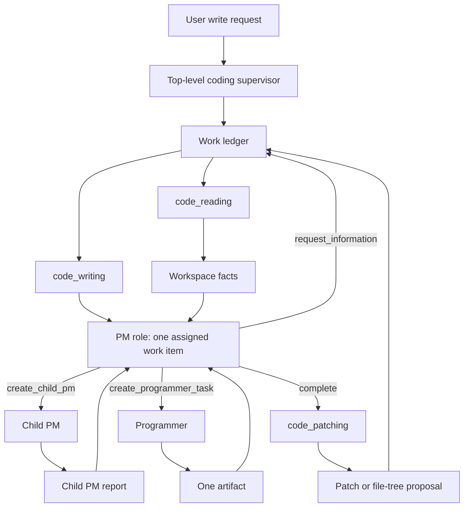

# coding agent phase2 code writing plan

## Summary

- Goal: implement Phase 2 as new-artifact code writing through the recursive PM
  lifecycle architecture: each PM owns direct child lifecycle, may choose a child
  PM or programmer, and grounds dependent instructions through
  supervisor-mediated workspace facts.
- Plan class: high_risk_migration.
- Status: in_progress.
- Mandatory skills: `development-plan`, `local-llm-architecture`,
  `no-prepost-user-input`, `py-style`, `test-style-and-execution`, and
  `debug-llm`.
- Overall cutover strategy: bigbang inside Phase 2. Replace the flattened
  one-layer Writing PM flow with one canonical recursive PM contract.
- Highest-risk areas: PM role drift, weak workspace-grounded feedback loop,
  local-LLM inconsistency, premature E2E testing, boundary leakage between PMs
  and programmers, and deterministic code making semantic decisions.
- Acceptance criteria: PM role live LLM suites cover every supported PM action
  for all five Phase 2 gates before downstream role work or E2E resumes; then
  all five hard gates pass by agent-authored review.

## Context

Phase 2 is reset. Earlier Phase 2 progress used a flattened writing flow where
one Writing PM emitted multiple artifact contracts and programmers generated
artifacts independently. Live E2E failures showed a system failure: dependent
files could disagree because the next instruction was made from plan memory or
parallel contracts instead of actual workspace state.

The architecture reference now defines the stable rule:

- The top-level coding supervisor owns cross-domain workflow, the work ledger,
  and calls to `code_reading`, `code_writing`, `code_patching`, external
  evidence, and later execution.
- A PM owns the semantic lifecycle of its direct children.
- A PM may choose a child PM or one programmer as a direct child.
- A PM manages only direct children.
- A programmer receives one bounded implementation or reading contract and
  returns one artifact or report.
- When prior generated work or existing source affects the next child
  instruction, the PM requests workspace facts through the supervisor. The
  supervisor invokes `code_reading` and resumes the PM with compact
  evidence-backed facts.

Phase 2 remains new-artifact writing only. It proposes artifacts and patch/file
tree packages for human review; it does not apply patches, mutate caller
workspaces, run project commands, execute generated tests, validate generated
behavior, repair generated artifacts, or perform existing-source semantic
modification.

## Mandatory Skills

- `development-plan`: load before editing, executing, reviewing, or signing off
  this plan.
- `local-llm-architecture`: load before changing PM boundaries, prompts,
  workflow loops, model calls, evaluator ownership, or context packets.
- `no-prepost-user-input`: load before changing request interpretation,
  hard-gate loading, or any code that could keyword-route user input.
- `py-style`: load before editing Python production files.
- `test-style-and-execution`: load before adding, changing, or running tests.
- `debug-llm`: load before running live LLM cases or writing live LLM review
  artifacts.

## Mandatory Rules

- After automatic context compaction, reread this entire plan before continuing
  implementation, verification, handoff, lifecycle updates, or final reporting.
- After signing off any major checklist stage, reread this entire plan before
  starting the next stage.
- The user has prohibited Codex execution subagents for the current Phase 2
  work. Execute this plan single-agent unless the user later changes that
  instruction.
- Quality, correctness, workflow shape, and role-boundary clarity outrank LLM
  call count and latency.
- Real LLM tests are the primary quality gates. Deterministic tests support
  schema, parsing, path safety, prompt caps, artifact package materialization,
  and workflow transition enforcement only.
- Do not run E2E hard gates until the PM role live LLM suite passes every
  supported PM function for all five gates and the agent records at least 90%
  readiness confidence from role-level evidence.
- Do not batch live LLM tests. Run one live LLM case, inspect its trace, write
  or update the review artifact, then decide the next run.
- Do not encode hard-gate keywords, repository names, expected files, expected
  functions, or expected answers in production code, runtime prompts,
  deterministic routing, deterministic pass/fail logic, or non-live tests.
- Hard-gate challenge text may appear only in the supporting gate document,
  allowed live-gate fixtures, raw traces, and agent-authored review artifacts.
- LLM stages own semantic judgment. Deterministic code owns persistence,
  limits, path safety, prompt budget caps, patch parsing, review-package
  materialization, public-output redaction, and file mechanics.
- Deterministic code must enforce workflow transitions and role-boundary shape.
  It must not decide semantic decomposition, file purpose, feature design,
  child PM need, or programmer task meaning.
- A PM manages direct children only. A parent PM may create a child PM task or
  one programmer task. It must not manage descendants owned by a child PM.
- A PM may send a programmer task only when it can provide one complete bounded
  implementation contract from supervisor-approved facts.
- A dependent child instruction must be grounded in actual workspace or artifact
  facts when prior generated work affects the instruction. Those facts come
  through supervisor-mediated `code_reading`, not from stale plan memory.
- Programmers never receive raw peer output. They receive one PM-approved
  contract and return one implementation artifact.
- The replacement design must stay within the 50k context cap. Each role input
  must have a prompt-budget report and must fail closed before invoking the LLM
  when over the hard cap.

## Must Do

- Align Phase 2 code-writing docs, production contracts, prompts, tests, and
  review artifacts with the recursive PM lifecycle architecture.
- Define the PM external input/output contract now. PM internals may remain a
  mono LLM call in Phase 2, but the external PM boundary must support later
  internal PM clustering without changing callers.
- Implement PM outputs for these Phase 2 supported actions:
  `request_information`, `create_child_pm`, `create_programmer_task`,
  `complete`, and `blocked`.
- Implement deterministic validation for PM action shape, direct-child
  boundaries, prompt caps, and required workspace-fact grounding before
  dependent child instructions.
- Build a large PM-focused live LLM suite from all five Phase 2 hard gates.
  The suite must cover child-type choice, child PM instruction, programmer
  instruction, information request, direct report handling, completion, and
  blocked output.
- Run PM live LLM tests one case at a time and record human-readable
  input/output, trace path, model route, thinking setting, review judgment, and
  failure mode.
- Keep Phase 2 new-artifact only. Existing-source semantic changes remain
  outside this phase.

## Deferred

- Do not implement existing-source semantic modification in Phase 2.
- Do not add patch apply, command execution, package installation, or project
  test execution in Phase 2.
- Do not enable generated-artifact validation execution or repair loops in
  Phase 2. Validation and repair are later-phase responsibilities.
- Do not create compatibility shims for the flattened Writing PM contract.
- Do not add direct worker-to-worker calls. Cross-domain needs go through the
  top-level supervisor.
- Do not expand PM internals into a cluster in Phase 2 unless the mono PM live
  LLM suite proves the external PM contract is stable and the user approves a
  separate implementation change.
- Do not run E2E as a component-debug shortcut.

## Cutover Policy

Overall strategy: bigbang

| Area | Policy | Instruction |
|---|---|---|
| Phase 2 PM contract | bigbang | Replace flattened artifact-list PM output with recursive PM lifecycle output. |
| Prompts | bigbang | Rewrite prompts to the PM action contract and remove stale one-layer wording. |
| Deterministic checks | bigbang | Check PM action shape, direct-child boundaries, prompt caps, and workspace-fact requirements. |
| Tests | bigbang | Replace stale role/E2E assumptions with PM-first live LLM role suites and supporting deterministic checks. |
| E2E gates | gated | E2E remains blocked until PM role suites and then downstream role suites meet readiness rules. |

## Cutover Policy Enforcement

- Follow the selected policy for each area.
- If an area is `bigbang`, delete or rewrite legacy references instead of
  preserving them.
- Do not choose compatibility by default.
- Any change to a cutover policy requires user approval before implementation.

## Target State



The PM role is an external boundary. In Phase 2 it may be implemented as one
LLM call per PM decision. Later internal PM clustering must preserve the same
external input/output contract.

## Design Decisions

| Topic | Decision | Rationale |
|---|---|---|
| PM hierarchy | PM recursively chooses direct child type | Fixed layer counts either overload small tasks or underfit larger tasks. |
| PM ownership | PM owns direct child lifecycle only | Keeps boundaries clear and prevents parent PMs from managing descendant details. |
| Workspace grounding | Dependent child instructions require supervisor-approved workspace facts | Prevents source/test or file/file disagreement caused by stale plan memory. |
| Generated readback | Prior generated artifacts are read through supervisor-mediated `code_reading` before dependent artifacts consume them | Keeps PM decisions grounded in actual generated source without letting writing agents execute code or inspect peers directly. |
| Supervisor role | Supervisor dispatches workflows and records the ledger | Semantic decomposition stays inside PM roles. |
| Phase 2 scope | New-artifact writing only | Existing-source modification remains a separate capability. |
| Testing priority | PM live LLM suite first | PM consistency is the main blocker before downstream roles and E2E can be useful. |

## Contracts And Data Shapes

### PM Input

```python
{
    "pm_id": str,
    "domain": "reading | writing | modifying",
    "work_item": {
        "goal": str,
        "scope": str,
        "constraints": list[str],
        "expected_result": str,
    },
    "available_facts": list[dict],
    "direct_child_reports": list[dict],
    "child_feedback": list[dict],
    "context_limits": dict,
}
```

`available_facts` may contain only upstream PM reports, direct child reports,
File Agent facts, external evidence summaries, or supervisor-mediated
`code_reading` facts. Generated-artifact readback facts enter as
`supervisor_facts` and must stay compact.

### PM Output

```python
{
    "status": "request_information | create_child_pm | create_programmer_task | complete | blocked",
    "reason": str,
    "information_request": dict | None,
    "child_pm_task": dict | None,
    "programmer_task": dict | None,
    "completion_report": dict | None,
    "blocker": dict | None,
}
```

Exactly one action payload must be populated for the selected `status`.

### Information Request

```python
{
    "request_id": str,
    "needed_facts": list[str],
    "target_artifacts": list[str],
    "reason_for_next_instruction": str,
}
```

The supervisor maps this to `code_reading` or external evidence and resumes the
PM with compact facts.

For generated-artifact readback, the writing subagent returns:

```python
{
    "status": "need_reading",
    "reading_requests": [
        {
            "request_id": str,
            "task": str,
            "reason": str,
            "target_artifacts": list[str],
        }
    ],
    "reading_source": {
        "repository": dict,
        "source_scope": dict,
    },
}
```

The top-level coding supervisor invokes `code_reading` against
`reading_source`, stores the answer as one `supervisor_fact`, and reruns
`code_writing` with:

```python
{
    "supervisor_facts": [
        {
            "request_id": str,
            "kind": "generated_artifact_readback",
            "task": str,
            "resolved": bool,
            "result": str,
            "limitation": str,
        }
    ]
}
```

The supervisor fact is the only readback memory passed to the next PM call.
Raw generated source, absolute paths, reading traces, and command results must
not be appended to PM context.

### Child PM Task

```python
{
    "child_pm_id": str,
    "domain": "reading | writing | modifying",
    "goal": str,
    "scope": str,
    "constraints": list[str],
    "expected_report": list[str],
}
```

### Programmer Task

```python
{
    "task_id": str,
    "artifact_purpose": str,
    "required_behavior": list[str],
    "provided_interfaces": list[str],
    "consumed_interfaces": list[str],
    "imports": list[str],
    "output_format": str,
}
```

For Phase 2 writing, one programmer task produces one new artifact.

### PM Report

```python
{
    "pm_id": str,
    "status": "complete | blocked",
    "provided_facts": list[str],
    "created_artifacts": list[dict],
    "consumed_facts": list[str],
    "open_risks": list[str],
    "next_dependency_needs": list[str],
}
```

## LLM Call And Context Budget

| Role | Route | Context inputs | Cap rule |
|---|---|---|---|
| Top-level coding supervisor | `CODING_AGENT_PM_LLM` | user goal, work ledger, compact evidence state, review package summary | fail closed before invoke if over hard cap |
| PM role | `CODING_AGENT_PM_LLM` | one PM input packet, direct child reports, supervisor-approved facts, direct child feedback | fail closed before invoke if over hard cap |
| Programmer | `CODING_AGENT_PROGRAMMER_LLM` | one accepted programmer task | no peer output, no raw workspace dump |
| Patching worker | `CODING_AGENT_PROGRAMMER_LLM` | selected generated artifacts, reserved paths, artifact caps | no feature semantics beyond assembly |
| Synthesizer | `CODING_AGENT_PM_LLM` | selected artifacts, review package summary, public-safe limitations | no code repair |

Use a 50k context cap. PM role tests must record approximate prompt character
size, model route, model name, thinking setting, and output size.

## Change Surface

### Modify

- `development_plans/reference/designs/coding_agent_architecture.md`: source of
  truth for recursive PM lifecycle and supervisor-mediated workspace grounding.
- `development_plans/active/short_term/coding_agent_phase2_code_writing_plan.md`:
  reset Phase 2 around the recursive PM contract.
- `src/kazusa_ai_chatbot/coding_agent/code_writing/README.md`: update the ICD
  to match the PM lifecycle and workspace-grounding loop.
- `src/kazusa_ai_chatbot/coding_agent/code_writing/models.py`: replace flattened
  PM artifacts with PM action contracts.
- `src/kazusa_ai_chatbot/coding_agent/code_writing/product_manager.py`: update
  PM prompt, parsing, review payloads, and action handling.
- `src/kazusa_ai_chatbot/coding_agent/code_writing/supervisor.py`: enforce PM
  lifecycle transitions and supervisor-mediated information requests.
- `tests/test_coding_agent_phase2_new_artifact_contracts.py`: deterministic
  support checks for PM action shapes and transition rules.
- `tests/test_coding_agent_phase2_new_artifact_role_live_llm.py`: PM-first live
  LLM role cases from all five gates, after the old flattened role cases are
  refreshed.
- `test_artifacts/llm_reviews/`: PM role and later E2E review artifacts.

### Create

- `tests/test_coding_agent_pm_lifecycle_role_live_llm.py`: focused live LLM PM
  feasibility suite for the recursive PM lifecycle contract.

### Keep

- `code_fetching` and `code_reading` public contracts, except for using
  `code_reading` as the supervisor-mediated workspace-fact provider.
- Phase 2.5 security boundary as the owner of execution and real-world tool
  isolation.
- The five Phase 2 hard gates in
  `development_plans/reference/designs/coding_agent_phase2_new_artifact_gating_tests.md`.

## Overdesign Guardrail

- Actual problem: Phase 2 failed because dependent writing instructions were
  created without a stable PM lifecycle boundary and without mandatory
  workspace-grounded feedback.
- Minimal change: replace the PM contract and tests first, then rewire Phase 2
  to enforce recursive PM decisions and supervisor-mediated readback.
- Ownership boundaries: supervisor owns cross-domain dispatch and ledger; PM
  owns direct child lifecycle; `code_reading` owns workspace facts; programmer
  owns one artifact; deterministic code owns transition checks and
  materialization boundaries
  enforcement.
- Rejected complexity: PM internal cluster implementation, existing-source
  modification, execution feedback, patch apply, compatibility mappers,
  direct worker-to-worker calls, and E2E-driven prompt tuning.
- Evidence threshold: PM internal clustering or additional roles require
  PM-suite evidence showing the mono PM cannot consistently satisfy the stable
  external PM contract.

## Agent Autonomy Boundaries

- The responsible agent may choose local implementation mechanics only when
  they preserve this plan's contracts.
- The responsible agent must not introduce alternate architecture,
  compatibility layers, fallback paths, extra features, or unrelated cleanup.
- The responsible agent must treat changes outside `coding_agent` Phase 2 as
  high-scrutiny changes and justify them in `Execution Evidence`.
- The responsible agent must not perform production-code edits unless the user
  has explicitly commanded implementation work.
- If the plan and code disagree, preserve the plan's stated intent and report
  the discrepancy.
- If a required instruction is impossible, stop and report the blocker instead
  of inventing a substitute.

## Implementation Order

1. Reread the architecture reference, this plan, the code-writing ICD, and the
   supporting gate document.
2. Update the code-writing ICD to the recursive PM lifecycle contract.
3. Replace production PM data shapes, prompt, parser, and supervisor handling
   with the PM action contract.
4. Add deterministic support checks for PM action parsing, direct-child
   boundaries, prompt caps, and workspace-fact transition enforcement.
5. Build the PM-focused live LLM suite from all five hard gates.
6. Run PM live LLM tests one case at a time, inspect each trace, and record
   PM-specific RCA for failures.
7. Only after PM role evidence reaches at least 90% readiness, update and
   rerun downstream role suites affected by the new PM contract.
8. Only after all role suites are reviewed and unresolved blockers are closed,
   run E2E hard gates one at a time.
9. Run static checks, deterministic support checks, anti-cheat greps, and final
   independent code review before sign-off.

## Execution Model

- Single active agent owns orchestration, implementation, test code,
  verification, execution evidence, review feedback remediation, lifecycle
  updates, and final sign-off because the user prohibited subagents.
- Establish or update focused PM role tests before production implementation.
- Run live LLM tests one case at a time and inspect output before the next live
  call.
- Stop before E2E if PM role confidence is below 90% or any role-level blocker
  remains unresolved.

## Progress Checklist

- [x] Stage 1 - architecture, ICD, and plan alignment
  - Covers: architecture reference, code-writing ICD, this reset plan.
  - Verify: stale flattened PM wording grep.
- [x] Stage 2 - PM contracts and deterministic transition checks
  - Covers: models, PM parser, supervisor lifecycle transitions, support tests.
  - Verify: deterministic contract tests and compile check.
- [x] Stage 3 - PM prompt and PM live LLM suite
  - Covers: PM prompt, PM-focused live fixtures, review artifact format.
  - Verify: collect live role tests and run PM cases one at a time.
- [x] Stage 4 - downstream role contract refresh
  - Covers: programmer, patching, synthesizer, and alignment impacts from PM
    contract changes.
  - Verify: affected role suites rerun one case at a time.
- [ ] Stage 5 - E2E hard gates
  - Covers: five Phase 2 gates through `coding_agent.propose_code_change(...)`.
  - Verify: run one E2E live gate at a time only after role readiness.
- [ ] Stage 6 - final verification and independent code review
  - Covers: deterministic checks, anti-cheat greps, diff review, evidence, and
    final sign-off.

## Verification

### Static Greps

- `rg "artifact_items|Writing PM creates new-artifact plan|one Writing programmer|Module PM|Source Ownership PM" src/kazusa_ai_chatbot/coding_agent tests development_plans/reference/designs/coding_agent_architecture.md`
  - Expected: zero matches.
- Anti-cheat grep for the five gate challenge-specific names across production
  code, runtime prompts, deterministic pass/fail logic, and non-live tests.
  Challenge text is allowed only in the supporting gate document, live fixtures,
  raw traces, and review artifacts.

### Deterministic Support Checks

- `venv\Scripts\python -m pytest -q tests/test_coding_agent_phase2_new_artifact_contracts.py`
- `venv\Scripts\python -m compileall -q src/kazusa_ai_chatbot/coding_agent`

### PM Role Live LLM Suite

- Run one live LLM case at a time with `-s`.
- Command shape:
  `venv\Scripts\python -m pytest -m live_llm tests/test_coding_agent_pm_lifecycle_role_live_llm.py::<test_name> -q -s`
- Required PM coverage:
  - create child PM;
  - create programmer task;
  - request workspace information;
  - handle direct child report;
  - complete with PM report;
  - block with specific reason;
  - choose programmer directly for a small single-artifact task;
  - choose child PM for multi-artifact or dependency-sensitive work;
  - require workspace facts before dependent child instruction.
- Required artifact: raw trace plus agent-authored review before the next live
  case starts.

### E2E Hard Gates

E2E is blocked until PM and downstream role suites are reviewed and unresolved
blockers are closed.

Run the five hard gates from
`development_plans/reference/designs/coding_agent_phase2_new_artifact_gating_tests.md`
one at a time through `coding_agent.propose_code_change(...)`.

## Independent Plan Review

Before implementation resumes, reread the architecture reference, this plan,
the code-writing ICD, and the supporting gate document from a fresh-review
posture.

Review scope:

- The plan states one canonical recursive PM architecture.
- PM role boundary, responsibility, and IO are explicit.
- Higher PMs manage direct child lifecycle only.
- Workspace-grounded readback is supervisor-mediated.
- PM live LLM tests cover every supported PM action before E2E.
- Phase 2 materializes review packages but does not run generated code,
  generated tests, validation feedback, or repair.
- No legacy flattened PM contract remains as executable guidance.

Record findings and fixes in `Execution Evidence`.

## Independent Code Review

Run this gate after all `Verification` commands pass and before final sign-off.
Because the user prohibited subagents, perform a fresh-pass self-review unless
the user later approves a separate review agent.

Review scope:

- Alignment with recursive PM lifecycle architecture.
- PM contract, prompt, parser, and supervisor transition quality.
- Role-boundary validation and absence of deterministic semantic decisions.
- Live LLM review evidence quality and no E2E-before-role-readiness violation.
- Anti-cheat compliance and no gate-specific runtime behavior.

Record findings, fixes, commands rerun, residual risks, and approval status in
`Execution Evidence`.

## Acceptance Criteria

This plan is complete when:

- Architecture, ICD, production code, tests, and review artifacts use the
  recursive PM lifecycle consistently.
- PM external IO supports `request_information`, `create_child_pm`,
  `create_programmer_task`, `complete`, and `blocked`.
- Deterministic code enforces PM action shape, direct-child boundary, prompt
  caps, and required workspace-fact transitions without making semantic
  decomposition decisions.
- PM role live LLM suites cover every supported PM action across the five hard
  gates and reach at least 90% readiness by agent-authored review.
- Downstream role suites affected by the PM contract are rerun and reviewed.
- All five Phase 2 E2E hard gates pass by agent-authored review.
- E2E gates are judged on sound artifact output and workflow structure. Code
  mistakes are recorded in the review comment but do not fail a gate when the
  artifact package is coherent, request-aligned, and structurally sound.
- Proposed artifacts never mutate the caller's real workspace.
- Independent code review finds no unresolved blockers.

## Risks

| Risk | Mitigation | Verification |
|---|---|---|
| PM chooses the wrong child type | PM live cases cover direct programmer vs child PM decisions across all gates | PM role review artifact |
| PM creates dependent instruction without workspace facts | Deterministic transition requires information request/readback for dependent child work | Contract tests and PM live cases |
| Generated source and dependent tests disagree | Supervisor-mediated generated-artifact readback records actual source facts before dependent artifacts are assigned | Supervisor handoff tests and PM live readback cases |
| Parent PM manages descendant details | Validate PM-to-PM and PM-to-programmer task shapes separately | Deterministic support checks |
| PM report loses important facts | PM report contract includes provided facts, consumed facts, artifacts, risks, and dependency needs | PM report live cases |
| E2E thrashing resumes | E2E is blocked until PM and downstream role suites meet readiness rules | Progress checklist and review evidence |
| Deterministic code makes semantic decisions | Deterministic code validates shape and transitions only | Code review and support tests |
| Local LLM remains inconsistent | Expand PM role cases before changing E2E; record per-case RCA | PM role review artifact |

## Execution Evidence

- 2026-06-27: Phase 2 progress reset requested by the user. The active plan now
  treats previous flattened Writing PM progress as invalidated execution
  history rather than signed-off work for the renewed architecture.
- 2026-06-27: Added focused PM lifecycle live LLM feasibility suite
  `tests/test_coding_agent_pm_lifecycle_role_live_llm.py` and review artifact
  `test_artifacts/llm_reviews/coding_agent_pm_lifecycle_role_review.md`.
  The suite probes the recursive PM actions before production rewiring:
  `create_programmer_task`, `create_child_pm`, `request_information`,
  `complete`, and `blocked`.
- 2026-06-27: PM live suite was collected and run one case at a time. Iteration
  surfaced and corrected test-local prompt/harness issues for child report
  boundaries, exact action selection, required null action fields, missing user
  requirements versus supervisor-accessible facts, and prompt-rule leakage.
  Final prompt reruns passed all covered PM cases.
- 2026-06-27: PM feasibility is supported for the tested role actions with
  route `CODING_AGENT_PM_LLM`, model
  `gemma-4-31b-it-qat-uncensored-heretic-nvfp4`, thinking enabled. This is not
  E2E sign-off; production contract rewiring and downstream role live LLM suites
  remain required before any E2E hard gate.
- 2026-06-27: Stage 1 complete. Re-read the architecture, this plan, the
  code-writing ICD, and the supporting gate document. Updated
  `src/kazusa_ai_chatbot/coding_agent/code_writing/README.md` to the recursive
  PM lifecycle and confirmed stale flattened wording was removed by grep.
- 2026-06-27: Stage 2 complete. Replaced flattened PM artifacts with the PM
  lifecycle action contract in production models, PM parsing, supervisor
  transitions, acceptance compaction, synthesis payloads, and File Agent
  reservation inputs. Deterministic support check passed:
  `venv\Scripts\python -m pytest -q tests/test_coding_agent_phase2_new_artifact_contracts.py`
  reported `10 passed`.
- 2026-06-27: Stage 3 complete. Production PM live suite collected seven cases
  and each case was run one at a time with trace inspection:
  `gate_01_single_file_programmer_task`,
  `gate_02_source_and_tests_child_pm`,
  `gate_03_package_information_request`,
  `gate_04_child_report_followup`,
  `gate_05_dependent_tests_information_request`,
  `child_pm_report_complete`, and `blocked_insufficient_goal`.
  Human-readable review was updated in
  `test_artifacts/llm_reviews/coding_agent_pm_lifecycle_role_review.md`.
- 2026-06-27: Stage 4 complete. Downstream role contract live tests were run
  one case at a time and inspected:
  `source_artifact_programmer`,
  `markdown_artifact_programmer`, and `synthesizer_patch_proposal`. The
  synthesizer explicitly reported that generated artifacts were not executed.
- 2026-06-27: Final Stage 1-4 non-E2E verification passed:
  `venv\Scripts\python -m pytest -q tests/test_coding_agent_phase2_new_artifact_contracts.py`
  reported `10 passed`;
  `venv\Scripts\python -m compileall -q src/kazusa_ai_chatbot/coding_agent`
  passed; live role collection found 10 live LLM cases across the PM and
  downstream suites; stale-contract greps returned zero matches; gate-specific
  production/support-test grep returned zero matches. `git diff --check`
  reported only line-ending warnings.
- 2026-06-27: E2E hard gates were not run. Stage 5 remains blocked until the
  user requests E2E and the Stage 1-4 role evidence is accepted as sufficient.
- 2026-06-27: User requested E2E gates 01-03. Added the missing pytest-style
  live LLM Gate 01 case to
  `tests/test_coding_agent_phase2_new_artifact_e2e_live_llm.py` so execution
  remains through `coding_agent.propose_code_change(...)` rather than ad hoc
  Python. Gate 01 passed AI review with one materialized script:
  `test_artifacts\coding_agent_phase2_e2e_workspace\gate_01\writing_validation\16a282fc09b942b18fecc7082329bf50\src\log_severity_counter.py`.
  Gate 02 timed out twice and produced no fresh response after stale response
  indexes were cleared. Gate 03 failed because the PM lifecycle step limit was
  reached with zero patch artifacts. Human-readable review:
  `test_artifacts/llm_reviews/coding_agent_phase2_e2e_gate_01_03_review.md`.
  Stage 5 remains unchecked.
- 2026-06-27: Narrowed the Phase 2 boundary after user review. Phase 2 now
  produces new-artifact patch/file-tree proposals and materialized review
  packages only. Generated-code execution, generated-test execution,
  validation feedback loops, alignment repair loops, and code modification are
  deferred outside Phase 2. Updated the code-writing ICD, PM prompt contract,
  supervisor workflow, gating pass criteria, and role fixtures accordingly.
- 2026-06-27: Implemented the narrowed workflow by routing the Phase 2
  supervisor through review-package materialization instead of
  `validate_patch_artifacts(...)` and by removing the alignment/repair loop
  from the Phase 2 execution path. `repair_child` is no longer shown as a PM
  action and is rejected if emitted.
- 2026-06-27: Verification for the narrowed workflow passed:
  `venv\Scripts\python -m pytest -q tests/test_coding_agent_phase2_new_artifact_contracts.py`
  reported `11 passed`, and
  `venv\Scripts\python -m compileall -q src/kazusa_ai_chatbot/coding_agent/code_writing tests/test_coding_agent_phase2_new_artifact_contracts.py tests/test_coding_agent_pm_lifecycle_role_live_llm.py tests/test_coding_agent_phase2_new_artifact_e2e_live_llm.py`
  completed successfully. Static grep found no Phase 2 supervisor calls to
  `validate_patch_artifacts`, `evaluate_artifact_alignment`,
  `writing_repair`, `writing_alignment`, or `MAX_VALIDATION_REPAIR_ATTEMPTS`.
- 2026-06-27: User requested rerun of all five Phase 2 E2E gates. Ran each
  pytest-style live LLM gate one at a time through
  `coding_agent.propose_code_change(...)`. Gate 01 passed AI review with fresh
  materialized artifact
  `test_artifacts\coding_agent_phase2_e2e_workspace\gate_01\writing_validation\a7541feaf7f14dbabc2799cf0fabd568\src\impl_log_analyzer.py`.
  Gates 02-05 each timed out after 604 seconds and produced no fresh response
  JSON or materialized review package for this rerun. Stale artifacts from
  earlier runs were inspected but not counted. Human-readable review:
  `test_artifacts/llm_reviews/coding_agent_phase2_e2e_all_gates_rerun_review_20260627.md`.
  Stage 5 remains unchecked because not all gates passed.
- 2026-06-27: Added durable code-writing diagnostic trace events and reran
  Gate 02 with a one-hour development command budget. Gate 02 completed in
  435.19 seconds. Trace review showed the timeout risk was PM over-delegation:
  11 PM LLM calls and a four-level child-PM chain before producing two
  artifacts. Human-readable review:
  `test_artifacts/llm_reviews/coding_agent_phase2_gate_02_traced_run_review_20260627.md`.
- 2026-06-27: Retuned the PM prompt and PM-focused live LLM suite so small
  source-plus-test work starts with direct programmer tasks while child PMs are
  reserved for genuinely broad cohesive sub-areas. Ran nine PM role live LLM
  cases one at a time and inspected each trace. All nine passed by structural
  harness and agent review. Human-readable review:
  `test_artifacts/llm_reviews/coding_agent_pm_delegation_tuning_review_20260627.md`.
- 2026-06-29: Added supervisor-mediated generated-artifact readback for
  Phase 2 new-artifact writing. The writing subagent can now return
  `need_reading` with `reading_requests` and a managed `reading_source`; the
  top-level coding supervisor invokes `code_reading`, records one compact
  `generated_artifact_readback` supervisor fact, and reruns `code_writing`.
  Deterministic verification passed:
  `venv\Scripts\python -m pytest tests\test_coding_agent_interface.py tests\test_coding_agent_phase2_new_artifact_contracts.py -q`
  reported `21 passed`.
- 2026-06-29: Added focused PM live LLM case
  `test_live_pm_gate_02_readback_fact_tests_programmer_task` to verify that a
  PM uses supervisor readback facts before assigning dependent tests. The case
  was run individually with `-m live_llm`; it failed by timeout after 300
  seconds with empty PM output. Trace:
  `test_artifacts/llm_traces/coding_agent_pm_lifecycle_role_live_llm__gate_02_readback_fact_tests_programmer_task.json`.
  This is a component-level readiness blocker; do not run E2E from this state.
