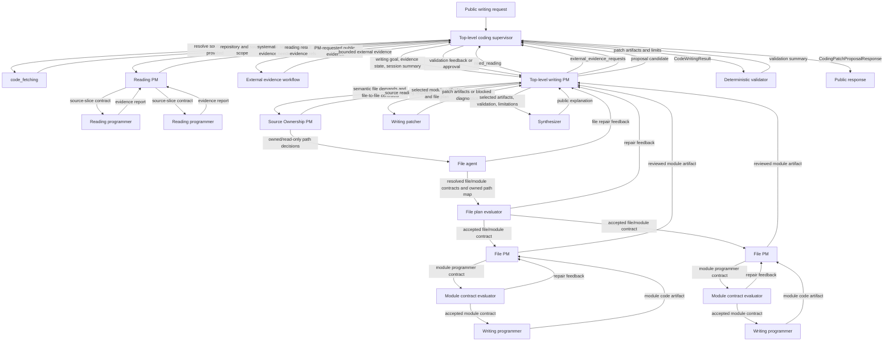

# coding agent phase2 code writing plan

## Summary

- Goal: deliver the standalone Phase 2 `code_writing` implementation that can
  propose evidence-grounded patches for existing repositories and create
  bounded new-project project artifacts, without mutating the caller's real
  workspace.
- Plan class: high_risk_migration. This is high risk because it adds LLM
  patch generation, managed writing workspaces, external evidence, and strict
  mutation boundaries; no data migration is in scope.
- Status: in_progress
- Mandatory skills: `development-plan`, `local-llm-architecture`,
  `no-prepost-user-input`, `py-style`, `test-style-and-execution`,
  `debug-llm`, and `superpowers:test-driven-development`.
- Overall cutover strategy: additive standalone Phase 2 modules and public
  direct interface; bigbang inside the new writing path, with no compatibility
  shim, no patch-apply path, and no Kazusa runtime integration.
- Highest-risk areas: unsafe repository mutation, hallucinated patches,
  challenge overfitting, weak local-LLM multi-file planning, new-project
  workspace hygiene, cross-session memory leaks, external-source misuse,
  context overflow under the 50k project limit, invalid diffs, and accidental
  Phase 3 or Phase 4 scope creep.
- Acceptance criteria: all five Kazusa-focused hard real LLM writing artifact
  gates pass by agent-authored review; deterministic support gates pass;
  anti-cheat greps prove no challenge-specific keywords are introduced into
  Phase 2 production code, runtime prompts, deterministic matching, or
  non-live test implementation; patch artifacts validate structurally in a
  sandbox and never mutate the real workspace.

## Context

Phase 0 is completed and provides source fetching through
`code_fetching.run(...)`. Phase 1 is completed and provides evidence-grounded
source reading through `answer_code_question(...)` and `code_reading.run(...)`.
Phase 2 adds standalone code writing on top of those public contracts.

The architecture reference defines `code_writing` as a patch-first subagent:
it proposes and validates patches, but does not apply patches to the user's
real workspace. The user also requires a true from-scratch challenge. This
plan therefore defines two Phase 2 writing modes:

- existing-repository patch proposal, where Phase 2 fetches and reads the
  existing source, then returns a validated proposed diff;
- new-project project artifact generation, where Phase 2 creates a bounded file
  tree and unified diff from an empty managed workspace.

Phase 2 remains standalone. It does not connect to L2d, action spec,
background-work jobs, result-ready cognition, adapters, dispatcher, scheduler,
service startup, or the future `code_executing` feedback loop. Phase 2
publishes a stable public response contract for the separate Phase 3 plan to
consume. Real patch application is out of Phase 2.

## Mandatory Skills

- `development-plan`: load before editing, approving, executing, reviewing, or
  signing off this plan.
- `local-llm-architecture`: load before changing PM/programmer boundaries,
  external-evidence flow, prompts, context budgets, LLM routes, or synthesis.
- `no-prepost-user-input`: load before changing request interpretation,
  writing-mode choice, external-source choice, or any code that could
  keyword-route user input.
- `py-style`: load before editing Python production files.
- `test-style-and-execution`: load before adding, changing, or running tests.
- `debug-llm`: load before creating or reviewing live/local LLM challenge
  artifacts.
- `superpowers:test-driven-development`: load before implementation; parent
  must establish focused failing tests before production implementation.
- Current execution override: the user instructed that Codex execution must be
  single-agent from this point forward. Do not create harness/native execution
  subagents for production implementation, validation, or review. This override
  does not change the product runtime architecture, where `code_reading` and
  `code_writing` remain supervisor-dispatched internal workflows with
  PM/programmer LLM roles.

## Mandatory Rules

- After automatic context compaction, the parent or active execution agent
  must reread this entire plan before continuing implementation,
  verification, handoff, lifecycle updates, or final reporting.
- After signing off any major checklist stage, the parent or active execution
  agent must reread this entire plan before starting the next stage.
- Before approval or execution, run `Independent Plan Review` and resolve all
  blocker findings.
- Before final completion, lifecycle status changes, merge, or sign-off, run
  the code-review gate defined by this plan and record the result in
  `Execution Evidence`.
- The plan's `Execution Model` uses one Codex executing agent for plan
  alignment, implementation, testing, validation, live-gate review artifacts,
  evidence, and review remediation. Harness/native execution subagents are out
  of scope for the current run by user instruction.
- Phase 2 remains standalone. Do not connect this work to Kazusa service,
  L2d, action spec, background-work jobs, result-ready cognition, dispatcher,
  adapters, persistence, consolidation, or scheduler.
- Phase 2 returns proposed artifacts only. Do not apply patches to the real
  workspace, run project commands, run project tests, install packages, invoke
  Docker, or mutate existing checkouts.
- Phase 2 must be developed as a final product-quality writing agent within
  this declared scope. Do not accept partial behavior on the basis that a
  separate plan can improve it. Any behavior required for the five hard
  writing artifact gates is either implemented and verified in Phase 2 or the
  plan remains blocked. Phase 2 signoff proves artifact generation,
  workflow ownership, role separation, source grounding, structural patch
  validity, public safety, and reviewable completeness. It does not claim that
  generated target-project tests or runtime behavior have passed under the
  future `code_executing` feedback loop.
- Anything listed under `Deferred` is out of Phase 2 scope, not an assumption
  that Phase 2 may depend on while passing signoff.
- `workspace_root` is required for every Phase 2 writing request because patch
  validation, session memory, new-project artifacts, and managed sandboxes need
  explicit storage. Do not fall back to an OS temp directory in Phase 2 writing.
  Missing workspace configuration fails closed and counts as a gate failure.
- Existing-repository writing must use Phase 0 and Phase 1 public contracts.
  Do not import PM, programmer, repository-map, synthesizer, managed-storage,
  or tool internals from Phase 0 or Phase 1.
- The top-level coding supervisor is the only cross-domain dispatcher for
  Phase 2. It owns the fetch/read/write/external/validation loop, durable run
  ledger, public evidence aggregation, and final response assembly. Code
  subagents must not privately call peer code subagents.
- The top-level coding supervisor owns the cross-domain evidence budget for a
  writing request. It records completed reading and external-evidence attempts,
  merged evidence counts, unresolved evidence needs, and remaining follow-up
  capacity, then passes a compact evidence-state summary into the next writing
  PM call. Loop control stays with the supervisor; PM stages keep semantic
  decomposition and handoff authority inside their layer.
- Systematic source reading for writing is owned by the top-level coding
  supervisor. The writing workflow may return `need_reading`, but `code_writing` must
  not invoke `code_reading` directly, import reading internals, or duplicate
  Phase 1 repository-map/evidence logic. The supervisor invokes
  `code_reading.run(...)` through the public Phase 1 contract and passes the
  resulting public reading evidence back into `code_writing`.
- New-project writing must use a managed virtual workspace under the configured
  coding workspace. Do not create files in the caller's real project checkout.
- PM stages are layered. The top-level writing PM owns semantic decomposition,
  mode choice, external-evidence need, sufficiency, semantic file needs,
  file-to-file input/output contracts, cross-file imports, File PM review
  reconciliation, and final artifact selection. The Source Ownership PM owns
  existing-source owner selection from bounded source evidence and candidate
  paths. One File PM runs for each accepted module/file assignment and owns
  that module-level programmer contract. The file agent owns file mechanics
  after ownership is established: repository-relative path safety, new-file
  reservation, base revision checks, permission checks, current file context
  packaging, path maps, and mutex identifiers. Deterministic code owns patch
  parsing, sandbox setup, workspace persistence, caps, and validation.
- The Source Ownership PM must run after every top-level writing PM decision
  that returns existing-source file demands and before the file agent. It
  selects `preferred_path` and `read_only_paths` from bounded candidate files
  or returns source-reading / PM-repair feedback inside the bounded repair
  loop.
- The file agent must run after source ownership and before the file plan
  evaluator, File PMs, or programmer calls. It validates writing-PM file
  demands with established ownership into concrete file/module contracts and
  returns compact repair feedback to the top-level writing PM inside a bounded
  repair loop.
- The file plan evaluator must run after the file agent packages a writing PM
  decision and before any File PM call. It validates the resolved file/module
  ownership contract and returns compact repair feedback to the top-level
  writing PM inside a bounded repair loop.
- The module contract evaluator must run after a File PM emits one
  module-level programmer contract and before any programmer call. It validates
  the programmer input shape, role boundary, prompt budget, imports,
  `symbols_to_define`, and required behavior, then returns compact repair
  feedback to the File PM inside a bounded repair loop.
- Code-reading and code-writing PM stages enforce interfaces and coordinate
  worker outputs. A PM must not perform programmer work. In reading, the PM
  must not perform deep source inspection or claim source behavior without
  programmer evidence. In writing, the top-level writing PM and File PMs must
  not author implementation code, unified diff hunks, file contents, test
  bodies, or replacement symbols. The top-level writing PM describes bounded
  file demands with file-to-file contracts, cross-file import needs, evidence
  or validation expectations, file purpose, placement hints, current-context
  needs, and forbidden scope. The Source Ownership PM selects existing-source
  owner paths from evidence before file mechanics run. File PMs describe
  module-level programmer contracts with exact imports, bounded current file context,
  `symbols_to_define`, and required behavior.
- Programmer workers operate only behind the PM-defined assignment contract.
  Reading programmers inspect only their assigned source slice. Writing
  programmers implement only one accepted module-level contract from a File
  PM. They must not broaden their own scope, take a whole-feature assignment,
  choose file paths, emit patch hunks, or write outside the symbols/imports
  requested by the accepted contract.
- A dedicated writing patcher owns patch materialization after the writing file
  PM selects programmer outputs. The patcher converts writing-file-PM-selected implementation content,
  test content, documentation content, owned path maps, and base file summaries
  into unified diffs or new-project file trees. It owns path targeting, edit
  anchoring, add-file/delete-file/update-file mechanics, hunk ordering, and
  edit-shape diagnostics. It must not reinterpret the user request, create new
  feature behavior, add unassigned files, or turn unresolved programmer gaps
  into successful patch content.
- Supervisor and deterministic validation must reject programmer reports
  outside assigned scope and repair loops that broaden a programmer assignment
  without a new File PM contract accepted by the module contract evaluator.
  The file plan evaluator owns pre-File-PM rejection for overlapping file
  ownership, missing file-to-file contracts, and missing bounded file context.
  The module contract evaluator owns pre-programmer rejection for missing
  imports, missing `symbols_to_define`, missing required behavior, leaked file
  management fields, and prompt-budget overflow. Validation must also reject
  patcher artifacts that contain paths or hunks outside the writing-PM-selected
  file plan.
- Existing-repository Phase 2 writing depends on Phase 1 `code_reading` public
  output. Any Phase 1 reading evidence used by writing must follow the same
  PM/programmer boundary: reading PM defines source-slice contracts, reading
  programmers inspect bounded files/symbols/modules, and PM synthesis cites
  programmer evidence rather than direct PM file reading.
- Deterministic code must not keyword-route user text into writing modes,
  challenge cases, external-source calls, framework choices, file templates,
  or pass/fail outcomes. Use LLM contracts and structural validation.
- External web evidence may be requested only by an LLM writing PM decision.
  The writing PM returns `external_evidence_requests`; the writing supervisor
  maps those requests to a `need_external_evidence` outcome for the top-level
  coding supervisor. The top-level coding supervisor invokes the public
  `WebAgent3().run(...)` helper contract and passes bounded evidence back into
  `code_writing`. `code_writing` must not privately call `WebAgent3` or any
  other external-evidence workflow. External evidence informs the writing PM;
  it does not become final patch instructions by itself.
- Code-writing runtime prompts, deterministic scoring, helper names,
  production source, and non-live support tests must not contain
  challenge-specific repository names, project names, endpoint names, library
  names, archived-plan names, commit hashes, or distinctive nouns from the five
  hard gates. The full challenge
  text may appear only in this plan, live-gate input artifacts, live LLM trace
  artifacts, and agent-authored review documents.
- LLM-generated patch artifacts from live gates may contain challenge words
  because they are the requested output under review. Those generated artifacts
  must remain in live-gate traces/reviews or returned response artifacts and
  must not be copied into the coding-agent implementation, deterministic
  scoring, runtime prompts, docs, or non-live tests.
- The current repository already contains pre-existing occurrences of some
  gate terms in Kazusa source, archived plans, and previous live-gate artifacts.
  Those baseline occurrences do not authorize Phase 2 overfitting. Phase 2
  execution must prove that the new Phase 2 changed files and runtime surfaces
  do not add challenge-specific terms outside the allowed plan/live-review
  artifacts or generated patch artifacts.
- Live/local LLM challenge tests must be named generically, such as
  `test_phase2_gate_01`, and must load challenge text from a live-gate
  manifest or review artifact rather than embedding challenge-specific words
  in Python test source.
- Real LLM tests are the primary Phase 2 quality gate. Deterministic tests
  support schema, safety, limits, validation, routing, and regression, but
  they do not prove product-quality writing behavior.
- Deterministic tests, static greps, and compile checks are necessary support
  gates only. They cannot override, replace, waive, or compensate for a failed
  hard real LLM challenge.
- Live/local LLM tests must run one case at a time with output inspected after
  each case. Batch-running hard gates for a green/red summary is forbidden.
- Environment failures, missing model routes, missing workspace, missing web
  route when a gate needs external evidence, failure to produce a patch
  artifact, unrelated answers, incomplete results due to loop limits, and
  wrong workflow ownership all count as gate failures.
- Pass/fail for real LLM gates must be judged by an agent-authored review over
  traces and artifacts. The review judges whether the Phase 2 writing artifact
  is complete, grounded, structurally valid, role-correct, and ready for a
  future execution-feedback phase. Do not use keyword matching to grade
  semantic quality.
- If programmer workers repeatedly make assignment-scope, interface, or
  implementation mistakes in live gates, the parent must run a controlled
  comparison with programmer thinking enabled and record whether that changes
  the failure pattern before making further generic prompt or architecture
  changes.
- The writing patcher uses the programmer LLM route and the programmer
  thinking setting. Do not add a separate patcher route. If patcher edit
  materialization repeatedly fails in live gates, run the controlled thinking
  comparison with programmer thinking enabled for both programmer and patcher
  calls, then record whether the failure pattern changes.

### Phase 1 Guardrail Carryover

Phase 2 applies the same anti-overfit rule that made Phase 1 acceptable:

- The PM may use only generic writing intents and generic evidence or artifact
  slots. It must not depend on challenge repository names, fixture names,
  framework names, endpoint names, expected files, or expected patch phrases.
- Programmer workers discover existing source identifiers from Phase 1 reading
  evidence, repository metadata, or bounded external evidence. Existing-repo
  patch artifacts may mention existing concrete identifiers only when those
  terms are traceable to evidence rows, repository metadata, or a programmer
  report.
- New-project patch artifacts may introduce new identifiers only as part of the
  generated design for the current request. They must not come from canned
  templates, challenge-specific code paths, or deterministic user-text
  matching.
- Final patch explanations and artifacts must separate user request text,
  source evidence, external evidence, generated design choices, validation
  results, and limitations.
- Tests must prove generic writing-artifact behavior through the five hard
  live gates and neutral support fixtures. A test or prompt that rewards one
  fixed source vocabulary is insufficient.

## Must Do

- Add standalone `code_writing` as a subagent package with its own
  `README.md` ICD.
- Add the public direct entrypoint
  `propose_code_change(request: CodingAgentWriteRequest) -> CodingPatchProposalResponse`
  at the top-level `coding_agent` package.
- Add `code_writing.run(request: CodeWritingRequest) -> CodeWritingResult` as
  the internal writing subagent public entrypoint.
- Support existing-repository patch proposal by using Phase 0 fetching and,
  when systematic source understanding is required, supervisor-managed Phase 1
  reading evidence before patch materialization.
- Support new-project project artifact generation from an empty managed
  workspace, including proposed file tree, unified diff from empty base, and
  README/package/test artifacts when requested.
- Support multi-file composition through PM/programmer writing reports and
  writing-file-PM-owned reconciliation. Do not ask one LLM prompt to write a repository-wide
  patch from raw files.
- Split the current broad writing path into a top-level writing PM plus one
  File PM per accepted module/file assignment. The top-level writing PM
  manages whole-request decomposition, file/module ownership needs,
  file-to-file input/output contracts, cross-file imports, and File PM review
  reconciliation. Each File PM manages one module-level programmer contract
  for its assigned file/module.
- Add a dedicated writing patcher role after PM/programmer reconciliation. The
  patcher materializes writing-file-PM-selected programmer content into unified diffs or
  new-project file trees and returns patchability diagnostics without owning
  semantic implementation.
- Clean up the current Phase 2 code toward the role split before further gate
  work: remove direct programmer or synthesizer patch-artifact ownership, route
  all writing-PM-selected programmer content through the dedicated patcher,
  replace broad PM-to-programmer assignments with top-level writing PM -> file
  agent -> file plan evaluator -> File PM -> module contract evaluator ->
  programmer handoff, and update traces/tests so successful proposals always
  show this hierarchy plus the patcher handoff.
- Enforce the 50k context limit through explicit supervisor, PM, programmer,
  patcher, evidence-store, and session-memory budgets. Record prompt estimates,
  selected evidence ids, pruned evidence counts, and overflow outcomes in
  traces.
- Enforce the layered PM-to-programmer interface contract: top-level writing
  PM defines file/module purpose, file-to-file inputs/outputs, cross-file
  import needs, current-context needs, validation expectations, and forbidden
  scope; each File PM defines one module-level programmer contract with exact
  imports, bounded current file context, `symbols_to_define`, and required
  behavior; programmers implement only within one accepted module-level
  assignment; deterministic validation rejects cross-assignment overlap,
  leaked file-management fields, or out-of-scope programmer output.
- Add managed writing workspaces and session memory under the coding workspace
  root, with stable session ids, commit/content identity invalidation, and
  public-safe session handles.
- Add deterministic patch artifact validation: parse unified diff, reject
  unsafe paths, validate repo-relative paths, check sandbox applyability, run
  touched Python test files inside the isolated validation copy when that
  limited check is available, cap file count and diff size, and ensure no
  local paths leak. Treat this as structural artifact validation, not as the
  missing future execution-feedback loop.
- Add a supervisor-managed limited external-evidence adapter over public
  `WebAgent3().run(...)` for writing tasks that require current public docs,
  framework behavior, or official references.
- Add deterministic tests for contracts, patch validation, sandbox isolation,
  new-project file tree generation, session persistence, external-evidence
  handoff, public sanitization, caps, unsupported requests, and route config.
- Add focused pre-E2E real LLM role gates for the reading PM, reading
  programmer, top-level writing PM, File PM, module programmer, patcher,
  synthesizer, and assembled top-level role flow before running the five hard
  challenge gates.
- Add real LLM gates for all five challenge questions listed in this plan.
- Add debug-LLM review artifacts for every challenge gate, including raw
  request, PM decisions, reading evidence, external evidence if any,
  programmer reports, patch artifacts, validation result, trace, and pass/fail
  judgment.
- Update `README.md`, `docs/HOWTO.md`,
  `src/kazusa_ai_chatbot/coding_agent/README.md`, and the architecture
  reference for the completed Phase 2 public contract.
- Keep Phase 3 draft blocked until Phase 2 completes, then update Phase 3
  worker mapping against the completed `CodingPatchProposalResponse`.

## Deferred

- Do not apply patches to the caller's real workspace. Patch application is
  out of Phase 2 scope and requires a separate approved plan.
- Do not run project tests, package commands, build commands, Docker, or shell
  verification commands against the caller's real workspace or fetched
  checkout. Phase 2 may execute only touched Python test files inside the
  isolated patch-validation sandbox; broader bounded execution remains out of
  Phase 2 scope and requires a separate approved plan.
- Do not implement `code_executing`.
- Do not connect Phase 2 to L2d, action spec, background-work routing,
  durable jobs, result-ready cognition, L3/dialog, adapters, dispatcher, or
  service startup.
- Do not add a worker-only coding LLM route or a separate synthesizer route.
  PM decisions and synthesis use `CODING_AGENT_PM_LLM`; programmer workers use
  `CODING_AGENT_PROGRAMMER_LLM`; the writing patcher shares the programmer
  route and thinking setting.
- Do not add deterministic keyword routing for frameworks, repositories,
  challenge cases, writing modes, or external-doc decisions.
- Do not add generic web browsing as a normal writing path. External evidence
  is limited, explicit, and lower authority than local source.
- Do not add dependency installation, template package generation from a fixed
  framework skeleton, private repository access, credential handling, uploaded
  archive ingestion, or multi-repository patch proposal.
- Do not store raw source excerpts, raw web pages, raw command output, local
  roots, workspace roots, cache keys, or credentials in public responses.

## Cutover Policy

Overall strategy: additive standalone Phase 2.

| Area | Policy | Instruction |
|---|---|---|
| `code_writing` package | additive | Add a new standalone subagent with README ICD and direct tests. |
| Top-level writing entrypoint | additive | Add `propose_code_change(...)`; do not alter Phase 1 `answer_code_question(...)`. |
| Existing-repository writing path | bigbang inside new path | Use Phase 0/1 public contracts and new writing contracts only; no fallback to reading answer text as a patch. |
| New-project writing path | additive | Add empty-base artifact generation under managed writing workspace only. |
| Patch apply | no-op | Validate in sandbox, but do not apply to real workspace. |
| Execution/tests against target repo | no-op | Do not run target project commands. |
| External evidence | compatible | Reuse public `web_agent3` helper contract only through the top-level coding supervisor when PM asks for external evidence. |
| Kazusa runtime integration | no-op | Leave service, L2d, background work, and delivery untouched. |
| LLM routes | compatible | Reuse Phase 1 PM/programmer split; no new synthesis or worker route. |

## Cutover Policy Enforcement

- The responsible execution agent must follow the selected policy for each
  area.
- For additive areas, add only the new standalone Phase 2 surfaces and tests.
- For bigbang areas, do not preserve alternate writing contracts, legacy
  prompt shapes, or compatibility wrappers.
- For no-op areas, leave runtime integration, real patch apply, and execution
  behavior unchanged.
- Any change to this cutover policy requires user approval before
  implementation.

## Target State

Phase 2 exposes direct standalone patch proposal:

```text
CodingAgentWriteRequest
-> coding_agent.propose_code_change(...)
-> coding supervisor loop
-> optional code_fetching.run(...)
-> optional supervisor-managed code_reading.run(...) for systematic evidence
-> top-level writing PM
-> Source Ownership PM selects existing-source owners when needed
-> if writing returns need_reading, supervisor runs code_reading.run(...) and resumes writing
-> if writing returns need_external_evidence from PM evidence requests, supervisor runs WebAgent3 and resumes writing
-> file agent validates file mechanics and packages file demands
-> file plan evaluator accepts file/module contracts
-> File PMs define module-level programmer contracts
-> module contract evaluator accepts module-level contracts
-> bounded writing programmer workers
-> writing patcher materializes writing-file-PM-selected programmer output
-> patch artifact validation in managed sandbox
-> CodingPatchProposalResponse
```

For an existing repository, Phase 2 reads only enough local source evidence to
ground the requested change. It returns a proposed patch and rationale, not a
mutated checkout.

For a new-project request, Phase 2 creates a bounded virtual project inside the
managed writing workspace and returns a proposed file tree plus unified diff
from an empty base. It does not scaffold into the Kazusa repository or the
caller's current directory.

The public response is safe for the separate Phase 3 background-work mapping
plan. It contains bounded artifact text, file names, validation results,
limitations, and evidence references. It does not expose internal workspace
paths, session storage paths, local checkout roots, cache keys, raw command
output, or credentials.

## Design Decisions

| Topic | Decision | Rationale |
|---|---|---|
| Writing architecture | Use a top-level writing PM, one File PM per accepted module/file assignment, module-level programmers, and a patcher after programmer reports | Multi-file patching needs local-LLM context partitioning across whole-request coordination, file ownership, module contracts, implementation, and edit mechanics so no local model call owns too much of the feature. |
| Public top-level API | Add `propose_code_change(...)` beside `answer_code_question(...)` | Keeps Phase 1 stable and gives Phase 3 one public writing boundary. |
| Modes | Support `edit_existing_repository` and `create_new_project` | User explicitly requires existing-code modification and true start-from-scratch generation. |
| Mutation boundary | Return proposed artifacts only | Patch application is out of Phase 2 scope; Phase 2 is complete only as a safe patch-proposal system. |
| Reading dependency | Existing-repo writing uses supervisor-managed Phase 1 reading evidence when systematic reading is required | Patches must be grounded in current source behavior and interfaces without `code_writing` bypassing or duplicating `code_reading`. |
| External evidence | PM-requested, supervisor-managed `WebAgent3` evidence only | Keeps current docs support without deterministic keyword routing, broad web browsing, or hidden subagent-to-subagent calls. |
| Session memory | Store writing sessions under managed workspace with opaque public handles | Supports multi-session continuation without leaking filesystem details. |
| Context memory | Supervisor ledger plus private evidence store, compact PM/programmer reports, and per-call prompt budgets | Keeps local LLM calls inside the 50k project context limit while preserving traceable evidence. |
| Source ownership | Source Ownership PM selects existing-source owners from bounded source evidence before file mechanics | Keeps semantic owner choice in an LLM role while preserving bounded candidate paths and source evidence. |
| File planning | Shared file agent validates accepted owner paths, reserves new files, and packages file contracts before file plan evaluation and File PM dispatch | Keeps path safety, permission, collision, source-scope, current file context, and mutex management out of programmer prompts while giving File PMs, validators, and the patcher the file metadata they need. |
| Patch materialization | Dedicated patcher materializes writing-file-PM-selected programmer output into unified diffs or new-project file trees | Keeps semantic implementation, edit mechanics, and structural validation in separate roles. |
| Patcher route and thinking | Patcher uses `CODING_AGENT_PROGRAMMER_LLM` and follows the programmer thinking setting | Patcher is a bounded worker role for edit mechanics, not a new route family. |
| Patch validation | Deterministic sandbox validation before success | LLM roles produce proposed artifacts; deterministic code proves shape, applyability, path safety, and touched Python test coherence when the limited check is available. |
| Hard gates | Five Kazusa-focused real LLM writing artifact gates block signoff | Deterministic tests cannot prove product-quality writing artifacts with local LLMs, and Phase 2 does not yet include execution-feedback repair. |
| Anti-cheat | Forbid challenge-specific words in runtime and deterministic code | Prevents overfitting to gate prompts or repositories. |

### Runtime Role Responsibilities

| Role | Phase 2 responsibility | Required trace evidence |
|---|---|---|
| Top-level coding supervisor | Owns the public request, fetch/read/write/external/validation loop, context ledger, retry budget, and final public response assembly. | Supervisor trace shows each selected workflow action, evidence handoff, loop count, and final status. |
| Reading PM | Decomposes systematic source-reading needs into bounded source-slice assignments and synthesizes only from reading programmer evidence. | Reading trace shows assignment contracts, programmer reports, evidence refs, and sufficiency decision. |
| Reading programmer | Inspects one bounded source slice and returns source facts with evidence references. | Programmer trace shows assignment id, files read, evidence refs, facts, and open questions. |
| Top-level writing PM | Selects writing mode, defines semantic file demands, file/module ownership needs, file-to-file inputs/outputs, cross-file imports, File PM responsibilities, report reconciliation, and patcher input packet. | Writing-PM trace shows mode decision, file demands, file/module contracts, cross-file imports, selected module artifacts, and unresolved gaps. |
| Source Ownership PM | Selects existing-source owner paths and read-only support paths from bounded source evidence and candidate files. | Source-ownership trace shows demand ids, candidate paths, selected owner paths, evidence refs, reading requests, and PM-repair feedback. |
| File agent | Validates accepted owner paths, reserves new files, packages concrete repository-relative files, permission checks, read-only paths, and owned path maps. | File-agent trace shows accepted or repair-required status, resolved paths, rejected paths, and repair attempt count. |
| File plan evaluator | Runs deterministic structural checks on file-agent-packaged file/module contracts before File PM dispatch and sends compact repair feedback to the top-level writing PM. | Evaluator trace shows accepted or repair-required status, file/module contract ids, bounded error list, and repair attempt count. |
| File PM | Defines one module-level programmer contract for one accepted file/module assignment and reviews the programmer output for that assignment. | File-PM trace shows file label, edit mode, imports, current file context summary, symbols to define, required behavior, review status, and unresolved gaps. |
| Module contract evaluator | Runs deterministic structural checks on module-level programmer contracts before programmer dispatch and sends compact repair feedback to the File PM. | Evaluator trace shows accepted or repair-required status, file label, required keys, prompt budget, leaked file-management fields, and repair attempt count. |
| Programmer worker | Implements one accepted module-level writing contract or one assigned source-read contract. | Programmer trace shows assignment id, file label or read scope, exact imports, required symbols, proposed code artifact, evidence refs, and open questions. |
| Writing patcher | Converts writing-file-PM-selected programmer content into unified diffs or new-project file-tree artifacts and reports edit diagnostics. | Patcher trace shows input packet id, owned path map, changed files, artifacts, diagnostics, and blocked status when material is insufficient. |
| Deterministic validator | Enforces path safety, scope separation, patch parsing, sandbox apply-check, caps, and public sanitization. | Validation trace shows structural result, unsafe paths, rejected files, sandbox status, and public-leak checks. |
| Synthesizer | Produces the public explanation from selected patcher artifacts, validation results, evidence refs, and limitations. | Synthesis trace shows PM route, selected artifact ids, validation summary, and no new code content. |

### Runtime Role Interaction



## Contracts And Data Shapes

### Top-Level Request

```python
CodingAgentWriteRequest = {
    "question": str,
    "source_url": str | None,
    "repo_url": str | None,
    "repo_hint": str | None,
    "local_root_hint": str | None,
    "local_path_hint": str | None,
    "requested_ref": str | None,
    "source_scope_hint": str | None,
    "workspace_root": str | None,
    "preferred_language": str | None,
    "max_artifact_chars": int | None,
    "session_id": str | None,
}
```

Rules:

- Source fields mirror Phase 0 fields. Existing-repo writing passes them to
  `code_fetching.run(...)`.
- New-project requests may omit source fields.
- `workspace_root` is required for every Phase 2 writing request. Direct tests
  and live gates must pass an explicit temp or configured workspace. Phase 2
  must reject missing workspace input instead of using an implicit temp
  fallback.
- `session_id` is an opaque caller-provided or returned id. It never encodes a
  path.

### Top-Level Response

```python
CodingPatchProposalResponse = {
    "status": "succeeded | failed | needs_user_input | rejected",
    "mode": "edit_existing_repository | create_new_project | none",
    "answer_text": str,
    "repository": CodingAgentRepositorySummary | None,
    "source_scope": CodeSourceScope | None,
    "patch_artifacts": list[PatchArtifact],
    "created_files": list[GeneratedFileSummary],
    "evidence": list[CodeEvidenceRow],
    "external_evidence": list[ExternalEvidenceSummary],
    "validation": PatchValidationSummary,
    "session": CodeWritingSessionSummary | None,
    "limitations": list[str],
    "trace_summary": list[str],
}
```

Rules:

- `answer_text` is a public explanation and short usage note.
- `patch_artifacts` carry unified diff text subject to `max_artifact_chars`
  caps.
- `created_files` summarize new-project file paths and roles; full file content
  appears only through patch artifacts, not metadata.
- `evidence` uses Phase 1 repo-relative evidence rows for existing-repo work.
- `external_evidence` stores bounded source titles/URLs/summaries, not raw web
  pages.
- `validation` must state whether patch parsing, sandbox apply-check, and
  touched Python test execution passed.
- Public response fields must not contain `local_root`, `workspace_root`,
  `cache_key`, session storage path, raw command output, raw source dumps,
  `.env` content, `.git` internals, or binary content.

### Writing Subagent Request

```python
CodeWritingRequest = {
    "question": str,
    "mode_hint": "edit_existing_repository | create_new_project | auto",
    "repository": CodeRepositoryRef | None,
    "source_scope": CodeSourceScope | None,
    "reading_result": CodeReadingResult | None,
    "external_evidence": list[ExternalEvidenceSummary],
    "workspace_root": str,
    "preferred_language": str | None,
    "max_artifact_chars": int | None,
    "session_id": str | None,
}
```

`mode_hint` is structural only. The PM still owns semantic mode selection when
the caller passes `auto`. `external_evidence` contains only supervisor-supplied
bounded evidence summaries; `code_writing` never retrieves external evidence
directly.

### Writing File PM Input

```python
WritingFilePMInput = {
    "question": str,
    "mode": str,
    "repository_summary": dict | None,
    "source_scope": dict | None,
    "repo_map_summary": dict | None,
    "reading_reports": list[dict],
    "previous_file_module_reports": list[FileModuleReport],
    "session_summary": dict | None,
    "external_evidence_summaries": list[ExternalEvidenceSummary],
    "file_resolution_feedback": WritingFileResolution | None,
    "file_plan_feedback": WritingFilePlanEvaluation | None,
    "validation_feedback": PatchValidationSummary | None,
}
```

`reading_reports` contains only supervisor-supplied public output from
`code_reading.run(...)`. It must not contain raw `code_reading` internals or
private PM/programmer objects.

### Top-Level Writing PM Decision

```python
WritingPMDecision = {
    "status": (
        "need_reading"
        " | need_file_pms"
        " | ready_to_write"
        " | needs_user_input"
        " | overloaded"
        " | rejected"
    ),
    "mode": "edit_existing_repository | create_new_project",
    "intent": str,
    "file_demands": list[WritingFileDemand],
    "file_contracts": list[WritingFileModuleContract],
    "cross_module_imports": dict[str, list[str]],
    "missing_slots": list[str],
    "reading_requests": list[WritingReadingEvidenceRequest],
    "external_evidence_requests": list[WritingExternalEvidenceRequest],
}
```

`status="need_reading"` means the writing workflow is blocked on systematic
source evidence and is requesting the top-level coding supervisor to run the
Phase 1 reading workflow. It is not permission for `code_writing` to call
reading internals, perform repository-wide reading inside a writing prompt, or
duplicate the Phase 1 repository-map/evidence path.

Non-empty `external_evidence_requests` means the writing PM needs public
documentation or current external facts. The writing supervisor returns
`CodeWritingResult.status="need_external_evidence"` to request the top-level
coding supervisor's external-evidence workflow. It is not permission for
`code_writing` to call `WebAgent3` directly.

`status="need_file_pms"` means the top-level writing PM has enough evidence
to define file/module work. `file_demands` is the PM-authored semantic file
request. The writing PM supplies purpose, placement hints, file-to-file
contracts, current-context needs, validation expectations, and forbidden
scope. Source Ownership PM selects existing-source owners before file-agent
mechanics. The file agent packages accepted ownership and placement data into
concrete file/module contracts before the file plan evaluator and File PMs run.
Successful writing PM output does not require the PM to know current
filesystem availability.
`cross_module_imports` is retained as a parser field but the top-level PM
returns it empty in normal flow; the file agent derives concrete
`cross_file_imports` on resolved file contracts after paths are known.

### File Resolution

```python
WritingFileDemand = {
    "demand_id": str,
    "file_label": str,
    "purpose": str,
    "file_kind": "existing | new | test | docs | config | support",
    "preferred_path": str | None,
    "preferred_name": str | None,
    "placement_hint": str | None,
    "current_context_need": str,
    "file_io_contract": {
        "provides": list[str],
        "consumes": list[str],
        "called_by": list[str],
        "calls": list[str],
        "exports": list[str],
        "invariants": list[str],
    },
    "change_goal": str,
    "file_pm_brief": str,
    "cross_file_import_needs": list[str],
    "required_slots": list[str],
    "validation_expectations": list[str],
    "forbidden_paths": list[str],
}
```

```python
SourceOwnershipResolution = {
    "status": "accepted | need_reading | repair_required",
    "decisions": [
        {
            "demand_id": str,
            "status": "accepted | need_reading | needs_pm_repair",
            "owned_path": str,
            "read_only_paths": list[str],
            "reason": str,
            "evidence_refs": list[str],
            "required_slots": list[str],
        }
    ],
    "errors": list[str],
    "repair_feedback": list[str],
    "reading_requests": list[WritingReadingEvidenceRequest],
}
```

`accepted` source-ownership decisions annotate matching `WritingFileDemand`
objects with `preferred_path` and `read_only_paths` before the file agent runs.
`need_reading` returns to the top-level coding supervisor through the writing
workflow. `repair_required` returns compact feedback to the top-level writing
PM repair loop.

```python
WritingFileResolution = {
    "status": "accepted | repair_required",
    "file_contracts": list[WritingFileModuleContract],
    "path_map": dict[str, str],
    "mutex_map": dict[str, str],
    "errors": list[str],
    "repair_feedback": list[str],
}
```

The file agent checks only file-system and contract mechanics: safe
repo-relative paths, source-scope fit, path availability, new-file collisions,
permission diagnostics, non-overlapping file ownership, base revisions, mutex
ids, and bounded current file context. It may use repository inventory,
source-ownership-selected paths, PM placement hints, related paths, and PM
preferred names. It must not keyword-match the user request, challenge prompt,
repository name, framework, endpoint, or expected files, and must not select an
existing-source owner from semantic token overlap.

If file resolution returns `repair_required`, the supervisor makes one bounded
writing-file-PM repair call with `file_resolution_feedback` and no file plan
evaluator, File PM, or programmer call is consumed. If the repaired PM
decision still cannot be resolved, the writing request returns a rejected
structural result with trace evidence.

### File Module Contract

```python
WritingFileModuleContract = {
    "file_contract_id": str,
    "demand_id": str,
    "file_label": str,
    "owner_path": str,
    "file_kind": "existing | new | test | docs | config | support",
    "file_action": "create_file | edit_file",
    "purpose": str,
    "base_revision": str,
    "mutex_id": str,
    "current_file_context": str,
    "file_io_contract": {
        "provides": list[str],
        "consumes": list[str],
        "called_by": list[str],
        "calls": list[str],
        "exports": list[str],
        "invariants": list[str],
    },
    "file_pm_brief": str,
    "cross_file_imports": list[str],
    "validation_expectations": list[str],
    "forbidden_paths": list[str],
}
```

### File Plan Evaluation

```python
WritingFilePlanEvaluation = {
    "status": "accepted | repair_required",
    "errors": list[str],
    "repair_feedback": list[str],
}
```

The supervisor evaluates each file-agent-packaged `need_file_pms` PM decision
before File PM dispatch. The evaluator checks only
structural handoff rules: allowed file kind for the writing mode, safe
repo-relative paths, required file ownership, required file-to-file contract
fields, non-overlap across file/module targets, base revision presence, mutex
id presence, and bounded current file context. It must not keyword-match the
user request, challenge prompt, repository name, framework, endpoint, or
expected files.

If evaluation returns `repair_required`, the supervisor makes one bounded
writing-PM repair call with the evaluator feedback and no File PM or
programmer call is consumed. If the repaired file-PM decision still does not
pass structural evaluation, the writing request returns a rejected structural
result with trace evidence.

Allowed generic writing intents:

```text
bug_fix
feature_addition
api_contract_change
validation_or_error_handling
configuration_change
test_coverage_change
docs_and_usage_update
refactor_without_behavior_change
dependency_or_framework_update
new_project_service_or_library
new_project_cli_or_tool
```

The writing PM may use these generic intent labels only. It must not use challenge
repository names, framework-specific names, expected file names, endpoint
names, or expected answer phrases in runtime prompts or deterministic logic.

### File PM Input

```python
FilePMInput = {
    "question": str,
    "mode": "edit_existing_repository | create_new_project",
    "file_contract": WritingFileModuleContract,
    "selected_evidence": list[dict],
    "previous_module_report": WritingProgrammerReport | None,
    "module_contract_feedback": ModuleContractEvaluation | None,
    "validation_feedback": PatchValidationSummary | None,
}
```

The File PM sees one file/module contract and selected evidence for that
file/module. It manages the module-level programmer contract for that
file/module and later reviews the programmer output. It does not see peer
programmer output except through top-level writing-PM summaries.

### File PM Programmer Contract

```python
FilePMProgrammerContract = {
    "status": "need_programmer | sufficient | needs_user_input | overloaded | rejected",
    "file_contract_id": str,
    "file_label": str,
    "edit_mode": "complete_file | symbol_bundle",
    "file_purpose": str,
    "imports": list[str],
    "current_file_context": str,
    "symbols_to_define": list[SymbolToDefine],
    "required_behavior": list[str],
    "missing_slots": list[str],
    "limitations": list[str],
}
```

```python
SymbolToDefine = {
    "name": str,
    "kind": "module_variable | dataclass | class | function | method | test | docs_section | package_file",
    "signature": str,
    "body_contract": str,
    "children": list[SymbolToDefine | str],
}
```

`imports` is the only programmer-facing external-name channel. The programmer
input must not contain separate external-name fields, file paths, file mutexes,
base revisions, patch instructions, insertion points, validation traces, or
peer programmer output.

`edit_mode="complete_file"` means the programmer returns one complete file in
one markdown fenced Python code block. `edit_mode="symbol_bundle"` means the
programmer returns one fenced Python code block containing only requested
imports and new or replacement top-level symbols.

### Module Contract Evaluation

```python
ModuleContractEvaluation = {
    "status": "accepted | repair_required",
    "file_contract_id": str,
    "file_label": str,
    "errors": list[str],
    "repair_feedback": list[str],
}
```

The supervisor evaluates each File PM programmer contract before programmer
dispatch. The evaluator checks only structural handoff rules: required keys,
accepted edit mode, exact imports as a list, non-empty symbols to define,
bounded current file context, required behavior, prompt budget, and absence of
file-management or peer-work fields. It must not keyword-match the user
request, challenge prompt, repository name, framework, endpoint, or expected
files.

If evaluation returns `repair_required`, the supervisor makes one bounded
File PM repair call with the evaluator feedback and no programmer call is
consumed. If the repaired contract still does not pass structural evaluation,
the file/module report records a structural non-success and returns to the
top-level writing PM.

### Writing Programmer Report

```python
WritingProgrammerReport = {
    "assignment_id": str,
    "file_contract_id": str,
    "file_label": str,
    "edit_mode": "complete_file | symbol_bundle",
    "status": "succeeded | blocked | no_patch",
    "files_considered": list[str],
    "facts": list[dict],
    "code_artifact": str,
    "created_files": list[GeneratedFileSummary],
    "changed_files": list[ChangedFileSummary],
    "evidence": list[CodeEvidenceRow],
    "open_questions": list[str],
}
```

The programmer report is scoped to one module-level contract. For
`complete_file`, `code_artifact` contains one complete file. For
`symbol_bundle`, `code_artifact` contains only requested imports and new or
replacement top-level symbols.

### File PM Review Report

```python
FilePMReviewReport = {
    "file_contract_id": str,
    "file_label": str,
    "status": "succeeded | blocked | no_evidence",
    "programmer_report_id": str,
    "accepted_symbols": list[str],
    "rejected_symbols": list[str],
    "file_level_risks": list[str],
    "open_questions": list[str],
}
```

### Writing Patcher Input

```python
WritingPatcherInput = {
    "question": str,
    "mode": "edit_existing_repository | create_new_project",
    "base_identity": str,
    "owned_path_map": dict[str, str],
    "base_file_summaries": list[dict],
    "selected_programmer_reports": list[WritingProgrammerReport],
    "pm_integration_notes": list[str],
    "artifact_limits": dict,
}
```

The PM builds this packet only after it has selected module programmer reports
and resolved assignment-level conflicts. The patcher receives implementation,
test, documentation, and file-tree content from programmer reports plus the
PM-owned path map. It returns edit mechanics and diagnostics, not new semantic
design.

### Writing Patcher Report

```python
WritingPatcherReport = {
    "status": "succeeded | blocked",
    "patch_artifacts": list[PatchArtifact],
    "created_files": list[GeneratedFileSummary],
    "changed_files": list[str],
    "edit_diagnostics": list[str],
    "unmaterialized_reports": list[str],
}
```

`status="succeeded"` means programmer-selected content was materialized into a
bounded artifact inside the PM-approved path map. `status="blocked"` means the
selected content lacked enough path, anchor, or file-tree information for a
patch artifact and the PM must issue a narrower repair or return a non-success
result.

### Patch Artifact

```python
PatchArtifact = {
    "artifact_id": str,
    "mode": "edit_existing_repository | create_new_project",
    "base_identity": str,
    "unified_diff": str,
    "files_changed": list[str],
    "rationale": str,
    "validation": PatchValidationSummary,
}
```

For existing repositories, `base_identity` is the resolved commit or
`raw-sha256:<hash>`. For new-project work, `base_identity` is
`empty-workspace:<session_id>`.

### Patch Validation Summary

```python
PatchValidationSummary = {
    "status": "valid | invalid | not_checked",
    "parse_ok": bool,
    "sandbox_apply_ok": bool,
    "unsafe_paths": list[str],
    "rejected_files": list[str],
    "files_changed": list[str],
    "line_count": int,
    "message": str,
}
```

`status="succeeded"` requires `parse_ok=True`, no unsafe paths, and
`sandbox_apply_ok=True`.

### Writing Session Summary

```python
CodeWritingSessionSummary = {
    "session_id": str,
    "mode": str,
    "base_identity": str,
    "status": str,
    "artifact_ids": list[str],
}
```

The internal session store may retain PM summaries, programmer reports,
external evidence summaries, generated patch artifacts, validation summaries,
and invalidation metadata. Public responses expose only the summary above.

## LLM Call And Context Budget

Use a conservative 50k-token effective context cap.

### Context Memory Strategy

Phase 2 treats context as an explicit runtime resource. Every LLM call must
fit inside the 50k-token project limit and must reserve room for generation.
Use a conservative estimator of `ceil(char_count / 4)` when tokenizer-specific
counts are unavailable.

Memory ownership:

- Top-level supervisor run ledger:
  - owns the durable run memory for one `propose_code_change(...)` request;
  - stores the user goal, source identity, completed supervisor actions,
    current mode, loop counters, unresolved needs, selected evidence refs,
    external-evidence refs, validation summaries, artifact ids, and final
    status;
  - passes compact state summaries to PM calls instead of replaying full prior
    prompts, raw tool output, raw source files, or full patch artifacts.
- Private evidence store:
  - owns raw tool traces, bounded source excerpts, raw validation output,
    external evidence payloads, programmer raw responses, and generated patch
    artifacts;
  - exposes only selected evidence ids, repo-relative paths, bounded excerpts,
    short summaries, and validation summaries to LLM prompts.
- Reading memory:
  - enters Phase 2 only through supervisor-supplied public Phase 1 reading
    results and evidence rows;
  - older reading results are compacted into required interface facts,
    behavior constraints, evidence refs, and remaining uncertainties.
- Writing session memory:
  - stores base identity, top-level writing PM decisions, file/module
    contracts, File PM programmer contracts, programmer reports, File PM
    reviews, selected patch artifacts,
    validation summaries, and external evidence summaries under the managed
    writing workspace;
  - invalidates on base identity mismatch before reuse;
  - exposes only `CodeWritingSessionSummary` publicly.
- File PM memory:
  - receives one accepted file/module contract, selected local evidence,
    current file context, cross-file imports, previous module report for that
    file/module, and evaluator feedback;
  - returns one module-level programmer contract or a compact File PM review.
- Programmer-local memory:
  - receives one accepted module-level programmer contract with exact imports,
    bounded current file context, `symbols_to_define`, and required behavior;
  - returns one code artifact that becomes handoff memory for the owning File
    PM and top-level writing PM.
- Patcher-local memory:
  - receives one writing-PM-selected patcher packet with reviewed programmer
    reports, base file summaries, path map, and artifact caps;
  - returns unified diff or file-tree artifacts plus edit diagnostics;
  - stores no durable state beyond the patcher report recorded in writing
    session memory.

Per-call input budgets under the 50k-token cap:

| Call | Target input budget | Required reserve | Context contents |
|---|---:|---:|---|
| Top-level supervisor decision | 12k tokens | 4k tokens | Run ledger summary, latest subagent outcome, available next actions. |
| Top-level writing PM planning/sufficiency | 30k tokens | 8k tokens | User goal, repo/source summary, compact reading facts, session summary, selected external evidence, File PM review summaries, validation summaries. |
| File PM planning/review | 24k tokens | 6k tokens | One file/module contract, selected file evidence, current file context, imports, previous module report for that file/module, evaluator feedback. |
| Writing programmer | 20k tokens | 6k tokens | One module-level contract, exact imports, current file context, symbols to define, required behavior, validation expectations. |
| Writing patcher | 28k tokens | 6k tokens | Writing-PM-selected reviewed programmer content, path map, base file summaries, artifact caps, edit-format contract. |
| PM final selection/synthesis | 34k tokens | 8k tokens | User goal, compact File PM review set, selected patch fragments, validation summaries, public-response constraints. |
| External evidence request prompt | 16k tokens | 4k tokens | File-PM-authored evidence need, public source hints, bounded repository summary. |

Prompt-build rules:

- Hard cap: fail the prompt build before LLM invocation if the estimated input
  exceeds 42k tokens. The remaining 8k tokens are reserved for model output.
- Target cap: keep ordinary top-level writing PM inputs at or below 30k tokens,
  ordinary File PM inputs at or below 24k tokens, and ordinary
  programmer inputs at or below 20k tokens. Use the 42k hard cap only when the
  selected evidence is already compressed and the request is still within loop
  limits.
- Evidence pack cap: a PM-layer call receives at most 20 selected evidence rows;
  each row has one repo-relative path, one short fact, optional line refs, and
  a bounded excerpt or summary capped at 800 characters.
- Programmer source cap: a programmer call receives only assignment-relevant
  excerpts. If the selected source exceeds budget, deterministic selection
  keeps interface definitions, call sites, tests, and directly relevant
  snippets before surrounding context.
- Report compaction: each programmer report stores at most 12 facts, 12
  proposed changes, 12 evidence refs, and 8 risks/open questions. Older reports
  are summarized before the next PM wave.
- Patcher input cap: a patcher call receives only writing-PM-selected reviewed
  programmer reports and base summaries for the approved paths. If edit anchoring
  is ambiguous, the owning PM layer issues a narrower repair or returns
  non-success instead of asking the patcher to infer feature behavior.
- Patch artifact memory: full unified diffs live in the private evidence
  store. PM synthesis receives file lists, hunk summaries, validation status,
  and selected diff fragments needed for reconciliation.
- Trace memory: live LLM reviews record prompt estimates, selected evidence
  ids, pruned evidence counts, PM decisions, File PM decisions, programmer
  reports, validation summaries, and artifact ids so reviewers can verify
  context management without exposing raw private workspace paths.

Budget overflow policy:

- If one module-level programmer contract exceeds budget, the File PM narrows
  the module contract by reducing current file context, splitting complete-file
  work into a symbol bundle when the file action allows it, or returning
  `overloaded` to the top-level writing PM.
- If a PM layer cannot keep all required facts inside budget after report
  compaction, it returns `overloaded` or `needs_user_input` with the missing
  evidence slots.
- A successful result requires all required patch facts, interface contracts,
  selected artifacts, and validation summaries to fit within these context
  budgets.

Before Phase 2:

- Existing-repository answer path: Phase 0 deterministic fetching plus Phase 1
  PM/programmer/synthesis LLM calls.
- No standalone top-level writing PM, File PM, writing programmer, external
  evidence, or patch synthesis calls.

After Phase 2:

- Existing-repository patch path:
  - Phase 0 deterministic fetching.
  - Phase 1 reading calls as needed for evidence.
  - One top-level writing PM call per writing wave on `CODING_AGENT_PM_LLM`.
  - Up to five File PM calls per wave on `CODING_AGENT_PM_LLM`.
  - Up to five writing programmer calls per wave on
    `CODING_AGENT_PROGRAMMER_LLM`.
  - One writing patcher call per selected artifact on
    `CODING_AGENT_PROGRAMMER_LLM`.
  - Optional writing PM sufficiency/synthesis on `CODING_AGENT_PM_LLM`.
  - Optional supervisor-managed `WebAgent3` call only when the writing PM
    returns `need_external_evidence`.
- New-project path:
  - Top-level writing PM call on `CODING_AGENT_PM_LLM`.
  - Up to five File PM calls per wave on `CODING_AGENT_PM_LLM`.
  - Up to five writing programmer calls per wave on
    `CODING_AGENT_PROGRAMMER_LLM`.
  - One writing patcher call per selected artifact on
    `CODING_AGENT_PROGRAMMER_LLM`.
  - Optional supervisor-managed external evidence through `WebAgent3`.
  - Deterministic patch validation.

Caps:

- Maximum file/module contracts per wave: 5.
- Maximum module programmer contracts per wave: 5.
- Maximum writing waves: 3.
- Maximum writing programmer reports per request: 20.
- Maximum external evidence requests per request: 2.
- Maximum patch files per artifact: 20 unless user explicitly requests a
  narrower cap in the request.
- Maximum unified diff characters before public truncation: controlled by
  `max_artifact_chars`, with a default from the direct interface.

If a PM layer cannot complete within caps, return `needs_user_input` or
`overloaded` with specific missing evidence or scope limitations. Do not emit
partial patches as successful results when required files, interfaces, tests,
or external facts are missing.

## Change Surface

### Create

- `src/kazusa_ai_chatbot/coding_agent/code_writing/README.md`: Phase 2 ICD.
- `src/kazusa_ai_chatbot/coding_agent/code_writing/__init__.py`: public
  subagent exports.
- `src/kazusa_ai_chatbot/coding_agent/code_writing/models.py`: request,
  response, PM, source-ownership, programmer, patch, validation, and session
  TypedDicts.
- `src/kazusa_ai_chatbot/coding_agent/code_writing/agent.py`: public
  `run(...)` orchestration for writing.
- `src/kazusa_ai_chatbot/coding_agent/file_agent.py`: shared coding file
  agent that validates source-ownership-selected paths, reserves new files,
  builds repo-relative file plans, base revisions, current file context, mutex
  ids, and repair feedback.
- `src/kazusa_ai_chatbot/coding_agent/code_writing/product_manager.py`:
  LLM top-level writing PM prompt and decision parsing.
- `src/kazusa_ai_chatbot/coding_agent/code_writing/source_ownership.py`:
  LLM Source Ownership PM prompt, source-owner decision parsing, and
  supervisor-readable ownership resolution.
- `src/kazusa_ai_chatbot/coding_agent/code_writing/file_product_manager.py`:
  LLM File PM prompt, module-level programmer contract generation, and File PM
  review parsing.
- `src/kazusa_ai_chatbot/coding_agent/code_writing/file_plan_evaluator.py`:
  deterministic file/module contract evaluator.
- `src/kazusa_ai_chatbot/coding_agent/code_writing/module_contract_evaluator.py`:
  deterministic module-level programmer contract evaluator.
- `src/kazusa_ai_chatbot/coding_agent/code_writing/programmer.py`: LLM
  programmer prompt and module-level code-artifact parsing.
- `src/kazusa_ai_chatbot/coding_agent/code_writing/patcher.py`: patch
  materialization prompt and report parsing; converts writing-file-PM-selected programmer
  content into unified diffs or new-project file trees without semantic
  feature ownership.
- `src/kazusa_ai_chatbot/coding_agent/code_writing/synthesizer.py`: final
  patcher-materialized artifact selection and public explanation synthesis on
  the PM route; it must not author new code hunks, file contents, or test
  bodies.
- `src/kazusa_ai_chatbot/coding_agent/code_writing/patch_validation.py`:
  deterministic unified-diff parsing, path checks, sandbox apply-check, and
  touched Python test execution inside the isolated validation copy.
- `src/kazusa_ai_chatbot/coding_agent/code_writing/workspace.py`: managed
  writing workspace, new-project empty base, sandbox copy, and session store.
- `src/kazusa_ai_chatbot/coding_agent/external_evidence.py`: top-level
  supervisor-owned bounded adapter over public `WebAgent3().run(...)`.
- `tests/test_coding_agent_writing.py`: focused code-writing contract and
  validation tests.
- `tests/test_coding_agent_writing_acceptance.py`: deterministic public
  direct-interface acceptance scenarios.
- `tests/test_coding_agent_writing_live_llm.py`: generic live LLM gate runner
  with generic test names and external challenge manifest loading.
- `test_artifacts/llm_reviews/` review artifacts during execution.

### Modify

- `src/kazusa_ai_chatbot/coding_agent/__init__.py`: export
  `propose_code_change(...)`.
- `src/kazusa_ai_chatbot/coding_agent/supervisor.py`: add the
  supervisor-managed writing path without changing reading behavior.
- `src/kazusa_ai_chatbot/coding_agent/code_writing/supervisor.py`: route
  top-level writing-PM semantic file demands through Source Ownership PM and
  then the shared file agent before file plan evaluation, route accepted
  file/module contracts through File PMs, route accepted module contracts to
  programmers, then route writing-PM-selected reviewed programmer reports
  through `patcher.py` before validation and synthesis.
- `src/kazusa_ai_chatbot/coding_agent/code_writing/programmer.py`: keep
  programmer output to one fenced code artifact for the accepted module-level
  contract; remove final patch-artifact materialization ownership.
- `src/kazusa_ai_chatbot/coding_agent/code_writing/synthesizer.py`: consume
  patcher-materialized artifacts and validation summaries only; remove any
  path that can author or repair patch hunks during public synthesis.
- `src/kazusa_ai_chatbot/coding_agent/code_writing/models.py`: align writing
  PM, File PM, module programmer, patcher, validation, and result data shapes
  with the file-agent and patcher handoff contracts.
- `src/kazusa_ai_chatbot/coding_agent/code_writing/product_manager.py`: replace
  the broad PM implementation with the top-level writing PM boundary.
- `src/kazusa_ai_chatbot/coding_agent/code_writing/module_product_manager.py`:
  remove or replace with `file_product_manager.py`; do not keep both names in
  active runtime code.
- `src/kazusa_ai_chatbot/coding_agent/code_writing/module_contract_evaluator.py`:
  keep as the active structural evaluator for File-PM-authored module
  programmer contracts; do not keep the older unit-task evaluator in active
  runtime code.
- `src/kazusa_ai_chatbot/coding_agent/code_writing/patch_operations.py`:
  keep deterministic operation-to-diff mechanics available only behind
  `patcher.py` or validation helpers, not as a supervisor shortcut around the
  patcher role.
- `tests/test_coding_agent_writing.py`,
  `tests/test_coding_agent_writing_acceptance.py`, and
  `tests/test_coding_agent_writing_live_llm.py`: update expected traces and
  patched LLM fixtures so successful writing proposals require top-level
  writing PM selection, File PM module contracts, module programmer reports,
  File PM reviews, patcher materialization, validation, and synthesis in that
  order.
- `src/kazusa_ai_chatbot/coding_agent/README.md`: document Phase 2 public
  direct request/response, patch artifact, and Phase 3 handoff.
- `README.md` and `docs/HOWTO.md`: document Phase 2 capability, route reuse,
  writing workspace/session safety, and hard boundaries.
- `development_plans/README.md`: lifecycle row for this plan.
- `development_plans/reference/designs/coding_agent_architecture.md`: link
  this draft and update the completed Phase 2 handoff after execution.

### Keep

- Phase 0 `code_fetching.run(...)` public contract.
- Phase 1 `answer_code_question(...)` and `code_reading.run(...)` public
  contracts.
- Existing coding-agent PM/programmer LLM route split.
- Existing Kazusa runtime, background-work, action-spec, and delivery modules.
- Existing `web_agent3` public helper contract.

## Overdesign Guardrail

- Actual problem: the coding agent can read code but cannot yet propose
  bounded, evidence-grounded code changes or new-project project artifacts.
- Minimal change: add one standalone `code_writing` subagent, one top-level
  direct writing interface, deterministic patch/session validation, and real
  LLM gates for existing-repo and new-project writing.
- Ownership boundaries: the top-level writing PM owns semantic decomposition,
  file/module contracts, file demands, cross-file import needs, deliverable
  sufficiency, and selected artifact packets; File PMs own one module-level
  programmer contract and review for one assigned file/module; the Source
  Ownership PM owns existing-source owner selection from bounded evidence; the
  file agent owns path safety, permission checks, new-file reservation, base
  revisions, current file context, and mutex ids; programmer LLMs own bounded
  implementation, test, documentation, or file-tree content behind one
  module-level assignment; the patcher owns edit mechanics and unified-diff or
  new-project-file-tree materialization; Phase 1 owns source evidence; the
  top-level coding supervisor owns cross-domain read/write/external dispatch
  and global run memory; `WebAgent3` owns external evidence retrieval;
  deterministic code owns workspace/session storage, patch validation, caps,
  and public sanitization.
- Rejected complexity: no patch apply, no project command execution, no
  package installation, no Docker, no Phase 3 runtime integration, no
  worker-only LLM route, no separate synthesizer route, no separate patcher
  route, no deterministic framework router, no canned project templates, no
  challenge-specific logic, no private repository credentials, and no
  multi-repo patching.
- Evidence threshold: add patch apply, execution, templates, provider-specific
  external helpers, or background-worker wiring only after Phase 2 hard gates
  pass and a separate approved plan defines that contract.

## Agent Autonomy Boundaries

- The responsible agent may choose local implementation mechanics only when
  they preserve this plan's public contracts, PM/programmer ownership,
  mutation boundary, and anti-cheat rules.
- Do not introduce alternate public interfaces, compatibility layers,
  fallback paths, helper agents, broad prompt rewrites, or extra modes.
- Treat changes outside `coding_agent`, docs, tests, and development-plan
  references as high-scrutiny. If another module must change, stop and update
  this plan before implementation.
- Reuse existing Phase 0, Phase 1, path-safety, JSON parsing, LLM interface,
  and `web_agent3` public helpers when equivalent behavior exists.
- Do not duplicate Phase 1 repository-map or evidence logic inside Phase 2.
  Call the public reading contract or extract an explicitly shared utility
  only if review proves duplication is unavoidable.
- Do not call `code_reading`, `WebAgent3`, or other cross-domain helpers from
  inside `code_writing`. Return `need_reading` or
  `external_evidence_requests` through the writing result to the top-level
  coding supervisor instead.
- Keep the writing patcher inside `code_writing` and bounded to edit
  mechanics. It may request a narrower PM-layer/programmer repair through structured
  diagnostics, but it may not act as another programmer, PM, or supervisor.
- Do not add deterministic semantic matching over user text. Structural
  validation is allowed; semantic decisions belong to LLM contracts.
- If a live LLM gate fails because the model cannot handle the task, improve
  architecture, prompt contract, report memory, or evidence flow generically.
  Do not encode the gate's repository, framework, endpoint, function, or
  expected files.
- If a required instruction is impossible, stop and report the blocker instead
  of inventing a substitute.

## Implementation Order

1. Parent records Phase 2 baseline and dependency state.
   - Read completed Phase 0 and Phase 1 execution evidence.
   - Run focused Phase 1 direct tests that Phase 2 depends on.
   - Record that no active Phase 2 implementation exists.
2. Parent adds focused failing contract tests.
   - File: `tests/test_coding_agent_writing.py`.
   - Add tests for missing `propose_code_change`, `code_writing.run`,
     response shape, writing modes, patch validation contract, session store,
     and public sanitization.
   - Expected before implementation: fail due to missing entrypoints/modules.
3. Parent adds deterministic acceptance tests.
   - File: `tests/test_coding_agent_writing_acceptance.py`.
   - Add patched-LLM public top-level scenarios for existing-repo multi-file
     patch proposal, supervisor-managed `need_reading`, supervisor-managed
     `need_external_evidence`, new-project project artifact, overloaded
     request, and unsupported patch-apply request.
   - Expected before implementation: fail due to missing writing path.
4. Parent adds generic live LLM gate harness.
   - File: `tests/test_coding_agent_writing_live_llm.py`.
   - Test function names must be generic and must not include challenge
     keywords.
   - The harness loads five challenge prompts from a live-gate artifact or
     plan-derived manifest outside production source.
5. Executing agent starts production implementation.
   - Inputs: this plan, mandatory skills, focused failing tests, Phase 0/1
     public contracts, the architecture reference, and exact production-code
     ownership boundary.
   - Scope: production code and docs, plus parent-owned test fixes only when
     the existing test contract is wrong or incomplete.
6. Executing agent implements models, workspace, and validation.
   - Add Phase 2 contracts.
   - Add writing workspace/session storage.
   - Add unified-diff parser and sandbox apply-check.
   - Add sanitization for public responses.
   - Add context-budget bookkeeping for supervisor run ledger, private
     evidence store, writing session memory, and prompt-build estimates.
7. Executing agent cleans up any current Phase 2 code that predates the
   patcher boundary.
   - Remove direct programmer or synthesizer construction of final
     `PatchArtifact` success paths.
   - Route programmer reports through a writing-file-PM-selected
     `WritingPatcherInput`
     packet before validation.
   - Preserve deterministic operation-to-diff mechanics only as patcher-owned
     implementation detail or validation support.
   - Update tests and traces so a succeeded proposal without a patcher report
     fails.
8. Executing agent implements top-level writing PM, Source Ownership PM, File
   PM, module programmer, patcher, and synthesis.
   - Add top-level writing PM prompt/handler using `CODING_AGENT_PM_LLM`.
   - Add Source Ownership PM prompt/handler using `CODING_AGENT_PM_LLM` to
     choose existing-source owner paths from bounded source evidence and
     candidate paths.
   - Add File PM prompt/handler using `CODING_AGENT_PM_LLM`.
   - Add the shared file agent and route writing-PM semantic file demands
     through Source Ownership PM and then the file agent before file plan
     evaluation and File PM dispatch.
   - Add module contract evaluator before programmer dispatch.
   - Add programmer prompt/handler using `CODING_AGENT_PROGRAMMER_LLM`.
   - Add patcher prompt/handler using `CODING_AGENT_PROGRAMMER_LLM` for edit
     materialization only.
   - Add writing-PM-authored file demands with file-to-file inputs,
     outputs, file purpose, placement hints, read-only context needs,
     validation expectations, and forbidden scope.
   - Add source-ownership resolution before file-agent mechanics for
     existing-source file demands. It returns accepted paths, source-reading
     requests, or PM-repair feedback.
   - Add file-agent resolution before File PM dispatch. It validates safe
     repo-relative paths, source-scope fit, file availability, new-file
     collision rules, permission diagnostics, current file context, base
     revisions, mutex ids, and non-overlapping file ownership, then provides
     one bounded writing-PM repair loop.
   - Add the file plan evaluator after file-agent resolution and before File
     PM dispatch. It validates non-overlapping file/module ownership, owner
     path consistency, current context availability, and required file-to-file
     contracts, then provides one bounded writing-PM repair loop.
   - Add the module contract evaluator after File PM contract generation and
     before programmer dispatch. It validates accepted edit mode, exact
     imports, bounded current file context, `symbols_to_define`, required
     behavior, no leaked file-management fields, and prompt budget, then
     provides one bounded File PM repair loop.
   - Keep deterministic validation for out-of-scope programmer reports.
   - Add deterministic validation that patcher output stays inside the
     writing-PM-selected file plan and reports blocked status when
     edit anchors or file-tree details are insufficient.
   - Add report compaction and writing-PM final artifact selection. PM
     synthesis may reconcile and select programmer-authored code fragments, but
     it must not author implementation code, patch hunks, file contents, or
     test bodies.
     The patcher may materialize selected fragments into diff hunks, but it
     must not add feature behavior that was not present in writing-file-PM-selected
     programmer content.
   - The writing PM may return `need_reading` or
     `external_evidence_requests`, but writing code must not satisfy those
     needs by calling peer workflows directly.
   - Enforce per-call context budgets for top-level writing PM planning, File
     PM planning/review, programmer execution, PM final selection, and
     external-evidence request prompts.
9. Executing agent implements top-level direct interface.
   - Add `propose_code_change(...)`.
   - Wire existing-repo path through Phase 0 and, when writing returns
     `need_reading`, through supervisor-managed Phase 1 public reading
     interface before resuming writing.
   - Wire new-project path through managed empty workspace.
   - Wire `need_external_evidence` through supervisor-managed public
     `WebAgent3` evidence before resuming writing.
10. Parent runs focused deterministic tests.
   - Rerun tests from steps 2 and 3.
   - Fix contract mismatches inside approved scope only.
11. Parent runs static anti-cheat and safety greps.
    - Verify no challenge-specific keywords in production code, runtime
      prompts, deterministic logic, or Python test source.
    - Verify no forbidden local path or workspace fields in public response
      mapping.
12. Parent runs focused pre-E2E real LLM role gates one at a time.
    - Run the reading PM, reading programmer, top-level writing PM, File PM,
      module programmer, patcher, synthesizer, and assembled-flow gates.
    - Inspect each trace before starting the next.
    - Write or update a debug-LLM role-gate review artifact after each case.
    - Treat environment failure, missing role output, unrelated role output,
      wrong workflow owner, role-boundary escape, or loop-limit incompletion as
      failure.
    - Do not run the five hard E2E artifact gates until every component-level
      live LLM gate passes and the executing agent states a confidence score
      greater than 90% for the E2E attempt.
    - Any production-code, prompt, contract, routing, or validation change
      invalidates the confidence score for affected components. Rerun the
      smallest affected component-level live LLM gates before reassessing E2E
      readiness.
13. Parent runs five hard real LLM writing artifact gates one at a time.
    - Inspect each trace before starting the next.
    - Write or update the debug-LLM review artifact after each case.
    - Treat environment failure, no patch, unrelated patch, wrong workflow, or
      loop-limit incompletion as failure.
    - Review the artifact as a Phase 2 proposal: workflow, grounding,
      role separation, artifact completeness, structural validation, public
      safety, and readiness for a future execution-feedback loop.
14. Executing agent stops before the code-review gate unless the user
    explicitly instructs review to begin.
    - Review scope will be plan alignment, diff, tests, live LLM artifacts,
      anti-cheat greps, mutation boundary, session storage, and Phase 3
      handoff.
15. Parent remediates review findings inside approved scope.
    - Rerun affected verification and update execution evidence.
    - Move plan to completed only after all gates and review pass.

## Execution Model

- One Codex executing agent owns plan alignment, orchestration, test code,
  production code, documentation, validation, static checks, live-LLM review
  artifacts, execution evidence, review remediation, lifecycle updates, and
  final sign-off.
- The executing agent establishes the focused failing test contract before
  production implementation starts.
- Deterministic acceptance tests and hard live LLM gates run at the public
  `coding_agent.propose_code_change(...)` interface, not at
  `code_writing.run(...)`, so the top-level supervisor must dispatch fetching,
  reading, writing, external evidence, validation, and retries according to the
  intended workflow.
- Runtime `code_writing` uses layered PM/programmer LLM roles behind the public
  interface. The top-level writing PM enforces file/module decomposition,
  file-to-file contracts, cross-file imports, and artifact selection. File PMs
  enforce module-level programmer contracts. Programmer calls implement only
  the content behind accepted module-level contracts.
- Runtime `code_writing` uses a patcher after writing-file-PM-selected
  programmer reports.
  The patcher owns unified diff or new-project file-tree materialization and
  returns edit diagnostics when selected programmer content is insufficient.
- Runtime patcher calls use the programmer LLM route and programmer thinking
  setting. A thinking comparison for repeated programmer mistakes must include
  patcher materialization failures because both roles share that route.
- The top-level coding supervisor remains the only runtime cross-domain
  dispatcher. Tests and hard gates exercise `propose_code_change(...)` so the
  supervisor can choose fetch, read, write, external evidence, validation, and
  retry actions dynamically.
- The executing agent stops before the code-review gate until the user confirms
  review should begin. If the user keeps the no-subagent rule in place, review
  is performed from a single-agent code-review stance.

## Progress Checklist

- [x] Stage 0 - dependency and baseline verified.
  - Covers: implementation step 1.
  - Verify: Phase 0/1 completed records read; Phase 1 focused direct tests
    pass; no Phase 2 implementation exists.
  - Evidence: record commands and results in `Execution Evidence`.
  - Handoff: executing agent starts Stage 1.
  - Sign-off: Codex / 2026-06-21 after Phase 0/1 focused tests passed and no
    Phase 2 implementation package existed.
- [ ] Stage 1 - focused failing test contract and five-gate manifest established.
  - Covers: implementation steps 2-4.
  - Verify: focused writing tests and live-gate harness fail for missing
    Phase 2 entrypoints; acceptance and live harness call the public
    `propose_code_change(...)` path; Python test source does not contain
    challenge-specific keywords.
  - Evidence: record failing commands, the five-gate manifest path, and
    anti-cheat source scan.
  - Handoff: executing agent starts Stage 2.
  - Sign-off: reopened on 2026-06-21 after the user replaced the old seven
    generic gates with five Kazusa-focused gates; pending updated manifest and
    rerun evidence.
- [ ] Stage 2 - contracts, workspace, and validation implemented.
  - Covers: implementation step 6.
  - Verify: model/workspace/patch-validation tests pass.
  - Evidence: record changed files and focused output.
  - Handoff: executing agent starts Stage 3.
  - Sign-off: pending.
- [ ] Stage 3 - role-boundary cleanup and module-level PM/programmer/patcher writing
  architecture implemented.
  - Covers: implementation steps 7-8.
  - Verify: patched LLM writing-PM/File-PM/programmer/patcher contract tests pass,
    including file-agent repair feedback before file plan evaluation,
    writing-PM-owned semantic file demands, source-ownership-resolved owner
    paths, file-agent-packaged file plans,
    file plan evaluator repair feedback before File PM dispatch,
    File-PM-owned module contracts, module contract evaluator repair feedback
    before programmer dispatch, non-overlapping file ownership validation,
    rejection of out-of-scope programmer output, patcher path-map enforcement,
    patcher blocked diagnostics for insufficient edit material, and failure
    when a succeeded proposal bypasses the patcher report. Context-budget
    tests prove writing-PM/File-PM/programmer/patcher prompt inputs stay within
    the 50k cap and overflow returns a structured overloaded or
    needs-user-input result.
  - Evidence: record route usage, scope-validation proof, context-budget
    proof, no direct programmer/synthesizer artifact-success path, and no
    synthesizer-route proof.
  - Handoff: executing agent starts Stage 4.
  - Sign-off: pending.
- [ ] Stage 4 - direct interface and external-evidence path complete.
  - Covers: implementation step 9.
  - Verify: existing-repo, supervisor-managed `need_reading`,
    supervisor-managed `need_external_evidence`, new-project, unsupported, and
    overloaded deterministic acceptance tests pass through
    `propose_code_change(...)`.
  - Evidence: record supervisor trace, public response, and sanitization
    checks.
  - Handoff: executing agent starts Stage 5.
  - Sign-off: pending.
- [ ] Stage 5 - deterministic regression and static gates complete.
  - Covers: implementation steps 10-11.
  - Verify: all deterministic writing, reading dependency, config, compile,
    anti-cheat, and safety greps pass.
  - Evidence: record full command output summaries.
  - Handoff: executing agent starts Stage 6.
  - Sign-off: pending.
- [ ] Stage 6 - focused pre-E2E real LLM role gates pass.
  - Covers: implementation step 12.
  - Verify: each role gate runs one at a time, writes trace evidence, and
    receives agent-authored quality judgment against the role-boundary rubric.
    The assembled-flow gate proves role outputs can connect through the
    supervisor before the hard artifact gates start.
  - Evidence: record role trace paths, review artifact paths, pass/fail
    judgments, and residual risks.
  - Handoff: executing agent starts Stage 7.
  - Sign-off: pending.
- [ ] Stage 7 - five hard real LLM writing artifact gates pass.
  - Covers: implementation step 13.
  - Verify: each challenge runs one at a time, writes trace evidence, and
    receives agent-authored quality judgment against Phase 2 artifact-gate
    criteria.
  - Evidence: record challenge trace paths, review artifact paths, pass/fail
    judgments, and residual risks.
  - Handoff: executing agent starts Stage 8.
  - Sign-off: pending.
- [ ] Stage 8 - independent code review complete.
  - Covers: implementation steps 14-15.
  - Verify: independent review has no unresolved blockers and affected tests
    rerun after fixes.
  - Evidence: record reviewer findings, fixes, rerun commands, residual risks,
    and approval status.
  - Handoff: ready for completed-plan lifecycle update.
  - Sign-off: pending.

## Verification

### Primary Real LLM Gate Policy

- Focused pre-E2E role gates are required before the five hard artifact gates.
  They prove each LLM role can produce the intended structured output
  individually and that the top-level supervisor can assemble those outputs in
  the intended order. A hard artifact gate must not run until the focused role
  gates pass.
- E2E artifact gates are blocked until all component-level live LLM gates pass
  in the current attempt window and the executing agent states a confidence
  score greater than 90%. E2E must not be used to validate small changes while
  component confidence is below that threshold.
- Environment failure, missing answer, unrelated answer, wrong-role output,
  wrong workflow owner, role-boundary escape, or loop-limit incompletion in any
  component-level live LLM gate keeps E2E blocked.
- After any production-code, prompt, contract, routing, or validation change,
  prior component confidence is invalid for affected components. Re-run the
  smallest affected component-level live LLM gates before attempting E2E.
- The five Kazusa-focused hard real LLM writing artifact challenges are the
  product signoff gates. They must all pass by agent-authored review before
  Phase 2 can be completed.
- Phase 2 hard gates prove artifact-quality writing behavior. A passing gate
  means the top-level supervisor followed the intended workflow, the writing
  file PM decomposed the request into file/module contracts and semantic file
  demands, the file agent resolved concrete owned paths, the file plan
  evaluator accepted file/module contracts, File PMs produced module-level
  programmer contracts, the module contract evaluator accepted those contracts
  before dispatch, programmers produced assigned implementation/test/docs
  content, File PMs reviewed those outputs, the patcher materialized selected
  content into a valid proposal,
  deterministic validation accepted the artifact structure, and the public
  response is safe and reviewable.
- Phase 2 hard gates do not prove that target-project runtime behavior or
  generated tests pass under a full execution-feedback loop. That feedback loop
  belongs to the future `code_executing` phase. Agent-authored review may judge
  likely adequacy and missing execution risk, but it must not treat absent
  execution feedback as a Phase 2 implementation defect when the artifact gate
  contract is otherwise satisfied.
- A deterministic green suite is not a substitute for live-gate quality. If any
  hard gate fails, Phase 2 remains failed until the implementation is fixed and
  the failed gate is rerun with trace and review evidence.
- Run each hard gate one at a time with `-s`; inspect the trace and update the
  debug-LLM review artifact before starting the next hard gate.
- Environment failure, missing model route, missing explicit workspace,
  missing required external-evidence route, no answer, no patch artifact,
  unrelated artifact, wrong workflow, public leak, real-workspace mutation,
  loop-limit incompletion, PM-authored code, programmer scope escape,
  patcher-authored feature behavior, or patcher output outside
  writing-file-PM-selected paths is a hard-gate failure.
- Pass/fail judgment must be semantic agent review over the trace and artifact.
  The review rubric is workflow correctness, source grounding, role separation,
  artifact completeness, structural validity, public safety, and readiness for
  future execution feedback. Do not grade real LLM outputs with keyword
  matching.

### Focused Pre-E2E Real LLM Role Gates

These gates are production role tests, not one-off prompt probes. Each test
must call the same production prompt/parser path used by the runtime role. Test
function names must be generic, such as `test_phase2_role_01`, and role input
fixtures must live under `test_artifacts/live_gate/` or an equivalent
live-gate artifact. The exact hard-gate challenge text may appear only in
allowed live-gate fixtures, traces, and reviews, not in production code or
non-live test source.

Each focused role gate must record raw role input, raw model output, parsed
output, evaluator result, role-boundary judgment, and pass/fail analysis in
`test_artifacts/llm_reviews/`. The review must be semantic agent review over
trace evidence, not keyword matching.

| Gate | Role under test | Input fixture | Intended output | Pass condition |
|---|---|---|---|---|
| `role_01` | Reading PM | A repository summary, source scope, compact repo map, and a writing-driven source question that needs systematic evidence. | Bounded source-slice assignments with required facts and evidence obligations. | Produces assignments only, does not answer from unsupported source claims, keeps slices bounded, and identifies missing evidence slots. |
| `role_02` | Reading programmer | One accepted reading assignment and selected source excerpts. | Evidence report with files read, facts, evidence refs, uncertainty, and open questions. | Uses only assigned source scope, cites evidence refs, and returns source facts rather than final answer wording or write plans. |
| `role_03` | Top-level writing PM | User writing goal, mode, source summary, reading evidence summary, session summary, and validation history. | `WritingPMDecision` with `need_file_pms`, semantic `file_demands`, file-to-file contracts, validation expectations, and missing slots. | Defines file/module responsibilities and IO, avoids implementation code and module bodies, requests reading/external evidence only through supervisor statuses, leaves existing-source owner selection to Source Ownership PM, and returns `cross_module_imports` empty in normal flow. |
| `role_04` | Source Ownership PM | PM-authored semantic file demands, bounded source evidence, and candidate source paths. | `SourceOwnershipResolution` with accepted owner paths, read-only paths, evidence refs, source-reading requests, or PM-repair feedback. | Selects owner paths only from candidate evidence, separates owner files from support files, requests reading when ownership is not proven, and does not create paths or code. |
| `role_05` | File PM | One accepted `WritingFileModuleContract`, selected evidence, current file context, prior module report for the same file/module, and evaluator feedback. | `FilePMProgrammerContract` with edit mode, exact imports, bounded current file context, `symbols_to_define`, and required behavior. | Defines one module-level programmer contract, does not include path/mutex/base-revision fields in programmer input, and does not reference peer programmer output as required implementation context. |
| `role_06` | Module programmer | One accepted `FilePMProgrammerContract` with exact imports, current file context, symbols to define, and required behavior. | `WritingProgrammerReport` with one fenced code artifact for that module contract. | Implements only the assigned module contract, preserves the imports and symbol contract, returns one code artifact, records risks/open questions, and does not change peer interfaces. |
| `role_07` | Writing patcher | One `WritingPatcherInput` containing writing-PM-selected reviewed programmer reports, path map, base summaries, and artifact limits. | `WritingPatcherReport` with a unified diff or new-project file tree plus edit diagnostics. | Materializes only selected programmer content inside the path map, reports blocked diagnostics when anchors or content are insufficient, and does not add new feature behavior. |
| `role_08` | Synthesizer | Selected patcher artifacts, validation summary, evidence refs, limitations, and public-output constraints. | Public explanation and handoff summary. | Explains selected artifacts and limitations without creating or repairing code, diff hunks, file contents, or tests. |
| `role_09` | Top-level assembled flow | A compact production trace fixture that exercises supervisor -> reading -> top-level writing PM -> Source Ownership PM -> file agent -> file plan evaluator -> File PM -> module contract evaluator -> programmer -> File PM review -> patcher -> validation -> synthesizer. | Connected trace with matching contract ids across stages. | The trace proves correct role order, matching ids, no peer subagent calls, supervisor-owned cross-domain dispatch, and no missing role output before the hard artifact gates. |

Deterministic support checks for source-ownership normalization, file agent,
file plan evaluator, module contract evaluator, patch validation, public
sanitization, and anti-cheat greps remain required. They support role proof
but do not replace the focused real LLM role gates.

### Static Greps

- Challenge anti-cheat grep over Phase 2 changed runtime and deterministic
  source:
  ```powershell
  $pattern = 'eamars/KazusaAIChatbot|cache2_agent_stats_health|cache hit/miss inspection|health stats|cache2.agents|message_coalescing_queue_module|message coalescing|chat input queue|media_descriptor_cache|media descriptor cache|Cache2|jsonl_to_csv|dotted keys|web consolidator|meta description|f16f575325e40feb7135f86bfc9c469e96b17476|a54e521224ebcc4e7b141e50c9740b555bc97624|06116589c8b68e9e8edc644fdf5e55eb8ecd34d2|89891b4b6d9aebf18d6891e3526fef3927a5f770|d289e9e60c0ee3952d629f2346437bc7d0323174|bcddbb92ff1ea0c5816fb3938fafc9891a65dd98|3546cdbd176c464c92f1ad564cde5d7b79da45c4'
  git diff --unified=0 HEAD -- src tests README.md docs |
      rg -n "^\+[^+].*($pattern)"
  $untracked = git ls-files --others --exclude-standard -- src tests README.md docs |
      Sort-Object -Unique | Where-Object {
      $_ -notmatch '(^test_artifacts/|llm_traces|llm_reviews|live_gate|development_plans/)'
  }
  foreach ($path in $untracked) { rg -n $pattern -- $path }
  ```
  - Expected: no output. If a match is from pre-existing repository text, it
    must not appear on an added diff line or in a new Phase 2 file.
  - Matches are allowed only in this plan, live-gate input artifacts, raw
    traces, and agent-authored review artifacts.
  - Do not weaken this into semantic keyword matching for pass/fail. This grep
    only proves the implementation did not encode gate-specific facts.
- Retired or forbidden route grep:
  `rg -n "CODING_AGENT_SYNTHESIZER_LLM|CODING_AGENT_WORKER_LLM|CODING_AGENT_WRITING_LLM|CODING_AGENT_PATCHER_LLM" src tests docs README.md`
  - Expected: no matches outside prohibition text.
- PM/programmer route grep:
  `rg -n "CODING_AGENT_PM_LLM|CODING_AGENT_PROGRAMMER_LLM" src tests docs README.md`
  - Expected: matches only the accepted shared PM/programmer route contract.
- Public leak grep:
  `rg -n "local_root|workspace_root|cache_key|session_path|raw command|\\.env|\\.git" src\\kazusa_ai_chatbot\\coding_agent tests\\test_coding_agent_writing*.py`
  - Expected: production matches only in internal request fields, sanitizer
    code, or prohibition text; public response mapping must not expose them.
- Mutation boundary grep:
  `rg -n "git apply|subprocess|pytest|pip install|docker|shutil\\.copytree" src\\kazusa_ai_chatbot\\coding_agent\\code_writing`
  - Expected: matches are limited to sandbox `git apply --check` validation
    and explicit prohibition text. There must be no real patch apply, target
    project test execution, package install, or Docker execution path.
- Role-cleanup grep:
  `rg -n "PatchArtifact|patch_artifacts|unified_diff" src\\kazusa_ai_chatbot\\coding_agent\\code_writing\\programmer.py src\\kazusa_ai_chatbot\\coding_agent\\code_writing\\synthesizer.py src\\kazusa_ai_chatbot\\coding_agent\\code_writing\\supervisor.py`
  - Expected: no final patch-artifact construction or success path in
    `programmer.py` or `synthesizer.py`; supervisor matches are limited to
    routing, validation, and response assembly around patcher output.

### Focused Deterministic Tests

- `venv\Scripts\python -m pytest tests\test_coding_agent_writing.py -q`
- `venv\Scripts\python -m pytest tests\test_coding_agent_writing_acceptance.py -q`
- `venv\Scripts\python -m pytest tests\test_coding_agent_interface.py tests\test_coding_agent_reading.py tests\test_coding_agent_reading_pm_programmer.py -q`
- Add and run focused tests that prove:
  - Source Ownership PM resolution annotates accepted existing-source file
    demands with owner paths before file-agent mechanics;
  - source-ownership `need_reading` returns to the top-level supervisor before
    file-agent mechanics;
  - file agent validates accepted paths into safe paths, file actions, base
    revisions, current file context, and mutex ids before file plan evaluation;
  - file agent returns repair feedback for unsafe paths, missing placement,
    source-scope escapes, and new-file collisions;
  - the supervisor sends file-agent repair feedback to the writing PM before
    File PM dispatch;
  - the file plan evaluator sends structural repair feedback to the writing
    PM before File PM dispatch;
  - the module contract evaluator sends structural repair feedback to the
    File PM before programmer dispatch;
  - prompt-build estimates use the `ceil(char_count / 4)` fallback;
  - writing-PM, File-PM, and programmer prompt inputs fail before invocation
    above the 42k-token hard input cap;
  - patcher prompt inputs fail before invocation above the 42k-token hard
    input cap;
  - ordinary writing-PM, File-PM, programmer, and patcher prompt inputs
    compact to their target budgets;
  - evidence packs prune by selected evidence ids and preserve required
    interface facts;
  - a successful writing response requires a patcher report between writing
    file PM selection and patch validation;
  - programmer reports cannot directly satisfy final patch artifacts;
  - synthesizer output cannot create or repair unified diff hunks;
  - patcher reports are rejected when they materialize files outside the
    writing-file-PM-selected owned path map;
  - patcher blocked diagnostics prevent `status="succeeded"` when selected
    programmer content cannot be anchored or represented as a file tree;
  - session memory invalidates on base identity mismatch;
  - live traces include prompt estimates, selected evidence ids, pruned
    evidence counts, validation summaries, and artifact ids.

### Config And Route Tests

- Add and run tests that prove:
  - PM and synthesis use `CODING_AGENT_PM_LLM`.
  - Programmer workers use `CODING_AGENT_PROGRAMMER_LLM`.
  - Patcher calls use `CODING_AGENT_PROGRAMMER_LLM`.
  - Patcher thinking follows the programmer thinking setting.
  - No writing-only, patcher-only, or synthesizer route is required.
  - Missing required PM/programmer route fields fail fast as in Phase 1.

### Compile

- `venv\Scripts\python -m compileall -q src\kazusa_ai_chatbot\coding_agent`

### Live LLM Gates

Run one case at a time, with `-s`, and inspect the trace before the next case.
The Python test function names must be generic. The challenge manifest may
contain the exact user-facing challenge text.

Each gate passes only when all of these are true:

- The correct Phase 2 direct interface runs.
- Existing-repo gates use Phase 0 fetching and supervisor-managed Phase 1
  reading before writing whenever systematic source evidence is needed.
- New-project gate uses managed empty workspace/file-tree generation.
- External-source use occurs only when PM requests it through
  `need_external_evidence`; the supervisor invokes it and the bounded result
  appears as evidence.
- The top-level writing PM defines semantic file demands, file/module
  responsibilities, file-to-file inputs/outputs, cross-file imports,
  deliverables, and validation expectations for each File PM assignment.
- The Source Ownership PM selects existing-source owner paths from bounded
  source evidence before file mechanics.
- The file agent validates accepted owner paths and placement data into
  concrete, safe paths, file actions, base revisions, current file context, and
  mutex ids before the file plan evaluator and File PMs.
- The file plan evaluator accepts file/module contracts before File PM
  dispatch.
- File PMs define explicit module-level programmer contracts with edit mode,
  exact imports, bounded current file context, `symbols_to_define`, required
  behavior, and excluded scope.
- The module contract evaluator accepts module-level contracts before
  programmer dispatch.
- Programmer reports stay inside their module-level assignments and provide
  implementation, test, documentation, or file-tree content only through the
  accepted code artifact shape.
- File PM reviews accept programmer output before patcher materialization.
- The patcher materializes writing-PM-selected reviewed programmer output into
  the proposal and reports diagnostics instead of inventing missing feature
  behavior.
- The response contains a patch or new-project artifact relevant to the request.
- Patch validation succeeds structurally in sandbox. Touched Python test-file
  execution is supporting evidence when the limited check is available, not a
  replacement for the future `code_executing` feedback loop.
- No real workspace mutation occurs.
- Public result fields are sanitized.
- The result is complete within loop limits.
- The trace proves the intended supervisor workflow; a result produced by
  bypassing the top-level supervisor is a failure.
- The trace proves context management: prompt estimates stay within the 50k
  project cap, selected evidence ids and pruned counts are visible, and any
  overflow produces a structured non-success result rather than a partial
  success.
- Agent-authored review judges the Phase 2 artifact acceptable and records any
  execution risk that remains for the future `code_executing` phase.

## Five Kazusa-Focused Hard Real LLM Writing Challenges

These five challenges are mandatory Phase 2 writing artifact signoff gates.
They are not examples for production code. Do not encode their keywords,
repositories, archived-plan names, commit hashes, expected files, or expected
answers in runtime prompts, deterministic logic, or non-live tests.

For historical replay gates, the live-gate manifest may provide the target
repository, starting commit, and archived development-plan text to the coding
agent. The reference implementation commit is review-only oracle material. Do
not pass the reference implementation commit, final diff, or expected file list
to the coding agent.

1. Historical replay - Cache2 agent stats health:
   - User-facing challenge:
     `In eamars/KazusaAIChatbot at commit f16f575325e40feb7135f86bfc9c469e96b17476, read the supplied archived Cache2 agent stats health development plan and propose the Phase 2 patch that recreates the feature. Return a proposed patch artifact only, without mutating the real workspace.`
   - Allowed coding-agent input artifact:
     `development_plans/archive/completed/short_term/cache2_agent_stats_health_plan.md`.
   - Review-only oracle:
     `a54e521224ebcc4e7b141e50c9740b555bc97624`.
   - Reviewer expectations: the patch stays local to Cache2 runtime stats,
     service health response modeling, tests, and HOWTO documentation. It
     preserves existing `/health` fields, exposes only sanitized agent rows
     with `agent_name`, `hit_count`, `miss_count`, and `hit_rate`, and does not
     expose cache keys, queries, user ids, cached results, or external metrics.
2. Historical replay - message coalescing queue module:
   - User-facing challenge:
     `In eamars/KazusaAIChatbot at commit 06116589c8b68e9e8edc644fdf5e55eb8ecd34d2, read the supplied archived message coalescing queue module development plan and propose the Phase 2 patch that recreates the feature. Return a proposed patch artifact only, without mutating the real workspace.`
   - Allowed coding-agent input artifact:
     `development_plans/archive/completed/short_term/message_coalescing_queue_module_plan.md`.
   - Review-only oracle:
     `89891b4b6d9aebf18d6891e3526fef3927a5f770`.
   - Reviewer expectations: the patch creates or updates the dedicated chat
     input queue module, keeps service ownership of worker lifecycle, graph
     execution, persistence, and response construction, implements private and
     addressed-start group coalescing, preserves original-message persistence,
     keeps one graph/RAG/dialog pass per collapsed turn, preserves the
     monotonic `use_reply_feature` latch, and covers queue/service behavior
     with focused tests. The review ignores unrelated files that happened to be
     present in the reference commit.
3. Historical replay - media descriptor cache:
   - User-facing challenge:
     `In eamars/KazusaAIChatbot at commit d289e9e60c0ee3952d629f2346437bc7d0323174, read the supplied archived media descriptor cache development plan and propose the Phase 2 patch that recreates the feature, including the review-fix expectations. Return a proposed patch artifact only, without mutating the real workspace.`
   - Allowed coding-agent input artifact:
     `development_plans/archive/completed/short_term/media_descriptor_cache_plan.md`.
   - Review-only oracles:
     `bcddbb92ff1ea0c5816fb3938fafc9891a65dd98` and
     `3546cdbd176c464c92f1ad564cde5d7b79da45c4`.
   - Reviewer expectations: the patch introduces the media descriptor cache
     through the intended cache/persistence boundary, carries the persistent
     Cache2 and startup/config behavior required by the archived plan, and
     incorporates the known review-fix expectations without broadening runtime
     ownership.
4. New-project one-file script:
   - User-facing challenge:
     `Create a one-file Python script named jsonl_to_csv.py from scratch. It should read JSONL from an input path, tolerate blank lines, fail clearly with the line number on malformed JSON, flatten one-level nested objects with dotted keys, union CSV headers in first-seen stable order, and write CSV to an output path or stdout. Include argparse usage and enough in-file help or examples for a user to run it. Return the proposed artifact/diff only, without mutating the caller's real workspace.`
   - Reviewer expectations: the result is genuinely one file, handles the
     requested JSONL and CSV behavior without external dependencies, gives
     clear parse failures, and includes usable command-line behavior.
5. New-project multi-file CSV web consolidator:
   - User-facing challenge:
     `Create a small Python project from scratch that reads URLs from a text or CSV input file, fetches each page, extracts the page title, meta description, and basic h1/h2/h3 headings, and writes a consolidated CSV report. Organize it across separate CLI, fetcher, parser, and CSV writer modules, include README usage notes, and include tests using local or mocked HTML rather than relying on live websites. Use external documentation evidence only if the PM requests it. Return the complete proposed file tree and unified diff/artifact without mutating the caller's real workspace.`
   - Reviewer expectations: the result shows multi-file coordination, keeps
     fetching/parsing/writing responsibilities separate, tests without live
     network dependency, and demonstrates PM/programmer assignment boundaries
     rather than a single overloaded code-generation prompt.

## Independent Plan Review

Run this gate before approval, execution, or handoff. Prefer a reviewer that
did not draft the plan. If no separate reviewer is available, the drafting
agent must reread the architecture reference, completed Phase 0 and Phase 1
plans, this plan, coding-agent ICDs, and `web_agent3` ICD from a fresh-review
posture.

Review scope:

- Phase 0 and Phase 1 public contracts are carried forward and not bypassed.
- Phase 2 public writing contract is concrete enough for Phase 3.
- Existing-repo and new-project writing modes are explicit and non-overlapping.
- Patch proposal, patch materialization, structural validation, patch apply,
  and execution-feedback boundaries are separated.
- The current Phase 2 implementation cleanup path removes direct programmer
  or synthesizer patch-artifact success paths and makes the patcher handoff
  observable in tests and traces.
- Anti-cheat guardrails make challenge overfitting impossible without showing
  up in static greps.
- External evidence uses the `web_agent3` public helper and stays evidence
  only, with invocation owned by the top-level coding supervisor.
- Session memory persists enough to resume work but cannot leak internal
  paths or stale repository state.
- The five Kazusa-focused hard artifact gates are sufficient for Phase 2 and
  are written as signoff blockers.
- No unresolved choices, broad verbs, fallback paths, compatibility shims, or
  private helper freedom remain before approval.

Record blockers, non-blocking findings, required edits, and approval status.
Approve only when blockers are resolved.

## Independent Code Review

Run this gate after all `Verification` commands pass and before final sign-off.
For the current execution, the user has instructed no harness/native execution
subagents. The executing agent must stop before this gate unless the user
explicitly instructs review to begin. If the no-subagent rule is still active
when review begins, perform this gate from a single-agent code-review posture
and record that limitation in `Execution Evidence`.

Review scope:

- Project rules and style compliance for every changed Python, test, prompt,
  documentation, and development-plan artifact.
- Code quality and design weaknesses, including PM/programmer ownership,
  hidden fallback paths, compatibility shims, prompt leaks, challenge
  overfitting, brittle fixtures, stale session memory, and avoidable blast
  radius.
- Mutation boundary: no real checkout mutation, patch apply, project command
  execution, package install, Docker, or Phase 3 runtime integration.
- Patch quality: unified diffs are valid, patcher role boundaries are obeyed,
  sandbox apply-checks are meaningful, path safety is enforced, and new-project
  file trees are complete.
- External evidence: PM-requested, supervisor-managed, evidence-only, lower
  authority than local source, and no whole source files sent to web helper.
- Live/local LLM evidence quality: every challenge runs one at a time with raw
  trace evidence and agent-authored quality review against writing-artifact
  criteria.
- Phase 3 handoff: `CodingPatchProposalResponse` can map into
  `BackgroundWorkResult` without exposing local paths, raw source dumps, job
  ids, leases, adapter ids, or delivery fields.

The parent fixes concrete findings directly only when the fix is inside the
approved change surface. If a finding requires a changed contract, runtime
integration, real patch apply, execution, or broader architecture, stop and
update the plan or request approval before changing code.

Record findings, fixes, rerun commands, residual risks, and approval status in
`Execution Evidence`.

## Acceptance Criteria

This plan is complete when:

- `code_writing` exists as a standalone subagent package with README ICD.
- `propose_code_change(...)` is available as the top-level public Phase 2
  direct interface.
- Deterministic acceptance tests and hard live LLM gates run through
  `propose_code_change(...)` and prove the top-level supervisor dispatches
  fetching, reading, writing, external evidence, and validation rather than
  subagents calling each other directly.
- Existing-repository writing uses Phase 0 fetching and, when systematic
  source understanding is required, supervisor-managed Phase 1 reading public
  contracts before producing patches.
- New-project writing can create a bounded file tree and unified diff
  from an empty managed workspace.
- PM/programmer writing architecture mirrors Phase 1 ownership, adds a
  top-level writing PM plus File PMs, and keeps
  source-specific or framework-specific facts inside evidence and reports.
- PM stages enforce interface contracts and coordinate programmer outputs for
  both reading and writing. Reading PMs synthesize only from programmer
  evidence. The top-level writing PM and File PMs do not author implementation
  code, patch hunks, file contents, test bodies, or replacement symbols. The
  top-level writing PM expresses file needs as semantic file demands,
  file-to-file contracts, and cross-file import needs. Source Ownership PM
  selects existing-source owners from bounded evidence. The file agent validates
  those selected paths and placement data into concrete paths, file actions,
  base revisions, current file context, and mutex ids before file plan
  evaluation and File PM dispatch. File PMs express module-level programmer contracts before module contract
  evaluation and programmer dispatch. Programmer workers operate only behind
  accepted module-level bounded contracts, and deterministic validation rejects
  overlapping or out-of-scope outputs.
- A dedicated writing patcher materializes writing-PM-selected reviewed programmer content into
  unified diffs or new-project file trees, reports blocked diagnostics for
  insufficient edit material, and never replaces PM/programmer semantic
  ownership.
- Multi-file patch composition is supported through bounded programmer
  reports, File PM reviews, writing-PM reconciliation, patcher
  materialization, and deterministic artifact validation.
- Cleanup toward the role architecture is complete: programmer and synthesizer
  code paths cannot produce final patch artifacts without patcher
  materialization, and deterministic tests fail if the patcher report is
  missing from a successful proposal trace.
- External-source evidence is supported through public `WebAgent3().run(...)`
  only when the writing PM requests it through `external_evidence_requests`;
  the top-level supervisor performs the call and passes bounded evidence back
  to writing.
- Managed writing workspace and session memory persist safely across sessions,
  invalidate on base identity changes, and never expose internal paths.
- Supervisor, reading PM, top-level writing PM, File PM, programmer,
  patcher, external-evidence, and synthesis prompts follow the 50k context
  strategy with prompt estimates, evidence pruning, report compaction, and
  traceable overflow behavior.
- Patch artifacts validate structurally and apply cleanly in sandbox before
  `status="succeeded"`. This acceptance item proves proposal integrity and
  real-workspace immutability; it does not claim full target-project execution
  feedback.
- Public responses do not expose local roots, workspace roots, cache keys,
  session paths, raw command output, raw source dumps, `.env`, `.git`, binary
  content, credentials, job ids, leases, adapter ids, or delivery fields.
- Phase 2 does not apply patches, run target-project commands, install
  packages, invoke Docker, or connect to Kazusa runtime paths.
- Focused deterministic tests, regression tests, config tests, static greps,
  and compile checks pass.
- Anti-cheat grep proves challenge-specific keywords are not introduced into
  Phase 2 production code, runtime prompts, deterministic logic, docs, README,
  or Python test source, except allowed plan/review/live-gate artifacts.
- Focused pre-E2E real LLM role gates pass for each PM/programmer role,
  patcher, synthesizer, and top-level assembled flow.
- Before any hard E2E live LLM artifact gate runs, all component-level live LLM
  gates pass in the current attempt window and the executing agent records a
  confidence score greater than 90%.
- All five Kazusa-focused hard real LLM writing artifact challenges pass by
  agent-authored review using the Phase 2 artifact rubric.
- Independent code review finds no unresolved blockers.
- The Phase 3 draft has a clear handoff path from
  `CodingPatchProposalResponse` to `BackgroundWorkResult` mapping.

## Risks

| Risk | Mitigation | Verification |
|---|---|---|
| LLM emits plausible but invalid patches | Deterministic unified-diff parsing and sandbox apply-check | Patch validation tests and live gate validation output |
| Existing checkout is mutated | Use managed sandbox only; forbid real apply | Workspace tests, mutation-boundary grep, review |
| Challenge overfitting | Ban challenge keywords in runtime/deterministic code | Anti-cheat static grep and review artifact |
| Multi-file patch loses interface consistency | Writing-PM reconciliation over File PM reviews plus patcher materialization checks | Multi-file deterministic acceptance and hard artifact gates |
| Patcher invents behavior while assembling hunks | Patcher receives writing-PM-selected reviewed content and path map only; validation rejects out-of-map artifacts | Patcher contract tests and live trace review |
| Stale direct patch path bypasses patcher | Cleanup removes direct programmer/synthesizer artifact success paths and requires patcher trace evidence | Role-cleanup grep and patched LLM handoff tests |
| New-project mode becomes a canned template engine | Writing-PM/File-PM/programmer generation plus anti-cheat and external evidence | New-project hard gate and static grep |
| External evidence overrides local source | Treat web evidence as lower authority, evidence-only, and supervisor-managed | External evidence tests and review |
| Session memory becomes stale | Store base identity and invalidate on mismatch | Session persistence tests |
| Context overflow degrades local LLM quality | Supervisor-owned run ledger, private evidence store, compact PM/File-PM/programmer reports, hard prompt-build caps | Context-budget tests and live trace review |
| Public metadata leaks internals | Sanitized response contract and leak greps | Public leak grep and response tests |
| Phase 2 drifts into Phase 3/4/5 | Explicit deferred scope, artifact gate rubric, and mutation boundary | Static greps, review, lifecycle evidence |

## Execution Evidence

Record execution evidence here during implementation. Do not pre-fill checked
boxes or success claims before commands are run.

### 2026-06-22 module-level replacement

- User clarification: the function-level control path moved too much
  coordination burden into PM stages and gave the programmer too little module
  context. Phase 2 writing now uses one top-level writing PM, one File PM per
  accepted module/file assignment, and module-level programmer calls.
- Architecture reference update:
  `development_plans/reference/designs/coding_agent_architecture.md` now shows
  the supervisor-mediated writing flow as top-level writing PM -> file agent
  -> file plan evaluator -> File PM -> module contract evaluator ->
  programmer -> File PM review -> patcher -> validator -> synthesizer.
- IO contract update:
  `development_plans/active/short_term/coding_agent_phase2_chat_input_queue_role_io_contract.md`
  now records the concrete gate_02 module-level role IO target, including
  `imports`, `symbols_to_define`, `current_file_context`, `complete_file`, and
  `symbol_bundle`.
- Plan update:
  this plan now defines the active role boundary as top-level writing PM,
  File Agent, File Plan Evaluator, File PM, Module Contract Evaluator, Module
  Programmer, File PM Review, Patcher, Structural Validator, File Level
  Validator, and Synthesizer.
- Cleanup direction:
  current production code and tests must be migrated from the previous
  intermediate coordinator/evaluator path to the module-level File PM path
  before focused role gates or hard artifact gates are rerun.
- Boundary note:
  this pass changed architecture, plan, IO contract, and ICD wording only. No
  production code change, live LLM test run, five-gate E2E run, or code review
  was performed in this documentation pass.

### 2026-06-22 focused PM ideal-input role gate

- Production change:
  top-level writing PM output now includes `cross_module_imports`, and
  `module_product_manager.py` now exposes a module-level File PM
  prompt/parser path that emits the simplified module programmer contract from
  `coding_agent_phase2_chat_input_queue_role_io_contract.md`.
- Test change:
  `tests/test_coding_agent_writing_pm_live_llm.py` and
  `tests/test_coding_agent_writing_module_pm_live_llm.py` now load ideal PM
  role inputs from `test_artifacts/live_gate/coding_agent_pm_ideal_inputs.json`
  and call production PM prompt/parser paths.
- Verification:
  `venv\Scripts\python -m compileall ...` passed for the touched PM modules,
  supervisor, models, and PM live-test files. `venv\Scripts\python -m pytest
  tests\test_coding_agent_writing_pm_live_llm.py
  tests\test_coding_agent_writing_module_pm_live_llm.py --collect-only -q -m
  live_llm` collected five live role tests. The five live PM role tests were
  run one at a time with `-s` and all passed structural harness checks.
- Agent-authored review:
  `test_artifacts/llm_reviews/coding_agent_phase2_pm_ideal_input_review.md`
  records the real inputs, outputs, traces, and quality judgment. Structural
  harness pass is not treated as quality pass: the top-level PM still
  decomposed the gate-02 task too generically, and several File PM contracts
  preserved symbol names but invented weak data shapes or loose signatures.

### 2026-06-22 role-vocabulary and legacy-path cleanup

- Production cleanup:
  replaced the top-level writing PM work-order field `questions` with
  `work_instructions`, renamed the legacy dispatch status to
  `need_file_pms`, removed the stale function/unit programmer active code
  paths, and made the active supervisor run the current sequence:
  writing PM -> File Agent -> file plan evaluator -> File PM -> module
  contract evaluator -> module programmer -> patcher -> validator ->
  synthesizer.
- Test cleanup:
  moved stale Phase 2 unit/function-level attempts out of pytest collection to
  `development_plans/reference/legacy_phase2_attempts/tests/`.
- Verification:
  `venv\Scripts\python -m compileall -q src\kazusa_ai_chatbot\coding_agent`
  passed; active writing-test collection passed; `venv\Scripts\python -m
  pytest -q tests\test_coding_agent_writing_acceptance.py` passed with 11
  tests; focused real LLM PM role test `test_phase2_role_03` passed and
  produced trace
  `test_artifacts/llm_traces/coding_agent_writing_pm_ideal_input_live_llm__case_01__20260622T134445265007Z.json`.
- Review artifact:
  `test_artifacts/llm_reviews/coding_agent_phase2_top_pm_scope_input_rca.md`
  records the risk closure and remaining observation.

### 2026-06-23 stage-connection readiness pass

- Production wiring:
  `source_ownership.py` now selects existing-source owner paths from bounded
  candidate evidence before file mechanics. `file_agent.py` validates accepted
  owner paths, derives safe default new-file names from structured contracts,
  and attaches file-agent-derived `cross_file_imports` to resolved file
  contracts. The writing supervisor now passes those imports into the File PM
  input while preserving the top-level PM rule that it does not emit code or
  import lines.
- Contract alignment:
  this plan's top-level `WritingPMDecision` snippet now matches the active
  `need_file_pms` status and parser shape. The contract records that
  `cross_module_imports` remains a parser field while normal import derivation
  is owned by the file agent.

### 2026-06-23 source ownership boundary pass

- Production wiring:
  `source_ownership.py` is now a dedicated PM-route LLM stage before file-agent
  mechanics. The writing supervisor records its trace, routes
  `need_reading` back to the top-level supervisor, sends PM-repair feedback
  through the bounded writing-PM repair loop, and annotates accepted demands
  with `preferred_path` / `read_only_paths` before `file_agent.py` runs.
- File-agent cleanup:
  `file_agent.py` no longer ranks source owner candidates by semantic token
  overlap. It validates accepted paths and derives only deterministic mechanics
  from explicit contract fields, safe defaults, and repository structure.
- Focused real LLM evidence:
  `venv\Scripts\python -m pytest -q -s -m live_llm tests\test_coding_agent_writing_source_ownership_live_llm.py::test_gate_01_source_ownership_failure_mode`
  passed on one inspected live case using `CODING_AGENT_PM_LLM` with thinking
  enabled. Trace:
  `test_artifacts/llm_traces/coding_agent_writing_source_ownership_live_llm__gate_01_source_ownership.json`.
- Non-live verification:
  `venv\Scripts\python -m compileall -q src\kazusa_ai_chatbot\coding_agent`
  passed; `venv\Scripts\python -m pytest -q tests\test_coding_agent_writing_acceptance.py`
  passed with 12 tests; `venv\Scripts\python -m pytest --collect-only -q -m live_llm tests\test_coding_agent_writing_source_ownership_live_llm.py`
  collected 1 live test.
- Review artifact:
  `test_artifacts/llm_reviews/coding_agent_phase2_source_ownership_live_review_20260622.md`
  records the real input, raw output, normalized decisions, and quality notes.
- Verification:
  `venv\Scripts\python -m pytest -q tests\test_coding_agent_writing_acceptance.py`
  passed with 12 tests; `venv\Scripts\python -m compileall -q
  src\kazusa_ai_chatbot\coding_agent` passed; a patched-LLM structural smoke
  through `code_writing.run(...)` passed using real file agent, file plan
  evaluator, module contract evaluator, patcher, validation, and supervisor
  trace assembly.
- E2E status:
  no hard live LLM E2E gate was run in this pass. The code path is structurally
  connected and ready for one live E2E attempt, but Phase 2 signoff remains
  blocked until the focused role gates and five hard live artifact gates pass
  by agent-authored review.
