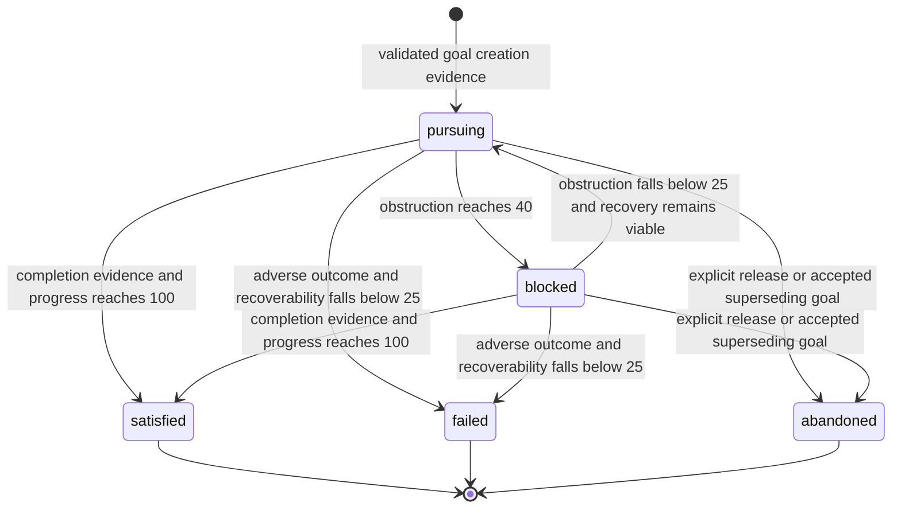
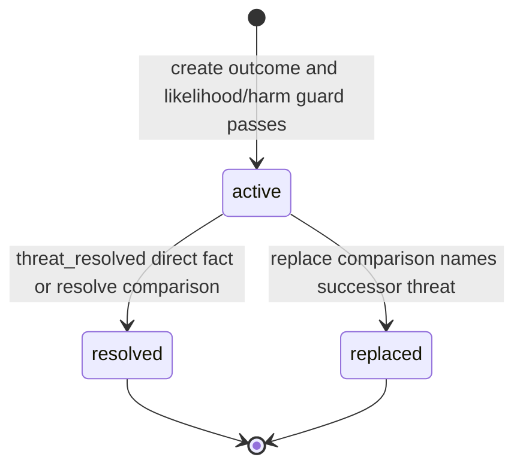
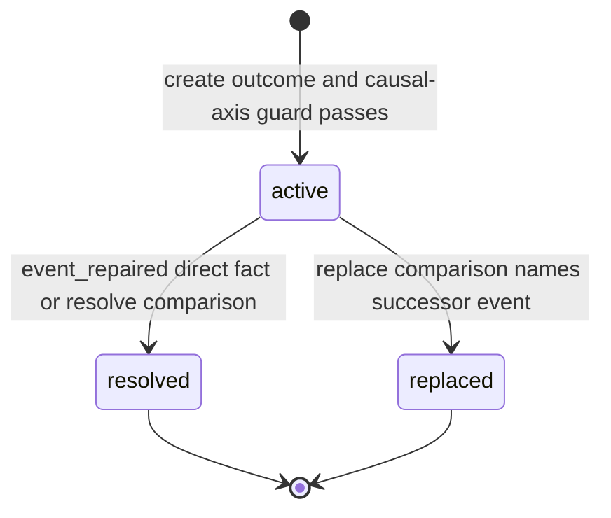
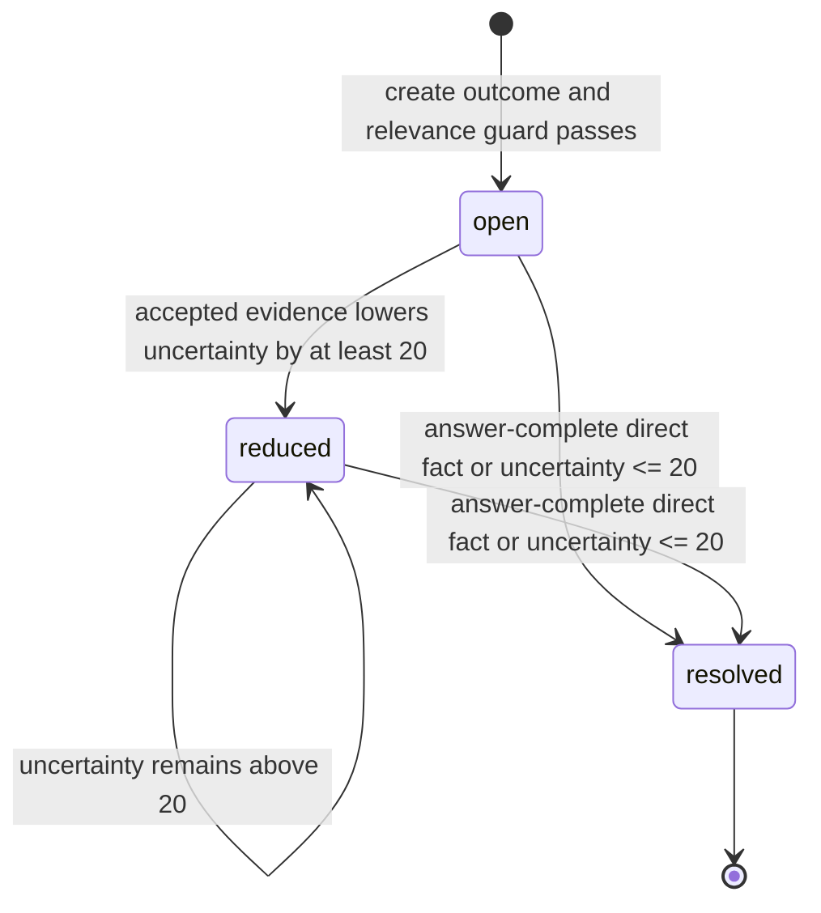
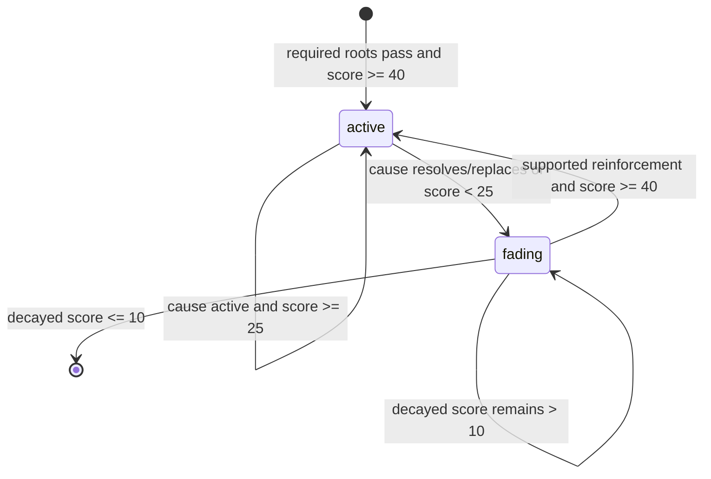

# Cognition Core V2 Stage 2 Contract Specification

## Document Control

- Parent plan: `cognition_core_v2_stage_2_integration_plan.md`
- Status: mandatory frozen companion to the parent plan
- Authority: this specification is executable only when the parent plan is
  `approved` or `in_progress`
- Precedence: for Stage 2, this specification and the parent plan supersede
  conflicting package, affinity, persistence, and execution-flow statements in
  `development_plans/reference/designs/kazusa_parallel_cognition_architecture.md`
- Change rule: changing a type, range, state transition, emotion rule, branch,
  public signature, failure result, or call cap reopens Alignment Gate A and
  requires a plan update before production implementation continues

## 1. Frozen Ownership Boundary

```text
typed episode + validated state + evidence
  -> immediate deterministic reducer
  -> preliminary emotion derivation and ready goal branches
  -> dependency-ready scoped semantic appraisal where meaning is unresolved
  -> final deterministic reducer for accepted propositions/deltas
  -> final emotion derivation and newly enabled goal branches
  -> parallel goal cognition with isolated result slots
  -> validated workspace collapse
  -> route-only action selection
  -> one validated state update + semantic projections
  -> persistence
  -> V2 L3 surface planning
  -> dialog final wording
```

Deterministic work never waits for unrelated LLM work. LLM branches are
read-only over persistent state. The reducer is the only state-mutation owner.
Dialog, consolidation prose, reflection prose, residue, and LLM-authored
emotion words never become state authority.

## 2. Two-Phase Internal Flow

```mermaid
flowchart LR
    subgraph UP[Upstream modules]
        U1[Brain and persona graph<br/>CognitiveEpisode]
        U2[RAG and resolver<br/>bounded evidence]
        U3[DB facades<br/>one mutable state and read-only constraints]
        U4[Task scheduler reflection self-cognition<br/>typed source events]
    end

    subgraph CORE[Cognition Core V2]
        C0[Validate V2 input]
        C1[Read-only episode snapshot]
        C2[Elapsed-time reduction]
        C3[Trusted direct-fact reduction]
        C4[Deterministic event-to-cause match]
        C5[Preliminary emotion derivation]
        C6[Preliminary goal branch activation]
        C7[Semantic source planner]
        C8[Parallel scoped appraisals]
        C9[Validate unique target deltas and propositions]
        C10[Final guarded reduction]
        C11[Final emotion derivation]
        C12[Add newly enabled goal branches]
        C13[Validate dependency DAG]
        C14[Parallel goal cognition<br/>branch_results by branch_id]
        C15[Validate complete bids]
        C16[Read-only collapse]
        C17[Route-only action selection]
        C18[One StateUpdateV2 and semantic projections]
        C19[Run text surface planning]

        C0 --> C1 --> C2 --> C3 --> C4
        C4 --> C5 --> C6
        C4 --> C7 --> C8 --> C9 --> C10 --> C11 --> C12
        C6 --> C13
        C12 --> C13
        C13 --> C14 --> C15 --> C16 --> C17 --> C18
    end

    subgraph DOWN[Downstream modules]
        D1[DB persistence<br/>commit one state scope]
        D2[Resolver and ActionSpec<br/>deterministic execution]
        D3[Dialog<br/>final wording]
        D4[Consolidation scheduler reflection<br/>later typed outcomes]
        D5[Protected diagnostics and test evidence]
    end

    UP --> C0
    C18 --> D1
    D1 --> D2
    D2 --> C19
    C19 --> D3
    D2 --> D4
    C18 --> D5
    C19 --> D5
```



The source planner may dispatch appraisals while preliminary branches run.
Final branch activation adds branches and never cancels a preliminary branch
whose activation was valid against the preliminary snapshot. A branch that
depends on a semantic proposition waits for that proposition. Other branches
continue.

`run_cognition(...)` ends at `C18`. The caller validates and commits `D1`,
then prepares the deterministic resolver/ActionSpec result at `D2`, and only
then calls `run_text_surface_planning(...)` at `C19` when the route/output mode
requires a text surface. This is the only allowed live ordering. A speech or
silence route gives `D2` an empty permitted-action result list; both cross the
same persistence boundary, and silence skips `C19`.

## 3. Scalar Rules

- Unsigned causal axes are integers in `0..100`.
- Signed relationship and outcome axes are integers in `-100..100`.
- Booleans are Python `bool`; strings are non-empty after trimming.
- Timestamps are ISO-8601 UTC strings ending in `Z`.
- `null` is invalid. Inapplicable optional fields are omitted.
- Stable relationship, drive-importance, standard-importance, and meaning axes
  accept at most `10` points of change from one accepted event.
- Transient salience, pressure, obstruction, progress, threat, event, and
  knowledge-gap axes accept at most `40` points of change from one accepted
  event.
- Every accepted LLM delta is an integer in `-40..40`, targets one allowlisted
  transient or stable axis, and is also constrained by the target's per-event
  limit. Duplicate delta targets from parallel appraisals invalidate all
  proposals for that target; they are never applied in completion order.
- Those per-event limits govern semantic deltas. Section 12's fixed direct-fact
  transitions apply their stated absolute values.
- Reducer application order is: elapsed time, trusted direct facts sorted by
  source order, accepted semantic deltas sorted by target path, lifecycle
  transition, emotion derivation, retention pruning.

Semantic deltas may target only these path patterns, where `{id}` is a handle
already present in the prompt:

```text
relationship.positive_regard
relationship.trust
relationship.attachment
relationship.desired_closeness
relationship.perceived_closeness
relationship.care
relationship.boundary_safety
relationship.exclusivity
relationship.unresolved_injury
goals.{id}.obstruction
goals.{id}.expected_success
goals.{id}.controllability
goals.{id}.recoverability
goals.{id}.urgency
threats.{id}.likelihood
threats.{id}.expected_harm
threats.{id}.uncertainty
threats.{id}.controllability
threats.{id}.coping_potential
threats.{id}.residual_pressure
active_events.{id}.outcome_impact
active_events.{id}.responsibility
active_events.{id}.intentionality
active_events.{id}.harm
active_events.{id}.unfairness
active_events.{id}.exposure
active_events.{id}.repair_need
active_events.{id}.reparability
active_events.{id}.expectation_mismatch
active_events.{id}.norm_violation
active_events.{id}.contamination_risk
active_events.{id}.identity_threat
active_events.{id}.comparison_gap
active_events.{id}.vastness
active_events.{id}.memory_warmth
active_events.{id}.temporal_loss
knowledge_gaps.{id}.relevance
knowledge_gaps.{id}.uncertainty
knowledge_gaps.{id}.learnability
knowledge_gaps.{id}.novelty
knowledge_gaps.{id}.model_accommodation
drives.{id}.pressure
meaning_state.purpose_coherence
meaning_state.agency
meaning_state.identity_continuity
```

LLM deltas cannot target familiarity, progress, importance, statuses,
timestamps, evidence, ids, salience, activation rows, or
`low_coherence_since`. Trusted
direct facts use only the fixed transition table in Section 12; callers cannot
supply arbitrary state paths or emotion activations.

Salience is reducer-owned. A newly created event, threat, or knowledge gap gets
the maximum absolute value of its accepted causal axes; a new goal gets its
initial importance; acquaintance relationship and character meaning start at
their frozen defaults. On a matched update, add the largest absolute accepted
axis delta to the elapsed-decayed salience, capped at `100` and by the transient
per-event limit. Elapsed time and sleep then reduce salience as Section 10
defines. Semantic output cannot set or restore salience directly.

## 4. Common Types

### `EntityRefV2`

```text
scope: "user" | "character"
kind: "relationship" | "goal" | "threat" | "event" |
      "knowledge_gap" | "drive" | "standard" | "meaning"
entity_id: str
```

### `RoleRefV2`

```text
role: "actor" | "experiencer" | "target" | "object" |
      "affected_goal" | "affected_relationship"
entity_kind: "character" | "user" | "group" | "third_party" |
             "goal" | "relationship" | "standard" | "object"
entity_id: str
```

### `EvidenceRefV2`

```text
source_kind: "episode" | "action_result" | "resolver_observation" |
             "accepted_task_result" | "scheduler_event" |
             "promoted_memory" | "promoted_reflection" |
             "media_observation"
source_id: str
occurred_at: ISO-8601 UTC str
semantic_summary: free-form str, 1..500 characters
```

`source_id`, entity ids, timestamps, and control values remain outside LLM
messages. `semantic_summary` may be projected when the branch is authorized to
see that evidence.

### Common causal-entity fields

Every goal, threat, event, and knowledge gap contains:

```text
entity_id: str
description: free-form str, 1..500 characters
salience: int 0..100
role_refs: list[RoleRefV2], maximum 8
evidence_refs: list[EvidenceRefV2], maximum 8
created_at: ISO-8601 UTC str
updated_at: ISO-8601 UTC str
```

Descriptions explain state and remain free-form. Deterministic matching uses
references, axes, status, and evidence provenance.

Entity ids are code-owned. On a `create` comparison, the reducer sets
`<kind>:<digest>`, where `<kind>` is `event`, `threat`, or `knowledge_gap` and
`<digest>` is the first 24 lowercase hexadecimal characters of SHA-256 over:

```text
schema_version + "|" + state_scope + "|" + owner_key + "|" +
primary_evidence.source_kind + "|" + primary_evidence.source_id
```

The primary evidence is the first evidence row in source order. A matching
existing entity retains its id. Prompt-local handles map to these internal
refs; ids and digest inputs remain outside model messages.

## 5. Persistent State Ownership

Each cognition episode has exactly one mutable scope:

- `state_scope="user"`: mutate one user's relationship-scoped cognition state;
  character drives, standards, and meaning are read-only constraints.
- `state_scope="character"`: mutate the singleton character cognition state;
  any user relationship summaries are read-only evidence.

`run_cognition` emits one `StateUpdateV2`. It never emits simultaneous user and
character writes. A causal entity is stored only in its mutable scope. An
activation is stored with its primary root; cross-scope roots are references,
not duplicated entities.

Mongo storage locations are fixed:

- user state: `user_profiles.cognition_state` in the existing user profile
  document identified by `global_user_id`;
- character state: `character_state.cognition_state` in the existing singleton
  document with `_id="global"`.

`StateUpdateV2.owner_key` is the exact `global_user_id` for user scope and the
literal `global` for character scope.

The caller selects scope before loading state. The LLM never selects or changes
scope:

| Episode/caller | Mutable scope and owner |
|---|---|
| Persona `user_message`, including private and group turns | `user`; `target_scope.current_global_user_id` |
| `accepted_task_result_ready` or background result with a requester | `user`; requester `global_user_id` |
| Resolver recurrence | Inherit the originating episode's scope and owner |
| Self-cognition case with an exact target user | `user`; that target `global_user_id` |
| Self-cognition without a target user | `character`; `global` |
| Reflection dry run or `internal_thought_cognition` | `character`; `global` |
| Scheduler/recall event with an exact target user | `user`; that target `global_user_id` |
| Scheduler/recall event without a target user, or `system_probe` | `character`; `global` |

A group episode mutates only the current sender's user state. Other users and
relationships remain evidence. A missing owner required by a user-scoped row
raises `CognitionContractError`; it never falls back to character scope.

### User state

```text
schema_version: Literal["cognition_state.v2"]
state_scope: Literal["user"]
owner_user_id: str
updated_at: ISO-8601 UTC str
relationship: RelationshipStateV2
goals: list[GoalStateV2], maximum 16
threats: list[ThreatStateV2], maximum 16
active_events: list[CausalEventStateV2], maximum 32
knowledge_gaps: list[KnowledgeGapStateV2], maximum 16
affect_activations: list[EmotionActivationV2], maximum 32
```

### Character state

```text
schema_version: Literal["cognition_state.v2"]
state_scope: Literal["character"]
updated_at: ISO-8601 UTC str
drives: dict[DriveId, DriveStateV2]
standards: list[StandardStateV2], maximum 16; initialized with the five defaults
meaning_state: MeaningStateV2
goals: list[GoalStateV2], maximum 16
threats: list[ThreatStateV2], maximum 16
active_events: list[CausalEventStateV2], maximum 32
knowledge_gaps: list[KnowledgeGapStateV2], maximum 16
affect_activations: list[EmotionActivationV2], maximum 32
```

When a list reaches its maximum, prune unreferenced terminal entities from
oldest to newest. An entity referenced by an active or fading activation is not
pruned. If every row is protected, reject creation of another row and record a
capacity diagnostic; never delete an active cause.

## 6. Entity Shapes

### `RelationshipStateV2`

```text
relationship_id: str
other_user_id: str
familiarity: int 0..100
positive_regard: int -100..100
trust: int -100..100
attachment: int 0..100
desired_closeness: int 0..100
perceived_closeness: int 0..100
care: int 0..100
boundary_safety: int -100..100
exclusivity: int 0..100
unresolved_injury: int 0..100
salience: int 0..100
updated_at: ISO-8601 UTC str
evidence_refs: list[EvidenceRefV2], maximum 8
```

Acquaintance default:

```json
{
  "familiarity": 10,
  "positive_regard": 0,
  "trust": 0,
  "attachment": 0,
  "desired_closeness": 10,
  "perceived_closeness": 10,
  "care": 0,
  "boundary_safety": 0,
  "exclusivity": 0,
  "unresolved_injury": 0,
  "salience": 0
}
```

For a new user, construct the full state without an LLM call:

```text
schema_version = "cognition_state.v2"
state_scope = "user"
owner_user_id = <exact global_user_id>
updated_at = <episode storage_timestamp_utc>
relationship.relationship_id = "relationship:user:" + global_user_id
relationship.other_user_id = <exact global_user_id>
relationship.updated_at = <episode storage_timestamp_utc>
relationship.evidence_refs = []
relationship numeric axes = acquaintance default above
goals = threats = active_events = knowledge_gaps = affect_activations = []
```

### `GoalStateV2`

```text
common causal-entity fields
goal_kind: "ordinary_response" | "relationship_connection" |
           "bond_protection" | "trust_verification" |
           "autonomy_boundary" | "safety" | "obstruction_resolution" |
           "loss_recovery" | "moral_repair" | "social_care" |
           "reciprocity" | "epistemic_exploration" |
           "meaning_reconstruction" | "self_improvement"
status: "pursuing" | "blocked" | "satisfied" | "failed" | "abandoned"
importance: int 0..100
progress: int 0..100
obstruction: int 0..100
expected_success: int 0..100
controllability: int 0..100
recoverability: int 0..100
urgency: int 0..100
```



Age alone never satisfies, fails, or abandons a goal. A credible risk is a
linked `ThreatStateV2`; it does not add another goal status. Terminal goals are
retained until no activation references them, then become eligible for pruning.

### Deterministic goal creation and activation

Except for `ordinary_response`, a registered branch is activated by a
`GoalStateV2`, never by an emotion label. When a rule below passes and no goal
with the same kind and primary root exists, the reducer creates a `pursuing`
goal with entity id
`goal:<goal_kind>:<primary_root_scope>:<primary_root_entity_id>`. Repeated input
updates the existing goal and never creates a duplicate. `ordinary_response` is
an episode-local system goal and is not persisted.

| Goal kind | Creation/activation guard | Initial importance |
|---|---|---|
| `relationship_connection` | Relationship salience at least 40 and attachment, care, or desired-closeness gap at least 40 | maximum of attachment, care, and closeness gap |
| `bond_protection` | Active threat affects a relationship with attachment at least 40 | maximum of attachment and threat expected harm |
| `trust_verification` | Active relationship threat has uncertainty at least 40 | maximum of relationship attachment and threat uncertainty |
| `autonomy_boundary` | Boundary safety is below `-20`, or active event identity threat/unfairness is at least 40 | maximum of autonomy importance, identity threat, and unfairness |
| `safety` | Active threat has likelihood and expected harm at least 25, plus uncertainty or coping deficit at least 25 | maximum of expected harm and safety-drive importance |
| `obstruction_resolution` | Existing important goal has obstruction at least 40 | obstructed goal importance |
| `loss_recovery` | Goal failed or negative outcome impact is at least 40 in magnitude | maximum of failed-goal importance and loss magnitude |
| `moral_repair` | Self-caused event has repair need at least 40 and harm or norm violation at least 40 | maximum of integrity importance and repair need |
| `social_care` | Other experiencer has harm/pressure at least 40 and care importance is at least 40 | maximum of care importance and other harm/pressure |
| `reciprocity` | Other-caused positive outcome and responsibility are both at least 40 | positive outcome impact |
| `epistemic_exploration` | Open knowledge gap has relevance and learnability at least 40 | maximum of gap relevance and exploration importance |
| `meaning_reconstruction` | Purpose coherence or agency below 40 with meaning pressure at least 40 | maximum of meaning pressure and the coherence/agency deficit |
| `self_improvement` | Comparison gap at least 40 and competence pressure or related goal importance at least 40 | maximum of comparison gap and competence pressure |

The reducer sets initial `progress=0`, `obstruction=0`, `expected_success=50`,
`controllability=50`, `recoverability=50`, and `urgency` equal to the primary
root's salience. Subsequent typed outcomes or accepted allowlisted deltas update
these axes. The branch builder selects only `pursuing` and `blocked` goals;
blocked goals activate their strategy/repair branch rather than disappearing.

### `ThreatStateV2`

```text
common causal-entity fields
status: "active" | "resolved" | "replaced"
likelihood: int 0..100
expected_harm: int 0..100
uncertainty: int 0..100
controllability: int 0..100
coping_potential: int 0..100
residual_pressure: int 0..100
```



`resolved` requires `residual_pressure <= 20`; the direct-fact transition sets
it to `0`. A replaced threat stores the successor reference in the comparison
result. Terminal threats remain terminal; later credible risk creates or
reinforces an active threat entity.

### `CausalEventStateV2`

```text
common causal-entity fields
status: "active" | "resolved" | "replaced"
outcome_impact: int -100..100
responsibility: int 0..100
intentionality: int 0..100
harm: int 0..100
unfairness: int 0..100
exposure: int 0..100
repair_need: int 0..100
reparability: int 0..100
expectation_mismatch: int 0..100
norm_violation: int 0..100
contamination_risk: int 0..100
identity_threat: int 0..100
comparison_gap: int 0..100
vastness: int 0..100
memory_warmth: int 0..100
temporal_loss: int 0..100
```

Unused axes remain `0`; optional axes are not omitted because deterministic
formulas require a stable event shape. A memory-sourced event requires a
`promoted_memory` evidence reference and a separate current-cue evidence
reference.



An event resolves only through typed completion, repair, or safety evidence or
a deterministic `resolve` comparison. Reduced salience alone leaves its status
unchanged. Terminal events remain terminal.

### `KnowledgeGapStateV2`

```text
common causal-entity fields
status: "open" | "reduced" | "resolved"
relevance: int 0..100
uncertainty: int 0..100
learnability: int 0..100
novelty: int 0..100
model_accommodation: int 0..100
```



`reduced` remains reduced until resolution. Materially different uncertainty
creates a new knowledge-gap entity with separate evidence.

### Character constraints

```text
DriveId: "autonomy" | "connection" | "safety" | "competence" |
         "care" | "integrity" | "exploration" | "meaning"
DriveStateV2: {importance: int 0..100, pressure: int 0..100}
StandardStateV2: {
  standard_id: "honesty" | "avoid_harm" | "respect_boundaries" |
               "follow_through" | "self_respect",
  description: free-form str,
  importance: int 0..100
}
MeaningStateV2: {
  purpose_coherence: int 0..100,
  agency: int 0..100,
  identity_continuity: int 0..100,
  salience: int 0..100,
  low_coherence_since: NotRequired[ISO-8601 UTC str]
}
```

The reducer sets `low_coherence_since` on the first transition where both
`purpose_coherence < 40` and `agency < 40`. It removes that field when either
axis reaches `40`. Only a continuously present timestamp at least 24 hours old
can satisfy the existential-angst duration guard.

Character production default:

```json
{
  "drives": {
    "autonomy": {"importance": 75, "pressure": 20},
    "connection": {"importance": 70, "pressure": 20},
    "safety": {"importance": 65, "pressure": 15},
    "competence": {"importance": 70, "pressure": 20},
    "care": {"importance": 80, "pressure": 20},
    "integrity": {"importance": 80, "pressure": 15},
    "exploration": {"importance": 65, "pressure": 20},
    "meaning": {"importance": 70, "pressure": 15}
  },
  "standards": [
    {"standard_id": "honesty", "description": "be truthful", "importance": 80},
    {"standard_id": "avoid_harm", "description": "avoid causing needless harm", "importance": 85},
    {"standard_id": "respect_boundaries", "description": "respect personal boundaries", "importance": 85},
    {"standard_id": "follow_through", "description": "honor accepted commitments", "importance": 80},
    {"standard_id": "self_respect", "description": "protect dignity and autonomy", "importance": 75}
  ],
  "meaning_state": {
    "purpose_coherence": 70,
    "agency": 70,
    "identity_continuity": 80,
    "salience": 0
  },
  "goals": [],
  "threats": [],
  "active_events": [],
  "knowledge_gaps": [],
  "affect_activations": []
}
```

These values are fixed Stage 2 defaults, not a calibration system.

The bootstrap wraps that object with
`schema_version="cognition_state.v2"`, `state_scope="character"`, and
`updated_at=<bootstrap UTC time>`. The singleton key is exactly `global`; all
lists shown above start empty, and `low_coherence_since` is omitted.

## 7. Event Comparison

The matcher uses references and accepted propositions, never description text.
For each current event and stored entity, it emits exactly one outcome:

| Outcome | Deterministic guard |
|---|---|
| `reinforce` | Same affected entity plus compatible actor/experiencer/target refs, and accepted evidence changes the same causal axes in the same direction. |
| `contradict` | Same affected entity and accepted evidence invalidates or reverses a stored proposition without establishing completion. |
| `resolve` | Same affected entity and typed completion, repair, safety, or obstruction-removal evidence passes the entity's terminal/reduction guard. |
| `replace` | Same affected entity and explicit supersession evidence names the old and new causal objects. |
| `create` | No existing entity matches, the event has at least one valid causal axis, and salience is at least 25. |
| `unrelated` | None of the preceding guards pass. |

Ambiguous user-language meaning cannot directly select an outcome. A scoped
appraisal may emit role selections, propositions, and deltas against prompt
handles; the matcher then applies this table.

## 8. Emotion Activation Lifecycle

`EmotionActivationV2` is a derived, validated cache. Causal entities remain the
authority.

```text
activation_id: "emotion:" + emotion_id
emotion_id: one of the 21 registry ids
primary_root: EntityRefV2 in the mutable state scope
root_refs: list[EntityRefV2], 1..8
phase: "active" | "fading"
score: int 0..100
peak_score: int 0..100
trend: "rising" | "stable" | "falling"
cause_status: "active" | "resolved" | "replaced"
started_at: ISO-8601 UTC str
updated_at: ISO-8601 UTC str
last_reinforced_at: ISO-8601 UTC str
```

Each state scope contains at most one activation row per emotion id. For every
derivation pass, candidate causes are ordered by candidate score descending,
primary-root salience descending, then the lexical
`scope:kind:entity_id` reference. The first candidate becomes `primary_root`;
up to eight passing candidates become `root_refs` in that order. This preserves
multiple causes without introducing per-cause emotion rows, and bounds the
cache to the twenty-one registry entries.

The activation `score` is the first candidate's score; candidates do not sum.
`peak_score` is the maximum score observed during the row's current lifetime.

`cause_status` is `active` when any retained root is active, `replaced` when no
root is active and at least one is replaced, and `resolved` otherwise. A new
passing cause can replace the primary root while the activation stays active;
the lifecycle follows the aggregated score and cause status.

No row represents absence. The generic transition constants are:

```text
BEGIN_THRESHOLD = 40
SUSTAIN_THRESHOLD = 25
INACTIVE_THRESHOLD = 10
REINFORCEMENT_DELTA = 10
```



Trend is `rising` when the score increases by at least 4, `falling` when it
decreases by at least 4, and `stable` otherwise. Reinforcement updates
`last_reinforced_at` only when the matched outcome is `reinforce` and the score
increases by at least 10.

Formula notation:

```text
P(x) = max(x, 0) for signed positive axes
N(x) = max(-x, 0) for signed negative axes
G(a, b) = max(a - b, 0)
C(a, ...) = min(a, ...)
A(a, ...) = max(a, ...)
M(a, ...) = integer floor average
all results clamp to 0..100
```

## 9. Frozen Twenty-One-Emotion Registry

`self` means the active character. `other` means another experiencer or actor
identified by role refs. Every formula also requires the primary root's
salience unless the row names another salience source.

| Emotion id | Required roots and guard | Candidate score | Fade rate |
|---|---|---|---:|
| `joy` | Positive event or satisfied/progressing important goal | `C(A(P(event.outcome_impact), goal.progress), A(goal.importance, event.salience), salience)` | 4/hour |
| `fear` | Active threat | `C(threat.likelihood, threat.expected_harm, A(threat.uncertainty, 100-threat.coping_potential), threat.salience)` | 4/hour |
| `anger` | Important obstruction, unfair harm, or boundary injury | `C(A(goal.importance, event.harm, relationship.unresolved_injury), A(goal.obstruction, event.unfairness, event.intentionality), salience)` | 4/hour |
| `sadness` | Loss event or failed goal | `C(A(N(event.outcome_impact), 100-goal.recoverability), A(goal.importance, relationship.attachment, N(event.outcome_impact)), salience)` | 1/hour |
| `disgust` | Contamination or norm violation with a target/object ref | `C(A(event.contamination_risk, event.norm_violation), salience)` | 4/hour |
| `surprise` | Expectation mismatch | `C(event.expectation_mismatch, salience)` | 12/hour |
| `love_attachment` | Relationship attachment or care at least 40 | `C(A(relationship.attachment, relationship.care), A(P(relationship.positive_regard), P(relationship.trust)), relationship.salience)` | 1/hour |
| `compassion_empathy` | Other experiencer suffers harm/pressure and care drive is active | `C(character.drives["care"].importance, A(event.harm, threat.residual_pressure), salience)` | 1/hour |
| `gratitude` | Other actor caused a positive outcome | `C(event.responsibility, P(event.outcome_impact), salience)` | 4/hour |
| `jealousy` | Valued relationship, third-party relationship threat, and attachment at least 40 | `C(relationship.attachment, A(relationship.exclusivity, relationship.desired_closeness), threat.likelihood, threat.salience)` | 4/hour |
| `envy` | Other actor/object owns a desired advantage and comparison gap exists | `C(event.comparison_gap, A(goal.importance, character.drives["competence"].pressure), salience)` | 4/hour |
| `pride` | Self-caused positive outcome, or satisfied goal whose actor role is self | `A(C(event.responsibility, P(event.outcome_impact), event.salience), C(goal.progress, goal.importance, goal.salience))` | 4/hour |
| `shame` | Self responsibility, norm violation, and identity-level negative evaluation | `C(event.responsibility, event.norm_violation, A(event.identity_threat, event.exposure), salience)` | 1/hour |
| `guilt` | Self responsibility plus harm/norm violation and repair need | `C(event.responsibility, A(event.harm, event.norm_violation), event.repair_need, salience)` | 1/hour |
| `embarrassment` | Self responsibility, exposure, expectation mismatch, `harm < 40`, `identity_threat < 50` | `C(event.responsibility, event.exposure, event.expectation_mismatch, salience)` | 12/hour |
| `curiosity` | Open relevant and learnable knowledge gap | `C(gap.relevance, gap.uncertainty, gap.learnability, A(gap.novelty, gap.model_accommodation), gap.salience)` | 4/hour |
| `awe` | Vast event and major model accommodation | `C(event.vastness, A(gap.model_accommodation, gap.novelty), salience)` | 12/hour |
| `nostalgia` | Memory-sourced event, current cue, warmth, temporal loss | `C(event.memory_warmth, event.temporal_loss, character.meaning_state.identity_continuity, salience)` | 1/hour |
| `loneliness` | Connection pressure and desired/perceived closeness gap | `C(character.drives["connection"].pressure, G(relationship.desired_closeness, relationship.perceived_closeness), A(relationship.attachment, relationship.care, relationship.salience))` | 1/hour |
| `relief` | Prior threat/pressure at least 40 and accepted reduction at least 20 | `C(prior_pressure, prior_pressure-current_pressure, salience)` | 12/hour |
| `ennui_existential_angst` | Low purpose and agency persisted for at least 24 hours, meaning pressure active | `C(100-character.meaning_state.purpose_coherence, 100-character.meaning_state.agency, character.drives["meaning"].pressure, character.meaning_state.salience)` | 1/hour |

An absent alias evaluates to `0`. `salience` means the primary root's salience.
The required-root guard is evaluated before the formula, so a formula cannot
substitute a different root to make the score pass.

### Adjacent-emotion guard matrix

| Pair/group | Deterministic distinction |
|---|---|
| Joy / pride / gratitude | Pride requires self responsibility; gratitude requires other responsibility; joy requires neither. Multiple may coexist. |
| Fear / surprise | Fear requires an active threat; surprise requires expectation mismatch. |
| Fear / disgust | Disgust requires contamination or norm violation with a target/object. |
| Anger / sadness | Anger requires obstruction, unfairness, or boundary injury; sadness requires loss or failed recovery. |
| Love / jealousy | Jealousy requires a credible third-party relationship threat; love does not. |
| Compassion / personal distress | Compassion requires another experiencer; self-only distress does not activate compassion. |
| Envy / jealousy | Envy targets an advantage/object; jealousy targets a valued relationship. |
| Pride / shame / guilt | Pride requires positive self-caused outcome; shame/guilt require negative self responsibility. |
| Shame / guilt / embarrassment | Shame requires identity threat; guilt requires repair need; embarrassment requires low harm and bounded identity threat. They may coexist when each guard passes. |
| Curiosity / awe / surprise | Curiosity requires a learnable gap; awe requires vastness/accommodation; surprise requires mismatch. |
| Nostalgia / sadness | Nostalgia requires memory source plus present cue and warmth; sadness requires current loss/failure. |
| Loneliness / solitude | Loneliness requires an unmet closeness gap and connection pressure. Physical solitude alone is insufficient. |
| Relief / calm | Relief requires prior pressure and a validated reduction. Low pressure alone is calm, not relief. |
| Existential angst / ordinary boredom | Existential angst requires low meaning state for at least 24 hours. Low topic relevance creates no persistent emotion. |

## 10. Elapsed-Time Evolution

- User state applies elapsed-time decay whenever that user's state loads.
- The decay amount is `floor(elapsed_seconds * rate_per_hour / 3600)`.
- Active unresolved threat, obstruction, harm, or repair causes keep a minimum
  salience of `25`; durable relationships and memories have no minimum felt
  salience.
- Resolved/replaced causes allow activation scores to decay to zero.
- Stable relationship axes never decay by time.
- Character state uses the existing daily sleep schedule. `sleep_recovery`
  applies the same elapsed-time rates and an additional `20`-point reduction
  to transient drive pressure, entity salience, threat residual pressure, and
  active/fading activation score. It never changes drive importance,
  standards, stable relationship state, memory evidence, or unresolved entity
  status.
- Sleep recovery runs once for the existing local-date run key. Re-entry with a
  completed key returns the existing result without another state mutation.

## 11. Semantic Projection

### Numeric bands

| Internal value | Model-facing text |
|---|---|
| unsigned `0` | `none` |
| unsigned `1..20` | `very low` |
| unsigned `21..40` | `low` |
| unsigned `41..60` | `moderate` |
| unsigned `61..80` | `high` |
| unsigned `81..100` | `very high` |
| signed `-100..-61` | `strongly negative` |
| signed `-60..-21` | `negative` |
| signed `-20..20` | `neutral or mixed` |
| signed `21..60` | `positive` |
| signed `61..100` | `strongly positive` |

Direction is `rising`, `stable`, or `falling` using the 4-point trend rule.
Elapsed time is projected as `immediate` under 10 minutes, `recent` under 2
hours, `earlier` under 24 hours, `within recent days` under 7 days, and `older`
otherwise. Lifecycle controls become plain explanations such as `the cause is
still active` or `the feeling is fading after resolution`.

Every LLM message is built from these semantic forms. Raw numbers, timestamps,
ids, enum codes, state documents, list indexes, and operational metadata are
excluded. Prompt tests use unique sentinel values to distinguish forbidden
internal values from legitimate numbers present in user-visible evidence.

Free-form LLM descriptions remain bounded strings and are not validated
against semantic label enums. Only deterministic control fields use enums.

## 12. Trusted Direct-Fact Lane

Direct facts are accepted only from these typed producers:

| Producer | Accepted facts |
|---|---|
| ActionSpec result | exact targeted goal progress/completion/terminal failure/obstruction removal, threat resolution, event repair, or knowledge answer carried by its typed result |
| Resolver observation | the same exact targeted transitions when the capability result directly observed them |
| Accepted-task result | the same exact targeted goal transitions when the task result names the existing goal |
| Scheduler | deadline reached for a named goal, or source occurrence |
| Promoted memory/reflection | approved source identity and occurrence metadata only |

The direct-fact reducer accepts exactly these transitions:

| `fact_kind` | Required target | Deterministic state effect |
|---|---|---|
| `goal_progress_observed` | one non-terminal goal and `observed_progress` | Set progress to the observed `0..100`; progress `100` transitions to `satisfied`. |
| `goal_completed` | one non-terminal goal | Set progress to `100` and transition to `satisfied`. |
| `goal_terminal_failure` | one non-terminal goal | Set recoverability to `0` and transition to `failed`. |
| `goal_obstruction_removed` | one blocked goal | Set obstruction to `0`; transition to `pursuing` when recovery remains viable. |
| `threat_resolved` | one active threat | Set residual pressure to `0` and transition to `resolved`. |
| `event_repaired` | one active event | Set repair need to `0`, reparability to `100`, and transition to `resolved`. |
| `knowledge_answered` | one open/reduced knowledge gap | Set uncertainty to `0` and transition to `resolved`. |
| `deadline_reached` | one non-terminal goal | Set urgency to `100`; retain the existing goal status. |
| `source_occurred` | one entity or role target | Append evidence only; semantic meaning remains appraisal-owned. |

Any other source/fact combination, wrong target kind, terminal-target mutation,
or extra `observed_progress` field raises `CognitionStateError` before mutation.
Stable relationship, drive, standard, meaning, and emotion values have no
direct-fact write lane.

Media-descriptor content is semantic evidence, not a direct fact. Raw or
decontextualized user language, dialog text, residue prose, and
consolidation/reflection prose are never direct facts. Their meaning, intent,
permission, preference, commitment, responsibility, and social implication are
LLM-owned semantic appraisal. Deterministic code validates structure and
faithfully applies the selected channel; it does not keyword-filter or
reinterpret an accepted semantic decision.

## 13. Public Interfaces

### Episode input types

```text
CognitionEvidenceV2:
  evidence_handle: str matching `e[0-9]+` within one episode
  evidence_ref: EvidenceRefV2
  semantic_text: str, 1..1000 characters
  visible_to: list of semantic-question or branch ids

DirectFactV2:
  fact_id: str
  producer: "action_result" | "resolver_observation" |
            "accepted_task_result" | "scheduler_event" |
            "promoted_source_metadata"
  fact_kind: "goal_progress_observed" | "goal_completed" |
             "goal_terminal_failure" | "goal_obstruction_removed" |
             "threat_resolved" | "event_repaired" |
             "knowledge_answered" | "deadline_reached" |
             "source_occurred"
  target_refs: list[EntityRefV2 | RoleRefV2], 1..8
  evidence_ref: EvidenceRefV2
  observed_progress: NotRequired[int 0..100]

ActionAffordanceV2:
  action_kind: CanonicalActionKind
  capability: free-form semantic str
  permission: free-form semantic str
  target_roles: list[RoleRefV2]

ResolverAffordanceV2:
  capability: ResolverCapability
  semantic_capability: free-form semantic str
  availability: free-form semantic str

SceneContextV2:
  channel_scope: "private" | "group" | "internal"
  character_role: str
  current_user_role: NotRequired[str]
  semantic_scene: str
  semantic_temporal_context: str

CharacterConstraintSnapshotV2:
  drives: dict[DriveId, DriveStateV2]
  standards: list[StandardStateV2]
  meaning_state: MeaningStateV2
```

`CognitionEvidenceV2.semantic_text`, capability, permission, scene, temporal,
and role strings are already semantic projections. Internal ids remain only in
typed deterministic fields and never enter a prompt.

`CanonicalActionKind` means the canonical registered values exported by
`kazusa_ai_chatbot.action_spec`; V2 creates no second action enum. Resolver
`ResolverCapability` means the canonical values exported by
`kazusa_ai_chatbot.cognition_resolver.contracts`. The corresponding existing
availability and permission validators remain authoritative before execution.

### Semantic appraisal types

```text
SemanticQuestionV2:
  question_id: str
  question_kind: "event_agency" | "relationship_social" |
                 "moral_identity" | "goal_threat_outcome" |
                 "epistemic_comparison_memory" |
                 "existential_drive"
  semantic_question: str
  evidence_handles: list[str], 1..8
  permitted_role_handles: list[str]
  permitted_delta_paths: list[str]
  dependencies: list[str]

SemanticAppraisalResultV2:
  question_id: str
  selected_evidence_handles: list[str]
  selected_role_handles: list[str]
  propositions: list[SemanticPropositionV2], maximum 8
  deltas: list[SemanticDeltaV2], maximum 8
  explanation: free-form str, maximum 1000 characters

SemanticPropositionV2:
  proposition_kind: "responsibility" | "intentionality" | "social_meaning" |
                    "norm_meaning" | "relationship_threat" |
                    "comparison_meaning" | "memory_cue" |
                    "meaning_relevance" | "goal_release" |
                    "goal_supersession" | "completion_meaning" |
                    "resolution_meaning"
  subject_handle: str from the prompt
  object_handle: NotRequired[str]
  evidence_handles: list[str], 1..8
  role_assignments: list[SemanticRoleAssignmentV2], maximum 8
  semantic_value: free-form str, 1..200 characters

SemanticRoleAssignmentV2:
  role: "actor" | "experiencer" | "target" | "object" |
        "affected_goal" | "affected_relationship"
  entity_handle: one permitted prompt handle

SemanticDeltaV2:
  target_path: one prompt-allowlisted path
  delta: int -40..40
  evidence_handles: list[str], 1..8
  reason: free-form str, 1..300 characters
```

The source planner has exactly six question families. It creates at most one
question per family and dispatches selected families concurrently:

| Question kind | Owned propositions | Owned delta paths |
|---|---|---|
| `event_agency` | `responsibility`, `intentionality` | `active_events.{id}.responsibility`, `.intentionality` |
| `relationship_social` | `social_meaning`, `relationship_threat` | all `relationship.*` paths in Section 3 |
| `moral_identity` | `norm_meaning` | `active_events.{id}.harm`, `.unfairness`, `.exposure`, `.repair_need`, `.reparability`, `.norm_violation`, `.contamination_risk`, `.identity_threat` |
| `goal_threat_outcome` | `goal_release`, `goal_supersession`, `completion_meaning`, `resolution_meaning` | all `goals.{id}.*` and `threats.{id}.*` paths in Section 3; `active_events.{id}.outcome_impact`, `.expectation_mismatch` |
| `epistemic_comparison_memory` | `comparison_meaning`, `memory_cue` | `active_events.{id}.comparison_gap`, `.vastness`, `.memory_warmth`, `.temporal_loss`; all `knowledge_gaps.{id}.*` paths in Section 3 |
| `existential_drive` | `meaning_relevance` | `drives.{id}.pressure` and all `meaning_state.*` paths in Section 3 |

Each allowlisted delta path has one owner in this table. The planner rejects a
duplicate owner at startup. It selects families by evidence source, without
inspecting user-language keywords:

| Evidence source kind | Selected question kinds |
|---|---|
| `episode`, `promoted_memory`, `promoted_reflection`, `media_observation` | all six |
| `action_result` | `event_agency`, `relationship_social`, `moral_identity`, `goal_threat_outcome` |
| `resolver_observation` | `event_agency`, `relationship_social`, `moral_identity`, `goal_threat_outcome`, `epistemic_comparison_memory` |
| `accepted_task_result` | `event_agency`, `relationship_social`, `moral_identity`, `goal_threat_outcome`, `epistemic_comparison_memory` |
| `scheduler_event` | `goal_threat_outcome` |

Evidence builders populate the question entries in `visible_to` from this
table. They may add authorized branch ids under existing evidence-visibility
policy; they cannot add another question kind or remove a required mapped
question. The planner validates that exact intersection before dispatch.

Only paths inside `mutable_state` enter `permitted_delta_paths`. User scope
therefore treats character drives/meaning as read-only constraints; character
scope treats an optional relationship context as read-only evidence.
Propositions may still reference authorized read-only handles.

For each selected evidence row, the planner makes prompt-local candidates for
one event, one threat, and one knowledge gap with zero axes and the same
evidence ref. It
also exposes authorized existing relationship, goal, standard, drive, and
meaning handles. Candidates enter persistent state only after final deltas and
role assignments pass the Section 7 `create` guard; unused candidates are
discarded. Multiple evidence rows share a family call up to the eight-evidence
cap and retain separate handles. The first eight rows in input source order are
selected when more are eligible. Later evidence remains available to branches
only when already authorized; it cannot replace selected appraisal evidence.

Role assignments map permitted prompt handles to `RoleRefV2` rows. The model
selects semantic roles but receives no internal id. Missing required roles make
that candidate `unrelated`, while other candidate results remain usable.

Transition-bearing propositions remain evidence, not state commands:

- `goal_release` abandons only the named existing pursuing/blocked goal;
- `goal_supersession` abandons the named old goal only when `object_handle`
  names another validated existing pursuing goal;
- `completion_meaning` sets a named non-terminal goal's progress to `100` and
  satisfies it, or sets a named knowledge gap's uncertainty to `0` and resolves
  it; a named event resolves only when its completion guard otherwise passes;
- `resolution_meaning` resolves only a named active threat/event/knowledge gap
  whose Section 6 transition guard passes.

The reducer applies these mappings after structural/evidence/role validation.
The proposition cannot name a new entity, activation, status value, or internal
id.

The model never emits emotion ids, lifecycle values, event-match outcomes,
goal status, branch ids, persistence routes, action permission, or delivery
decisions. Unknown explanatory `semantic_value` text remains valid when the
structural handles and evidence are valid.

Prompt construction is fixed by stage:

- an appraisal prompt contains one `question_kind`, its semantic definition,
  authorized evidence/entity/role handles, and only that family's proposition
  kinds and delta paths; it contains no emotion registry or other family;
- a goal prompt contains one activated goal's semantic projection, required
  dependency results, relevant semantic affect/relationship/constraints,
  authorized evidence/role/action/resolver handles, and the
  `GoalBidDraftV2` schema;
- a collapse prompt contains `bN` handles and bounded semantic projections of
  complete admitted bids, then requests only `WorkspaceDecisionV2`;
- a route prompt contains the primary/supporting `bN` handles, their requested
  semantic routes, and available `aN`/`rN` options, then requests only
  `RouteDecisionV2`;
- a surface prompt receives only the text-surface contract and its semantic
  projections.

Prompt builders reject any raw state field or unregistered payload key before
calling the model.

```python
async def run_cognition(
    input_payload: CognitionCoreInputV2,
    services: CognitionCoreServicesV2,
) -> CognitionCoreOutputV2: ...

async def run_text_surface_planning(
    input_payload: TextSurfaceInputV2,
    services: TextSurfaceServicesV2,
) -> TextSurfaceOutputV2: ...
```

```text
CognitionCoreServicesV2:
  llm: LLInterface
  appraisal_config: LLMCallConfig
  goal_cognition_config: LLMCallConfig
  collapse_config: LLMCallConfig
  action_selection_config: LLMCallConfig

TextSurfaceServicesV2:
  llm: LLInterface
  style_config: LLMCallConfig
  content_plan_config: LLMCallConfig
  preference_config: LLMCallConfig
  visual_config: LLMCallConfig
```

Service bindings are never embedded in `CognitionCoreInputV2`,
`TextSurfaceInputV2`, diagnostics, or persistent state.

### `CognitionCoreInputV2`

```text
schema_version: Literal["cognition_core_input.v2"]
episode: CognitiveEpisode
state_scope: Literal["user", "character"]
mutable_state: UserCognitionStateV2 | CharacterCognitionStateV2
character_constraints: CharacterConstraintSnapshotV2
relationship_context: NotRequired[RelationshipStateV2]
evidence: list[CognitionEvidenceV2]
direct_facts: list[DirectFactV2]
available_actions: list[ActionAffordanceV2]
available_resolver_capabilities: list[ResolverAffordanceV2]
scene_context: SceneContextV2
```

The `state_scope` must match `mutable_state.state_scope`. User scope requires a
relationship. Character scope omits `relationship_context` unless the source
has an authorized user relationship.

### `CognitionCoreOutputV2`

```text
schema_version: Literal["cognition_core_output.v2"]
intention: SelectedIntentionV2
admitted_bid: NotRequired[ActionBidV2]
supporting_bids: list[ActionBidV2]
state_update: StateUpdateV2
affect_projection: list[SemanticAffectProjectionV2]
relationship_projection: NotRequired[SemanticRelationshipProjectionV2]
action_requests: list[SemanticActionRequestV2]
resolver_requests: list[ResolverCapabilityRequestV2]
resolver_progress: ResolverProgressV2
residue: str
expression_policy: ExpressionPolicyV2
diagnostics: CognitionDiagnosticsV2
```

`StateUpdateV2` contains exactly one scope, owner key, validated replacement
state, event-comparison results, and changed paths. It contains no DB handle or
persistence command.

```text
StateUpdateV2:
  state_scope: "user" | "character"
  owner_key: str
  replacement_state: UserCognitionStateV2 | CharacterCognitionStateV2
  comparison_results: list[EventComparisonResultV2]
  changed_paths: list[str]

EventComparisonResultV2:
  current_event_ref: EntityRefV2
  matched_entity_ref: NotRequired[EntityRefV2]
  outcome: "reinforce" | "contradict" | "resolve" | "replace" |
           "create" | "unrelated"
  evidence_refs: list[EvidenceRefV2]

SelectedIntentionV2:
  selected_branch_id: NotRequired[str]
  route: "speech" | "evidence" | "action" | "deferral" | "silence"
  intention: str
  target_roles: list[RoleRefV2]
  reason: str

SemanticActionRequestV2:
  action_kind: CanonicalActionKind
  semantic_goal: str
  target_roles: list[RoleRefV2]
  evidence_handles: list[str]

ResolverCapabilityRequestV2:
  capability: ResolverCapability
  semantic_goal: str
  evidence_handles: list[str]

ResolverProgressV2:
  status: "not_requested" | "pending" | "completed" | "failed"
  semantic_summary: str

ExpressionPolicyV2:
  visibility: "visible" | "private" | "none"
  emotional_tone: free-form semantic str
  intensity: "restrained" | "moderate" | "strong"
  directness: "indirect" | "balanced" | "direct"

SemanticAffectProjectionV2:
  emotion: fixed human-readable registry name
  phase: natural-language phase explanation
  intensity: approved semantic band
  trend: natural-language trend
  cause_summary: free-form semantic str

SemanticRelationshipProjectionV2:
  relationship_summary: free-form semantic str
  axis_summaries: dict[str, str] using approved bands

SemanticActionResultV2:
  action_kind: CanonicalActionKind
  status: "completed" | "failed" | "unavailable"
  semantic_result: str
  target_roles: list[RoleRefV2]

CognitionDiagnosticsV2:
  run_id: str
  stage_status: dict[str, "completed" | "failed" | "skipped"]
  selected_question_count: int
  dispatched_question_count: int
  selected_branch_count: int
  dispatched_branch_count: int
  completed_branch_count: int
  failed_branch_count: int
  overlap_ms: int
  dependency_wait_ms: int
  total_ms: int
  warnings: list[str]
```

`ExpressionPolicyV2` is deterministic output:

- `visibility` is `none` for the silence route, `private` for episode
  `output_mode` `think_only` or `preview`, and `visible` otherwise; a private
  chat with `visible_reply` remains `visible`;
- `intensity` is `restrained` for no/very-low/low affect bands, `moderate` for
  the moderate band, and `strong` for high/very-high bands;
- `directness` is `direct` for selected `autonomy_boundary`, `safety_coping`,
  `obstruction_strategy`, or `moral_repair`; `indirect` for
  `relationship_connection`, `social_care`, `loss_recovery`, or
  `meaning_reconstruction`; and `balanced` for the other registry branches;
- `emotional_tone` is `composed` with no active/fading activation, otherwise a
  semantic phrase formed from the two highest-score registry names, phase, and
  trend, ordered by score then registry order.

The surface model receives this policy and cannot replace its control fields.

`comparison_results` retain input evidence source order. `changed_paths` are
unique and lexically sorted. Entity lists are serialized by `created_at`, then
`entity_id`; activation rows are serialized by registry order. These rules make
replacement documents and deterministic tests independent of parallel
completion order.

Diagnostics are protected deterministic output. Numeric diagnostic values are
never copied to an LLM message; authorized display/export projects them
semantically or retains them as protected operator data.

### Bid and collapse contracts

```text
ActionBidV2:
  branch_id: str
  goal_ref: EntityRefV2
  intention: str
  desired_outcome: str
  concrete_detail: str
  reason: str
  target_roles: list[RoleRefV2]
  evidence_handles: list[str]
  expected_consequences: list[str]
  confidence: free-form semantic str, 1..100 characters
  requested_route: "speech" | "evidence" | "action" | "deferral" | "silence"
  requested_action_kind: NotRequired[CanonicalActionKind]
  requested_resolver_capability: NotRequired[ResolverCapability]

GoalBidDraftV2:
  intention: str
  desired_outcome: str
  concrete_detail: str
  reason: str
  target_role_handles: list[str]
  evidence_handles: list[str]
  expected_consequences: list[str]
  confidence: free-form semantic str, 1..100 characters
  requested_route: "speech" | "evidence" | "action" | "deferral" | "silence"
  requested_action_handle: NotRequired[str]
  requested_resolver_handle: NotRequired[str]

CollapsedIntentionV2:
  primary_branch_id: str
  supporting_branch_ids: list[str]
  suppressed_branch_ids: list[str]
  primary_bid: ActionBidV2
  supporting_bids: list[ActionBidV2]
  competing_bids: list[ActionBidV2]

WorkspaceDecisionV2:
  primary_bid_handle: one admitted prompt-local bid handle
  supporting_bid_handles: admitted prompt-local bid handles
  suppressed_bid_handles: admitted prompt-local bid handles

RouteDecisionV2:
  selected_bid_handle: primary or supporting prompt-local bid handle
  route: that bid's requested_route
  action_handle: NotRequired[str]
  resolver_handle: NotRequired[str]
```

The goal model emits `GoalBidDraftV2`, not `ActionBidV2`. The prompt assigns
semantic role handles, evidence handles, `a1..aN` action handles, and `r1..rN`
resolver handles. Code validates and maps those handles, then injects the
internal `branch_id` and `goal_ref` to construct `ActionBidV2`. Unknown or
cross-prompt handles invalidate that draft.

The collapse prompt assigns `b1`, `b2`, and later handles in registry order;
internal branch/goal ids remain hidden. The model emits only
`WorkspaceDecisionV2`. The three handle lists form an exact, duplicate-free
partition of admitted bids; deterministic code maps handles back to branch ids
and copies complete bids into `CollapsedIntentionV2`. A supporting bid must
request the same route as the primary bid; a different route is competing. The
route model emits only `RouteDecisionV2` using the same handles. Deterministic
code copies `intention`, `reason`,
target roles, details, consequences, and evidence from the selected complete
bid into `SelectedIntentionV2` and `admitted_bid`. No collapse or route output
can author those fields. LLM-authored `desired_outcome` text remains
branch-local and cannot create or mutate `GoalStateV2`.

An `action` bid includes exactly one `requested_action_kind` present in
`available_actions`; an `evidence` bid includes exactly one
`requested_resolver_capability`. Other routes omit both fields. The route
prompt assigns fresh action/resolver handles and the route decision can select
only the handle mapped to the selected bid's declared value. Availability,
permission, and capability validation runs again deterministically before a
request is emitted.

The existing `CognitiveEpisode.output_mode` contract remains a hard route
constraint. A route that would create a visible surface or executable request
outside that mode is invalidated before persistence; no V2-specific override is
introduced.

When no valid bid remains, code omits `selected_branch_id`, sets
`route="silence"`, `intention="remain silent"`, `reason="no valid admitted
bid"`, and `target_roles=[]`; `admitted_bid` is omitted and neither collapse
nor route selection calls run.

### Text surface contracts

```text
SurfaceBidProjectionV2:
  motive: semantic goal-kind projection
  intention: str copied from selected bid
  desired_outcome: str copied from selected bid
  permitted_detail: str copied from selected bid after visibility policy
  target_summaries: list[str]
  expected_consequences: list[str]

TextSurfaceInputV2:
  schema_version: Literal["text_surface_input.v2"]
  episode: CognitiveEpisode
  intention: SelectedIntentionV2
  primary_bid: NotRequired[SurfaceBidProjectionV2]
  supporting_bids: list[SurfaceBidProjectionV2]
  expression_policy: ExpressionPolicyV2
  semantic_affect: list[SemanticAffectProjectionV2]
  semantic_relationship: NotRequired[SemanticRelationshipProjectionV2]
  permitted_action_results: list[SemanticActionResultV2]
  interaction_style_context: str

TextSurfaceOutputV2:
  schema_version: Literal["text_surface_output.v2"]
  content_plan: str
  visible_boundaries: list[str]
  addressee_plan: list[str]
  style_guidance: str
  pacing_guidance: str
  selected_surface_intent: str
```

Dialog receives only `TextSurfaceOutputV2`, visible episode grounding, and
allowed action results. It receives no raw state or private branch payload.
`SurfaceBidProjectionV2` removes branch/goal ids, evidence handles, confidence,
private reasons, suppressed bids, and details disallowed by
`ExpressionPolicyV2`; target refs are converted to semantic role summaries.

## 14. Goal Branch Registry

The frozen production registry contains fourteen branches and
`MAX_GOAL_BRANCHES = 14`.

| Branch id | Activating goal kind | Dependencies |
|---|---|---|
| `ordinary_response` | Every cognition episode; it may bid speech, silence, or private handling | none |
| `relationship_connection` | `relationship_connection` | new/changed current root: `relationship_social` |
| `bond_protection` | `bond_protection` | new/changed current root: `relationship_social`, `goal_threat_outcome` |
| `trust_verification` | `trust_verification` | new/changed current root: `relationship_social`, `goal_threat_outcome` |
| `autonomy_boundary` | `autonomy_boundary` | new/changed current root: the contributing `relationship_social` or `moral_identity` result |
| `safety_coping` | `safety` | new/changed current root: `goal_threat_outcome` |
| `obstruction_strategy` | `obstruction_resolution` | new/changed current root: `goal_threat_outcome` |
| `loss_recovery` | `loss_recovery` | new/changed current root: `goal_threat_outcome` |
| `moral_repair` | `moral_repair` | new/changed current root: `event_agency`, `moral_identity` |
| `social_care` | `social_care` | new/changed current root: `event_agency` plus the contributing `moral_identity` or `goal_threat_outcome` result |
| `reciprocal_response` | `reciprocity` | new/changed current root: `event_agency`, `goal_threat_outcome` |
| `epistemic_exploration` | `epistemic_exploration` | new/changed current root: `epistemic_comparison_memory` |
| `meaning_reconstruction` | `meaning_reconstruction` | new/changed current root: `existential_drive` |
| `self_improvement` | `self_improvement` | new/changed current root: `epistemic_comparison_memory` |

An already-active goal from the preliminary snapshot has no current-appraisal
dependency. A goal created or changed by the current event receives the exact
question dependencies in this table, limited to results that actually changed
its root/guard. The registry adds no unconditional branch-to-branch dependency.
For the jealousy fixture, `ordinary_response` starts immediately;
`autonomy_boundary` can start after its contributing appraisal; and
`bond_protection`/`trust_verification` start together after their two shared
question results. No branch waits for an unrelated question family.

Each branch writes only `branch_results[branch_id]`. Branches receive immutable
semantic projections and cannot write state or another result slot. The code
contains no semaphore or code-owned concurrent-call cap; the configured LLM
service owns simultaneous request capacity.

## 15. LLM Call and Context Budget

```text
MAX_SEMANTIC_QUESTIONS_PER_EPISODE = 6
MAX_GOAL_BRANCHES = 14
semantic appraisal total prompt cap = 8,000 characters per call
goal branch total prompt cap = 24,000 characters per call
collapse total prompt cap = 24,000 characters
route-selection total prompt cap = 12,000 characters
all calls remain below the 50,000-token model context cap
```

| Call family | Count | Blocking rule |
|---|---:|---|
| Scoped appraisal | `0..6` | Only semantic-dependent reducers/branches wait for their declared handle. |
| Goal cognition | `1..14` | Dependency-ready branches overlap. |
| Collapse | `0..1` | Zero with one admitted bid; one with multiple bids. |
| Route selection | `0..1` | Zero when no valid bid remains; otherwise waits for admitted/collapsed intention. |
| V2 L3 | `0..4` | Zero when no text surface is permitted; otherwise runs after state persistence and action-result preparation. |

Worst-case V2 cognition is 22 calls before L3 and 26 including L3. This is an
evaluation ceiling, not an agent-selected acceptance threshold. Diagnostics
record selected, dispatched, completed, failed, and overlapping calls plus
critical-path latency. Fixed instructions and required current stimulus are
counted first; later supplemental evidence is dropped in reverse input-source
order until the total serialized prompt fits. Required context that remains
over cap raises `CognitionContextLimitError`.

## 16. Failure and Commit Semantics

| Failure | Required result |
|---|---|
| Invalid input/state | Raise `CognitionContractError`; no LLM call and no state update. |
| Invalid direct fact or reducer invariant | Raise `CognitionStateError`; no state update. |
| One appraisal fails or is structurally invalid | Apply no output from that appraisal; skip only dependent transitions/branches; continue independent work. |
| Duplicate appraisal target path | Reject all deltas for that path; continue unaffected paths. |
| One goal branch fails | Mark failed; skip its dependents; keep independent valid bids. |
| No valid bid remains | Return a validated `silence` intention and the deterministic state update. |
| Collapse fails or invents content | Raise `CognitionExecutionError`; no state commit and no surface planning. |
| Route selection fails or selects unavailable action | Raise `CognitionExecutionError`; no state commit and no surface planning. |
| State persistence fails | Abort L3/action/dialog/delivery for this episode and surface the existing service error path. |
| L3 fails after state commit | Keep the committed state, record surface failure, and use the existing no-visible-message service result. |

There is no retry, repair call, V1 fallback, alternate vocabulary, or dual
runtime path in Stage 2.

Persistence occurs once after a valid `run_cognition` result and before V2 L3,
action materialization, dialog, or delivery. Speech, silence, resolver-pending,
and executable-action routes all commit the accepted event's state. Resolver
recurrence within one request carries episode-local working state and commits
only the final recurrence result. Because each episode owns one mutable scope,
the commit is one Mongo document replacement through the existing DB facade.

## 17. Sleep-Recovery Run Artifact

The existing daily affect-settling record becomes a deterministic recovery
record with this output:

```text
status: "completed" | "failed"
local_date_key: str
state_scope: Literal["character"]
elapsed_sleep_seconds: int
changed_paths: list[str]
semantic_recovery_summary: str
started_at: ISO-8601 UTC str
completed_at: ISO-8601 UTC str
error_type: NotRequired[str]
```

Numeric fields remain in the protected run record and are semantically
projected before any authorized LLM-facing or operator-facing use. The run has
zero LLM calls.
