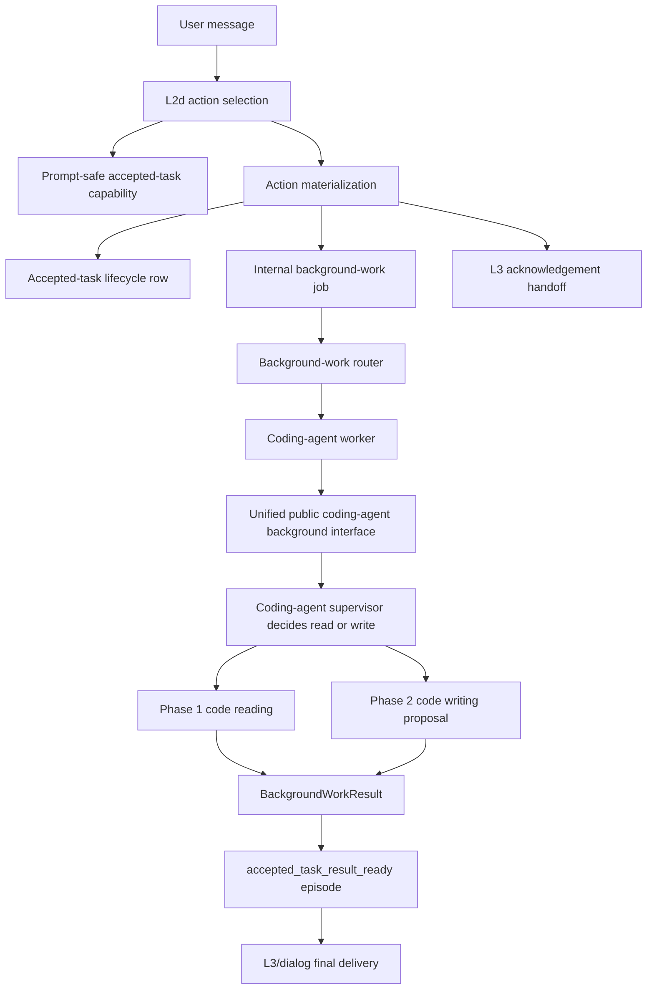

# coding agent phase3 background worker integration plan

## Summary

- Goal: integrate the completed coding-agent capability into Kazusa's accepted
  delayed-task path so code work can be accepted during the live turn, executed
  in background work, and delivered later through result-ready cognition.
- Plan class: large
- Status: completed
- Execution mode: direct parent execution only. Do not use subagents for this
  plan.
- Mandatory skills: `development-plan`, `local-llm-architecture`,
  `no-prepost-user-input`, `py-style`, and `test-style-and-execution`.
- Acceptance focus: the coding-agent handoff must be proven by E2E contract
  tests for task intake, pre-completion acknowledgement, and final delivery.

## Current Handoff Context

Kazusa now separates the user-facing accepted-task lifecycle from the internal
background-work executor:

```text
L2d delayed-work decision
-> action materialization validates and persists accepted-task state
-> internal background-work queue executes the job
-> accepted_task_result_ready cognition episode delivers the completed result
```

The user-facing and prompt-facing language must describe accepted delayed work.
Worker names, queue internals, job ids, leases, adapter ids, filesystem paths,
and tool arguments must not be projected to L2d or L3.

The executable code path may still use `background_work_request` internally as
the queue action kind during this phase. When it is shown to L3 or to the user,
it must be surfaced as accepted-task work, not background-work machinery.

## Scope

Phase 3 includes:

- accepted-task capability projection for bounded delayed code work;
- coding-agent background-worker registration and routing;
- deterministic action materialization into accepted-task state and background
  work rows;
- pre-completion acknowledgement handoff to L3 after durable acceptance;
- final delivery through `accepted_task_result_ready`;
- tests that capture the E2E handoff surfaces before broad live testing.

Phase 3 excludes:

- code execution, validation, repair, package installation, shell-command
  execution, and patch application;
- exposing coding-agent worker names or worker-local fields to L2d;
- deterministic keyword routing over user text;
- new adapter delivery paths;
- changing completed Phase 1 or Phase 2 standalone public contracts unless a
  failing integration test proves the public boundary is unusable.

## Architecture Rules

- LLM stages own semantic judgment about whether delayed work is appropriate.
- Deterministic code owns validation, persistence, lifecycle transitions,
  routing limits, permissions, and delivery mechanics.
- L2d receives prompt-safe capability affordances only.
- Action-spec materialization owns conversion from an accepted delayed-task
  decision into accepted-task lifecycle state and internal background-work
  queue fields.
- The background-work router may select an enabled worker from registry
  descriptions. It must not receive worker-local tool arguments.
- The coding-agent worker adapts only public standalone coding-agent
  interfaces. It must not import PM, programmer, planner, repository-map,
  synthesizer, or patch internals.
- The coding-agent public background interface owns the read-versus-write
  operation decision. L2d and the background-work router must not choose
  coding-agent subcapabilities.
- Workers return only `BackgroundWorkResult`. They must not call adapters,
  dispatcher delivery, cognition graph entrypoints, or service graph
  entrypoints directly.
- New E2E tests are allowed only when they inspect the intended workflow. They
  must not assert a predetermined semantic answer for code content.

## Target Architecture



## Contracts

### Capability Projection

The capability list shown to L2d must make bounded delayed work available in
accepted-task language. It must say the character can accept delayed text/code
work and report later. It must not expose:

```text
worker names, queue names, job ids, leases, adapter ids, local paths,
repository checkout paths, shell commands, pytest commands, raw tool args,
final answer text
```

### Accepted Task Materialization

The accepted delayed-work action must create or reuse an accepted-task row
before a live acknowledgement is allowed. The task summary used for the row and
internal job must preserve the user's code request. The queue result must carry:

```python
{
    "status": "pending | failed",
    "accepted_task_state": "...",
    "accepted_task_summary": "...",
    "acknowledgement_constraint": "...",
    "wait_guidance": "...",
}
```

### Pre-Completion Acknowledgement

L3 may acknowledge future work only after durable accepted-task state exists.
The L3 handoff must use accepted-task language and must not show internal
`background_work_request`, job references, leases, or queue ids.

### Worker Dispatch

The trusted task text for the coding-agent worker is the durable
`task_brief`. `source_context` and router reasons may add context but must not
replace `task_brief`. The worker calls the coding-agent background interface;
the coding-agent supervisor then chooses `code_reading`, `code_writing`, or
`unsupported` through the coding-agent PM route. Phase 3 permits generated
code proposals as artifact text and metadata, but still forbids patch
application, command execution, package installation, deployment, and adapter
delivery from the worker.

### Final Delivery

Accepted-task-backed rows must produce `accepted_task_result_ready` cognition
episodes. Legacy rows without accepted-task ids may still use
`background_work_result_ready`, but new coding-agent work in this phase must
use the accepted-task result-ready path.

Final delivery receives bounded artifact text, summaries, and sanitized
metadata only. It must not receive local workspace roots, cache keys, raw
command output, job leases, adapter ids, or `.env` content.

## Implementation Stages

### Stage 1 - Plan And Handoff Tests

- Update this plan to the accepted-task-first architecture.
- Add focused E2E contract tests for:
  - coding-agent-capable delayed work appearing in prompt-safe capability
    projection;
  - accepted-task acknowledgement handoff after durable queue acceptance;
  - final delivery through `accepted_task_result_ready`.
- Run the new tests and record whether they expose existing gaps.

### Stage 2 - Coding-Agent Worker Boundary

- Register a `coding_agent` background-work worker adapter if it is not already
  registered.
- Ensure the background-work router can choose enabled workers from registry
  descriptions without hardcoded worker-only logic.
- Ensure `task_brief` is passed to worker execution separately from
  `source_context`.
- Ensure the worker calls the unified coding-agent background interface rather
  than a direct read-only subcapability.
- Add configuration needed by the worker without requiring startup failure
  when the worker is unavailable.

### Stage 3 - Action And Surface Handoff

- Align action-spec capability projection with accepted-task language.
- Preserve the internal queue boundary.
- Ensure L3 acknowledgement sees accepted-task state and constraints, not
  queue internals.
- Ensure result-ready projection uses `accepted_task_result_ready` for new
  accepted-task-backed coding work.

### Stage 4 - Verification

- Run the focused E2E contract tests from Stage 1.
- Run affected background-work, accepted-task, action-spec, L2d, L3 handoff,
  and coding-agent adapter tests.
- Run one live/local LLM diagnostic only after deterministic handoff tests pass
  and only if needed to validate semantic routing.

### Stage 5 - Review Stop

- Stop before independent code review unless the user explicitly asks to
  continue into review.
- Record changed files, commands run, failures, fixes, and residual risks in
  `Execution Evidence`.

## Verification Commands

Focused commands:

```powershell
venv\Scripts\python -m pytest tests\test_coding_agent_phase3_handoff_e2e.py -q
venv\Scripts\python -m pytest tests\test_l2d_l3_surface_handoff.py tests\test_cognitive_episode_contract.py -q
```

Affected-area commands:

```powershell
venv\Scripts\python -m pytest tests\test_background_work_router.py tests\test_background_work_providers.py tests\test_background_work_delivery.py -q
venv\Scripts\python -m pytest tests\test_action_spec_evaluator.py tests\test_l2d_action_selection_cases.py -q
venv\Scripts\python -m pytest tests\test_coding_agent_interface.py tests\test_coding_agent_reading.py -q
```

Static checks:

```powershell
rg -n "source_context.*or.*task_brief|source_summary = job.get\\(\"source_context\"" src/kazusa_ai_chatbot/background_work
rg -n "workspace_root|local_root|cache_key" src/kazusa_ai_chatbot/background_work tests/test_coding_agent_phase3_handoff_e2e.py
```

## E2E Test Requirements

The Phase 3 E2E handoff tests must prove:

1. Upstream capability projection includes an accepted delayed-work affordance
   suitable for bounded code work while hiding worker and queue internals.
2. A selected delayed code task persists accepted-task state and gives L3 a
   correct pre-completion acknowledgement contract.
3. A completed accepted-task-backed coding-agent job produces an
   `accepted_task_result_ready` episode with the expected task summary and
   bounded result text.
4. The full user-input-to-final-delivery path is covered for a code-writing
   proposal request and a code-reading repository-summary request.

These tests validate workflow structure. They do not validate whether the
coding-agent answer is semantically correct; semantic answer quality remains a
live/local LLM diagnostic after the handoff is structurally correct.

## Risks

| Risk | Mitigation | Verification |
|---|---|---|
| L2d sees queue internals instead of accepted-task capability | Keep projection prompt-safe and accepted-task-worded | Capability projection E2E test |
| L3 promises work before persistence succeeds | Require queued accepted-task result before acknowledgement | Acknowledgement E2E test |
| Worker loses the original user task | Pass `task_brief` directly to worker execution | Worker dispatch tests |
| New coding results use legacy result-ready source | Require accepted-task-backed jobs to build `accepted_task_result_ready` | Final delivery E2E test |
| L2d or background worker bypasses the coding-agent supervisor | Route only to `coding_agent`; require the unified background interface before read/write selection | Full-path E2E tests |
| Coding work is routed by deterministic keyword matching | Use coding-agent PM route plus structural validation only | Router tests and no-prepost-user-input review |

## Execution Evidence

- 2026-07-03: Plan reset to accepted-task-first Phase 3 scope and no-subagent
  execution per user approval. Stage 1 tests are being added next.
- 2026-07-03: Added `tests/test_coding_agent_phase3_handoff_e2e.py`.
  Initial run failed only on accepted-task projection text missing code-work
  wording; acknowledgement and final delivery tests passed.
- 2026-07-03: Updated prompt-safe accepted-task affordance wording in
  `action_spec.registry` and `cognition_chain_core.action_selection`.
  `venv\Scripts\python -m pytest tests\test_coding_agent_phase3_handoff_e2e.py -q`
  passed, 3 tests.
- 2026-07-03: Added true full-path coding-agent workflow E2E
  `test_code_question_runs_from_user_input_to_final_code_delivery`, covering
  user input through `persona_supervisor2`, accepted-task scheduling,
  background worker routing, coding-agent worker execution,
  `accepted_task_result_ready` delivery, final dialog, and delivered state.
  `venv\Scripts\python -m pytest tests\test_coding_agent_phase3_handoff_e2e.py -q`
  passed, 4 tests.
- 2026-07-03: Added Stage 2 focused tests for dynamic router worker
  validation, `task_brief` propagation, and coding-agent worker mapping.
  Baseline failed on hardcoded `text_artifact` router validation, missing
  provider `task_brief`, and missing coding-agent worker module.
- 2026-07-03: Implemented `background_work.subagent.coding_agent`,
  enabled-worker router normalization, worker decision `task_brief`, explicit
  worker-loop task/source separation, optional `CODING_AGENT_WORKSPACE_ROOT`,
  and documentation updates.
- 2026-07-03: Verification passed:
  `venv\Scripts\python -m pytest tests\test_background_work_router.py tests\test_background_work_providers.py tests\test_background_work_coding_agent.py -q`
  passed, 10 tests.
- 2026-07-03: Handoff regression passed:
  `venv\Scripts\python -m pytest tests\test_coding_agent_phase3_handoff_e2e.py tests\test_l2d_l3_surface_handoff.py tests\test_cognitive_episode_contract.py -q`
  passed, 40 tests.
- 2026-07-03: Affected-area verification passed:
  `venv\Scripts\python -m pytest tests\test_background_work_coding_agent.py tests\test_background_work_router.py tests\test_background_work_providers.py tests\test_background_work_text_artifact.py tests\test_background_work_jobs.py tests\test_background_work_delivery.py -q`
  passed, 35 tests.
- 2026-07-03: Action/coding regression passed:
  `venv\Scripts\python -m pytest tests\test_action_spec_evaluator.py tests\test_l2d_action_selection_cases.py tests\test_coding_agent_interface.py tests\test_coding_agent_reading.py -q`
  passed, 70 tests.
- 2026-07-03: Compile check passed for changed background-work, registry, and
  action-selection Python files. Static greps found no L2d/action-spec runtime
  coding-worker-name leak and no compact `source_context or task_brief`
  fallback expression in background-work worker dispatch.
- 2026-07-03: Closed the Phase 3 handoff gap where the background worker
  called the read-only coding-agent interface directly. Added
  `handle_background_coding_task(...)` as the coding-agent-owned background
  interface with internal PM-route selection of `code_reading`, `code_writing`,
  or `unsupported`.
- 2026-07-03: Added full-path E2E cases for the Phase 2 gate-01 writing
  request and Chinese KazusaAIChatbot project-summary request. Trace artifacts
  are written to `test_artifacts/coding_agent_phase3_handoff_e2e/`.
  `venv\Scripts\python -m pytest tests\test_background_work_coding_agent.py tests\test_coding_agent_interface.py tests\test_coding_agent_phase3_handoff_e2e.py -q`
  passed, 20 tests.
- 2026-07-03: Affected handoff/background verification passed:
  `venv\Scripts\python -m pytest tests\test_background_work_router.py tests\test_background_work_providers.py tests\test_background_work_text_artifact.py tests\test_background_work_jobs.py tests\test_background_work_delivery.py tests\test_l2d_l3_surface_handoff.py tests\test_cognitive_episode_contract.py tests\test_action_spec_evaluator.py tests\test_l2d_action_selection_cases.py -q`
  passed, 103 tests.
- 2026-07-04: Case-2 live E2E RCA completed for the KazusaAIChatbot project
  summary request. Root cause was the reading synthesizer discarding valid
  prose when a local model returned the answer in `analysis` instead of
  `answer_text`, plus cleanup leaving empty parentheses. Fixed the reading
  supervisor partial-synthesis path and synthesizer parsing/cleanup. RCA
  artifact:
  `test_artifacts/llm_reviews/coding_agent_phase3_case2_rca_20260703T153000Z.md`.
- 2026-07-04: Real LLM rerun for the project-summary full-path E2E passed:
  `venv\Scripts\python -m pytest tests\test_coding_agent_phase3_live_e2e.py::test_live_project_summary_runs_from_user_input_to_delivery -q -s -m live_llm`.
  Final trace:
  `test_artifacts/llm_traces/coding_agent_phase3_live_e2e/live_kazusa_project_summary/20260703T152042365688Z-73fc1b57`.
- 2026-07-04: Final consistency cleanup removed plan-era phase labels from
  production Python and the current coding-agent ICD docs, corrected the
  code-writing ICD to state existing-source modification is rejected in the
  current writing interface, and renamed stale coding-agent test names.
- 2026-07-04: Static checks passed:
  `rg -n "Phase [0-9]|phase [0-9]" src\kazusa_ai_chatbot\coding_agent src\kazusa_ai_chatbot\background_work src\kazusa_ai_chatbot\action_spec src\kazusa_ai_chatbot\cognition_chain_core --glob '*.py'`
  returned no matches;
  `rg -n "coding_agent_llm|CODING_AGENT_LLM" src tests docs README.md README_CN.md`
  returned no matches;
  `rg -n 'source_context.*or.*task_brief' src\kazusa_ai_chatbot\background_work`
  returned no matches;
  `rg -n 'source_summary = job\.get\("source_context"' src\kazusa_ai_chatbot\background_work`
  returned no matches; `git diff --check` had no whitespace errors.
- 2026-07-04: Compile and regression verification passed:
  `git ls-files --modified --others --exclude-standard -- '*.py'` piped into
  `venv\Scripts\python -m py_compile`; focused suite
  `venv\Scripts\python -m pytest tests\test_coding_agent_phase3_handoff_e2e.py tests\test_background_work_coding_agent.py tests\test_background_work_router.py tests\test_background_work_providers.py tests\test_coding_agent_interface.py tests\test_coding_agent_reading_acceptance.py -q`
  passed, 37 tests; affected-area suite
  `venv\Scripts\python -m pytest tests\test_background_work_text_artifact.py tests\test_background_work_jobs.py tests\test_background_work_delivery.py tests\test_l2d_l3_surface_handoff.py tests\test_cognitive_episode_contract.py tests\test_action_spec_evaluator.py tests\test_l2d_action_selection_cases.py tests\test_coding_agent_reading.py -q`
  passed, 123 tests; final reading-focused rerun
  `venv\Scripts\python -m pytest tests\test_coding_agent_reading.py tests\test_coding_agent_interface.py tests\test_coding_agent_reading_acceptance.py -q`
  passed, 49 tests.
- 2026-07-04: Independent code-review gate was executed as parent-owned
  self-review because the user explicitly prohibited subagents. Reviewed the
  plan scope, architecture/docs alignment, prompt and interface boundaries,
  worker handoff, source/task separation, coding-agent public interfaces,
  static greps, and regression evidence. No blocking findings remained after
  the final documentation and test-name cleanup.
- 2026-07-04: Final post-cleanup verification passed after the last
  LLM-facing vocabulary cleanup:
  `venv\Scripts\python -m py_compile` over all modified and untracked Python
  files passed, and
  `venv\Scripts\python -m pytest tests\test_coding_agent_phase3_handoff_e2e.py tests\test_background_work_coding_agent.py tests\test_background_work_router.py tests\test_background_work_providers.py tests\test_coding_agent_interface.py tests\test_coding_agent_reading_acceptance.py tests\test_background_work_text_artifact.py tests\test_background_work_jobs.py tests\test_background_work_delivery.py tests\test_l2d_l3_surface_handoff.py tests\test_cognitive_episode_contract.py tests\test_action_spec_evaluator.py tests\test_l2d_action_selection_cases.py tests\test_coding_agent_reading.py -q`
  passed, 160 tests.
