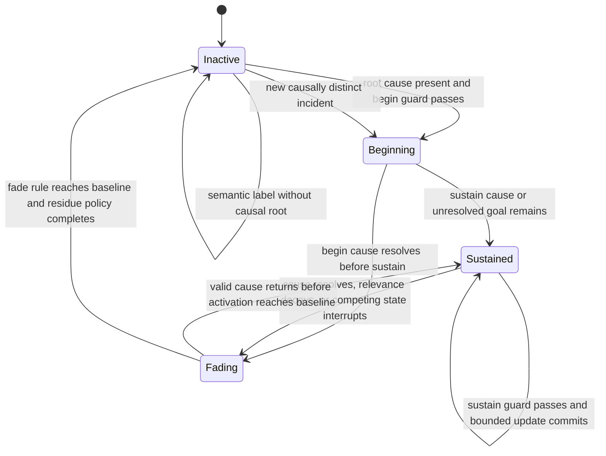

# cognition core v2 stage 1 validation plan

## Summary

- Goal: build a self-contained `kazusa_ai_chatbot.cognition_core_v2` package
  beside `cognition_chain_core`, preserve the V1 chain input/output contract,
  and produce inspectable evidence about latency, emotional lifecycle behavior,
  reliability, and extensibility.
- Plan class: large.
- Status: completed.
- Mandatory skills: `development-plan`, `py-style`, `cjk-safety`,
  `local-llm-architecture`, `no-prepost-user-input`,
  `test-style-and-execution`, and `debug-llm`.
- Overall cutover strategy: compatible validation-only coexistence. V1 remains
  the production core; V2 is callable only by focused tests and the validation
  harness.
- Highest-risk areas: hidden V1 coupling, process-local state leakage,
  causally invalid emotion transitions, excessive LLM critical-path latency,
  accidental serialization of independent branches, and misleading quality
  conclusions based only on schema/test success.
- Acceptance criteria: the V2 package satisfies the exact V1 chain I/O shape;
  all 21 emotion families have begin/sustain/fade and negative-control
  evidence; paired V1/V2 measurements and failure counts are recorded without
  a go/no-go threshold; an extension exercise is completed; and the plan's
  `Execution Evidence` contains an agent-authored semantic conclusion answering
  the three validation questions.

## Context

The reference architecture in
`development_plans/reference/designs/kazusa_parallel_cognition_architecture.md`
replaces free-text emotion authority with deterministic motivational state,
guarded transitions, derived concurrent emotion activation, state-triggered
goal cognition, dependency-aware parallel LLM execution, and workspace
collapse.

The live V1 core currently exposes:

```text
CognitionChainInputV1
  -> cognition_chain_core.run_cognition_chain(...)
  -> CognitionChainOutputV1
```

Stage 1 validates the proposed internals without changing that boundary or any
live caller. The new package lives at:

```text
src/kazusa_ai_chatbot/cognition_core_v2/
```

It imports the V1 public contracts and shared LLM interface, but it does not
import or invoke `cognition_chain_core.chain`, `cognition_chain_core.stages`,
or V1 graph internals. V2 state is process-local, versioned, resettable, and
owned entirely by V2. No MongoDB collection, live service route, connector,
action handler, surface path, consolidation path, or cache behavior changes.

Validation must answer with observed evidence:

1. What latency, LLM-call, concurrency, failure, and resource differences
   exist between V1 and V2 for the same V1 inputs and model configuration?
2. Does V2 produce causally grounded emotion lifecycles—begin, sustain, and
   fade—for every emotion family named by the architecture?
3. Can the architecture accept a new emotion definition and a new goal-branch
   definition without changing reducers, dependency scheduling, workspace
   integration, or the V1 facade?

The plan reports measurements and observed behavior. It defines no performance
or quality threshold and makes no Stage 2 approval decision.

## Mandatory Skills

- `development-plan`: govern execution order, progress evidence, review, and
  lifecycle updates.
- `py-style`: load before creating or reviewing Python source or tests; apply
  PEP 8 and all positive/negative project constraints.
- `cjk-safety`: load before writing Python prompts, fixtures, logs, or tests
  containing CJK text; verify UTF-8 and syntax immediately after edits.
- `local-llm-architecture`: govern prompt boundaries, local-model context,
  dependency-aware execution, raw-numeric projection, and LLM budgets.
- `no-prepost-user-input`: keep ambiguous user-input meaning in LLM semantic
  appraisal; deterministic code may validate structure and apply guarded state
  transitions but must not keyword-classify user acceptance, commitments, or
  intentions.
- `test-style-and-execution`: separate deterministic, patched-LLM, and real-LLM
  tests; run live cases one at a time and inspect each result.
- `debug-llm`: require raw evidence plus an agent-authored human-readable review
  for every real-LLM validation run.

## Mandatory Rules

- Keep `src/kazusa_ai_chatbot/cognition_chain_core/**` unchanged.
- Keep all production callers on V1. Do not add a service flag, alternate live
  route, shadow invocation, fallback, or production registration for V2.
- Export one V2 facade with the same callable contract as the V1 chain:
  `run_cognition_chain(CognitionChainInputV1, CognitionChainServices) ->
  CognitionChainOutputV1`.
- Treat compatibility as validation-only. Do not use V1 internals to implement
  V2, and do not duplicate V1 stages as the V2 architecture.
- Keep V2 authoritative state process-local. Do not read or write MongoDB,
  Cache2, character state, user profiles, reflection runs, residue storage, or
  action-attempt collections.
- Reset V2 local state before every independent scenario and benchmark sample.
  Multi-turn lifecycle steps within one scenario must share only that
  scenario's state key.
- Protect each local state key with deterministic version checks and one
  package-owned async mutation lock. Parallel branches receive immutable state
  projections and cannot mutate state directly.
- Run direct decay, deadlines, known outcomes, reducers, emotion formulas,
  guard checks, and branch activation without waiting for unrelated LLM work.
- Use LLM calls only for source-dependent semantic appraisal, goal cognition,
  workspace semantic integration, and V1-compatible action selection.
- Keep raw numeric state out of LLM payloads. Project calibrated semantic
  descriptions with causal summaries into branch prompts.
- Interpret ambiguous user language with LLM contracts. Do not use keyword,
  regex, or deterministic string classification to infer user intent,
  acceptance, relationship meaning, agency, moral responsibility, or emotion.
- Keep deterministic validation structural and causal: schema, bounds, source
  refs, lifecycle guards, state versions, allowed branch kinds, and admitted
  bid membership.
- Keep prompt constants static and adjacent to their stage-named LLM binding
  and handler. Use triple-single-quoted prompt strings and `.format(...)` with
  named placeholders only for process-stable values. Put per-run state and
  evidence in `HumanMessage`.
- Use the supplied `CognitionChainServices`; add no new service argument or
  route. Map V2 stages onto existing `cognition_config`,
  `boundary_core_config`, and `action_selection_config` according to the call
  budget in this plan.
- Keep the V1 output schema valid through
  `validate_cognition_chain_output(...)`. Exact generated prose and exact V1
  decisions are comparison data, not deterministic equality requirements.
- Write raw JSON/JSONL/CSV evidence under
  `test_artifacts/cognition_core_v2/`. Do not add those artifacts to git.
- Scripts and tests emit raw or structured evidence only. The parent agent
  authors each readable review and the final semantic conclusion after
  inspecting real outputs.
- Run real LLM cases one case at a time. Inspect and author the review artifact
  before starting the next real LLM case.
- Record measured values, sample counts, model configuration, ordering,
  failures, and limitations accurately. Do not convert observed measurements
  into an automatic stable/unstable or go/no-go decision.
- Use `venv\Scripts\python` for all Python and pytest commands.
- Preserve the user's existing modified reference architecture file and every
  unrelated worktree change.
- After any automatic context compaction, the parent or active execution agent
  must reread this entire plan before continuing implementation,
  verification, handoff, or reporting.
- After signing off any major progress-checklist stage, the parent or active
  execution agent must reread this entire plan before starting the next stage.
- Before completion or lifecycle closeout, run the `Independent Code Review`
  gate and record the result in `Execution Evidence`.
- Execution uses parent-led native subagents as specified under `Execution
  Model`. If native subagents are unavailable, stop unless the user explicitly
  approves fallback execution.

## Must Do

- Create the self-contained V2 package beside V1.
- Reuse only V1 public contracts and shared project infrastructure explicitly
  named in `Change Surface`.
- Implement process-local state ownership, deterministic reducers, causal
  emotion derivation, branch activation, dependency scheduling, parallel LLM
  execution, workspace collapse, V1 output projection, and diagnostic tracing.
- Cover all 21 architecture emotion families with deterministic lifecycle
  cases for begin, sustain, fade, and missing-root negative control.
- Exercise mixed compatible emotion states and reject causally impossible
  activations.
- Add patched-LLM tests for branch dependencies, concurrency, state isolation,
  workspace admission, and V1 output projection.
- Add real-LLM cases that inspect whether semantic appraisal, goal branches,
  collapse, and V1-visible residue/action output remain grounded in the
  authoritative causal state.
- Add paired V1/V2 benchmark cases with the same V1 input, services, model
  route, model configuration, and process environment.
- Report total latency, deterministic time, critical-path LLM time, summed LLM
  time, overlap, call counts, prompt/output size, parse/branch failures, and
  local-state size for every benchmark sample.
- Add an extension exercise for one test-only emotion definition and one
  test-only goal-branch definition without editing shared reducers, dependency
  scheduling, workspace integration, or the V1 facade.
- Record the Stage 1 semantic conclusion in this plan's `Execution Evidence`.
  Link untracked artifact paths and summarize limitations without embedding raw
  trace bodies in git-managed files.

## Deferred

- Production service, connector, resolver, self-cognition, reflection,
  consolidation, action-spec, L3, dialog, dispatcher, scheduler, and adapter
  integration.
- Public V2 input/output contracts.
- MongoDB schemas, durable state, restart recovery, migrations, dual writes,
  cache invalidation, or operational endpoints.
- Replacing or editing the V1 core.
- Persisting benchmark or trace evidence in git.
- User-facing rollout, feature flags, shadow production execution, or fallback
  routing.
- Performance acceptance thresholds and the decision to begin Stage 2.
- Coefficient tuning intended to make a preferred result pass. Stage 1 may fix
  correctness bugs but must preserve raw pre-fix and post-fix evidence.

## Cutover Policy

Overall strategy: compatible validation-only coexistence.

| Area | Policy | Instruction |
|---|---|---|
| Production cognition | no cutover | Keep all live callers on `cognition_chain_core`. |
| V2 source package | compatible | Add `cognition_core_v2` beside V1 for explicit test/harness imports only. |
| Chain I/O | compatible | Consume `CognitionChainInputV1`, `CognitionChainServices`; return validated `CognitionChainOutputV1`. |
| V2 internals | bigbang | Implement the V2 architecture directly; do not wrap or invoke V1 stages. |
| State | validation-local | Use resettable process-local state only; create no persistent schema. |
| Evidence | validation-local | Write raw artifacts under `test_artifacts/cognition_core_v2/`. |
| Stage 2 | gated | Keep the integration plan at `draft` until the user reviews Stage 1 evidence and explicitly approves continuation. |

### Cutover Policy Enforcement

- Follow the listed policy for each area.
- Preserve only the explicitly authorized V1 contract reuse.
- Keep V2 unregistered from production runtime paths.
- Any expansion beyond this table requires user approval and a plan update.

## Target State

At completion:

```text
src/kazusa_ai_chatbot/
  cognition_chain_core/        # unchanged production V1
  cognition_core_v2/           # self-contained validation implementation

tests/
  test_cognition_core_v2_contracts.py
  test_cognition_core_v2_state.py
  test_cognition_core_v2_emotion_lifecycle.py
  test_cognition_core_v2_dependencies.py
  test_cognition_core_v2_live_llm.py
  test_cognition_core_v2_benchmark.py

tests/fixtures/
  cognition_core_v2_emotion_lifecycle_cases.json
  cognition_core_v2_benchmark_cases.json

test_artifacts/cognition_core_v2/
  raw/
  metrics/
  reviews/
  summary/
```

The V2 package can be imported explicitly:

```python
from kazusa_ai_chatbot.cognition_core_v2 import run_cognition_chain
```

The production connector continues importing V1. No normal `/chat`,
self-cognition, reflection, or background path imports V2.

### Validation Module Flow And Dependencies

```mermaid
flowchart LR
    subgraph U[Upstream — V1-compatible validation caller]
        UI[CognitionChainInputV1]
        US[CognitionChainServices]
    end

    subgraph V2[Cognition Core V2 — all validation internals]
        F[V1-compatible facade and validation]
        SK[Local state-key resolver]
        SS[Versioned process-local state store]
        SA[Bounded semantic appraisal]
        TP[Typed transition proposals]
        CR[Causal guard and deterministic reducer]
        ED[Emotion derivation and lifecycle trends]
        BA[Goal and branch activation]
        DG[Dependency graph scheduler]
        PB[Bounded parallel goal cognition]
        WR[Workspace reconciliation and collapse]
        AC[Single action or speech-intention selection]
        OP[V1 output projection and validation]
        DS[Diagnostic sidecar]

        F --> SK
        SK --> SS
        F --> SA
        F --> TP
        SA --> TP
        SS --> CR
        TP --> CR
        CR --> SS
        CR --> ED
        ED --> BA
        BA --> DG
        DG --> PB
        PB --> WR
        ED --> WR
        WR --> AC
        AC --> OP
        OP --> DS
        SS --> DS
        SA --> DS
        TP --> DS
        CR --> DS
        DG --> DS
        PB --> DS
        WR --> DS
    end

    subgraph D[Downstream — V1-compatible validation result]
        DO[CognitionChainOutputV1]
        DA[test_artifacts raw metrics and reviews]
    end

    UI --> F
    US --> F
    OP --> DO
    DS --> DA
```



The facade is the only public package-root function. It validates the same V1
input and services used by the production chain and returns only a validated
V1 output. The state-key resolver selects an isolated local state cell without
changing that public I/O. Semantic appraisal interprets ambiguous source
meaning; it emits typed propositions and never assigns emotion state directly.
The causal reducer checks source references, expected state version, lifecycle
guards, and bounded deltas before applying any mutation.

Emotion derivation reads the committed causal state and prior activation to
calculate concurrent lifecycle trends. Goal activation forks cognition only
for motives supported by that committed state. The dependency graph makes
inter-branch requirements explicit, so ready branches can execute concurrently
while dependent branches wait. Workspace reconciliation considers admitted
and suppressed bids and collapses them into one intention. Output projection
maps that result to the unchanged V1 schema. The diagnostic sidecar observes
every internal boundary and writes validation evidence without entering the
public result.

### Emotion Lifecycle State Machine



Each emotion owns its causal inputs and named begin, sustain, and fade rules,
but uses this common lifecycle protocol. Compatible emotions may occupy
different lifecycle states concurrently. Conflict is resolved at goal/bid and
workspace boundaries; the state machine does not erase a valid emotion solely
because another emotion is active. Invalid transitions fail closed, preserve
the last committed state, and appear in diagnostics.

## Design Decisions

| Topic | Decision | Rationale |
|---|---|---|
| Location | Create `src/kazusa_ai_chatbot/cognition_core_v2`. | The user requires V2 beside V1 rather than under `experiments/`. |
| Public compatibility | Reuse the V1 chain input, services, and output contracts exactly. | Stage 1 isolates internal architecture effects. |
| V1 surface planning | Keep `run_text_surface_planning` in V1 and outside Stage 1. | The validation target is the cognition chain from `CognitionChainInputV1` to `CognitionChainOutputV1`; L3 is downstream. |
| V2 state | Use a package-owned, versioned, process-local store. | Enables multi-turn lifecycle tests without DB integration. |
| State isolation | Build an internal scope key from stable V1 character/user/source scope and use unique fixture identities; expose reset/snapshot diagnostics outside the facade. | Keeps facade I/O unchanged while supporting repeatable tests. |
| Mutation | Apply parallel proposals through one reducer per state key. | Prevents race-dependent state. |
| Emotion model | Derive concurrent activation from causal goal/state variables. | Emotion text remains a projection rather than authority. |
| Semantic judgment | Use bounded LLM appraisal only when source meaning is ambiguous. | Preserves LLM-first input interpretation without blocking deterministic work. |
| Parallel execution | Schedule dependency-ready semantic and goal branches concurrently with a fixed cap. | Validates actual latency and dependency behavior. |
| V1 output | Project authoritative V2 state and workspace result into V1 residue/actions/resolver fields. | Allows paired comparison with unchanged I/O. |
| Measurements | Report raw samples and descriptive statistics without an automatic threshold. | The user owns feasibility and continuation decisions. |
| Evidence | Store raw evidence outside git and record only semantic conclusions in this plan. | Matches the requested evidence lifecycle. |
| Extensibility | Use explicit definition registries passed to builders; avoid runtime plugin discovery. | Proves expansion seams without speculative plugin infrastructure. |

## Contracts And Data Shapes

### Public Facade

```python
async def run_cognition_chain(
    input_payload: CognitionChainInputV1,
    services: CognitionChainServices,
) -> CognitionChainOutputV1:
    ...
```

The facade must:

1. call V1 input validation;
2. resolve the V2 local state scope;
3. run V2 internal cognition;
4. project a V1 output;
5. call V1 output validation;
6. publish diagnostic evidence to the V2 sidecar;
7. return only `CognitionChainOutputV1`.

### V2 Local State Store

```python
class LocalStateKey:
    character_global_id: str
    current_user_global_id: str
    trigger_source: str
    target_scope_fingerprint: str

class LocalMotivationalState:
    state_version: int
    drives: dict[str, DriveState]
    goals: dict[str, GoalState]
    bonds: dict[str, RelationshipBondState]
    threats: dict[str, ThreatState]
    standards: dict[str, SelfStandardState]
    incidents: dict[str, MoralIncidentState]
    epistemic_state: dict[str, EpistemicState]
    meaning_state: MeaningState
    emotion_activations: dict[str, EmotionActivation]
```

The target-scope fingerprint is a one-way deterministic fingerprint of the V1
semantic scope summary. Fixtures use unique character/user/scope combinations.
The store exposes test/diagnostic reset and snapshot functions from an explicit
`diagnostics` module; those functions are not exported from package root.

### Transition Proposal

```python
class TransitionProposal:
    entity_kind: str
    entity_ref: str
    expected_state_version: int
    transition_kind: str
    causal_source_refs: list[str]
    numeric_delta: dict[str, float]
    semantic_basis: str
```

Only deterministic reducers apply proposals. Branch handlers return bids and
semantic propositions, not mutations.

### Emotion Definition

```python
class EmotionDefinition:
    emotion_id: str
    causal_inputs: tuple[str, ...]
    begin_guard: str
    sustain_rule: str
    fade_rule: str
    action_tendencies: tuple[str, ...]
```

Runtime evaluation uses named functions/tables owned by the package rather
than evaluating string expressions. The shape above is conceptual contract
documentation.

### Emotion Lifecycle Evidence

Each emotion case records:

```json
{
  "case_id": "fear_lifecycle",
  "emotion_id": "fear",
  "turns": [
    {"phase": "baseline", "state": {}, "activation": 0.0},
    {"phase": "begin", "state": {}, "activation": 0.0},
    {"phase": "sustain", "state": {}, "activation": 0.0},
    {"phase": "fade", "state": {}, "activation": 0.0},
    {"phase": "negative_control", "state": {}, "activation": 0.0}
  ],
  "guards": [],
  "branch_ids": [],
  "v1_output": {},
  "validation": {}
}
```

Actual activation values are evidence. The fixture must not predeclare one
universal numeric pass threshold for all emotions. Deterministic assertions
verify directional lifecycle invariants and causal guard behavior.

### V1 Output Projection

| V1 output field | V2 source |
|---|---|
| `emotional_appraisal` | dominant and mixed affect projection |
| `interaction_subtext` | current event meaning and interpersonal pressure projection |
| `internal_monologue` | workspace summary of active and suppressed motives |
| `logical_stance` | collapsed public/private stance |
| `character_intent` | collapsed action tendency |
| `judgment_note` | causal decision summary |
| `social_distance` | relationship-bond projection |
| `emotional_intensity` | calibrated activation descriptor |
| `vibe_check` | aggregate environmental/affect projection |
| `relational_dynamic` | bond condition and relationship-goal projection |
| semantic actions/resolver requests | V2 route-only action selection |
| `chain_trace` | V2 stage ids, selected bid summary, warnings |

### Diagnostic Sidecar

The sidecar records raw structured evidence keyed by trace/case id:

```text
input hash and case id
model/route/config identity
state before and after
transition proposals and guard outcomes
emotion activations and trends
dependency DAG
branch start/end timestamps
LLM duration, prompt chars, output chars, parse status
critical-path duration and summed LLM duration
workspace admitted bids and collapsed intention
V1 output and validator status
error/failure class
```

The sidecar is never returned through `CognitionChainOutputV1`.

### Required Emotion Matrix

The fixture must use these exact emotion ids and provide baseline, begin,
sustain, fade, and missing-root negative-control phases:

| Tier | Emotion ids |
|---|---|
| Survival | `joy`, `fear`, `anger`, `sadness`, `disgust`, `surprise` |
| Social | `love_attachment`, `compassion_empathy`, `gratitude`, `jealousy`, `envy` |
| Self-conscious | `pride`, `shame`, `guilt`, `embarrassment` |
| Cognitive/existential | `curiosity`, `awe`, `nostalgia`, `loneliness`, `relief`, `ennui_existential_angst` |

## LLM Call And Context Budget

### V1 Baseline

One normal V1 cognition cycle currently schedules six model-facing stages:
L1, L2a, L2b, L2c1, L2c2, and L2d. Existing graph parallelism affects wall
time; the benchmark records actual stage timings rather than assuming six
serial calls.

### V2 Validation Cap

Per V2 invocation:

| Call family | Maximum calls | Existing config |
|---|---:|---|
| semantic appraisal | 4 | `cognition_config` or `boundary_core_config` by domain |
| goal cognition branches | 6 | `cognition_config` |
| workspace semantic integration | 1 | `cognition_config` |
| V1-compatible action selection | 1 | `action_selection_config` |
| Total | 12 | existing `CognitionChainServices` only |

- LLM concurrency cap: 4.
- Deterministic reducers and derivation are outside this cap.
- Default branch prompt character cap: 24,000.
- Default workspace prompt character cap: 32,000.
- Default overall model context ceiling: 50,000 tokens per call, bounded by
  conservative character projection and the existing model configuration.
- Each branch receives only its activating state, declared dependencies, and
  relevant evidence.
- Drop optional evidence from lowest relevance/oldest order before required
  current event or causal state.
- Do not add retry LLM calls for parsed-but-incomplete optional fields.
- Record actual calls, concurrency, prompt/output sizes, and dropped context for
  every sample.

These caps bound the POC; they are not acceptance thresholds or claims about
future production configuration.

## Change Surface

Target ownership boundary:
`src/kazusa_ai_chatbot/cognition_core_v2/**`.

### Create

- `src/kazusa_ai_chatbot/cognition_core_v2/__init__.py`: export only the V1-I/O
  `run_cognition_chain` facade.
- `src/kazusa_ai_chatbot/cognition_core_v2/contracts.py`: V2-internal state,
  transition, branch, workspace, and diagnostic contracts.
- `src/kazusa_ai_chatbot/cognition_core_v2/state_store.py`: process-local
  versioned state and per-key mutation locks.
- `src/kazusa_ai_chatbot/cognition_core_v2/state_reducers.py`: deterministic
  transition application and invariants.
- `src/kazusa_ai_chatbot/cognition_core_v2/emotion_definitions.py`: 21 causal
  emotion definitions and lifecycle rules.
- `src/kazusa_ai_chatbot/cognition_core_v2/emotion_derivation.py`: activation,
  trend, begin/sustain/fade derivation.
- `src/kazusa_ai_chatbot/cognition_core_v2/semantic_appraisal.py`: bounded
  source-dependent appraisal prompt/handler blocks.
- `src/kazusa_ai_chatbot/cognition_core_v2/branch_activation.py`: preliminary
  and final goal/state branch selection.
- `src/kazusa_ai_chatbot/cognition_core_v2/dependency_graph.py`: dependency DAG
  validation and ready-set scheduling.
- `src/kazusa_ai_chatbot/cognition_core_v2/parallel_executor.py`: bounded async
  execution and timing.
- `src/kazusa_ai_chatbot/cognition_core_v2/goal_cognition.py`: goal-branch
  prompt/handler blocks and result validation.
- `src/kazusa_ai_chatbot/cognition_core_v2/workspace.py`: admitted-bid checks,
  semantic collapse, and hard constraints.
- `src/kazusa_ai_chatbot/cognition_core_v2/action_selection.py`: V1-compatible
  semantic action/resolver request projection.
- `src/kazusa_ai_chatbot/cognition_core_v2/output_projection.py`: map internal
  V2 result to `CognitionChainOutputV1`.
- `src/kazusa_ai_chatbot/cognition_core_v2/diagnostics.py`: reset/snapshot/raw
  evidence APIs for tests and harness only.
- `src/kazusa_ai_chatbot/cognition_core_v2/validation_cli.py`: one-case-at-a-
  time validation and benchmark CLI emitting structured evidence only.
- `src/kazusa_ai_chatbot/cognition_core_v2/README.md`: validation boundary,
  contracts, state lifecycle, and forbidden production consumers.
- `tests/test_cognition_core_v2_contracts.py`.
- `tests/test_cognition_core_v2_state.py`.
- `tests/test_cognition_core_v2_emotion_lifecycle.py`.
- `tests/test_cognition_core_v2_dependencies.py`.
- `tests/test_cognition_core_v2_live_llm.py`.
- `tests/test_cognition_core_v2_benchmark.py`.
- `tests/fixtures/cognition_core_v2_emotion_lifecycle_cases.json`.
- `tests/fixtures/cognition_core_v2_benchmark_cases.json`.

### Modify

- This plan: update progress and semantic conclusions in `Execution Evidence`.
- `development_plans/README.md`: update Stage 1 lifecycle status at completion.

### Keep

- `src/kazusa_ai_chatbot/cognition_chain_core/**`: unchanged V1 implementation.
- `src/kazusa_ai_chatbot/llm_interface/**`: reuse public interfaces unchanged.
- `src/kazusa_ai_chatbot/nodes/**`, `service.py`, `cognition_resolver/**`,
  `action_spec/**`, `consolidation/**`, `reflection_cycle/**`,
  `self_cognition/**`, `db/**`, adapters, dispatcher, and scheduler: unchanged.
- Existing V1 tests: unchanged and used as regression gates.

### Delete

- No files.

## Overdesign Guardrail

- Actual problem: the proposed architecture has no empirical evidence for
  lifecycle behavior, reliability, latency, or extensibility under the real
  project model/runtime.
- Minimal change: add one isolated V2 package with the V1 chain facade, local
  state, focused tests, and validation harness while leaving production V1
  untouched.
- Ownership boundaries: LLM stages interpret ambiguous meaning and produce
  semantic bids; deterministic V2 code owns state, guards, derivation,
  scheduling, bounds, and validation; the harness owns evidence; the parent
  agent owns human quality conclusions.
- Rejected complexity: production routing, database persistence, restart
  recovery, dynamic plugin discovery, service flags, dual writes, new public
  V2 schemas, L3/dialog changes, retries, fallback to V1 internals, and
  coefficient auto-tuning.
- Evidence threshold: only the user's review of Stage 1 measurements and
  semantic conclusions can authorize the Stage 2 integration plan.

## Agent Autonomy Boundaries

- The responsible agent may choose local implementation mechanics only when
  they preserve every contract and file boundary in this plan.
- The responsible agent must not add production integrations, alternate
  facades, compatibility layers beyond the authorized V1 contract reuse,
  fallback paths, or extra emotion families.
- Changes outside `cognition_core_v2`, the listed new tests/fixtures, this
  plan, and the registry require user approval and a plan update.
- Search for existing project helpers before adding parsing, timing, prompt
  projection, or LLM-binding helpers. Reuse shared public infrastructure; do
  not import V1 private stage logic.
- Keep helpers local and justified by repeated or complex domain behavior.
- Do not perform unrelated cleanup, dependency upgrades, prompt rewrites, or
  formatting churn.
- If the approved V1 contract cannot support the POC without changing I/O,
  stop and report the blocker rather than widening the interface.
- If the plan and source disagree, preserve this plan's validation isolation
  and report the discrepancy.

## Implementation Order

1. Parent creates the V2 contract and facade tests in
   `tests/test_cognition_core_v2_contracts.py`; run them and record the expected
   missing-package failure.
2. Parent creates deterministic state/lifecycle tests and the 21-emotion
   fixture; run them and record the expected missing-symbol failures.
3. Parent starts one production-code subagent with ownership limited to
   `src/kazusa_ai_chatbot/cognition_core_v2/**` and the approved contracts.
4. Production-code subagent creates package contracts, local state store,
   reducers, definitions, and emotion derivation; parent reruns deterministic
   contract/state/lifecycle tests.
5. Parent creates patched-LLM dependency/workspace tests and records expected
   missing behavior.
6. Production-code subagent implements semantic appraisal, preliminary/final
   branch activation, dependency graph, parallel executor, goal cognition,
   workspace collapse, action selection, output projection, and diagnostics.
7. Parent reruns focused deterministic and patched-LLM tests. Return to the
   corresponding focused test before changing implementation when a contract
   fails.
8. Production-code subagent adds the one-case validation CLI and package README,
   runs syntax checks, reports changed files/commands/risks, and closes.
9. Parent creates real-LLM lifecycle tests and benchmark fixtures/harness tests.
10. Parent runs every real-LLM lifecycle case individually, inspects raw
    evidence, and authors one review artifact before proceeding to the next
    case.
11. Parent runs paired latency benchmark archetypes individually, preserving
    raw samples, ordering, failures, model config, and V1/V2 traces.
12. Parent runs the extension exercise and architecture static checks.
13. Parent runs focused, adjacent V1, and full non-live regression gates.
14. Parent writes the semantic conclusion in `Execution Evidence`, answering
    all three validation questions without making the Stage 2 decision.
15. Parent starts one independent code-review subagent, remediates in-scope
    findings, reruns affected verification, and records approval/residual risk.
16. Parent marks Stage 1 completed and archives it only after evidence and
    review are complete. Stage 2 remains draft pending explicit user approval.

## Execution Model

- Parent agent owns orchestration, test code, fixtures, verification, live-LLM
  execution and review artifacts, benchmark evidence, plan updates, review
  remediation, lifecycle updates, and final sign-off.
- Parent establishes focused failing contract/state/lifecycle tests before
  production implementation.
- Production-code subagent: exactly one native subagent, started after focused
  tests exist; owns only `src/kazusa_ai_chatbot/cognition_core_v2/**`; does not
  edit tests or plans; closes after planned source changes are complete.
- Parent may add integration/live/benchmark tests and inspect evidence while
  the production-code subagent implements the package.
- Independent code-review subagent: exactly one native subagent after planned
  verification; reviews plan, diff, code, prompts, tests, and evidence; reports
  findings only.
- If native subagent capability is unavailable, stop before execution unless
  the user explicitly requests fallback execution.

## Progress Checklist

- [x] Stage 1A - V1-compatible facade and internal contracts established.
  - Covers: implementation steps 1-4.
  - Verify: focused contract and state tests pass.
  - Evidence: expected pre-implementation failures, changed source paths, and
    passing commands recorded in `Execution Evidence`.
  - Handoff: reread this plan, then begin dependency/parallel execution.
  - Sign-off: `Codex/2026-07-13` after verification and evidence.
- [x] Stage 1B - deterministic lifecycle engine covers all 21 emotions.
  - Covers: implementation steps 2-4.
  - Verify: lifecycle tests pass for baseline/begin/sustain/fade/negative
    control, mixed-emotion, and invalid-cause cases.
  - Evidence: emotion matrix and failing/passing commands recorded.
  - Handoff: reread this plan, then begin LLM branch implementation.
  - Sign-off: `Codex/2026-07-13` after 24 deterministic lifecycle tests and recorded evidence.
- [x] Stage 1C - dependency-aware parallel cognition and workspace collapse complete.
  - Covers: implementation steps 5-8.
  - Verify: patched-LLM DAG, concurrency, isolation, failure, admitted-bid, and
    V1 projection tests pass.
  - Evidence: dependency traces and command results recorded.
  - Handoff: reread this plan, then begin real-LLM evaluation.
  - Sign-off: `Codex/2026-07-13` after patched DAG, overlap, isolation, failure, admission, and V1-projection verification.
- [x] Stage 1D - real-LLM emotion lifecycle evaluation complete.
  - Covers: implementation steps 9-10.
  - Verify: every listed emotion case ran individually and has raw evidence
    plus an agent-authored review.
  - Evidence: artifact paths and per-emotion quality observations recorded.
  - Handoff: reread this plan, then begin paired profiling.
  - Sign-off: `Codex/2026-07-13` after individual trace inspection and agent-authored reviews for all 21 emotion ids.
- [x] Stage 1E - paired V1/V2 latency and reliability profiling complete.
  - Covers: implementation step 11.
  - Verify: every benchmark archetype has raw V1/V2 samples and descriptive
    statistics with failures retained.
  - Evidence: metrics paths, sample counts, model config, and limitations.
  - Handoff: reread this plan, then begin extensibility verification.
  - Sign-off: `Codex/2026-07-13` after four paired ten-sample profiles with complete raw metric rows and descriptive summaries.
- [x] Stage 1F - extensibility exercise and regression verification complete.
  - Covers: implementation steps 12-13.
  - Verify: test-only emotion/branch definitions work without forbidden shared
    edits; static and regression gates pass or failures are explained.
  - Evidence: diff/grep/test results recorded.
  - Handoff: reread this plan, then author the conclusion.
  - Sign-off: `Codex/2026-07-13` after extension, static checks, focused checks, and recorded V1/full-suite baseline limitations.
- [x] Stage 1G - semantic conclusion recorded without a go/no-go decision.
  - Covers: implementation step 14.
  - Verify: `Execution Evidence` answers the three validation questions with
    measured data, lifecycle observations, failure counts, and limitations.
  - Evidence: conclusion tables and artifact links recorded in this plan.
  - Handoff: proceed to independent code review.
  - Sign-off: `Codex/2026-07-13` after recorded evidence and conclusion review.
- [x] Stage 1H - independent code review disposition recorded at closeout.
  - Covers: implementation steps 15-16.
  - Verify: the closeout record states accurately that independent code review
    was waived rather than passed; `git diff --check` had already passed in
    Stage 1F evidence.
  - Evidence: the user explicitly selected `completed` on 2026-07-13 after
    being shown that Stage 1H had not run.
  - Handoff: Stage 1 is closed; Stage 2 remains draft pending the unresolved
    initialization and persistence design decisions.
  - Sign-off: `User/Codex/2026-07-13` with the review waiver recorded.

## Verification

### Static And Syntax

```powershell
venv\Scripts\python -m compileall -q src\kazusa_ai_chatbot\cognition_core_v2 tests\test_cognition_core_v2_contracts.py tests\test_cognition_core_v2_state.py tests\test_cognition_core_v2_emotion_lifecycle.py tests\test_cognition_core_v2_dependencies.py tests\test_cognition_core_v2_live_llm.py tests\test_cognition_core_v2_benchmark.py
git diff --check
rg -n "cognition_core_v2" src\kazusa_ai_chatbot\service.py src\kazusa_ai_chatbot\nodes src\kazusa_ai_chatbot\cognition_resolver src\kazusa_ai_chatbot\self_cognition src\kazusa_ai_chatbot\reflection_cycle
rg -n "cognition_chain_core\.(chain|stages|graph_state)" src\kazusa_ai_chatbot\cognition_core_v2
```

Expected results:

- compile and diff checks succeed;
- production-path `cognition_core_v2` grep returns zero matches; `rg` exit 1 is
  expected;
- V1-internal import grep returns zero matches; imports from
  `cognition_chain_core.contracts` are allowed and must not match the forbidden
  expression.

### Focused Deterministic And Patched-LLM Tests

```powershell
venv\Scripts\python -m pytest tests\test_cognition_core_v2_contracts.py tests\test_cognition_core_v2_state.py tests\test_cognition_core_v2_emotion_lifecycle.py tests\test_cognition_core_v2_dependencies.py -q
```

Required behavior:

- V1 input and output validation passes;
- local state resets and scopes correctly;
- stale versions and incompatible lifecycle transitions fail closed;
- all 21 begin/sustain/fade/negative-control cases pass directional and causal
  invariants;
- deterministic state is independent of branch completion order;
- patched branches demonstrate actual overlap when dependencies permit;
- dependent branches wait only for declared sources;
- workspace collapse selects only admitted bids;
- branch failures preserve valid deterministic state and produce trace warnings;
- extension definitions require no shared scheduler/reducer/workspace/facade edit.

### Real LLM Lifecycle Cases

Run each exact case id in the Required Emotion Matrix individually:

```powershell
venv\Scripts\python -m kazusa_ai_chatbot.cognition_core_v2.validation_cli lifecycle --case-id joy
```

Repeat with these case ids, one command and one inspection/review at a time:

```text
joy
fear
anger
sadness
disgust
surprise
love_attachment
compassion_empathy
gratitude
jealousy
envy
pride
shame
guilt
embarrassment
curiosity
awe
nostalgia
loneliness
relief
ennui_existential_angst
```

For each case, inspect and record:

- semantic appraisal grounding;
- causal begin trigger;
- sustain behavior without artificial reinforcement;
- fade after resolution or elapsed-time event;
- missing-root negative control;
- active and suppressed goal branches;
- V1-visible residue/action coherence;
- unsupported facts, source confusion, or prompt leakage;
- raw artifact and agent-authored review paths.

### Paired V1/V2 Profiling

Benchmark case ids:

```text
ordinary_minimal
single_emotion_goal
mixed_goal_conflict
maximum_bounded_parallelism
```

Run each case separately:

```powershell
venv\Scripts\python -m kazusa_ai_chatbot.cognition_core_v2.validation_cli benchmark --case-id ordinary_minimal --repetitions 10
```

Repeat for the other exact ids. The CLI alternates V1-first/V2-first ordering,
records warm-up separately, resets V2 state between independent samples, and
retains failed/timed-out samples.

Required reported columns:

```text
case id
sample id
order
implementation
model and route
wall-clock duration
deterministic duration
critical-path LLM duration
summed LLM duration
LLM overlap duration/ratio
LLM call count
branch count and maximum concurrent branches
prompt/output characters and available token usage
parse/validation/timeout/failure status
local-state entity count and serialized diagnostic size
```

Produce raw samples plus descriptive summaries containing count, failures,
minimum, mean, median, p90, p95, maximum, and standard deviation. Label p90/p95
limitations for the fixed ten-sample run and preserve the raw values for user
inspection.

### Adjacent V1 Regression

```powershell
venv\Scripts\python -m pytest tests\test_cognition_chain_core_contracts.py tests\test_cognition_chain_core_action_selection.py tests\test_cognition_chain_connector_mapping.py -q
```

### Full Non-Live Regression

```powershell
venv\Scripts\python -m pytest -m "not live_db and not live_llm" -q
```

If unrelated failures occur, stop, classify them, record the evidence, and ask
the user whether to proceed without expanding this plan.

### Artifact Check

```powershell
Get-ChildItem -LiteralPath 'test_artifacts\cognition_core_v2' -Recurse -File
git status --short
```

Expected result: raw/metrics/review/summary artifacts exist and remain ignored;
the git worktree contains only approved source, tests, fixtures, plans, and
registry changes plus pre-existing user changes.

## Independent Code Review

Run after all planned verification and semantic conclusion work, before Stage
1 completion.

The parent creates one independent code-review subagent. Review inputs:

- this approved plan and the V0.2 reference architecture;
- complete implementation diff;
- focused, live-LLM, benchmark, V1 regression, and full non-live evidence;
- per-emotion reviews and the semantic conclusion;
- current git status and changed-file list.

Review scope:

- exact V1 chain I/O and absence of production wiring;
- self-contained V2 ownership and forbidden V1-internal imports;
- deterministic causal state, reducer invariants, versioning, isolation, and
  begin/sustain/fade correctness;
- dependency-aware concurrency and timing accuracy;
- prompt/local-model contracts, CJK safety, and raw-numeric projection;
- user-input semantic ownership under `no-prepost-user-input`;
- test taxonomy, individual live-case inspection, artifact sufficiency, and
  absence of script-authored human judgment;
- truthful latency/reliability reporting without hidden sample removal or
  automatic feasibility decisions;
- extension seams without speculative plugin or compatibility architecture;
- plan alignment, change radius, and unrelated diff.

The parent remediates findings only inside the approved change surface and
reruns affected gates. A finding requiring public I/O, production integration,
database state, or another package stops execution for user approval.

## Acceptance Criteria

This plan is complete when:

- `cognition_core_v2` exists beside V1 and is absent from all production call
  paths;
- its root facade accepts V1 input/services and returns validated V1 output;
- V2 state is local, versioned, resettable, isolated, and free of DB/cache
  access;
- all 21 emotion families have deterministic and real-LLM evidence covering
  begin, sustain, fade, and missing-root control;
- mixed compatible emotions and causally invalid activations are exercised;
- paired V1/V2 raw samples and descriptive latency/reliability measurements
  exist for all benchmark archetypes with failures retained;
- the extension exercise succeeds or its exact architectural blocker is
  documented;
- the agent-authored semantic conclusion answers the three validation
  questions using observed data and names limitations;
- no automatic stable/unstable or Stage 2 decision is made;
- focused, adjacent V1, and full non-live verification results are recorded;
- independent code review approves completion after in-scope remediation, or
  the user explicitly waives that validation-only review with the waiver
  recorded as an unpassed gate;
- Stage 2 remains draft until the user reviews Stage 1 and explicitly approves
  integration.

Stage 1 may complete with unfavorable latency, reliability, lifecycle, or
extensibility findings. The validation result, rather than a preferred
architecture outcome, is the deliverable.

## Execution Evidence

Populate during execution. Keep raw evidence under
`test_artifacts/cognition_core_v2/` and record semantic summaries here.

### Implementation And Verification

- Pre-implementation focused failures: `venv\Scripts\python -m pytest tests\test_cognition_core_v2_contracts.py tests\test_cognition_core_v2_state.py tests\test_cognition_core_v2_emotion_lifecycle.py -q` stopped at collection because `kazusa_ai_chatbot.cognition_core_v2` did not exist. The initial dependency test then failed because the Stage 1C dependency APIs were absent.
- Changed files: new `src/kazusa_ai_chatbot/cognition_core_v2/**`; new focused, live-LLM, and benchmark tests; two JSON fixtures. No V1 core, caller, service, connector, persistence, cache, or adapter source was changed.
- Focused deterministic/patched results: `venv\Scripts\python -m pytest tests\test_cognition_core_v2_contracts.py tests\test_cognition_core_v2_state.py tests\test_cognition_core_v2_emotion_lifecycle.py tests\test_cognition_core_v2_dependencies.py tests\test_cognition_core_v2_benchmark.py::test_summary_includes_tail_percentiles_and_failure_count -q` passed 36 tests on 2026-07-13. Coverage includes the V1 facade/output validator, scoped versioned state, all 21 deterministic lifecycle rows, mixed compatible emotions, mismatched-cause rejection, actual patched branch overlap, declared dependency waiting, failure warnings while successful results persist, workspace admission, V1 output projection, registry extension, and percentile/failure-summary calculation. The expected patched branch failure is intentionally emitted as executor diagnostic output and is asserted by the test.
- Live lifecycle evidence: each exact Required Emotion Matrix id was run individually as a baseline/begin/sustain/fade/fresh-neutral sequence. The ignored raw captures are under `test_artifacts/cognition_core_v2/raw/lifecycle-sequence-*.json`; one agent-authored sequence review per id is under `test_artifacts/cognition_core_v2/reviews/*_lifecycle_sequence.md`. All required target emotions have a post-fix `inactive → beginning → sustained → fading → inactive` trace and inactive fresh negative control. Nostalgia and relief retain both pre-fix failure traces and post-fix reruns: nostalgia initially activated only sadness, then activated nostalgia with a remaining secondary-sadness quality limitation; relief initially kept a resolved root present, then faded after an active-cause-resolution prompt clarification. No trace failure was removed from the artifacts or reviews.
- Paired profiling: each of `ordinary_minimal`, `single_emotion_goal`, `mixed_goal_conflict`, and `maximum_bounded_parallelism` ran as ten alternating V1/V2 samples against `COGNITION_LLM` / `gemma-4-31b-fable-5-agent-distill`. Raw comparison files in `test_artifacts/cognition_core_v2/metrics/*.json` retain all 20 samples per case, model configuration, call intervals, prompts/outputs, V2 sidecars, failures, p90/p95, and derived per-sample timing/resource fields. Every regenerated sample succeeded; no parse, validation, or branch failure was captured. The metric harness now retains deterministic remainder, interval-based critical-path and summed LLM time, overlap, prompt/output size, token budget, branch concurrency, and local-state size for every sample.
- Adjacent V1 regression: `venv\Scripts\python -m pytest tests\test_cognition_chain_core_contracts.py tests\test_cognition_chain_core_action_selection.py tests\test_cognition_chain_connector_mapping.py -q` had 14 passes and 6 failures. All six fail before V2 execution because existing fixture/state builders omit required `action_selection_context`; current V1 code requires it. No V1 code or test was changed in this plan.
- Full non-live regression: the literal `venv\Scripts\python -m pytest -m "not live_db and not live_llm" -q` stopped in collection with six unrelated fixture-project import errors under `tests/fixtures/coding_agent_full_workflow` (`tooling`, `counter_cli`, and companion fixture packages are absent). The same command with that fixture directory ignored timed out after 604 seconds without a terminal result. The user explicitly directed this validation to ignore unrelated failures and focus on the POC; those results are retained as incomplete baseline evidence rather than attributed to V2.
- Static checks: `venv\Scripts\python -m compileall -q` over V2 and all V2 tests, plus `git diff --check`, passed on 2026-07-13. Production-path `cognition_core_v2` grep and forbidden `cognition_chain_core.(chain|stages|graph_state)` import grep returned zero matches (`rg` exit 1 expected). `git diff --check` issued only CRLF-conversion warnings for the pre-existing user-modified plan registry and reference architecture files.
- Independent code review: not run and not passed. After being shown this
  unfinished gate, the user explicitly selected `completed` on 2026-07-13.
  Stage 1H is therefore closed by user waiver, not by review approval. The RCA
  findings in
  `test_artifacts/cognition_core_v2/reviews/stage_1_emotion_drift_rca.md`
  remain mandatory Stage 2 design inputs.

### Validation Question 1 — Latency And Reliability

Paired raw samples are under `test_artifacts/cognition_core_v2/metrics/` and
use `COGNITION_LLM` / `gemma-4-31b-fable-5-agent-distill` with alternating
V1-first/V2-first order and ten samples per implementation. Regenerated mean
wall-clock values were: ordinary minimal V1 17,672ms / V2 7,065ms; single
emotion V1 15,343ms / V2 5,308ms; mixed conflict V1 14,905ms / V2 13,498ms;
maximum bounded parallelism V1 20,369ms / V2 21,188ms. V1 used six recorded
calls per sample; V2 used three, three, five, and seven calls respectively.
All 80 paired samples succeeded with zero retained parse, validation, or branch
failures. The complete per-sample rows include wall clock, deterministic
remainder, interval-based critical path, summed LLM time, overlap, calls,
prompt/output size, token budget, branch count/concurrency, failure status,
and V2 state size. The inspected maximum V2 sample ran four branches with a
41,284ms summed LLM duration compressed to a 20,911ms critical path (0.4935
overlap ratio). Inclusive p90/p95 values are present in every raw summary but
are limited descriptive estimates for ten samples. No latency or reliability
threshold is inferred from these measurements.

### Validation Question 2 — Emotion Lifecycle

Deterministic fixture coverage passed for all 21 required emotion ids with
baseline, begin, sustain, fade, missing-root negative control, mixed compatible
emotion, and mismatched-cause rejection cases. Each exact id then received an
individual real-LLM multi-turn sequence with raw capture and agent-authored
review. The post-fix sequences show the required target progression and fresh
neutral control for all 21 emotions. The raw evidence preserves the semantic
defects found during validation: nostalgia initially selected only sadness, and
relief retained its root even while claiming it was resolved. A glossary
clarification made nostalgia activate on rerun, though the model also retained
sadness as a secondary quality limitation. An active-cause-resolution
clarification made relief fade on rerun. Earlier one-turn prompt-contract issues
(numeric confidence and blank action detail) were also corrected before final
sequence evidence. These observations are quality evidence, not a claim that
schema-valid output alone proves semantic robustness.

### Validation Question 3 — Extensibility

`test_test_only_emotion_and_branch_use_existing_extension_seams` adds only the
test-only `test_resolve` emotion (`test_resolution` root) and
`test_resolution_branch` definition at test runtime. It passed without edits
to reducers, dependency scheduling, workspace, or the V1 facade. The test
proves the local definition registries are extension seams; it does not prove
future production persistence, schema migration, or distributed-state seams.

### Semantic Conclusion

1. The paired measurements show a lower V2 mean wall time for the ordinary,
   single-emotion, and mixed synthetic inputs, while the regenerated maximum
   bounded-parallelism case averaged slightly slower than V1. V2 used fewer
   calls in the first three cases and demonstrated actual branch overlap in the
   mixed and maximum cases. All regenerated paired samples succeeded, but the
   fixed ten-sample distribution, local model route, synthetic inputs, and
   validation-local process state limit what can be inferred about production.
2. The deterministic engine provides causal begin/sustain/fade behavior for the
   full 21-emotion taxonomy, and each taxonomy member has individual real-LLM
   lifecycle and fresh-control evidence. The nostalgia and relief pre-fix traces
   demonstrate that semantic appraisal can still make materially incorrect or
   self-contradictory judgments; prompt-contract corrections fixed the observed
   target transitions, while nostalgia's retained secondary sadness remains a
   quality limitation for later work.
3. The test-only emotion and goal-branch extension passed without edits to the
   reducers, dependency scheduler, workspace, or V1 facade. This proves the
   local registry seams only; it does not demonstrate production persistence,
   migration, distributed state, or integration seams.

The adjacent V1 fixture failures and incomplete filtered full non-live run are
recorded as unrelated baseline limitations under the user-approved POC focus.
This Stage 1 evidence makes no stable/unstable judgment, no performance
threshold claim, and no Stage 2 decision. Stage 1H independent code review was
not run; the user explicitly waived it when directing Stage 1 completion on
2026-07-13. Stage 2 remains draft.

### Closeout

- Lifecycle result: `completed` on 2026-07-13 by explicit user direction.
- Review disposition: Stage 1H was waived and remains unpassed.
- Retained value: validation implementation, raw measurements, lifecycle
  traces, extension evidence, and the emotion-drift RCA.
- Stage 2 carryover: preserve the validated execution skeleton; replace the
  shallow POC state representation, monolithic semantic classifier, incomplete
  default goal graph, and lossy branch/workspace/action projections identified
  by the RCA.
- Production authorization: none. The Stage 2 plan remains `draft`.

## Risks

| Risk | Mitigation | Verification |
|---|---|---|
| V2 state leaks between cases | unique scope identities, explicit reset, per-key locks | isolation and concurrent-state tests |
| V2 silently reuses V1 behavior | forbid V1 internal imports and inspect diff | static grep and independent review |
| Parallel graph is effectively serial | timestamp every task and calculate overlap | patched concurrency test and live metrics |
| Emotion appears only in prose | assert causal state and lifecycle direction separately | deterministic lifecycle matrix |
| Prompt output mutates state semantically without guards | propositions pass structural/causal reducers only | negative guard tests |
| User input is keyword-classified | LLM-first semantic appraisal and grep/review | no-prepost review gate |
| Benchmark favors one implementation through order/warm-up | alternate order, separate warm-up, retain raw samples | paired sample evidence |
| Failures disappear from statistics | retain every timeout/parse/validation error row | raw CSV/JSON review |
| Ten samples overstate tail percentiles | publish raw samples and label percentile limitation | conclusion review |
| LLM review reduced to pytest green | require one-case inspection and agent-authored reviews | artifact and review checklist |
| Architecture overfits 21 fixed emotions | extension exercise through definitions and branch registry | extensibility test and grep |
| POC spreads into production | strict change surface and zero production imports | production-path grep and git diff review |
