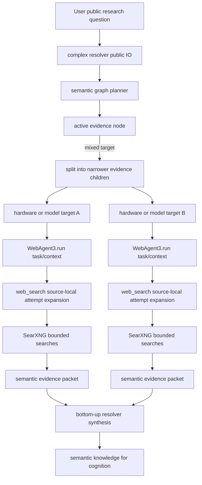

# web_agent3 search attempt expansion and resolver evidence decomposition plan

## Summary

- Goal: Improve public evidence retrieval for dense, multi-target research
  requests by first adding bounded source-local search attempt expansion inside
  WebAgent3, then tightening complex-task resolver evidence-target
  decomposition.
- Plan class: large
- Status: completed
- Mandatory skills: `development-plan`, `local-llm-architecture`, `py-style`,
  `cjk-safety`, `test-style-and-execution`, `debug-llm`
- Overall cutover strategy: staged bigbang inside each module. Public IO stays
  unchanged. Stage 1 changes WebAgent3 internal retrieval behavior. Stage 2
  changes complex-task resolver decomposition behavior after Stage 1 evidence is
  reviewed.
- Highest-risk areas: turning WebAgent3 into a second resolver, caller-facing
  interface creep, deterministic keyword cheating, prompt metadata leaks,
  false "not found" conclusions from over-constrained queries, external
  SearXNG availability hiding framework failures, and unbounded retry cost.
- Acceptance criteria: dense semantic search tasks produce multiple bounded
  retrieval attempts or a concrete reason why expansion was not useful; no
  consumer-facing SearXNG options are added; complex resolver evidence nodes
  become narrower when the question contains independent public targets; real
  LLM review artifacts show the evidence text that feeds the next LLM.

## Context

The current code and test artifacts show a shared failure mode:

- `src/kazusa_ai_chatbot/rag/web_agent3/subagent/web_search.py` executes exactly
  one SearXNG query string from the router.
- `src/kazusa_ai_chatbot/rag/web_agent3/agent.py` has a generator/evaluator
  loop, but the loop relies on the LLM noticing that a search query was too
  dense and then producing a better follow-up query.
- Case 31 showed the complex resolver decomposing the top-level comparison into
  several evidence nodes, but evidence calls still produced partial/noisy
  results when WebAgent3 received broad or typo-prone search text.
- A direct WebAgent3 live probe for the RTX5090/R9700/Qwen/Gemma query captured
  one mixed query:

```text
RTX5090 vs R9700 Qwen3.6 27b 35b gemma4 31/26b performance benchmark Q4 quantization
```

That query was over-constrained for SearXNG-style public web search. The result
could be over-consolidated into a partial evidence packet rather than showing
which narrower evidence paths were tried.

The user-selected architecture is two-step:

1. Fix WebAgent3 first as the bottom-line defensive evidence layer. WebAgent3
   must accept the existing semantic task string and internally map it to the
   best available SearXNG-compatible search behavior.
2. After WebAgent3 evidence improves, fix the complex resolver at source by
   decomposing public evidence targets into smaller atomic nodes before calling
   WebAgent3.

This plan is intentionally separate from
`development_plans/active/short_term/complex_task_resolver_capability_plan.md`.
The existing complex resolver plan remains the broader capability and L2d
integration plan. This plan is the focused retrieval-quality and decomposition
follow-up needed by the current failure analysis.

## Mandatory Skills

- `development-plan`: load before editing, approving, executing, reviewing, or
  signing off this plan.
- `local-llm-architecture`: load before changing WebAgent3 routing prompts,
  source-local search behavior, complex resolver graph prompts, or
  LLM-facing semantic projections.
- `py-style`: load before editing Python production files.
- `cjk-safety`: load before editing Python files or tests that contain CJK
  prompt or description strings.
- `test-style-and-execution`: load before adding, changing, or running tests.
- `debug-llm`: load before running live LLM checks or writing human-readable
  LLM review artifacts.

## Mandatory Rules

- Do not execute implementation steps while `Status` is `draft`.
  Implementation requires user approval and status `approved` or
  `in_progress`.
- Production-code changes require an explicit user command in addition to plan
  status.
- After automatic context compaction, reread this entire plan before continuing
  implementation, verification, handoff, lifecycle updates, or final reporting.
- After signing off any major checklist stage, reread this entire plan before
  starting the next stage.
- Use `venv\Scripts\python` for Python commands.
- Do not read the real `.env` file during implementation or verification.
- Keep WebAgent3 public IO unchanged:

```python
await WebAgent3().run(task: str, context: dict, max_attempts: int = 3)
```

- Keep complex resolver public IO unchanged:

```python
await resolve_complex_task(request, context, options=None)
```

- Do not expose SearXNG `engines`, `categories`, `language`, `time_range`,
  paging, or query-expansion options to WebAgent3 consumers.
- Do not add a public list-of-queries input. Search attempt expansion is an
  internal WebAgent3 source-local behavior.
- WebAgent3 may broaden retrieval attempts, but it must not become a
  task-graph resolver, answer synthesizer, or replacement for complex resolver
  decomposition.
- Complex resolver may call WebAgent3 only through WebAgent3 declared IO.
- Complex resolver real LLM tests must call only complex resolver declared IO.
  Internal traces may be read for debugging and reporting only.
- LLM-facing projections must be semantic only. Do not expose
  `schema_version`, cache keys, cache hit flags, trace ids, provider params,
  SearXNG parameter names, internal stage names, or deterministic transport
  metadata in text intended for the next LLM.
- Do not add deterministic keyword hints, fixture-specific rules, entity
  lookup tables, or hardcoded product/model/test-case names to production code
  or prompts.
- Deterministic code owns validation, caps, deduplication, execution, bounded
  formatting, and prompt-safety checks. LLM stages own semantic query
  decomposition, evidence-target interpretation, and consolidation.
- Do not convert "no results from this query" into "the target does not exist"
  unless the retrieved source itself explicitly supports that conclusion.
- Do not add caching inside complex resolver. Retrieval caches belong to lower
  retrieval layers such as RAG/WebAgent3 where already designed.
- Live LLM tests run one case at a time, and every run must produce a
  human-readable review artifact showing the evidence text and resolver packet
  sections that the next LLM would consume.

## Must Do

- Stage 1: Add WebAgent3 source-local search attempt expansion.
- Stage 1: Keep WebAgent3 public interface and router output shape unchanged.
- Stage 1: Make `web_search` able to run bounded narrower search attempts for
  dense semantic input before returning evidence to the evaluator/finalizer.
- Stage 1: Report exact evidence, adjacent evidence, missing evidence, failed
  paths, and recommended narrower search focus semantically.
- Stage 1: Add deterministic tests proving bounded expansion, deduplication,
  no public interface creep, and no fixture-specific keywords.
- Stage 1: Run a live WebAgent3 review on the dense RTX5090/R9700/Qwen/Gemma
  search task and compare it to the old one-query artifact.
- Stage 2: Tighten complex resolver public evidence decomposition after Stage 1
  evidence is reviewed.
- Stage 2: Make complex resolver split independent public evidence targets
  before calling WebAgent3 when the active node still mixes hardware, model,
  benchmark type, version, or source track.
- Stage 2: Preserve bottom-up semantic packet output:
  `investigation_summary`, `knowledge_we_know_so_far`,
  `knowledge_still_lacking`, `recommended_next_iteration`, and
  `evidence_boundary_notes`.
- Stage 2: Re-run case 31 and any already-partial evidence cases selected by
  the user, reporting only decision-useful output sections rather than raw JSON.

## Deferred

- Do not broad-enable or rework L2d routing in this plan.
- Do not deprecate `local_context_recall` or RAG local-memory retrieval.
- Do not add new public WebAgent3 options.
- Do not add public SearXNG tuning knobs to callers.
- Do not add complex resolver cache or cache-key matching.
- Do not add deterministic domain-specific query templates.
- Do not add database migrations or persistence changes.
- Do not change final dialog wording, adapter behavior, scheduler behavior, or
  character judgment policy.
- Do not run all 32 complex resolver real LLM cases until Stage 1 and Stage 2
  are implemented and the user explicitly commands that run.

## Cutover Policy

Overall strategy: staged bigbang.

| Area | Policy | Instruction |
|---|---|---|
| WebAgent3 public IO | no-op | Keep `run(task, context, max_attempts)` unchanged. |
| WebAgent3 source-local search | bigbang | Replace one-query `web_search` execution with final bounded attempt expansion behavior in one implementation pass. |
| SearXNG compatibility | internal-only | Keep provider details inside WebAgent3/direct SearXNG code, not caller prompts or public options. |
| WebAgent3 router JSON | no-op | Keep `action`, `source`, and `query` only. |
| Complex resolver public IO | no-op | Keep `resolve_complex_task(request, context, options)` unchanged. |
| Complex resolver decomposition | staged bigbang | Update evidence-target decomposition only after Stage 1 evidence is reviewed. |
| L2d capability integration | deferred | Keep governed by the existing complex resolver capability plan. |

## Cutover Policy Enforcement

- For bigbang areas, rewrite the existing behavior instead of preserving a
  parallel legacy behavior.
- Do not add compatibility shims, alias fields, fallback mappers, or duplicate
  vocabulary merely to keep old internal call shapes alive.
- Any change to public IO or cutover policy requires user approval before
  implementation.

## Target State

WebAgent3 remains the public web evidence helper:

```text
consumer task/context
  -> WebAgent3 router selects source/action/query
  -> web_search source expands dense search input into bounded attempts
  -> SearXNG calls execute internally
  -> WebAgent3 evaluator/finalizer produces a semantic evidence packet
```

Complex resolver remains the graph-based public-answer research module:

```text
resolve_complex_task(request, context, options)
  -> plan root graph
  -> resolve one active node
  -> expand mixed nodes recursively within depth/node limits
  -> call resolver-local evidence or algorithmic subagents by declared IO
  -> execute bounded follow-up child nodes when needed
  -> synthesize semantic packet bottom-up
```

The intended architecture after both stages:



## Design Decisions

| Topic | Decision | Rationale |
|---|---|---|
| First fix location | Fix WebAgent3 first | WebAgent3 is shared by multiple consumers and is the correct layer for SearXNG compatibility and no-result defense. |
| WebAgent3 scope | Source-local search expansion only | Prevents WebAgent3 from duplicating complex resolver's graph and recursive task-dissection responsibility. |
| Public interface | Keep unchanged | Consumers should submit semantic evidence tasks without knowing SearXNG quirks. |
| Expansion ownership | LLM proposes semantic attempts; deterministic code validates, caps, dedups, and executes | Keeps semantic judgment in LLM while preventing unbounded or malformed search behavior. |
| Query list exposure | Internal only | The user explicitly requested no additional consumer options. |
| Failure wording | Exact-missing plus adjacent evidence, not false absence | A failed query is not evidence that the real-world target does not exist. |
| Complex resolver second step | Improve source decomposition after WebAgent3 evidence is reviewed | Avoids masking shared retrieval-layer failure with upstream prompt-only changes. |
| Real LLM reports | Show evidence text and semantic packet sections | The user needs the actual text fed to the next LLM, not raw JSON or hidden assertions. |

## Contracts And Data Shapes

### WebAgent3 Public Contract

Unchanged:

```python
await WebAgent3().run(task: str, context: dict, max_attempts: int = 3)
```

Public result shape remains compatible with existing callers:

```python
{
    "resolved": bool,
    "result": "prompt-safe semantic evidence text",
    "attempts": int,
    "cache": {...}
}
```

`cache` remains part of the helper-agent envelope for deterministic consumers,
but it must not be copied into LLM-facing semantic evidence text.

### WebAgent3 Internal Search Attempt Shape

The implementation may add an internal typed representation similar to:

```python
{
    "query": "short source-search text",
    "purpose": "semantic reason this attempt exists",
}
```

Rules:

- This shape is internal to WebAgent3 source execution.
- It must be bounded by a small hard cap.
- Duplicate or empty queries must be removed deterministically.
- It must not expose SearXNG provider parameters to callers.
- It must not contain fixture expected answers or deterministic test hints.

### WebAgent3 Search Observation Text

The source-local result returned to the evaluator/finalizer should be semantic
and bounded:

```text
Search attempts:
1. Query: ...
   Purpose: ...
   Result: exact evidence / adjacent evidence / no useful result / tool error
   Key evidence: ...

Missing or weak coverage:
- ...

Recommended narrower search focus:
- ...
```

This text is acceptable for LLM consumption because it describes evidence and
limitations, not transport metadata.

### Complex Resolver Public Contract

Unchanged:

```python
await resolve_complex_task(request, context, options=None)
```

Final packet remains semantic:

```python
{
    "investigation_summary": "...",
    "knowledge_we_know_so_far": ["..."],
    "knowledge_still_lacking": ["..."],
    "recommended_next_iteration": ["..."],
    "evidence_boundary_notes": ["..."],
    ...
}
```

The complex resolver may retain internal trace fields for debugging, but tests
and reports must distinguish trace/debug data from LLM-facing semantic output.

## LLM Call And Context Budget

| Stage | Route | Budget rule |
|---|---|---|
| WebAgent3 router | existing `WEB_SEARCH_LLM` route | Unchanged outer loop budget. |
| WebAgent3 search attempt expansion | existing `WEB_SEARCH_LLM` route or deterministic no-LLM fallback only if no semantic split is needed | At most one additional compact LLM call per `web_search` execution if implemented as an LLM stage. |
| WebAgent3 evaluator/finalizer | existing `WEB_SEARCH_LLM` route | Unchanged. Finalizer sees bounded attempt summary, not raw full search payloads. |
| Complex resolver planner/node/synthesizer | existing complex resolver routes | Unchanged route. Node count/depth limits remain authoritative. |
| Complex resolver evidence subagent | WebAgent3 public IO | At most the configured resolver evidence attempts; WebAgent3 handles internal bounded search expansion. |

The implementation must prefer fewer wider-quality calls over unbounded loops.
If the added WebAgent3 expansion LLM call is too costly, the implementation may
reuse the existing router output and perform deterministic attempt generation
only for obvious mechanical cleanup, but it must not add domain-specific
keyword rules.

## Change Surface

Expected production files:

- `src/kazusa_ai_chatbot/rag/web_agent3/subagent/web_search.py`
- `src/kazusa_ai_chatbot/rag/web_agent3/direct_searxng.py`
- `src/kazusa_ai_chatbot/rag/web_agent3/searxng_tools.py`
- `src/kazusa_ai_chatbot/rag/web_agent3/agent.py`
- `src/kazusa_ai_chatbot/rag/web_agent3/README.md`
- `src/kazusa_ai_chatbot/complex_task_resolver/stages.py`
- `src/kazusa_ai_chatbot/complex_task_resolver/service.py`
- `src/kazusa_ai_chatbot/complex_task_resolver/subagents.py`
- `src/kazusa_ai_chatbot/complex_task_resolver/README.md`

Expected tests and fixtures:

- `tests/test_web_agent3.py`
- `tests/test_web_agent3_routing.py`
- New focused WebAgent3 search expansion tests if the existing files become too
  dense.
- `tests/test_complex_task_resolver_evidence.py`
- `tests/test_complex_task_resolver_service.py`
- `tests/test_complex_task_resolver_prompt_contract.py`
- `tests/test_complex_task_resolver_live_llm.py`
- `tests/fixtures/complex_task_resolver_review_cases.json`

Expected artifacts:

- `test_artifacts/llm_reviews/`
- `test_artifacts/llm_traces/`
- `test_artifacts/complex_task_resolver/`

## Overdesign Guardrail

- Do not create a new general search DSL.
- Do not add a new external search provider abstraction in this plan.
- Do not add a new cache layer.
- Do not add a second graph engine under WebAgent3.
- Do not add persistent memory, database records, scheduler hooks, or adapter
  changes.
- Do not add broad "research strategy" prompts to WebAgent3. Keep strategy in
  complex resolver; keep retrieval compatibility in WebAgent3.

## Agent Autonomy Boundaries

- The implementing agent may edit tests and documentation covered by this plan
  after user approval.
- The implementing agent may edit production code covered by this plan only
  after explicit user command and valid plan status.
- The implementing agent must stop and ask before changing public IO,
  L2d-visible capability names, cache architecture, or real LLM pass criteria.
- The implementing agent must stop and report if live external availability is
  blocked in a way that prevents evaluating retrieval quality. Deterministic
  unit tests still proceed.

## Implementation Order

### Stage 0: Baseline And Test Design

1. Reread this plan, `README.md`, `docs/HOWTO.md`, WebAgent3 README, complex
   resolver README, and directly affected source/test files.
2. Capture current deterministic test baseline for WebAgent3 and complex
   resolver focused tests.
3. Record the old dense-query WebAgent3 artifact and case 31 complex resolver
   artifact as comparison baselines.
4. Add failing deterministic tests for:
   - `web_search` expands dense semantic input into bounded internal attempts.
   - `web_search` preserves simple direct query behavior.
   - expansion deduplicates empty/repeated queries.
   - WebAgent3 public IO and router JSON shape remain unchanged.
   - LLM-facing evidence text contains semantic evidence sections and excludes
     schema/cache/provider/trace metadata.
   - production code does not contain fixture case ids or hardcoded review
     product/model names.

### Stage 1: WebAgent3 Source-Local Search Expansion

1. Implement internal attempt expansion in `web_search`.
2. Keep SearXNG-specific parameters internal. If `direct_searxng.py` needs
   internal support for provider compatibility, expose it only through internal
   Python calls, not public WebAgent3 options.
3. Format multi-attempt observations as bounded semantic evidence text.
4. Update WebAgent3 evaluator/finalizer prompts only as needed to understand
   exact evidence, adjacent evidence, missing coverage, and recommended
   narrower search focus.
5. Update WebAgent3 README to document internal behavior without changing the
   public contract.
6. Run deterministic WebAgent3 tests.
7. Run one live WebAgent3 dense-query review and write a human-readable report
   comparing old and new behavior.
8. Stop for user review before Stage 2 unless the user explicitly authorizes
   continuing.

### Stage 2: Complex Resolver Evidence-Target Decomposition

1. Use Stage 1 evidence to identify whether remaining partials come from
   upstream node decomposition rather than WebAgent3 search compatibility.
2. Strengthen planner/node prompt wording so mixed public evidence nodes expand
   into smaller evidence children before subagent calls.
3. Keep prompt language positive and capability-oriented. Do not create a
   lookup table of examples or prohibited phrases.
4. Ensure continuation/follow-up child task creation remains bounded by fixed
   depth, node, and iteration limits.
5. Preserve resolver-local subagent discovery and IO. Do not hardcode subagent
   capability details outside the discovered prompt-facing registry.
6. Update deterministic complex resolver tests for:
   - evidence nodes narrow mixed targets before subagent calls;
   - recommended next iteration is semantic guidance unless emitted as a
     structured continuation task;
   - no deterministic metadata leaks into semantic packet fields;
   - real LLM harness reports evidence result and resolver output sections.
7. Run case 31 live LLM review and compare with the old artifact.

### Stage 3: Focused Regression And Review

1. Run focused deterministic suites:

```powershell
venv\Scripts\python -m pytest tests\test_web_agent3.py tests\test_web_agent3_routing.py -q
venv\Scripts\python -m pytest tests\test_complex_task_resolver_contracts.py tests\test_complex_task_resolver_graph.py tests\test_complex_task_resolver_evidence.py tests\test_complex_task_resolver_algorithmic.py tests\test_complex_task_resolver_prompt_contract.py tests\test_complex_task_resolver_service.py -q
```

2. Run compile verification:

```powershell
venv\Scripts\python -m compileall -q src\kazusa_ai_chatbot\rag\web_agent3 src\kazusa_ai_chatbot\complex_task_resolver tests
```

3. Run targeted live LLM cases one at a time only after deterministic tests pass.
4. Perform independent code review focused on production readiness, plan
   alignment, public IO stability, prompt safety, and absence of test cheating.
5. Repeat fixes until the review has no blocking findings.

## Execution Model

- Use a parent-led workflow.
- If native subagent tools are available during implementation, use one
  implementation subagent for production changes and one independent review
  subagent after the final production change.
- The parent agent owns test updates, live LLM runs, artifacts, failure-mode
  analysis, and final signoff.
- If native subagent tools are unavailable, the parent agent may write tests and
  plan updates, but must ask before performing production implementation that
  the user previously required to be subagent-assisted.

## Progress Checklist

- [x] Planning context read.
- [x] Current WebAgent3 and complex resolver code surfaces inspected.
- [x] Plan review performed and surfaced issues incorporated.
- [x] Plan approved for implementation.
- [x] Stage 0 baseline and failing tests completed.
- [x] Stage 1 WebAgent3 implementation completed.
- [x] Stage 1 deterministic tests passed.
- [x] Stage 1 live WebAgent3 dense-query review completed.
- [x] Stage 1 user review completed.
- [x] Stage 2 complex resolver decomposition implementation completed.
- [x] Stage 2 deterministic tests passed.
- [x] Stage 2 case 31 live LLM review completed.
- [x] Stage 3 focused regression completed.
- [x] Independent code review completed with no blocking findings.
- [x] Execution evidence recorded.

## Verification

### Deterministic Tests

Required before live LLM:

```powershell
venv\Scripts\python -m pytest tests\test_web_agent3.py tests\test_web_agent3_routing.py -q
venv\Scripts\python -m pytest tests\test_complex_task_resolver_contracts.py tests\test_complex_task_resolver_graph.py tests\test_complex_task_resolver_evidence.py tests\test_complex_task_resolver_algorithmic.py tests\test_complex_task_resolver_prompt_contract.py tests\test_complex_task_resolver_service.py -q
venv\Scripts\python -m compileall -q src\kazusa_ai_chatbot\rag\web_agent3 src\kazusa_ai_chatbot\complex_task_resolver tests
```

### Prompt-Safety Searches

Run after implementation:

```powershell
rg -n "schema_version|cache_name|cache hit|trace_id|provider params|SearXNG params" src\kazusa_ai_chatbot\rag\web_agent3 src\kazusa_ai_chatbot\complex_task_resolver tests
rg -n "ctr_031|ctr_032|RTX5090|R9700|Qwen3\.6|gemma4" src\kazusa_ai_chatbot\rag\web_agent3 src\kazusa_ai_chatbot\complex_task_resolver
rg -n "expected_final_answer|minimum_viable_answer|performance_reference_summary|expected_graph_trace|forbidden_failure_modes" src\kazusa_ai_chatbot\rag\web_agent3 src\kazusa_ai_chatbot\complex_task_resolver
```

Matches are acceptable only in tests, fixtures, artifacts, or comments that are
not production prompt logic. Production prompt or branching matches block
signoff.

### Live LLM Review

Run only one live case at a time:

```powershell
venv\Scripts\python -m pytest tests\test_complex_task_resolver_live_llm.py::test_live_review_case_31_rtx5090_r9700_q4_model_performance -q -s -m live_llm
```

Report requirements:

- Show the original user question.
- Show the evidence result section in readable prose.
- Show the resolver output consumed by the next LLM:
  `investigation_summary`, `knowledge_we_know_so_far`,
  `knowledge_still_lacking`, `recommended_next_iteration`, and
  `evidence_boundary_notes`.
- Show the mermaid graph when evaluating decomposition.
- Compare old and new artifacts when a previous artifact exists.
- Classify remaining partials as framework robustness, external availability,
  source availability, or acceptable evidence limitation.

## Independent Plan Review

Review performed during plan creation. User approved Stage 1 execution on
2026-07-01 and explicitly requested fallback execution without subagents.

| Finding | Severity | Resolution in this plan |
|---|---|---|
| WebAgent3 search expansion could duplicate complex resolver decomposition. | High | WebAgent3 scope is limited to source-local bounded attempts. No graph, no recursive task dissection, no answer synthesis. |
| Caller-facing interface could grow with SearXNG-specific options. | High | Public IO remains unchanged and SearXNG options are explicitly internal-only. |
| Query decomposition could become deterministic keyword cheating. | High | Production code and prompts may not hardcode fixture ids, product/model names, or test-specific hints. Prompt-safety searches are required. |
| Prompt-facing text could leak `schema_version`, cache, trace, or provider metadata. | High | LLM-facing semantic-only rule is mandatory; deterministic tests and `rg` checks are required. |
| False "not found" can be produced from one bad query. | High | Search observation must distinguish exact evidence, adjacent evidence, missing coverage, failed paths, and recommended focus. |
| External SearXNG availability can hide framework failures. | Medium | Deterministic expansion tests are required before live tests; live reports classify external blockers separately. |
| Extra search attempts can increase latency and cost. | Medium | Expansion is hard-capped, deduped, and bounded to source-local search execution. |
| Stage 2 complex resolver fixes could mask Stage 1 retrieval failures. | Medium | Stage 1 must be reviewed before Stage 2 proceeds. |
| Real LLM reports have previously hidden the actual next-LLM input. | Medium | Report requirements explicitly require evidence result and semantic resolver output sections. |

No open blocking plan-review issues remain. Stage 1 is authorized for
single-agent fallback execution by explicit user instruction.

## Independent Code Review

Required after the final production-code change and before signoff.

Reviewer focus:

- production readiness, not POC behavior;
- alignment with this plan;
- WebAgent3 public IO unchanged;
- complex resolver public IO unchanged;
- no deterministic fixture or keyword cheating;
- LLM-facing projections semantic only;
- no new complex resolver cache;
- source-local expansion bounded and deduplicated;
- real LLM artifacts show decision-useful output.

Blocking findings must be fixed and reviewed again before signoff.

## Acceptance Criteria

- WebAgent3 dense semantic search no longer relies on a single over-constrained
  SearXNG query when narrower attempts are possible.
- WebAgent3 simple search behavior remains compatible with current callers.
- WebAgent3 returns semantic evidence text that shows what was tried and what
  remains weak or missing.
- Complex resolver evidence nodes become narrower before WebAgent3 calls when
  the active task mixes independent public targets.
- Complex resolver final packet remains semantic and judgment-free for
  cognition to evaluate.
- No new public options, aliases, or compatibility shims are introduced.
- Deterministic focused tests pass.
- Live LLM review artifacts for selected cases show improved or at least more
  diagnostically useful evidence compared with previous artifacts.

## Risks

- Local LLM may still generate weak search attempts. Mitigation: hard caps,
  deduplication, exact/adjacent/missing classification, and deterministic tests
  for prompt-safe output.
- SearXNG may be blocked or return poor upstream search results. Mitigation:
  classify as external/source availability, and verify framework behavior with
  mocked deterministic tests.
- Extra attempts may increase latency. Mitigation: bounded attempt count and no
  new outer loop.
- Complex resolver could over-split nodes. Mitigation: split only independent
  public evidence targets; keep synthesis bottom-up and bounded by existing
  limits.
- Reports can drift back to raw JSON. Mitigation: live harness report
  requirements are part of acceptance criteria.

## Execution Evidence

- 2026-07-01: User reviewed Stage 1 output and approved continuing through the
  remaining plan stages.

- 2026-07-01: User approved Stage 1 execution and explicitly requested no
  subagent use. Plan status promoted to `in_progress`; execution is limited to
  Stage 1.
- 2026-07-01: Stage 0 baseline command passed before implementation:
  `venv\Scripts\python -m pytest tests\test_web_agent3.py tests\test_web_agent3_routing.py -q`
  returned 53 passed.
- 2026-07-01: Added Stage 1 focused deterministic tests in
  `tests/test_web_agent3.py`. Pre-implementation red run:
  `venv\Scripts\python -m pytest tests\test_web_agent3.py::test_web_agent3_web_search_expands_dense_query_inside_source tests\test_web_agent3.py::test_web_agent3_web_search_preserves_simple_query_path tests\test_web_agent3.py::test_web_agent3_web_search_expansion_dedupes_and_caps_attempts -q`
  returned 2 failed and 1 passed because `_generate_search_attempts` was not
  implemented yet.
- 2026-07-01: Implemented Stage 1 source-local search attempt expansion in
  `src/kazusa_ai_chatbot/rag/web_agent3/subagent/web_search.py`, minimal
  finalizer prompt guidance in
  `src/kazusa_ai_chatbot/rag/web_agent3/agent.py`, and ICD documentation in
  `src/kazusa_ai_chatbot/rag/web_agent3/README.md`.
- 2026-07-01: Focused Stage 1 verification passed:
  `venv\Scripts\python -m pytest tests\test_web_agent3.py::test_web_agent3_web_search_expands_dense_query_inside_source tests\test_web_agent3.py::test_web_agent3_web_search_preserves_simple_query_path tests\test_web_agent3.py::test_web_agent3_web_search_expansion_dedupes_and_caps_attempts tests\test_web_agent3.py::test_web_agent3_web_search_receives_query_unchanged tests\test_web_agent3.py::test_web_agent3_finalizer_prompt_covers_known_regression_rules -q`
  returned 5 passed.
- 2026-07-01: Syntax verification passed:
  `venv\Scripts\python -m py_compile src\kazusa_ai_chatbot\rag\web_agent3\subagent\web_search.py src\kazusa_ai_chatbot\rag\web_agent3\agent.py tests\test_web_agent3.py`.
- 2026-07-01: WebAgent3 deterministic regression passed:
  `venv\Scripts\python -m pytest tests\test_web_agent3.py tests\test_web_agent3_routing.py -q`
  returned 56 passed.
- 2026-07-01: Final post-cleanup verification passed:
  `venv\Scripts\python -m pytest tests\test_web_agent3.py tests\test_web_agent3_routing.py -q`
  returned 56 passed; `venv\Scripts\python -m compileall -q src\kazusa_ai_chatbot\rag\web_agent3 tests\test_web_agent3.py tests\test_web_agent3_routing.py`
  passed; `git diff --check` passed with only existing Windows LF/CRLF
  working-copy warnings.
- 2026-07-01: Prompt-safety greps found no fixture case ids or review-answer
  metadata in `src\kazusa_ai_chatbot\rag\web_agent3` or
  `src\kazusa_ai_chatbot\complex_task_resolver`. Metadata terms such as
  `schema_version` and `cache_name` appeared only in typed contracts, public
  result envelopes, README examples, existing complex resolver internals, and
  tests, not in the new WebAgent3 LLM-facing evidence text.
- 2026-07-01: Live WebAgent3 dense-query review completed with raw trace
  `test_artifacts/llm_traces/web_agent3_search_attempt_expansion_live_llm__dense_rtx5090_qwen_gemma_after_stage1.json`
  and human-readable review
  `test_artifacts/llm_reviews/web_agent3_search_attempt_expansion_live_llm_review_20260701.md`.
  The run generated four source-local search attempts from one dense router
  query and then read follow-up sources. Exact Qwen3.6/Gemma hardware
  comparison evidence remained partial, which is a Stage 2 decomposition or
  external-evidence limitation rather than a Stage 1 framework failure.
- 2026-07-01: Stage 2 production update completed in
  `src/kazusa_ai_chatbot/complex_task_resolver/stages.py` and
  `src/kazusa_ai_chatbot/complex_task_resolver/README.md`: public evidence
  nodes that still bundle independent targets or fact dimensions are now
  instructed to expand into narrower `public_evidence` children before using
  the evidence capability. The public resolver IO and resolver-local subagent
  registry remain unchanged.
- 2026-07-01: During deterministic regression, the complex resolver suite
  surfaced a production service bug: algorithmic over-depth expansion was
  being rerouted into an invalid calculator fallback. Root cause was
  `_resolve_active_node_once` applying graph-boundary fallback to any
  subagent-owned node. Fixed in
  `src/kazusa_ai_chatbot/complex_task_resolver/service.py` by limiting that
  fallback to the evidence subagent, preserving local graph-limit rejection
  for algorithmic nodes.
- 2026-07-01: Deterministic verification passed after the Stage 2 service fix:
  `venv\Scripts\python -m pytest tests\test_web_agent3.py tests\test_web_agent3_routing.py -q`
  returned 56 passed, and
  `venv\Scripts\python -m pytest tests\test_complex_task_resolver_contracts.py tests\test_complex_task_resolver_graph.py tests\test_complex_task_resolver_evidence.py tests\test_complex_task_resolver_algorithmic.py tests\test_complex_task_resolver_prompt_contract.py tests\test_complex_task_resolver_service.py -q`
  returned 64 passed.
- 2026-07-01: Compile and static checks passed:
  `venv\Scripts\python -m compileall -q src\kazusa_ai_chatbot\rag\web_agent3 src\kazusa_ai_chatbot\complex_task_resolver tests`
  passed; `git diff --check` passed with only Windows LF/CRLF working-copy
  warnings. Fixture case id and reference-answer metadata greps found no
  matches in production WebAgent3 or complex resolver code.
- 2026-07-01: Stage 2 case 31 live LLM review passed structurally with
  `venv\Scripts\python -m pytest tests\test_complex_task_resolver_live_llm.py::test_live_review_case_31_rtx5090_r9700_q4_model_performance -m live_llm -q -s`.
  New trace:
  `test_artifacts/llm_traces/complex_task_resolver_live_llm__case_31_rtx5090_r9700_q4_model_performance__20260630T235023641272Z.json`.
  The run produced five evidence subagent calls, seven graph iterations, one
  executed follow-up child, one rejected follow-up at `max_nodes`, a depth-2
  graph, nine known rows, four lacking rows, and two recommended next-iteration
  rows. Compared with the latest earlier case-31 trace, which had four
  evidence calls, depth 1, five blocked nodes, and no follow-up execution, the
  framework behavior improved. Remaining gaps are external evidence
  availability and source quality: blocked Reddit/Towards AI reads and missing
  direct Gemma 4 31B tokens/s evidence.
- 2026-07-01: Independent read-only review found two blocking WebAgent3 issues
  and one medium coverage gap: generated search-attempt fields could stringify
  non-semantic metadata into queries/output, invalid expansion could fall back
  to the original dense query without an explicit weak-coverage note, and dense
  query detection missed Chinese-first comparison wording. Fixed in
  `src/kazusa_ai_chatbot/rag/web_agent3/subagent/web_search.py`, documented in
  `src/kazusa_ai_chatbot/rag/web_agent3/README.md`, and covered by new
  regression tests in `tests/test_web_agent3.py`.
- 2026-07-01: Post-review deterministic verification passed:
  focused WebAgent3 review regressions returned 4 passed;
  `venv\Scripts\python -m pytest tests\test_web_agent3.py tests\test_web_agent3_routing.py -q`
  returned 60 passed; the complex resolver deterministic suite still returned
  64 passed; compile and `git diff --check` still passed.
- 2026-07-01: Re-ran case 31 after the WebAgent3 review fixes:
  `venv\Scripts\python -m pytest tests\test_complex_task_resolver_live_llm.py::test_live_review_case_31_rtx5090_r9700_q4_model_performance -m live_llm -q -s`
  passed structurally. New trace:
  `test_artifacts/llm_traces/complex_task_resolver_live_llm__case_31_rtx5090_r9700_q4_model_performance__20260701T000137680749Z.json`.
  The run produced four evidence subagent calls, six graph iterations, depth 2,
  eight known rows, five lacking rows, and two recommended next-iteration rows.
  The evidence packet remains partial because direct Q4 RTX 5090 Qwen data,
  R9700 Gemma data, and several key page bodies were unavailable or blocked,
  not because search expansion or graph decomposition failed structurally.
- 2026-07-01: Second independent read-only review found two remaining blocking
  WebAgent3 hardening gaps: generated attempt validation did not cover
  underscore/spaced variants such as provider params, cache hit flags,
  graph-node ids, and stage/route names; Chinese dense-query detection still
  missed no-space forms such as `Alpha和Beta性能对比`. Fixed by normalizing
  generated attempt fields before forbidden-fragment checks and by treating
  Chinese `和` and `与` as structural signals. Added focused regression
  coverage for the named variants. Focused tests passed, the full WebAgent3
  suite returned 60 passed, the complex resolver suite returned 64 passed,
  and compile/static checks still passed.
- 2026-07-01: Final independent read-only review found no blocking findings
  remaining. It confirmed generated search-attempt metadata is gated before
  SearXNG execution and prompt-facing output, and confirmed no-space Chinese
  dense-query examples are covered. Residual non-blocking risks are broader
  CJK heuristic coverage and the deliberate weak-coverage fallback to the
  original router query when no valid generated attempt exists.
