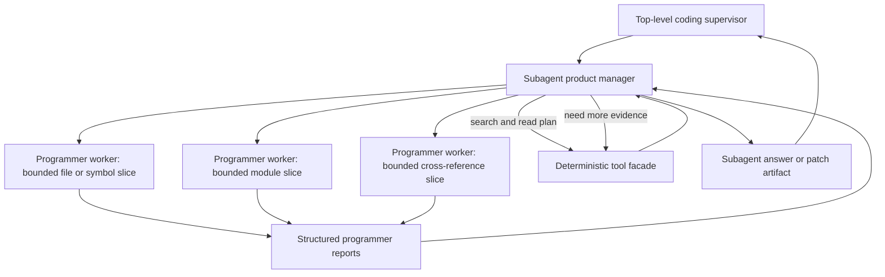
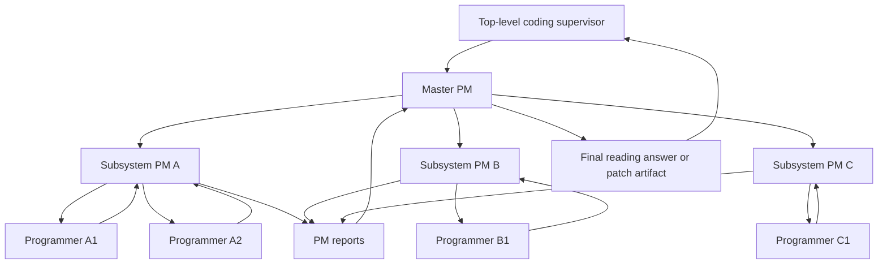
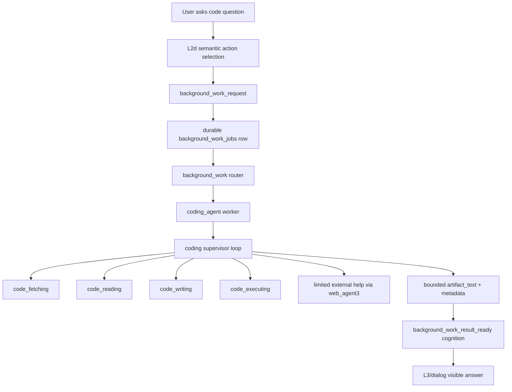

# Coding Agent Architecture

## Status

- Type: reference architecture and decision record
- Status: draft reference
- Related execution plans:
  - `development_plans/archive/completed/short_term/coding_agent_phase0_fetching_plan.md`
  - `development_plans/archive/completed/short_term/coding_agent_phase1_code_reading_final_plan.md`
  - `development_plans/active/short_term/coding_agent_phase3_background_worker_integration_plan.md`
- Planned next execution plan:
  - Phase 2 standalone `code_writing` plan, not yet written.
- Execution rule: do not execute directly from this document

This document captures the top-level architecture for replacing placeholder
code-related background work with a specialized `coding_agent`. The archived
completed Phase 0 plan records the implemented `code_fetching` contract; the
active final Phase 1 draft plan defines the corrected `code_reading` and
direct answer interface on top of that fetching contract. Phase 2 is the next
standalone `code_writing` stage. The active Phase 3 draft plan defines the
later background-worker integration stage.

## Problem

Kazusa needs to answer codebase questions through the normal L2d interface, for
example:

```text
[eamars/KazusaAIChatbot](https://github.com/eamars/KazusaAIChatbot) 项目是怎么实现读图的
```

The existing background-work text-artifact placeholder is intentionally
text-only. It cannot read repositories, use `rg`, inspect files, fetch public
code, produce evidence-backed code answers, propose patches, or safely separate
code tooling from final dialog. Expanding that placeholder would violate the
current background-work ICD. Coding work needs its own worker and subagent
architecture behind the durable background-work queue.

## Architectural Goal

`coding_agent` is a background-work worker that performs slow, tool-using code
tasks after the live persona turn. It returns a bounded artifact as
`background_work_result_ready`; L3/dialog remains the only visible wording
owner.

The agent must support four top-level sub-subagents:

- `code_fetching`: obtain or resolve repository code.
- `code_reading`: inspect code and answer repository/source questions.
- `code_writing`: propose and validate patches, patch-first.
- `code_executing`: run bounded sandbox execution or delegate to Docker when a
  local sandbox is unavailable.

The common architecture is a supervisor/resolver loop. The top-level
`coding_agent` supervisor owns the goal state, chooses the next subagent, and
evaluates whether the returned evidence is enough to finish or whether another
bounded step is required.

## Architecture Decision: Local-LLM-First Context Partitioning

Status: accepted hard requirement.

`coding_agent` is designed specifically for local or weaker OpenAI-compatible
LLMs, not for a frontier model with effectively unlimited long-context
reasoning. The architecture must assume every LLM call has a hard effective
context limit and that repository-scale code comprehension cannot be solved by
placing more files, tool traces, or instructions into one prompt.

The rejected architecture is a single general-purpose coding agent that
fetches code, scans the repository, remembers every relevant detail, plans the
answer or patch, validates evidence, and synthesizes the final artifact in one
agent context. That design may work on small examples, but it fails on larger
projects because it relies on one LLM window to hold the user goal, repository
map, source evidence, unresolved questions, implementation interfaces, and
final synthesis at the same time. It also makes correctness depend too heavily
on model strength, attention quality, and context size.

The accepted architecture is explicit context partitioning:

- The top-level coding supervisor owns the global coding goal, resolver state,
  subagent selection, bounded iteration, and final artifact handoff.
- Each top-level subagent owns one domain of work and keeps its own bounded
  context memory for that domain.
- `code_reading` and `code_writing` must use a product-manager/programmer
  structure for non-trivial tasks. The product manager owns decomposition,
  interface boundaries, architecture map, cross-file synthesis, and deciding
  whether more local inspection is needed. Programmer workers own deep reading
  or patch design for bounded source slices such as files, symbols, modules, or
  subsystems.
- Programmer workers return structured reports that become compressed memory:
  evidence references, interface facts, behavior summaries, uncertainty, and
  follow-up needs. The product manager reasons over those reports and cited
  evidence, not over the full raw repository.
- Deterministic tooling owns repository discovery, path safety, file caps,
  search execution, patch validation, execution limits, and storage boundaries.
  LLM stages receive normalized, bounded evidence rows and task-specific
  semantic summaries.
- Coding-agent LLM use is route-configurable. The standalone coding agent uses
  `CODING_AGENT_PM_LLM` for PM decisions and final synthesis, and
  `CODING_AGENT_PROGRAMMER_LLM` for bounded programmer workers. A separate
  synthesizer model route is intentionally not part of the architecture.

This requirement is mandatory for scalability. The coding agent must be able
to inspect projects whose relevant implementation cannot fit in one prompt.
The product-manager/programmer pattern is therefore a context and memory
ownership architecture, not a naming convention.

The internal reading and writing shape is:



### PM And Programmer Assignment Contract

The product manager decides programmer roles and boundaries through a bounded
decomposition step. The PM must never assign a programmer to "read the repo" or
"understand the feature" without a concrete scope. A programmer role is a
temporary task contract for one evidence need, not a permanent agent identity.

For reading, the PM consumes a compact `PMInput`:

```python
{
    "question": str,
    "repository_summary": dict,
    "source_scope": dict,
    "repo_map_summary": dict,
    "previous_reports": list[dict],
}
```

The PM returns a `PMDecision`:

```python
{
    "status": "need_programmers | sufficient | needs_user_input | overloaded",
    "intent": str,
    "required_slots": list[str],
    "assignments": list[dict],
    "missing_slots": list[str],
}
```

Each programmer assignment must define one bounded mission and one scope:

```python
{
    "assignment_id": str,
    "role": str,
    "scope": {
        "kind": "file | directory | symbol | search",
        "values": list[str],
    },
    "questions": list[str],
    "required_slots": list[str],
}
```

The PM chooses assignment boundaries from four signals:

- the user question intent, such as feature flow, symbol explanation, API
  contract, persistence path, tests, dependency usage, or impact read;
- the deterministic repository map, including file tree, package names, docs,
  imports, and symbol search results;
- the required slots needed to answer or patch safely;
- the local-LLM context budget, so each programmer receives a small enough
  slice to read deeply.

For a data/pipeline question, a correct reading PM may create bounded
assignments such as:

- `ingress reader`: inspect only files where the input enters the system;
- `processing reader`: inspect only files that transform or enrich the input;
- `projection reader`: inspect only files that pass the transformed data to a
  downstream consumer;
- `test reader`: inspect only tests that prove or constrain the behavior.

Each programmer returns a structured report. The report is the memory boundary
between local reading and PM synthesis:

```python
{
    "assignment_id": str,
    "status": "succeeded | blocked | no_evidence",
    "files_read": list[str],
    "facts": list[{
        "kind": str,
        "summary": str,
        "evidence_refs": list[str],
    }],
    "evidence": list[dict],
    "open_questions": list[str],
}
```

The PM may ask deterministic tools for more repository-map information, launch
additional programmer assignments, ask a narrow follow-up assignment, finish,
or ask for user clarification. The PM must not synthesize a final answer or
patch from missing facts. Missing facts become limitations or follow-up work.

Phase 1 supervisor limits cap one PM at three programmers per wave, two waves,
and six programmer reports total. Larger or conflicting requests set an
overload status instead of forcing one PM to pretend it read a whole project.

### Master PM Escalation

For larger projects, `code_reading` and `code_writing` may use a master PM
above subsystem PMs:



Master PM is a scalability mechanism, not the default path. Use it only when a
single PM cannot keep the relevant subsystem map, required facts, and report
set inside the context budget. Triggers include:

- broad repository or multi-package architecture questions;
- cross-runtime or cross-service feature flows;
- questions requiring several independent ownership domains;
- a PM work plan whose estimated programmer reports would exceed the PM
  context budget;
- conflicting programmer reports that require subsystem-level reconciliation.

Subsystem PMs return `PMReport` objects to the master PM. The master PM sees
subsystem PM reports and selected evidence references, not every programmer's
raw excerpts by default.

### Shared Reading And Writing Model

`code_reading` and `code_writing` share the PM/programmer hierarchy. Reading
programmers report code behavior and interfaces. Writing programmers report
bounded patch designs, local risks, and proposed diffs for their assigned
scope. In both cases:

- the PM owns cross-file architecture and interface consistency;
- programmers own bounded local inspection or patch design;
- deterministic tools own path safety, search, file caps, patch validation,
  execution limits, and output normalization;
- reports are the durable memory artifacts passed upward;
- final visible answers or patch artifacts are produced only by the PM or
  master PM and then returned to the top-level coding supervisor.

## Runtime Placement

The diagram below is the long-term Kazusa integration target after the
standalone coding-agent core exists. Phases 0, 1, and 2 implement only direct
module paths shown after the diagram.



L2d does not choose a worker, file path, repository path, tool argument, shell
command, patch, or final answer. It can only select the private
`background_work_request` capability. Deterministic action-spec code
materializes the trusted task brief and delivery scope. The background-work
router selects `coding_agent` after the live turn.

The Phase 0 standalone path is:

```text
CodeFetchingRequest
  -> code_fetching.run
  -> CodeFetchingResult
```

The Phase 1 standalone path is:

```text
CodingAgentRequest
  -> coding_agent.answer_code_question
  -> coding supervisor loop
  -> code_fetching.run from Phase 0
  -> code_reading.run
  -> CodingAgentResponse
```

Phase 0 and Phase 1 tests call these public interfaces directly. They do not
use L2d, background-work jobs, router integration, result-ready cognition,
service delivery, or placeholder removal.

Phase 1 direct responses expose only a public-safe repository summary and
repo-relative evidence. Raw checkout roots, workspace roots, cache keys,
subprocess traces, job ids, leases, and adapter delivery fields remain private
implementation data.

The Phase 2 standalone path is:

```text
CodingAgentRequest
  -> coding_agent.propose_code_change
  -> coding supervisor loop
  -> code_fetching.run from Phase 0
  -> code_reading.run for evidence when needed
  -> code_writing.run
  -> CodingPatchProposalResponse
```

Phase 2 tests call direct module interfaces only. They do not use L2d,
background-work jobs, result-ready cognition, service delivery, patch apply,
or code execution.

## Ownership Boundaries

| Layer | Owns | Must Not Own |
|---|---|---|
| L2d | Semantic decision that background work is needed. | Worker names, repo paths, tool arguments, patch content, shell commands, final text. |
| Action spec | Validation, trusted target binding, queue request materialization. | Coding decisions or repository inspection. |
| Background-work router | Route-only worker choice. | Worker-local task classification, code search terms, repository paths, patches, execution. |
| `coding_agent` supervisor | Coding goal state, subagent selection, bounded iteration, final artifact. | Adapter delivery, persistence outside the job result contract, user-visible dialog. |
| Code subagents | Domain-specific low-level planning and tool use. | Character stance, L2d action choice, adapter send. |
| Deterministic tool facade | Path safety, command allowlists, size caps, timeouts, filesystem mutation controls. | Semantic interpretation of code. |
| L3/dialog | Final visible wording from result-ready cognition. | Running tools or changing code. |

## Top-Level Supervisor Contract

The supervisor receives one coding job:

```python
{
    "task_brief": str,
    "source_summary": str,
    "max_output_chars": int,
}
```

It maintains bounded state:

```python
{
    "goal": str,
    "repo": dict | None,
    "evidence": list[dict],
    "open_questions": list[str],
    "patches": list[dict],
    "execution_results": list[dict],
    "cycle_count": int,
}
```

Its next-action output is always one of:

```python
{
    "action": "code_fetching | code_reading | code_writing | code_executing | finish | fail",
    "instruction": "short instruction for the selected subagent",
    "reason": "short reason for the next step"
}
```

Deterministic code validates allowed transitions. Phase 0 has no top-level
supervisor and exposes only `code_fetching.run`. Phase 1 allows
`code_fetching`, `code_reading`, `finish`, and `fail`. Phase 2 adds
`code_writing` and patch-proposal finish states, but still does not apply
patches or execute project commands.

## Phase 3 Runtime Integration Boundary

Phase 3 must register the future worker as `coding_agent` and map standalone
coding-agent responses from Phases 1 and 2 into the existing
`BackgroundWorkResult` contract. The worker description should identify
repository/codebase reading and patch-proposal work with bounded local source
evidence, and explicitly reject patch apply, execution, package installation,
and arbitrary shell access until later phases.

The handoff artifact is:

- `artifact_text`: capped answer text;
- `result_summary`: short repository, commit, status, and evidence-count
  summary;
- `failure_summary`: most specific failure or limitation on non-success;
- `worker_metadata`: sanitized repository summary, source scope,
  repo-relative evidence references without excerpts, and limitations.

Phase 3 must provide the coding workspace root from configuration. It must not
parse workspace paths from user text, use Phase 0's temp fallback, or expose
absolute local paths, workspace roots, cache keys, raw source excerpts, raw
command output, job ids, leases, adapter ids, or delivery fields.

Phase 3 must reuse the standalone coding-agent split LLM route resolution. It
may provide the configured worker environment, but it must not add a second
worker-only coding model route or a separate synthesizer route.

## Subagent Contracts

### `code_fetching`

Purpose: resolve the code workspace for a task.

Responsibilities:

- Publish `code_fetching/README.md` as the upstream ICD.
- Extract public repository URLs from the task.
- Resolve source scope as `repository`, `directory`, or `file`.
- Support public GitHub repository, `.git`, tree, blob, raw file, markdown-link,
  shorthand `owner/repo`, explicit local checkout, and explicit local path
  inputs.
- Prefer an existing matching local checkout.
- Clone public HTTPS GitHub repositories into a managed coding workspace when
  no local checkout is available.
- Identify the resolved commit, branch, root path, and whether the checkout is
  managed by the coding workspace.
- Validate that parsed GitHub `tree`, `blob`, and raw-file scopes exist in the
  resolved checkout before handing them to reading.
- Return public-safe local source labels for local checkout scopes while
  keeping `repository.local_root` as the internal read root.
- Refuse private URLs, SSH URLs, raw filesystem paths outside the managed
  workspace, and ambiguous repository targets.
- Store managed clones under:
  `<workspace_root>/repos/github/<owner>/<repo>/refs/<ref_key>/checkout`.
- Protect managed paths with matching `metadata.json` before reuse.
- Store lock files and temporary clone directories under the same configured
  workspace root.
- Return explicit unsupported outcomes for GitHub issues, pull requests,
  discussions, release archives, SSH URLs, private/auth URLs, non-GitHub
  providers, package registry names, Gists, paste URLs, and generic raw HTTP
  sources.

Future responsibilities:

- `git pull` and `git checkout` only for managed clean clones.
- Version pinning and branch/tag resolution.
- Download archive support for non-git public code packages.
- Optional LLM source disambiguation after deterministic fetching exposes a
  concrete semantic ambiguity that cannot be handled by clarification.

### `code_reading`

Purpose: inspect code and answer codebase questions with file evidence.

Responsibilities:

- Publish `code_reading/README.md` as the upstream ICD.
- Consume only a successful `CodeRepositoryRef` and `CodeSourceScope` passed by
  the top-level supervisor; do not consume non-success `CodeFetchingResult`
  values, parse source URLs, or clone repositories.
- Use a product-manager/programmer structure for non-trivial reading tasks.
- The reading product manager owns question decomposition, architecture and
  interface mapping, evidence sufficiency checks, and final answer synthesis
  back to the top-level supervisor.
- Reading programmer workers own bounded local inspection of selected files,
  symbols, directories, or call chains and return structured reports with
  repo-relative evidence references, interface facts, behavior summaries,
  uncertainty, and suggested follow-up reads.
- Keep product-manager context limited to the user goal, repository summary,
  reading plan, structured programmer reports, and selected evidence rows.
  Do not place the full repository, unbounded search output, or all raw source
  files into one LLM context.
- Build a small reading plan from the task and repository metadata.
- Use deterministic tools such as `rg --files`, `rg -n --json`, and bounded
  file reads.
- Keep raw file content out of prompts unless selected and capped.
- Return an evidence-backed answer in the user's language when possible.
- Preserve uncertainty when evidence is incomplete.

The reading answer must distinguish:

- authored user question text;
- code evidence;
- inferred architectural explanation;
- limitations or missing proof.

### `code_writing`

Purpose: propose code changes. This subagent is patch-first.

Responsibilities:

- Use the same product-manager/programmer context partitioning as
  `code_reading`.
- The writing product manager owns requested behavior, architecture boundary,
  patch decomposition, cross-module interface consistency, and final patch
  artifact selection.
- Writing programmer workers own bounded patch design for selected files,
  symbols, modules, or tests and report proposed diffs plus local risks.
- Read the current workspace and propose a unified diff.
- Run deterministic patch validation such as `git apply --check` in a sandbox.
- Return patch artifacts and rationale.
- Avoid mutating the real workspace unless a later approved plan explicitly
  adds an apply step.

### `code_executing`

Purpose: run bounded execution to verify or inspect code.

Responsibilities:

- Run commands only through an allowlisted sandbox execution facade.
- Default to no file access.
- Use Docker or another isolated runner when local sandbox isolation is not
  available.
- Return stdout, stderr, exit code, timeout status, and a bounded summary.

This is lower priority than fetching, reading, and patch proposal because
ordinary code questions should not require execution.

## Tool Facade

The coding subsystem should use proven tools rather than custom parsers where
the standard tool is stronger.

Tool candidates for Phases 0 and 1:

- `git remote -v`, `git rev-parse`, `git status --porcelain`, `git clone`
  through a deterministic subprocess facade.
- `rg --files` for file discovery.
- `rg -n --json` for text search.
- Bounded direct file reads with extension and size filters.
- A path safety helper that verifies every read stays inside the resolved repo
  root and refuses `.env`, secret-like files, `.git` internals, and binary
  payloads.

Future tool candidates:

- `git diff`, `git apply --check`, and `git apply --reverse --check`.
- Patch sandbox apply.
- Bounded test/command execution.
- Docker-backed execution.

Tool output must be normalized before it enters an LLM prompt. The model should
see short evidence rows, not raw command output or unbounded source files.

## Limited External Help

`coding_agent` may ask for limited external help through `web_agent3` when the
task requires public documentation, current external facts, or repository pages
that are not available locally.

Rules:

- External help returns evidence only, not final dialog or patch instructions.
- Do not send whole source files to `web_agent3`.
- Prefer local repo evidence for source-code questions.
- Use `web_agent3` only when repo evidence is missing, external docs are
  explicitly needed, or code fetching cannot obtain the repository.
- Treat web evidence as lower authority than local source for implementation
  questions about the checked-out code.

## Safety Rules

- Coding work runs after the live response path through durable background
  work.
- Workers never send adapter text directly and never call cognition directly.
- Deterministic code owns filesystem safety, command allowlists, timeouts,
  output caps, and persistence boundaries.
- LLM stages own semantic planning and answer synthesis only.
- Phase 0 owns source fetching and storage. Phase 1 consumes Phase 0 output.
- Phase 1 is read-only after repository fetching. It does not write files,
  apply patches, install packages, or run arbitrary shell commands.
- Managed clones live under a dedicated coding-agent workspace. The active
  project checkout may be read for matching repository questions, but it must
  not be pulled, checked out, or mutated by `code_fetching`.
- Phase 1 and Phase 2 public artifacts plus Phase 3 worker metadata expose only sanitized
  repository summaries and repo-relative evidence references. Absolute
  `local_root`, configured `workspace_root`, and storage `cache_key` values are
  internal-only.
- Raw repository files and tool traces remain private job evidence. The
  result-ready cognition episode receives only a bounded artifact and
  prompt-safe metadata.

## Phase Roadmap

| Phase | Scope | User-Visible Capability |
|---|---|---|
| Phase 0 | Standalone `code_fetching` package, README ICD, deterministic source-scope routing, managed storage, direct fetching tests, unsupported-input tests, and 10-source public internet smoke. | Direct callers can resolve supported repo/file/tree/raw/local sources into a safe local source contract or receive explicit unsupported/clarification results. |
| Phase 1 | Standalone `code_reading` package, README ICD, top-level direct answer interface, supervisor over Phase 0 output and reading. | Direct callers can answer repository/codebase questions with cited local file evidence. |
| Phase 2 | Standalone `code_writing` package, README ICD, PM/programmer patch-proposal architecture, patch artifact contract, deterministic patch validation, and direct tests. | Direct callers can request proposed code changes as bounded patch artifacts without mutating the real workspace. |
| Phase 3 | Background-worker integration, L2d/action-spec affordance update, result-ready delivery, placeholder removal, and standalone coding-agent response to `BackgroundWorkResult` mapping for `WORKER="coding_agent"`. | Kazusa can route implemented standalone coding-agent work through the normal background-work path. |
| Phase 4 | Patch apply flow with explicit approval and workspace safety. | Apply approved patches in a controlled sandbox or approved workspace. |
| Phase 5 | `code_executing` sandbox/Docker execution. | Run bounded verification commands and include results. |
| Phase 6 | Broader repository operations and richer external help. | Handle multi-repo comparisons, docs lookups, and current dependency evidence. |

## Real Demand Mapping

For a concrete user question such as "how does this project implement image
reading?", the intended Phase 0 flow is:

```text
test builds CodeFetchingRequest
-> code_fetching.run
-> resolves eamars/KazusaAIChatbot to local checkout or managed clone
-> returns CodeFetchingResult with repository source scope
```

The intended Phase 1 flow is generic code reading, not fixture recognition:

```text
test builds CodingAgentRequest
-> coding_agent.answer_code_question
-> code_fetching.run returns Phase 0 CodeFetchingResult
-> code_reading PM classifies the question as a data/pipeline reading task
-> PM assigns bounded programmer workers for ingress, processing, projection,
   persistence, tests, or docs only when repository-map evidence indicates
   those domains exist
-> programmer reports discover concrete identifiers from source evidence
-> PM synthesizes the answer from reports and cited repo-relative evidence
```

Concrete identifiers, module names, call names, constants, and data-shape names
must come from programmer evidence. The reading PM, planner, and synthesizer
must not hard-code sign-off fixture terms or expected answer vocabulary.

## Non-Goals

- This document does not approve implementation.
- This document does not define a generic assistant shell.
- This document does not authorize arbitrary shell, package installation,
  repository mutation, database mutation, adapter delivery, or direct final
  user messaging from a worker.
- This document does not replace RAG2, `web_agent3`, cognition resolver, L2d,
  L3, dialog, consolidation, or dispatcher ownership.
