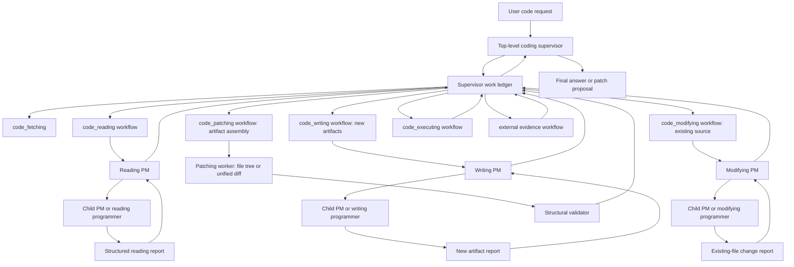
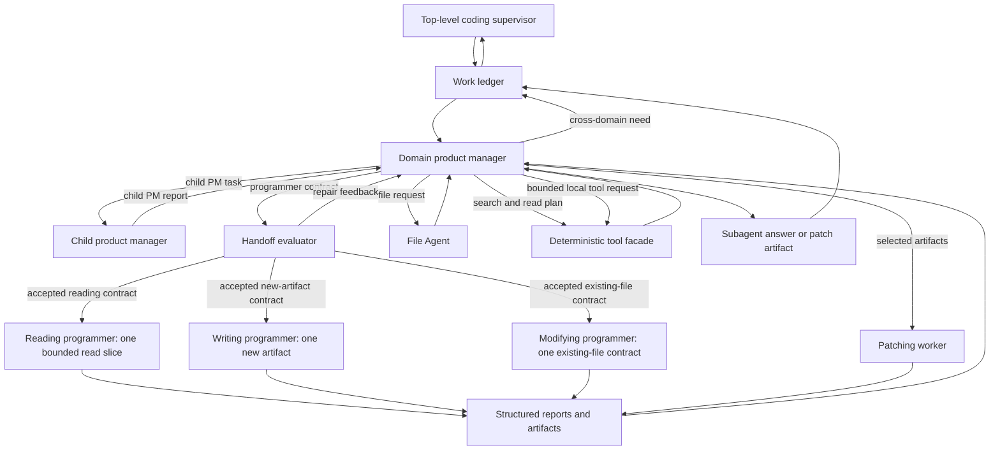
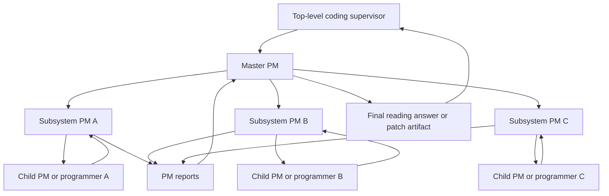
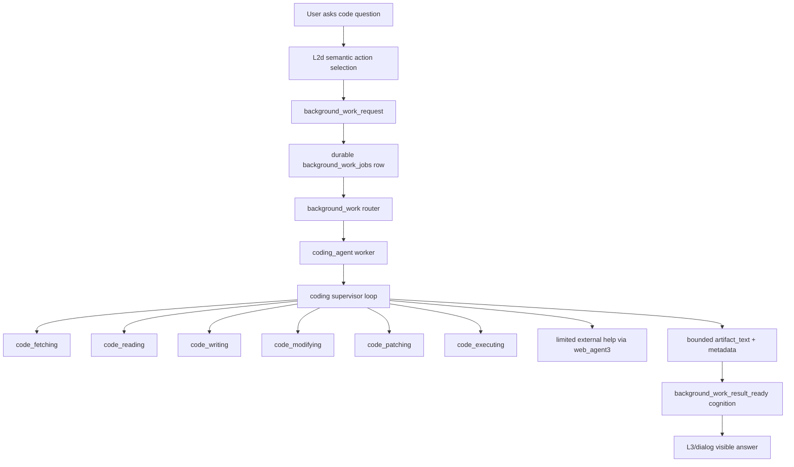

# Coding Agent Architecture

## Status

- Type: reference architecture and decision record
- Status: draft reference
- Related execution plans:
  - `development_plans/archive/completed/short_term/coding_agent_phase0_fetching_plan.md`
  - `development_plans/archive/completed/short_term/coding_agent_phase1_code_reading_final_plan.md`
  - `development_plans/active/short_term/coding_agent_phase2_code_writing_plan.md`
  - `development_plans/active/short_term/coding_agent_phase2_5_security_boundary_plan.md`
  - `development_plans/active/short_term/coding_agent_phase3_background_worker_integration_plan.md`
- Execution rule: use this document as reference context

This document captures the top-level architecture for replacing placeholder
code-related background work with a specialized `coding_agent`. The archived
completed Phase 0 plan records the implemented `code_fetching` contract; the
archived completed Phase 1 plan records the corrected `code_reading` and
direct answer interface on top of that fetching contract. The active Phase 2
in-progress plan defines the standalone new-artifact `code_writing` stage and
the patch artifact boundary it needs. The active Phase 2.5 draft plan defines
the agent-space security boundary before later runtime integration. The active
Phase 3 draft plan defines the separate background-worker integration stage.

## Problem

Kazusa needs to answer codebase questions through the normal L2d interface, for
example:

```text
[eamars/KazusaAIChatbot](https://github.com/eamars/KazusaAIChatbot) 项目是怎么实现读图的
```

The existing background-work text-artifact placeholder is intentionally
text-only. Repository fetching, `rg` search, file inspection, evidence-backed
code answers, patch proposal, and code-tool isolation belong in a specialized
worker. Coding work needs its own worker and subagent architecture behind the
durable background-work queue.

## Architectural Goal

`coding_agent` is a background-work worker that performs slow, tool-using code
tasks after the live persona turn. It returns a bounded artifact as
`background_work_result_ready`; L3/dialog remains the only visible wording
owner.

The agent must support these top-level coding capabilities:

- `code_fetching`: obtain or resolve repository code.
- `code_reading`: inspect code and answer repository/source questions.
- `code_writing`: create new files, modules, scripts, tests, docs, or small
  projects from a bounded request.
- `code_modifying`: plan semantic changes to existing source files from
  bounded source evidence.
- `code_patching`: materialize new-file artifacts and existing-file
  modifications into one patch or file-tree proposal.
- `code_executing`: run bounded sandbox execution or delegate to Docker when a
  local sandbox is unavailable.

The common architecture is a supervisor/resolver loop. The top-level
`coding_agent` supervisor owns the goal state, work ledger, context budget,
subagent sequencing, and final handoff. A single coding request can interleave
reading, new-code writing, existing-code modifying, external evidence, and
patching steps through the supervisor-owned work ledger.

## Architecture Decision: Local-LLM-First Context Partitioning

Status: accepted hard requirement.

`coding_agent` is designed for local or weaker OpenAI-compatible LLMs with a
bounded effective context window. Repository-scale comprehension is handled by
splitting the work into smaller semantic calls, each with a clear owner,
bounded evidence, and structured memory handoff.

The accepted architecture is explicit context partitioning:

- The top-level coding supervisor owns the global coding goal, resolver state,
  work ledger, subagent selection, bounded iteration, and final artifact
  handoff.
- The top-level coding supervisor owns cross-domain dispatch. It calls
  `code_fetching`, `code_reading`, `code_writing`, `code_modifying`,
  `code_patching`, `code_executing`, and external evidence in a bounded loop.
  Cross-domain needs return to the supervisor as structured outcomes.
- Each top-level subagent owns one domain of work and keeps its own bounded
  context memory for that domain.
- `code_reading`, `code_writing`, and `code_modifying` use a recursive
  product-manager/programmer structure for non-trivial tasks. A PM owns the
  semantic lifecycle of its direct children and chooses each direct child as
  either another PM or a programmer. A PM manages only direct children. A
  programmer receives one bounded contract and returns one report or artifact.
  PM implementation may be a single LLM call or an internal PM cluster later;
  the external PM boundary, responsibility, and input/output contract remain
  stable.
- `code_patching` runs after writing or modifying artifacts are selected. It
  owns edit mechanics: path targeting, anchor selection for existing files,
  full-file creation for new files, unified-diff or file-tree assembly, and
  edit-shape diagnostics.
- File mechanics are shared infrastructure. A File Agent validates repository
  inventory, repo-relative path safety, new-file reservation, permission
  checks, source-scope checks, current file context packaging, and path maps
  consumed by modifying PMs, evaluators, the Structural validator, and
  `code_patching`.
- Reading programmers, Writing programmers, and Modifying programmers return
  structured reports that become compressed memory: evidence references,
  interface facts, behavior summaries, uncertainty, and follow-up needs. A
  programmer receives one bounded contract and returns one artifact or report
  for that contract. The owning PM reasons over direct child reports and cited
  evidence. Full raw repository content stays in the private evidence store.
- Deterministic tooling owns repository discovery, path safety, file caps,
  search execution, patch validation, execution limits, and storage boundaries.
  LLM stages receive normalized, bounded evidence rows and task-specific
  semantic summaries.
- Coding-agent LLM use is route-configurable. The standalone coding agent uses
  `CODING_AGENT_PM_LLM` for PM decisions and final synthesis, and
  `CODING_AGENT_PROGRAMMER_LLM` for bounded Reading programmer, Writing
  programmer, Modifying programmer, and Patching worker calls. Final synthesis
  shares the PM route.

This requirement is mandatory for scalability. The coding agent must be able
to inspect projects whose relevant implementation exceeds one prompt.
The product-manager/programmer pattern is therefore a context and memory
ownership architecture.

### Agent-Space Security Boundary

Coding agents operate in agent space. They may produce structured tool-call
intents, proposed artifacts, traces, and review records. Tool calls target
approved agent-space capabilities and must not carry raw executable payloads.
Generated code, tests, commands, and scripts remain inert artifacts until a
separate real-world execution capability is approved. Real-world effects stay
outside agent authority unless a dedicated capability owns isolation,
permission, and audit.

### Supervisor-Mediated Agreement

Agreement recorded on 2026-06-21: for local LLM robustness, the coding agent
uses supervisor-mediated hierarchical orchestration with many small LLM calls.
Each LLM call receives balanced cognitive load. The supervisor keeps
coordination authority and the durable run ledger; PMs decompose within their
assigned layer; programmers perform bounded reading or implementation behind
PM-defined interfaces.

The accepted call graph is:



When a worker needs source understanding, public documentation, patch
materialization, or execution feedback, it returns that need to the top-level
supervisor. The supervisor records the transition in the work ledger, runs the
selected workflow, and resumes the pending work item with a compact evidence
summary. This keeps loop control and context memory at the top level while
each worker keeps semantic ownership inside its domain.

Validation is supervisor-mediated. The Structural validator returns patch or
file-tree diagnostics to the work ledger. The supervisor decides whether the
next step is more reading, new-code writing, existing-code modifying, patching,
execution, final synthesis, or terminal failure.

The internal worker shape is:



### Role Responsibility Matrix

| Role | Primary responsibility | Input contract | Output contract |
|---|---|---|---|
| Top-level coding supervisor | Global goal state, work ledger, cross-domain dispatch, context budget, repair sequencing, final artifact handoff. | User task, repository/source request, work ledger, prior subagent outcomes, validation outcomes. | Next workflow action, compact evidence-state summary, final public response. |
| PM role | Semantic lifecycle of one assigned work item, direct child choice, direct child instruction, information request, direct child report handling, repair, sufficiency decision, and compact report upward. | Assigned work item, available supervisor-approved facts, direct child reports, validation feedback, and context limits. | Information request, direct child task for a PM or programmer, repair instruction for a direct child, completion report, or blocked status. |
| Reading PM | Reading-domain PM instance for source-question decomposition, evidence slots, reading child tasks, and evidence-backed answer synthesis. | Repository summary, source scope, repo map summary, supervisor-approved facts, prior direct child reports. | Reading child tasks, information requests, sufficiency decision, evidence-backed source answer, or PM report upward. |
| Writing PM | Writing-domain PM instance for new-artifact lifecycle, dependency ordering, workspace-fact requests, child writing tasks, and selected artifact reports. | User goal or parent PM work item, new-artifact scope, supervisor-approved facts, validation summaries, direct child reports, File Agent feedback. | Child PM tasks, programmer tasks only when directly ready, workspace information requests, selected generated artifacts, patching input, sufficiency decision, or PM report upward. |
| Modifying PM | Modifying-domain PM instance for existing-source lifecycle, source-owner evidence needs, change dependency ordering, child modifying tasks, and selected modification reports. | User goal or parent PM work item, existing-source scope, reading evidence, current file context, supervisor-approved facts, validation summaries, direct child reports, File Agent feedback. | Child PM tasks, programmer tasks only when directly ready, workspace information requests, selected modification artifacts, patching input, sufficiency decision, or PM report upward. |
| File Agent | Repository file planning, new-file reservation, path-safety checks, current-context packaging, and owned/read-only path-map construction. | Supervisor work item, source scope, repository inventory, explicit placement data, PM file needs. | File plan with owned path map, read-only path map, current file context, file diagnostics, and repair feedback. |
| Handoff evaluator | Structural acceptance before programmer or patching dispatch. | One domain contract, prompt budget, role-boundary rules, path contract rules, assignment limits. | Accepted contract or compact repair feedback for the owning PM. |
| Reading programmer | Bounded local source reading behind one accepted reading assignment. | One reading assignment and selected source excerpts. | Structured evidence report with facts, evidence refs, uncertainty, and open questions. |
| Writing programmer | Implementation of one accepted new-artifact contract. | One new-file or new-module contract with purpose, imports, interfaces, and required behavior. | One code or text artifact plus local risks and open questions when requested. |
| Modifying programmer | Implementation of one accepted existing-file change contract. | One existing-file contract with current file context, source anchors, lifecycle owner, imports, interfaces, symbols to modify, and required behavior. | One replacement section, symbol body, or full-file change artifact plus local risks and open questions when requested. |
| Patching worker | Edit mechanics and artifact materialization. | Selected writing/modifying artifacts, owned path map, base file summaries, and artifact caps. | Unified diff or new-project file tree, edit diagnostics, file list, and patchability notes. |
| Structural validator | Structural validation, path safety, sandbox artifact checks, public-output safety. | Patch artifacts, source identity, workspace/session metadata, validation limits. | Validation summary, unsafe-path findings, artifact integrity result, public-safe metadata for supervisor repair or final handoff. |
| Synthesizer | Public explanation and handoff summary from completed artifacts. | PM decision, selected artifacts, validation summary, evidence refs, limitations. | Bounded answer text, public rationale, residual limitations, Phase 3 handoff fields. |

### Hierarchical PM And Programmer Contract

Product managers decide worker roles and boundaries through bounded
decomposition steps. Each PM receives the smallest contract needed for its own
decision and owns the semantic lifecycle of its direct children. A direct child
is either another PM or one programmer. The PM chooses the child type, issues
the direct child instruction, receives the direct child report, requests repair
when needed, requests supervisor-mediated information when workspace facts are
needed, and returns a structured memory artifact to its parent or to the
top-level supervisor.

For code reading, reading PM instances own evidence boundaries, source slices,
question slots, expected interface facts, proof obligations, direct reading
child tasks, and final answer synthesis at their assigned layer. Reading
programmers perform bounded inspection only when the owning PM has produced one
accepted reading contract.

For code writing, writing PM instances own new-artifact lifecycle,
dependency-aware child ordering, workspace-fact requests, direct writing child
tasks, direct child reports, final report reconciliation, and patching packet
selection at their assigned layer. The File Agent reserves new paths and
packages file management metadata. Writing programmers perform local work only
when their direct PM has produced one accepted new-artifact contract.

For code modifying, modifying PM instances own existing-source lifecycle,
source evidence needs, lifecycle ownership, source anchors, current file
context needs, direct modifying child tasks, direct child reports, final report
reconciliation, and patching packet selection at their assigned layer. The
File Agent validates existing paths and packages current file context.
Modifying programmers perform local work only when their direct PM has
produced one accepted existing-file change contract.

When prior generated work or existing source affects the next child
instruction, the owning PM requests workspace facts through the top-level
supervisor. The supervisor invokes the appropriate workflow, such as
`code_reading`, records the result in the work ledger, and resumes the PM with
compact evidence-backed facts. A dependent child instruction is grounded in
those facts rather than stale plan memory.

Deterministic evaluation accepts each handoff before the next worker layer
starts. For writing, evaluation checks new-artifact ownership,
file-to-file contracts, and prompt budget before programmer dispatch. For
modifying, evaluation checks source anchors, current file grounding, lifecycle
ownership, file-to-file contracts, and prompt budget before programmer
dispatch.

Deterministic validation also enforces the PM/programmer boundary before a PM
may use Reading programmer, Writing programmer, or Modifying programmer output.
For reading,
validation checks that reports cite files inside the assigned read scope and
include required evidence references.
For patching, validation checks artifact shape, patch materialization, patch
applyability in an isolated sandbox where applicable, and touched Python test
coherence when proposed tests are part of the patch.

For reading, the PM consumes a compact `PMInput`:

```python
{
    "question": str,
    "repository_summary": dict,
    "source_scope": dict,
    "repo_map_summary": dict,
    "previous_reports": list[dict],
}
```

The PM returns a `PMDecision`:

```python
{
    "status": "need_programmers | sufficient | needs_user_input | overloaded",
    "intent": str,
    "required_slots": list[str],
    "assignments": list[dict],
    "missing_slots": list[str],
}
```

Each Reading programmer assignment must define one bounded mission and one
read scope:

```python
{
    "assignment_id": str,
    "role": str,
    "scope": {
        "kind": "file | directory | symbol | search",
        "values": list[str],
    },
    "owned_paths": list[str],
    "read_only_paths": list[str],
    "interface_contract": {
        "component": str,
        "inputs": list[str],
        "outputs": list[str],
        "callers": list[str],
        "invariants": list[str],
    },
    "evidence_contract": {
        "required_facts": list[str],
        "required_evidence_refs": list[str],
    },
    "must_not_touch": list[str],
    "work_instructions": list[str],
    "required_slots": list[str],
}
```

For reading assignments, `owned_paths` is empty, `scope.values` defines the
only allowed read slice, and `evidence_contract` defines the required proof
shape. Writing and modifying use separate contracts: writing contracts create
new artifacts, modifying contracts change existing source, and patching
materializes selected artifacts from either domain.

The PM chooses assignment boundaries from four signals:

- the user question intent, such as feature flow, symbol explanation, API
  contract, persistence path, tests, dependency usage, or impact read;
- the deterministic repository map, including file tree, package names, docs,
  imports, and symbol search results;
- the required slots needed to answer or patch safely;
- the local-LLM context budget, so each Reading programmer receives a small enough
  slice to read deeply.

For a data/pipeline question, a correct reading PM may create bounded
assignments such as:

- `ingress reader`: inspect only files where the input enters the system;
- `processing reader`: inspect only files that transform or enrich the input;
- `projection reader`: inspect only files that pass the transformed data to a
  downstream consumer;
- `test reader`: inspect only tests that prove or constrain the behavior.

### Concrete Role Allocation Examples

These examples are part of the architecture contract. They show how the PM
splits real Kazusa work while staying in the coordinator role.

For a reading question such as "how does Kazusa respond to an image?":

- PM contract: answer the image-response flow from source evidence, with
  separate facts for ingress, media description, cognition handoff, and final
  response surface.
- Programmer A, `image ingress reader`: read only adapter, service, and message
  envelope files that accept image or attachment inputs; return evidence for
  the typed fields handed to the brain.
- Programmer B, `media descriptor reader`: read only media descriptor and
  image-description code; return evidence for how image content becomes text or
  structured evidence.
- Programmer C, `cognition handoff reader`: read only cognition/RAG/dialog
  handoff files that consume media evidence; return evidence for where the
  character response is decided.
- PM output: synthesize the answer only from A/B/C reports and cite their
  evidence. Additional flow steps require additional Reading programmer
  evidence.

For a Phase 2 new-project writing task:

- Supervisor work ledger: create a new standalone tool with source files,
  tests, docs, and packaging metadata.
- Writing PM contract: split the requested tool into new artifact work items,
  name provided interfaces, consumed interfaces, imports, and observable
  behavior for each artifact.
- Writing programmer A: implement one accepted source-file contract.
- Writing programmer B: implement one accepted focused-test contract.
- Writing programmer C: implement one accepted documentation or config
  contract.
- Patching worker input: selected generated artifacts plus File Agent path
  reservations.

For a later mixed repository change:

- Supervisor work ledger: read the existing source, create a new helper module,
  modify an existing service file, add tests, and assemble one patch proposal.
- Reading workflow: return source evidence for the service lifecycle and
  current import boundaries.
- Writing workflow: create the new helper module and focused tests as new
  artifacts.
- Modifying workflow: change the existing service file using the reading
  evidence and declared lifecycle owner.
- Patching workflow: assemble the new files and existing-file modification
  into one patch proposal.

Each programmer returns a structured report. The report is the memory boundary
between local reading and PM synthesis:

```python
{
    "assignment_id": str,
    "status": "succeeded | blocked | no_evidence",
    "files_read": list[str],
    "facts": list[{
        "kind": str,
        "summary": str,
        "evidence_refs": list[str],
    }],
    "evidence": list[dict],
    "open_questions": list[str],
}
```

The PM may ask deterministic tools for more repository-map information, launch
additional programmer assignments, ask a narrow follow-up assignment, finish,
or ask for user clarification. Final answers, selected patch artifacts, and
implementation requests are grounded in available facts. Missing facts become
limitations or follow-up work.

Phase 1 supervisor limits cap one PM at three Reading programmers per wave,
two waves, and six Reading programmer reports total. Larger or conflicting requests set an
overload status instead of forcing one PM to pretend it read a whole project.

### Master PM Escalation

For larger projects, `code_reading`, `code_writing`, and `code_modifying` may
use a master PM above subsystem PMs:



Master PM is an escalation mechanism for work whose subsystem map, required
facts, and report set exceed one PM's context budget. The master PM manages
subsystem PMs as direct children. Subsystem PMs manage their own direct
children. Triggers include:

- broad repository or multi-package architecture questions;
- cross-runtime or cross-service feature flows;
- questions requiring several independent ownership domains;
- a PM work plan whose estimated programmer reports would exceed the PM
  context budget;
- conflicting programmer reports that require subsystem-level reconciliation.

Subsystem PMs return `PMReport` objects to the master PM. The master PM sees
subsystem PM reports and selected evidence references by default.

### Shared PM And Programmer Model

`code_reading`, `code_writing`, and `code_modifying` share the PM/programmer
hierarchy. Reading programmers report code behavior and interfaces. Writing
programmers report bounded new-artifact content, tests/docs content when
assigned, and local risks. Modifying programmers report bounded existing-source
change content and local risks. `code_patching` converts supervisor-selected
writing and modifying artifacts into patch artifacts. Across these domains:

- PM layers own direct-child lifecycle, interface consistency, decomposition,
  evidence sufficiency, report reconciliation, and artifact selection at their
  assigned layer;
- PM work is creating direct child instructions, deciding child type, requesting
  supervisor-mediated information, handling direct child reports, issuing
  repairs, and reporting upward. Reading programmer, Writing programmer, and
  Modifying programmer reports supply source facts, implementation code, file
  contents, and test bodies to their direct PM;
- Reading programmers, Writing programmers, and Modifying programmers own
  bounded local inspection or code, test, and documentation
  implementation behind PM-defined contracts;
- The Patching worker role owns unified diff and file-tree materialization
  from selected writing and modifying output;
- deterministic tools own path safety, search, file caps, patch validation,
  execution limits, and output normalization;
- reports are the durable memory artifacts passed upward;
- final visible answers and selected patch artifacts are assembled only by the
  PM or master PM and then returned to the top-level coding supervisor.

## Runtime Placement

The diagram below is the long-term Kazusa integration target after the
standalone coding-agent core exists. Phases 0, 1, and 2 implement only direct
module paths shown after the diagram.



L2d contributes the semantic decision that background code work is useful by
selecting the private `background_work_request` capability. Deterministic
action-spec code materializes the trusted task brief and delivery scope. The
background-work router selects `coding_agent` after the live turn.

The Phase 0 standalone path is:

```text
CodeFetchingRequest
  -> code_fetching.run
  -> CodeFetchingResult
```

The Phase 1 standalone path is:

```text
CodingAgentRequest
  -> coding_agent.answer_code_question
  -> coding supervisor loop
  -> code_fetching.run from Phase 0
  -> code_reading.run
  -> CodingAgentResponse
```

Phase 0 and Phase 1 tests call these public interfaces directly. Later
integration phases cover L2d, background-work jobs, router integration,
result-ready cognition, service delivery, and placeholder removal.

Phase 1 direct responses expose only a public-safe repository summary and
repo-relative evidence. Raw checkout roots, workspace roots, cache keys,
subprocess traces, job ids, leases, and adapter delivery fields remain private
implementation data.

The Phase 2 standalone path is:

```text
CodingAgentWriteRequest
  -> coding_agent.propose_code_change
  -> coding supervisor loop
  -> code_fetching.run from Phase 0, when a repository target is present
  -> code_writing.run
  -> if needed: supervisor runs code_reading or external evidence, then resumes code_writing.run
  -> code_patching materializes new-file artifacts
  -> Structural validator checks patch or file-tree artifacts
  -> CodingPatchProposalResponse
```

Phase 2 proves new-artifact writing first. The top-level supervisor may fetch a
repository target to establish source identity and workspace safety, but
existing-source semantic edits are owned by the later `code_modifying`
capability. External evidence for code writing follows the same
supervisor-mediated rule: the writing PM may request current public
documentation or other bounded facts, and the supervisor resumes writing with a
compact evidence summary.

Focused Phase 2 unit tests may call `code_writing.run(...)` to prove the
writing subagent contract. Deterministic acceptance tests and every hard live
LLM gate must call the public top-level `coding_agent.propose_code_change(...)`
interface so the coding supervisor owns fetch/write/patch/external dispatch and
the work ledger. Phase 2 test scope remains the direct coding-agent path; L2d,
background-work jobs, result-ready cognition, service delivery, existing-source
modification, patch apply, and code execution belong to later phases.

## Ownership Boundaries

| Layer | Owns | Coordinates With |
|---|---|---|
| L2d | Semantic decision that background work is useful. | Action spec for trusted task materialization. |
| Action spec | Validation, trusted target binding, queue request materialization. | Background-work router for worker selection after the live turn. |
| Background-work router | Route-only worker choice. | `coding_agent` worker for code-task execution. |
| `coding_agent` supervisor | Coding goal state, cross-domain subagent selection, bounded iteration, global context ledger, final artifact. | Code subagents, deterministic tool facade, external evidence workflow, and Phase 3 result mapping. |
| Code subagents | Domain-specific low-level planning and tool use behind the supervisor-selected domain. | Supervisor-managed evidence, assignments, and result handoff. |
| Deterministic tool facade | Path safety, command allowlists, size caps, timeouts, filesystem mutation controls. | LLM stages through normalized evidence rows and validation summaries. |
| L3/dialog | Final visible wording from result-ready cognition. | Background-work result-ready cognition. |

## Top-Level Supervisor Contract

The supervisor receives one coding job:

```python
{
    "task_brief": str,
    "source_summary": str,
    "max_output_chars": int,
}
```

It maintains bounded state:

```python
{
    "goal": str,
    "repo": dict | None,
    "evidence": list[dict],
    "open_questions": list[str],
    "patches": list[dict],
    "execution_results": list[dict],
    "cycle_count": int,
}
```

Its next-action output is always one of:

```python
{
    "action": "code_fetching | code_reading | code_writing | code_modifying | code_patching | code_executing | finish | fail",
    "instruction": "short instruction for the selected subagent",
    "reason": "short reason for the next step"
}
```

Deterministic code validates allowed transitions. Phase 0 has no top-level
supervisor and exposes only `code_fetching.run`. Phase 1 allows
`code_fetching`, `code_reading`, `finish`, and `fail`. Phase 2 adds
`code_writing`, `code_patching`, and patch-proposal finish states for new
artifacts. Phase 2 PM work still follows the recursive PM lifecycle: a writing
PM may create a child PM or a programmer as its direct child, and dependent
child instructions must be grounded in supervisor-approved workspace facts.
Existing-source modification, patch application, and project command execution
belong to later phases.

## Phase 3 Runtime Integration Boundary

Phase 3 must register the worker as `coding_agent` and map standalone
coding-agent responses from Phases 1 and 2 into the existing
`BackgroundWorkResult` contract. The worker description should identify
repository/codebase reading and patch-proposal work with bounded local source
evidence. Patch apply, execution, package installation, and arbitrary shell
access belong to separate approved phases.

The handoff artifact is:

- `artifact_text`: capped answer text;
- `result_summary`: short repository, commit, status, and evidence-count
  summary;
- `failure_summary`: most specific failure or limitation on non-success;
- `worker_metadata`: sanitized repository summary, source scope,
  repo-relative evidence references, and limitations.

Phase 3 provides the coding workspace root from configuration. User text,
public artifacts, and worker metadata stay on public-safe repository summaries,
repo-relative evidence references, and bounded result fields.

Phase 3 reuses the standalone coding-agent split LLM route resolution. The
worker environment supplies the configured workspace and route settings.

## Subagent Contracts

### `code_fetching`

Purpose: resolve the code workspace for a task.

Responsibilities:

- Publish `code_fetching/README.md` as the upstream ICD.
- Extract public repository URLs from the task.
- Resolve source scope as `repository`, `directory`, or `file`.
- Support public GitHub repository, `.git`, tree, blob, raw file, markdown-link,
  shorthand `owner/repo`, explicit local checkout, and explicit local path
  inputs.
- Prefer an existing matching local checkout.
- Clone public HTTPS GitHub repositories into a managed coding workspace when
  no local checkout is available.
- Identify the resolved commit, branch, root path, and whether the checkout is
  managed by the coding workspace.
- Validate that parsed GitHub `tree`, `blob`, and raw-file scopes exist in the
  resolved checkout before handing them to reading.
- Return public-safe local source labels for local checkout scopes while
  keeping `repository.local_root` as the internal read root.
- Refuse private URLs, SSH URLs, raw filesystem paths outside the managed
  workspace, and ambiguous repository targets.
- Store managed clones under:
  `<workspace_root>/repos/github/<owner>/<repo>/refs/<ref_key>/checkout`.
- Protect managed paths with matching `metadata.json` before reuse.
- Store lock files and temporary clone directories under the same configured
  workspace root.
- Return explicit unsupported outcomes for GitHub issues, pull requests,
  discussions, release archives, SSH URLs, private/auth URLs, non-GitHub
  providers, package registry names, Gists, paste URLs, and generic raw HTTP
  sources.

Future responsibilities:

- `git pull` and `git checkout` only for managed clean clones.
- Version pinning and branch/tag resolution.
- Download archive support for non-git public code packages.
- Optional LLM source disambiguation after deterministic fetching exposes a
  concrete semantic ambiguity that requires semantic resolution.

### `code_reading`

Purpose: inspect code and answer codebase questions with file evidence.

Responsibilities:

- Publish `code_reading/README.md` as the upstream ICD.
- Consume only a successful `CodeRepositoryRef` and `CodeSourceScope` passed by
  the top-level supervisor.
- Use a product-manager/programmer structure for non-trivial reading tasks.
- The reading product manager owns question decomposition, architecture and
  interface mapping, evidence sufficiency checks, and final answer synthesis
  back to the top-level supervisor.
- Reading programmers own bounded local inspection of selected files,
  symbols, directories, or call chains and return structured reports with
  repo-relative evidence references, interface facts, behavior summaries,
  uncertainty, and suggested follow-up reads.
- Keep product-manager context limited to the user goal, repository summary,
  reading plan, structured Reading programmer reports, and selected evidence
  rows.
  Full repositories, unbounded search output, and raw source files stay in the
  private evidence store.
- Build a small reading plan from the task and repository metadata.
- Use deterministic tools such as `rg --files`, `rg -n --json`, and bounded
  file reads.
- Keep raw file content out of prompts unless selected and capped.
- Return an evidence-backed answer in the user's language when possible.
- Preserve uncertainty when evidence is incomplete.

The reading answer must distinguish:

- authored user question text;
- code evidence;
- inferred architectural explanation;
- limitations or missing proof.

### `code_writing`

Purpose: create new files, modules, scripts, tests, docs, or small projects
from a bounded request.

Responsibilities:

- Use the same recursive product-manager/programmer context partitioning
  principle as `code_reading`.
- Writing PM instances own the semantic lifecycle of their direct children:
  child PM or programmer choice, direct child instructions, information
  requests, report handling, repair, sufficiency decisions, and compact reports
  upward.
- A writing PM sends a programmer task only when the PM can produce one
  complete bounded new-artifact contract from supervisor-approved facts.
- When prior generated artifacts affect later artifacts, the writing PM
  requests supervisor-mediated `code_reading` before issuing the dependent
  child instruction.
- The File Agent reserves new paths and validates file mechanics before
  programmer dispatch.
- Writing programmers own bounded implementation content for one accepted
  new-artifact contract and report local risks.
- Handoff evaluation runs before programmer dispatch so file ownership,
  interface contracts, prompt budget, and programmer boundaries are accepted
  before worker calls.
- Return generated artifacts and rationale to the supervisor work ledger.
- Workspace mutation belongs to a separately approved apply step.

### `code_modifying`

Purpose: plan and produce semantic changes to existing source files from
bounded source evidence.

Responsibilities:

- Use Phase 0 fetching and Phase 1 reading evidence supplied by the top-level
  supervisor.
- The modifying PM owns existing-file change decomposition, source-owner
  evidence mapping, lifecycle ownership, consumed interfaces, source anchors,
  and final modification artifact selection.
- The File Agent validates accepted paths, packages current file context, and
  builds owned/read-only path maps before programmer dispatch.
- Modifying programmers own bounded implementation content for one accepted
  existing-file change contract.
- Return modification artifacts and rationale to the supervisor work ledger.

### `code_patching`

Purpose: materialize selected generated artifacts and selected existing-file
modifications into one patch or file-tree proposal.

Responsibilities:

- Consume supervisor-selected artifacts from `code_writing` and
  `code_modifying`.
- Own path targeting, insertion anchors, full-file creation, unified-diff or
  file-tree assembly, edit diagnostics, and artifact caps.
- Run deterministic structural validation with sandbox apply checks where
  applicable.
- Return patch artifacts, changed/created file summaries, validation results,
  and patchability notes.

### `code_executing`

Purpose: run bounded execution to verify or inspect code.

Responsibilities:

- Run commands only through an allowlisted sandbox execution facade.
- Default to no file access.
- Use Docker or another isolated runner when local sandbox isolation is not
  available.
- Return stdout, stderr, exit code, timeout status, and a bounded summary.

Fetching, reading, and patch proposal are higher priority because ordinary
code questions are answered through source evidence and synthesis.

## Tool Facade

The coding subsystem should use proven tools rather than custom parsers where
the standard tool is stronger.

Tool candidates for Phases 0 and 1:

- `git remote -v`, `git rev-parse`, `git status --porcelain`, `git clone`
  through a deterministic subprocess facade.
- `rg --files` for file discovery.
- `rg -n --json` for text search.
- Bounded direct file reads with extension and size filters.
- A path safety helper that verifies every read stays inside the resolved repo
  root and refuses `.env`, secret-like files, `.git` internals, and binary
  payloads.

Future tool candidates:

- `git diff`, `git apply --check`, and `git apply --reverse --check`.
- Patch sandbox apply.
- Bounded test/command execution.
- Docker-backed execution.

Tool output must be normalized before it enters an LLM prompt. The model should
see short evidence rows. Raw command output and unbounded source files stay in
the private evidence store.

## Limited External Help

`coding_agent` may ask for limited external help through `web_agent3` when the
task requires public documentation, current external facts, or repository pages
available online.

External help returns bounded evidence summaries. Local repository evidence is
the primary source for checked-out implementation behavior. Web evidence is a
supporting source for public documentation, current facts, repository pages, or
cases where code fetching needs a public page observation.

## Safety Ownership

- Coding work runs after the live response path through durable background
  work.
- Workers return artifacts through the background-work result path, and
  L3/dialog owns visible wording.
- Deterministic code owns filesystem safety, command allowlists, timeouts,
  output caps, and persistence boundaries.
- LLM stages own semantic planning and answer synthesis.
- Phase 0 owns source fetching and storage. Phase 1 consumes Phase 0 output.
- Phase 1 owns source reading after repository fetching.
- Managed clones live under a dedicated coding-agent workspace. Existing local
  checkouts can serve as read sources for matching repository questions.
- Phase 1 and Phase 2 public artifacts plus Phase 3 worker metadata expose
  sanitized repository summaries and repo-relative evidence references.
  Absolute `local_root`, configured `workspace_root`, and storage `cache_key`
  values remain internal job metadata.
- Raw repository files and tool traces remain private job evidence. The
  result-ready cognition episode receives a bounded artifact and prompt-safe
  metadata.

## Phase Roadmap

| Phase | Scope | User-Visible Capability |
|---|---|---|
| Phase 0 | Standalone `code_fetching` package, README ICD, deterministic source-scope routing, managed storage, direct fetching tests, unsupported-input tests, and 10-source public internet smoke. | Direct callers can resolve supported repo/file/tree/raw/local sources into a safe local source contract or receive explicit unsupported/clarification results. |
| Phase 1 | Standalone `code_reading` package, README ICD, top-level direct answer interface, supervisor over Phase 0 output and reading. | Direct callers can answer repository/codebase questions with cited local file evidence. |
| Phase 2 | Standalone `code_writing` for new artifacts plus the `code_patching` boundary needed to materialize new-file proposals, with README ICD, PM/programmer new-artifact architecture, deterministic artifact validation, and direct tests. | Direct callers can request new scripts, files, docs, tests, or small projects as bounded artifacts with real-workspace immutability. |
| Phase 2.5 | Agent-space security boundary enforcement for coding-agent validation, generated artifacts, and tool-call mediation. | Coding-agent proposals remain inspectable artifacts until an approved real-world capability handles execution or mutation. |
| Phase 3 | Background-worker integration, L2d/action-spec affordance update, result-ready delivery, placeholder removal, and standalone coding-agent response to `BackgroundWorkResult` mapping for `WORKER="coding_agent"`. | Kazusa can route implemented standalone coding-agent work through the normal background-work path. |
| Phase 4 | `code_modifying` for existing-source changes, supervisor interleaving between reading, writing, modifying, and patching, and direct hard gates for mixed new-file plus existing-file work. | Direct callers can request bounded existing-repository changes as patch proposals. |
| Phase 5 | Patch apply flow with explicit approval and workspace safety. | Apply approved patches in a controlled sandbox or approved workspace. |
| Phase 6 | `code_executing` sandbox/Docker execution. | Run bounded verification commands and include results. |
| Phase 7 | Broader repository operations and richer external help. | Handle multi-repo comparisons, docs lookups, and current dependency evidence. |

## Real Demand Mapping

For a concrete user question such as "how does this project implement image
reading?", the intended Phase 0 flow is:

```text
test builds CodeFetchingRequest
-> code_fetching.run
-> resolves eamars/KazusaAIChatbot to local checkout or managed clone
-> returns CodeFetchingResult with repository source scope
```

The intended Phase 1 flow is evidence-driven generic code reading:

```text
test builds CodingAgentRequest
-> coding_agent.answer_code_question
-> code_fetching.run returns Phase 0 CodeFetchingResult
-> code_reading PM classifies the question as a data/pipeline reading task
-> PM assigns bounded Reading programmers for ingress, processing, projection,
   persistence, tests, or docs only when repository-map evidence indicates
   those domains exist
-> Reading programmer reports discover concrete identifiers from source evidence
-> PM synthesizes the answer from reports and cited repo-relative evidence
```

Concrete identifiers, module names, call names, constants, and data-shape names
come from Reading programmer evidence. The reading PM, planner, and synthesizer use
generic reading slots and evidence-grounded vocabulary.

## Scope Statement

- This document is a reference architecture and decision record.
- `coding_agent` is a specialized code-task worker behind the normal
  background-work path.
- Shell execution, package installation, repository mutation, database
  mutation, adapter delivery, and final user-visible wording each belong to
  their explicitly approved phase or existing owner.
- RAG2, `web_agent3`, cognition resolver, L2d, L3, dialog, consolidation, and
  dispatcher ownership remain separate from `coding_agent`.
