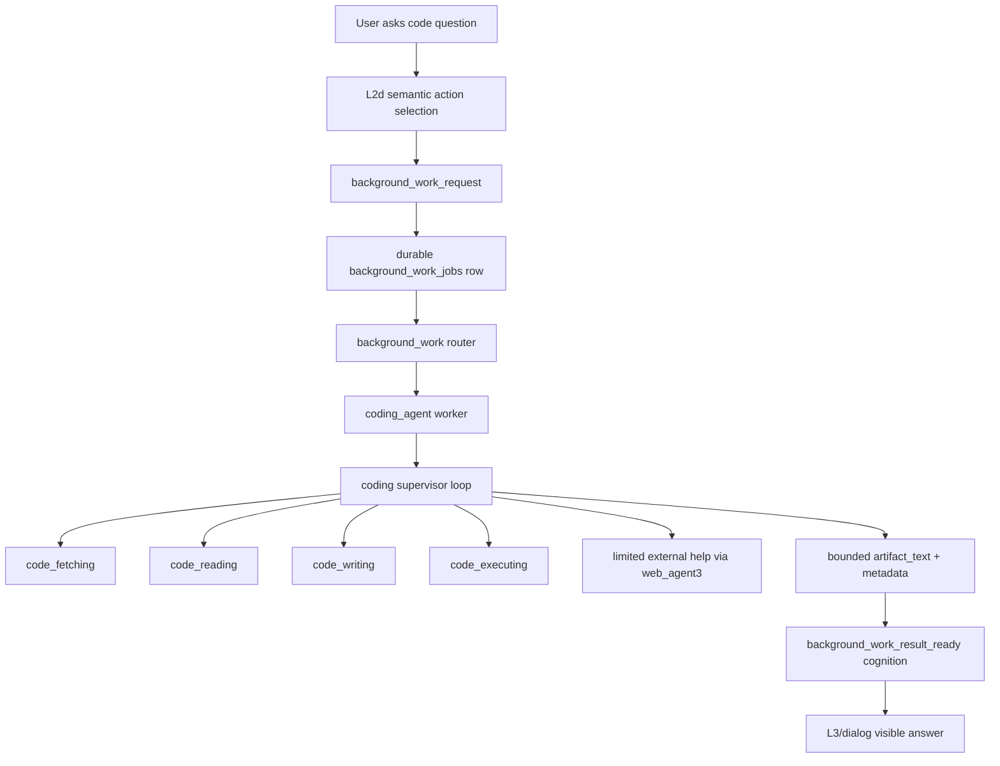

# Coding Agent Architecture

## Status

- Type: reference architecture and decision record
- Status: draft reference
- Related execution plan:
  `development_plans/active/short_term/coding_agent_phase1_fetching_reading_plan.md`
- Execution rule: do not execute directly from this document

This document captures the top-level architecture for replacing placeholder
code-related background work with a specialized `coding_agent`. The active
Phase 1 plan contains the executable scope for `code_fetching`, `code_reading`,
and the top-level supervisor.

## Problem

Kazusa needs to answer codebase questions through the normal L2d interface, for
example:

```text
[eamars/KazusaAIChatbot](https://github.com/eamars/KazusaAIChatbot) 项目是怎么实现读图的
```

The existing background-work text-artifact placeholder is intentionally
text-only. It cannot read repositories, use `rg`, inspect files, fetch public
code, produce evidence-backed code answers, propose patches, or safely separate
code tooling from final dialog. Expanding that placeholder would violate the
current background-work ICD. Coding work needs its own worker and subagent
architecture behind the durable background-work queue.

## Architectural Goal

`coding_agent` is a background-work worker that performs slow, tool-using code
tasks after the live persona turn. It returns a bounded artifact as
`background_work_result_ready`; L3/dialog remains the only visible wording
owner.

The agent must support four top-level sub-subagents:

- `code_fetching`: obtain or resolve repository code.
- `code_reading`: inspect code and answer repository/source questions.
- `code_writing`: propose and validate patches, patch-first.
- `code_executing`: run bounded sandbox execution or delegate to Docker when a
  local sandbox is unavailable.

The common architecture is a supervisor/resolver loop. The top-level
`coding_agent` supervisor owns the goal state, chooses the next subagent, and
evaluates whether the returned evidence is enough to finish or whether another
bounded step is required.

## Runtime Placement

The diagram below is the long-term Kazusa integration target after the
standalone coding-agent core exists. Phase 1 implements only the direct
`coding_agent` module path shown after the diagram.



L2d does not choose a worker, file path, repository path, tool argument, shell
command, patch, or final answer. It can only select the private
`background_work_request` capability. Deterministic action-spec code
materializes the trusted task brief and delivery scope. The background-work
router selects `coding_agent` after the live turn.

The Phase 1 standalone path is:

```text
CodingAgentRequest
  -> coding_agent.answer_code_question
  -> coding supervisor loop
  -> code_fetching
  -> code_reading
  -> CodingAgentResponse
```

Phase 1 tests call this public interface directly. They do not use L2d,
background-work jobs, router integration, result-ready cognition, service
delivery, or placeholder removal.

## Ownership Boundaries

| Layer | Owns | Must Not Own |
|---|---|---|
| L2d | Semantic decision that background work is needed. | Worker names, repo paths, tool arguments, patch content, shell commands, final text. |
| Action spec | Validation, trusted target binding, queue request materialization. | Coding decisions or repository inspection. |
| Background-work router | Route-only worker choice. | Worker-local task classification, code search terms, repository paths, patches, execution. |
| `coding_agent` supervisor | Coding goal state, subagent selection, bounded iteration, final artifact. | Adapter delivery, persistence outside the job result contract, user-visible dialog. |
| Code subagents | Domain-specific low-level planning and tool use. | Character stance, L2d action choice, adapter send. |
| Deterministic tool facade | Path safety, command allowlists, size caps, timeouts, filesystem mutation controls. | Semantic interpretation of code. |
| L3/dialog | Final visible wording from result-ready cognition. | Running tools or changing code. |

## Top-Level Supervisor Contract

The supervisor receives one coding job:

```python
{
    "task_brief": str,
    "source_summary": str,
    "max_output_chars": int,
}
```

It maintains bounded state:

```python
{
    "goal": str,
    "repo": dict | None,
    "evidence": list[dict],
    "open_questions": list[str],
    "patches": list[dict],
    "execution_results": list[dict],
    "cycle_count": int,
}
```

Its next-action output is always one of:

```python
{
    "action": "code_fetching | code_reading | code_writing | code_executing | finish | fail",
    "instruction": "short instruction for the selected subagent",
    "reason": "short reason for the next step"
}
```

Deterministic code validates allowed transitions. Phase 1 allows only
`code_fetching`, `code_reading`, `finish`, and `fail`.

## Subagent Contracts

### `code_fetching`

Purpose: resolve the code workspace for a task.

Responsibilities:

- Extract public repository URLs from the task.
- Prefer an existing matching local checkout.
- Clone public HTTPS GitHub repositories into a managed coding workspace when
  no local checkout is available.
- Identify the resolved commit, branch, root path, and whether the checkout is
  managed by the coding workspace.
- Refuse private URLs, SSH URLs, raw filesystem paths outside the managed
  workspace, and ambiguous repository targets.

Future responsibilities:

- `git pull` and `git checkout` only for managed clean clones.
- Version pinning and branch/tag resolution.
- Download archive support for non-git public code packages.

### `code_reading`

Purpose: inspect code and answer codebase questions with file evidence.

Responsibilities:

- Build a small reading plan from the task and repository metadata.
- Use deterministic tools such as `rg --files`, `rg -n --json`, and bounded
  file reads.
- Keep raw file content out of prompts unless selected and capped.
- Return an evidence-backed answer in the user's language when possible.
- Preserve uncertainty when evidence is incomplete.

The reading answer must distinguish:

- authored user question text;
- code evidence;
- inferred architectural explanation;
- limitations or missing proof.

### `code_writing`

Purpose: propose code changes. This subagent is patch-first.

Responsibilities:

- Read the current workspace and propose a unified diff.
- Run deterministic patch validation such as `git apply --check` in a sandbox.
- Return patch artifacts and rationale.
- Avoid mutating the real workspace unless a later approved plan explicitly
  adds an apply step.

### `code_executing`

Purpose: run bounded execution to verify or inspect code.

Responsibilities:

- Run commands only through an allowlisted sandbox execution facade.
- Default to no file access.
- Use Docker or another isolated runner when local sandbox isolation is not
  available.
- Return stdout, stderr, exit code, timeout status, and a bounded summary.

This is lower priority than fetching, reading, and patch proposal because
ordinary code questions should not require execution.

## Tool Facade

The coding subsystem should use proven tools rather than custom parsers where
the standard tool is stronger.

Phase 1 tool candidates:

- `git remote -v`, `git rev-parse`, `git status --porcelain`, `git clone`
  through a deterministic subprocess facade.
- `rg --files` for file discovery.
- `rg -n --json` for text search.
- Bounded direct file reads with extension and size filters.
- A path safety helper that verifies every read stays inside the resolved repo
  root and refuses `.env`, secret-like files, `.git` internals, and binary
  payloads.

Future tool candidates:

- `git diff`, `git apply --check`, and `git apply --reverse --check`.
- Patch sandbox apply.
- Bounded test/command execution.
- Docker-backed execution.

Tool output must be normalized before it enters an LLM prompt. The model should
see short evidence rows, not raw command output or unbounded source files.

## Limited External Help

`coding_agent` may ask for limited external help through `web_agent3` when the
task requires public documentation, current external facts, or repository pages
that are not available locally.

Rules:

- External help returns evidence only, not final dialog or patch instructions.
- Do not send whole source files to `web_agent3`.
- Prefer local repo evidence for source-code questions.
- Use `web_agent3` only when repo evidence is missing, external docs are
  explicitly needed, or code fetching cannot obtain the repository.
- Treat web evidence as lower authority than local source for implementation
  questions about the checked-out code.

## Safety Rules

- Coding work runs after the live response path through durable background
  work.
- Workers never send adapter text directly and never call cognition directly.
- Deterministic code owns filesystem safety, command allowlists, timeouts,
  output caps, and persistence boundaries.
- LLM stages own semantic planning and answer synthesis only.
- Phase 1 is read-only after repository fetching. It does not write files,
  apply patches, install packages, or run arbitrary shell commands.
- Managed clones live under a dedicated coding-agent workspace. The active
  project checkout may be read for matching repository questions, but it must
  not be pulled, checked out, or mutated by `code_fetching`.
- Raw repository files and tool traces remain private job evidence. The
  result-ready cognition episode receives only a bounded artifact and
  prompt-safe metadata.

## Phase Roadmap

| Phase | Scope | User-Visible Capability |
|---|---|---|
| Phase 1 | Standalone top-level module, README ICD, `code_fetching`, `code_reading`, supervisor, direct public-interface tests. | Direct callers can answer repository/codebase questions with cited local file evidence. |
| Phase 2 | Background-worker integration, L2d/action-spec affordance update, result-ready delivery, placeholder removal. | Kazusa can route repository/codebase questions through the normal background-work path. |
| Phase 3 | `code_writing`, patch proposal, patch validation in sandbox. | Propose patches first without mutating the real workspace. |
| Phase 4 | Patch apply flow with explicit approval and workspace safety. | Apply approved patches in a controlled sandbox or approved workspace. |
| Phase 5 | `code_executing` sandbox/Docker execution. | Run bounded verification commands and include results. |
| Phase 6 | Broader repository operations and richer external help. | Handle multi-repo comparisons, docs lookups, and current dependency evidence. |

## Real Demand Mapping

For the image-reading question, the intended Phase 1 flow is:

```text
test builds CodingAgentRequest
-> coding_agent.answer_code_question
-> code_fetching resolves eamars/KazusaAIChatbot to local checkout
-> code_reading searches for image, vision, attachment, multimedia,
   VISION_DESCRIPTOR_LLM, user_multimedia_input, image_observation
-> code_reading reads the relevant source and tests
-> supervisor returns a Chinese CodingAgentResponse explaining the pipeline
```

The expected answer should explain that Kazusa implements image reading by
normalizing image attachments, generating a structured description through
`VISION_DESCRIPTOR_LLM`, caching and persisting the description, projecting
`image_observation` into the cognitive episode, and keeping raw image bytes out
of normal cognition prompts.

## Non-Goals

- This document does not approve implementation.
- This document does not define a generic assistant shell.
- This document does not authorize arbitrary shell, package installation,
  repository mutation, database mutation, adapter delivery, or direct final
  user messaging from a worker.
- This document does not replace RAG2, `web_agent3`, cognition resolver, L2d,
  L3, dialog, consolidation, or dispatcher ownership.
