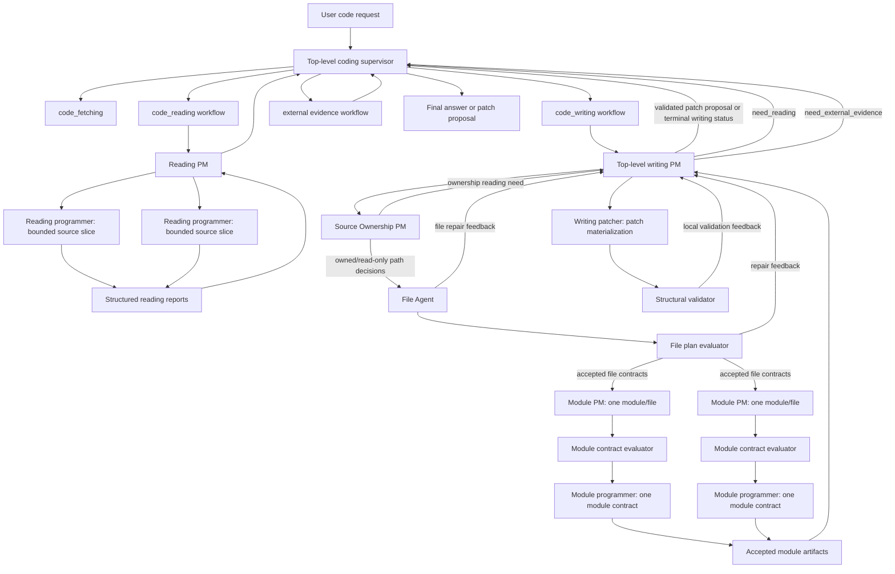
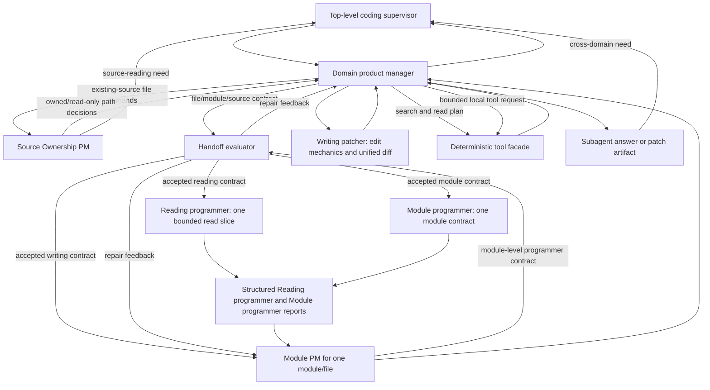
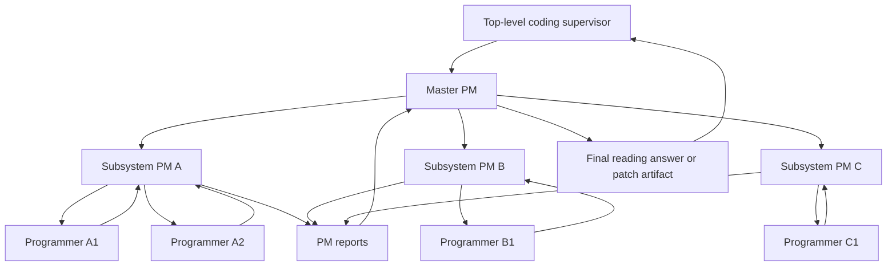
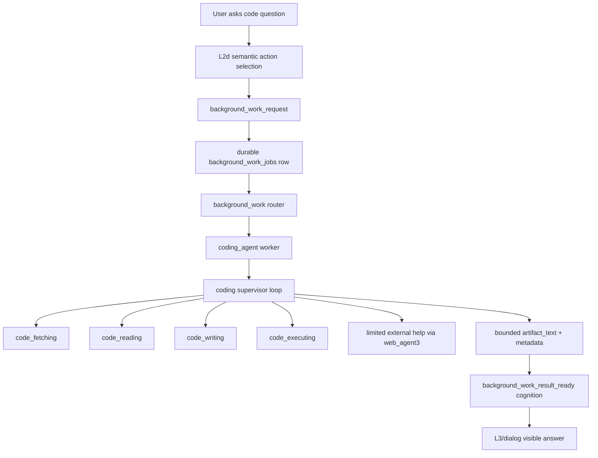

# Coding Agent Architecture

## Status

- Type: reference architecture and decision record
- Status: draft reference
- Related execution plans:
  - `development_plans/archive/completed/short_term/coding_agent_phase0_fetching_plan.md`
  - `development_plans/archive/completed/short_term/coding_agent_phase1_code_reading_final_plan.md`
  - `development_plans/active/short_term/coding_agent_phase2_code_writing_plan.md`
  - `development_plans/active/short_term/coding_agent_phase3_background_worker_integration_plan.md`
- Execution rule: use this document as reference context

This document captures the top-level architecture for replacing placeholder
code-related background work with a specialized `coding_agent`. The archived
completed Phase 0 plan records the implemented `code_fetching` contract; the
archived completed Phase 1 plan records the corrected `code_reading` and
direct answer interface on top of that fetching contract. The active Phase 2
in-progress plan defines the standalone `code_writing` stage. The active Phase
3 draft plan defines the separate background-worker integration stage.

## Problem

Kazusa needs to answer codebase questions through the normal L2d interface, for
example:

```text
[eamars/KazusaAIChatbot](https://github.com/eamars/KazusaAIChatbot) 项目是怎么实现读图的
```

The existing background-work text-artifact placeholder is intentionally
text-only. Repository fetching, `rg` search, file inspection, evidence-backed
code answers, patch proposal, and code-tool isolation belong in a specialized
worker. Coding work needs its own worker and subagent architecture behind the
durable background-work queue.

## Architectural Goal

`coding_agent` is a background-work worker that performs slow, tool-using code
tasks after the live persona turn. It returns a bounded artifact as
`background_work_result_ready`; L3/dialog remains the only visible wording
owner.

The agent must support four top-level sub-subagents:

- `code_fetching`: obtain or resolve repository code.
- `code_reading`: inspect code and answer repository/source questions.
- `code_writing`: propose and validate patches, patch-first.
- `code_executing`: run bounded sandbox execution or delegate to Docker when a
  local sandbox is unavailable.

The common architecture is a supervisor/resolver loop. The top-level
`coding_agent` supervisor owns the goal state, chooses the next subagent, and
evaluates whether the returned evidence is enough to finish or whether another
bounded step is required.

## Architecture Decision: Local-LLM-First Context Partitioning

Status: accepted hard requirement.

`coding_agent` is designed for local or weaker OpenAI-compatible LLMs with a
bounded effective context window. Repository-scale comprehension is handled by
splitting the work into smaller semantic calls, each with a clear owner,
bounded evidence, and structured memory handoff.

The accepted architecture is explicit context partitioning:

- The top-level coding supervisor owns the global coding goal, resolver state,
  subagent selection, bounded iteration, and final artifact handoff.
- The top-level coding supervisor owns cross-domain dispatch. It calls
  `code_fetching`, `code_reading`, `code_writing`, and external evidence in a
  bounded loop. Cross-domain needs return to the supervisor as structured
  outcomes.
- Each top-level subagent owns one domain of work and keeps its own bounded
  context memory for that domain.
- `code_reading` and `code_writing` use a product-manager/programmer
  structure for non-trivial tasks. Reading product managers define bounded
  source-slice contracts and synthesize source behavior from programmer
  evidence. Writing uses a top-level writing PM for whole-request
  decomposition and the feature-level interface contract, a Source Ownership
  PM for existing-source owner selection, and one Module PM per accepted
  module/file assignment. Each Module PM emits a local module-boundary
  programmer contract with provided interfaces, consumed interfaces, lifecycle
  owner, existing source anchors, exact imports, symbols to define or modify,
  bounded current file context, and observable behavior.
- `code_writing` uses a dedicated Writing patcher after Module programmer reports.
  The Writing patcher owns edit mechanics: path targeting, anchor selection,
  full-file creation where appropriate, unified-diff assembly, and edit-shape
  diagnostics. It receives writing-PM-selected Module programmer output and
  returns patch artifacts plus patchability notes.
- A Source Ownership PM chooses existing-source owner paths from bounded source
  evidence and candidate paths. A shared File Agent validates and packages file
  mechanics after ownership is established. The top-level writing PM describes
  required files, purposes, placement hints, file-to-file contracts, and
  deliverables. The File Agent owns repository inventory, repo-relative path
  safety, new-file reservation, permission checks, source-scope checks, current
  file context packaging, and the path map consumed by Module PMs, evaluators,
  the Structural validator, and the Writing patcher.
- Reading programmers and Module programmers return structured reports that
  become compressed memory: evidence references, interface facts, behavior
  summaries, uncertainty, and follow-up needs. For writing, a Module programmer
  receives one module-level contract and returns one code artifact for that
  module or symbol bundle. The product manager reasons over those reports and
  cited evidence. Full raw repository content stays in the private evidence
  store.
- Deterministic tooling owns repository discovery, path safety, file caps,
  search execution, patch validation, execution limits, and storage boundaries.
  LLM stages receive normalized, bounded evidence rows and task-specific
  semantic summaries.
- Coding-agent LLM use is route-configurable. The standalone coding agent uses
  `CODING_AGENT_PM_LLM` for PM decisions and final synthesis, and
  `CODING_AGENT_PROGRAMMER_LLM` for bounded Reading programmer, Module
  programmer, and Writing patcher calls. Final synthesis shares the PM route.

This requirement is mandatory for scalability. The coding agent must be able
to inspect projects whose relevant implementation exceeds one prompt.
The product-manager/programmer pattern is therefore a context and memory
ownership architecture.

### Supervisor-Mediated Agreement

Agreement recorded on 2026-06-21: for local LLM robustness, the coding agent
uses supervisor-mediated hierarchical orchestration with many small LLM calls.
Each LLM call receives balanced cognitive load. The supervisor keeps
coordination authority and the durable run ledger; PMs decompose within their
assigned layer; programmers perform bounded reading or implementation behind
PM-defined interfaces.

The accepted call graph is:



When writing needs systematic source understanding, the writing workflow
returns `need_reading` to the top-level supervisor. When writing needs public
documentation or current external facts, it returns `need_external_evidence`
to the top-level supervisor. The supervisor records the transition in the
global run ledger and resumes writing with bounded evidence from the selected
workflow. The supervisor also owns the cross-domain evidence budget for one
coding run: it records completed reading and external-evidence attempts,
merged evidence counts, unresolved evidence needs, and remaining follow-up
capacity, then gives the next writing PM call a compact evidence-state
summary. This keeps loop control and context memory at the top level while
each PM layer keeps semantic decomposition and handoff authority inside its
own layer.

Validation is local to `code_writing` for Phase 2. The Structural validator
blocks bad patch artifacts, but it does not terminate the full coding-agent
workflow by itself. The code-writing supervisor owns local repair for PM,
Module PM, Module programmer, Writing patcher, and Structural validator
failures. It returns to the
top-level supervisor only when writing produces a validated proposal, needs
more source reading, needs external evidence, reaches its local repair limit,
or rejects an unsupported request.

The internal reading and writing shape is:



### Role Responsibility Matrix

| Role | Primary responsibility | Input contract | Output contract |
|---|---|---|---|
| Top-level coding supervisor | Global goal state, cross-domain dispatch, loop ledger, context budget, final artifact handoff. | User task, repository/source request, prior subagent outcomes, writing outcomes. | Next workflow action, compact evidence-state summary, final public response. |
| Reading PM | Source-question decomposition, evidence slots, reading assignment contracts, answer synthesis from Reading programmer reports. | Repository summary, source scope, repo map summary, prior reading reports. | Reading assignments, sufficiency decision, evidence-backed source answer. |
| Top-level writing PM | Writing-mode selection, full feature integration contract, whole-request file/module plan, cross-file interfaces, report reconciliation, Writing patcher packet selection. | User goal, source summary, reading evidence, external evidence, session summary, validation summaries, source-ownership feedback, File Agent feedback, Module PM reviews. | `WritingPMDecision` with `need_module_pms`, semantic `file_demands`, feature-level module slices, provided/consumed interfaces, lifecycle owners, source anchors, selected module artifacts, `WritingPatcherInput`, and sufficiency decision. |
| Source Ownership PM | Existing-source owner selection for PM-authored file demands. | Semantic file demands, bounded source evidence, and candidate source paths. | `SourceOwnershipResolution` with owner paths, read-only paths, evidence refs, source-reading requests, or PM repair feedback. |
| File Agent | Repository file planning, new-file reservation, path-safety checks, and owned/read-only path-map construction. | Top-level writing PM file needs after source ownership, source scope, repository inventory, and explicit placement data. | `ResolvedWritingFilePlan` with `WritingFileModuleContract` items, owned path map, read-only path map, file diagnostics, and repair feedback. |
| File plan evaluator | Structural acceptance of file/module ownership before Module PM dispatch. | Resolved file plan, writing mode, source scope, assignment limits, path contract rules. | Accepted `WritingFileModuleContract` items or compact repair feedback for the top-level writing PM. |
| Module PM | Local module-boundary programmer contract for one accepted module/file assignment. | `ModulePMInput` for one accepted file/module contract, module purpose, lifecycle owner, provided/consumed interfaces, existing source anchors, imports, bounded current file context, selected evidence, required behavior, compact `cross_slice_interfaces` summary (provider_slice_id, name, contract only), and evaluator feedback. | `ModulePMProgrammerContract` with lifecycle owner, provided/consumed interfaces, existing source anchors, `imports`, `symbols_to_define`, `symbols_to_modify`, `current_file_context`, required behavior, and a later Module PM review of Module programmer output. |
| Module contract evaluator | Structural acceptance of a Module PM programmer contract before programmer dispatch. Validates `symbols_to_modify` entries are grounded in `current_file_context` or `existing_source_anchors`. | One `ModulePMProgrammerContract`, prompt budget, role-boundary rules, and assignment limits. | Accepted module contract or compact repair feedback for the Module PM. |
| Reading programmer | Bounded local source reading behind one accepted reading assignment. | One reading assignment and selected source excerpts. | Structured evidence report with facts, evidence refs, uncertainty, and open questions. |
| Module programmer | Implementation of one accepted module-boundary contract. | One accepted `ModulePMProgrammerContract` with lifecycle owner, provided/consumed interfaces, source anchors, imports, symbols to define or modify, current file context, and behavior requirements. | `WritingProgrammerReport` with one code artifact for the assigned module/symbol bundle plus risks and open questions when requested. |
| Writing patcher | Edit mechanics and patch artifact materialization. | `WritingPatcherInput` with writing-PM-selected Module programmer content, owned path map, base file summaries, and artifact caps. | `WritingPatcherReport` with unified diff or new-project file tree, edit diagnostics, file list, and patchability notes. |
| Structural validator | Structural validation, path safety, sandbox artifact checks, public-output safety inside `code_writing`. | Patch artifacts, source identity, workspace/session metadata, validation limits. | Validation summary, unsafe-path findings, artifact integrity result, public-safe metadata for code-writing repair or final handoff. |
| Synthesizer | Public explanation and handoff summary from completed artifacts. | PM decision, selected artifacts, validation summary, evidence refs, limitations. | Bounded answer text, public rationale, residual limitations, Phase 3 handoff fields. |

### Hierarchical PM And Programmer Contract

Product managers decide worker roles and boundaries through bounded
decomposition steps. Each layer receives the smallest contract needed for its
own decision and returns a structured memory artifact to the layer above it.

For code reading, the reading PM owns evidence boundaries, source slices,
question slots, expected interface facts, proof obligations, and final answer
synthesis. Reading programmers perform the bounded inspection and return
evidence reports.

For code writing, the top-level writing PM owns whole-request decomposition,
file-to-file input/output contracts, cross-file import needs, final report
reconciliation, and Writing patcher packet selection. The Source Ownership PM
selects existing-source owner paths from bounded evidence. The File Agent validates and
packages concrete paths, file actions, current file context, and file
management metadata. Each Module PM owns one module-level programmer contract
inside one assigned module or file. Module programmers receive one accepted
module-level contract and perform the local work behind that contract.

Deterministic evaluation accepts each handoff before the next worker layer
starts. For writing, the Source Ownership PM establishes existing-source
owners, the File Agent packages those decisions into a bounded file plan, the
file plan evaluator checks file/module ownership and file-to-file contracts,
and the module contract evaluator checks each Module PM programmer contract
before programmer dispatch.

Deterministic validation also enforces the PM/programmer boundary before a PM
may use Reading programmer or Module programmer output. For reading,
validation checks that reports cite files inside the assigned read scope and
include required evidence references.
For writing, validation checks unit reports, patch materialization, patch
applyability in an isolated sandbox, and touched Python test coherence when
proposed tests are part of the patch.

For reading, the PM consumes a compact `PMInput`:

```python
{
    "question": str,
    "repository_summary": dict,
    "source_scope": dict,
    "repo_map_summary": dict,
    "previous_reports": list[dict],
}
```

The PM returns a `PMDecision`:

```python
{
    "status": "need_programmers | sufficient | needs_user_input | overloaded",
    "intent": str,
    "required_slots": list[str],
    "assignments": list[dict],
    "missing_slots": list[str],
}
```

Each Reading programmer assignment must define one bounded mission and one
read scope:

```python
{
    "assignment_id": str,
    "role": str,
    "scope": {
        "kind": "file | directory | symbol | search",
        "values": list[str],
    },
    "owned_paths": list[str],
    "read_only_paths": list[str],
    "interface_contract": {
        "component": str,
        "inputs": list[str],
        "outputs": list[str],
        "callers": list[str],
        "invariants": list[str],
    },
    "evidence_contract": {
        "required_facts": list[str],
        "required_evidence_refs": list[str],
    },
    "must_not_touch": list[str],
    "work_instructions": list[str],
    "required_slots": list[str],
}
```

For reading assignments, `owned_paths` is empty, `scope.values` defines the
only allowed read slice, and `evidence_contract` defines the required proof
shape. Writing uses the Module PM and Module programmer contracts defined in
the Phase 2 code-writing section, where file ownership stays with File Agent
and patch materialization stays with Writing patcher.

The PM chooses assignment boundaries from four signals:

- the user question intent, such as feature flow, symbol explanation, API
  contract, persistence path, tests, dependency usage, or impact read;
- the deterministic repository map, including file tree, package names, docs,
  imports, and symbol search results;
- the required slots needed to answer or patch safely;
- the local-LLM context budget, so each Reading programmer receives a small enough
  slice to read deeply.

For a data/pipeline question, a correct reading PM may create bounded
assignments such as:

- `ingress reader`: inspect only files where the input enters the system;
- `processing reader`: inspect only files that transform or enrich the input;
- `projection reader`: inspect only files that pass the transformed data to a
  downstream consumer;
- `test reader`: inspect only tests that prove or constrain the behavior.

### Concrete Role Allocation Examples

These examples are part of the architecture contract. They show how the PM
splits real Kazusa work while staying in the coordinator role.

For a reading question such as "how does Kazusa respond to an image?":

- PM contract: answer the image-response flow from source evidence, with
  separate facts for ingress, media description, cognition handoff, and final
  response surface.
- Programmer A, `image ingress reader`: read only adapter, service, and message
  envelope files that accept image or attachment inputs; return evidence for
  the typed fields handed to the brain.
- Programmer B, `media descriptor reader`: read only media descriptor and
  image-description code; return evidence for how image content becomes text or
  structured evidence.
- Programmer C, `cognition handoff reader`: read only cognition/RAG/dialog
  handoff files that consume media evidence; return evidence for where the
  character response is decided.
- PM output: synthesize the answer only from A/B/C reports and cite their
  evidence. Additional flow steps require additional Reading programmer
  evidence.

For a Phase 2 service health writing task:

- Top-level writing PM contract: add a bounded health-surface extension with
  separate file work orders for runtime aggregate stats, service response
  modeling, endpoint wiring, focused tests, and operator documentation.
- Runtime stats Module PM: emit one module-level programmer contract with
  imports, required stats symbols, bounded current file context, and required
  aggregate behavior.
- Service health Module PM: emit one module-level programmer contract for the
  response model and endpoint integration symbols that consume the runtime
  stats output through exact import lines.
- Tests/docs Module PM: emit module-level programmer contracts for focused
  contract tests and usage documentation.
- Top-level writing PM output: reconcile Module PM reviews, select accepted
  module artifacts that satisfy the file-to-file contracts, and build the
  Writing patcher input packet.

For a Phase 2 message queue module writing task:

- Top-level writing PM contract: create separate file work orders for the
  queue module, service integration points, state-latch behavior, and focused
  tests. The file-to-file contract names what the queue module provides and
  what the service imports.
- Queue module Module PM: emit one module-level programmer contract that asks
  for the complete queue module with `QueuedChatItem`, `DequeuedChatTurn`,
  `ChatInputQueue`, and coalescing functions.
- Service integration Module PM: emit one module-level programmer contract for
  the service symbols that consume the queue module through exact import
  lines and preserve the existing service workflow.
- Test Module PM: emit one module-level programmer contract for queue behavior
  tests and service integration tests that consume the same imports.
- Top-level writing PM output: reconcile the queue module, service
  integration, state, and test Module PM reviews before sending selected
  Module programmer content to the Writing patcher.

Each programmer returns a structured report. The report is the memory boundary
between local reading and PM synthesis:

```python
{
    "assignment_id": str,
    "status": "succeeded | blocked | no_evidence",
    "files_read": list[str],
    "facts": list[{
        "kind": str,
        "summary": str,
        "evidence_refs": list[str],
    }],
    "evidence": list[dict],
    "open_questions": list[str],
}
```

The PM may ask deterministic tools for more repository-map information, launch
additional programmer assignments, ask a narrow follow-up assignment, finish,
or ask for user clarification. Final answers, selected patch artifacts, and
implementation requests are grounded in available facts. Missing facts become
limitations or follow-up work.

Phase 1 supervisor limits cap one PM at three Reading programmers per wave,
two waves, and six Reading programmer reports total. Larger or conflicting requests set an
overload status instead of forcing one PM to pretend it read a whole project.

### Master PM Escalation

For larger projects, `code_reading` and `code_writing` may use a master PM
above subsystem PMs:



Master PM is an escalation mechanism for work whose subsystem map, required
facts, and report set exceed one PM's context budget. Triggers include:

- broad repository or multi-package architecture questions;
- cross-runtime or cross-service feature flows;
- questions requiring several independent ownership domains;
- a PM work plan whose estimated Reading programmer or Module programmer
  reports would exceed the PM context budget;
- conflicting Reading programmer or Module programmer reports that require
  subsystem-level reconciliation.

Subsystem PMs return `PMReport` objects to the master PM. The master PM sees
subsystem PM reports and selected evidence references by default.

### Shared Reading And Writing Model

`code_reading` and `code_writing` share the PM/programmer hierarchy. Reading
programmers report code behavior and interfaces. Module programmers report
bounded implementation content, tests/docs content when assigned, local risks,
and edit intent for their assigned unit. The Writing patcher converts
writing-PM-selected Module programmer output into patch artifacts. In both
reading and writing:

- PM layers own architecture, interface consistency, decomposition, and
  contract enforcement;
- PM work is decomposition, interface consistency, evidence sufficiency,
  report reconciliation, and artifact selection. Reading programmer and Module
  programmer reports supply source facts, implementation code, file contents,
  and test bodies;
- Reading programmers and Module programmers own bounded local inspection or code, test, and documentation
  implementation behind PM-defined contracts;
- The Writing patcher role owns unified diff and file-tree materialization
  from selected Module programmer output;
- deterministic tools own path safety, search, file caps, patch validation,
  execution limits, and output normalization;
- reports are the durable memory artifacts passed upward;
- final visible answers and selected patch artifacts are assembled only by the
  PM or master PM and then returned to the top-level coding supervisor.

## Runtime Placement

The diagram below is the long-term Kazusa integration target after the
standalone coding-agent core exists. Phases 0, 1, and 2 implement only direct
module paths shown after the diagram.



L2d contributes the semantic decision that background code work is useful by
selecting the private `background_work_request` capability. Deterministic
action-spec code materializes the trusted task brief and delivery scope. The
background-work router selects `coding_agent` after the live turn.

The Phase 0 standalone path is:

```text
CodeFetchingRequest
  -> code_fetching.run
  -> CodeFetchingResult
```

The Phase 1 standalone path is:

```text
CodingAgentRequest
  -> coding_agent.answer_code_question
  -> coding supervisor loop
  -> code_fetching.run from Phase 0
  -> code_reading.run
  -> CodingAgentResponse
```

Phase 0 and Phase 1 tests call these public interfaces directly. Later
integration phases cover L2d, background-work jobs, router integration,
result-ready cognition, service delivery, and placeholder removal.

Phase 1 direct responses expose only a public-safe repository summary and
repo-relative evidence. Raw checkout roots, workspace roots, cache keys,
subprocess traces, job ids, leases, and adapter delivery fields remain private
implementation data.

The Phase 2 standalone path is:

```text
CodingAgentWriteRequest
  -> coding_agent.propose_code_change
  -> coding supervisor loop
  -> code_fetching.run from Phase 0
  -> code_writing.run
  -> if needed: supervisor runs code_reading.run, then resumes code_writing.run
  -> if needed: supervisor runs external evidence, then resumes code_writing.run
  -> code_writing validates and locally repairs patch artifacts
  -> CodingPatchProposalResponse
```

Systematic reading for code writing is supervisor-managed. The top-level
writing PM may request additional source evidence, interface facts, or behavior
constraints before patch design continues. The Source Ownership PM may request
source-owner evidence for existing-source file demands. Those reports return
to the top-level coding supervisor as `need_reading` outcomes. The supervisor
invokes `code_reading.run(...)` through the public Phase 1 contract, passes a
bounded reading instruction, and then supplies the resulting public reading
evidence back into `code_writing`.

External evidence for code writing follows the same supervisor-mediated rule.
The top-level writing PM may request current public documentation or other
bounded external facts through a `need_external_evidence` outcome. The
top-level supervisor invokes the external-evidence workflow and passes bounded
evidence back into `code_writing`.

Focused Phase 2 unit tests may call `code_writing.run(...)` to prove the
writing subagent contract. Deterministic acceptance tests and every hard live
LLM gate must call the public top-level `coding_agent.propose_code_change(...)`
interface so the coding supervisor owns fetch/read/write/external dispatch and
the code-writing supervisor owns local PM, Module PM, Module programmer,
Writing patcher, and Structural validator repair. Phase 2 test scope remains
the direct coding-agent path;
L2d, background-work jobs, result-ready cognition, service delivery, patch
apply, and code execution belong to later integration phases.

## Ownership Boundaries

| Layer | Owns | Coordinates With |
|---|---|---|
| L2d | Semantic decision that background work is useful. | Action spec for trusted task materialization. |
| Action spec | Validation, trusted target binding, queue request materialization. | Background-work router for worker selection after the live turn. |
| Background-work router | Route-only worker choice. | `coding_agent` worker for code-task execution. |
| `coding_agent` supervisor | Coding goal state, cross-domain subagent selection, bounded iteration, global context ledger, final artifact. | Code subagents, deterministic tool facade, external evidence workflow, and Phase 3 result mapping. |
| Code subagents | Domain-specific low-level planning and tool use behind the supervisor-selected domain. | Supervisor-managed evidence, assignments, and result handoff. |
| Deterministic tool facade | Path safety, command allowlists, size caps, timeouts, filesystem mutation controls. | LLM stages through normalized evidence rows and validation summaries. |
| L3/dialog | Final visible wording from result-ready cognition. | Background-work result-ready cognition. |

## Top-Level Supervisor Contract

The supervisor receives one coding job:

```python
{
    "task_brief": str,
    "source_summary": str,
    "max_output_chars": int,
}
```

It maintains bounded state:

```python
{
    "goal": str,
    "repo": dict | None,
    "evidence": list[dict],
    "open_questions": list[str],
    "patches": list[dict],
    "execution_results": list[dict],
    "cycle_count": int,
}
```

Its next-action output is always one of:

```python
{
    "action": "code_fetching | code_reading | code_writing | code_executing | finish | fail",
    "instruction": "short instruction for the selected subagent",
    "reason": "short reason for the next step"
}
```

Deterministic code validates allowed transitions. Phase 0 has no top-level
supervisor and exposes only `code_fetching.run`. Phase 1 allows
`code_fetching`, `code_reading`, `finish`, and `fail`. Phase 2 adds
`code_writing` and patch-proposal finish states. Patch application and project
command execution belong to later phases.

## Phase 3 Runtime Integration Boundary

Phase 3 must register the worker as `coding_agent` and map standalone
coding-agent responses from Phases 1 and 2 into the existing
`BackgroundWorkResult` contract. The worker description should identify
repository/codebase reading and patch-proposal work with bounded local source
evidence. Patch apply, execution, package installation, and arbitrary shell
access belong to separate approved phases.

The handoff artifact is:

- `artifact_text`: capped answer text;
- `result_summary`: short repository, commit, status, and evidence-count
  summary;
- `failure_summary`: most specific failure or limitation on non-success;
- `worker_metadata`: sanitized repository summary, source scope,
  repo-relative evidence references, and limitations.

Phase 3 provides the coding workspace root from configuration. User text,
public artifacts, and worker metadata stay on public-safe repository summaries,
repo-relative evidence references, and bounded result fields.

Phase 3 reuses the standalone coding-agent split LLM route resolution. The
worker environment supplies the configured workspace and route settings.

## Subagent Contracts

### `code_fetching`

Purpose: resolve the code workspace for a task.

Responsibilities:

- Publish `code_fetching/README.md` as the upstream ICD.
- Extract public repository URLs from the task.
- Resolve source scope as `repository`, `directory`, or `file`.
- Support public GitHub repository, `.git`, tree, blob, raw file, markdown-link,
  shorthand `owner/repo`, explicit local checkout, and explicit local path
  inputs.
- Prefer an existing matching local checkout.
- Clone public HTTPS GitHub repositories into a managed coding workspace when
  no local checkout is available.
- Identify the resolved commit, branch, root path, and whether the checkout is
  managed by the coding workspace.
- Validate that parsed GitHub `tree`, `blob`, and raw-file scopes exist in the
  resolved checkout before handing them to reading.
- Return public-safe local source labels for local checkout scopes while
  keeping `repository.local_root` as the internal read root.
- Refuse private URLs, SSH URLs, raw filesystem paths outside the managed
  workspace, and ambiguous repository targets.
- Store managed clones under:
  `<workspace_root>/repos/github/<owner>/<repo>/refs/<ref_key>/checkout`.
- Protect managed paths with matching `metadata.json` before reuse.
- Store lock files and temporary clone directories under the same configured
  workspace root.
- Return explicit unsupported outcomes for GitHub issues, pull requests,
  discussions, release archives, SSH URLs, private/auth URLs, non-GitHub
  providers, package registry names, Gists, paste URLs, and generic raw HTTP
  sources.

Future responsibilities:

- `git pull` and `git checkout` only for managed clean clones.
- Version pinning and branch/tag resolution.
- Download archive support for non-git public code packages.
- Optional LLM source disambiguation after deterministic fetching exposes a
  concrete semantic ambiguity that requires semantic resolution.

### `code_reading`

Purpose: inspect code and answer codebase questions with file evidence.

Responsibilities:

- Publish `code_reading/README.md` as the upstream ICD.
- Consume only a successful `CodeRepositoryRef` and `CodeSourceScope` passed by
  the top-level supervisor.
- Use a product-manager/programmer structure for non-trivial reading tasks.
- The reading product manager owns question decomposition, architecture and
  interface mapping, evidence sufficiency checks, and final answer synthesis
  back to the top-level supervisor.
- Reading programmers own bounded local inspection of selected files,
  symbols, directories, or call chains and return structured reports with
  repo-relative evidence references, interface facts, behavior summaries,
  uncertainty, and suggested follow-up reads.
- Keep product-manager context limited to the user goal, repository summary,
  reading plan, structured Reading programmer reports, and selected evidence
  rows.
  Full repositories, unbounded search output, and raw source files stay in the
  private evidence store.
- Build a small reading plan from the task and repository metadata.
- Use deterministic tools such as `rg --files`, `rg -n --json`, and bounded
  file reads.
- Keep raw file content out of prompts unless selected and capped.
- Return an evidence-backed answer in the user's language when possible.
- Preserve uncertainty when evidence is incomplete.

The reading answer must distinguish:

- authored user question text;
- code evidence;
- inferred architectural explanation;
- limitations or missing proof.

### `code_writing`

Purpose: propose code changes. This subagent is patch-first.

Responsibilities:

- Use the same product-manager/programmer context partitioning principle as
  `code_reading`, with a top-level writing PM and one Module PM per accepted
  module/file assignment.
- The top-level writing PM owns requested behavior, file/module decomposition,
  the feature-level interface contract, lifecycle ownership, file-to-file
  provided/consumed interfaces, cross-module import consistency, Module PM
  review reconciliation, and final patch artifact selection.
- The Source Ownership PM chooses existing-source owner paths from bounded
  source evidence before file mechanics run.
- The File Agent validates accepted paths, reserves new files, packages file
  actions, base revisions, mutex identifiers, and bounded current file context
  before Module PM dispatch.
- Module PMs own local module-boundary programmer contracts inside their
  assigned file or module. Each contract preserves lifecycle owner,
  provided/consumed interfaces, existing source anchors, exact imports,
  symbols to define or modify, bounded current file context, and required
  behavior.
- Module programmers own bounded implementation content for one
  accepted module-boundary contract and report local risks. They do not need
  peer programmer output or the whole feature picture.
- Run file-plan evaluation before Module PM dispatch and module-contract
  evaluation before programmer dispatch so file ownership, interface
  contracts, prompt budget, and programmer boundaries are accepted before
  worker calls.
- A Writing patcher materializes writing-PM-selected Module programmer output into a unified
  diff or new-project file tree.
- Run deterministic patch validation, including sandbox apply checks and
  touched Python test checks when proposed tests are present.
- Return patch artifacts and rationale.
- Workspace mutation belongs to a separately approved apply step.

### `code_executing`

Purpose: run bounded execution to verify or inspect code.

Responsibilities:

- Run commands only through an allowlisted sandbox execution facade.
- Default to no file access.
- Use Docker or another isolated runner when local sandbox isolation is not
  available.
- Return stdout, stderr, exit code, timeout status, and a bounded summary.

Fetching, reading, and patch proposal are higher priority because ordinary
code questions are answered through source evidence and synthesis.

## Tool Facade

The coding subsystem should use proven tools rather than custom parsers where
the standard tool is stronger.

Tool candidates for Phases 0 and 1:

- `git remote -v`, `git rev-parse`, `git status --porcelain`, `git clone`
  through a deterministic subprocess facade.
- `rg --files` for file discovery.
- `rg -n --json` for text search.
- Bounded direct file reads with extension and size filters.
- A path safety helper that verifies every read stays inside the resolved repo
  root and refuses `.env`, secret-like files, `.git` internals, and binary
  payloads.

Future tool candidates:

- `git diff`, `git apply --check`, and `git apply --reverse --check`.
- Patch sandbox apply.
- Bounded test/command execution.
- Docker-backed execution.

Tool output must be normalized before it enters an LLM prompt. The model should
see short evidence rows. Raw command output and unbounded source files stay in
the private evidence store.

## Limited External Help

`coding_agent` may ask for limited external help through `web_agent3` when the
task requires public documentation, current external facts, or repository pages
available online.

External help returns bounded evidence summaries. Local repository evidence is
the primary source for checked-out implementation behavior. Web evidence is a
supporting source for public documentation, current facts, repository pages, or
cases where code fetching needs a public page observation.

## Safety Ownership

- Coding work runs after the live response path through durable background
  work.
- Workers return artifacts through the background-work result path, and
  L3/dialog owns visible wording.
- Deterministic code owns filesystem safety, command allowlists, timeouts,
  output caps, and persistence boundaries.
- LLM stages own semantic planning and answer synthesis.
- Phase 0 owns source fetching and storage. Phase 1 consumes Phase 0 output.
- Phase 1 owns source reading after repository fetching.
- Managed clones live under a dedicated coding-agent workspace. Existing local
  checkouts can serve as read sources for matching repository questions.
- Phase 1 and Phase 2 public artifacts plus Phase 3 worker metadata expose
  sanitized repository summaries and repo-relative evidence references.
  Absolute `local_root`, configured `workspace_root`, and storage `cache_key`
  values remain internal job metadata.
- Raw repository files and tool traces remain private job evidence. The
  result-ready cognition episode receives a bounded artifact and prompt-safe
  metadata.

## Phase Roadmap

| Phase | Scope | User-Visible Capability |
|---|---|---|
| Phase 0 | Standalone `code_fetching` package, README ICD, deterministic source-scope routing, managed storage, direct fetching tests, unsupported-input tests, and 10-source public internet smoke. | Direct callers can resolve supported repo/file/tree/raw/local sources into a safe local source contract or receive explicit unsupported/clarification results. |
| Phase 1 | Standalone `code_reading` package, README ICD, top-level direct answer interface, supervisor over Phase 0 output and reading. | Direct callers can answer repository/codebase questions with cited local file evidence. |
| Phase 2 | Standalone `code_writing` package, README ICD, PM/programmer patch-proposal architecture, patch artifact contract, deterministic patch validation, and direct tests. | Direct callers can request proposed code changes as bounded patch artifacts with real-workspace immutability. |
| Phase 3 | Background-worker integration, L2d/action-spec affordance update, result-ready delivery, placeholder removal, and standalone coding-agent response to `BackgroundWorkResult` mapping for `WORKER="coding_agent"`. | Kazusa can route implemented standalone coding-agent work through the normal background-work path. |
| Phase 4 | Patch apply flow with explicit approval and workspace safety. | Apply approved patches in a controlled sandbox or approved workspace. |
| Phase 5 | `code_executing` sandbox/Docker execution. | Run bounded verification commands and include results. |
| Phase 6 | Broader repository operations and richer external help. | Handle multi-repo comparisons, docs lookups, and current dependency evidence. |

## Real Demand Mapping

For a concrete user question such as "how does this project implement image
reading?", the intended Phase 0 flow is:

```text
test builds CodeFetchingRequest
-> code_fetching.run
-> resolves eamars/KazusaAIChatbot to local checkout or managed clone
-> returns CodeFetchingResult with repository source scope
```

The intended Phase 1 flow is evidence-driven generic code reading:

```text
test builds CodingAgentRequest
-> coding_agent.answer_code_question
-> code_fetching.run returns Phase 0 CodeFetchingResult
-> code_reading PM classifies the question as a data/pipeline reading task
-> PM assigns bounded Reading programmers for ingress, processing, projection,
   persistence, tests, or docs only when repository-map evidence indicates
   those domains exist
-> Reading programmer reports discover concrete identifiers from source evidence
-> PM synthesizes the answer from reports and cited repo-relative evidence
```

Concrete identifiers, module names, call names, constants, and data-shape names
come from Reading programmer evidence. The reading PM, planner, and synthesizer use
generic reading slots and evidence-grounded vocabulary.

## Scope Statement

- This document is a reference architecture and decision record.
- `coding_agent` is a specialized code-task worker behind the normal
  background-work path.
- Shell execution, package installation, repository mutation, database
  mutation, adapter delivery, and final user-visible wording each belong to
  their explicitly approved phase or existing owner.
- RAG2, `web_agent3`, cognition resolver, L2d, L3, dialog, consolidation, and
  dispatcher ownership remain separate from `coding_agent`.
