# Deterministic Motivational State and Parallel Cognition Architecture

## Document Control

- Status: reference
- Version: v1.0
- Scope: conceptual architecture for the canonical `cognition_core_v2`
- Execution authority: none
- Active implementation authority:
  `development_plans/active/short_term/cognition_core_v2_stage_2_integration_plan.md`
  and its mandatory contract specification and execution manifest
- Change rule: this reference explains ownership and flow. Exact types,
  formulas, ranges, paths, commands, and checkpoints come only from the active
  Stage 2 documents.

## 1. Architecture Outcome

Kazusa uses one platform-neutral `cognition_core_v2` package. It owns causal
state interpretation, deterministic emotion derivation, goal activation,
parallel goal cognition, workspace collapse, semantic route selection, and
bounded surface planning. The Stage 2 release candidate performs one big-bang
caller/callee/test cutover and removes `cognition_chain_core` after isolated
validation.

The core product behavior is:

```text
typed event + persisted causes + read-only constraints
  -> deterministic elapsed/direct-fact reduction
  -> preliminary emotion and goal readiness
  -> scoped parallel semantic appraisal for unresolved meaning
  -> guarded final reduction and emotion derivation
  -> dependency-ready parallel goal cognition
  -> admitted-bid collapse and route selection
  -> one validated state update and semantic projections
  -> persistence
  -> deterministic action/resolver preparation
  -> V2 surface planning
  -> dialog wording and delivery
```

## 2. Ownership Boundary

| Owner | Responsibility |
|---|---|
| Upstream episode/RAG/source builders | Typed stimulus, bounded evidence, trusted typed outcomes, available action/capability context |
| DB facades | Load and replace one validated user or singleton-character V2 state document |
| Deterministic V2 reducers | Scalar validation, causal matching, state machines, direct-fact transitions, salience, lifecycle, elapsed decay, sleep recovery, caps, and persistence output |
| Scoped appraisal LLM calls | Ambiguous responsibility, intention, social/moral meaning, outcome significance, comparison/memory meaning, and existential relevance |
| Goal cognition LLM calls | Independent read-only bids for activated persistent goals |
| Workspace and route stages | Prompt-handle-only bid classification and constrained selection from complete admitted bids |
| ActionSpec/resolver | Availability, permission, feasibility, execution, and typed results |
| V2 surface planning | Bounded content/style/pacing guidance from semantic state and surface-safe bid projections |
| Dialog/L3 visible surfaces | Final wording and rendering |
| Consolidation/reflection/scheduler | Later evidence, continuity, and typed future outcomes outside live wording authority |

Emotion words, residue prose, dialog text, consolidation prose, and reflection
prose carry semantic context. They do not author causal state.

## 3. Core Flow And Dependencies

```mermaid
flowchart LR
    subgraph UP[Upstream modules]
        U1[Brain and persona graph<br/>typed CognitiveEpisode]
        U2[RAG and resolver<br/>bounded evidence]
        U3[DB facades<br/>one mutable V2 state]
        U4[Task scheduler reflection self-cognition<br/>typed source events]
    end

    subgraph CORE[Cognition Core V2]
        C1[Validate input and scope]
        C2[Elapsed and trusted-fact reduction]
        C3[Match events to structured causes]
        C4[Preliminary emotion derivation]
        C5[Preliminary goal readiness]
        C6[Select scoped semantic questions]
        C7[Parallel semantic appraisal]
        C8[Validate and apply guarded deltas]
        C9[Final emotion and goal derivation]
        C10[Validate goal dependency DAG]
        C11[Parallel goal cognition<br/>isolated branch slots]
        C12[Validate complete bids]
        C13[Handle-only workspace collapse]
        C14[Constrained route selection]
        C15[One state update and semantic projections]
        C16[V2 surface planning<br/>when text surface is permitted]

        C1 --> C2 --> C3
        C3 --> C4 --> C5 --> C10
        C3 --> C6 --> C7 --> C8 --> C9 --> C10
        C10 --> C11 --> C12 --> C13 --> C14 --> C15
    end

    subgraph DOWN[Downstream modules]
        D1[DB facade<br/>commit one scope]
        D2[Resolver and ActionSpec<br/>deterministic preparation/execution]
        D3[Dialog<br/>final wording]
        D4[Persistence consolidation scheduler reflection<br/>later typed outcomes]
        D5[Protected diagnostics and validation evidence]
    end

    UP --> C1
    C15 --> D1 --> D2 --> C16 --> D3
    D2 --> D4
    C15 --> D5
    C16 --> D5
```



Preliminary branches and scoped appraisals may overlap. A branch waits only for
its declared semantic or branch dependency. Each branch writes to its own
result slot. The LLM service owns physical request concurrency; the core owns
logical dependency readiness and result isolation.

## 4. State Model

One cognition episode mutates exactly one embedded state scope:

- user state in `user_profiles.cognition_state` for user-scoped interaction;
- character state in singleton `character_state.cognition_state` for global
  character cognition.

The causal model contains relationship axes, goals, threats, active events,
knowledge gaps, character drives, standards, meaning state, evidence refs, and
a generic derived activation cache. Persistent entities record why a state
exists. Emotion identity alone is never a matching key.

Goals use guarded `pursuing`, `blocked`, `satisfied`, `failed`, and `abandoned`
states. Threats, events, knowledge gaps, and emotion activations have their own
guarded lifecycles. User emotion decays by elapsed time. Character recovery
uses the existing daily sleep trigger and deterministic zero-LLM recovery.

## 5. Emotion Coverage

The frozen Stage 2 registry derives these twenty-one emotion families from
structured causes:

| Tier | Emotion families | Primary causal state |
|---|---|---|
| Core survival | joy, fear, anger, sadness, disgust, surprise | goal outcome, threat, obstruction/injury, loss, norm/contamination event, expectation mismatch |
| Social/relational | love/attachment, compassion/empathy, gratitude, jealousy, envy | relationship, other-person harm, responsible positive outcome, third-party bond threat, comparison gap |
| Self-conscious/moral | pride, shame, guilt, embarrassment | self-attributed outcome, identity threat, repair need, bounded social exposure |
| Cognitive/existential | curiosity, awe, nostalgia, loneliness, relief, ennui/existential angst | knowledge gap, vastness/accommodation, memory cue/continuity, closeness deficit, pressure reduction, prolonged meaning deficit |

Each family has an exact guard, score formula, adjacent-emotion distinction,
begin/sustain/fade lifecycle, causal roots, and elapsed decay in the Stage 2
contract specification. Multiple families may coexist when their independent
guards pass.

## 6. LLM Boundary

Internal numbers, timestamps, ids, state documents, lifecycle codes, and
operational controls are projected into approved semantic text before a model
call. Numeric model output is limited to validated deltas on question-owned
paths. Free-form explanation remains free-form when code does not consume it as
a control.

The model may interpret ambiguous meaning, produce a branch-local complete bid,
classify prompt-local admitted-bid handles, select an allowed route, and help
plan surface text.
Deterministic code owns state scope, ids, facts, transitions, formulas, emotion
identity, goal activation, permissions, persistence, scheduling, and delivery.

## 7. Collapse And Downstream Handoff

Every goal branch returns a complete bid containing motive, desired outcome,
detail, target roles, evidence handles, consequences, confidence, route, and
any requested canonical action or resolver capability. Workspace output names
primary, supporting, and suppressed prompt handles. Code maps handles and
copies whole bids; the
collapse and route models cannot synthesize replacement details.

The selected complete bid and compatible supporting bids pass through state
persistence and deterministic action/resolver validation. Surface-safe
projections of the primary/supporting bids pass to V2 surface planning and
dialog. This preserves competing cognition without exposing private bid fields
or allowing a later stage to invent a new motive.

## 8. Persistence And Failure Boundary

`run_cognition(...)` is read/compute-only and returns one replacement-state
intent. The caller commits that one document before action, resolver, surface,
dialog, or delivery work. Resolver recurrence carries episode-local working
state and commits its final recurrence once.

Contract, reducer, collapse, or route failure produces no state commit.
Persistence failure stops downstream work. Surface failure after a successful
commit preserves the committed causal state and returns the existing
no-visible-message service result. Exact partial-branch behavior is frozen in
the Stage 2 contract.

## 9. Integration And Adoption Boundary

Stage 2 owns the canonical runtime, native test-database state, exact caller
cutover, V1/affinity removal, and release-candidate validation. It uses only
synthetic data in guarded `_test_kazusa_live_llm` and performs no production
migration or deployment.

Stage 3 owns the separately planned auxiliary console, export, audit, trace,
snapshot, operator, browser, and documentation adoption surfaces. A future
separately approved plan owns production data migration and deployment.
