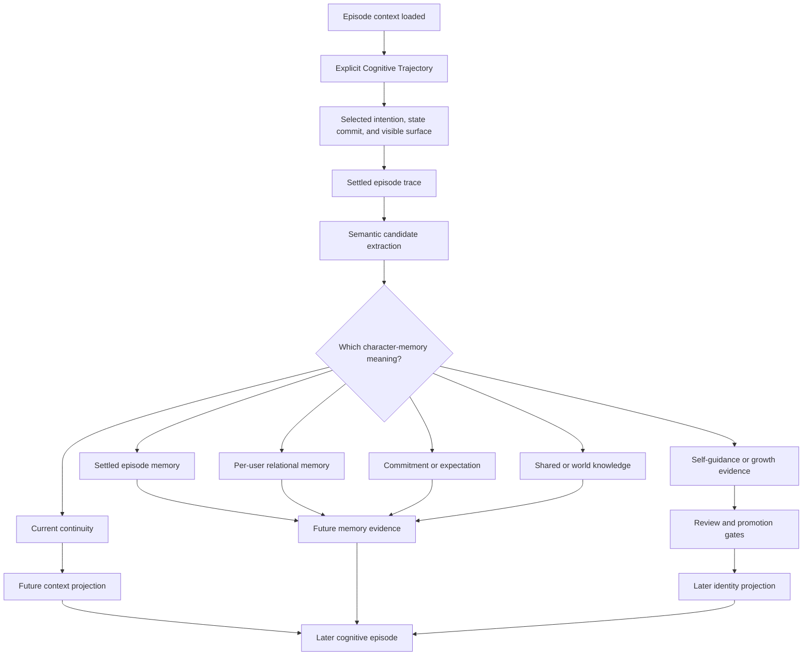
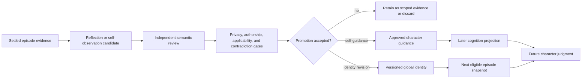
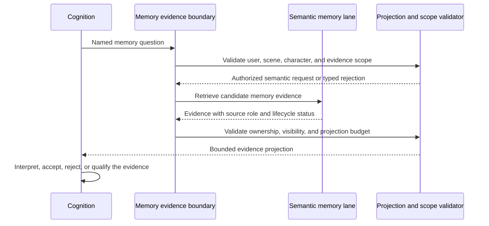

# Character Memory Architecture

## Document control

- **Status:** Draft target architecture
- **Document type:** System architecture reference
- **Execution authority:** None. Implementation requires a separately approved
  active development plan and an explicit implementation request.
- **Scope:** The semantic meaning, ownership, lifecycle, projection, and
  character-level consequences of retained experience.
- **Out of scope:** Physical storage, database schemas, indexes, embedding
  strategy, cache behavior, adapter contracts, and project implementation
  layout.
- **Current implementation anchors:** the [Explicit Cognitive Trajectory
  Architecture](explicit_cognitive_trajectory_architecture.md), [Cognition
  Contracts Reference](cognition_contracts_design.md), [Conversation Progress
  ICD](../../src/kazusa_ai_chatbot/conversation_progress/README.md:3),
  [Internal Monologue Residue
  ICD](../../src/kazusa_ai_chatbot/internal_monologue_residue/README.md:16),
  [Reflection Cycle
  ICD](../../src/kazusa_ai_chatbot/reflection_cycle/README.md:22), and
  [Character Identity Growth
  ICD](../../src/kazusa_ai_chatbot/character_identity_growth/README.md:1).
- **Source context:** This draft incorporates the supplied memory comparison
  and a read-only code evidence review as design input. Those materials are
  non-normative; repository source, module ICDs, and current architecture
  references remain authoritative for implemented behavior.

## Executive decision

Character memory should be treated as **retained semantic continuity**, not as
a storage hierarchy and not as a transcript archive.

It answers questions such as:

- What happened that still matters to the character?
- What does this user mean to the character because of prior experience?
- What remains unresolved?
- What did the character promise or come to expect?
- What facts can support a future interpretation?
- What has the character learned about herself?

The target lifecycle is:

```text
settled episode
  -> semantic memory candidate
  -> scope and meaning classification
  -> retained memory lane
  -> future evidence projection
  -> Explicit Cognitive Trajectory interpretation
  -> later character judgment
```

The memory system provides evidence. The [Explicit Cognitive Trajectory
Architecture](explicit_cognitive_trajectory_architecture.md) decides what that
evidence means now, whether it changes relationship state or goals, and whether
the character should speak or act.

“Short-term”, “medium-term”, and “long-term” are useful analytical shorthand,
but they are not the canonical architecture. The target semantic lanes are:

- current continuity;
- settled episode memory;
- per-user relational memory;
- commitments and expectations;
- shared or world knowledge;
- character self-guidance;
- approved identity revision.

Private residue and past-dialog continuity are adjacent, bounded cognition
inputs. They are not automatically durable character memory.

## 1. Design outcomes

The target architecture must provide the following system properties.

### 1.1 Character-relevant retention

Memory preserves meaning that can affect future character judgment. It does not
preserve every message with equal authority. A memory candidate must explain
why an experience could matter later, to whom it belongs, and what kind of
future question may use it.

### 1.2 Explicit ownership and scope

Every retained meaning has an owner and a scope. A fact about one user cannot
silently become a fact about another user or a global character identity. A
group observation remains group-scoped unless deterministic attribution and
semantic review establish a narrower owner.

### 1.3 Evidence without semantic abdication

Memory retrieval returns evidence with provenance and an intended semantic
role. It does not decide whether the character trusts someone, forgives
someone, agrees with a fact, accepts a request, or should speak.

### 1.4 Relationship continuity without scalar affinity

Relational memory supports multi-axis relationship state: familiarity,
positive regard, trust, attachment, closeness, care, boundary safety,
exclusivity, unresolved injury, and salience. A single affinity value cannot
represent these meanings.

### 1.5 Future-oriented continuity

Promises, accepted requests, open loops, and expectations are retained as
future-oriented character context. A due commitment re-enters cognition; it
does not authorize contact, retirement, or wording by itself.

### 1.6 Controlled self-memory

The character may retain self-guidance and may eventually revise global
identity, but these are different products with different thresholds. Raw
reflection, user-imposed identity, private residue, and unreviewed candidates
cannot become global character memory.

### 1.7 Temporal honesty

The architecture distinguishes:

```text
candidate created
  -> candidate accepted
  -> memory retained
  -> memory retrievable
  -> evidence selected
  -> evidence included in cognition
  -> evidence influences judgment
```

A successful post-turn write does not mean that the current response used the
new memory, and a retrievable memory does not mean that cognition selected or
believed it.

### 1.8 Bounded semantic projection

The local model receives a small semantic explanation of memory rather than
raw rows, internal identifiers, storage structure, or unexplained numeric
state. Projection is a correctness boundary, not merely a prompt optimization.

## 2. Architectural boundaries

The following ownership boundaries are normative for the target.

| Boundary | Semantic owner | Deterministic owner | Result |
| --- | --- | --- | --- |
| Episode settlement | Cognition and downstream semantic stages establish what occurred and what was committed | Delivery and lifecycle settlement establish that the episode is complete | A settled episode suitable for post-turn interpretation |
| Memory candidate extraction | Consolidation interprets character-relevant meaning | Candidate source, ownership, and eligibility are validated | A typed semantic memory candidate |
| Lane classification | Semantic reviewers distinguish episode, relational, commitment, fact, self-guidance, and identity meaning | Scope, privacy, promotion class, and retention policy are enforced | A candidate assigned to a permitted lane |
| Memory retention | The owning semantic lane determines what the candidate means | Persistence eligibility, deduplication, replacement, and lifecycle boundaries are enforced | A retained memory projection |
| Memory recall | A retrieval specialist returns evidence relevant to a named semantic need | Scope, capability, limits, and evidence contract are enforced | A bounded evidence projection |
| Relationship state | Cognition interprets relational evidence and proposes current meaning | User ownership, axis bounds, replacement, and conflict rules are enforced | A current multi-axis relationship state |
| Commitments | Cognition determines whether an interaction creates or retires an obligation | Acceptance evidence, owner, due state, and execution prerequisites are enforced | A future-oriented commitment or lifecycle decision |
| Self-memory | Reflection and identity stages propose character-owned meaning | Privacy, authorship, applicability, contradiction, lineage, and promotion gates are enforced | Self-guidance or an approved identity revision |
| Cognition handoff | Cognition decides whether memory evidence matters now | Evidence scope, provenance, and projection limits are enforced | Memory-informed appraisal and goal input |
| Surface expression | L3 and dialog express the committed intention | Surface and delivery contracts are validated | Visible wording with no memory reinterpretation |

The important rule is that a downstream layer may reject or constrain a memory
projection, but it cannot silently take over the upstream semantic question.
Memory cannot become persona by retrieval. Cognition cannot rewrite historical
memory merely because a response would be easier. Dialog cannot convert a
memory into a new stance after state commit.

## 3. Character-memory lifecycle

The target lifecycle begins after the current episode has settled. The current
response path loads eligible prior memory before cognition; new durable meaning
is normally produced afterward.



### 3.1 Lifecycle rules

1. **The current episode is authoritative for current judgment.** Historical
   memory supports interpretation but cannot override current accepted
   evidence without a new cognitive decision.
2. **The episode settles before durable consolidation.** Primary cognition,
   action results, surface formation, and delivery tracking determine what the
   episode actually became.
3. **Consolidation creates candidates, not automatic truth.** A candidate must
   be assigned meaning, scope, owner, and future use before it becomes a
   retained memory.
4. **Memory writes are causally later than the response they describe.** A new
   memory cannot alter the response that produced it.
5. **Retrieval re-enters cognition.** Evidence cannot jump directly to L3,
   dialog, durable stance, or identity.
6. **Promotion creates a later snapshot.** An approved identity revision
   affects a later eligible episode, not the episode that generated its
   evidence.

## 4. Semantic memory model

### 4.1 Memory, state, evidence, and identity

These concepts must remain separate.

| Concept | Meaning | Authority |
| --- | --- | --- |
| **Memory** | Retained meaning from a previous experience | Supports future interpretation |
| **Current state** | What is true about the character or relationship now | Cognition and validated state reduction |
| **Evidence** | A bounded projection of memory offered for a named question | Retrieval and projection boundary |
| **Stance** | The character’s current position in this episode | Current cognition |
| **Self-guidance** | Approved general guidance for future character behavior | Character-owned, scoped or promoted |
| **Identity revision** | A versioned change to the character’s global self-model | Independent growth and promotion boundary |

For example, “the user once broke a promise” is episode or relational memory.
“Trust is currently low” is relationship state. “I should be cautious about
promises” may become self-guidance. Only a separately promoted revision can
change global identity.

### 4.2 Memory lanes and adjacent continuity products

| Lane or product | Character question | Primary future consumer | Authority boundary |
| --- | --- | --- | --- |
| **Current continuity** | What is still active in this conversation or scene? | Episode projection and cognition | Bounded and replaceable; not automatically durable |
| **Settled episode memory** | What happened, what changed, and what remains unresolved? | Future episode evidence and consolidation | Must originate from a settled episode |
| **Per-user relational memory** | What does this user mean to the character because of prior experience? | Relationship appraisal and user-scoped cognition | Bound to one canonical user |
| **Commitments and expectations** | What did the character accept, promise, expect, or leave pending? | Future cognition and commitment lifecycle | Requires acceptance evidence and an explicit owner |
| **Shared or world knowledge** | What stable fact may inform character interpretation? | Evidence retrieval and context projection | Fact evidence, not automatic stance or identity |
| **Character self-guidance** | What general behavior or self-understanding may guide future episodes? | Deliberative cognition | Requires character authorship and semantic review |
| **Identity revision** | What globally changes who the character is? | Next-episode identity snapshot | Requires promotion, applicability, privacy, and lineage gates |
| **Private residue** | What bounded tension or expectation remains after an episode? | Declared goal-cognition branches | Adjacent continuity input; not durable memory or public evidence |
| **Past-dialog continuity** | What did the character previously say in a specifically linked exchange? | Goal cognition for that linked exchange | Trace-linked context; not arbitrary historical retrieval |

### 4.3 Analytical time horizons

The evidence supports a useful mapping, but the mapping must not become a
canonical API vocabulary:

| Analytical shorthand | Target semantic interpretation |
| --- | --- |
| Short-term or working memory | Current continuity, active episode context, bounded residue, and recent relevant references |
| Medium-term or episode memory | Settled episode meaning, unresolved threads, outcomes, and accepted commitments |
| Long-term or persistent memory | Per-user relational memory, shared/world facts, self-guidance, and approved identity revisions |

The third row is intentionally not one “long-term memory” lane. Different
long-lived meanings have different owners, privacy boundaries, and effects on
character judgment.

## 5. Current continuity and episode memory

### 5.1 Current continuity

Current continuity is the character’s active sense of what still matters in the
present conversation or scene. It may include:

- the current thread;
- the user’s current goal;
- an unresolved blocker;
- an emotional trajectory;
- established scene facts;
- lifecycle events;
- recent commitments and expectations;
- bounded recent references.

Current continuity is not the same as the current stance. A recorded historical
stance or user goal is evidence about what previously happened; cognition still
decides the current stance and current goal.

Current continuity is also not automatically durable character memory. It may
expire, be superseded by a settled episode, or be compacted into a more durable
episode meaning.

### 5.2 Settled episode memory

Episode memory preserves the character significance of a completed interaction.
It should answer:

```text
What happened?
  -> what changed?
  -> what did the character or user commit to?
  -> what remains unresolved?
  -> when could this matter again?
```

It is not a transcript summary. It is a semantic account of the episode’s
future relevance.

The [Conversation Progress
ICD](../../src/kazusa_ai_chatbot/conversation_progress/README.md:50) describes
the factual continuity path as loading before cognition and recording after a
visible response or settled silence. The [Cognition Contracts
Reference](cognition_contracts_design.md:587) defines a settled episode trace
as an immutable consolidation input after primary cognition, action, surface,
and delivery tracking.

### 5.3 Episode memory authority

- Current accepted input and current accepted response are the authoritative
  sources for episode changes.
- Later consolidation may interpret the episode, but it cannot rewrite the
  historical decision context.
- An episode may create evidence for relationship change, a commitment, a
  shared fact, or self-guidance.
- An episode does not automatically create global identity.
- A missing or expired memory projection is normal forgetting, not necessarily
  a system failure.

## 6. Private residue and past-dialog continuity

Private residue and past-dialog continuity belong in this architecture because
they affect how the character carries experience forward, but they must remain
distinct from durable character memory.

### 6.1 Private residue

Private residue is a short-lived first-person explanation of why the character
may still feel, expect, defend, hesitate, or carry tension after an episode.
It is continuity pressure, not truth authority.

The [Internal Monologue Residue
ICD](../../src/kazusa_ai_chatbot/internal_monologue_residue/README.md:16)
establishes that residue is not durable memory, reflection, dialog, or action
planning. It is available only to declared goal-cognition branches and is
excluded from L1, appraisal, action planning, L3, dialog, scheduler, durable
writers, and reflection.

Therefore:

- residue may influence a future deliberative goal branch;
- residue cannot directly change relationship state;
- residue cannot become public evidence;
- residue cannot promote itself into self-guidance or identity;
- residue needs bounded scope, recency, and forgetting.

### 6.2 Past-dialog continuity

Past-dialog continuity is narrower than general conversation memory. It applies
only when a structural path has attached a specific earlier character-authored
dialogue to the current question.

The [Past-Dialog Cognition
ICD](../../src/kazusa_ai_chatbot/past_dialog_cognition/README.md:20)
describes missing trace data as normal forgetting and projects selected parsed
cognition fields rather than raw traces. Only goal cognition receives the
result.

Past-dialog continuity therefore means:

```text
specific linked prior utterance
  -> bounded parsed context
  -> goal-cognition interpretation
```

It is not permission to retrieve arbitrary historical text, and it must not
become a public RAG source without a separate evidence decision.

## 7. Per-user relational memory

### 7.1 Relational memory is multi-axis

Per-user relational memory is the experiential basis for current relationship
state. It must preserve distinct meanings such as:

- familiarity;
- positive regard;
- trust;
- attachment;
- desired and perceived closeness;
- care;
- boundary safety;
- exclusivity;
- unresolved injury;
- salience.

These axes must not collapse into a single affinity score. Trust, closeness,
permission, and warmth are different semantic questions.

### 7.2 Memory, relationship state, and current stance

The relationship path has three levels:

1. **Relational memory:** What past interaction evidence supports.
2. **Relationship state:** The current multi-axis descriptive interpretation of
   that evidence.
3. **Current stance:** What the character decides about this episode and this
   user now.

Relationship state is context, not a permission matrix. Current-turn stance
must cite current-episode evidence and remains owned by cognition. The
[Cognition Core V2 README](../../src/kazusa_ai_chatbot/cognition_core_v2/README.md:252)
and relationship state model establish this distinction.

### 7.3 Ownership invariants

- A per-user memory has one canonical global-user owner.
- A private fact about user A cannot change the public target, ownership, or
  relationship state of user B.
- Group ambient context and participant-specific memory remain separate.
- Group-derived meaning becomes user-specific only when attribution resolves
  exactly one user.
- A current episode can confirm, weaken, or contradict old relational memory.
- A current-turn willingness is not automatically a durable relationship
  update.
- Cross-user generalization requires an explicit character-owned abstraction
  and the same privacy and promotion gates as other global meaning.

## 8. Commitments and expectations

Commitments are future-oriented character memory. They are not merely facts
about what was said; they define what the character may later need to remember,
revisit, complete, defer, or retire.

### 8.1 Commitment formation

A commitment should require:

- a user or scene request;
- evidence that the character accepted or assumed the obligation;
- an explicit owner;
- a recognizable intended outcome;
- a future lifecycle such as pending, due, completed, deferred, or retired.

User intent alone is insufficient. A request that the character never accepted
must not become a promise.

### 8.2 Commitment recall

When a commitment becomes due, the system should:

1. reintroduce the commitment as scoped evidence;
2. let cognition decide whether it still matters;
3. check current context, relationship, and boundaries;
4. decide whether to act, speak, defer, clarify, or remain silent.

The scheduler or trigger mechanism may make a commitment due, but it does not
authorize autonomous contact, decide retirement, or compose wording. The
[Calendar Scheduler ICD](../../src/kazusa_ai_chatbot/calendar_scheduler/README.md:31)
and [Self-Cognition ICD](../../src/kazusa_ai_chatbot/self_cognition/README.md:295)
support this separation.

### 8.3 Commitment forgetting

A commitment should not disappear merely because it is old or overdue. It
requires a semantic lifecycle decision such as completion, cancellation,
replacement, or deliberate retirement.

## 9. Shared and world knowledge

Shared or world knowledge supplies stable facts that can support future
character interpretation:

- character-world facts;
- shared scene facts;
- named entities;
- durable concepts;
- facts that have passed an explicit sharing boundary.

This lane is factual context, not automatic persona.

The memory evidence boundary distinguishes current-user continuity from shared
character/world material. Conversation evidence remains factual history and
does not automatically become persona, judgment, or a future goal.

Ordinary chat should not silently promote a private user detail into shared
world knowledge. Shared promotion requires an explicit semantic review and
privacy decision.

## 10. Self-guidance and identity revision

### 10.1 Two character-owned self-memory lanes

The architecture must separate:

1. **Character self-guidance:** Approved general advice or behavioral
   orientation for future cognition.
2. **Character identity revision:** A versioned change to the character’s
   global self-model.

Self-guidance can influence future deliberation without changing the complete
identity. Identity revision changes what the character is understood to be in
later episode snapshots.

### 10.2 Promotion lifecycle



### 10.3 Identity requirements

An identity revision requires:

- character authorship rather than user-imposed identity;
- evidence from accepted character behavior, thought, or settled episodes;
- privacy stripping and removal of unnecessary user detail;
- cross-context applicability;
- contradiction handling;
- evidence lineage and root-episode identity;
- independent review;
- a later episode snapshot boundary.

The [Character Identity Growth
ICD](../../src/kazusa_ai_chatbot/character_identity_growth/README.md:1)
defines identity growth as a character-owned boundary. User facts, relationship
facts, scoped residue, and raw transcripts are outside that boundary.

Neither raw reflection nor an unreviewed candidate is live character memory.

## 11. Memory retrieval as remembering

Memory retrieval begins with a semantic need, not with a physical query.



### 11.1 Evidence roles

A memory projection should communicate its semantic role, for example:

- current-episode evidence;
- supporting user history;
- relationship evidence;
- commitment or expectation;
- shared/world context;
- self-guidance;
- historical or superseded context.

The model should receive a concise meaning, qualitative recency, uncertainty
or lifecycle status, and a bounded evidence handle. It should not need to
infer these meanings from raw identifiers or physical storage shape.

### 11.2 Evidence precedence

The target precedence is:

1. current accepted episode evidence;
2. current validated state and relationship context;
3. active commitments and current continuity;
4. scoped user history;
5. shared/world evidence;

This ordering does not mean that older memory is unimportant. It means that
historical evidence must be interpreted through current evidence and current
scope. Approved self-guidance and identity projection are standing
character-owned context, not a lower-ranked historical fact. They are projected
through their own authorship and promotion boundaries and must not be treated
as interchangeable with retrieved evidence.

### 11.3 Retrieval is not influence

The following are separate decisions:

- whether a memory is eligible for retrieval;
- whether retrieval found it;
- whether the projection contains it;
- whether cognition selects it;
- whether cognition considers it reliable;
- whether it changes state, stance, or goals.

The memory boundary must not report “the character remembers this” merely
because a retrieval result exists.

## 12. Consolidation and candidate meaning

Consolidation is the process that turns a settled episode into possible future
character continuity. It is not a generic summarizer and not a mechanism for
copying all conversation content into memory.

### 12.1 Candidate categories

A settled episode may produce candidates for:

- episode meaning;
- factual context;
- relational evidence;
- relationship-axis update;
- accepted commitment;
- unresolved expectation;
- interaction style;
- self-guidance;
- identity revision evidence.

Each candidate must be assigned a lane and a semantic owner. A candidate that
does not have a clear future question should remain ephemeral or be rejected.

### 12.2 Consolidation gates

Before a candidate becomes durable or promotable, the architecture should
evaluate:

- source episode and evidence lineage;
- owner and scope;
- privacy and sensitivity;
- character authorship;
- future usefulness;
- conflict with existing memory;
- duplicate or superseded meaning;
- applicability beyond the originating interaction;
- whether the candidate is fact, relationship evidence, commitment,
  self-guidance, or identity.

These gates determine eligibility and provenance. They do not invent semantic
meaning that the episode did not support.

### 12.3 Consolidation and current cognition

Consolidation is causally after the visible response. It may prepare future
memory evidence, but it cannot:

- change the selected intention of the completed episode;
- rewrite the current episode’s relationship judgment;
- route raw reflection into the current cognition pass;
- make a user request into a character promise without acceptance;
- make a private fact globally applicable without promotion.

## 13. Semantic projection for local models

The model should receive what the memory means, not how it is stored.

### 13.1 Projection content

A bounded memory projection should communicate:

- the semantic memory role;
- the owner and human-readable scope;
- what happened or what is known;
- why it may matter to the current question;
- qualitative recency or lifecycle status;
- uncertainty, contradiction, or supersession;
- an opaque evidence handle when traceability is required.

### 13.2 Projection exclusions

Normal cognition context should exclude:

- raw database schemas;
- internal row identifiers;
- platform identifiers;
- unbounded transcripts;
- unexplained numeric relationship values;
- private source details not needed for the current question;
- raw prompts or protected model traces;
- storage or migration terminology.

The evidence review confirms that semantic projections remove internal identifiers
and storage metadata, while preserving the memory scope and evidence meaning.
This is a correctness boundary for a local or weaker model.

### 13.3 Context budget

Memory projection must be bounded. If too much memory is eligible, the system
should reduce it by semantic relevance, scope, recency, and lifecycle rather
than asking the model to discover the important rows itself.

The normal path should use one clear memory question and a small evidence set.
Broad recall is a degraded or explicitly requested capability, not the default
for every turn.

## 14. Observability and replay

Memory behavior must be inspectable without exposing protected model material.

### 14.1 Semantic memory trace

A semantic trace should be able to show:

- the settled episode that produced a candidate;
- the candidate’s semantic lane;
- owner and scope class;
- source and evidence role;
- candidate acceptance, rejection, or deferral;
- replacement or supersession decision;
- retrieval eligibility;
- projection and selection status;
- promotion or identity disposition.

### 14.2 Memory lifecycle states

The trace should distinguish:

```text
candidate
  -> accepted
  -> retained
  -> retrievable
  -> projected
  -> selected by cognition
  -> influential in judgment
  -> promoted, superseded, retired, or forgotten
```

These states should not be collapsed into a single “remembered” flag.

### 14.3 Protected evidence

Protected diagnostics may retain raw provider output, prompts, internal
identifiers, or regeneration details for authorized diagnosis. Protected
material is not ordinary character memory and is not a default cognition input.

## 15. Target invariants

The following invariants define architectural acceptance.

1. **Memory is not a transcript.** Retention preserves character-relevant
   meaning, not every message equally.
2. **Analytical horizons are not contracts.** Short-, medium-, and long-term
   are explanatory mappings, not canonical memory interfaces.
3. **Current evidence has priority.** Historical memory supports but does not
   silently override the current accepted episode.
4. **Evidence is not stance.** Retrieval does not decide what the character
   believes, wants, permits, or says.
5. **Memory is scoped.** Every user-specific meaning has one canonical owner.
6. **Relationship state is multi-axis.** Trust, closeness, care, boundaries,
   and injury cannot be collapsed into one affinity score.
7. **Recorded historical stance is not current stance.** Cognition decides the
   current episode’s stance.
8. **Private residue is not durable memory.** Residue is bounded,
   goal-cognition-only continuity pressure.
9. **Past-dialog continuity is trace-linked.** It is not arbitrary historical
   retrieval.
10. **Commitments require acceptance.** User intent alone cannot create a
    character obligation.
11. **Due does not mean authorized.** A commitment trigger re-enters cognition
    and does not authorize contact, retirement, or wording.
12. **Shared facts are not identity.** Shared/world evidence does not silently
    become persona or global self-understanding.
13. **Reflection is not promotion.** Raw reflection and unreviewed candidates
    cannot enter ordinary global cognition.
14. **Identity changes later.** A promoted revision affects a later episode
    snapshot, not the episode that produced it.
15. **Post-turn memory is causally later.** New durable meaning cannot alter the
    response that created it.
16. **Retrieval is not influence.** Stored, retrievable, projected, selected,
    and behaviorally influential are separate states.
17. **Projection is semantic.** Local models receive meaning, scope, lifecycle,
    and bounded evidence—not raw storage structure.
18. **Downstream surfaces do not reinterpret memory.** L3 and dialog express
    the committed intention and cannot create a new memory-based stance.

## 16. Current implementation alignment

The repository already contains substantial pieces of this target:

- The [Conversation Progress
  ICD](../../src/kazusa_ai_chatbot/conversation_progress/README.md:3) defines
  bounded factual continuity that loads before cognition and is recorded after
  a visible response or settled silence.
- The [Cognition Contracts
  Reference](cognition_contracts_design.md:587) defines a settled episode trace
  as an immutable post-cognition consolidation input.
- The [Internal Monologue Residue
  ICD](../../src/kazusa_ai_chatbot/internal_monologue_residue/README.md:16)
  separates short-lived first-person residue from durable memory, reflection,
  action planning, L3, dialog, scheduling, and durable writers.
- The [Past-Dialog Cognition
  ICD](../../src/kazusa_ai_chatbot/past_dialog_cognition/README.md:20)
  limits prior-dialog context to a specifically attached trace and a declared
  cognition consumer.
- The [Recall
  ICD](../../src/kazusa_ai_chatbot/rag/recall/README.md:3) separates active
  commitments, plans, open loops, and current episode status from stance and
  durable memory ownership.
- The [Cognition Core V2
  README](../../src/kazusa_ai_chatbot/cognition_core_v2/README.md:252)
  separates multi-axis relationship context from current-turn stance and
  keeps relationship state descriptive rather than permission-authoritative.
- The [Reflection Cycle
  ICD](../../src/kazusa_ai_chatbot/reflection_cycle/README.md:22) and
  [Character Identity Growth
  ICD](../../src/kazusa_ai_chatbot/character_identity_growth/README.md:1)
  provide separate evidence, review, privacy, authorship, applicability, and
  later-snapshot boundaries for self-guidance and identity revision.
- The [Memory Evolution
  ICD](../../src/kazusa_ai_chatbot/memory_evolution/README.md:22) preserves the
  distinction between semantic memory ownership and deterministic lifecycle
  control.

The target architecture consolidates these boundaries into one character-memory
model. It does not declare every current implementation detail complete. Any
mismatch between this draft and implemented behavior must be resolved through
an explicit architecture decision and an approved implementation plan.

## 17. Adoption boundaries

This document is an architecture target, not an implementation checklist. The
following boundaries should be preserved when it is turned into execution work:

1. Establish the canonical semantic memory lanes and their ownership.
2. Define the boundary between active continuity, settled episode memory,
   operational state, and durable character memory.
3. Define the minimum memory-evidence projection consumed by cognition.
4. Verify per-user relational ownership and group attribution.
5. Verify commitment formation, due re-entry, and retirement semantics.
6. Verify private residue and past-dialog consumer isolation.
7. Verify post-turn visibility and later-episode identity projection.
8. Verify reflection, self-guidance, and identity promotion separately.
9. Add or revise code only through scoped active plans with explicit tests and
   acceptance evidence.

Each implementation slice should preserve the live response path as bounded
and inspectable. A future plan should converge existing memory and continuity
contracts on these semantic lanes rather than create a parallel generic
“memory system” beside cognition.

## 18. Open validation questions

The target still needs evidence-backed decisions for:

- the canonical distinction among active continuity, settled episode trace,
  operational state, and durable episodic memory;
- whether past-dialog continuity remains a distinct lane or becomes a declared
  subtype of private continuity;
- the exact boundary between progress obligations and durable commitments;
- the consolidation path for relationship-axis updates;
- precedence among shared lore, character self-guidance, and identity-level
  knowledge;
- the promotion boundary between character self-guidance and identity
  revision;
- the minimum evidence required for each memory-lane transition;
- the lifecycle semantics for supersession, forgetting, and deliberate
  retirement;
- the operational replay contract for memory influence without exposing
  protected traces.

These are design follow-ups, not permission to change production behavior.

## 19. Non-goals

This architecture does not:

- define database schemas, collections, indexes, or storage providers;
- define embedding, vector, keyword, or ranking algorithms;
- define TTL values, cache invalidation, or background worker schedules;
- expose raw prompts, protected traces, internal identifiers, or database rows
  to the character model;
- make memory retrieval responsible for stance, goals, permissions, or wording;
- treat private residue as durable character memory;
- turn every conversation turn into a permanent memory;
- allow a user to directly rewrite global character identity;
- replace the Explicit Cognitive Trajectory Architecture;
- replace module ICDs or executable development plans.
