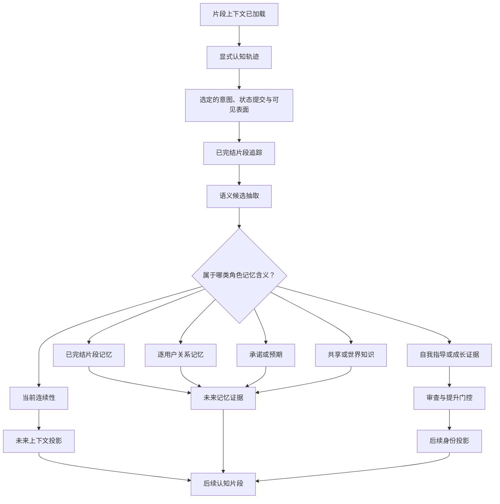
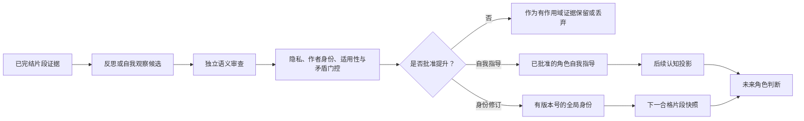
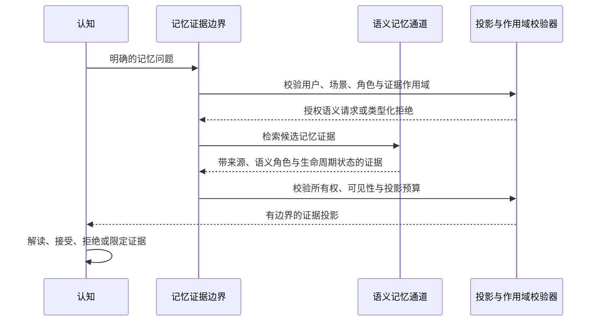

# 角色记忆架构

## 文档控制

- **状态：** 目标架构草案
- **文档类型：** 系统架构参考
- **执行授权：** 无。实施需要另行批准且处于有效状态的开发计划，以及明确的实施请求。
- **范围：** 留存的经历所承载的语义含义、所有权、生命周期、投影与角色层面后果。
- **范围之外：** 物理存储、数据库模式、索引、嵌入策略、缓存行为、适配器合约与项目实施布局。
- **当前实现锚点：** [显式认知轨迹架构](explicit_cognitive_trajectory_architecture.md)、[认知合约参考](cognition_contracts_design.md)、[对话进展 ICD](../../src/kazusa_ai_chatbot/conversation_progress/README.md:3)、[私念残留 ICD](../../src/kazusa_ai_chatbot/internal_monologue_residue/README.md:16)、[反思循环 ICD](../../src/kazusa_ai_chatbot/reflection_cycle/README.md:22)、[角色身份成长 ICD](../../src/kazusa_ai_chatbot/character_identity_growth/README.md:1)。
- **资料来源：** 本草案将所提供的记忆对比分析与只读代码证据审查作为设计输入纳入。这些材料不具规范性；对于已实现的行为，仓库源码、模块 ICD 与当前架构参考仍然具有权威性。

## 总体决策

角色记忆应被视为**留存的语义连续性**，而不是存储层级，也不是转录档案。

它要回答这类问题：

- 发生过什么、对角色仍然重要的事？
- 由于过往经历，这位用户对角色意味着什么？
- 还有什么悬而未决？
- 角色承诺过什么，或开始预期什么？
- 哪些事实可以支撑未来的解读？
- 角色对自己了解了什么？

目标生命周期为：

```text
已完结片段
  -> 语义记忆候选
  -> 作用域与含义分类
  -> 留存记忆通道
  -> 未来证据投影
  -> 显式认知轨迹解读
  -> 后续角色判断
```

记忆系统提供证据。[显式认知轨迹架构](explicit_cognitive_trajectory_architecture.md)决定这些证据现在意味着什么、是否改变关系状态或目标，以及角色是否应该说话或行动。

“短期”“中期”“长期”是有用的分析简写，但不是规范架构。目标语义通道为：

- 当前连续性；
- 已完结片段记忆；
- 逐用户关系记忆；
- 承诺与预期；
- 共享或世界知识；
- 角色自我指导；
- 已批准的身份修订。

私念残留与过往对话连续性是与记忆相邻、有边界的认知输入。它们不会自动成为持久的角色记忆。

## 1. 设计目标

目标架构必须提供以下系统属性。

### 1.1 与角色相关的留存

记忆保留可能影响未来角色判断的含义。它不会以同等权威保留每一条消息。记忆候选必须说明一段经历将来为什么可能重要、它属于谁，以及哪类未来问题可能用到它。

### 1.2 显式所有权与作用域

每一条被留存的含义都有所有者和作用域。关于一位用户的事实不能悄然变成关于另一位用户或全局角色身份的事实。群组观察保持群组作用域，除非确定性归属与语义审查确立了更窄的所有者。

### 1.3 有证据但不放弃语义判断

记忆检索返回带来源与指定语义角色的证据。它不决定角色是否信任某人、原谅某人、认同某个事实、接受某个请求，或是否应该说话。

### 1.4 无标量亲和度的关系连续性

关系记忆支撑多轴关系状态：熟悉度、积极关注、信任、依恋、亲近程度、关怀、边界安全、排他性、未愈合的伤害与显著性。单一的亲和度数值无法表达这些含义。

### 1.5 面向未来的连续性

承诺、已接受的请求、未关闭的回路与预期作为面向未来的角色上下文被留存。到期的承诺会重新进入认知；它本身不授权联系、终止或措辞。

### 1.6 受控的自我记忆

角色可以留存自我指导，并最终修订全局身份，但这两者是不同的产物，有不同的门槛。原始反思、用户强加的身份、私念残留与未经审查的候选都不能成为全局角色记忆。

### 1.7 时间诚实

架构区分：

```text
候选创建
  -> 候选接受
  -> 记忆留存
  -> 记忆可检索
  -> 证据被选中
  -> 证据进入认知
  -> 证据影响判断
```

回合后写入成功不代表当前回应已经使用了新记忆；可检索的记忆也不代表认知选中或相信了它。

### 1.8 有边界的语义投影

本地模型接收一小段关于记忆的语义说明，而不是原始行、内部标识符、存储结构或未解释的数值状态。投影是正确性边界，而不仅仅是提示词优化。

## 2. 架构边界

以下所有权边界对目标具有规范性。

| 边界 | 语义所有者 | 确定性所有者 | 结果 |
| --- | --- | --- | --- |
| 片段完结 | 认知与下游语义阶段确立发生了什么、承诺了什么 | 投递与生命周期管理确认片段已完成 | 适合回合后解读的已完结片段 |
| 记忆候选抽取 | 整合解读角色相关的含义 | 校验候选来源、所有权与资格 | 一个类型化语义记忆候选 |
| 通道分类 | 语义审查者区分片段、关系、承诺、事实、自我指导与身份含义 | 强制执行作用域、隐私、提升类别与留存策略 | 一个被分配到允许通道的候选 |
| 记忆留存 | 所属语义通道决定候选的含义 | 强制执行持久化资格、去重、替换与生命周期边界 | 一个已留存的记忆投影 |
| 记忆检索 | 检索专家为明确的语义需求返回相关证据 | 强制执行作用域、能力、限制与证据合约 | 一个有边界的证据投影 |
| 关系状态 | 认知解读关系证据并提出当前含义 | 强制执行用户所有权、轴边界、替换与冲突规则 | 一个当前多轴关系状态 |
| 承诺 | 认知决定互动是否创建或结束一项义务 | 强制执行接受证据、所有者、到期状态与执行前置条件 | 一个面向未来的承诺或生命周期决定 |
| 自我记忆 | 反思与身份阶段提出角色自有的含义 | 强制执行隐私、作者身份、适用性、矛盾、谱系与提升门控 | 自我指导或一个已批准的身份修订 |
| 认知交接 | 认知决定记忆证据现在是否重要 | 强制执行证据作用域、来源与投影限制 | 记忆告知的评估与目标输入 |
| 表面表达 | L3 与对话表达已提交的意图 | 校验表面与投递合约 | 不重新解释记忆的可见措辞 |

关键规则是：下游层可以拒绝或约束记忆投影，但不能静默接管上游的语义问题。记忆不能因被检索而成为角色人设。认知不能仅仅因为回应更容易就改写历史记忆。对话不能在状态提交之后把记忆转换成新的立场。

## 3. 角色记忆生命周期

该生命周期在当前片段完结后开始。当前回应路径在认知之前加载符合资格的既有记忆；新的持久含义通常在之后产生。



### 3.1 生命周期规则

1. **当前片段对当前判断具有权威性。** 历史记忆支撑解读，但不能在没有新的认知决定的情况下覆盖当前已接受的证据。
2. **片段先完结，再进行持久整合。** 主认知、动作结果、表面形成与投递追踪决定片段实际变成了什么。
3. **整合创建候选，而非自动真相。** 候选在被赋予含义、作用域、所有者和未来用途之后，才能成为已留存的记忆。
4. **记忆写入在因果上晚于其描述的回应。** 新记忆不能改变产生它的回应。
5. **检索重新进入认知。** 证据不能直接跳到 L3、对话、持久立场或身份。
6. **提升创建后续快照。** 已批准的身份修订影响后续符合条件的片段，而不是产生其证据的那个片段。

## 4. 语义记忆模型

### 4.1 记忆、状态、证据与身份

这些概念必须保持分离。

| 概念 | 含义 | 权威 |
| --- | --- | --- |
| **记忆** | 来自以往经历的留存含义 | 支撑未来解读 |
| **当前状态** | 角色或关系现在真实成立的内容 | 认知与经校验的状态归约 |
| **证据** | 针对明确问题提供的、有边界的记忆投影 | 检索与投影边界 |
| **立场** | 角色在本片段中的当前位置 | 当前认知 |
| **自我指导** | 已批准的、面向未来角色行为的通用指导 | 角色自有、有作用域或已提升 |
| **身份修订** | 对角色全局自我模型的一次有版本号的变更 | 独立的成长与提升边界 |

例如，“用户曾经食言”是片段记忆或关系记忆。“当前信任度较低”是关系状态。“我应对承诺保持谨慎”可能成为自我指导。只有另行提升的修订才能改变全局身份。

### 4.2 记忆通道与相邻连续性产物

| 通道或产物 | 角色问题 | 主要未来消费者 | 权威边界 |
| --- | --- | --- | --- |
| **当前连续性** | 本次对话或场景中仍活跃的内容是什么？ | 片段投影与认知 | 有边界且可替换；不会自动持久化 |
| **已完结片段记忆** | 发生了什么、改变了什么、还有什么未解决？ | 未来片段证据与整合 | 必须源自已完结片段 |
| **逐用户关系记忆** | 由于过往经历，这位用户对角色意味着什么？ | 关系评估与用户作用域认知 | 绑定到一位规范用户 |
| **承诺与预期** | 角色接受了、承诺了、预期了什么，或留下了什么待办？ | 未来认知与承诺生命周期 | 需要接受证据与显式所有者 |
| **共享或世界知识** | 哪些稳定事实可能为角色解读提供信息？ | 证据检索与上下文投影 | 事实证据，而非自动立场或身份 |
| **角色自我指导** | 哪些通用行为或自我理解可能指导未来片段？ | 深思认知 | 需要角色自身的作者身份与语义审查 |
| **身份修订** | 什么在全局上改变了角色是谁？ | 下一片段身份快照 | 需要提升、适用性、隐私与谱系门控 |
| **私念残留** | 片段结束后仍留下哪种有边界的张力或预期？ | 已声明的目标认知分支 | 相邻连续性输入；不是持久记忆或公开证据 |
| **过往对话连续性** | 角色在特定关联的交流中此前说过什么？ | 该关联交流的目标认知 | 与追踪关联的上下文；不是任意历史检索 |

### 4.3 分析性时间视界

证据支持一种有用的映射，但该映射不能成为规范的接口术语：

| 分析简写 | 目标语义解读 |
| --- | --- |
| 短期或工作记忆 | 当前连续性、活跃片段上下文、有边界残留与近期相关引用 |
| 中期或片段记忆 | 已完结片段含义、未关闭线索、结果与已接受的承诺 |
| 长期或持久记忆 | 逐用户关系记忆、共享/世界事实、自我指导与已批准的身份修订 |

第三行刻意不是单一的“长期记忆”通道。不同的长期含义有不同的所有者、隐私边界与对角色判断的影响。

## 5. 当前连续性与片段记忆

### 5.1 当前连续性

当前连续性是角色对当前对话或场景中仍然重要内容的持续感知。它可以包括：

- 当前线程；
- 用户当前目标；
- 未解决的阻塞项；
- 情绪轨迹；
- 已确立的场景事实；
- 生命周期事件；
- 近期承诺与预期；
- 有边界的近期引用。

当前连续性不等于当前立场。记录在案的历史立场或用户目标是关于之前发生什么的证据；认知仍然决定当前立场与当前目标。

当前连续性也不自动是持久角色记忆。它可能过期、被已完结片段取代，或被压缩成更持久的片段含义。

### 5.2 已完结片段记忆

片段记忆保留一次已完成互动的角色意义。它应回答：

```text
发生了什么？
  -> 改变了什么？
  -> 角色或用户承诺了什么？
  -> 还有什么未解决？
  -> 什么情况下它可能再次重要？
```

它不是转录摘要。它是片段未来相关性的语义说明。

[对话进展 ICD](../../src/kazusa_ai_chatbot/conversation_progress/README.md:50) 将事实连续性路径描述为在认知之前加载、在可见回应或静默结束后记录。[认知合约参考](cognition_contracts_design.md:587) 将已完结片段追踪定义为在主认知、动作、表面与投递追踪之后不可变的整合输入。

### 5.3 片段记忆权威

- 当前已接受的输入与当前已接受的回应是片段变更的权威来源。
- 后续整合可以解读片段，但不能改写历史决策上下文。
- 片段可以为关系变化、承诺、共享事实或自我指导创建证据。
- 片段不会自动创建全局身份。
- 缺失或过期的记忆投影是正常遗忘，不一定是系统故障。

## 6. 私念残留与过往对话连续性

私念残留与过往对话连续性属于本架构，因为它们影响角色如何延续经历，但必须与持久角色记忆保持区分。

### 6.1 私念残留

私念残留是一种短期的第一人称说明，用来解释角色在片段结束后为什么可能仍然感受、预期、捍卫、犹豫或承受张力。它是连续性压力，不是真相权威。

[私念残留 ICD](../../src/kazusa_ai_chatbot/internal_monologue_residue/README.md:16) 确立残留不是持久记忆、反思、对话或动作规划。它仅对声明的目标认知分支可用，并被排除在 L1、评估、动作规划、L3、对话、调度器、持久化写入方与反思之外。

因此：

- 残留可以影响未来的深思目标分支；
- 残留不能直接改变关系状态；
- 残留不能成为公开证据；
- 残留不能把自己提升为自我指导或身份；
- 残留需要有边界的作用域、时效与遗忘。

### 6.2 过往对话连续性

过往对话连续性比通用对话记忆更窄。它仅在结构化路径将角色此前生成的一段特定对话关联到当前问题时适用。

[过往对话认知 ICD](../../src/kazusa_ai_chatbot/past_dialog_cognition/README.md:20) 将缺失的追踪数据描述为正常遗忘，并投影选中的已解析认知字段而非原始追踪。只有目标认知接收结果。

过往对话连续性因此意味着：

```text
特定关联中的先前话语
  -> 有边界的已解析上下文
  -> 目标认知解读
```

它不是检索任意历史文本的许可；除非经过单独的证据审查决定，否则不得成为公开的 RAG 来源。

## 7. 逐用户关系记忆

### 7.1 关系记忆是多轴的

逐用户关系记忆是当前关系状态的经验基础。它必须保留如下不同含义：

- 熟悉度；
- 积极关注；
- 信任；
- 依恋；
- 期望亲近程度与感知亲近程度；
- 关怀；
- 边界安全；
- 排他性；
- 未愈合的伤害；
- 显著性。

这些轴不能坍缩成单一的亲和度分数。信任、亲近程度、权限与温情是不同的语义问题。

### 7.2 记忆、关系状态与当前立场

关系路径有三个层次：

1. **关系记忆：** 过去互动证据支持的内容。
2. **关系状态：** 对该证据当前的多轴描述性解读。
3. **当前立场：** 角色现在对本片段和这位用户做出的决定。

关系状态是上下文，不是权限矩阵。当前回合的立场必须以当前片段证据为依据，且仍由认知负责。[认知核心 V2 ICD](../../src/kazusa_ai_chatbot/cognition_core_v2/README.md:252) 与关系状态模型确立了这一区分。

### 7.3 所有权不变量

- 逐用户记忆仅对应一位规范的全局用户所有者。
- 关于用户 A 的私密事实不能改变用户 B 的公开目标、所有权或关系状态。
- 群组环境上下文与参与者特定记忆保持分离。
- 只有当归属被确定性解析为恰好一位用户时，源自群组的含义才会成为用户特定含义。
- 当前片段可以确认、削弱或反驳旧的关系记忆。
- 当前回合的一时意愿不自动是持久关系更新。
- 跨用户泛化需要显式的角色自有抽象，以及与其他全局含义相同的隐私与提升门控。

## 8. 承诺与预期

承诺是面向未来的角色记忆。它们不只是关于说过什么的事实；它们定义角色今后可能需要记住、重新处理、完成、推迟或终止的事项。

### 8.1 承诺形成

承诺的形成至少需要：

- 一个用户或场景请求；
- 角色接受或承担义务的证据；
- 显式所有者；
- 可识别的预期结果；
- 未来生命周期，例如待处理、到期、已完成、推迟或已终止。

仅有用户意图是不够的。角色从未接受的请求不得成为承诺。

### 8.2 承诺回忆

承诺到期时，系统应：

1. 把承诺作为有作用域的证据重新引入；
2. 让认知决定它是否仍然重要；
3. 检查当前上下文、关系与边界；
4. 决定是行动、说话、推迟、澄清还是保持沉默。

调度器或触发机制可以使承诺到期，但它不授权自主联系、决定终止或编排措辞。[日历调度器 ICD](../../src/kazusa_ai_chatbot/calendar_scheduler/README.md:31) 与[自我认知 ICD](../../src/kazusa_ai_chatbot/self_cognition/README.md:295) 支撑这一分离。

### 8.3 承诺遗忘

承诺不应仅仅因为陈旧或逾期就消失。它需要一次语义生命周期决定，例如完成、取消、替换或有意终止。

## 9. 共享与世界知识

共享或世界知识提供可以支撑未来角色解读的稳定事实：

- 角色世界事实；
- 共享场景事实；
- 命名实体；
- 稳定概念；
- 已通过显式共享边界的事实。

该通道提供事实性上下文，不会自动成为角色人设。

记忆证据边界区分当前用户连续性与共享的角色/世界材料。对话证据仍然是事实历史，不会自动变成角色人设、判断或未来目标。

普通聊天不应把私密用户细节静默提升为共享世界知识。共享提升需要显式语义审查与隐私决定。

## 10. 自我指导与身份修订

### 10.1 两条角色自有的自我记忆通道

架构必须分离：

1. **角色自我指导：** 面向未来认知的已批准通用建议或行为取向。
2. **角色身份修订：** 对角色全局自我模型的一次有版本号的变更。

自我指导可以影响未来深思，而不改变完整身份。身份修订改变后续片段快照中对角色身份的理解。

### 10.2 提升生命周期



### 10.3 身份要求

身份修订需要：

- 角色自身的作者身份，而非用户强加的身份；
- 来自已接受的角色行为、思考或已完结片段的证据；
- 隐私脱敏，并移除不必要的用户细节；
- 跨上下文适用性；
- 矛盾处理；
- 证据谱系与根源片段标识；
- 独立审查；
- 后续片段快照边界。

[角色身份成长 ICD](../../src/kazusa_ai_chatbot/character_identity_growth/README.md:1) 将身份成长定义为角色自有边界。用户事实、关系事实、有作用域残留与原始转录都在该边界之外。

原始反思与未经审查的候选都不是活跃角色记忆。

## 11. 记忆检索即回忆

记忆检索始于语义需求，而不是物理查询。



### 11.1 证据角色

记忆投影应传达其语义角色，例如：

- 当前片段证据；
- 支撑性用户历史；
- 关系证据；
- 承诺或预期；
- 共享/世界上下文；
- 自我指导；
- 历史或被取代的上下文。

模型应接收简短的含义说明、定性的新近程度、不确定性或生命周期状态，以及有边界的证据句柄。它不应需要从原始标识符或物理存储形态推断这些含义。

### 11.2 证据优先级

证据优先顺序如下：

1. 当前已接受的片段证据；
2. 当前通过校验的状态与关系上下文；
3. 活跃承诺与当前连续性；
4. 有作用域的用户历史；
5. 共享/世界证据；

这个顺序不是说旧记忆不重要。它意味着历史证据必须透过当前证据与当前作用域来解读。已批准的自我指导与身份投影是常驻的角色自有上下文，而不是较低优先级的历史事实。它们通过各自的作者身份与提升边界投影，不得被视为与检索证据可互换。

### 11.3 检索不是影响

以下是彼此独立的决定：

- 记忆是否有资格被检索；
- 检索是否找到了它；
- 投影是否包含它；
- 认知是否选中它；
- 认知是否认为它可靠；
- 它是否改变状态、立场或目标。

记忆边界不得仅仅因为存在检索结果就断言“角色记得这件事”。

## 12. 整合与候选含义

整合是把已完结片段变成未来可能形成的角色连续性的过程。它不是通用摘要器，也不是把所有对话内容复制进记忆的机制。

### 12.1 候选类别

已完结片段可以为以下类别产生候选：

- 片段含义；
- 事实上下文；
- 关系证据；
- 关系轴更新；
- 已接受的承诺；
- 未解决的预期；
- 互动风格；
- 自我指导；
- 身份修订证据。

每个候选都必须被赋予通道与语义所有者。没有清晰未来问题的候选应保持短暂或拒绝。

### 12.2 整合门控

候选成为持久记忆或可提升对象之前，架构应评估：

- 来源片段与证据谱系；
- 所有者与作用域；
- 隐私与敏感性；
- 角色自身的作者身份；
- 未来有用性；
- 与现有记忆的冲突；
- 重复或被取代的含义；
- 是否适用于发起互动之外的场景；
- 候选是事实、关系证据、承诺、自我指导还是身份。

这些门控决定候选是否有资格以及其来源谱系。它们不会虚构片段未支撑的语义含义。

### 12.3 整合与当前认知

整合在因果上晚于可见回应。它可以准备未来的记忆证据，但不能：

- 改变已完结片段中被选定的意图；
- 改写当前片段的关系判断；
- 把原始反思路由进当前认知过程；
- 未经接受就把用户请求变成角色承诺；
- 未经提升就把私密事实变成全局适用。

## 13. 面向本地模型的语义投影

模型应接收记忆意味着什么，而不是记忆如何被存储。

### 13.1 投影内容

有边界的记忆投影应传达：

- 记忆的语义角色；
- 所有者与人类可读的作用域；
- 发生过什么或已知什么；
- 它为什么可能与当前问题相关；
- 定性的新近程度或生命周期状态；
- 不确定性、矛盾或被取代状态；
- 需要可追溯性时的不透明证据句柄。

### 13.2 投影排除项

普通认知上下文应排除：

- 原始数据库模式；
- 内部行标识符；
- 平台标识符；
- 无界转录；
- 未经解释的关系数值；
- 当前问题不需要的私密来源细节；
- 原始提示词或受保护模型追踪；
- 存储或迁移术语。

证据审查确认语义投影移除内部标识符与存储元数据，同时保留记忆作用域与证据含义。这对本地或较弱模型是一条正确性边界。

### 13.3 上下文预算

记忆投影必须有界。如果有太多记忆符合条件，系统应按语义相关性、作用域、新近程度与生命周期来缩减，而不是要求模型自己发现重要的记录。

常规路径应使用一个清晰的记忆问题与一小套证据。广泛回忆是降级或显式请求的能力，而不是每一回合的默认行为。

## 14. 可观测性与回放

记忆行为必须可检查，同时不暴露受保护的模型材料。

### 14.1 语义记忆追踪

语义追踪应能显示：

- 产生候选的已完结片段；
- 候选的语义通道；
- 所有者与作用域类别；
- 来源与证据角色；
- 候选被接受、拒绝或推迟的决定；
- 替换或取代决定；
- 检索资格；
- 投影与选中状态；
- 提升结果或身份处置。

### 14.2 记忆生命周期状态

追踪应区分：

```text
候选
  -> 已接受
  -> 已留存
  -> 可检索
  -> 已投影
  -> 被认知选中
  -> 影响判断
  -> 已提升、被取代、已终止或已遗忘
```

这些状态不应被折叠成单一的“已记住”标志。

### 14.3 受保护证据

受保护的诊断信息可以保留原始供应商输出、提示词、内部标识符或重新生成细节，供授权诊断使用。受保护材料不是普通角色记忆，也不是默认认知输入。

## 15. 目标不变量

以下不变量构成架构验收标准。

1. **记忆不是转录。** 留存保留角色相关的含义，而不是同等地保留每一条消息。
2. **分析性时间视界不是合约。** 短期、中期与长期是解释性映射，不是规范记忆接口。
3. **当前证据优先。** 历史记忆支撑但不会静默覆盖当前已接受的片段。
4. **证据不是立场。** 检索不决定角色相信、想要、允许或说出什么。
5. **记忆有作用域。** 每条用户特定含义都有且仅有一位规范所有者。
6. **关系状态是多轴的。** 信任、亲近程度、关怀、边界与伤害不能坍缩成单一亲和度分数。
7. **记录在案的历史立场不是当前立场。** 认知决定当前片段的立场。
8. **私念残留不是持久记忆。** 残留是有边界、仅限目标认知的连续性压力。
9. **过往对话连续性以追踪为纽带。** 它不是任意历史检索。
10. **承诺需要接受。** 仅有用户意图不能创建角色义务。
11. **到期不意味着已授权。** 承诺触发重新进入认知，不授权联系、终止或措辞。
12. **共享事实不是身份。** 共享/世界证据不会静默变成角色人设或全局自我理解。
13. **反思不是提升。** 原始反思与未经审查的候选不能进入常规全局认知。
14. **身份在之后改变。** 已提升的修订影响后续片段快照，而不是产生它的那个片段。
15. **回合后记忆在因果上更晚。** 新的持久含义不能改变创建它的回应。
16. **检索不是影响。** 已存储、可检索、已投影、被选中与影响行为是彼此独立的状态。
17. **投影是语义的。** 本地模型接收含义、作用域、生命周期与有界证据，而不是原始存储结构。
18. **下游表达表面不重新解释记忆。** L3 与对话表达的是已提交的意图，不能创建基于记忆的新立场。

## 16. 与当前实现的对齐情况

仓库已经包含该目标的大量组成部分：

- [对话进展 ICD](../../src/kazusa_ai_chatbot/conversation_progress/README.md:3) 定义有边界的事实连续性：在认知之前加载，在可见回应或静默结束后记录。
- [认知合约参考](cognition_contracts_design.md:587) 将已完结片段追踪定义为认知后不可变的整合输入。
- [私念残留 ICD](../../src/kazusa_ai_chatbot/internal_monologue_residue/README.md:16) 把短期的第一人称残留与持久记忆、反思、动作规划、L3、对话、调度与持久化写入方分离。
- [过往对话认知 ICD](../../src/kazusa_ai_chatbot/past_dialog_cognition/README.md:20) 将先前对话上下文限制为特定附加的追踪与声明的认知消费者。
- [回忆 ICD](../../src/kazusa_ai_chatbot/rag/recall/README.md:3) 把活跃承诺、计划、未关闭回路与当前片段状态同立场和持久记忆所有权分离。
- [认知核心 V2 ICD](../../src/kazusa_ai_chatbot/cognition_core_v2/README.md:252) 把多轴关系上下文与当前回合立场分离，并让关系状态保持描述性，而不是权限依据。
- [反思循环 ICD](../../src/kazusa_ai_chatbot/reflection_cycle/README.md:22) 与[角色身份成长 ICD](../../src/kazusa_ai_chatbot/character_identity_growth/README.md:1) 为自我指导与身份修订提供独立的证据、审查、隐私、作者身份、适用性与后续快照边界。
- [记忆演化 ICD](../../src/kazusa_ai_chatbot/memory_evolution/README.md:22) 保留语义记忆所有权与确定性生命周期控制之间的区分。

目标架构把这些边界整合到单一角色记忆模型。它并不宣称当前每个实现细节都已完备。本草案与已实现行为之间的任何不一致，都必须通过显式架构决定与已批准的实施计划来解决。

## 17. 落地边界

本文档是架构目标，不是实施清单。在转化为执行工作时，应保留以下边界：

1. 建立规范语义记忆通道及其所有权。
2. 定义活跃连续性、已完结片段记忆、运行状态与持久角色记忆之间的边界。
3. 定义认知消费的最小记忆证据投影。
4. 校验逐用户关系所有权与群组归属。
5. 校验承诺形成、到期重入与终止语义。
6. 校验私念残留与过往对话消费者的隔离。
7. 校验回合后可见性与后续片段身份投影。
8. 分别校验反思、自我指导与身份提升。
9. 只通过有作用域的活跃计划新增或修改代码，并附显式测试与验收证据。

每个实施切片都应保持实时回应路径有界且可检查。未来计划应让现有记忆与连续性合约收敛到这些语义通道，而不是在认知旁边构建并行的通用“记忆系统”。

## 18. 待验证的开放问题

目标仍需要为以下事项做出有证据支撑的决定：

- 活跃连续性、已完结片段追踪、运行状态与持久片段记忆之间的规范区分；
- 过往对话连续性保持独立通道，还是成为私密连续性的声明子类型；
- 进展义务与持久承诺之间的确切边界；
- 关系轴更新的整合路径；
- 共享设定、角色自我指导与身份级知识之间的优先级；
- 角色自我指导与身份修订之间的提升边界；
- 每个记忆通道转换所需的最小证据；
- 被取代、遗忘与有意终止的生命周期语义；
- 不暴露受保护追踪的记忆影响运行时回放合约。

这些是设计后续事项，不是改变生产行为的许可。

## 19. 非目标

本架构不会：

- 定义数据库模式、集合、索引或存储供应商；
- 定义嵌入、向量、关键词或排序算法；
- 定义自动过期时长、缓存失效或后台工作调度；
- 向角色模型暴露原始提示词、受保护追踪、内部标识符或数据库行；
- 让记忆检索承担立场、目标、权限或措辞；
- 把私念残留当作持久角色记忆；
- 把每一轮对话都变成永久记忆；
- 允许用户直接改写全局角色身份；
- 取代显式认知轨迹架构；
- 取代模块 ICD 或可执行开发计划。
