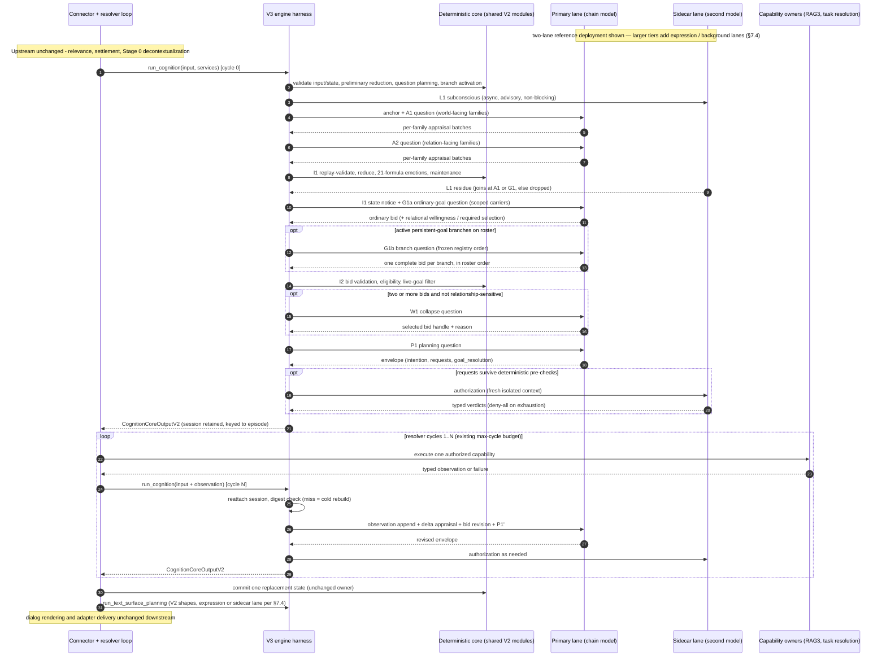

# Cognition V3: Cache-Affine Hybrid Agentic Loop Architecture

## Document control

- **Status:** Draft target architecture (independent design)
- **Document type:** System architecture reference
- **Execution authority:** None. Implementation, or reconciliation of an
  existing implementation, requires an approved active development plan.
- **Independence statement:** This design was derived only from the V1
  historical record, the Cognition Core V2 ICD and source, the cognition
  contracts reference, the explicit cognitive trajectory (ECT) architecture,
  the LM Studio prefix-cache probe evidence, and the exported V2 live trace
  `test_artifacts/latest_group_response_non_673225019_full_trace.json`. The
  active V3 development plan and the `cognition_core_v3` package were
  deliberately not consulted. Where this document and the current V3
  implementation disagree, the disagreement is a review finding to be
  resolved explicitly, not silently.
- **Scope:** The Stage 2 cognition engine boundary only: everything behind
  `run_cognition(...)` plus the surface-planning entrypoints, including how
  the engine cooperates with the existing external resolver loop. Relevance,
  settlement, decontextualization, conversation progress, consolidation,
  reflection, and delivery remain outside this document's scope and keep
  their current contracts; converting them to the loop is deferred until V3
  is proven robust.
- **Governing references:** the ECT architecture
  (`explicit_cognitive_trajectory_architecture.md`), the cognition contracts
  reference (`cognition_contracts_design.md`), and the Cognition Core V2 ICD
  (`src/kazusa_ai_chatbot/cognition_core_v2/README.md`). All ECT target
  invariants remain binding on this design (see §13).

## Executive decision

Cognition V3 keeps V2's semantic products, typed contracts, deterministic
state layer, and public interface unchanged, and replaces only the **prompt
geometry and orchestration**: the fan-out of many isolated, cold-prefix model
calls becomes **one append-only cognition chain on a single serialized model
lane**, anchored by a volatility-ordered context head, with deterministic
reducers participating as in-loop interludes and a small set of deliberately
off-chain calls (independent authorization, the revived L1 subconscious) on a
sidecar lane.

Three facts force this shape:

1. **Measured serving economics.** The archived LM Studio probe
   (`prompt_prefix_and_input_format_optimization_plan.md`) measured cold
   prompt processing at ~2.1 s versus ~0.29 s for the same prefix with a
   changed tail, and an early prefix miss costs as much as fully cold. The
   live V2 trace shows a 23,899-char goal prompt taking 30 s and a turn
   spending ~48 s of model time inside a 4 m 20 s wall clock. Every V2 stage
   owns a different prompt head, so nearly every call is a prefix miss; a
   resolver recurrence re-runs the entire stack.
2. **Model training direction.** Current local models are increasingly
   trained on multi-turn agentic tool-use transcripts: a stable system
   preamble, alternating user/assistant turns, tool observations appended,
   and structured outputs per step. A harness shaped like that transcript is
   both cache-affine and in-distribution for the model.
3. **The contracts already permit it.** The ECT states the wire contract is
   "the validated semantic result, not the prompt arrangement," and V2's own
   ICD allows one structured call for a compatible group. Reshaping calls
   does not reshape ownership.

The result is a **hybrid** loop, not a monolithic agent: the model owns the
same bounded semantic questions it owns today, deterministic code owns the
same validation, state reduction, budgets, authorization gates, and commit —
and additionally owns the loop harness itself. Nothing about the loop makes
the model self-directing: the harness, not the model, decides which stage
question comes next.

## 1. Design goals

| # | Goal | Definition of done |
|---|---|---|
| G1 | Functional preservation | Every V2 semantic product (appraisal batches, emotion/relationship state updates, goal bids, relational willingness, required selection, collapse, action/resolver planning, authorization, targetless-group response, diagnostics) is produced under the same validated contract and deterministic owner. |
| G2 | Cache affinity | Within a turn, every chain step after the first re-prefills only its delta. A resolver recurrence costs one observation append plus bounded re-decision steps, never a full re-run. Cross-turn anchor reuse is captured where the deployment permits (§11). |
| G3 | Agentic-loop harness | The model-facing transcript is a well-formed multi-turn conversation: one system preamble, alternating user/assistant messages, observations appended in order, structured JSON per assistant turn. |
| G4 | Emotion system unchanged | The 21-formula deterministic emotion lifecycle, the 11-axis relationship state, transition guards, reducers, and maintenance metadata are imported from the existing V2 modules, not reimplemented. |
| G5 | L1 subconscious revived | A bounded, non-binding first-reaction stage in the shape of `L1ResidueV1`, running on a sidecar lane, feeding the chain as advisory residue only. |
| G6 | Drop-in interface | `run_cognition`, `run_text_surface_planning`, `run_visual_surface_planning`, `run_character_morning_refresh`, and both validators keep V2 entrypoint names and input/output payload contracts; the injected services object is engine-owned and lane-scoped (§10). Cutover is `COGNITION_CORE_ENGINE=v3` plus connector wiring; no data migration. |
| G7 | Bounded context | The full loop fits a 50,000-token window budget by default, extendable to 65,000 for resolver-heavy turns, with a deterministic ledger and typed over-budget dispositions. |

## 2. Evidence-based problem statement

What V2 pays for per turn, from code-level facts:

- A typical single-user turn issues roughly 9–24 model calls (bounded worst
  case ~150): six appraisal families with up to eight serial micro-items
  each, up to fourteen goal branches, collapse, planning, and up to two
  authorizations — submitted as an unbounded burst of up to ~20 concurrent
  requests against one local server.
- Twelve routes carry twelve different static system prompts (0.5–11 k
  chars), each followed by a large per-stage dynamic payload (aggregate caps
  20 k–36 k chars). Consecutive requests therefore almost never share a
  prefix; concurrent requests actively evict each other's cache.
- Shared material is re-serialized repeatedly: the same evidence registry,
  identity partitions, and state projection are embedded independently in
  every appraisal, goal, collapse, planning, and authorization payload; the
  workspace collapse payload re-sends bids the goal stage just produced.
- Each resolver cycle re-enters `run_cognition` at the top and re-runs
  everything; `COGNITION_RESOLVER_MAX_CYCLES=3` triples the entire stack.
- No layer requests or exploits prefix caching; the only caches are client
  object caches and the RAG semantic-result cache.

The live trace confirms the consequence: five recorded calls, ~48 s model
time, 4 m 20 s wall clock, with the 24 k-char goal prompt alone at 30 s —
prefill-dominated, plus large unexplained inter-stage gaps consistent with
queueing and cache contention.

## 3. Architectural overview

```text
                 ┌──────────────────────────────────────────────────────┐
                 │ PRIMARY LANE (one model, serialized, prefix-stable)  │
                 │                                                      │
 anchor ───────► │ [system: engine manual + identity]                   │
 (volatility-    │ [user:   turn context packet]                        │
  ordered head)  │ [user:   A1 appraisal question]  [asst: batches]     │
                 │ [user:   I1 state notice*]                           │
                 │ [user:   G1 goal question]       [asst: bids]        │
                 │ [user:   W1 collapse question†]  [asst: selection]   │
                 │ [user:   P1 planning question]   [asst: envelope]    │
                 │ [user:   R  resolver observation] ... (append, loop) │
                 └──────────────────────────────────────────────────────┘
                        ▲                │
    deterministic       │                ▼
    interludes ─────────┘   validators, reducers (21 emotion formulas,
    (code, no LLM)          relationship axes), branch activation,
                            budgets, ledger, commit candidate

                 ┌──────────────────────────────────────────────────────┐
                 │ SIDECAR LANE (second model; independent contexts)    │
                 │  L1 subconscious residue (advisory, non-binding)     │
                 │  action authorization / resolver authorization       │
                 │  JSON repair, RAG3/task-resolution specialists       │
                 └──────────────────────────────────────────────────────┘

 * interludes appended as bounded user-role notices
 † skipped deterministically for 0–1 bids and relationship-sensitive turns
```

Four structural elements:

1. **The anchor** (§4): a volatility-ordered context head — static engine
   manual and identity in the system message, then one "turn context packet"
   user message ordered from slow-changing to fast-changing sections.
2. **The chain** (§5): a fixed, harness-driven sequence of stage questions
   and structured answers. Append-only; nothing already sent is ever edited.
3. **Interludes** (§6): deterministic code running between chain steps —
   the same V2 validators and reducers — whose bounded results are appended
   to the chain as notices when the model needs them.
4. **Off-chain lanes** (§7): calls that must not share the chain's context
   (independence) or must not touch the primary model's cache (affinity),
   routed to a sidecar model.

The placement rule is a three-part test. A model call runs **on-chain** when
it benefits from the accumulated turn context and may be conditioned on
earlier deliberation. It runs **off-chain** when any of the following holds:

- **Independence:** the judgment must not be conditioned on the chain's own
  rationale (authorization stages — an authorizer reading the plan's
  persuasive reasoning becomes a rubber stamp);
- **Lane hygiene:** the call would interleave on the primary model between
  two chain steps of the same turn and evict the chain prefix (specialist
  evidence work, JSON repair);
- **Latency shadow:** the call can run concurrently under another step's
  prefill/decode and merely joins later (L1 subconscious).

### 3.1 End-to-end calling procedure



## 4. The context anchor

### 4.1 Volatility ordering

The anchor is serialized strictly from least to most volatile, because a
prefix cache is invalidated at the first divergent byte:

| Order | Section | Changes when | Location |
|---|---|---|---|
| 1 | Engine manual: stage protocol, all chain output contracts, closed vocabularies, evidence-handle domains, validation rules, JSON discipline | Engine release | system |
| 2 | Character identity partitions (union of chain-stage partitions: core, personality, boundaries, self_image) | Identity revision promotion (days–weeks) | system |
| 3 | Character constraints + character operational context | Slow (hours) | user packet, first |
| 4 | Per-user relationship projection, user state projection | Per user; slowly per turn | user packet |
| 5 | Scene context, episode identity, participant bindings, response operation | Per turn | user packet |
| 6 | Evidence registry (e/ev/ce/ct/ck handles), direct facts, affordances, resolver context, progress evidence | Per turn | user packet, last |

Consolidating the per-stage static prompts into one manual is deliberately
front-loaded cost: the manual is larger than any single V2 system prompt
(estimated 18–24 k chars ≈ 6–9 k tokens) but is byte-stable across every
turn, user, and stage, so it is paid once per cache lifetime instead of per
call. Stage questions then become one-to-three-line pointers into the
manual plus stage-scoped dynamic payload.

### 4.2 Byte-stability rules

- Canonical JSON everywhere in the anchor and stage questions: sorted keys,
  compact separators, `ensure_ascii=False` — same convention as V2
  operational packets.
- No timestamps, counters, request ids, or digests in sections 1–2. Volatile
  identifiers appear only in sections 5–6 or in stage questions.
- No interpolation into the system message. V1's `.format(character_name=…)`
  system prompts broke prefix stability; the manual takes no runtime
  parameters. Identity partitions are appended as a distinct block, not
  woven into instruction text.
- Evidence rows are serialized in their deterministic registry order.
  Advisory salience (e.g., from L1 residue) is expressed as text, never by
  reordering anchor bytes.
- Prompt text follows the existing local-LLM skill rules (no plan names,
  stage numbers, or migration vocabulary in runtime prompts).

### 4.3 Information-scoping policy

V2 scopes some carriers to specific stage owners (identity partitions per
owner; `past_dialog_cognition_context` and sleep phase to goal only; group
engagement context to goal and action planning only; workspace collapse
receives no copy). A cumulative chain cannot hide earlier content from later
stages, so V3 adopts an explicit, reviewed relaxation:

1. **Anchor content is the intersection-safe union** of what chain stages
   may see: goal-partition identity plus appraisal-partition identity.
   Expression-only projections, visual character context, revision history,
   raw ids, and numeric relationship state stay out (as in V2).
2. **Stage-scoped carriers ride in their first consumer's stage question**,
   not in the anchor. Appraisal (which runs earlier) therefore never sees
   goal-scoped carriers, preserving V2's upstream scoping exactly.
3. **Downstream visibility widens monotonically**: stages after the first
   consumer can see the carrier in the transcript. This is a documented
   deviation from V2's prompt-level scoping. It is acceptable because the
   binding enforcement in V2 is contract-level (collapse output has no field
   that could cite engagement context; validators reject out-of-domain
   handles), and stages whose judgment must be unconditioned run off-chain
   (§7). Any carrier for which transcript visibility is itself harmful must
   be routed off-chain or dropped — none is currently known.

## 5. The cognition chain

### 5.1 Canonical stage sequence

The harness drives the sequence; the model never chooses the next stage.
Message roles are restricted to one system message plus alternating
user/assistant messages (no tool role, no assistant prefill), because
OpenAI-compatible chat templates re-serialize those deterministically.

| Step | Kind | Semantic question | Output contract | LLM |
|---|---|---|---|---|
| A1 | chain | Appraisal, world-facing group: event/agency, goal/threat/outcome, epistemic/comparison/memory | Per-family micro-appraisal batches, same item contract as V2 (≤8 items/family, ≤1 proposition + ≤1 delta per item, same handle/delta-path domains) | yes |
| A2 | chain | Appraisal, relation-facing group: relationship/social, moral/identity, existential/drive | same | yes |
| I1 | interlude | — | Deterministic per-family replay-validation, reduction, relationship maintenance, 21-formula emotion derivation; append bounded state-transition notice (≤600 chars, qualitative bands + accepted/rejected counts) | no |
| G1a | chain | Ordinary-response goal bid only; carries `relational_willingness.v2`; typed required-selection turns use the specialized selection form | The complete ordinary bid, contract identical to V2 | yes |
| G1b | chain | Active persistent-goal branch bids, only when the roster has active branches; roster and required emission order = frozen registry order | One complete bid per active branch, branch-specific contracts identical to V2, in roster order | conditional |
| I2 | interlude | — | Bid validation, live-goal filter, eligibility | no |
| W1 | chain | Workspace collapse — only when ≥2 complete bids and the turn is not relationship-sensitive | Selected bid handle + reason (bids are already in context; no re-serialization) | conditional |
| P1 | chain | Action and resolution planning | V2 envelope: intention, ≤3 action requests, ≤3 resolver requests, `goal_resolution`, `start_in_background`; targetless-group turns additionally emit `self_cognition_response` under the identical closed contract | yes |
| X1/X2 | off-chain | Action / resolver authorization | V2 authorization contracts, fresh isolated context, sidecar lane | conditional |
| R | chain | Resolver observation append + bounded re-decision (§8) | Delta appraisal (scoped to new handles), bid revision, fresh P1 envelope | per cycle |
| O | interlude | — | Output projection into `CognitionCoreOutputV2`; replacement-state candidate; validation | no |

Deterministic short-circuits are preserved exactly: no planned appraisal
questions ⇒ A1/A2 are omitted; zero or one bid ⇒ no W1 call; relationship-
sensitive turns ⇒ deterministic authoritative collapse with the ordinary bid
primary and effect denial downstream; `goal_resolution == answerable_now` ⇒
optional resolver requests suppressed before authorization.

### 5.2 Appraisal grouping

The six families collapse into two grouped chain steps by default, with the
family→step map held in a registry (1, 2, 3, or 6 steps are tunable without
contract change). Grouping rationale:

- The deterministic question planner is unchanged: it still plans per-family
  questions, permitted handles, and delta-path domains; a grouped step's
  question simply carries several families' planned questions.
- Output contracts remain per-family batches, so the reducer's per-family
  replay validation, accepted-prefix isolation, and rejection semantics are
  untouched.
- Two steps bound the per-step completion size (grouped batches must fit the
  step's completion cap; the validator terminates a family batch that
  overruns exactly as V2 bounds serial items) while cutting up to 48 calls
  to 2.

Sequential grouping trades V2's nominal family independence for coherence
and cache affinity. This is sanctioned by ECT §12.2 (families are
independent only where inputs/outputs are independent — the outputs remain
independent contracts) and mitigated by ordering the world-facing group
before the relation-facing group, so factual interpretation is least
contaminated. The reducer never trusted family independence anyway: it
replays and validates every family against the same original state.

### 5.3 Goal bidding: two ordered steps, deterministic bid order

The branch roster is still computed by the deterministic activation registry
(ordinary + one branch per active persistent goal kind, capped at 14).
Because chain generation is autoregressive, bid order is a semantic variable
— an earlier bid's stance and emotional framing condition every later
sibling — so ordering is specified, deterministic, and validator-enforced
rather than left to the model:

- **The authoritative affect is order-proof by construction.** Emotion state
  is derived deterministically at I1, before any bid exists; bid ordering
  can influence only the informal narrative conditioning between sibling
  bids, never the committed emotion or relationship state that grounds the
  turn.
- **G1a emits only the `ordinary_response` bid** (with
  `relational_willingness.v2`, or the typed required-selection form). It
  runs first because it owns the turn's gating decision — willingness
  drives the deterministic sensitive collapse and downstream effect denial
  — and must therefore be the least contaminated bid: grounded in the
  episode, evidence, and the I1 notice, never downstream of speculative
  branch framing.
- **G1b emits the active-branch bids**, only when the roster has active
  branches (the minority of turns; the common path pays no extra step).
  The stage question lists branches in the frozen registry order V2's
  branch activation already uses, and the answer must emit bids in that
  same order — a mis-ordered answer is a structural contract error handled
  by tail-rollback repair (§9.1). Registry order keeps the question
  byte-stable for the cache and makes transcript rebuild (§8.1) and replay
  parity (§12.2) reproducible.
- **Branches seeing the baseline is intended.** A specialized branch that
  has read the neutral ordinary bid is biased toward the honest "no
  supported basis" disposition rather than invented support — the failure
  mode the branch-guidance registry explicitly warns against. Neither step
  may carry a winner/ranking field; collapse authority is not pre-empted.
- **Collapse tie order matches V2:** the exhaustion fallback "first
  complete bid" resolves in roster order (ordinary first), selecting the
  same bid V2's stable order would.
- Per-branch completeness validation is unchanged: a failing branch bid
  repairs under the bounded chain-local policy; an exhausted non-required
  branch is dropped while `ordinary_response` retains its required-branch
  recovery semantics. Resolver-cycle bid revision (§8) obeys the same
  roster ordering.
- `branch_intent_guidance` strings ride in the G1b stage question per
  branch; the goal-scoped carriers (private continuity, past-dialog
  context, sleep phase, group engagement context) ride in G1a, their first
  consumer.
- *Recorded option, not default:* on turns G1a declares
  `relationship_sensitive`, skipping G1b entirely would save a step, but
  V2's deterministic sensitive collapse still records the other bids as
  competing — skipping their generation is a contract-visible divergence
  (empty competing set) requiring explicit sign-off before adoption.

### 5.4 What deliberately stays out of the chain

Relevance, settlement, decontextualization (Stage 0), conversation progress
recording, consolidation, memory lifecycle, reflection, and dialog delivery
keep their current shapes and contracts. Surface planning and dialog stay
off-chain in the cutover (§12.3). The scope boundary is `run_cognition` and
its resolver cooperation; the rest is a later conversion, undertaken only
after V3 is proven.

## 6. Deterministic interludes and the hybrid contract

The V2 semantic-state layer is imported, not forked. V3 owns orchestration
and prompt assembly only; the single source of truth for meaning stays in
the existing modules:

- `state_models.py`, `transition_guards.py`, `state_reducers.py`,
  `emotion_definitions.py`, `emotion_derivation.py` (21 formulas, lifecycle
  thresholds, relationship maintenance) — used verbatim at the same points:
  preliminary deterministic reduction before the chain, per-family replay
  validation and reduction after A1/A2, final reduction and maintenance
  before goal work, replacement-state candidate at output.
- Contract validators (`validate_cognition_input`,
  `validate_cognition_core_output`, state validation) — verbatim.
- `run_character_morning_refresh` — re-exported verbatim.

An interlude may append a **notice** to the chain when its result changes
what later stages should believe (the state-transition notice after I1; the
authorization verdicts before a resolver cycle executes). Notices are
bounded, typed, qualitative projections — never raw state — and are the only
mechanism by which deterministic code speaks inside the transcript. This is
the "hybrid" in the architecture: code is a first-class loop participant,
equal in the transcript to tool observations in an ordinary agentic loop.

## 7. Off-chain lanes and the sidecar model

### 7.1 Lane model

- **Primary lane:** one `(base_url, model)` binding; all chain steps of all
  turns run here, strictly serialized (the existing settlement worker
  already serializes settled turns globally; the engine additionally owns a
  per-lane FIFO so background work cannot interleave mid-turn).
- **Sidecar lane:** a second resident model (deployments already run two —
  the trace shows a 26 B relevance model beside the 31 B main model). Hosts:
  L1 subconscious, action/resolver authorization, JSON repair, and — by
  deployment guidance — RAG3/task-resolution specialist routes.

**Lane placement rule (hard):** no request may run on the primary model
between two chain steps of the same turn unless it is itself a chain step.
A single interleaved foreign prompt evicts the chain prefix and converts
the next chain step into an early-miss full re-prefill. Deployments without
a sidecar model must either accept the measured re-entry cost per
authorization/specialist call (budgeted in §11) or defer those calls where
semantics allow.

### 7.2 Authorization isolation

Action and resolver authorization remain separate model calls with fresh,
minimal contexts (the V2 authorization modules and prompts are reusable
as-is). Rationale: authorization is an adversarial check on the plan; inside
the chain it would read the plan's own rationale and approve it. This is a
deliberate independence exception to cache affinity, and it is cheap — the
authorization prompts are the smallest in V2 (0.9–2.2 k static). All
deterministic pre-checks, denial-on-exhaustion, and effect-suppression rules
are unchanged.

### 7.3 The L1 subconscious sidecar (V1 revival)

V1's L1 layer — the first, cheap, non-binding "body and emotion reaction"
call — returns as a sidecar stage in the contract shape the contracts
reference already reserves (`L1ResidueV1`):

```python
class L1ResidueV1(TypedDict):
    schema_version: Literal["l1_residue.v1"]
    emotional_appraisal: str      # first-person, bounded (<=120 chars)
    interaction_subtext: str      # bounded (<=200 chars)
    salience_hints: list[str]     # <=4 supplied evidence handles
    risk_flags: list[str]         # closed vocabulary
```

Design decisions, learning from V1's record:

- **Inputs:** the current percept, qualitative affect bands, and a bounded
  boundary summary — projections from V2 state, not V1's MBTI hard-coded
  priors or scalar affinity. Cheap by construction: no evidence registry, no
  goals, no history.
- **Timing:** launched at turn start on the sidecar lane, concurrent with
  primary-lane anchor prefill; joins at A1's stage question, falls back to
  joining at the first bidding step (G1a), and is dropped with a
  degradation marker if late. It never delays the chain.
- **Authority:** none. It is residue per ECT §9.3 — an explicit producer
  (sidecar stage), declared consumers (A1/G1 stage questions, protected
  trace), episode-scoped expiry, and a conflict rule: current-episode
  evidence always outranks it. It cannot create facts, stances, permissions,
  or reasons to speak; validators enforce that no chain output cites it as
  evidence (it has no handle in any evidence domain).
- **Deterministic consumption:** none in the first slice. `risk_flags` is
  reserved as the future trigger vocabulary for an ECT §11 registered reflex
  path; enabling any reflex requires its own plan and registry.
- **Failure:** optional-stage semantics — skip silently, mark diagnostics.

This restores what V1 actually had that V2 lost — a fast affective prior
that colors deliberation — without restoring what V2 correctly deleted
(prose as state authority, scalar affinity, model-owned emotion).

### 7.4 Loop census and the parallelism model

The unit of parallelism is the **lane**, not the loop: two chains
interleaving on one model would evict each other's prefixes, so §7.1 admits
exactly **one cognition chain in flight per primary lane**. Everything else
in the system is either sidecar-class (fresh-context, cache-indifferent —
contention is acceptable) or background-class (after response release).
The mechanical single-endpoint rule (§10) applies only *within* one chain;
every other loop class keeps its own route and is independently
model-assignable, exactly as today.

| Loop / stream | Shape | Lane assignment | In flight | Cache policy |
|---|---|---|---|---|
| Cognition chain (user turns, group self-cognition, scheduled/background-triggered episodes) | the §5 loop, cycling via the resolver | primary — one chain per lane | **1 per primary lane** | affine: serialized, append-only prefix |
| L1 subconscious | one call | sidecar | ≤1 per turn | indifferent |
| Action / resolver authorization | 1–2 fresh-context calls | sidecar | ≤2 per cycle | indifferent |
| JSON repair | rare sync calls | sidecar | rare | indifferent |
| RAG3 local-context loop | bounded planner/subagent loop (own caps) | sidecar, per §7.1 guidance | ≤1, between chain steps | indifferent |
| Task-resolution orchestrator (web research, specialists) | bounded specialist loop; may defer to background | sidecar inline; background when deferred | ≤1 inline | indifferent |
| Expression tail (surface ×2, dialog) | fixed off-chain call set | expression lane (3-model) or sidecar; primary only by surrendering cross-turn reuse | 1 set per turn, post-commit | own stable heads |
| Upstream (relevance FIFO, vision, Stage 0 decontextualizer) | fixed calls, own FIFOs | sidecar / expression | 1 (FIFO) | own stable heads |
| Post-turn background (consolidation, two progress observers, residue, memory lifecycle) | bounded call sets after release | background (sidecar off-peak or a third model) | 0–2, overlapping the next turn | indifferent |
| Slow loops (reflection cycle, coding agent) | long-horizon loops on their own routes | background models, unchanged | occasional | indifferent |

Expected concurrency by deployment tier:

- **Two resident models (reference deployment):** one chain loop on the
  primary lane plus one multiplexed sidecar stream — typically **two**
  concurrent model requests, peaking at three or four when post-turn
  background overlaps the next turn. Cross-turn anchor reuse on the primary
  lane is preserved only if the expression tail and Stage 0 also stay off
  the primary model; with two models that means hosting them on the sidecar
  (an expression-quality trade) or accepting that the guaranteed wins are
  intra-turn only.
- **Three resident models:** primary (chain only), expression (Stage 0,
  surface, dialog), utility sidecar (L1, authorization, repair,
  specialists). Nothing but the chain ever touches the primary model, so
  cross-turn anchor reuse is fully preserved without compromising dialog
  quality. Chain count is still one.
- **K primary lanes (multi-GPU / multi-server):** K parallel chains, one
  per lane, with **channel-sharded lane affinity** — a stable channel→lane
  mapping so a channel's consecutive turns always land on the lane holding
  its anchor prefix. This tier requires the upstream settlement worker to
  become per-lane rather than globally sequential, which is a
  brain-service change outside this document's scope; the engine-side
  requirement is only that lane affinity is deterministic and sticky.

## 8. Resolver recurrence as loop continuation

The external contract is untouched: `cognition_resolver` still calls
`run_cognition` once per cycle, executes at most one authorized capability
between cycles, and commits exactly one terminal replacement state. What
changes is the cost and the internal shape of a recurrence:

1. **Cycle 0** builds the anchor and runs the chain to P1. If resolver
   requests survive authorization, the engine returns the V2 output as
   today, and additionally retains a **chain session** (§8.1).
2. **Cycle N>0**: the engine reattaches the session, verifies it against the
   current input (digest of all non-cycle fields; state is unchanged between
   cycles by loop contract, evidence grows by the observation), appends the
   typed observation as a chain message, and runs the bounded re-decision
   tail: a delta-appraisal step scoped to the new evidence handles (omitted
   when the observation carries no state-relevant meaning), interlude
   reduction, a bid-revision step for affected branches, and a fresh P1.
   The carried `current_turn_relational_willingness` is injected exactly as
   V2 does — the relational stance is not re-judged on recurrence.
3. **Terminal cycles** (max-cycles, duplicate request, blocked pending,
   user-input blocker, lifecycle conflict) keep their one final decision
   pass — now a short chain tail instead of a full re-run.

Marginal recurrence cost becomes observation size + three small steps,
against V2's full ~9–24-call re-run per cycle. The recurrence budget, the
one-capability-per-cycle rule, duplicate-question detection, and every
typed terminal disposition are preserved verbatim (ECT §7.2).

### 8.1 Chain session carrier

The session (transcript + accepted stage products + ledger) is held in a
process-local store keyed by episode identity and cycle index, with two hard
invariants:

- **Performance cache, never authority.** Any miss, digest mismatch, or
  process restart degrades to a cold rebuild — a full chain run for that
  cycle, which is exactly V2's semantics. Correctness never depends on the
  session existing.
- **No contract leakage.** The session does not ride in
  `resolver_pending_resolution`, `resolver_goal_progress`, or any public
  carrier; overloading those fields would create hidden compatibility
  vocabulary (ECT invariant 13). The public payloads stay byte-compatible
  with V2.

Because the rebuilt transcript is a pure function of inputs plus recorded
stage outputs, a rebuild reproduces byte-identical messages, so even after a
session loss the server-side prefix cache may still hit.

## 9. Failure model

Governing principle: **cache state is never correctness.** No disposition in
this section may depend on the server cache being warm; every cache loss is
telemetry, never an error. Conversely, no recovery path may violate the
transcript's prefix discipline (§11.3).

### 9.1 Malformed output: chain-local repair (tail rollback)

- **Chain-local repair (tail rollback, not append):** a malformed stage
  answer is **stripped from the transcript**, and the retry re-sends the
  same stage question extended with an error appendix (validation error,
  exact field path, allowed domains — the same feedback content V2 uses,
  and, per V2 convention, never the failed draft itself). Because the
  extended question shares the original question's byte prefix, the server's
  longest-common-prefix rollback keeps everything up to the question cached
  and prefills only the appendix — the same marginal cost as appending a
  repair message (the measured changed-tail case), while reclaiming the
  failed draft's ledger budget and removing its error-echo poisoning risk
  from every later stage. Repeated failures accumulate appendices
  monotonically (`question + err1 + err2`), so each retry again discards
  only the newest failed answer. Rollback is legal only because nothing
  exists after the failing answer; §11.3's prefix discipline forbids editing
  any message that already has content after it.
- **Reduction-rejected content is kept, not stripped:** a structurally valid
  batch later rejected by the deterministic reduction replay stays in the
  transcript, and the I1 state notice authoritatively marks it rejected.
  Excising one family from a grouped answer would synthesize an assistant
  message the model never produced and break byte-identical session
  rebuild; the poisoning risk is low because the content is well-formed and
  deterministic truth in the notice overrides it.
- **Diagnostics are unaffected by stripping:** every failed candidate and
  attempt is retained in the protected failure capsule and attempt ledger
  exactly as in V2; the session carrier records the post-repair final
  transcript (accepted answers plus cumulative appendices), so rebuilds
  remain byte-identical.
### 9.2 Attempt budgets and exhaustion

- **Attempt caps** mirror V2's per-owner policies (appraisal 2 total per
  family step; goal 3 per branch across the invocation with the shared
  ledger; collapse/planning/authorization 3), and the exhaustion
  dispositions are identical: family omitted with diagnostics,
  required-branch recovery by valid sibling, degraded first-bid collapse,
  empty action plan, deny-all authorization.
- **Identical-retry short-circuit:** a regeneration byte-identical to the
  stripped failure, or a second consecutive empty answer, consumes all
  remaining attempts for that step — a looping model must not burn the §9.6
  turn deadline one attempt at a time.
- **JSON boundary unchanged:** canonical deterministic parse first; the
  repair model remains sidecar-lane; required-selection stays
  deterministic-only.
### 9.3 Grouped-step failure isolation

V2 isolated failures per appraisal family; a grouped chain step widens the
blast radius of one provider failure or truncated completion to every family
in the group. The disposition ladder restores per-family isolation at
bounded cost:

1. A step-level provider failure, a length-truncated completion
   (`finish_reason == length`), or an unparseable trailing fragment consumes
   one attempt and retries the same grouped question once.
2. A second failure splits the group along the §5.2 registry fallback
   (2 → 3 → 6 steps) and retries only the unanswered families as separate
   smaller steps, each under the remaining family-level attempt budget.
3. Families that still fail are omitted with typed diagnostics — V2's
   per-family disposition — and the chain continues.

Split retries preserve the prefix: the failed grouped answer rolls back
under §9.1, and the split questions extend from the same cached prefix.

### 9.4 Provider and serving-layer failures

- **Per-step timeout:** unchanged classification (`provider_transient`,
  pre-state-commit, retryable) inside the step's attempt budget.
- **Model crash / reload mid-turn:** the existing single-string crash
  classifier and reload-owner behavior apply per lane. A reload annihilates
  the server-side cache; the turn continues correctly with every subsequent
  step cold — recorded as a cache-loss telemetry event, never an error, with
  the §9.6 deadline bounding the resulting slowdown.
- **Sidecar-lane outage:** L1 is skipped silently (optional stage);
  authorization exhausts to deny-all (V2 disposition), so a sidecar outage
  suppresses actions and resolver work but never blocks a grounded
  reply-or-silence decision; an unavailable JSON-repair model leaves the
  deterministic parse tier as the only tier, which is already the contract
  for repair-forbidden stages.
- **Primary-lane outage:** total model unavailability with no owned
  fallback remains an execution error — the unchanged ladder terminal.

### 9.5 Serving-window guard (silent-truncation defense)

A request exceeding the server's loaded context length is the most dangerous
failure in this design: a serving layer configured with a rolling-window or
middle-truncation overflow policy would silently discard anchor bytes —
corrupting identity, evidence provenance, and every cache prefix at once,
with no error surfaced. The defenses are mechanical, not procedural:

- the chain-lane config must declare the served context window (§10), and a
  ledger ceiling above `window − largest per-step completion cap` is a
  configuration contract error at construction, fail-closed;
- the engine refuses to send any request whose estimated size exceeds the
  declared window — the typed context-limit error fires client-side, before
  the server has a chance to truncate;
- deployment requirement: the serving layer's overflow policy must be
  reject/stop, never rolling-window; §15 tracks whether this is probeable at
  startup rather than left as convention.

### 9.6 Turn-level deadline

V2 never had an end-to-end deadline; its wall clock was implicitly bounded
by parallelism. A serial chain must bound total work explicitly. The engine
owns a turn deadline (configured; default derived from planned step count
and a fraction of the per-step timeout, calibrated per §15). On expiry the
harness stops issuing new chain steps and runs the terminal decision
disposition over the products accepted so far — the same "decide with
available evidence, ask a grounded clarification, defer, or stay silent"
contract as resolver-budget exhaustion. The deadline is checked between
steps only; it never interrupts a deterministic interlude or a commit.

### 9.7 Session and concurrency failures

- **Concurrent invocation for one episode** (connector retry, duplicate
  claim): the session store is single-owner; a second claimant discards the
  session and cold-runs. Two writers can never interleave one transcript.
- **Store eviction / process restart:** bounded LRU with a TTL of at least
  the capability timeout × max cycles; any miss is a cold rebuild —
  V2-equivalent cost, identical semantics.
- **Cross-cycle input divergence:** the digest check covers every non-cycle
  input field; a mismatch (state or evidence mutated between cycles, which
  the loop contract forbids) triggers a cold rebuild plus a dedicated
  warning code, because it signals a connector-side contract breach rather
  than a cache problem.

### 9.8 Degenerate chains, re-anchoring, and the ladder

- **Re-anchoring guardrail:** if the chain itself degenerates (repeated
  contract failures across stages, context poisoning, model loops), the
  engine performs one bounded re-anchor: rebuild a fresh anchor plus a
  compact digest of already-accepted products and continue from the last
  accepted stage. The digest composition and the one-per-invocation bound
  (shared with §11.2 budget-pressure compaction) are defined in §11.2. This is the chain analogue of the existing
  parent-checkpoint replay (one token, pre-state-commit only) and composes
  with it rather than replacing it.
- **Ladder and fail-closed semantics:** the
  `accepted / recovered / accepted_degraded / unrecoverable` ladder, typed
  contract errors, `CognitionContextLimitError`, pre-commit safe
  checkpoints, and failure capsules are preserved. Every chain step records
  its attempts into the protected ledger exactly as V2 owners do.

## 10. Interface and drop-in contract

- **Entrypoints and payloads:** `run_cognition(input, services) ->
  CognitionCoreOutputV2`, `run_text_surface_planning`,
  `run_visual_surface_planning`, `run_character_morning_refresh`,
  `validate_cognition_input`, `validate_cognition_core_output` — entrypoint
  names, payload TypedDicts, error types, and validation semantics identical
  to V2; the services parameter is the engine-owned lane object below. The
  engine is selected by the existing closed selector
  (`COGNITION_CORE_ENGINE`), which is the entire cutover switch.
- **Lane-scoped services (mechanical single-endpoint rule):** V3 offers no
  configurable per-stage endpoints for chain work. Its services object
  exposes exactly two route bindings:

  ```python
  @dataclass(frozen=True)
  class CognitionChainServicesV3:
      llm: LLMInvoker
      chain_lane: LLMCallConfig            # every chain step, one model
      sidecar_lane: LLMCallConfig | None   # L1, authorization, JSON repair
      subconscious_enabled: bool = False   # effective only with a sidecar
  ```

  Cross-model arrangement inside the loop is therefore unrepresentable, not
  validated: there is no field a misconfiguration could occupy. Per-step
  variation (completion caps, per-step timeouts) is code-owned constant
  policy, never configuration. The connector's environment surface collapses
  from twelve stage bundles to two lane bundles
  (`COGNITION_V3_CHAIN_LLM_*`, `COGNITION_V3_SIDECAR_LLM_*`); the twelve V2
  routes remain untouched for the V2 engine and are never consulted by V3.
- **Constructor-enforced lane guards** (fail-closed at build, not runbook
  rules): a chain-lane config with thinking enabled is rejected (§11.3
  invariant 5 made mechanical); the chain-lane config must declare the
  served context window, and a ledger ceiling above `window − largest
  per-step completion cap` is a configuration contract error (§9.5); a
  sidecar config resolving to the chain lane's `(base_url, model)` is
  rejected because it cannot provide lane hygiene (§7.1) — deployments
  without a second model omit the sidecar and inherit the documented
  dispositions instead.
- **Drop-in reconciliation:** the input/output payload contracts
  (`CognitionCoreInputV2`, `CognitionCoreOutputV2`, `TextSurfaceInputV2`,
  errors, validators) are byte-compatible with V2. The services object is
  dependency injection constructed by the connector at the engine-selector
  seam, so an engine-owned services type is connector wiring — sanctioned by
  the cutover scope — not a payload migration; V2 keeps its own
  twelve-config dataclass unchanged.
- **Per-step call configuration:** completion caps are per chain step
  (appraisal-group, bid, collapse, planning steps each get bounded caps at
  or below the lane cap); the stage timeout remains
  `COGNITION_STAGE_TIMEOUT_SECONDS` per step, subordinate to the §9.6 turn
  deadline.
- **Diagnostics compatibility:** `CognitionDiagnosticsV2`,
  `CognitionObservabilityV2`, warning codes, and the attempt-ledger snapshot
  keep their contracts; chain-specific records extend the protected trace
  only (§14).

## 11. Context budget and the ledger

### 11.1 Budget

The loop window budget is **50,000 estimated tokens** end-to-end for one
turn's chain (anchor + all steps + resolver appends), extendable to
**65,000** when a turn enters resolver recurrence or carries an oversized
evidence registry. Accounting uses a deterministic character-based estimator
(CJK-aware), calibrated once against the serving layer's reported prompt
token counts; the estimator and its calibration artifact are part of the
engine contract so budget decisions are reproducible.

Indicative allocation (planning figures, to be validated):

| Component | Estimated tokens |
|---|---|
| Engine manual + identity (system) | 7,000–10,000 |
| Turn context packet | 5,000–9,000 |
| A1+A2 questions and batches | 3,000–7,000 |
| I1 notice, G1 question + bids, W1, P1 | 4,000–8,000 |
| Resolver appends + re-decision tail (per cycle) | 2,000–6,000 |
| Reserve (repairs, re-anchor digest) | ≥6,000 |

### 11.2 Degradation ladder and compaction policy

Fitting must never rewrite already-sent bytes. Therefore:

- **Pre-anchor fitting** applies V2's owner fit orders (supplemental context
  first, then scene/constraints/identity reductions with semantic floors,
  then evidence middle-truncation to the 96-char floor) — but once, at
  anchor build, not per stage.
- **Mid-chain pressure** (a resolver observation or repair would cross the
  ceiling) triggers, in order: switch to the 65 k extension; truncate the
  incoming observation under its own bounded projection; re-anchor with a
  compact digest (below); finally the typed context-limit failure with the
  stage-owned disposition. Never trim the transcript in place.

**Compaction policy.** The only sanctioned compaction is re-anchoring: a
fresh anchor (rebuilt at the next tighter fitting tier) plus a compact
digest, continuing from the last accepted stage. The digest is
**deterministic projection, not summarization** — composed by code
exclusively from validated typed products: accepted appraisal receipts and
the resulting state notice, complete bids reduced to their typed fields,
the collapse selection, the latest planning envelope, authorization
verdicts, and resolver observations in their bounded projections. No model
call produces the digest. Model prose inside past answers (the reasoning
connective tissue) is dropped at compaction; this is safe by contract,
because every load-bearing meaning must already live in typed fields —
chain narrative carries the same non-authority status as residue.

In-place transcript compaction (LLM summarize-and-replace, mid-transcript
pruning) is forbidden for three independent reasons:

1. **Cache:** any mid-transcript edit invalidates the prefix from the edit
   point, so in-place compaction costs a full re-prefill — the same price
   as a re-anchor, with none of its clean semantics.
2. **Semantic ownership:** an LLM-authored summary of in-progress cognition
   would become an unvalidated second state authority — the same rule that
   bars JSON repair from inventing a stance.
3. **Replay and rebuild:** the transcript must remain a pure function of
   inputs plus recorded typed outputs (§8.1, §12.2); a stochastic summary
   breaks byte-identical rebuild and parity.

The re-anchor budget is one per invocation, **shared** between the §9.8
degeneration trigger and this budget-pressure trigger; a second event of
either kind falls through to the typed context-limit failure. Cross-turn
pressure does not exist by construction: every turn projects a fresh anchor
from committed state, so there is no persistent conversation to compact —
growth is within-turn only (resolver observations, repairs, wide branch
rosters), which is what this ladder bounds.

### 11.3 Cache-affinity invariants

1. One model, one serialized lane for all chain steps; no foreign request
   interleaves a turn on the primary lane.
2. Append-only prefix discipline within a turn and across resolver cycles:
   no message with content after it is ever edited. The only permitted
   rollback is the current tail — a failing stage answer replaced under the
   §9 repair policy — which preserves the shared prefix by construction.
3. Byte-stable serialization: canonical JSON, fixed section order, no
   volatile tokens in stable sections, no system-prompt interpolation.
4. Volatility-ordered anchor; slow-changing sections strictly precede
   fast-changing ones.
5. Chat-template stability: system + alternating user/assistant only; no
   assistant prefill; **thinking off on the chain lane** (mechanically
   enforced at services construction, §10) — reasoning-mode templates that
   strip prior-turn think blocks re-serialize history differently from what
   the server cached, silently converting every step into a prefix miss.
6. Model residency: primary and sidecar models resident simultaneously;
   JIT model loading and swap-inducing route bindings are deployment
   errors for the live path.
7. Stage questions are minimal pointers; all reusable static text lives in
   the manual (cached cross-turn), all stage-scoped payloads in the
   question (paid once per turn).

### 11.4 Expected effect (planning model, to be measured)

Guaranteed wins (single-slot serving assumed): within a turn, steps 2..N
re-prefill only their deltas (~0.3 s-class instead of ~2 s-class per the
probe); collapse and planning stop re-serializing bids and shared context;
retries cost one message; a 3-cycle resolver turn stops costing 3× the
stack. Rough model for the traced turn: V2 paid ~44 k cold prompt chars in
cognition alone; the chain pays the anchor once plus ~6–10 k chars of
deltas. Opportunistic win: cross-turn reuse of the ~40–60 % stable anchor
head, realized only when the deployment preserves the primary lane's cache
between turns (sidecar routing for surface/dialog, or multi-slot
prefix-matching servers — an open validation item, §15).

### 11.5 Disposition of per-stage model routing

V2's twelve independent stage routes were a performance affordance: in
principle, stages could be spread across models and endpoints to right-size
cost and scale out the parallel wave. The chain supersedes that affordance
rather than inheriting it. The decision record:

1. **Scale-out of the concurrent burst across servers** never materialized
   — the shipped configuration binds every cognition route to one local
   server and model — and against one server the burst is counterproductive:
   requests serialize server-side while evicting each other's prefixes, so
   each nominally parallel call pays the measured cold cost (~2 s-class)
   instead of the changed-tail cost (~0.3 s-class). The chain removes the
   condition that destroyed the burst's value instead of preserving the
   burst.
2. **Right-sizing small stages onto a smaller model** is retained as a lane
   property, not a stage property: the sidecar lane carries exactly the
   stages that are smallest and semantically better off isolated
   (authorization, L1, repair). The stages that must stay on the primary
   model are the ones prefix sharing makes cheap.
3. **Intra-turn decode parallelism** is the one genuine concession, and it
   is bounded: the dependency spine (appraisal → goals → collapse →
   planning) was always serial, typical outputs are small, and
   continuous-batching gains require overlapping slots — the same condition
   that causes prefix thrash. The probe data prices reuse as the better
   side of the trade on single-server deployments; §15 keeps the comparison
   as a measured validation item, not an assumption.
4. **Remaining scale-out lives above the turn:** additional throughput comes
   from adding primary lanes — one chain in flight per lane, with
   channel-sharded lane affinity (§7.4) — never from interleaving two
   chains on one lane. A deployment with genuinely heterogeneous per-stage
   models is a different engine behind the closed selector, not a
   configuration of this one — consistent with the §10 rule that
   cross-model arrangement inside one loop is unrepresentable.

## 12. Cutover and adoption boundaries

### 12.1 Cutover

`COGNITION_CORE_ENGINE=v3` behind the existing closed selector; connector
wiring only (the connector builds the two lane route bundles of §10 instead
of binding the twelve V2 stage routes); no data migration (state documents,
contracts, and reducers are shared with V2 byte-for-byte). Rollback is the
same switch back to `v2`.

### 12.2 Parity verification

- **Replay parity harness:** recorded V2 inputs (protected traces, failure
  capsules, seeded test states) replayed through V3; outputs diffed at the
  contract level (state updates, bids, willingness, envelopes, dispositions)
  rather than prose equality. Deterministic paths must match exactly;
  model-authored fields are checked structurally and by validator outcome.
- **Live acceptance metrics:** time-to-first-visible-dialog, total turn
  wall clock, summed prompt chars vs. summed new-suffix chars (declared
  prefix-share ratio), measured prefill durations per step (hit/miss
  inference), contract-failure and degradation rates vs. the V2 baseline.
- The V2 deterministic test suites for shared modules (state models,
  reducers, emotion lifecycle, guards, validators) run unchanged against the
  shared code and gate the cutover.

### 12.3 Explicit non-scope of the cutover slice

- Surface planning and dialog keep their V2 prompts and call shapes. An
  "expression tail" (surface/dialog as chain steps) is attractive but
  requires a contract revision — dialog must not see cognition internals, so
  it cannot naively share the chain transcript — and is deferred.
- Conversation progress, relevance, decontextualization, consolidation, and
  reflection are inputs/outputs of the loop, not loop members, until V3 is
  proven robust.
- No reflex path is enabled; `risk_flags` is reserved vocabulary only.

## 13. ECT invariant compliance

| ECT invariant | V3 disposition |
|---|---|
| 1 RAG evidence is not stance | Observations append as evidence; chain must re-decide (R steps). |
| 2 Private monologue is not truth | L1 residue and private continuity remain non-citable advisory context. |
| 3 Dialog is downstream | Dialog stays off-chain on the validated surface projection. |
| 4 Commit precedes expression | Unchanged: one terminal replacement-state commit before action/surface. |
| 5 Every fact has an owner | Anchor projections carry the same provenance/scope metadata as V2. |
| 6 Affinity remains multi-axis | The 11-axis model and qualitative banding are imported unchanged. |
| 7 Current evidence beats stale continuity | Unchanged authority rules; observation appends carry provenance. |
| 8 Capabilities are not self-authorizing | Authorization stays independent, off-chain, deny-on-exhaustion. |
| 9 Resolvers re-enter cognition | Re-entry is the chain continuation; evidence never jumps to dialog. |
| 10 Growth is promoted | Out of scope; unchanged. |
| 11 Episodes are stable | The anchor freezes the episode; sessions are keyed to it. |
| 12 Boundaries are inspectable | Every step has a typed contract, owner, budget, and disposition. |
| 13 No hidden compatibility vocabulary | Session carrier is engine-internal; public payloads unchanged. |
| 14 Silence is a decision | Silence branches, willingness gating, and targetless-group contracts unchanged. |
| 15 Reflexes are registered | No reflex enabled; reserved vocabulary only. |
| 16 Post-turn work is causally later | Unchanged. |

## 14. Observability and control-console integration

### 14.1 Trace and telemetry

- **Semantic trace:** unchanged fields plus per-step chain records (step id,
  stage kind, attempt index, ledger deltas, disposition).
- **Protected trace:** the full chain transcript per turn (prompts, answers,
  repairs, notices) as an access-controlled artifact — strictly diagnostic,
  never a cognition input.
- **Cache telemetry:** per step, declared shared-prefix length vs. total
  prompt length, and measured prefill duration classed against hit/miss
  thresholds from the calibration run; per turn, the prefix-share ratio and
  cold-start count. These are the metrics G2 is judged by.

### 14.2 Control-console integration

The cognition package stays web-free — its forbidden-paths rule (no
adapters, no raw clients, no wire syntax) is unchanged, and it gains no
HTTP surface, callback, or console import. The console couples only to
**persisted, schema-versioned, read-only projections**, consumed through
the existing brain-service/console query paths:

- **`cognition_chain_run.v1`** — one record per invocation, the primary new
  console artifact: engine version; lane bindings as **model names only**
  (never endpoints or credentials); ordered step rows (step id, stage kind,
  status, attempt count, duration, prompt chars, new-suffix chars, cache
  class); ledger summary (budget, spent, 65 k extension used); session
  events (reattached / rebuilt / re-anchored / cold); degradation markers
  and warning codes; terminal disposition.
- **Existing trace rows keep their shape.** Every chain step, sidecar call,
  and repair attempt is also emitted as an ordinary `llm_trace_steps` row
  (stage name, route, model, prompt/output sizes, parse status, duration),
  so current console views keep working across the cutover with no schema
  change; V3 stages appear as new `stage_name` values only.
- **Cache and latency aggregates** are emitted as event-log metric events
  (prefix-share ratio, cold-start count, estimated saved prefill, turn
  deadline consumption) for dashboards, not computed by the console.
- **Protected transcript stays capsule-gated.** The full chain transcript
  lives in the protected failure-capsule / protected-trace tier behind the
  existing access control; semantic console views never require it.
- **Engine descriptor:** one read-only status payload (engine id, lane model
  names, budget configuration, subconscious/sidecar enablement) surfaced
  through the existing console status routes and sourced from configuration
  at the service boundary — not queried from the engine at runtime.

Coupling rules: the console never imports cognition modules; all payloads
carry `schema_version` and evolve additively; there is no console-side
mutation surface into cognition (no live prompt editing, pause/step, or
injection) — configuration travels through deployment environment only.

## 15. Open validation questions

1. **Serving-slot semantics:** whether the deployed LM Studio version keeps
   one cached sequence per model or supports multi-slot longest-prefix
   matching; this decides how much cross-turn anchor reuse is realizable and
   whether surface/dialog must move to the sidecar lane to protect it.
2. **Token estimator calibration** against server-reported counts for the
   CJK-heavy payload mix.
3. **Grouped-appraisal quality:** contract-level A/B against V2 on the
   replay corpus (family batch acceptance rates, delta distributions,
   rejection reasons) to confirm 2-step grouping does not degrade appraisal
   admissibility; fall back to 3 or 6 steps via the registry if it does.
4. **Bid cross-contamination:** whether sibling-visible bids reduce branch
   diversity in practice (measured by collapse outcomes vs. V2 baseline).
5. **Long-context behavior** of the primary local model at 30–50 k tokens
   with a large static head (instruction adherence at depth; whether stage
   questions need bounded contract restatements).
6. **Decode-parallelism loss:** whether serializing the chain regresses
   total decode throughput versus V2's concurrent burst on the deployed
   server configuration (continuous batching benefits depend on slot count).
7. **L1 join-rate tuning:** how often the sidecar residue arrives in time
   for A1 versus G1 on real hardware.
8. **Turn-deadline calibration:** the default derivation for the §9.6
   deadline (per-step allowance versus one turn budget) against measured
   step timings on the deployed hardware.
9. **Overflow-policy probeability:** whether the serving layer's
   context-overflow behavior (reject versus silent rolling-window
   truncation, §9.5) can be verified mechanically at startup — e.g., a
   canary over-window request classed by its response — rather than left as
   a deployment convention.

## 16. Non-goals

- No change to any semantic contract, state model, emotion formula,
  relationship axis, branch registry, authorization rule, or failure ladder.
- No model-chosen control flow: the harness owns stage order and loop exit.
- No LM Studio-native session/cache API dependence; affinity is earned by
  prompt geometry alone and degrades gracefully to V2-equivalent cost.
- No new runtime capabilities, tools, or action kinds.
- No relaxation of fail-closed boundaries in exchange for latency.
