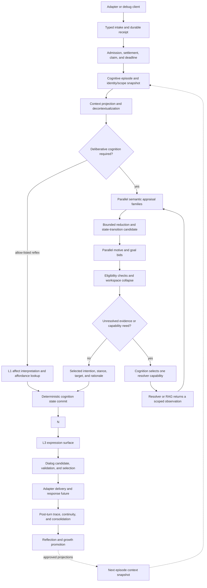
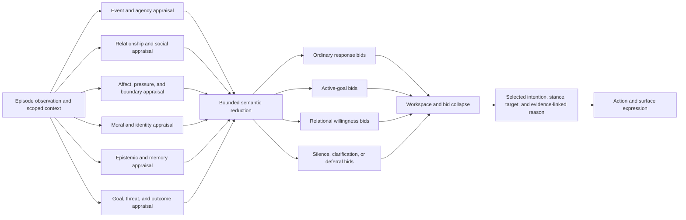
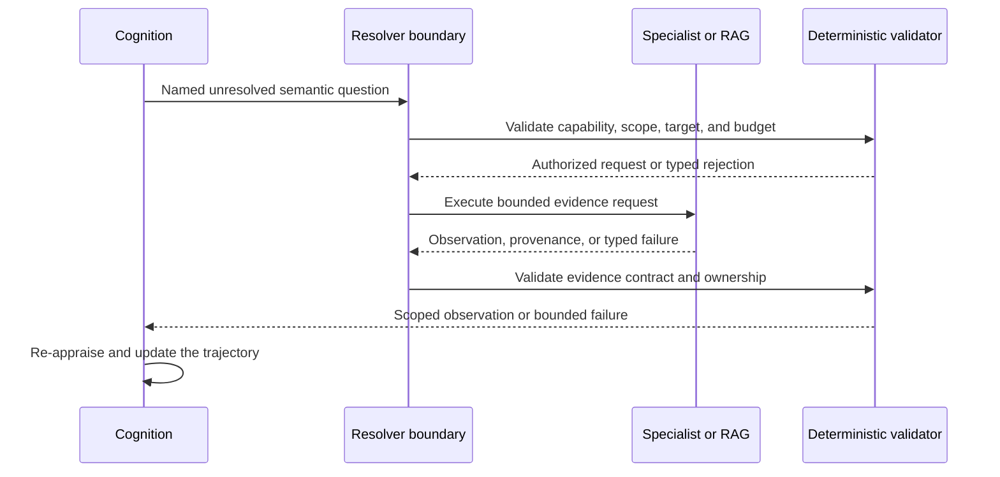
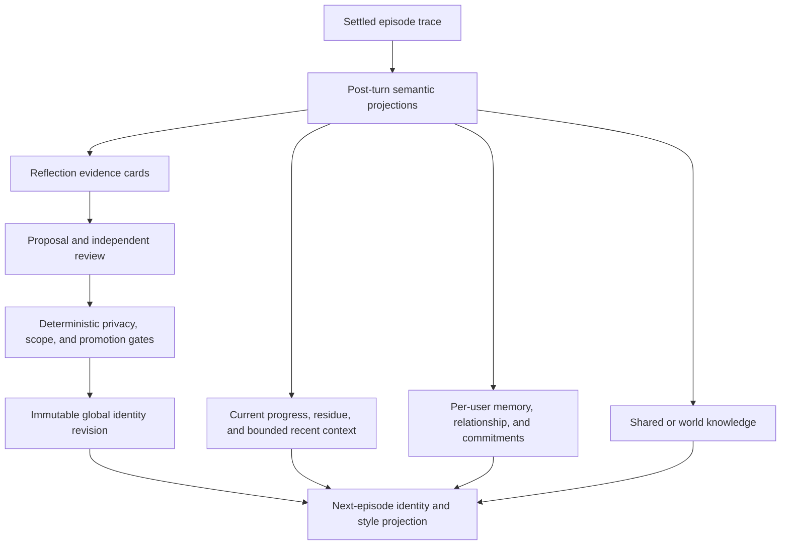
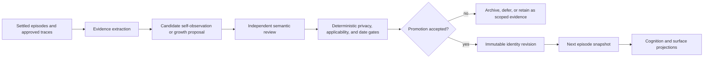

# Explicit Cognitive Trajectory (COT) Architecture

## Document control

- **Status:** Draft target architecture
- **Document type:** System architecture reference
- **Execution authority:** None. Implementation requires a separately approved
  active development plan and an explicit implementation request.
- **Scope:** The bounded path from a typed incoming episode through semantic
  cognition, evidence resolution, state commit, visible expression, and
  post-turn continuity.
- **Current implementation anchors:** the [Cognition Core V2
  ICD](../../src/kazusa_ai_chatbot/cognition_core_v2/README.md), [Cognition
  Resolver ICD](../../src/kazusa_ai_chatbot/cognition_resolver/README.md),
  [Local Context Resolver
  ICD](../../src/kazusa_ai_chatbot/local_context_resolver/README.md), the
  [Cognition Contracts Reference](cognition_contracts_design.md), the [Future
  Architecture](../FUTURE_ARCHITECTURE.md), and the existing
  reflection/consolidation subsystems.
- **Source context:** This draft incorporates the supplied comparative analysis
  notes as design input. Those notes are non-normative; repository source,
  module ICDs, and current architecture references remain authoritative for
  implemented behavior.

## Executive decision

Kazusa should treat explicit cognition as a **semantic cognitive trajectory**,
not as a hidden chain-of-thought string and not as one monolithic agent loop.

The trajectory records the bounded decisions that explain how an episode became
an intention:

```text
typed observation
  -> episode admission and context projection
  -> parallel semantic appraisal
  -> bounded state interpretation
  -> parallel motive and goal bids
  -> workspace collapse
  -> optional evidence-resolution cycles
  -> selected intention and stance
  -> deterministic state commit
  -> action/surface expression
  -> visible dialog and delivery
```

The model owns semantic interpretation. Deterministic code owns scope,
validation, persistence, permissions, limits, execution, and delivery. The
dialog layer expresses a committed intention; it does not decide what the
character believes, wants, permits, or owes.

This is the primary architectural differentiator for Kazusa. A generic
chatbot can produce a plausible answer. Kazusa must be able to preserve and
revisit a character judgment: why this event mattered, whose relationship was
involved, what evidence supported the stance, which competing motives lost,
whether more evidence was needed, and what durable state was allowed to
change.

In this document, **COT** is retained as the familiar shorthand. The precise
architecture term is **Explicit Cognitive Trajectory (ECT)**. The ECT is a
structured semantic projection of cognition. It is not a requirement to expose
or persist the model's private token-level reasoning.

## 1. Design outcomes

The target architecture must provide the following system properties.

### 1.1 Causal character judgment

Every visible response should be traceable to a bounded chain of:

- an admitted observation;
- a scoped context and evidence set;
- semantic appraisals;
- current state and relationship interpretation;
- competing motives or goals;
- a selected intention, stance, or silence decision;
- an expression plan.

The trace explains the decision at a semantic level. It does not reproduce
provider prompts or hidden model deliberation.

### 1.2 Per-user differentiation

The same character must be able to respond differently to two users because
the current event is interpreted through different relationship state,
boundaries, history, commitments, and unresolved injuries. A `USER.md`-style
persona note is insufficient as the authoritative mechanism.

### 1.3 Bounded deliberation

The common path remains inspectable and latency-bounded. Parallel appraisal
families and goal branches may run concurrently, but the system has explicit
limits on branch count, resolver recurrence, context size, retries, and total
work. A more elaborate trajectory must be earned by an evidence gap or an
explicitly configured capability.

### 1.4 Evidence without semantic abdication

RAG, memory, tools, and other resolvers return observations with provenance.
They do not decide the character's stance, relationship meaning, priority, or
final wording. Cognition interprets evidence and decides whether it changes the
trajectory.

### 1.5 Durable continuity without prompt leakage

The architecture separates live context, episode continuity, per-user durable
state, shared/world knowledge, and global character growth. Storage success,
retrievability, prompt inclusion, and visible influence are separate states.

### 1.6 Controlled character growth

Reflection and growth operate outside the live response path. A settled episode
may produce evidence for a proposal, but only an independently reviewed,
deterministically gated promotion can create a global identity revision.

## 2. Architectural boundaries

Kazusa is a character brain service with thin platform adapters:

```text
adapter or debug client
  -> brain intake
  -> admission and episode projection
  -> cognition and resolver loop
  -> state commit
  -> action/surface/dialog
  -> adapter delivery
  -> post-turn continuity and growth
```

The following ownership boundaries are normative for the target.

| Boundary | Semantic owner | Deterministic owner | Result |
| --- | --- | --- | --- |
| Intake | Admission judgment when required | Envelope validation, identity, queueing, claim, deadline | A typed episode candidate |
| Context projection | Decontextualization and semantic normalization | Scope, provenance, participant bindings, contract validity | An episode-ready observation |
| Appraisal | Event, social, affective, moral, epistemic, goal, and identity interpretation | Branch inputs, budgets, output validation, reduction | Bounded appraisal results |
| State transition | Proposed semantic meaning of a change | Bounds, ownership, conflict policy, persistence, replacement | A validated replacement-state candidate |
| Goal formation | Motives, candidate goals, willingness, silence rationale | Evidence handles, completeness, eligibility, branch limits | Complete goal bids |
| Workspace collapse | General priority and intention selection | Relational hard gates, permissions, target ownership, deterministic tie rules | One selected intention or silence |
| Evidence resolution | Choice of the unresolved semantic question and interpretation of evidence | Capability routing, authorization, timeouts, recurrence caps | An observation or typed failure |
| Action | Semantic action purpose and modality-neutral action intent | Capability, permission, route, target, idempotency, execution | An action result |
| Expression | L3 surface plan and dialog wording | Stance consistency, addressee, formatting, delivery contract | A visible surface |
| Continuity and growth | Extraction, reflection proposal, review meaning | Retention, privacy, promotion, versioning, cache invalidation | Durable projections |

The important rule is that a downstream layer can constrain or reject an
upstream result, but it cannot silently take over the upstream semantic
question. Dialog cannot become a second cognition engine. RAG cannot become
persona. Persistence cannot become a semantic repairer.

## 3. Runtime sequence

The target live path is a stateful sequence with one bounded recurrence point:
the resolver loop. A resolver cycle returns to cognition with an observation;
it does not bypass cognition and write directly into dialog.



### 3.1 Sequence rules

1. **The adapter delivers typed facts.** The brain consumes message-envelope
   fields, participant roles, source scope, and delivery metadata. Raw
   platform syntax is not the brain's primary contract.
2. **Admission is separate from stance.** Relevance or admission can decide
   that an event deserves cognition. It cannot decide the character's final
   attitude or guarantee that visible text must be produced.
3. **An episode freezes the decision context.** The episode has a stable
   source identity, current-user binding, participant scope, and identity
   snapshot. Later post-turn changes cannot rewrite the episode that produced
   the response.
4. **Cognition may ask for evidence.** The selected resolver capability returns
   an observation. The new observation re-enters the same semantic ownership
   path.
5. **Commit precedes expression.** The final selected state and intention are
   validated and committed before action execution, L3 surface formation,
   dialog rendering, or delivery. A reflex produces a compact intention/state
   candidate before using the same commit boundary.
6. **Post-turn work is separate.** Persistence, consolidation, scheduler
   updates, reflection, and growth do not retroactively alter the visible
   response.

## 4. The explicit cognitive trajectory

### 4.1 Three representations

The architecture distinguishes three different things that are often conflated
under “COT”.

| Representation | Purpose | Retention and visibility |
| --- | --- | --- |
| **Model-private reasoning** | Temporary provider-specific generation process | Not a contract; not exposed or used as durable truth |
| **Semantic trajectory** | Bounded stage outputs that explain the decision | Sanitized and typed projections may enter protected diagnostics, episode traces, and declared continuity lanes |
| **Private monologue/residue** | Character-like first-person continuity or self-observation | Optional, bounded, scoped to declared consumers; never the authoritative state or stance |

The semantic trajectory is the architecture's explicit COT. It should contain
decision-relevant meaning such as:

- the settled observation and episode identity;
- the semantic appraisals that were allowed to participate;
- evidence handles and provenance;
- state-transition candidates and their disposition;
- goal bids and why they were eligible or rejected;
- the selected intention, stance, target, and confidence;
- unresolved questions and resolver outcomes;
- the expression constraints passed to L3 and dialog.

It should not contain raw provider prompts, secrets, unrestricted database
rows, adapter wire payloads, or an unbounded stream of private token-level
thoughts.

### 4.2 Semantic trajectory graph

The trajectory is a directed acyclic graph for a normal cognition cycle. The
resolver is a bounded recurrence that adds an observation and starts another
cycle; it does not create arbitrary self-spawning agent loops.



The graph is explicit at the semantic boundary while remaining flexible in
the model implementation. A local model may use several short calls, one
structured call for a compatible group, or a bounded specialist call. The
wire contract is the validated semantic result, not the prompt arrangement.

### 4.3 Stage contract

Each stage answers one semantic question. A stage must have a typed input,
bounded output, explicit owner, and declared retention policy.

| Stage | Semantic question | Required result |
| --- | --- | --- |
| Admission | Is this typed event eligible for a cognition attempt? | Settled admission status and reason |
| Episode projection | What is the current event in character-relevant terms? | Decontextualized observation with scope and evidence handles |
| Appraisal | What does the event mean across the enabled semantic families? | Independent appraisal results |
| State interpretation | How does the event affect current affect, goals, relationship, or continuity? | Validated state-transition candidate |
| Goal bidding | What does the character currently want to accomplish, avoid, protect, or leave unresolved? | Complete evidence-linked goal bid |
| Workspace collapse | Which complete bid, if any, governs this episode? | Selected intention or grounded silence |
| Resolution | What missing observation would reduce the current uncertainty? | One authorized capability request or a typed failure |
| Action planning | What modality-neutral action, if any, follows from the selected intention? | Action specification candidate |
| Surface planning | How should the committed intention be expressed in this channel? | L3 surface plan |
| Dialog rendering | What exact wording realizes the plan? | Validated candidate and selected dialog |
| Continuity | What should persist or be scheduled after the turn? | Scoped durable projection or no-op |

### 4.4 Complete bids

A goal bid is not merely a score. It is a self-contained semantic candidate
that can survive workspace collapse. At minimum it explains:

- the goal or motive;
- the current stance;
- the intended target or addressee;
- the episode evidence supporting it;
- relevant expected consequences;
- why it is appropriate now;
- whether it requires clarification, a resolver, an action, a surface, or
  silence.

Incomplete bids are not allowed to become visible behavior through a
downstream guess. A branch that cannot produce its required contract is
discarded or causes a bounded regeneration according to the owning stage's
policy.

The distinction between `reason` and `private_monologue` is intentional:

- `reason` is an analytic explanation of the selected semantic candidate;
- `private_monologue` is optional first-person character continuity;
- neither is a replacement for the typed selected intention or state.

## 5. Episode, context, and state snapshots

### 5.1 Episode identity

An episode is the unit that binds observation, cognition, evidence, state
commit, expression, and post-turn trace. It carries:

- source and conversation scope;
- current global user identity, when applicable;
- typed addressee, reply, mention, and participant roles;
- event time and ordering information;
- the character identity revision visible at episode start;
- context and evidence lineage;
- correlation identifiers for protected diagnostics.

The episode snapshot is immutable as a decision context. New messages, scheduler
events, or post-turn growth create new episodes.

### 5.2 Context projections

The model receives semantic projections instead of raw persistence structures.
Projection code translates authoritative state into human-readable meaning,
for example:

- qualitative relationship bands instead of raw relationship numbers;
- current goals and pressures instead of database records;
- bounded memory evidence instead of unfiltered history;
- participant roles instead of platform-specific mention syntax;
- evidence summaries with handles instead of arbitrary retrieved rows.

The projection must preserve enough provenance for cognition to cite or reject
the evidence. It must not make the model infer ownership or scope from a
database key.

### 5.3 State commit

Semantic stages may propose state changes. A deterministic reducer decides
whether a proposed replacement is admissible and applies it atomically within
the owning scope.

The reducer owns:

- identity and user ownership;
- field bounds and normalization;
- conflict resolution;
- optimistic version or replacement checks;
- persistence and cache invalidation;
- action and delivery prerequisites.

The reducer does not invent a character feeling or silently reinterpret an
LLM decision. If a semantic result is missing or contradictory, the owning
stage receives a typed contract error or the boundary fails closed.

## 6. Per-user affinity and multi-axis relationship judgment

### 6.1 Affinity is not a scalar

“Affinity” is a useful product term, but it must not become the authoritative
state model. A single number cannot distinguish trust from attachment,
familiarity from closeness, care from exclusivity, or warmth from boundary
safety.

The target relationship model is a per-global-user, multi-axis state with
evidence and lifecycle. Relevant axes include:

- familiarity;
- positive regard;
- trust;
- attachment;
- desired closeness;
- perceived closeness;
- care;
- boundary safety;
- exclusivity;
- unresolved injury;
- salience.

The exact axis set may evolve, but each axis needs a defined semantic meaning,
owner, evidence policy, decay or update rule, and prompt projection.

### 6.2 Relationship use in the trajectory

Relationship state influences cognition in three distinct places:

1. **Appraisal:** The current event is interpreted differently depending on
   who performed it, what history exists, and which boundaries are active.
2. **Goal bidding:** A relational branch proposes willingness, distance,
   repair, rejection, deferral, or conditional acceptance with evidence.
3. **Workspace constraints:** Relational hard gates prevent a selected goal from
   violating current boundaries, target ownership, or permission state.

The model receives semantic bands and explanations. Raw numeric state is not
placed into the prompt as if it were self-interpreting. Numeric persistence
remains useful for deterministic updates and comparisons, while cognition sees
the intended meaning.

### 6.3 Ownership invariants

- Relationship state is keyed by the canonical global user identity, not by an
  arbitrary platform handle.
- A private observation about user A cannot change the public target, ownership,
  or relationship state of user B.
- Group ambient context and participant-specific context remain separate.
- Third-party participant bindings do not silently become the current user.
- Current-episode evidence takes precedence over stale continuity when the two
  conflict, subject to explicit provenance rules.
- A transient current-turn willingness is not automatically a durable
  relationship update.
- Cross-user generalization requires an explicit character-owned abstraction and
  the same privacy and promotion gates as other growth.

## 7. Cognition-selected resolver loop

### 7.1 Resolver responsibility

A resolver exists to answer a named uncertainty. Examples include local
context retrieval, memory recall, task status, calendar state, capability
availability, or a bounded external observation.

The resolver contract is:

```text
cognition names the uncertainty
  -> deterministic routing and authorization
  -> specialist obtains evidence
  -> evidence is returned with provenance and scope
  -> cognition interprets the evidence
```

The specialist does not select the final stance or directly compose visible
dialog.



### 7.2 Recurrence rules

- Cognition chooses at most one unresolved capability per recurrence step.
- The resolver cannot create a new goal or change the current user identity.
- The resolver result is an observation, never an instruction to believe.
- The same unresolved question cannot loop without a changed observation or an
  explicit bounded retry disposition.
- Timeouts, authorization failures, empty evidence, and malformed results are
  typed outcomes in the trajectory.
- After the configured recurrence budget, cognition must decide with available
  evidence, ask a grounded clarification, defer, or remain silent.

## 8. Intention, action, surface, dialog, and delivery

### 8.1 Selected intention is the semantic handoff

The selected intention is the final semantic result of live cognition. It
contains the minimum information needed by downstream layers:

- what the character is trying to accomplish;
- the current stance and boundaries;
- the target and addressee;
- the permitted modality or action class;
- relevant evidence handles;
- whether visible speech is warranted;
- constraints that dialog must preserve.

It is not a prose answer and it is not an authorization grant.

### 8.2 Action and authorization

The action specification is modality-neutral. It describes purpose, target,
parameters, and expected effect at the architecture boundary. Deterministic
execution validates capability, permission, route, idempotency, and limits.

An LLM may propose a useful action. It cannot grant itself a capability or
declare that delivery succeeded.

### 8.3 L3 and dialog

L3 specializes the committed intention for a visible channel or output
surface. Dialog generation creates candidates and validates them against the
surface plan. It may choose natural wording, but it does not re-decide:

- the character's stance;
- relationship meaning;
- whether a prohibited action is allowed;
- target ownership;
- facts that were not in the committed semantic input;
- whether a different goal should have won.

The adapter delivers the returned surface and reports transport results. It
does not infer character cognition from a platform response.

## 9. Continuity, memory, and retention lanes

Kazusa should describe memory by **semantic lane, scope, retention, and
promotion policy**, rather than presenting short-, medium-, and long-term
memory as native interchangeable APIs.



### 9.1 Retention lanes

| Lane | Typical content | Primary owner | Live-chat rule |
| --- | --- | --- | --- |
| Current episode | Active observation, appraisals, bids, selected intention | Cognition runtime | Available only for the episode |
| Conversation continuity | Progress, commitments, bounded residue, recent settled dialog | Progress/consolidation | Loaded through scoped projections |
| Per-user continuity | Relationship axes, user memories, user commitments, style | User state and memory owners | Filtered by canonical global user |
| Shared/world knowledge | Common facts and character-world context | Curated memory owner | Returned as evidence with provenance |
| Reflection evidence | Settled episode abstractions and candidate lessons | Reflection/growth loop | Never injected raw into ordinary cognition |
| Global character identity | Approved identity revisions and durable self-guidance | Identity-growth owner | Visible only after promotion and next-episode snapshot |

### 9.2 Write and read timing

The current response path loads eligible context before cognition. Durable
post-turn writes occur after the visible response future is settled. Therefore:

- a successful write does not mean the current prompt already contains it;
- a stored memory is not necessarily retrievable;
- retrievable evidence is not necessarily selected;
- selected evidence is not necessarily allowed to change stance;
- a growth proposal is not a promoted identity revision.

This distinction prevents memory storage from becoming an implicit second
cognition engine.

### 9.3 Residue and private continuity

Private monologue and internal residue can help maintain a bounded sense of
continuity, but they are not authoritative state. They must have:

- an explicit producer and consumer;
- a scope and expiry;
- a bounded size;
- a provenance link to the episode;
- a policy for conflict with current observations.

Raw reflection, unreviewed self-talk, or stale residue cannot enter ordinary
live cognition simply because it exists.

## 10. Character growth and identity revision

Growth is a slow semantic loop over settled episodes, not a side effect of
generating a reply.



### 10.1 Growth categories

The architecture separates at least four kinds of change:

1. **Operational state:** Current affect, pressure, active goals, tasks, and
   temporary commitments.
2. **Interaction style:** Per-user or group-specific ways of responding.
3. **Durable memory:** Facts or episodic knowledge that remain scoped to their
   owner and evidence.
4. **Global identity revision:** A character-owned change that is applicable
   beyond the originating user or episode.

Only the fourth category changes global identity. Per-user warmth, a single
injury, or an unreviewed reflection must not silently become a global
personality rewrite.

### 10.2 Promotion requirements

An identity revision requires evidence lineage and deterministic gates for:

- episode and source ownership;
- privacy and sensitivity;
- cross-user applicability;
- duplicate or conflicting root episodes;
- temporal eligibility and promotion frequency;
- immutable version creation;
- rollback or reset semantics;
- consumption by a later episode snapshot.

The promotion result is a new versioned projection. It does not mutate the
meaning of an already-running episode.

## 11. Reflex and deliberative paths

Not every event requires the full deliberative graph. A reflex path is allowed
only when a registry explicitly defines:

- the event class;
- the bounded L1 interpretation;
- the affordance lookup;
- the safe action or surface class;
- the permission and delivery checks;
- the trace and fallback behavior.

The reflex path is a latency optimization, not a semantic shortcut around
ownership. It cannot bypass permission, target validation, action limits,
delivery checks, or required state commit. Any event outside the allow-list
enters deliberative cognition.

L1, L2, and L3 are concerns and responsibility boundaries, not mandatory
serial pipeline stages:

- **L1:** affective and immediate semantic interpretation;
- **L2:** deliberative appraisal, goals, relationship judgment, and resolution;
- **L3:** channel or surface-specific expression.

The normal path composes these concerns. A registered reflex may combine an L1
interpretation with an affordance and L3 surface, while preserving the same
deterministic controls.

## 12. Local-model and runtime design

The target is designed for local or weaker models as well as larger providers.
The architecture therefore optimizes for semantic decomposition and bounded
context, not maximum prompt size.

### 12.1 Prompt construction

- Present semantic projections, not raw database schemas.
- Keep dynamic facts in clearly separated runtime sections.
- Use stable stage instructions and small output contracts.
- Keep relationship axes qualitative in model context.
- Require evidence handles rather than copied source text.
- Ask each branch one semantic question.
- Preserve the distinction between analytic reason and first-person residue.

### 12.2 Parallelism

The appraisal families are independent only where their inputs and output
contracts are independent. Goal branches become eligible after their declared
appraisal dependencies are ready. Workspace collapse waits for complete bids.

Parallelism must not create nondeterministic state writes. Branch results are
collected, validated, and reduced by one owning boundary.

### 12.3 Bounds and degradation

Every semantic stage has:

- an output schema and attempt cap;
- a context and evidence budget;
- a timeout and cancellation path;
- a typed contract-error disposition;
- a fallback or fail-closed policy;
- a protected trace record.

If a nonessential branch fails, the trajectory may continue with an explicit
degradation marker. If a required semantic result, target, permission, or
state commit cannot be validated, visible action is withheld or reduced to a
grounded clarification/silence decision.

The canonical JSON parsing and repair entry point remains the first boundary
for raw model output. Repair may fix transport or structural syntax; it cannot
invent a stance, relationship decision, evidence meaning, or permission.

## 13. Observability and replay

The trajectory must be inspectable without exposing protected model material.
Use two related diagnostic projections:

### 13.1 Semantic trace

The semantic trace is safe for ordinary architecture and quality review. It
contains bounded fields such as:

- episode and stage status;
- branch names and completion state;
- evidence handles and provenance class;
- selected or rejected goal identifiers;
- selected intention and stance;
- state commit disposition;
- resolver recurrence count and outcome class;
- surface and delivery status.

### 13.2 Protected trace

The protected trace may contain raw provider/configuration details, prompts,
parsed outputs, contract errors, and regeneration history for authorized
diagnosis. It remains access-controlled and is not a normal cognition input.

### 13.3 Replay principle

A replay should be able to answer:

1. What episode was admitted?
2. Which user and participants owned the relevant state?
3. Which evidence was available and which was selected?
4. Which appraisal and goal branches completed?
5. Why did the selected intention win?
6. Which state replacement was committed?
7. What did L3 and dialog receive?
8. What post-turn projections were written or promoted?

Replay is a semantic audit capability. It is not a promise that a stochastic
provider will reproduce identical prose.

## 14. Target invariants

The following invariants define architectural acceptance.

1. **RAG evidence is not stance.** Retrieval supplies evidence; cognition
   interprets it.
2. **Private monologue is not truth.** Residue is scoped continuity, not
   authoritative state.
3. **Dialog is downstream.** Dialog cannot change the selected goal, stance,
   target, permission, or relationship meaning.
4. **Commit precedes expression.** Visible output and action execution use a
   validated cognition commit.
5. **Every user-specific fact has an owner.** Global user identity and scope
   are explicit throughout the trajectory.
6. **Affinity remains multi-axis.** A derived affinity summary cannot replace
   trust, closeness, boundaries, care, injury, or other relevant axes.
7. **Current evidence beats stale continuity.** Conflict resolution follows
   provenance and episode rules rather than retrieval order.
8. **Capabilities are not self-authorizing.** An LLM proposal requires
   deterministic capability and permission checks.
9. **Resolvers re-enter cognition.** Evidence cannot jump directly to dialog or
   durable stance.
10. **Growth is promoted.** Reflection output does not become global identity
    without independent review and deterministic gates.
11. **Episodes are stable.** A later state change cannot rewrite the identity or
    user snapshot of a completed episode.
12. **Boundaries are inspectable.** Each semantic stage has a typed contract,
    owner, budget, and failure disposition.
13. **No hidden compatibility vocabulary.** A boundary has one canonical
    contract; migration uses an explicit plan rather than silent aliases.
14. **Silence is a decision.** The character stays quiet when no grounded
    reason to speak survives the same evidence and goal checks.
15. **Reflexes are registered.** The fast path is allow-listed and retains
    permission, target, action, and delivery controls.
16. **Post-turn work is causally later.** Consolidation, scheduling, and growth
    cannot influence the current visible response after its commitment point.

## 15. Current implementation alignment

The repository already contains substantial pieces of this target:

- `cognition_core_v2` provides parallel appraisal, dependency-aware goal
  branches, workspace collapse, semantic relationship projections, state
  replacement, action planning, and protected trace concepts.
- `goal_cognition` distinguishes analytic `reason` from first-person
  `private_monologue` and requires evidence-linked semantic candidates.
- The cognition resolver boundary separates capability selection, evidence
  retrieval, and cognition's interpretation of the result.
- The current cognition contracts reference defines the inter-layer residue
  bus, modality-neutral action specification, affordance registry, engine
  routing, memory interface, and capability-surface uniformity.
- Reflection, consolidation, progress, user memory, and identity-growth
  modules provide the separate post-turn and slow-loop ownership needed by the
  target.

The target architecture consolidates these ideas into one trajectory model. It
does not declare every current implementation detail complete. Any mismatch
between this draft and implemented behavior must be resolved through an
explicit architecture decision and an approved implementation plan.

## 16. Adoption boundaries

This document is an architecture target, not an implementation checklist. The
following boundaries should be preserved when it is turned into execution work:

1. Establish the canonical trajectory vocabulary and semantic projections.
2. Define the minimum cross-stage decision contract and trace projection.
3. Verify the per-user relationship and target-ownership path end to end.
4. Verify resolver recurrence and failure behavior with bounded live traces.
5. Verify commit-before-surface behavior and dialog non-reinterpretation.
6. Verify continuity retention lanes and post-turn timing.
7. Verify growth promotion, identity snapshots, and cross-user privacy gates.
8. Add or revise code only through scoped active plans with explicit tests and
   acceptance evidence.

Each implementation slice should preserve the live response path as bounded
and inspectable. A future plan should avoid building a parallel “new COT
engine” beside the existing cognition core; it should converge existing
contracts on the canonical trajectory boundary.

## 17. Open validation questions

The target still needs evidence-backed decisions for:

- the exact canonical semantic trajectory record and its retention classes;
- which stage outputs are safe for control-console display versus protected
  diagnostics;
- the final registry and contract for allow-listed reflexes;
- the resolver recurrence budget for each capability family;
- the deterministic reduction rules when relationship hard gates conflict with
  general goal priority;
- the minimum evidence required for each relationship-axis update;
- the promotion cadence and rollback semantics for global identity revisions;
- the exact boundary between current progress, residue, and episode trace;
- the operational replay contract for stochastic provider substitutions.

These are design follow-ups, not permission to change production behavior.

## 18. Non-goals

This architecture does not:

- expose raw hidden chain-of-thought to users;
- require one provider, model, prompt layout, or agent framework;
- make RAG or memory responsible for character judgment;
- make deterministic code invent semantic motives or feelings;
- replace typed state with a prose transcript;
- force every event through the full deliberative graph;
- turn post-turn reflection into live-turn cognition;
- define adapter-specific wire protocols;
- replace implementation ICDs or executable development plans.
