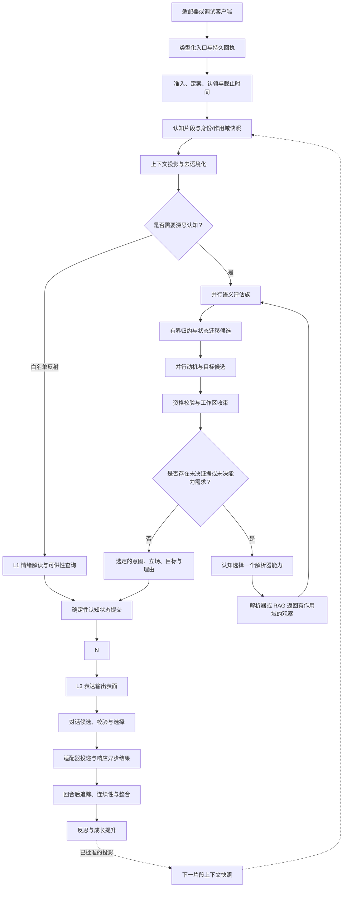
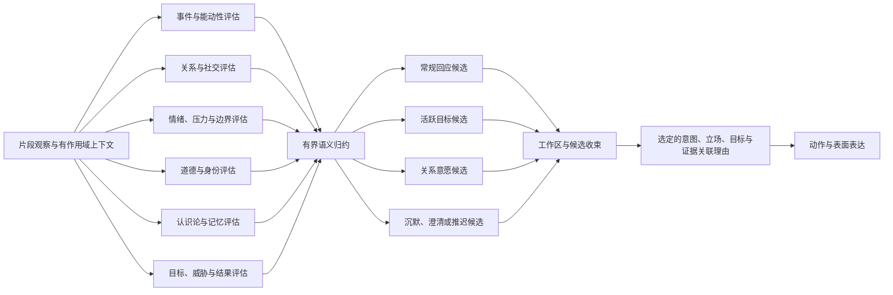
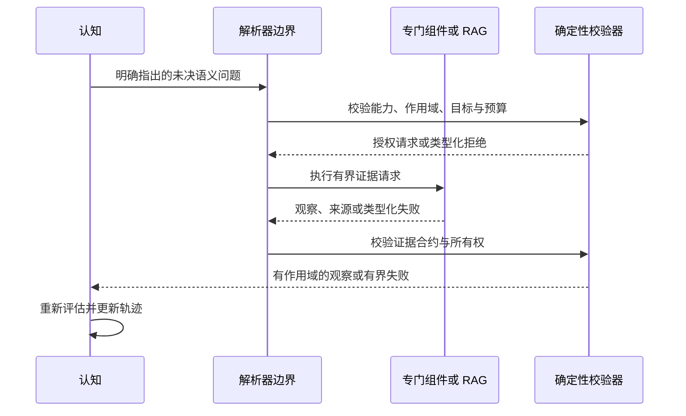
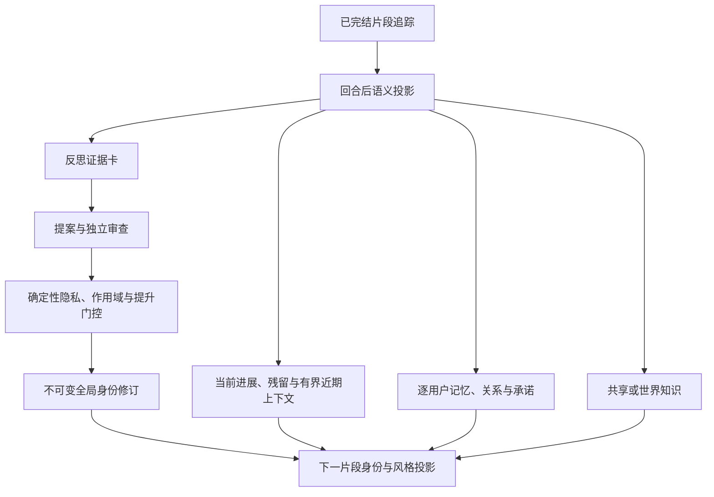

# 显式认知轨迹（COT）架构

## 文档控制

- **状态：** 目标架构草案
- **文档类型：** 系统架构参考
- **执行授权：** 无。实施需要另行批准且处于有效状态的开发计划，以及明确的实施请求。
- **范围：** 涵盖从类型化输入片段出发，经过语义认知、证据解析、状态提交和可见表达，直到回合后连续性的有界路径。
- **当前实现锚点：** [认知核心 V2 ICD](../../src/kazusa_ai_chatbot/cognition_core_v2/README.md)、[认知解析器 ICD](../../src/kazusa_ai_chatbot/cognition_resolver/README.md)、[本地上下文解析器 ICD](../../src/kazusa_ai_chatbot/local_context_resolver/README.md)、[认知合约参考](cognition_contracts_design.md)、[未来架构](../FUTURE_ARCHITECTURE.md)以及现有的反思/整合子系统。
- **资料来源：** 本草案将所提供的对比分析笔记作为设计输入纳入。这些笔记不具规范性；对于已实现的行为，仓库源码、模块 ICD 与当前架构参考仍然具有权威性。

## 总体决策

Kazusa 应将显式认知视为一种**语义认知轨迹**，而不是一条隐藏的思维链字符串，也不是一个单体式代理循环。

轨迹记录那些有界决策，用以说明一个片段如何演变为一种意图：

```text
类型化观察
  -> 片段准入与上下文投影
  -> 并行语义评估
  -> 有界状态解读
  -> 并行动机与目标候选
  -> 工作区收束
  -> 可选证据解析循环
  -> 选定的意图与立场
  -> 确定性状态提交
  -> 动作/表面表达
  -> 可见对话与投递
```

模型负责语义解读。确定性代码负责作用域、校验、持久化、权限、限制、执行与投递。对话层表达已提交的意图；它不决定角色相信什么、想要什么、允许什么或亏欠什么。

这是 Kazusa 最核心的架构差异点。通用聊天机器人可以给出貌似合理的回答；Kazusa 必须能够保留并回溯一次角色判断：这个事件为什么重要、牵涉了与谁的关系、哪些证据支撑了立场、哪些相互竞争的动机落败、是否还需要更多证据，以及哪些持久状态被允许改变。

在本文中，**COT** 沿用为熟悉的简称。准确的架构术语是**显式认知轨迹（ECT）**。ECT 是认知的结构化语义投影，并不意味着必须暴露或持久化模型私有的词元级推理。

## 1. 设计目标

目标架构必须提供以下系统属性。

### 1.1 因果性角色判断

每个可见回应都应能追溯到一个有界链条：

- 一条已准入的观察；
- 一组有作用域的上下文与证据；
- 语义评估；
- 当前状态与关系解读；
- 相互竞争的动机或目标；
- 一个选定的意图、立场或沉默决定；
- 一个表达计划。

该追踪在语义层面解释决策，不重现供应商提示词或隐藏的模型推演。

### 1.2 逐用户差异化

同一个角色必须能够对两位用户给出不同回应，因为当前事件是通过不同的关系状态、边界、历史、承诺与未愈合的伤害来解读的。`USER.md` 式的人设笔记不足以作为权威机制。

### 1.3 有界深思

常规路径保持可检查且延迟有界。并行评估族与目标分支可以并发运行，但系统对分支数量、解析器循环次数、上下文规模、重试次数与总工作量都有显式限制。更精细的轨迹必须建立在证据缺口或显式配置的能力之上。

### 1.4 有证据但不放弃语义判断

RAG、记忆、工具与其他解析器返回带来源的观察。它们不决定角色的立场、关系含义、优先级或最终措辞。认知解读证据，并决定它是否改变轨迹。

### 1.5 无提示词泄漏的持久连续性

架构分离实时上下文、片段连续性、逐用户持久状态、共享/世界知识与全局角色成长。存储是否成功、能否被检索到、是否进入提示词、是否产生可见影响，是彼此独立的状态。

### 1.6 受控的角色成长

反思与成长在实时回应路径之外运行。已完结的片段可以为提案产生证据，但只有经过独立审查、确定性门控的提升才能形成全局身份修订。

## 2. 架构边界

Kazusa 是一个带轻量平台适配器的角色大脑服务：

```text
适配器或调试客户端
  -> 大脑入口
  -> 准入与片段投影
  -> 认知与解析器循环
  -> 状态提交
  -> 动作/表面/对话
  -> 适配器投递
  -> 回合后连续性与成长
```

下列所有权边界对目标具有规范性。

| 边界 | 语义所有者 | 确定性所有者 | 结果 |
| --- | --- | --- | --- |
| 入口 | 必要时进行准入判断 | 信封校验、身份、排队、认领、截止时间 | 一个类型化片段候选 |
| 上下文投影 | 去语境化与语义规范化 | 作用域、来源、参与者绑定、合约有效性 | 一条可直接用于片段认知的观察 |
| 评估 | 事件、社交、情绪、道德、认识论、目标与身份解读 | 分支输入、预算、输出校验、归约 | 有界评估结果 |
| 状态迁移 | 变更的语义含义提案 | 边界、所有权、冲突策略、持久化、替换 | 一个通过校验的替换状态候选 |
| 目标形成 | 动机、候选目标、意愿、沉默理由 | 证据句柄、完整性、资格、分支上限 | 完整的目标候选 |
| 工作区收束 | 通用优先级与意图选择 | 关系硬性门控、权限、目标所有权、确定性平局规则 | 一个选定的意图或沉默 |
| 证据解析 | 选择未决的语义问题并解读证据 | 能力路由、授权、超时、循环次数上限 | 一个观察或类型化失败 |
| 动作 | 语义动作目的与模态无关的动作意图 | 能力、权限、路由、目标、幂等性、执行 | 一个动作结果 |
| 表达 | L3 表面计划与对话措辞 | 立场一致性、收件人、格式、投递合约 | 一个可见表面 |
| 连续性与成长 | 抽取、反思提案、审查含义 | 留存、隐私、提升、版本化、缓存失效 | 持久投影 |

关键规则是：下游层可以约束或拒绝上游结果，但不能静默接管上游的语义问题。对话不能变成第二个认知引擎，RAG 不能承担人设判断，持久化不能变成语义修复器。

## 3. 运行时序列

目标的实时路径是一个有状态序列，只有一个有界循环点：解析器循环。解析器的一轮循环带着一个观察回到认知；它不会绕过认知直接写入对话。



### 3.1 序列规则

1. **适配器投递类型化事实。** 大脑消费消息信封字段、参与者角色、来源作用域与投递元数据。原始平台语法不是大脑的主要合约。
2. **准入与立场分离。** 相关性或准入可以决定某个事件值得认知处理，但不能决定角色的最终态度，也不能保证必须产生可见文本。
3. **片段冻结决策上下文。** 片段具有稳定的来源身份、当前用户绑定、参与者作用域与身份快照。回合后发生的后续变化不能改写产生该回应的片段。
4. **认知可以请求证据。** 选中的解析器能力返回一个观察，新的观察重新进入同一条由语义层负责的处理路径。
5. **提交先于表达。** 最终选定的状态与意图在动作执行、L3 表面形成、对话渲染或投递之前完成校验并提交。反射在复用同一提交边界之前，先产生一个紧凑的意图/状态候选。
6. **回合后工作独立。** 持久化、整合、调度器更新、反思与成长不会追溯性改变可见回应。

## 4. 显式认知轨迹

### 4.1 三种表示

架构区分了常被统称为“COT”的三类不同对象。

| 表示 | 用途 | 留存与可见性 |
| --- | --- | --- |
| **模型私有推理** | 临时的供应商特定生成过程 | 不是合约；不暴露，也不作为持久事实使用 |
| **语义轨迹** | 解释决策的有界阶段输出 | 脱敏且类型化的投影可以进入受保护诊断、片段追踪与已声明的连续性通道 |
| **内心独白/残留** | 类似角色的第一人称连续性或自我观察 | 可选、有界、限定于声明的消费者；永远不是权威状态或立场 |

语义轨迹是架构的显式 COT。它应包含与决策相关的语义，例如：

- 已确定的观察与片段身份；
- 被允许参与的语义评估；
- 证据句柄与来源；
- 状态迁移候选及其处置；
- 目标候选及其入选或落选原因；
- 选定的意图、立场、目标与置信度；
- 未决问题与解析器结果；
- 传给 L3 与对话的表达约束。

它不应包含原始供应商提示词、机密、未受限的数据库行、适配器传输载荷，或无界的私有词元级思维流。

### 4.2 语义轨迹图

在常规认知循环中，轨迹是一个有向无环图。解析器是一种有界循环，它会追加一个观察并开启下一轮循环；它不会创建任意的自我派生代理循环。



该图在语义边界上保持显式，同时在模型实现上保持灵活。本地模型可以使用几次短调用、对兼容分组使用一次结构化调用，或使用一次有界专家调用。传输合约是经过校验的语义结果，而不是提示词的排布方式。

### 4.3 阶段合约

每个阶段回答一个语义问题。一个阶段必须有类型化输入、有界输出、明确所有者与声明的留存策略。

| 阶段 | 语义问题 | 必需结果 |
| --- | --- | --- |
| 准入 | 这个类型化事件是否符合一次认知尝试的资格？ | 已确定的准入状态与原因 |
| 片段投影 | 以角色相关的术语来看，当前事件是什么？ | 带作用域与证据句柄的去语境化观察 |
| 评估 | 事件在启用的语义族中意味着什么？ | 相互独立的评估结果 |
| 状态解读 | 事件如何影响当前情绪、目标、关系或连续性？ | 通过校验的状态迁移候选 |
| 目标候选形成 | 角色当前想完成、回避、保护或搁置什么？ | 完整的证据关联目标候选 |
| 工作区收束 | 哪个完整候选（如有）主导本片段？ | 选定的意图或有依据的沉默 |
| 解析 | 哪个缺失的观察能减少当前不确定性？ | 一个经授权的能力请求或类型化失败 |
| 动作规划 | 从选定的意图出发，应当采取什么模态无关的动作（如有）？ | 动作规格候选 |
| 表面规划 | 已提交的意图应如何在该通道中表达？ | L3 表面计划 |
| 对话渲染 | 用什么确切措辞实现该计划？ | 通过校验的候选与选定的对话 |
| 连续性 | 回合后应持久化或调度什么？ | 有作用域的持久投影或无操作 |

### 4.4 完整候选

目标候选不只是一个分数。它是一个自包含的语义候选，能够经工作区收束后存续。它至少解释：

- 目标或动机；
- 当前立场；
- 目标对象或收件人；
- 支撑它的片段证据；
- 相关的预期后果；
- 为什么现在合适；
- 它需要澄清、解析器、动作、表面还是沉默。

不完整的候选不允许通过下游猜测变成可见行为。无法产出所需合约的分支会被丢弃，或按所属阶段的策略触发有界重新生成。

`reason` 与 `private_monologue` 的区别是有意为之：

- `reason` 是对选定语义候选的分析性解释；
- `private_monologue` 是可选的、第一人称的角色连续性；
- 两者都不能替代类型化的选定意图或状态。

## 5. 片段、上下文与状态快照

### 5.1 片段身份

片段是绑定观察、认知、证据、状态提交、表达与回合后追踪的单位。它携带：

- 来源与对话作用域；
- 适用时的当前全局用户身份；
- 类型化的收件人、回复、提及与参与者角色；
- 事件时间与顺序信息；
- 片段开始时生效的角色身份修订；
- 上下文与证据谱系；
- 用于受保护诊断的关联标识符。

片段快照作为决策上下文是不可变的。新消息、调度器事件或回合后成长都会创建新片段。

### 5.2 上下文投影

模型接收语义投影，而不是原始持久化结构。投影代码把权威状态转换为人类可读的含义，例如：

- 用定性关系分档代替原始关系数值；
- 用当前目标与压力代替数据库记录；
- 用有界记忆证据代替未过滤的历史；
- 用参与者角色代替平台特定的提及语法；
- 用带句柄的证据摘要代替任意检索到的行。

投影必须保留足够来源，让认知能够引用或拒绝证据。它不能让模型从数据库键推断所有权或作用域。

### 5.3 状态提交

语义阶段可以提出状态变更。确定性归约器决定提议的替换是否可接受，并在所属作用域内以原子方式应用它。

归约器负责：

- 身份与用户所有权；
- 字段边界与规范化；
- 冲突解决；
- 乐观版本或替换校验；
- 持久化与缓存失效；
- 动作与投递前置条件。

归约器不会虚构角色感受，也不会静默重新解释 LLM 的决定。如果语义结果缺失或自相矛盾，所属阶段会收到类型化合约错误，或按该边界的失败关闭策略处理。

## 6. 逐用户亲和度与多轴关系判断

### 6.1 亲和度不是标量

“亲和度”是一个有用的产品术语，但不能成为权威状态模型。单一数字无法区分信任与依恋、熟悉与亲近、关怀与排他、温情与边界安全。

目标关系模型是一种按全局用户区分、带证据与生命周期的多轴状态。相关轴包括：

- 熟悉度；
- 积极关注；
- 信任；
- 依恋；
- 期望亲密度；
- 感知亲密度；
- 关怀；
- 边界安全；
- 排他性；
- 未愈合的伤害；
- 显著性。

具体的轴集合可以演进，但每个轴都需要明确的语义含义、所有者、证据策略、衰减或更新规则，以及提示词投影。

### 6.2 关系在轨迹中的使用

关系状态在三个不同位置影响认知：

1. **评估：** 当前事件会根据参与者、相关历史以及当前生效的边界而得到不同解读。
2. **目标候选：** 关系分支带证据提出意愿、距离、修复、拒绝、推迟或有条件接受。
3. **工作区约束：** 关系硬性门控阻止选定的目标违反当前边界、目标所有权或权限状态。

模型接收语义分档与解释。原始数值状态不会被当作可自我解释的内容直接放进提示词。数值持久化对确定性更新与比较仍然有用，而认知看到的是其预期含义。

### 6.3 所有权不变量

- 关系状态以规范全局用户身份为键，而不是任意平台句柄。
- 关于用户 A 的私密观察不能改变用户 B 的公开目标、所有权或关系状态。
- 群聊环境上下文与参与者特定上下文保持分离。
- 第三方参与者绑定不会静默变成当前用户。
- 当当前片段证据与过时连续性冲突时，前者优先，但受显式来源规则约束。
- 当前回合中暂时出现的意愿不会自动成为持久的关系更新。
- 跨用户泛化需要一个明确归属于角色的抽象，并沿用与其他成长相同的隐私与提升门控。

## 7. 认知选择的解析器循环

### 7.1 解析器职责

解析器的职责，是回答一个明确指出的不确定问题。示例包括本地上下文检索、记忆召回、任务状态、日历状态、能力可用性，或有界外部观察。

解析器合约：

```text
认知指明不确定问题
  -> 确定性路由与授权
  -> 专门组件获取证据
  -> 证据连同来源与作用域一并返回
  -> 认知解读证据
```

专门组件不选择最终立场，也不直接撰写可见对话。



### 7.2 循环规则

- 认知在每个循环步最多选择一个未决能力需求。
- 解析器不能创建新目标，也不能改变当前用户身份。
- 解析器返回的只是观察，绝不是要求相信的指令。
- 同一未决问题不能在没有新观察或显式有界重试处置的情况下循环。
- 超时、授权失败、空证据与格式错误的结果都是轨迹中的类型化结果。
- 在配置的循环预算用尽后，认知必须基于现有证据做出决定、提出有依据的澄清、推迟或保持沉默。

## 8. 意图、动作、表面、对话与投递

### 8.1 选定的意图是语义交接

选定的意图是实时认知的最终语义结果。它包含下游层所需的最小信息：

- 角色试图完成什么；
- 当前立场与边界；
- 目标与收件人；
- 允许的模态或动作类别；
- 相关证据句柄；
- 是否应当产生可见话语；
- 对话必须保留的约束。

它不是一段自然语言回答，也不是授权本身。

### 8.2 动作与授权

动作规格是模态无关的。它在架构边界描述目的、目标、参数与预期效果。确定性执行校验能力、权限、路由、幂等性与限制。

LLM 可以提出有用的动作，但不能自我授予能力，也不能声明投递已成功。

### 8.3 L3 与对话

L3 将已提交的意图具体化为特定可见通道或输出表面上的表达。对话生成创建候选，并按表面计划校验它们。它可以选择自然的措辞，但不能重新决定：

- 角色的立场；
- 关系含义；
- 被禁止的动作是否允许；
- 目标所有权；
- 不在已提交语义输入中的事实；
- 另一个目标是否本应胜出。

适配器负责投递已返回的表面，并报告传输结果。它不会从平台响应推断角色认知。

## 9. 连续性、记忆与留存通道

Kazusa 应按照**语义通道、作用域、留存与提升策略**来描述记忆，而不是把短期、中期与长期记忆呈现为原生可互换的接口。



### 9.1 留存通道

| 通道 | 典型内容 | 主要所有者 | 实时聊天规则 |
| --- | --- | --- | --- |
| 当前片段 | 活跃观察、评估、候选、选定的意图 | 认知运行时 | 仅在该片段期间可用 |
| 对话连续性 | 进展、承诺、有界残留、近期已完结的对话 | 进展/整合 | 通过有作用域投影加载 |
| 逐用户连续性 | 关系轴、用户记忆、用户承诺、风格 | 用户状态与记忆所有者 | 按规范全局用户过滤 |
| 共享/世界知识 | 常识与角色世界背景 | 精选记忆所有者 | 作为带来源的证据返回 |
| 反思证据 | 已完结片段的抽象与候选教训 | 反思/成长循环 | 绝不将原始内容注入常规认知 |
| 全局角色身份 | 已批准的身份修订与持久自我指引 | 身份成长所有者 | 仅在提升与下一片段快照后可见 |

### 9.2 写入与读取时序

当前回应路径在认知之前加载符合条件的上下文。持久回合后写入发生在可见响应的异步结果落定之后。因此：

- 写入成功不意味着当前提示词已经包含它；
- 已存储的记忆不一定可检索；
- 可检索的证据不一定被选中；
- 被选中的证据不一定被允许改变立场；
- 成长提案不是已提升的身份修订。

这一区分防止记忆存储变成隐式的第二认知引擎。

### 9.3 残留与内部连续性

内心独白与内部残留有助于在有限范围内维持连续性，但它们不是权威状态。它们必须具有：

- 明确的生产者与消费者；
- 作用域与有效期；
- 有界大小；
- 与片段的来源关联；
- 与当前观察冲突时的策略。

原始反思、未经审查的自我对话或过时残留，不能仅仅因为存在就进入普通实时认知。

## 10. 角色成长与身份修订

成长是一个围绕已完结片段的慢速语义循环，而不是生成回应的副作用。


### 10.1 成长类别

架构至少区分四类变更：

1. **运行状态：** 当前情绪、压力、活跃目标、任务与临时承诺。
2. **互动风格：** 面向单个用户或特定群组的回应方式。
3. **持久记忆：** 限定于其所有者与证据的事实或情景性知识。
4. **全局身份修订：** 适用范围超出最初用户或片段的角色自有变更。

只有第四类改变全局身份。对单个用户的温情、一次孤立的伤害或未经审查的反思，都不能静默演变为全局人格改写。

### 10.2 提升要求

身份修订需要证据谱系，并通过确定性门控检查：

- 片段与来源所有权；
- 隐私与敏感性；
- 跨用户适用性；
- 重复或冲突的根源片段；
- 时间资格与提升频率；
- 不可变版本创建；
- 回滚或重置语义；
- 供后续片段快照使用。

提升结果是新的版本化投影。它不会改变已在运行中的片段的含义。

## 11. 反射与深思路径

并非每个事件都需要完整的深思图。只有在注册表明确界定了以下内容时，才允许反射路径：

- 事件类别；
- 有界 L1 解读；
- 可供性查询；
- 安全的动作或表面类别；
- 权限与投递校验；
- 追踪与回退行为。

反射路径是为了优化延迟，而不是绕开责任边界的语义捷径。它不能绕过权限、目标校验、动作限制、投递校验或必需的状态提交。白名单之外的任何事件都进入深思认知。

L1、L2 与 L3 是关注点与责任边界，而不是强制的串行流水线阶段：

- **L1：** 情绪性与即时的语义解读；
- **L2：** 深思评估、目标、关系判断与解析；
- **L3：** 通道或表面特定的表达。

常规路径组合这些关注点。已注册的反射可以把 L1 解读、可供性与 L3 表面组合起来，同时保留相同的确定性控制。

## 12. 本地模型与运行时设计

目标既面向本地或较弱模型，也面向规模更大的供应商。因此架构优化的方向是语义分解与有界上下文，而不是最大化提示词规模。

### 12.1 提示词构建

- 呈现语义投影，而不是原始数据库模式。
- 将动态事实放在彼此清晰分隔的运行时区段中。
- 使用稳定的阶段指令与小型输出合约。
- 在模型上下文中保持关系轴的定性。
- 要求证据句柄，而不是复制源文本。
- 让每个分支只回答一个语义问题。
- 保留分析性理由与第一人称残留之间的区分。

### 12.2 并行

评估族只有在输入与输出合约相互独立时才独立。目标分支在其声明的评估依赖就绪后获得资格。工作区收束等待完整候选。

并行不能产生非确定性状态写入。分支结果由同一个责任边界收集、校验并归约。

### 12.3 边界与降级

每个语义阶段都有：

- 输出结构与尝试上限；
- 上下文与证据预算；
- 超时与取消路径；
- 类型化合约错误处置；
- 回退或失败即关闭策略；
- 受保护追踪记录。

如果非关键分支失败，轨迹可以带显式降级标记继续。如果必需的语义结果、目标、权限或状态提交无法通过校验，则暂缓可见动作，或降级为有依据的澄清/沉默决定。

统一的 JSON 解析与修复入口仍然是原始模型输出的第一道边界。修复可以修正传输或结构语法，但不能虚构立场、关系决定、证据含义或权限。

## 13. 可观测性与回放

轨迹必须可检查，同时不暴露受保护模型材料。使用两个相关的诊断投影：

### 13.1 语义追踪

语义追踪可安全用于常规架构审查与质量审查。它包含有界字段，例如：

- 片段与阶段状态；
- 分支名称与完成状态；
- 证据句柄与来源类别；
- 已选择或已拒绝的目标标识符；
- 选定的意图与立场；
- 状态提交处置；
- 解析器循环次数与结果类别；
- 表面与投递状态。

### 13.2 受保护追踪

受保护追踪可以包含原始供应商/配置细节、提示词、解析输出、合约错误与重新生成历史，供授权诊断使用。它保持访问控制，不是常规认知输入。

### 13.3 回放原则

一次回放应当能回答：

1. 哪个片段通过了准入？
2. 哪个用户、哪些参与者持有相关状态？
3. 哪些证据可用，哪些被选中？
4. 哪些评估与目标分支已完成？
5. 选定的意图为什么胜出？
6. 提交了哪个状态替换？
7. L3 与对话收到了什么？
8. 写入了哪些回合后投影，提升了哪些？

回放是一种语义审计能力。它并不承诺同一个非确定性供应商会重现完全相同的文字。

## 14. 目标不变量

以下不变量构成架构验收标准。

1. **RAG 证据不是立场。** 检索提供证据，认知解读证据。
2. **内心独白不是真相。** 残留是有作用域的连续性，不是权威状态。
3. **对话位于下游。** 对话不能改变选定的目标、立场、目标对象、权限或关系含义。
4. **提交先于表达。** 可见输出与动作执行使用经过校验的认知提交。
5. **每个用户特定事实都有所有者。** 全局用户身份与作用域在整个轨迹中显式存在。
6. **亲和度保持多轴。** 派生的亲和度摘要不能取代信任、亲近、边界、关怀、伤害或其他相关轴。
7. **当前证据优先于过时连续性。** 冲突解决遵循来源与片段规则，而不是检索顺序。
8. **能力不能自我授权。** LLM 提案需要确定性能力与权限校验。
9. **解析结果重新进入认知。** 证据不能直接跳到对话或持久立场。
10. **成长需要经过提升。** 反思输出未经独立审查与确定性门控，不能成为全局身份。
11. **片段是稳定的。** 后续状态变更不能改写已完结片段的身份或用户快照。
12. **边界可检查。** 每个语义阶段都有类型化合约、所有者、预算与失败处置。
13. **不引入隐藏的兼容词汇。** 一个边界只有一个规范合约；迁移使用显式计划，而不是静默别名。
14. **沉默是一种决定。** 当没有任何有依据的发言理由能通过同样的证据与目标校验时，角色保持沉默。
15. **反射已注册。** 快速路径在白名单内，并保留权限、目标、动作与投递控制。
16. **回合后工作必须因果后置。** 整合、调度与成长在提交点之后不能影响当前可见回应。

## 15. 与当前实现的对齐情况

仓库中已经具备该目标架构的大量组成部分：

- `cognition_core_v2` 提供并行评估、依赖感知的目标分支、工作区收束、语义关系投影、状态替换、动作规划与受保护追踪等概念。
- `goal_cognition` 区分分析性 `reason` 与第一人称 `private_monologue`，并要求证据关联的语义候选。
- 认知解析器边界分离能力选择、证据检索与认知对结果的解读。
- 当前认知合约参考定义了层间残留总线、模态无关动作规格、可供性注册表、引擎路由、记忆接口与能力-表面一致性。
- 反思、整合、进展、用户记忆与身份成长模块为目标提供了回合后与慢速循环各自独立的职责边界。

目标架构把这些想法整合进单一轨迹模型。它并不宣称当前每个实现细节都已完备。本草案与已实现行为之间的任何不一致，都必须通过显式架构决策与已批准的实施计划来解决。

## 16. 落地边界

本文档是架构目标，不是实施清单。在转化为执行工作时，应保留以下边界：

1. 建立规范轨迹词汇与语义投影。
2. 定义最小的跨阶段决策合约与追踪投影。
3. 端到端验证逐用户关系与目标所有权路径。
4. 用有界实时追踪验证解析器循环与失败行为。
5. 验证“提交先于表面”行为与对话不重新解释。
6. 验证连续性留存通道与回合后时序。
7. 验证成长提升、身份快照与跨用户隐私门控。
8. 只通过有作用域的活跃计划增改代码，并附显式测试与验收证据。

每个实施切片都应保持实时回应路径有界且可检查。未来计划应避免在现有认知核心旁边构建并行的“新 COT 引擎”；它应让现有合约收敛到规范轨迹边界。

## 17. 待验证的开放问题

目标仍需要为以下事项做出有证据支撑的决定：

- 规范语义轨迹记录的确切形式及其留存类别；
- 哪些阶段输出可安全用于控制台显示、哪些属于受保护诊断；
- 白名单反射的最终注册表与合约；
- 每个能力族的解析器循环预算；
- 关系硬性门控与通用目标优先级冲突时的确定性归约规则；
- 每次关系轴更新所需的最小证据；
- 全局身份修订的提升节奏与回滚语义；
- 当前进展、残留与片段追踪之间的确切边界；
- 针对非确定性供应商替换的运行期回放合约。

这些是设计后续事项，不是改变生产行为的许可。

## 18. 非目标

本架构不会：

- 向用户暴露原始隐藏思维链；
- 要求单一供应商、模型、提示词布局或代理框架；
- 让 RAG 或记忆承担角色判断；
- 让确定性代码虚构语义动机或感受；
- 用自然语言记录替换类型化状态；
- 强制每个事件通过完整深思图；
- 把回合后反思变成回合内认知；
- 定义适配器特定的传输协议；
- 取代实施 ICD 或可执行开发计划。
