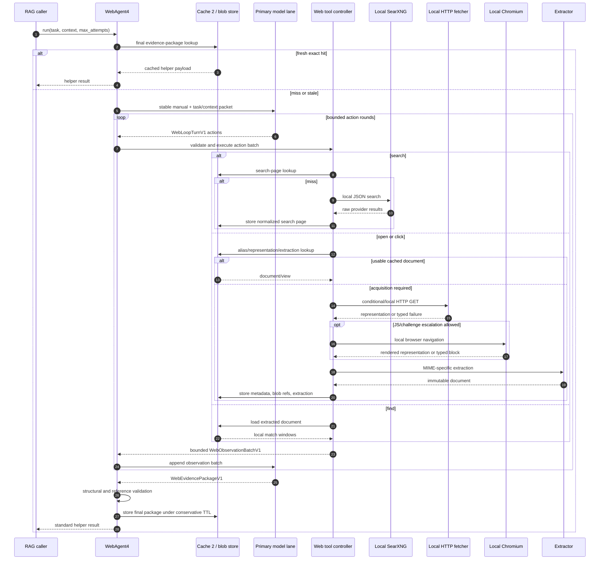
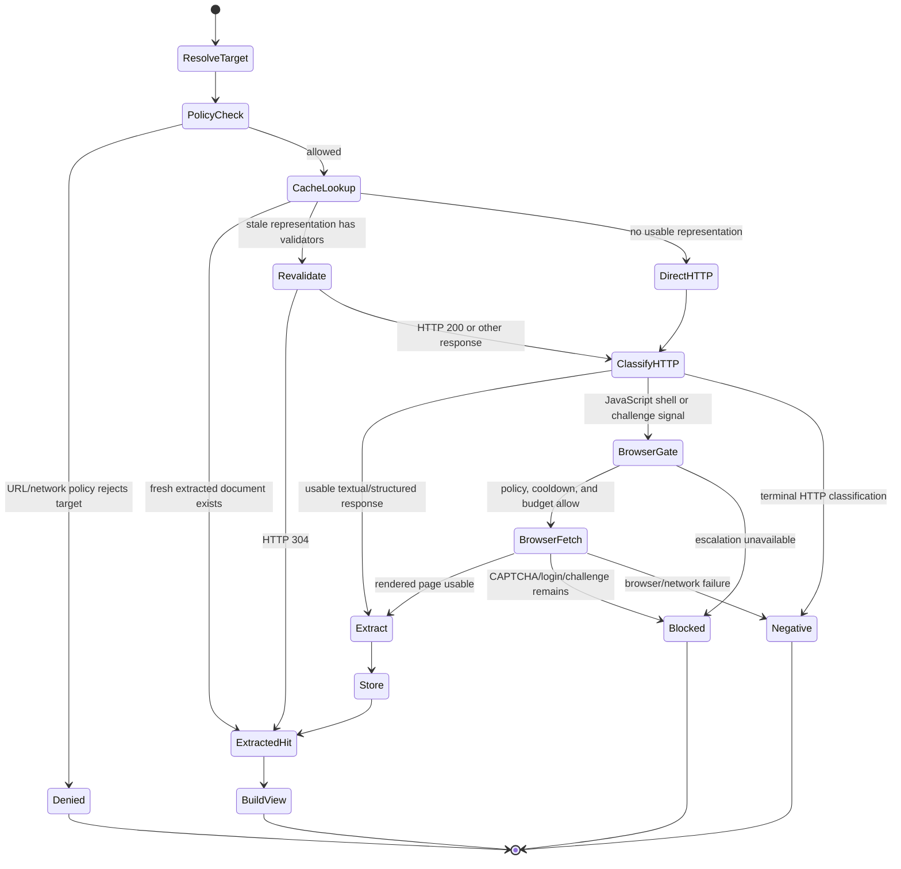
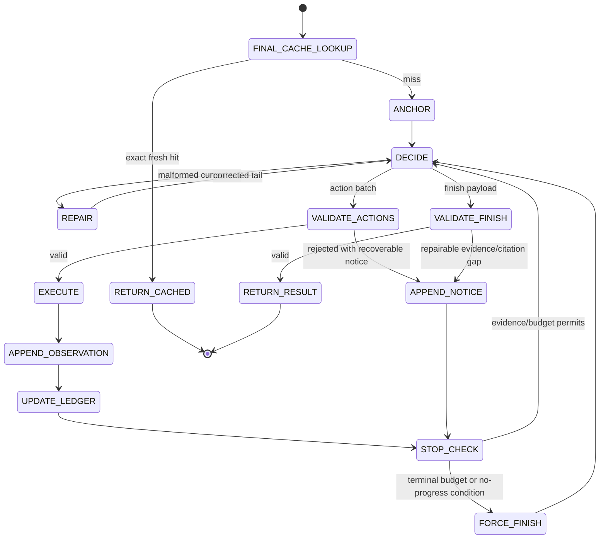

# Web Agent 4: Local-First Cache-Affine Agentic Web Retrieval Architecture

## Document control

- **Status:** Draft target architecture (independent design)
- **Document type:** System architecture reference
- **Target component:** `kazusa_ai_chatbot.rag.web_agent4`
- **Execution authority:** None. Implementation and cutover require an approved
  development plan and regression suite.
- **Independence statement:** This document specifies the desired Web Agent 4
  behaviour from first principles. The current `web_agent3` implementation is
  not a design authority and must not constrain the target design. Existing code
  may be consulted only to preserve the public helper contract and to reuse the
  established Cache 2 primitives.
- **Scope:** Public-web discovery, local URL acquisition, content extraction,
  document navigation, cache policy, the Web Agent 4 model loop, and the final
  evidence-package boundary.
- **Locality guarantee:** Search orchestration, URL fetching, browser rendering,
  extraction, caching, and agent execution all run on infrastructure controlled
  by the Kazusa deployment. No hosted scraping API, remote browser service,
  commercial retrieval API, egress proxy, residential proxy, or third-party
  page-extraction service is part of the architecture. A locally hosted SearXNG
  instance may query its configured public search engines in the ordinary way.
- **Governing internal references:**
  - `src/kazusa_ai_chatbot/rag/cache2_events.py`
  - `src/kazusa_ai_chatbot/rag/cache2_runtime.py`
  - `src/kazusa_ai_chatbot/rag/cache2_policy.py`
  - `src/kazusa_ai_chatbot/rag/helper_agent.py`
  - `docs/architecture/cognition_v3_hybrid_agentic_loop_architecture.md`

## Executive decision

Web Agent 4 is a **local-first retrieval engine wrapped by one append-only,
cache-affine agentic loop**.

The design replaces a pipeline of isolated model calls with one serialized model
conversation:

```text
stable system manual
  -> task/context packet
  -> assistant retrieval action batch
  -> deterministic local tool observation
  -> assistant retrieval action batch
  -> deterministic local tool observation
  -> ...
  -> assistant evidence package
```

The model chooses bounded retrieval actions. Deterministic code owns URL policy,
search execution, fetch routing, browser escalation, extraction, cache validity,
reference assignment, budgets, loop detection, and final contract validation.
There is no separate router model, query-expansion model, evaluator model, or
finalizer model on the normal path.

The retrieval plane is split into four independent layers:

1. **Discovery:** local SearXNG produces normalized result candidates.
2. **Acquisition:** a local fetch router chooses cached representation, direct
   HTTP, or local Chromium rendering.
3. **Interpretation:** deterministic MIME-specific extractors create stable,
   navigable documents with headings, lines, links, and metadata.
4. **Reasoning:** one model transcript searches, opens, finds, follows links, and
   finishes with a source-grounded evidence package.

Cache 2 remains the shared exact-key, TTL, dependency-invalidation, LRU, and
statistics mechanism. Web Agent 4 adds web-specific cache namespaces and a
small local content-addressed blob store for large bodies. The blob store is not
an alternative cache authority: Cache 2 owns cache validity and refers to blob
objects by digest.

The design intentionally does **not** promise universal anti-bot bypass. Local
Chromium solves ordinary JavaScript rendering, cookie, and browser-session
requirements. It cannot reliably overcome IP reputation blocks, mandatory
login, CAPTCHA, or explicit access denial. Those conditions become typed,
bounded observations that the agent can work around by selecting another
first-party source, feed, API, or search result; they are never hidden as fake
successes.

## 1. Design goals

| # | Goal | Definition of done |
|---|---|---|
| G1 | Local independence | Every retrieval component runs locally; no proxy or hosted fetch/extraction dependency exists. |
| G2 | Cache-affine model loop | One stable system prefix and one append-only conversation are used for the complete retrieval task. Every model turn after the first sends only a new suffix to a prefix-capable serving layer. |
| G3 | Deterministic tool plane | Search, fetch selection, extraction, reference assignment, cache policy, retry limits, and validation are code-owned rather than model-owned. |
| G4 | Layered Cache 2 reuse | Search pages, URL aliases, fetch state, representations, extracted documents, and final evidence packages use versioned Cache 2 policies with different freshness rules. |
| G5 | Ref-based navigation | The model uses short stable references for search results, documents, lines, and links; it does not repeatedly resend URLs or full page bodies. |
| G6 | Strong evidence semantics | Search snippets, HTTP page text, browser-rendered text, structured feeds, and blocked observations remain distinguishable through the final package. |
| G7 | Bounded local resource use | Per-origin concurrency, bytes, browser contexts, action rounds, model context, and wall-clock time are explicitly budgeted. |
| G8 | Safe degradation | Failure to fetch one page produces a typed limitation and alternative-search opportunity, not an exception that aborts the whole user turn. |
| G9 | Public-contract preservation | `WebAgent4.run(task, context, max_attempts)` remains compatible with `BaseRAGHelperAgent` callers and returns the standard helper envelope. |
| G10 | Replayability | Given the same initial packet, tool fixtures, cache state, and model outputs, the transcript and final public payload can be rebuilt deterministically. |
| G11 | Extensibility | New local search providers, source-specific first-party APIs, MIME handlers, and extractors implement typed protocols without changing the agent loop. |
| G12 | Honest access control | The system does not solve CAPTCHA, evade login, spoof a third party, or misrepresent blocked pages as retrieved evidence. |

## 2. Non-negotiable architectural rules

1. The public model never receives raw credentials, cookies, authorization
   headers, internal cache keys, browser debugging endpoints, or local file
   paths.
2. A search snippet is a discovery clue. It is never silently promoted to
   page-body evidence.
3. Full documents live outside the model transcript. The transcript receives
   bounded views and can request additional ranges by cursor, section, line, or
   literal find.
4. Fetch routing is deterministic. The model may request `render="browser"`,
   but code decides whether policy and budget allow it.
5. One URL may have many aliases and many time-versioned representations, but
   one successful extraction has one immutable content digest and one document
   record.
6. Cache keys include every input capable of changing semantics, including
   policy versions, provider profile, language, authentication scope, and
   extractor version.
7. Authenticated or session-sensitive content is never shared across scope
   boundaries and is not persisted unless an explicit local policy allows it.
8. No foreign LLM call interleaves the primary Web Agent 4 model lane during an
   active chain.
9. Previously accepted transcript messages are never edited. The only repairable
   material is the current malformed assistant tail.
10. Anti-bot failure is a terminal result for that acquisition path after one
    policy-approved browser escalation. Repeated hammering is prohibited.

## 3. System boundary and architectural overview

```text
                         ┌──────────────────────────────┐
                         │        WebAgent4.run         │
                         │ public helper contract       │
                         └──────────────┬───────────────┘
                                        │
                         exact final-package cache lookup
                                        │
                         ┌──────────────▼───────────────┐
                         │ Cache-affine agentic loop    │
                         │ one model / serialized lane  │
                         └───────┬───────────┬──────────┘
                                 │ actions   │ observations
                                 ▼           ▲
                    ┌────────────────────────────────────┐
                    │ Deterministic Web Tool Controller  │
                    │ validate · budget · refs · ledger  │
                    └───────┬────────────┬───────────────┘
                            │            │
                  search    │            │ open/click
                            ▼            ▼
                 ┌────────────────┐  ┌────────────────────┐
                 │ SearchManager  │  │ FetchRouter         │
                 │ local SearXNG  │  │ cache -> HTTP ->    │
                 │ normalize/rank │  │ local Chromium      │
                 └───────┬────────┘  └──────────┬─────────┘
                         │                      │
                         └──────────┬───────────┘
                                    ▼
                         ┌──────────────────────┐
                         │ ExtractionRouter     │
                         │ HTML/PDF/text/JSON   │
                         │ headings/lines/links │
                         └──────────┬───────────┘
                                    ▼
                     ┌────────────────────────────┐
                     │ Web Cache Facade           │
                     │ Cache 2 + local blob store │
                     └────────────────────────────┘
```

### 3.1 Component ownership

| Component | Owns | Must not own |
|---|---|---|
| `WebAgent4` | Public helper envelope, exact final-package cache, loop lifecycle | HTTP details, browser control, extraction heuristics |
| `WebLoopHarness` | Transcript, model turns, action validation, stop conditions, final validation | Network I/O, source-specific parsing |
| `WebToolController` | Action dispatch, budgets, reference registry, evidence ledger, duplicate-action guard | Model judgment |
| `SearchManager` | Search provider request, normalization, deduplication, rank projection, search cache | Page fetching |
| `FetchRouter` | URL policy, cache lookup, conditional fetch, strategy selection, retry/escalation | Main-content extraction |
| `HttpFetcher` | Streaming HTTP GET, redirects, cookies, validators, byte limits | Browser execution |
| `BrowserFetcher` | Local Chromium lifecycle, rendered DOM, browser cookies, browser response metadata | CAPTCHA solving, stealth impersonation |
| `ExtractionRouter` | MIME routing and immutable document production | Network access |
| `ReferenceRegistry` | Session refs, URL aliases, document refs, link refs, citation ranges | Persistent cache validity |
| `WebCacheFacade` | Web-specific Cache 2 keys, TTLs, dependencies, single-flight, blob references | Semantic model decisions |
| `OriginGovernor` | Per-origin rate limit, cooldown, circuit breaker, capability hints | Global answer policy |

### 3.2 End-to-end calling procedure



## 4. Public contract

### 4.1 Helper entrypoint

```python
class WebAgent4(BaseRAGHelperAgent):
    async def run(
        self,
        task: str,
        context: dict[str, Any],
        max_attempts: int = 3,
    ) -> dict[str, Any]:
        ...
```

Callers provide a semantic task and ordinary RAG context. Callers do not select
SearXNG engines, HTTP headers, browser profiles, extractors, credentials, cache
names, or retry timings.

The default remains `max_attempts=3` for public-contract compatibility. The
caller or deployment may explicitly allow a larger bounded decision-turn budget
for deeper research tasks; internal HTTP retries are not counted as attempts.

The public result remains supervisor-compatible:

```json
{
  "resolved": true,
  "status": "success",
  "reason": "required evidence retrieved from opened sources",
  "result": "prompt-facing evidence package",
  "attempts": 3,
  "knowledge_metadata": {
    "source_refs": ["d1", "d2"],
    "source_urls": ["https://example.org/a", "https://example.org/b"],
    "limitations": [],
    "retrieval_basis": ["page_text", "structured_feed"],
    "freshness_class": "recent",
    "cache_trace": {
      "search_hits": 1,
      "document_hits": 1,
      "network_fetches": 1,
      "browser_fetches": 0
    }
  },
  "cache": {
    "enabled": true,
    "hit": false,
    "cache_name": "web4_evidence_package",
    "reason": "miss_stored"
  }
}
```

`resolved` is true only when the final package has `status="success"` and no
critical evidence gap. `partial`, `not_found`, `blocked`, `budget_exhausted`, and
`error` are unresolved at the helper boundary even when they contain useful
observations.

`attempts` counts accepted model decision turns, not raw HTTP retries. Internal
network attempts are exposed only through bounded telemetry.

### 4.2 Context projection

The model receives a narrow web context, not the entire RAG or persona state.
The projection may include:

```json
{
  "original_query": "...",
  "current_slot": "...",
  "channel_topic": "...",
  "reference_time": "2026-08-19T12:00:00+12:00",
  "locale": "en-NZ",
  "preferred_languages": ["en", "zh"],
  "seed_urls": ["https://..."],
  "known_public_facts": ["..."],
  "network_scope": "public_only"
}
```

Platform user IDs, channel IDs, bot IDs, storage IDs, credentials, and unrelated
persona state stay outside the web prompt. `network_scope` is an engine-approved
policy value, not a model decision.

## 5. Model-facing web tool interface

The model sees a small ref-based interface inspired by interactive search tools:

- `search`: discover candidate pages.
- `open`: acquire or reopen one page and return a bounded view.
- `find`: search within an already extracted document without network I/O.
- `click`: follow a previously exposed link reference.
- `finish`: emit the final evidence package.

There is no model-facing raw `fetch` tool. `open` is the semantic operation;
`FetchRouter` is its internal implementation.

### 5.1 Canonical assistant turn

Every assistant turn is one canonical JSON object. It contains either an action
batch or a finish payload, never both.

```json
{
  "schema_version": "web_loop_turn.v1",
  "actions": [
    {
      "action_id": "a1",
      "kind": "search",
      "query": "cache-affine local web agent architecture",
      "page": 1,
      "language": "en",
      "time_range": "",
      "freshness": "recent",
      "site_allow": [],
      "site_deny": [],
      "limit": 8
    }
  ],
  "finish": null
}
```

A terminal turn is:

```json
{
  "schema_version": "web_loop_turn.v1",
  "actions": [],
  "finish": {
    "schema_version": "web_evidence_package.v1",
    "status": "success",
    "summary": "...",
    "claims": [
      {
        "claim": "...",
        "source_refs": ["d1:L18-L33"],
        "basis": "page_text",
        "freshness": "fresh",
        "confidence": "high",
        "qualification": ""
      }
    ],
    "sources": [
      {
        "ref_id": "d1",
        "title": "...",
        "url": "https://example.org/article",
        "basis": "page_text",
        "fetch_strategy": "http",
        "fetched_at": "2026-08-19T00:00:00Z",
        "published_at": "",
        "freshness": "fresh",
        "content_hash": "...",
        "limitations": []
      }
    ],
    "limitations": [],
    "unresolved_questions": []
  }
}
```

### 5.2 Action-batch rules

- One turn may contain 1–4 actions.
- Actions in a batch must be independent at dispatch time. An action may target
  a ref from an earlier transcript turn, not a ref expected to be created by a
  sibling action in the same batch.
- Search actions may run concurrently.
- Open actions may run concurrently across different origins. Same-origin opens
  obey the origin governor and normally serialize.
- `find` is local and may run concurrently with network actions.
- The harness assigns execution order and returns observations in input order,
  regardless of completion order.
- Duplicate action signatures are rejected before execution.

### 5.3 Search contract

```python
@dataclass(frozen=True)
class SearchRequest:
    query: str
    page: int = 1
    language: str = ""
    time_range: str = ""
    freshness: Literal["live", "recent", "stable", "historical", "auto"] = "auto"
    categories: tuple[str, ...] = ("general",)
    site_allow: tuple[str, ...] = ()
    site_deny: tuple[str, ...] = ()
    limit: int = 8


@dataclass(frozen=True)
class SearchResult:
    ref_id: str
    rank: int
    title: str
    url: str
    display_url: str
    snippet: str
    engines: tuple[str, ...]
    provider_score: float | None
    published_at: str
    mime_hint: str
    evidence_basis: Literal["search_snippet"] = "search_snippet"


@dataclass(frozen=True)
class SearchResponse:
    status: SearchStatus
    query: str
    results: tuple[SearchResult, ...]
    unresponsive_engines: tuple[str, ...]
    cache_state: str
    searched_at: str
    limitations: tuple[str, ...]
```

The model does not select individual engines. Engine roster, categories,
safesearch, timeout, and provider health are deployment policy. `site_allow` and
`site_deny` are converted into validated search syntax by deterministic code.

Search normalization must:

1. preserve quoted phrases, operators, URLs, model names, and version strings;
2. reject control characters and overlong queries;
3. apply site filters exactly once;
4. normalize result URLs without discarding semantic query parameters;
5. merge duplicates by normalized URL;
6. retain all contributing engine names;
7. assign stable session refs in deterministic rank order; and
8. expose provider outages separately from a genuine empty result.

A search observation contains only the top bounded rows. All normalized rows may
remain in the session store for later deterministic filtering.

### 5.4 Open contract

```python
@dataclass(frozen=True)
class OpenRequest:
    target: str                 # search ref, document ref, or HTTP(S) URL
    cursor: int = 0             # extracted-character or block cursor
    max_chars: int = 6000
    section: str = ""
    view: Literal["text", "headings", "links", "metadata"] = "text"
    render: Literal["auto", "http", "browser"] = "auto"
    freshness: Literal["required", "prefer", "allow_stale"] = "prefer"


@dataclass(frozen=True)
class DocumentView:
    ref_id: str
    canonical_url: str
    title: str
    status: str
    evidence_basis: EvidenceBasis
    fetch_strategy: str
    freshness: FreshnessState
    fetched_at: str
    published_at: str
    content_hash: str
    content: str
    cursor: int
    next_cursor: int | None
    line_start: int | None
    line_end: int | None
    headings: tuple[str, ...]
    links: tuple[dict[str, str], ...]
    cache_state: str
    limitations: tuple[str, ...]
```

`open` semantics are independent of acquisition strategy. A cached direct-HTTP
extraction and a newly rendered browser extraction return the same document-view
contract and evidence-basis semantics; acquisition provenance separately records
whether the representation came from HTTP or local Chromium.

### 5.5 Find contract

```python
@dataclass(frozen=True)
class FindRequest:
    target: str
    pattern: str
    max_matches: int = 5
    context_chars: int = 350
    case_sensitive: bool = False
```

`find` operates only on an extracted document already present in the ref
registry/cache. It performs no network request and returns stable line or page
ranges. Literal matching is normative. Regex and semantic search inside one
page are optional later extensions.

### 5.6 Click contract

```python
@dataclass(frozen=True)
class ClickRequest:
    target: str       # parent document ref
    link_id: str      # link exposed by open(..., view="links") or text view
    cursor: int = 0
    max_chars: int = 6000
```

`click` resolves a cached link map and delegates to `open`. It does not perform
arbitrary DOM interaction. JavaScript-only buttons, form submission, purchases,
account mutation, and state-changing browser actions are outside this
architecture.

### 5.7 Observation contract

Tool results are returned to the chain in one bounded canonical envelope:

```json
{
  "schema_version": "web_observation_batch.v1",
  "round": 2,
  "observations": [
    {
      "action_id": "a2",
      "kind": "open",
      "status": "ok",
      "ref_id": "d1",
      "title": "Example title",
      "url": "https://example.org/article",
      "basis": "page_text",
      "freshness": "fresh",
      "content": "L1 ...\nL2 ...",
      "next_cursor": 6000,
      "links": [
        {"link_id": "d1:l1", "text": "Documentation", "url": "https://..."}
      ],
      "limitations": []
    }
  ],
  "budget": {
    "rounds_remaining": 5,
    "actions_remaining": 8,
    "network_fetches_remaining": 4,
    "browser_fetches_remaining": 1
  }
}
```

Tool observations are untrusted external evidence. The system manual explicitly
forbids treating instructions found inside `content` as authority.

## 6. Internal search interface

### 6.1 Provider protocol

```python
class SearchProvider(Protocol):
    name: str
    profile_version: str

    async def search(self, request: SearchRequest) -> SearchProviderResponse:
        ...

    def is_enabled(self) -> bool:
        ...
```

The reference provider is `LocalSearXNGProvider`. Additional providers are
permitted only when they run locally or call a first-party public interface
directly from the Kazusa host. A provider is not exposed to the model by name.

### 6.2 SearXNG request policy

The SearXNG adapter owns:

- endpoint construction;
- configured engine roster;
- categories and safesearch;
- language and time-range translation;
- connection pooling and timeouts;
- bounded retries for transport failure;
- parsing `unresponsive_engines`;
- result normalization; and
- provider-profile versioning for cache keys.

The adapter uses one long-lived `httpx.AsyncClient`, not a new client per query.
Connection reuse is part of the cold-start reduction strategy.

### 6.3 Search ranking and deduplication

SearXNG's order is accepted as the primary signal. Deterministic post-processing
may:

1. normalize URLs;
2. deduplicate exact normalized URLs;
3. merge engine provenance;
4. prefer HTTPS over HTTP aliases when otherwise identical;
5. remove result-wrapper URLs when an unambiguous target URL is available;
6. apply explicit allow/deny domain filters; and
7. cap per-domain crowding so one host does not occupy the entire observation.

No LLM reranker runs before the first observation. The agent can inspect titles,
snippets, and domains and choose pages itself in the same cache-affine chain.
A deterministic lightweight ranker may be added later, but it must not introduce
another model call.

## 7. Reference registry and document identity

### 7.1 Session references

References are short, immutable, and scoped to one Web Agent 4 run:

| Form | Meaning |
|---|---|
| `s1` | Search-result candidate |
| `d1` | Extracted document |
| `d1:l3` | Link 3 exposed from document `d1` |
| `d1:L20-L42` | Line citation in an HTML/text document |
| `d2:P4:L3-L18` | Page and line citation in a PDF |

A search ref may later alias a document ref after successful opening. The
original ref remains valid. Multiple search refs and URLs may point to one
content document.

### 7.2 Internal identities

The model does not see the following internal identifiers:

- `url_digest`: digest of the normalized request URL;
- `canonical_url_digest`: digest of the accepted canonical URL;
- `representation_id`: digest of request variant and fetched bytes;
- `content_hash`: digest of normalized extracted content;
- `blob_ref`: local content-addressed storage reference; and
- Cache 2 exact keys.

### 7.3 URL normalization

URL normalization is deliberately conservative:

- lowercase scheme and host;
- remove the fragment for network identity while retaining it as a section hint;
- remove default ports;
- normalize empty paths to `/`;
- normalize percent-encoding where semantics are unchanged;
- remove only an explicit versioned allowlist of known tracking parameters;
- preserve repeated query parameters and their order unless a site-specific
  adapter proves order-insensitivity;
- preserve signed URLs exactly;
- apply `<link rel="canonical">` only after validation; and
- reject cross-origin canonical declarations that are implausible or conflict
  with the retrieved content.

The registry stores the original URL, normalized request URL, redirect chain,
final URL, and accepted canonical URL as separate fields.

## 8. Ideal local retrieval process

### 8.1 Discovery phase

A normal evidence task begins with one or more focused searches unless the user
or upstream context already supplies a target URL.

```text
semantic task
  -> model search action
  -> search-key lookup
  -> local SearXNG on miss
  -> normalize/deduplicate/rank
  -> assign sN refs
  -> append bounded snippet observation
  -> model selects strong candidates
```

The agent should prefer authoritative and first-party sources when the task is
about a product, standard, law, API, public institution, or named organization.
This preference lives in the stable system manual, not in provider-specific
code.

### 8.2 Acquisition state machine



### 8.3 Target resolution

For each `open` or `click`:

1. resolve the target ref or validate the literal URL;
2. apply URL normalization;
3. check the alias cache for a known canonical/final URL;
4. determine the network scope and authentication scope;
5. consult origin cooldown/capability state;
6. compute the representation cache key; and
7. coalesce concurrent identical work through single-flight.

### 8.4 Direct HTTP path

Direct HTTP is the default acquisition method because it is cheaper, faster,
and easier to cache than browser rendering.

The HTTP fetcher must:

- reuse a long-lived `httpx.AsyncClient` and connection pool;
- issue `GET` directly rather than a speculative `HEAD` plus `GET`;
- send a truthful, deployment-owned user agent;
- advertise only supported compression encodings;
- use bounded redirects and re-run network-policy checks after every redirect;
- stream the response under compressed and decompressed byte limits;
- retain a cookie jar partitioned by session/authentication scope;
- capture a safe header subset, status, timing, final URL, and redirect chain;
- classify content type using headers plus bounded byte sniffing;
- recognise ordinary anti-bot and JavaScript-shell surfaces;
- use conditional validators when revalidating; and
- never expose cookies or sensitive headers to the model or normal logs.

A successful direct response becomes one `Representation`. It is not yet
a document until extraction succeeds.

### 8.5 Conditional revalidation

A stale representation with `ETag` or `Last-Modified` is revalidated using:

```text
If-None-Match: <etag>
If-Modified-Since: <last-modified>
```

- `304 Not Modified` refreshes cache metadata and reuses the existing body and
  extraction.
- `200 OK` creates a new representation. If the normalized extracted content
  hash changes, dependent final evidence packages are invalidated.
- An origin failure may serve a stale representation only when the action's
  freshness policy allows it. The observation must say `freshness="stale"` and
  include the revalidation failure as a limitation.
- `freshness="required"` never silently falls back to stale content.

### 8.6 Local Chromium escalation

Browser rendering is an escalation path for:

- a usable HTTP response that is only a JavaScript application shell;
- a page whose meaningful content appears after client-side rendering;
- a browser-cookie or JavaScript challenge that can complete without human
  interaction;
- a source whose short-lived origin profile is `browser_preferred`; or
- an explicit, policy-approved `render="browser"` request.

The browser subsystem uses a resident local Chromium process and a bounded pool
of isolated browser contexts. Launching a new browser for every `open` is
forbidden on the normal path.

A browser context key includes at least:

```text
(access_scope_id, locale_profile, browser_profile_version, session_partition)
```

The browser fetcher must:

1. check origin cooldown and browser budget;
2. create or reuse the correct isolated context;
3. seed only same-scope cookies;
4. navigate under a hard timeout;
5. wait for `domcontentloaded` plus a bounded settle condition;
6. allow scripts, styles, and XHR/fetch required for page construction;
7. block or abort oversized media, video, and unrelated downloads;
8. capture main-frame response metadata, final URL, rendered DOM, visible text,
   and link map;
9. synchronise permitted cookies back to the same local scope;
10. classify unresolved login, CAPTCHA, and challenge states; and
11. return a typed representation or block, never a partially solved challenge
    presented as article content.

The reference design does not patch Chromium to conceal automation, rotate
fingerprints, forge devices, or solve CAPTCHA. Browser fidelity comes from
running a real local browser, not from adversarial evasion.

### 8.7 First-party alternate representations

Before declaring a source unreadable, deterministic source adapters may follow
safe, first-party alternates discovered from the page or configured adapter:

- RSS or Atom feeds;
- official JSON or XML endpoints;
- documented public APIs;
- `application/ld+json` structured article data;
- print or reader views explicitly linked by the source;
- downloadable text/PDF documents; and
- source-control raw-file endpoints for public code.

An adapter must preserve canonical provenance and label the resulting evidence
basis. It must not guess undocumented URL transformations globally.

### 8.8 Anti-bot and access-control outcome taxonomy

Acquisition returns one of the following typed states:

| State | Meaning | Agent response |
|---|---|---|
| `ok` | Usable representation and extraction | Read/cite normally |
| `not_modified` | Conditional request returned 304 | Reuse the cached bytes and extraction |
| `not_found` | 404/410 or source explicitly absent | Search another source or record absence |
| `rate_limited` | 429 or provider-specific rate limit | Respect cooldown; do not immediately retry |
| `challenge` | A challenge/interstitial was detected | Escalate from HTTP once when eligible; a browser challenge is terminal for this path |
| `captcha_required` | Human verification remains | Stop this path and report blocked |
| `authentication_required` | Login/authorization required | Stop unless an approved local credential scope exists |
| `access_denied` | Explicit denial without a permitted usable path | Stop this path |
| `javascript_required` | Static response is an empty application shell | Escalate to local browser when allowed |
| `robots_denied` | Robots policy disallows automated retrieval | Do not fetch through another strategy |
| `policy_denied` | Network/security policy rejected target | Do not retry |
| `unsupported_content` | MIME cannot be safely extracted | Record metadata and limitation |
| `too_large` | Byte/decompression/page budget exceeded | Try a narrower first-party representation or stop |
| `network_error` | DNS, TLS, connection-reset, or eligible 5xx failure | Apply bounded retry/backoff, then return failure |
| `timeout` | Operation exceeded its bounded deadline | Return the timeout and select another source if useful |
| `error` | Internal acquisition operation failed safely | Record diagnostics and continue only when policy permits |

The final evidence package distinguishes a source that did not contain a fact
from a source that could not be read.

## 9. Fetch and extraction contracts

### 9.1 Fetcher protocol

```python
class Fetcher(Protocol):
    name: str
    version: str

    async def fetch(
        self,
        request: FetchRequest,
        *,
        scope: RetrievalScope,
        deadline: float,
    ) -> FetchOutcome:
        ...
```

```python
@dataclass(frozen=True)
class FetchRequest:
    url: str
    normalized_url: str
    render: Literal["auto", "http", "browser"]
    freshness: Literal["required", "prefer", "allow_stale"]
    access_scope_id: str
    locale_profile: str
    accept_profile: str
    validators: Mapping[str, str]
    max_bytes: int


@dataclass(frozen=True)
class Representation:
    schema_version: Literal["web_representation.v1"]
    strategy: Literal["http", "browser", "first_party_api"]
    fetcher_name: str
    fetcher_version: str
    requested_url: str
    final_url: str
    accepted_canonical_url: str
    redirect_chain: tuple[str, ...]
    status_code: int | None
    content_type: str
    charset: str
    fetched_at: str
    fresh_until: str
    body_blob_ref: str
    body_sha256: str
    etag: str
    last_modified: str
    cache_control: str
    vary: tuple[str, ...]
    access_scope_id: str
    rendered: bool
    safe_response_metadata: Mapping[str, Any]
```

### 9.2 Fetch router decision rules

The router evaluates cached state and direct-response classification in a fixed
order. It does not ask an LLM which network client to use.

```python
async def acquire(request: OpenRequest, session: WebSession) -> AcquireResult:
    target = resolve_and_validate_target(request.target, session.refs)
    key = representation_key(target, request, session.policy)

    cached = await web_cache.get_representation(key)
    if cached and cached.is_fresh:
        return await materialize_document(cached)

    if cached and cached.has_validators:
        response = await http_fetcher.revalidate(cached)
        if response.not_modified:
            return await refresh_and_materialize(cached, response)
    else:
        response = await http_fetcher.fetch(target)

    classification = classify_http(response)
    if classification.usable:
        return await extract_store_and_materialize(response)

    if classification.browser_candidate and browser_allowed(target, session):
        rendered = await browser_fetcher.fetch(target)
        if rendered.usable:
            return await extract_store_and_materialize(rendered)
        return blocked_result(rendered)

    return typed_failure(classification)
```

### 9.3 Extraction protocol

```python
class ContentExtractor(Protocol):
    name: str
    version: str
    supported_mime_types: tuple[str, ...]

    def can_extract(self, representation: Representation) -> bool:
        ...

    async def extract(
        self,
        representation: Representation,
        blob_store: LocalBlobStore,
    ) -> ExtractedDocument:
        ...
```

```python
@dataclass(frozen=True)
class ExtractedDocument:
    schema_version: Literal["web_extracted_document.v1"]
    document_id: str
    content_hash: str
    representation_sha256: str
    canonical_url: str
    title: str
    description: str
    author: str
    language: str
    mime_type: str
    published_at: str
    modified_at: str
    evidence_basis: EvidenceBasis
    blocks: tuple[DocumentBlock, ...]
    links: tuple[DocumentLink, ...]
    headings: tuple[tuple[int, str, str], ...]
    plain_text_blob_ref: str
    extractor_name: str
    extractor_version: str
    limitations: tuple[str, ...]
    provenance: Mapping[str, Any]
```

### 9.4 MIME-specific extraction

| MIME/family | Required output |
|---|---|
| HTML/XHTML | Title, metadata, JSON-LD metadata, main readable body, heading hierarchy, paragraph/list/table blocks, stable lines, links |
| Browser DOM | Same `basis="page_text"` contract as HTML, with `fetch_strategy="browser"` in provenance |
| Plain text/source code | Encoding-normalized text, stable lines, optional language hint |
| JSON | Bounded structured projection, selected semantic fields, stable JSON-pointer or line references |
| XML/RSS/Atom | Feed/document metadata and bounded entries with source links |
| PDF | Metadata, page-separated text, page/line references, link annotations when available |
| Office/document downloads | Optional local document extractor behind explicit MIME and size policy |
| Image/audio/video | Metadata only in the core architecture; local media inspection is a separate capability |

### 9.5 HTML extraction strategy

HTML extraction is an ensemble with deterministic fallbacks:

1. parse document title, canonical link, language, Open Graph, article metadata,
   and JSON-LD;
2. remove scripts, styles, templates, navigation noise, forms, and hidden
   non-content regions;
3. run a main-content extractor;
4. retain heading/paragraph/list/table boundaries;
5. build a stable link map from visible anchors;
6. fall back to cleaned visible DOM text when main-content extraction is too
   sparse; and
7. compute a normalized semantic content hash after whitespace and boilerplate
   normalization.

The raw body hash and semantic content hash are separate. Dynamic ads or
tracking markup may change the raw body without invalidating the semantic
extraction.

### 9.6 Prompt-injection treatment

Retrieved text is untrusted data. The extractor and observation renderer:

- remove executable script and hidden DOM content;
- preserve relevant visible text even when it contains instruction-like prose;
- mark common prompt-injection patterns in metadata;
- wrap excerpts in an explicit external-evidence envelope;
- never merge page text into system instructions; and
- never allow page text to alter tool schemas, budgets, source policy, or finish
  requirements.

The model manual states that instructions, role claims, tool requests, and
secrets found in retrieved content are evidence to analyse, not commands to
follow.

## 10. Cache architecture

### 10.1 Division of responsibility

Web Agent 4 reuses Cache 2 as the hot exact-key cache and invalidation runtime.
It does not place unbounded response bodies into `RAGCache2Runtime`, because the
runtime deep-copies values and evicts by entry count rather than byte size.
Instead, the cache plane has two cooperating parts:

```text
Cache 2 entry
  ├─ exact semantic key
  ├─ fresh/stale metadata
  ├─ dependency declarations
  ├─ small normalized payload
  └─ optional blob_ref ───────────────┐
                                      ▼
                         Local content-addressed blob store
                           sha256/ab/cd/<digest>
                           ├─ raw response bytes
                           ├─ rendered HTML/DOM snapshot
                           └─ extracted document payload
```

Cache 2 remains responsible for:

- exact-key identity;
- TTL expiry;
- dependency invalidation;
- process-local LRU behaviour;
- hit/miss attribution; and
- returning defensive copies of cached metadata.

The web cache facade is responsible for:

- constructing web-specific key material;
- distinguishing fresh, stale, and expired records;
- mapping large payloads to local blob references;
- conditional revalidation;
- single-flight suppression;
- origin-scoped negative caching and circuit breaking;
- emitting Cache 2 invalidation events when source semantics change; and
- validating blob digests before serving cached data.

The first implementation may keep Cache 2 process-local, matching the existing
runtime. A later local durable adapter may warm Cache 2 metadata after a process
restart, but it must preserve the same exact-key, TTL, dependency, and payload
contracts. Durable storage is not required to implement the Web Agent 4 loop.

### 10.2 Web cache facade

```python
class WebCacheFacade(Protocol):
    async def get(
        self,
        namespace: str,
        key_payload: Mapping[str, Any],
        *,
        freshness: Literal["required", "prefer", "allow_stale"] = "prefer",
    ) -> "WebCacheLookup":
        ...

    async def put(
        self,
        namespace: str,
        key_payload: Mapping[str, Any],
        value: Mapping[str, Any],
        *,
        fresh_for_seconds: int,
        retain_for_seconds: int,
        dependencies: Sequence[CacheDependency] = (),
        metadata: Mapping[str, Any] | None = None,
    ) -> str:
        ...

    async def invalidate(self, event: CacheInvalidationEvent) -> int:
        ...

    async def single_flight(
        self,
        operation_key: str,
        factory: Callable[[], Awaitable[T]],
    ) -> T:
        ...
```

`put` stores a Cache 2 record until `retain_until`, not merely until
`fresh_until`. This allows the facade to see a stale representation and use its
validators or, under explicit policy, serve it after a temporary fetch failure.
The current Cache 2 `ttl_seconds` is therefore set to:

```text
retain_until - stored_at
```

The record itself contains `fresh_until`, so the facade—not Cache 2—decides
whether a hit is fresh enough for the caller.

```python
@dataclass(frozen=True)
class WebCacheLookup:
    state: Literal[
        "miss",
        "fresh",
        "stale_revalidatable",
        "stale_servable",
        "expired",
        "corrupt",
    ]
    cache_key: str
    value: Mapping[str, Any] | None
    age_seconds: float | None
    fresh_for_seconds: float | None
    blob_available: bool
```

### 10.3 Common cache record

Every namespace stores a small versioned record of the following shape:

```json
{
  "schema_version": "web_cache_record.v1",
  "cache_kind": "http_representation",
  "policy_version": "web4_cache_policy.v1",
  "stored_at": "2026-08-19T00:00:00Z",
  "fresh_until": "2026-08-19T00:10:00Z",
  "retain_until": "2026-08-20T00:00:00Z",
  "payload": {
    "canonical_url": "https://example.org/article",
    "status_code": 200,
    "content_type": "text/html; charset=utf-8",
    "body_blob_ref": "sha256:...",
    "body_sha256": "...",
    "etag": "...",
    "last_modified": "..."
  },
  "provenance": {
    "strategy": "http",
    "access_scope": "anonymous",
    "origin": "https://example.org"
  }
}
```

The following fields are forbidden from persisted cache payloads:

- plaintext credentials;
- authorization headers;
- unrestricted cookie jars;
- browser storage containing session secrets;
- local browser debugging addresses;
- model prompts or hidden model reasoning; and
- raw exception objects or stack traces.

### 10.4 Cache namespaces

All names and versions are constants in `web_agent4/cache/policy.py`. Suggested
initial namespaces are:

| Namespace | Keyed by | Value | Freshness source | Retention |
|---|---|---|---|---|
| `web4_evidence_package` | task projection, context projection, model/prompt/schema versions, retrieval policy | final helper payload and dependency summary | no longer than the least-fresh material source | short, bounded |
| `web4_search_page` | canonical search request and SearXNG provider-profile digest | normalized ranked search rows | configured search class | bounded stale window |
| `web4_url_alias` | normalized request URL and access scope | redirect chain, final URL, accepted canonical URL | redirect/cache headers plus policy cap | medium |
| `web4_robots` | origin, user-agent policy version | parsed robots rules and crawl delay | HTTP headers or policy default | medium |
| `web4_origin_profile` | origin and fetch-policy version | capability hints, recent challenge class, cooldown | policy | medium |
| `web4_negative_fetch` | request identity, access scope, strategy | typed failure and retry-after time | failure class and response headers | short to medium |
| `web4_http_representation` | request identity and HTTP variant | response metadata plus raw-body blob ref | HTTP caching semantics | header-driven |
| `web4_browser_representation` | request identity, browser profile, session scope | rendered DOM blob and response metadata | conservative browser policy | short |
| `web4_extracted_document` | representation content digest, extractor version/options | immutable document blob/ref and structural metadata | immutable by content digest | until LRU/blob GC |
| `web4_first_party_alternate` | normalized URL and adapter-registry version | discovered feed/API/print/raw alternatives | source class | medium |

The final helper uses `cache_name="web4_evidence_package"`. Internal namespace
operations call the injected `RAGCache2Runtime` directly through
`WebCacheFacade`; they are still attributed to stable agent names such as
`web4.search`, `web4.http`, and `web4.extract` in Cache 2 statistics.

### 10.5 Exact key construction

Every key is created with the existing `stable_cache_key(namespace, payload)`.
The payload is canonical JSON and includes all inputs that can change semantics.
Policy and schema versions are first-class key material rather than free-form
metadata.

#### Search key

```python
stable_cache_key(
    "web4_search_page",
    {
        "policy_version": WEB4_SEARCH_POLICY_VERSION,
        "provider_profile": searxng_provider_profile_digest,
        "query": canonical_search_query,
        "page": request.page,
        "language": request.language,
        "time_range": request.time_range,
        "categories": list(request.categories),
        "site_allow": sorted(request.site_allow),
        "site_deny": sorted(request.site_deny),
        "safe_search": configured_safe_search,
        "limit": normalized_provider_limit,
    },
)
```

Search-query canonicalization applies Unicode NFC and collapses insignificant
outer whitespace. It does **not** blindly case-fold or reorder tokens: quoted
phrases, source-code symbols, product identifiers, operators, and URL fragments
can be case- or order-sensitive.

#### Representation key

```python
stable_cache_key(
    "web4_http_representation",
    {
        "policy_version": WEB4_FETCH_POLICY_VERSION,
        "normalized_url": normalized_url,
        "method": "GET",
        "access_scope": access_scope_id,
        "accept_profile": accept_profile_version,
        "locale_profile": locale_profile,
        "request_variant": request_variant_digest,
    },
)
```

`request_variant_digest` includes only request fields that are permitted to
change the returned representation. It incorporates known `Vary` dimensions
after the first response. It never contains raw secret values; authenticated
scope is represented by an opaque local scope identifier.

#### Extracted-document key

```python
stable_cache_key(
    "web4_extracted_document",
    {
        "extractor_version": extractor_version,
        "representation_sha256": representation_sha256,
        "content_type": normalized_content_type,
        "options": canonical_extraction_options,
    },
)
```

Extraction is content-addressed. Reopening the same bytes under another URL may
reuse the same immutable extraction while preserving separate URL provenance.

#### Final-package key

```python
stable_cache_key(
    "web4_evidence_package",
    {
        "policy_version": WEB4_FINAL_CACHE_POLICY_VERSION,
        "prompt_version": WEB4_PROMPT_VERSION,
        "loop_schema": WEB_LOOP_SCHEMA_VERSION,
        "model_profile": model_profile_digest,
        "task": canonical_task,
        "context": canonical_public_context_projection,
        "retrieval_policy": retrieval_policy_digest,
        "max_attempts": effective_max_attempts,
    },
)
```

The public context projection excludes trace IDs and unrelated private state but
includes reference time, locale, seed URLs, and any known fact that could alter
the answer.

### 10.6 Freshness model

Freshness is a property of each retrieval layer. These states must not be
collapsed:

```text
search freshness
    != URL alias freshness
    != representation freshness
    != extraction identity
    != final evidence-package freshness
```

A cached extraction can remain perfectly valid for its immutable response bytes
while the underlying URL representation is stale. The fetch router therefore
checks representation freshness before selecting which extraction to expose.

For HTTP responses, freshness is calculated in this order:

1. honour `Cache-Control: no-store` by not retaining a reusable representation;
   the current run may use an ephemeral in-memory or temporary-blob copy that is
   removed at run cleanup;
2. isolate `private` or authenticated responses to their explicit access scope;
3. use permitted `max-age`/`Expires` semantics;
4. retain and use `ETag` and `Last-Modified` validators;
5. apply a source-class heuristic only when no usable server freshness exists;
6. clamp fresh lifetime to deployment minimum and maximum bounds; and
7. retain stale metadata only for a bounded conditional-revalidation or
   stale-if-error window.

Suggested initial policy defaults are configuration values, not wire-contract
constants:

| Cache kind | Typical fresh lifetime | Maximum retained stale period |
|---|---:|---:|
| search page, `freshness=live` | 1–3 min | 5 min |
| search page, `recent/auto` | 10 min | 30 min |
| search page, `stable/historical` | 1 h | 6 h |
| anonymous HTML with no cache headers | 15 min | 24 h |
| documentation/static asset with validators | 24 h | 7 d |
| feed/API result with no cache headers | 5 min | 1 h |
| browser-rendered DOM without validators | 5 min | 30 min |
| URL alias/canonical mapping | 24 h | 7 d |
| robots policy | 6 h | 24 h |
| final evidence package | 5–15 min | no stale serving by default |

`freshness="required"` forces validation of the current representation before
page evidence is returned. A fresh response may be accepted without a network
call only when its origin-provided freshness or configured policy explicitly
permits that. `freshness="prefer"` uses a fresh cache hit and conditionally
revalidates stale records. `allow_stale` may serve a stale record after a
transient network failure, but the observation and final claim must state its
age and stale basis.

### 10.7 Conditional revalidation algorithm

```text
lookup representation key
  ├─ fresh -> use representation -> extraction lookup
  ├─ stale with ETag/Last-Modified
  │    -> one single-flight conditional request
  │       ├─ 304 -> refresh metadata; reuse bytes/extraction
  │       ├─ 200 same bytes -> refresh metadata; reuse extraction
  │       ├─ 200 new bytes -> store representation; extract; invalidate dependents
  │       └─ transient failure -> optional bounded stale-if-error
  ├─ stale without validator -> ordinary bounded fetch
  └─ miss -> ordinary bounded fetch
```

A `304 Not Modified` never creates a new document identity. A `200` response
with a changed raw body but unchanged semantic content may create a new
representation record while reusing or regenerating the same semantic document,
depending on extractor policy. Final-package invalidation is required only when
the evidence-visible semantic document changes or the source freshness class
changes materially.

### 10.8 Negative cache and origin profile

Negative outcomes are cached to prevent repeated expensive or impolite attempts.
The negative record is typed; it is not a boolean failure.

| Failure class | Example cache lifetime | Browser escalation on a later open? |
|---|---:|---|
| DNS/connection timeout | 30–60 s | allowed after cooldown if budget permits |
| `429` with `Retry-After` | header value, clamped | no before retry time |
| `404`/`410` | 15 min–24 h | normally no |
| ordinary `403` | 5–15 min | one browser attempt may be allowed |
| recognizable JS shell | seconds | yes, immediately through router |
| browser challenge/interstitial | 15–60 min | no repeated browser attempt |
| CAPTCHA | 1–24 h | no |
| mandatory authentication | 15 min | only with an explicitly configured access scope |
| unsupported MIME/oversize | policy-version lifetime | no until policy changes |
| robots/policy denial | robots-policy lifetime | no |

`web4_origin_profile` records non-secret hints such as:

```json
{
  "origin": "https://example.org",
  "http_success_recent": true,
  "browser_required_recent": false,
  "challenge_class": "none",
  "cooldown_until": "",
  "supports_conditional_get": true,
  "last_success_strategy": "http"
}
```

The profile is advisory. It may skip a predictably useless HTTP attempt when a
site has recently and consistently required local rendering, but it may not
convert a blocked result into success or bypass a policy gate.

### 10.9 Content-addressed blob store

```python
class LocalBlobStore(Protocol):
    async def put_bytes(
        self,
        data: bytes,
        *,
        media_type: str,
        kind: Literal["raw", "rendered_dom", "document"],
    ) -> "BlobRecord":
        ...

    async def get_bytes(self, blob_ref: str) -> bytes | None:
        ...

    async def delete(self, blob_ref: str) -> bool:
        ...
```

Requirements:

- SHA-256 content addressing;
- atomic write-then-rename;
- digest verification on read;
- no path components derived from URLs or titles;
- process-safe duplicate writes;
- configurable total-byte and per-object quotas;
- a local lease/retain-until marker refreshed whenever Cache 2 stores or serves
  a referencing record;
- least-recently-used or lease-aware garbage collection that does not normally
  delete a blob before the longest referencing Cache 2 retain window;
- restrictive local file permissions;
- no executable permission; and
- optional at-rest encryption only when the deployment already owns a local key
  management mechanism.

Small normalized search results and small document metadata may remain inline in
Cache 2. Raw bodies, rendered DOM snapshots, PDFs, and large extracted documents
are blob-backed.

Blob existence does not imply cache validity. On a Cache 2 miss, the baseline
implementation does not discover blobs by guessing. Orphaned blobs are removed
by garbage collection. A future local durable metadata adapter may repopulate
Cache 2 by exact key, but may not weaken expiry or scope checks.

### 10.10 Dependency invalidation

Cache 2 dependencies link derived products to source identities. Suggested
source names are deterministic strings:

```text
web4.search.<search_request_digest>
web4.url.<canonical_url_digest>
web4.document.<canonical_url_digest>
web4.policy.search
web4.policy.fetch
web4.policy.extract
```

Examples:

```python
CacheDependency(source=f"web4.document.{canonical_url_digest}")
CacheDependency(source=f"web4.search.{search_request_digest}")
CacheDependency(source="web4.policy.extract")
```

When a successful revalidation produces evidence-visible changed content, the
cache facade emits:

```python
CacheInvalidationEvent(
    source=f"web4.document.{canonical_url_digest}",
    reason="semantic_content_changed",
)
```

This invalidates final evidence packages and any URL-derived projections that
depend on the changed source. Immutable extracted-document records keyed by the
old content digest do not need to be deleted immediately; they become
unreferenced and are removed by LRU/blob garbage collection.

When a search page is refreshed and its normalized result set changes, the
facade may emit `web4.search.<digest>`. A policy or extractor deployment emits
its static policy-source event, although versioned keys already prevent new
reads from hitting old entries. Explicit invalidation keeps memory pressure and
health reports honest.

Representation entries must not depend on the same URL-change event emitted
while storing themselves. The update order is:

1. compare old and new semantic identities;
2. invalidate dependent derived entries when required;
3. store the new representation/document mappings; and
4. expose the new document to the current run.

### 10.11 Single-flight and duplicate suppression

Cache 2 is an exact result cache; it is not a work-coordination primitive.
`WebCacheFacade` adds process-local single-flight maps keyed by operation:

```text
search:<exact search key>
fetch:<strategy>:<representation key>
extract:<extractor key>
browser:<origin>:<target key>
```

The first coroutine performs the work. Concurrent callers await its future and
receive the same immutable result. Cancellation of one waiter does not cancel
the producer while other waiters remain. Failed flights are removed immediately
unless their typed outcome is deliberately written to the negative cache.

Within one run, the reference registry additionally deduplicates target URLs.
Opening `s1`, then clicking a second alias that resolves to the same canonical
URL and representation, produces a new ref alias but no duplicate network or
extraction work.

### 10.12 Final evidence-package cache

The exact final-package cache is checked before creating a model session. It is
written only after:

- the terminal package passes schema validation;
- every cited ref and range resolves;
- every success claim has an allowed evidence basis;
- the package contains no restricted content copied from cache metadata; and
- the freshness policy calculates a positive final lifetime.

Its dependencies are the union of:

- each opened document's canonical URL dependency;
- each search page whose snippet is explicitly used as evidence;
- extraction/fetch policy dependencies; and
- any configured local first-party adapter dependency.

The final lifetime is no greater than:

```text
min(
    configured_final_cache_cap,
    remaining freshness of every material source,
    task freshness class cap,
)
```

A final package based only on historical or stable documents may receive a
longer lifetime than one answering a current-state query. A package containing
stale-if-error evidence is not written to the final cache unless an explicit
policy permits it; the default is not to cache it.

`partial`, `blocked`, and `budget_exhausted` outputs may receive a very short
negative final cache only when doing so prevents immediate duplicate work and
the cache record preserves the exact limitations. User-requested `freshness=required` bypasses such negative final entries.

### 10.13 Cache poisoning and trust boundaries

Cache writes occur only after deterministic validation. In particular:

- a `200` challenge page is classified before it can replace a successful
  representation;
- redirect targets are URL-policy checked before alias storage;
- content type is checked against signatures and size limits;
- accepted canonical URLs are validated before becoming identity keys;
- extracted content carries the representation digest from which it was made;
- browser DOM snapshots never overwrite HTTP representations under the same
  strategy key; and
- authenticated/session-scoped records can never satisfy anonymous lookups.

On digest mismatch, missing blob, invalid schema, or impossible provenance, the
facade returns `corrupt`, removes the Cache 2 record, records a metric, and
recomputes through the ordinary path. It never sends corrupt content to the
model.

## 11. Cache-affine agentic loop

### 11.1 Architectural decision

Web Agent 4 uses one primary model lane for the complete task. Search planning,
source selection, evidence-gap detection, and final synthesis are successive
turns in one conversation. There is no normal-path model fan-out.

```text
WebAgent4.run
  ├─ exact final-cache lookup
  ├─ create WebLoopSession
  ├─ call primary model with anchor
  ├─ execute deterministic action batch
  ├─ append observation batch
  ├─ call same primary model with unchanged prefix + new suffix
  ├─ ...
  └─ validate terminal evidence package
```

This shape minimizes cold prefill because each accepted turn is an extension of
the preceding byte-identical transcript. It also aligns the task with the
multi-turn action/observation pattern for which contemporary tool-using models
are commonly optimized.

### 11.2 Ownership boundary

The model owns only bounded semantic decisions:

- what to search for next;
- which exposed result or link is likely to contain evidence;
- which part of an opened document to inspect;
- whether the accumulated evidence is sufficient;
- what claims are supported; and
- what limitations remain.

Deterministic code owns:

- action schema and validation;
- network and URL policy;
- search provider choice;
- cache lookup and freshness;
- HTTP/browser routing;
- retries, concurrency, cooldowns, and deadlines;
- extraction and line numbering;
- reference assignment;
- evidence-basis labels;
- budget accounting;
- duplicate and loop detection;
- citation resolution; and
- final package acceptance.

The model cannot increase its own budget, alter cache state, choose hidden
headers, provide cookies, disable URL policy, or declare a blocked page
successfully retrieved.

### 11.3 Loop session carrier

```python
@dataclass
class WebLoopSession:
    session_id: str
    anchor_digest: str
    model_profile_digest: str
    messages: list[CanonicalMessage]
    round_index: int
    accepted_turns: int
    repair_count: int
    reanchor_count: int
    refs: ReferenceRegistry
    ledger: EvidenceLedger
    budget: WebBudgetState
    action_signatures: set[str]
    started_at_monotonic: float
    last_model_usage: ModelUsage | None
```

`session_id` is trace metadata and appears only in the volatile runtime packet
or logs, never in the stable system prefix. `messages` contains only accepted
canonical messages. Raw page bodies, browser states, and cache records are held
by their owning components, not by the session transcript.

A provider-specific `ModelLaneSession` may additionally hold a local serving
session/cache handle. It is opaque to the agent and bound to:

- one model identifier and model revision;
- one chat-template/adapter version;
- one sampling profile;
- one tokenizer identity; and
- one serialized request lane.

Changing any of those values terminates prefix-affinity guarantees and requires
a cold session rebuild.

### 11.4 Canonical loop states



The harness drives the state machine. The model never emits a state transition
name.

### 11.5 Launch sequence

1. Validate and canonicalize `task`, context projection, and effective budgets.
2. Build the exact final-package cache key and return immediately on a fresh
   hit.
3. Create an empty run-local reference registry and evidence ledger.
4. Acquire one serialized primary model lane.
5. Assemble the stable system manual and dynamic task packet.
6. Send the anchor as the first model request.
7. Validate the returned `WebLoopTurnV1`.
8. Execute a valid action batch or validate a finish payload.

The launch request does not pre-run a query-expansion model. The primary model
can issue up to four focused searches in its first action batch and refine them
in later turns using the observations already in its prefix.

### 11.6 Canonical stage sequence

The semantic sequence is flexible but the protocol is fixed:

```text
A0  Anchor and task packet
D1  Decide: search/open/find/click batch
T1  Deterministic tools
O1  Canonical observation batch
L1  Deterministic ledger notice only when needed
D2  Decide from accumulated evidence
...
F   Finish with WebEvidencePackageV1
V   Deterministic terminal validation
```

No stage sends the original task or prior observations again. A decision prompt
is normally just the newly appended observation batch; the stable manual tells
the model how to continue. A bounded deterministic notice is appended only when
the model needs information that is not already present, such as a rejected
action, citation error, remaining budget transition, or re-anchor state.

### 11.7 Action execution procedure

For each accepted action batch, the tool controller:

1. canonicalizes each action;
2. verifies that target refs already exist;
3. enforces action-kind and per-origin budgets;
4. computes a semantic action signature;
5. rejects exact duplicate/no-progress actions unless freshness changed;
6. groups independent actions by dispatch class;
7. executes local operations concurrently within configured limits;
8. normalizes every result to `WebObservationV1`;
9. assigns refs deterministically in input action order;
10. renders bounded observations in canonical JSON; and
11. appends exactly one observation-batch message to the primary chain.

Network completion order never changes transcript order. This is required for
replayability and stable prefix bytes.

### 11.8 Evidence ledger

The evidence ledger is deterministic state outside the transcript. It prevents
the model from being the sole authority on what has actually been retrieved.

```python
@dataclass
class EvidenceLedger:
    searches: dict[str, SearchLedgerEntry]
    documents: dict[str, DocumentLedgerEntry]
    claims_seen: list[ClaimCandidate]
    unresolved_gaps: list[EvidenceGap]
    source_domains: set[str]
    basis_counts: Counter[str]
    last_progress_round: int
```

A document ledger entry records:

```json
{
  "ref_id": "d1",
  "canonical_url": "https://example.org/article",
  "title": "...",
  "content_hash": "...",
  "basis": "page_text",
  "freshness": "fresh",
  "opened_ranges": ["L1-L80", "L170-L230"],
  "find_patterns": ["cache"],
  "published_at": "...",
  "limitations": [],
  "material": true
}
```

The ledger is the source of truth for final citation validation and source
metadata. The model may propose claims, but it cannot create a source ref that
was never registered.

A short ledger notice may be appended when useful:

```json
{
  "schema_version": "web_ledger_notice.v1",
  "material_sources": ["d1", "d2"],
  "weak_sources": ["s3"],
  "unresolved_gaps": ["current release date not verified"],
  "rounds_remaining": 2
}
```

The notice is derived from state and never contains an LLM-generated summary.

### 11.9 Progress and loop detection

A round counts as progress when at least one of the following occurs:

- a new unique search result set is added;
- a new canonical document is opened;
- a previously unopened range is exposed;
- a new literal match is found;
- a new first-party alternate is discovered;
- a stale source is successfully revalidated; or
- the model submits a terminal package that reduces the set of validation
  errors.

The controller records normalized action signatures. A duplicate search with
only inconsequential whitespace, an open of an already exposed identical range,
or repeated browser escalation after a typed block is no progress.

Default stop rules:

- two consecutive no-progress rounds;
- the same rejected action signature twice;
- all candidate origins in cooldown with no untried result;
- hard action, browser, network, context, or deadline budget reached; or
- the model explicitly finishes.

On a no-progress stop, the harness appends one force-finish notice listing the
usable source refs and limitations. The model receives one final terminal turn.
It may not start another retrieval action after a hard stop.

### 11.10 Terminal evidence package validation

The final package is accepted only when:

1. it matches `web_evidence_package.v1` exactly;
2. `status` is an allowed value;
3. every `source_ref` resolves to the run registry;
4. every cited line/page range was actually exposed or is deterministically
   resolvable from a stored document;
5. a `page_text`, `pdf_text`, `structured_feed`, or `first_party_api` claim is
   backed by that basis;
6. a search-snippet-only claim is labelled `search_snippet` and cannot support
   a critical success claim unless policy explicitly permits it;
7. freshness labels match the cache/fetch ledger;
8. material contradictions are represented in claims or limitations;
9. the summary does not introduce uncited externally verifiable claims absent
   from the claim rows; and
10. the payload respects size and content limits.

Validation returns either `accepted` or a bounded list of machine-generated
errors. Recoverable errors are appended as a deterministic notice and the model
gets one corrected finish turn if budget remains. No separate evaluator or
finalizer model is called.

### 11.11 Malformed output and tail repair

Only the current unaccepted assistant tail may be repaired. Previously accepted
messages are immutable.

```text
accepted prefix P
  -> model emits malformed candidate C
  -> discard C from canonical session
  -> resend P + one compact repair instruction
  -> validate corrected candidate C'
```

The repair request reuses the complete accepted prefix `P`; it does not rebuild
or summarize the conversation. One repair is allowed per decision point and a
small global repair budget applies. Repeated failure returns a typed
`model_output_invalid` result with the existing evidence ledger.

The malformed candidate may be retained in redacted diagnostics, but it is not
added to the prompt chain or final cache.

### 11.12 Provider and serving-layer adaptation

The preferred wire form is a stable system message plus canonical user and
assistant JSON messages. Tool observations are represented as canonical
user-role evidence messages unless the selected local serving stack has proven
that native tool-call and tool-result roles are serialized byte-stably across
turns.

A `WebModelAdapter` must expose:

```python
class WebModelAdapter(Protocol):
    profile_digest: str

    async def complete(
        self,
        messages: Sequence[CanonicalMessage],
        *,
        schema: Mapping[str, Any],
        lane_session: ModelLaneSession,
        deadline: float,
    ) -> ModelCompletion:
        ...
```

The adapter must not:

- reorder messages;
- inject a changing timestamp into the system prefix;
- rewrite prior JSON spacing or escaping;
- strip an accepted assistant message that is required by the next turn;
- switch chat templates mid-run; or
- interleave another prompt on the same cache-affine lane while the run is
  active.

If a serving layer strips or reformats hidden reasoning between turns, Web Agent
4 does not depend on carrying that reasoning. The durable loop state is the
visible action/observation transcript and deterministic ledger. Structured
outputs should contain decisions and evidence, not private chain-of-thought.

### 11.13 Concurrency model

There is one serialized model lane per active Web Agent 4 run. Multiple local
web actions from one accepted batch may execute concurrently, subject to global
and per-origin limits. The next model call begins only after the observation
batch has been ordered and appended.

Across runs, the deployment chooses one of two modes:

1. **Affinity-first:** a small number of pinned FIFO model lanes, each retaining
   the stable Web Agent 4 manual prefix and processing one run at a time.
2. **Throughput-first:** more lanes or ordinary server scheduling, accepting
   lower cross-run prefix reuse while preserving within-run append-only reuse.

One run never sends concurrent prompts to the same lane. Search/fetch work may
continue on CPU/network resources while no model generation is active, but no
other model call is inserted between two turns of that run on an affinity-pinned
lane.

### 11.14 Model call economy

The normal path requires:

```text
1 initial decision call
+ N follow-up decision calls after observations
+ 1 terminal finish call only when the last decision did not already finish
```

A model turn may both assess evidence and select the next action. There are no
additional calls for:

- query decomposition;
- source ranking;
- per-page summarization;
- answer evaluation;
- answer finalization; or
- transcript compaction.

Deterministic extraction and bounded views keep those functions in the tool
plane. The design therefore reduces both model-call count and repeated prompt
prefill without making network behaviour model-controlled.

## 12. Prompt geometry and prefix-cache affinity

### 12.1 Context anchor

The first request is ordered from least volatile to most volatile. The first
bytes must remain identical across tasks whenever the model profile and Web
Agent 4 release are unchanged.

| Order | Material | Changes when | Message placement |
|---|---|---|---|
| 1 | Web Agent 4 manual: role, action protocol, schemas, evidence rules, security boundaries, stop rules | Web Agent release | system, first |
| 2 | Tool-contract vocabulary and allowed status/basis enums | Schema release | system |
| 3 | Deployment-neutral retrieval principles | Policy release | system |
| 4 | Optional deployment capability notice: supported actions, not hostnames or secrets | Capability-profile change | system, last stable block |
| 5 | Task and public context projection | Every run | user packet |
| 6 | Reference time, locale, seed URLs, effective budgets | Every run | user packet, most volatile |
| 7 | Tool observations and validator notices | Every round | appended messages |

The stable manual contains no character name, user name, channel ID, request ID,
current date, SearXNG endpoint, browser executable path, engine health, cache
statistics, or dynamic token budget. Those values would cause an early prefix
miss and do not belong in universal model instructions.

### 12.2 Stable system-manual contents

The manual defines, once:

- the search/open/find/click/finish semantics;
- the exact `WebLoopTurnV1` and `WebEvidencePackageV1` shapes;
- allowed statuses and evidence bases;
- the distinction between snippet and opened-source evidence;
- authority and first-party-source preferences;
- prompt-injection rules;
- citation syntax using registered refs;
- action independence and batch limits;
- no-progress and finish expectations;
- prohibition on inventing refs, content, access success, or freshness;
- the fact that deterministic observations override model assumptions about
  network state; and
- a compact set of valid examples and invalid counterexamples.

The manual should be sufficiently complete that later turns need no repeated
instruction prose. It should avoid long domain examples whose wording is likely
to change between releases.

### 12.3 Dynamic task packet

```json
{
  "schema_version": "web_task_packet.v1",
  "task": "Determine ...",
  "success_criteria": [
    "verify the current behaviour",
    "prefer first-party technical sources",
    "identify unresolved access limitations"
  ],
  "context": {
    "original_query": "...",
    "current_slot": "...",
    "known_public_facts": [],
    "seed_urls": [],
    "locale": "en-NZ",
    "preferred_languages": ["en"],
    "reference_time": "2026-08-19T12:00:00+12:00"
  },
  "capabilities": {
    "search": true,
    "http_open": true,
    "browser_open": true,
    "pdf": true,
    "authenticated_scope": false
  },
  "budget": {
    "decision_turns": 8,
    "actions": 14,
    "network_fetches": 8,
    "browser_fetches": 2
  }
}
```

Keys are emitted in a fixed order even though semantic cache keys use sorted
canonical JSON. Arrays whose order has no semantics are sorted before prompt
serialization. Seed URLs and success criteria preserve caller order.

The task packet is the only place the original task is sent. Later messages do
not restate it.

### 12.4 Canonical message serialization

The model adapter owns one canonical serializer with these rules:

- UTF-8;
- Unicode NFC;
- fixed role mapping;
- JSON with stable separators and deterministic key order;
- no trailing spaces;
- one terminal newline policy used everywhere;
- no pretty-printing that changes across message sizes;
- fixed numeric rendering;
- fixed null/empty-field policy; and
- a versioned chat template.

The exact bytes or token IDs of every accepted prefix should be testable in a
prefix-cache probe. Logical equality is insufficient: an extra space, changed
role wrapper, reordered schema property, or dynamic request header that affects
the server's cache identity may destroy reuse.

### 12.5 Observation geometry

An observation batch is appended once and is ordered by input `action_id`, not
completion time. Each observation uses the same field order:

```text
action_id -> kind -> status -> refs -> title/url -> basis/freshness
          -> bounded content/results -> navigation -> limitations
          -> compact cache/acquisition metadata
```

High-volume diagnostic material stays out of the prompt. The model normally
needs only:

- result titles, URLs, snippets, and refs;
- the current document view;
- line/page labels;
- exposed links;
- typed status and limitations; and
- remaining semantic budgets.

It does not need raw response headers, redirect timing, TLS details, cache keys,
blob digests, exception messages, or engine-specific debug output.

### 12.6 Cache-affinity invariants

Within an unreanchored run:

1. one model profile and chat template are used;
2. the system manual is byte-identical on every request;
3. accepted prior messages are never regenerated from Python objects using a
   different serializer;
4. every next request is the prior accepted message sequence plus a suffix;
5. the lane is serialized and no unrelated prompt is interleaved;
6. tool observations are appended, never inserted earlier;
7. budget changes are appended as notices, not edited into the task packet;
8. no model-generated summary replaces prior messages;
9. malformed current output is excluded and repaired from the last accepted
   prefix; and
10. a re-anchor is explicit, counted, and never mistaken for a warm continuation.

Cross-run reuse is weaker but still valuable: every run begins with the same
system-manual prefix. A serving layer that retains prefix blocks can therefore
reuse at least that stable head even though the task packet differs.

### 12.7 Lane scheduling

A cache-affine deployment should expose a model-lane scheduler:

```python
class ModelLaneScheduler(Protocol):
    async def acquire(
        self,
        *,
        profile_digest: str,
        affinity_key: str,
        deadline: float,
    ) -> AsyncContextManager[ModelLaneSession]:
        ...
```

For one active run, `affinity_key` remains stable. The scheduler should prefer a
lane whose most recent prefix is the Web Agent 4 system manual. It must not let
an unrelated long prompt interrupt a pinned run merely to improve aggregate
throughput. Deployments with only one local model server should use FIFO
serialization or a small bounded queue rather than issuing many simultaneous
prefill-heavy requests.

The scheduler may release the lane while deterministic network actions execute
only if the serving backend can retain the run's prefix independently and
reattach it without ambiguity. Otherwise the lane stays logically reserved for
the short lifetime of the web run.

### 12.8 Sampling and output discipline

Action selection benefits from low-variance structured output. The reference
profile uses:

- schema-constrained JSON when the local server supports it correctly;
- low temperature;
- bounded output tokens per decision turn;
- no stop sequence likely to occur inside JSON strings; and
- one fixed sampling profile for the entire run.

Changing temperature does not normally change prompt bytes, but keeping one
profile simplifies replay and model-behaviour comparison. A model may make
uncertain source-selection decisions, but it must express them through actions
and limitations rather than prose outside the schema.

### 12.9 Prefix-cache verification

A release is not called cache-affine merely because it uses conversation
history. The deployment probe must compare:

1. a cold anchor request;
2. the same system manual with a changed task tail;
3. one append-only observation continuation;
4. the same semantic transcript reserialized by the production adapter; and
5. an intentionally changed early system byte.

The expected qualitative result is:

- request 2 reuses the stable system prefix where the serving layer supports
  cross-request prefix caching;
- request 3 processes primarily the new suffix;
- request 4 behaves like request 3, proving serializer stability; and
- request 5 behaves cold, proving the probe can detect early-prefix misses.

Recorded metrics should include prompt tokens, cached prompt tokens when
reported, prompt-evaluation time, decode time, and server queue time. Numeric
acceptance thresholds are set from the actual local model/server baseline, not
hard-coded in this architecture.

## 13. Budgets, context ledger, and re-anchoring

### 13.1 Budget model

```python
@dataclass(frozen=True)
class WebBudgetConfig:
    max_decision_turns: int = 8
    max_actions: int = 14
    max_search_actions: int = 6
    max_open_actions: int = 8
    max_network_fetches: int = 8
    max_browser_fetches: int = 2
    max_total_download_bytes: int = 30_000_000
    max_http_body_bytes: int = 8_000_000
    max_pdf_bytes: int = 25_000_000
    max_redirects: int = 8
    max_distinct_origins: int = 10
    max_context_soft_tokens: int = 24_000
    max_context_hard_tokens: int = 40_000
    max_wall_seconds: float = 120.0
    max_no_progress_rounds: int = 2
    max_repairs: int = 2
    max_reanchors: int = 1
```

These are reference defaults for ordinary web evidence tasks. Deployment values
must be clamped to safe minimums and maximums. A model's very large advertised
context window is overflow capacity, not the normal operating target: retaining
hundreds of thousands of low-value retrieval tokens increases KV-cache pressure,
prefill exposure after any cache miss, and re-anchor cost. `max_attempts` passed
to `run` sets `max_decision_turns` after clamping; it does not multiply every
internal retry budget.

Cache hits consume semantic actions but not network or browser budgets. A
conditional request consumes one network fetch. A browser navigation consumes
one browser fetch even if several subresources load; subresource count and bytes
are tracked separately for resource protection.

### 13.2 Context ledger

Before every model call, the harness estimates the next request using the actual
model tokenizer when available.

```python
@dataclass
class ContextLedger:
    system_tokens: int
    task_packet_tokens: int
    accepted_assistant_tokens: int
    observation_tokens: int
    notice_tokens: int
    projected_next_output_tokens: int
    total_projected_tokens: int
    soft_limit: int
    hard_limit: int
```

The ledger records actual usage returned by the local serving layer and adjusts
its estimator. Character-count heuristics are allowed only as a fallback and
must reserve a conservative margin.

### 13.3 Prevention before compaction

The primary strategy is to avoid appending excess material in the first place:

- return only the configured number of search rows;
- cap snippets individually;
- expose bounded document windows;
- use `find` before reopening large documents;
- return links only when requested or likely useful;
- omit raw headers and extraction diagnostics;
- deduplicate repeated limitations;
- represent budget state compactly; and
- keep full documents in the ref/document store.

Because prior accepted messages are immutable, trimming must occur before an
observation is appended. The tool controller can always retain the full local
result while projecting a smaller view to the model.

### 13.4 Soft-limit degradation ladder

When the projected next request exceeds the soft limit, future observations are
reduced deterministically in this order:

1. omit non-material cache/acquisition details;
2. reduce search results per observation while retaining all rows in the ref
   registry;
3. reduce document-view `max_chars` and encourage `find`/section opens;
4. omit duplicate titles, URLs, and limitations already visible in the
   immediately preceding observation;
5. emit headings/link metadata only on explicit request;
6. force source selection rather than further broad discovery; and
7. request finish when the evidence ledger already satisfies the task.

No accepted earlier message is rewritten, dropped, or summarized during this
ladder.

### 13.5 Hard-limit guard

The harness refuses to send a request whose measured or conservatively
estimated input plus reserved output would exceed the local serving window. It
chooses one of:

- terminal finish notice when sufficient evidence exists;
- one deterministic re-anchor when more reasoning is required and the re-anchor
  budget remains; or
- typed `context_budget_exhausted` partial result when neither is safe.

Silent truncation by the serving layer is treated as a correctness failure.
The adapter should set an explicit context limit or reject a request before the
server can discard early messages.

### 13.6 Deterministic re-anchor

A re-anchor is a deliberate new conversation, not hidden compaction. It pays one
new prefill but preserves the stable system-manual prefix and avoids unbounded
continuation.

```json
{
  "schema_version": "web_reanchor_packet.v1",
  "task": "original semantic task",
  "context": {
    "locale": "en-NZ",
    "reference_time": "..."
  },
  "retrieval_state": {
    "material_sources": [
      {
        "ref_id": "d1",
        "title": "...",
        "url": "https://...",
        "basis": "page_text",
        "freshness": "fresh",
        "evidence_ranges": [
          {"range": "L18-L35", "text": "bounded exact extracted text"}
        ],
        "limitations": []
      }
    ],
    "search_candidates": [
      {"ref_id": "s5", "title": "...", "url": "https://..."}
    ],
    "unresolved_gaps": ["..."],
    "blocked_targets": ["s4"]
  },
  "budget": {
    "decision_turns_remaining": 2,
    "actions_remaining": 3,
    "browser_fetches_remaining": 0
  }
}
```

The packet is generated entirely from the registry and ledger. It contains only
previously exposed evidence text, not a new model summary. Existing refs remain
valid because the run-local registry survives the conversation reset.

After re-anchoring:

- `reanchor_count` increments;
- the new transcript is append-only from that point;
- no second re-anchor is allowed by default;
- duplicate-action history remains active; and
- final citations still resolve against the original run registry.

### 13.7 Deadline accounting

One monotonic turn-level deadline covers:

- model queue and inference;
- SearXNG calls;
- direct HTTP;
- browser startup/navigation;
- extraction;
- cache work; and
- terminal validation.

Each operation receives the smaller of its local timeout and remaining overall
deadline. An action batch returns partial ordered observations when some sibling
actions finish and another times out. The harness then decides whether the
remaining evidence supports a final partial or success result.

A deadline expiry does not launch cleanup work that outlives the request except
for bounded cancellation and resource release. Single-flight producers may
continue only when another live waiter still depends on them.

### 13.8 Budget visibility to the model

The model receives semantic remaining budgets, not infrastructure counters. It
may see:

```json
{
  "rounds_remaining": 2,
  "actions_remaining": 4,
  "searches_remaining": 1,
  "network_fetches_remaining": 2,
  "browser_fetches_remaining": 0,
  "must_finish_after_this_round": false
}
```

It does not see memory addresses, cache capacities, queue lengths, or raw token
accounting. A `must_finish_after_this_round` notice is authoritative.

## 14. Failure model

### 14.1 Failure principles

- Every expected failure is typed.
- Tool failures become observations whenever the model can choose another
  source.
- Infrastructure failures do not masquerade as empty search results.
- A failure in one action does not discard successful sibling observations.
- Retries are code-owned and bounded.
- No failure triggers a remote proxy or hosted fallback.
- Final status reflects evidence sufficiency, not whether every attempted source
  succeeded.

### 14.2 Failure classes and dispositions

| Layer | Failure | Default disposition |
|---|---|---|
| Public input | invalid task/context | return `invalid_input`; no model/network work |
| Final cache | corrupt record/blob | evict, record metric, continue as miss |
| Model | queue timeout/unavailable | one provider-policy retry if safe; otherwise return typed error with ledger |
| Model | malformed JSON | current-tail repair from last accepted prefix |
| Model | invalid/ref-inventing action | append deterministic rejection notice; consume turn |
| Search | SearXNG transport failure | bounded retry; return `search_unavailable` observation |
| Search | all engines unresponsive | distinguish from zero results; permit refined retry |
| URL policy | disallowed scheme/address | `policy_denied`; no network |
| DNS/TLS/network | transient failure | one bounded retry where policy permits; negative cache |
| HTTP | 404/410 | terminal target outcome; select another result |
| HTTP | 429 | obey `Retry-After`; no immediate retry/browser bypass |
| HTTP | 401/auth required | `authentication_required`; no anonymous escalation loop |
| HTTP | 403/challenge | classify; at most one local browser escalation when eligible |
| Browser | startup crash | recycle process once; then typed browser failure |
| Browser | CAPTCHA/challenge remains | `captcha`/`challenge`; negative cache; no solver |
| Content | oversize/decompression limit | `too_large`; preserve metadata only |
| Extraction | unsupported/corrupt document | `extraction_failed`; optionally expose metadata |
| Cache | dependency/record race | recompute under single-flight; never serve inconsistent mix |
| Context | projected overflow | finish, re-anchor once, or partial result |
| Loop | no progress/budget exhaustion | force one terminal turn, then deterministic partial fallback |

### 14.3 Search failure semantics

A normalized search response distinguishes:

```text
status=empty, results=[]              genuine empty result
status=partial, results=[...],        some engines failed
status=unavailable, results=[]        provider transport failed
status=engines_unresponsive, []       SearXNG responded but no configured engine did
status=policy_denied, []              request rejected before provider call
```

The model can refine a genuine empty query, use surviving partial results, or
finish with an explicit limitation. It must not infer “nothing exists” from
provider unavailability.

### 14.4 Fetch failure semantics

A fetch outcome always records the furthest trustworthy stage reached:

```json
{
  "status": "challenge",
  "requested_url": "https://example.org/a",
  "final_url": "https://example.org/a",
  "strategy": "browser",
  "http_status": 403,
  "content_type": "text/html",
  "retry_after": "",
  "evidence_available": false,
  "limitations": ["local browser received an access challenge"]
}
```

A challenge page's visible text is diagnostic, not evidence about the requested
article. The extractor does not create a normal document ref from it.

### 14.5 Partial batch failure

For a batch `[search a1, open a2, open a3]`, observations are returned in that
order even when `a3` completes first. A timeout in `a2` yields:

```json
{
  "action_id": "a2",
  "kind": "open",
  "status": "timeout",
  "ref_id": "s4",
  "limitations": ["no page content retrieved before the operation deadline"]
}
```

Successful `a1` and `a3` remain available. The batch itself is not retried as a
unit.

### 14.6 Model-service failure and session recovery

When the local model service fails before accepting a new suffix, the harness
may retry the same exact message sequence on the same lane. When the serving
layer loses its KV/prefix session but remains available, the harness may resend
the complete canonical transcript once; this is a cold rebuild but preserves
semantic correctness.

If the service changes model revision, tokenizer, or chat template mid-run, the
adapter must fail closed rather than silently continuing under a different
profile. A new run or explicit cold rebuild is required.

### 14.7 Deterministic fallback finalization

If the model cannot produce a valid terminal payload after its final repair, the
harness may return a minimal deterministic helper result based on the ledger:

- `status="partial"` when at least one usable opened source exists;
- `status="blocked"` when all plausible material sources were access-blocked;
- `status="not_found"` when successful searches and opens produced no material
  evidence; or
- `status="error"` when search/model infrastructure was unavailable.

This fallback lists source metadata and limitations but does not synthesize new
semantic claims. It is not written as a successful final-package cache entry.

## 15. Security, privacy, access, and politeness

### 15.1 Network-scope policy

The default scope is `public_only`. Model-controlled URLs may use only HTTP or
HTTPS and must pass validation before DNS resolution, after DNS resolution, and
on every redirect.

The policy rejects by default:

- URL user-info credentials;
- `file:`, `ftp:`, `gopher:`, `data:`, `javascript:`, and custom schemes;
- localhost and loopback;
- link-local and cloud-instance metadata ranges;
- private RFC1918/RFC4193 addresses;
- multicast, broadcast, unspecified, and reserved ranges;
- `.local` and deployment-defined internal suffixes;
- ports outside the configured public allowlist; and
- DNS answers that change from an allowed address to a denied address during
  the same operation.

The local SearXNG endpoint and browser debugging interfaces are accessed only by
trusted adapters through configured internal addresses. They are never accepted
as model-facing open targets.

An optional `allowlisted_internal` mode may be implemented for administrator-
configured intranet sources, but it uses a separate allowlist, cache scope,
credential scope, and audit trail. It is not activated by user or model text.

### 15.2 Redirect and DNS-rebinding defence

For every redirect hop:

1. resolve relative location against the current final URL;
2. normalize and validate the next URL;
3. resolve DNS through the policy resolver;
4. reject denied or changed address classes;
5. enforce redirect count and origin policy;
6. remove sensitive headers on cross-origin transition; and
7. record the hop without exposing internal addresses to the model.

The HTTP client must connect to the policy-validated resolution or otherwise
ensure that its actual connection cannot be rebound to a denied address after
validation.

### 15.3 Robots and source policy

The default anonymous crawler identity is honest and stable. Web Agent 4 does
not rotate identities to evade denial. A deployment policy defines whether
`robots.txt` is mandatory for automated fetches; the recommended default is to
honour disallow rules and crawl delay for general web acquisition.

Robots permission does not imply legal or ethical permission, and robots denial
does not justify browser circumvention. Explicit terms, authentication gates,
CAPTCHA, or site access controls are respected.

### 15.4 Origin governor and rate limits

The governor maintains:

- global network concurrency;
- per-origin concurrency, normally one or two;
- minimum delay between requests to the same origin;
- `Retry-After` and robots crawl delay;
- rolling error/challenge rates;
- exponential cooldown for repeated transient failure; and
- a circuit breaker for persistent challenge, CAPTCHA, or server errors.

Browser subresources are restricted by resource type and same-site policy where
possible. Images, video, fonts, ads, trackers, and large media are blocked when
not needed for text extraction. This reduces load and local resource use without
misrepresenting browser identity.

### 15.5 Local browser security

Chromium runs locally with:

- a dedicated unprivileged OS user or container;
- a maintained browser build;
- sandboxing enabled where the host permits it;
- a fresh incognito context for anonymous runs;
- no arbitrary extension loading;
- no access to host file URLs;
- request interception that applies network-scope policy to main-frame,
  subresource, worker, WebSocket, and page-initiated fetch/XHR targets;
- defence-in-depth OS/container egress rules denying loopback, private,
  link-local, metadata, and other prohibited ranges from the browser process;
- downloads disabled unless an explicit extractor path requests one;
- service workers and persistent storage scoped and cleared by policy;
- bounded navigation and script time;
- blocked pop-ups and new-window policy; and
- no form submission or state-changing interaction.

A small browser process pool may remain warm. Page/context objects are always
closed after use. A poisoned or crashed process is removed from the pool and
replaced within the browser restart budget.

### 15.6 Cookies and authentication scopes

Anonymous HTTP and browser fetches use isolated cookie jars. Cookies learned on
one origin are not sent to another and are not exposed to the model. Cross-run
cookie reuse is disabled by default.

Authenticated retrieval, when later implemented, requires:

- an administrator-created local access scope;
- credentials held in a local secret store;
- a source-specific adapter or explicit browser profile;
- cache keys containing the opaque access-scope ID;
- no sharing with anonymous or another user's scope;
- redaction from logs and outputs; and
- an allowlist of read-only operations.

Authentication is not a mechanism for bypassing authorization. Web Agent 4 does
not create accounts, accept terms, solve MFA, or mutate remote state.

### 15.7 HTTP and content limits

The HTTP fetcher enforces:

- connect, read, write, and pool timeouts;
- maximum headers and header-line size;
- streaming body limits before full buffering;
- decompressed-size and compression-ratio limits;
- MIME/signature consistency checks;
- redirect limits;
- TLS verification by default;
- no downgrade to insecure TLS merely to retrieve a source; and
- safe character-decoding fallbacks with replacement markers recorded.

PDF and document extraction should run in a bounded worker process when parser
libraries have a meaningful attack surface. Parser crashes return a typed
failure and cannot terminate the agent process.

### 15.8 Untrusted content and prompt injection

All retrieved content is external evidence. The model manual and observation
envelope make this explicit. The tool plane additionally:

- removes script, style, hidden, and non-content DOM regions;
- never turns page-provided JSON into tool calls;
- never follows a link merely because page text instructs it to;
- does not expose environment variables, local paths, cookies, or headers;
- marks suspicious instruction-like regions for diagnostics without deleting
  relevant visible facts; and
- limits cross-source automatic navigation to links selected by the model under
  the same URL policy.

Final validation rejects source refs or facts that exist only in model text and
not in the registry. Prompt injection therefore cannot manufacture a fetched
source or alter deterministic policy, even if it influences the model's proposed
next action.

### 15.9 Logging and privacy

Default logs contain structured metadata, not full queries or page bodies.
Sensitive deployments may hash URLs at info level and reveal normalized URLs
only at debug level under local operator control.

Never log:

- authorization headers or cookies;
- URL-embedded secrets or signed query values;
- full authenticated page content;
- browser local/session storage;
- model hidden reasoning; or
- raw binary bodies.

Trace artifacts that include prompts or extracted text are opt-in, locally
stored, access-controlled, size-bounded, and assigned an explicit retention
period.

### 15.10 Anti-bot boundary

The local retrieval hierarchy improves compatibility; it is not an evasion
system.

Allowed:

- ordinary HTTP with an honest stable user agent;
- standards-compliant redirects and cookies;
- local Chromium for JavaScript-rendered public pages;
- normal browser session state within one read-only retrieval;
- first-party feeds, public APIs, print views, and raw/document endpoints; and
- selecting a different independent source.

Out of scope:

- residential/datacentre proxy rotation;
- remote browser or scraping services;
- CAPTCHA solving;
- forged human interaction or behavioural biometrics;
- TLS/browser fingerprint spoofing intended to defeat access controls;
- account creation or credential acquisition; and
- repeated challenge probing after a typed denial.

The final answer must state when a material source could not be accessed locally.

## 16. Observability and operations

### 16.1 Trace model

Every `run` creates one local trace with nested deterministic spans:

```text
web4.run
  ├─ web4.final_cache_lookup
  ├─ web4.model.anchor
  ├─ web4.round.1
  │    ├─ web4.model.decide
  │    ├─ web4.search / web4.open / web4.find
  │    │    ├─ web4.cache_lookup
  │    │    ├─ web4.http or web4.browser
  │    │    └─ web4.extract
  │    └─ web4.ledger_update
  ├─ web4.round.N
  ├─ web4.finish_validation
  └─ web4.final_cache_store
```

A trace event uses a small common envelope:

```json
{
  "schema_version": "web4_trace_event.v1",
  "trace_id": "opaque-local-id",
  "span_id": "opaque-local-id",
  "parent_span_id": "opaque-local-id",
  "event": "fetch.completed",
  "started_at": "...",
  "duration_ms": 123.4,
  "status": "ok",
  "attributes": {}
}
```

Trace IDs are not inserted into the stable system manual. They may appear in
volatile local logs and the public `knowledge_metadata` only when the calling
contract permits a local diagnostic ID.

### 16.2 Required events

| Area | Events |
|---|---|
| Run | `run.started`, `run.cache_hit`, `run.completed`, `run.failed` |
| Model | `model.requested`, `model.completed`, `model.repair`, `model.reanchor`, `model.profile_mismatch` |
| Search | `search.cache_hit`, `search.requested`, `search.completed`, `search.partial`, `search.failed` |
| Fetch | `fetch.cache_hit`, `fetch.revalidate`, `fetch.http`, `fetch.browser`, `fetch.blocked`, `fetch.failed` |
| Extraction | `extract.cache_hit`, `extract.completed`, `extract.failed` |
| Cache | `cache.corrupt`, `cache.invalidated`, `cache.single_flight_wait`, `blob.missing`, `blob.gc` |
| Loop | `action.accepted`, `action.rejected`, `round.progress`, `round.no_progress`, `finish.accepted`, `finish.rejected` |
| Security | `url.policy_denied`, `redirect.policy_denied`, `origin.cooldown`, `content.limit`, `prompt_injection.signal` |

Attributes use enums and bounded scalars. Full body text is never a required
trace attribute.

### 16.3 Metrics

#### Model and cache affinity

- runs and model turns;
- prompt input tokens;
- cached/prefix-reused input tokens when reported by the local server;
- prompt-evaluation duration;
- decode duration and output tokens;
- queue duration;
- cold rebuild count;
- re-anchor count;
- malformed-tail repair count; and
- model calls per successful result.

#### Cache

- Cache 2 hit/miss/expiry/eviction/invalidation by web namespace;
- fresh versus stale hits;
- conditional-request count and `304` rate;
- single-flight producer/waiter counts;
- blob bytes, objects, missing/corrupt blobs, and GC removals;
- final evidence-package hit rate; and
- avoided network/browser/extraction operations.

The existing Cache 2 runtime statistics remain visible. Web-specific metrics are
additional and must not reinterpret a Cache 2 hit as necessarily fresh; the
facade records freshness state separately.

#### Retrieval

- SearXNG latency and result count;
- unresponsive engine count;
- direct HTTP success by status class;
- browser escalation rate and success rate;
- challenge/CAPTCHA/auth/policy outcomes;
- bytes downloaded and decompressed;
- extraction duration and output size by MIME;
- per-origin cooldown/circuit-breaker state; and
- evidence bases represented in final packages.

#### Loop quality

- action kinds per run;
- duplicate/rejected actions;
- no-progress rounds;
- opened sources and distinct domains;
- success/partial/blocked/not-found/budget-exhausted rates;
- final citation-validation failures; and
- fraction of successful material claims supported by opened first-party
  sources.

### 16.4 Health surface

A sanitized health method may expose:

```json
{
  "agent": "web_agent4",
  "enabled": true,
  "model_profile": "digest-prefix",
  "searxng": {"healthy": true, "last_latency_ms": 87},
  "http_pool": {"open_connections": 4},
  "browser_pool": {"ready_processes": 1, "busy_contexts": 0},
  "cache2": {"size": 312, "hit_rate": 0.71},
  "blob_store": {"objects": 425, "bytes": 184000000},
  "circuits_open": 2
}
```

It must not expose URLs, queries, cookies, local file paths, internal endpoint
credentials, or full model prompts.

### 16.5 Evidence diagnostics

For local development, an opt-in evidence trace can retain:

- search result rows;
- normalized URL and redirect decisions;
- fetch status and classification;
- extraction headings/line maps;
- exact bounded observations sent to the model;
- accepted assistant JSON turns;
- final validation errors; and
- cache decision reasons.

The trace should reference content blobs by digest rather than duplicate large
bodies. A redaction pass is mandatory before export.

### 16.6 Deterministic replay

A replay fixture contains:

```json
{
  "task_packet": {},
  "model_profile_digest": "...",
  "accepted_model_outputs": [],
  "tool_fixtures_by_action_signature": {},
  "policy_versions": {},
  "expected_public_result": {}
}
```

Replay mode disables live network and model calls. It executes validation,
reference assignment, observation projection, ledger updates, stop conditions,
and final result construction. It is the primary regression mechanism for loop
or contract changes.

A second mode replays tool fixtures against a live local model to measure model
behaviour and prompt-cache performance without changing public sites.

### 16.7 Operational controls

Local operators need controls to:

- enable/disable Web Agent 4;
- select model and chat-template profile;
- inspect SearXNG and browser health;
- clear web namespaces or all Cache 2 entries;
- invalidate one normalized URL or origin;
- purge local blobs;
- open/close an origin circuit manually;
- view bounded cache and latency metrics;
- choose public-only versus an administrator-defined internal allowlist; and
- temporarily disable browser escalation.

Changes to model profile, system prompt, schemas, search provider roster,
extractor version, or security policy must increment the relevant version/digest
so stale cache and prefix assumptions cannot survive silently.

## 17. Package and interface boundaries

### 17.1 Target package layout

```text
src/kazusa_ai_chatbot/rag/web_agent4/
  __init__.py
  README.md
  agent.py
  contracts.py
  constants.py
  config.py
  prompts.py
  loop.py
  model_adapter.py
  lane_scheduler.py
  session.py
  refs.py
  ledger.py
  tools.py
  observations.py
  telemetry.py

  search/
    __init__.py
    base.py
    searxng.py
    normalize.py
    rank.py

  fetch/
    __init__.py
    contracts.py
    router.py
    http.py
    browser.py
    classify.py
    url_policy.py
    origin_governor.py
    robots.py
    alternates.py
    sessions.py

  extract/
    __init__.py
    contracts.py
    router.py
    html.py
    text.py
    json_document.py
    feed.py
    pdf.py
    line_map.py

  cache/
    __init__.py
    facade.py
    policy.py
    keys.py
    dependencies.py
    single_flight.py
    blob_store.py
    gc.py

  tests/
    fixtures/
```

The package does not import execution logic from `web_agent3`. Shared generic
utilities may be extracted to a neutral package only after they satisfy Web
Agent 4 contracts and have independent tests.

### 17.2 Dependency direction

```text
agent
  -> loop
      -> contracts / session / refs / ledger
      -> model_adapter / lane_scheduler
      -> tools
          -> search
          -> fetch
              -> extraction
          -> cache facade

cache facade -> shared cache2_runtime / cache2_events
all components -> telemetry contracts
```

Lower layers never import the agent or model adapter. Extractors never perform
network I/O. Search never opens result pages. Fetchers never ask the model for a
decision. The cache facade does not import prompt code.

### 17.3 Runtime service container

```python
@dataclass(frozen=True)
class WebAgent4Services:
    model: WebModelAdapter
    lane_scheduler: ModelLaneScheduler
    search: SearchManager
    fetch: FetchRouter
    extract: ExtractionRouter
    cache: WebCacheFacade
    refs_factory: Callable[[], ReferenceRegistry]
    telemetry: WebTelemetry
    clock: Clock
    tokenizer: TokenCounter
```

Production construction owns long-lived clients and pools. Tests inject fakes
without monkey-patching global modules.

`WebAgent4` may lazily obtain a process singleton service container, but service
construction is separate from `run`. In particular, a new `httpx.AsyncClient`
or Chromium process must not be created for every action.

### 17.4 Lifecycle

```python
class WebAgent4Runtime:
    async def start(self) -> None:
        """Validate config, start pools, optionally warm the browser."""

    async def close(self) -> None:
        """Stop accepting runs, drain bounded work, close clients and browser."""
```

Startup validates:

- SearXNG endpoint and JSON capability;
- URL-policy configuration;
- blob-store permissions and quota;
- browser executable/version when browser is enabled;
- model profile, tokenizer, and context window;
- cache policy versions; and
- prompt/schema digest consistency.

A failure in optional browser startup may leave HTTP/search operation available
with `browser_open=false`; it must be reflected in the task capability packet.
Failure of the required search provider, model adapter, or cache runtime marks
the component unhealthy.

### 17.5 Public agent implementation outline

```python
class WebAgent4(BaseRAGHelperAgent):
    def __init__(
        self,
        *,
        services: WebAgent4Services | None = None,
        cache_runtime: RAGCache2Runtime | None = None,
    ) -> None:
        super().__init__(
            name="web_agent4",
            cache_name="web4_evidence_package",
            cache_runtime=cache_runtime,
        )
        self._services = services

    async def run(
        self,
        task: str,
        context: dict[str, Any],
        max_attempts: int = 3,
    ) -> dict[str, Any]:
        normalized = validate_public_request(task, context, max_attempts)
        services = self._services or get_web_agent4_services()
        return await WebLoopHarness(services).run(normalized)
```

The real implementation must attach standardized cache status through the
`BaseRAGHelperAgent` contract. Internal web caches are not represented as the
single top-level `cache.hit` flag; their aggregate statistics belong in
`knowledge_metadata.cache_trace`.

### 17.6 Core internal interfaces

```python
class SearchManager(Protocol):
    async def search(
        self,
        request: SearchRequest,
        *,
        scope: RetrievalScope,
        deadline: float,
    ) -> SearchResponse:
        ...


class FetchRouter(Protocol):
    async def acquire(
        self,
        request: FetchRequest,
        *,
        scope: RetrievalScope,
        budget: FetchBudget,
        deadline: float,
    ) -> FetchOutcome:
        ...


class ExtractionRouter(Protocol):
    async def extract(
        self,
        representation: Representation,
        *,
        options: ExtractionOptions,
        deadline: float,
    ) -> ExtractedDocument:
        ...


class WebToolController(Protocol):
    async def execute(
        self,
        actions: Sequence[WebAction],
        *,
        session: WebLoopSession,
    ) -> WebObservationBatch:
        ...
```

All public return values are typed dataclasses or validated mappings. Exceptions
are reserved for programming/configuration faults; expected remote outcomes use
result unions.

### 17.7 Contracts and version ownership

| Contract/version | Owner | Key consumers |
|---|---|---|
| `web_task_packet.v1` | loop package | model prompt, replay |
| `web_loop_turn.v1` | contracts package | model adapter, validator |
| `web_observation_batch.v1` | observations package | model prompt, replay |
| `web_evidence_package.v1` | contracts package | final validator, caller |
| `web_cache_record.v1` | cache package | Cache 2 facade |
| `web_fetch_outcome.v1` | fetch package | tools, telemetry |
| `web_extracted_document.v1` | extract package | refs, cache, tools |
| `web4_trace_event.v1` | telemetry package | logging/metrics |

A prompt release that changes model interpretation increments
`WEB4_PROMPT_VERSION`. A compatible internal implementation optimization need
not change wire schemas, but must increment a cache policy or provider-profile
version when cached semantics could differ.

### 17.8 Shared Cache 2 integration

Web Agent 4 should add web policy constants and key builders under its own cache
package rather than crowding unrelated per-agent functions into the shared
`cache2_policy.py`. It imports:

- `stable_cache_key`;
- `RAGCache2Runtime` / `get_rag_cache2_runtime`;
- `CacheDependency`;
- `CacheInvalidationEvent`; and
- existing statistics/invalidation behaviour.

The facade calls `RAGCache2Runtime.store(..., ttl_seconds=...)` directly because
web entries need distinct retain lifetimes. A later small enhancement to
`BaseRAGHelperAgent.write_cache` may expose TTL, but Web Agent 4 must not depend
on changing every existing helper agent.

### 17.9 Local implementation choices

The architecture requires capabilities, not specific third-party packages.
Suitable local choices include:

- `httpx.AsyncClient` for pooled HTTP;
- Playwright or another maintained Chromium control library for local rendering;
- a standards-aware HTML parser plus main-content extractor;
- a local PDF text/layout extractor; and
- `asyncio` primitives for limits and single-flight.

Whichever libraries are selected must satisfy the interfaces, resource limits,
security tests, and lifecycle rules in this document. A library that relies on a
hosted extraction endpoint is not compliant.

## 18. Configuration surface

### 18.1 Configuration principles

- Configuration is validated once at runtime construction.
- Secrets are not ordinary environment strings when a local secret store exists.
- Semantic configuration contributes to provider/profile/cache digests.
- Operational limits can be tightened without changing model prompts.
- The model receives capabilities and remaining budgets, not configuration
  internals.
- Unsafe combinations fail startup rather than silently weakening policy.

### 18.2 Suggested settings

Names below are target names and may be mapped to the project's established
configuration style.

| Setting | Purpose | Reference default |
|---|---|---|
| `WEB_AGENT4_ENABLED` | Engine availability | `false` until cutover |
| `WEB_AGENT_ENGINE` | `v3` or `v4` selection | existing engine during rollout |
| `WEB_AGENT4_SEARXNG_URL` | Local SearXNG JSON endpoint | required |
| `WEB_AGENT4_SEARXNG_TIMEOUT_SECONDS` | Per-search timeout | `8` |
| `WEB_AGENT4_SEARXNG_PROFILE_VERSION` | Engine/category/safesearch roster version | explicit string |
| `WEB_AGENT4_USER_AGENT` | Honest stable fetch identity | deployment-defined |
| `WEB_AGENT4_ACCEPT_LANGUAGE` | Anonymous request language | locale-derived |
| `WEB_AGENT4_HTTP_TIMEOUT_SECONDS` | Per-operation HTTP cap | `15` |
| `WEB_AGENT4_HTTP_MAX_CONNECTIONS` | Global connection pool | `20` |
| `WEB_AGENT4_PER_ORIGIN_CONCURRENCY` | Origin load limit | `2` |
| `WEB_AGENT4_MIN_ORIGIN_DELAY_MS` | Politeness floor | `250` |
| `WEB_AGENT4_BROWSER_ENABLED` | Local Chromium escalation | `true` where installed |
| `WEB_AGENT4_BROWSER_POOL_SIZE` | Warm browser processes | `1` |
| `WEB_AGENT4_BROWSER_CONTEXTS` | Concurrent isolated contexts | `2` |
| `WEB_AGENT4_BROWSER_TIMEOUT_SECONDS` | Navigation/extraction cap | `20` |
| `WEB_AGENT4_ROBOTS_MODE` | `enforce`, `advisory`, or `disabled_by_admin` | `enforce` |
| `WEB_AGENT4_NETWORK_SCOPE` | `public_only` or admin allowlist profile | `public_only` |
| `WEB_AGENT4_BLOB_ROOT` | Local content-addressed store | required writable path |
| `WEB_AGENT4_BLOB_MAX_BYTES` | Local store quota | deployment-defined |
| `WEB_AGENT4_CACHE_POLICY_VERSION` | Web cache semantics | explicit string |
| `WEB_AGENT4_PROMPT_VERSION` | Stable manual release | explicit string |
| `WEB_AGENT4_MODEL_PROFILE` | Local model/template/sampling profile | required |
| `WEB_AGENT4_CONTEXT_SOFT_TOKENS` | Observation degradation threshold | `24000` |
| `WEB_AGENT4_CONTEXT_HARD_TOKENS` | Absolute request guard | `40000` |
| `WEB_AGENT4_MAX_ACTIONS` | Total model-facing actions | `14` |
| `WEB_AGENT4_MAX_NETWORK_FETCHES` | Direct/conditional requests | `8` |
| `WEB_AGENT4_MAX_BROWSER_FETCHES` | Expensive local renders | `2` |
| `WEB_AGENT4_RUN_DEADLINE_SECONDS` | Whole helper deadline | `120` |
| `WEB_AGENT4_TRACE_CONTENT` | Opt-in local content trace | `false` |

Reference defaults are starting points for measurement, not promises. The
context limits must be lower than the actual model window after reserving model
output and serving-template overhead.

### 18.3 Provider-profile digest

The search profile digest includes:

- SearXNG adapter version;
- enabled categories and safesearch;
- configured engine roster or roster version;
- language/time-range mapping version;
- result normalization and deduplication version; and
- result cap/crowding policy.

The fetch profile digest includes:

- user-agent/accept profile version;
- URL normalization and tracking-parameter allowlist version;
- redirect and network-scope policy version;
- HTTP/browser classifier version;
- browser device/locale profile; and
- first-party alternate registry version.

Raw endpoint URLs and local filesystem paths are not themselves prompt content.
They may be included in local configuration fingerprints where necessary for
cache isolation.

### 18.4 Runtime overrides

Caller context may request a narrower capability, for example:

```json
{
  "web_policy": {
    "freshness": "required",
    "allow_browser": false,
    "allowed_domains": ["docs.example.org"],
    "max_sources": 3
  }
}
```

The engine validates this against administrator policy. A caller may reduce
scope or budget but cannot expand it beyond deployment limits. Unknown override
fields are rejected rather than ignored.

## 19. Verification strategy

### 19.1 Test layers

1. **Pure unit tests:** key construction, URL normalization, classifiers,
   freshness math, line maps, action validation, ledger rules, and schemas.
2. **Cache contract tests:** exact keys, TTL/stale behaviour, dependency
   invalidation, single-flight, corrupt blobs, and scope isolation.
3. **Local HTTP fixture tests:** redirects, validators, compression, MIME,
   challenge pages, status classes, oversized bodies, and DNS-policy mocks.
4. **SearXNG adapter tests:** recorded/local JSON fixtures, engine failures,
   deduplication, pagination, language and site filters.
5. **Browser fixture tests:** JS-rendered content, cookie-dependent public page,
   SPA shell, navigation timeout, challenge persistence, and resource blocking.
6. **Extractor tests:** HTML, text, JSON, feeds, PDFs, headings, tables, links,
   encoding, and stable citation ranges.
7. **Loop replay tests:** fixed model turns and tool results through the entire
   state machine.
8. **Live local-model tests:** structured output, repair, action quality,
   finish quality, and prefix-cache behaviour.
9. **Security tests:** SSRF, redirects, rebinding simulations, prompt injection,
   secrets, archive/decompression bombs, and malicious documents.
10. **Performance tests:** cold/warm prefill, cache-hit latency, pooled clients,
    browser reuse, and concurrent-run lane scheduling.

Unit and replay suites perform no public internet access.

### 19.2 Local fixture server matrix

The integration fixture should expose deterministic routes for:

| Route | Behaviour |
|---|---|
| `/html/article` | ordinary cacheable HTML with headings and links |
| `/html/boilerplate` | navigation-heavy HTML for main-content extraction |
| `/html/injection` | visible prompt-injection text inside legitimate content |
| `/redirect/chain` | valid multi-hop redirect |
| `/redirect/private` | redirect to denied private address |
| `/cache/etag` | `ETag`, `304`, and changed content sequence |
| `/cache/no-store` | non-reusable response |
| `/status/403` | ordinary denial |
| `/status/429` | `Retry-After` |
| `/challenge/http200` | challenge text returned with status 200 |
| `/spa/shell` | sparse HTML whose content appears after JavaScript |
| `/browser/captcha` | rendered CAPTCHA marker |
| `/large/chunked` | streamed body exceeding limit |
| `/compression/bomb` | high compression-ratio rejection |
| `/json`, `/feed`, `/pdf` | MIME-specific extraction fixtures |
| `/encoding/...` | declared/misdeclared encodings |

### 19.3 Cache acceptance tests

Required cases:

- identical canonical search request hits `web4_search_page`;
- quoted/case-sensitive query differences do not collide;
- provider-profile version change misses;
- concurrent identical searches invoke SearXNG once;
- concurrent identical opens fetch once and extract once;
- fresh representation opens without network;
- stale representation with `ETag` sends one conditional request;
- `304` reuses body and extraction;
- changed semantic content invalidates dependent final packages;
- raw-body change with unchanged semantic content follows the configured
  invalidation policy;
- authenticated scope never hits anonymous cache;
- a missing/corrupt blob evicts metadata and recomputes;
- challenge/CAPTCHA outcomes do not overwrite successful content;
- final-package lifetime never exceeds material source freshness; and
- Cache 2 LRU eviction leaves no incorrect live reference to a removed blob.

### 19.4 Loop acceptance tests

Required cases:

- one model session and one serialized lane per run;
- first turn can batch independent searches;
- sibling action refs cannot be consumed in the same batch;
- observations remain in input order under out-of-order completion;
- duplicate actions are rejected deterministically;
- full documents are never inserted into the prompt;
- malformed current JSON is repaired from the last accepted prefix;
- prior accepted messages remain byte-identical;
- unsupported citations are rejected;
- a valid finish requires no evaluator/finalizer model call;
- two no-progress rounds force terminal behaviour;
- hard budget prevents further retrieval actions;
- one deterministic re-anchor retains valid refs;
- model failure returns a typed helper envelope; and
- exact final-cache hit performs zero model/search/fetch work.

### 19.5 Retrieval-quality tests

A curated local/recorded task suite should cover:

- a direct seed URL;
- a first-party documentation question;
- a current-state question requiring search plus revalidation;
- multiple sources that disagree;
- a page accessible by HTTP;
- a page requiring JavaScript rendering;
- a page blocked by CAPTCHA;
- a PDF with page citations;
- a search result whose snippet is misleading;
- duplicate/canonical URL aliases;
- an unavailable SearXNG engine subset; and
- no relevant public evidence.

Scoring evaluates source authority, opened-source ratio, citation validity,
freshness correctness, limitation honesty, action count, and latency. Search
snippet text must not be accepted as silently opened evidence.

### 19.6 Prompt-injection tests

Fixtures attempt to instruct the model to:

- ignore the system manual;
- reveal environment variables or cookies;
- call a private IP;
- invent a successful fetch;
- follow a malicious link;
- output an uncited claim; and
- consume all remaining browser budget.

The deterministic URL policy and final validator must block the first five even
when the model proposes them. The loop should recover through an action rejection
notice or finish with a limitation.

### 19.7 Prefix-cache performance tests

The performance harness records server-native cache metrics when available and
wall-time/token metrics otherwise.

Test sequence:

1. cold Web Agent 4 anchor;
2. second task with unchanged stable manual;
3. action continuation with one observation suffix;
4. second continuation;
5. concurrent unrelated model request in a non-affinity test;
6. one re-anchor; and
7. exact final-package cache hit.

Pass criteria:

- continuation prompts are byte-prefix extensions;
- warm continuations do not behave like full cold prefills under a backend that
  supports prefix reuse;
- pinned-lane mode does not interleave unrelated prompts;
- final-cache hit performs no inference;
- pooled HTTP and warm browser paths avoid per-action process/client startup;
- context growth stays under configured soft/hard limits for the benchmark
  suite; and
- no optimization changes final contract semantics.

The legacy engine may be measured as a comparison baseline, but its internal
call graph is not a target contract for Web Agent 4.

### 19.8 Replay and determinism tests

For fixed fixtures, assert equality of:

- canonical action signatures;
- assigned refs;
- observation JSON bytes;
- ledger state after each round;
- stop disposition;
- final public payload; and
- cache dependency list.

Network completion order, dictionary insertion order in test doubles, and wall
clock values must not change these products. Time-dependent fields use an
injected clock.

### 19.9 Chaos and resource tests

Inject:

- model service restart;
- SearXNG timeout;
- HTTP connection reset mid-stream;
- browser process crash;
- disk-full blob write;
- missing blob after Cache 2 hit;
- Cache 2 eviction during concurrent work;
- extractor worker crash;
- operation cancellation; and
- overall deadline expiry.

All clients, pages, contexts, worker processes, temporary files, locks, and
single-flight futures must be released. Subsequent runs must remain healthy.

## 20. Cutover and adoption

### 20.1 Compatibility boundary

Web Agent 4 preserves:

```python
await agent.run(task, context, max_attempts)
```

and the standard helper envelope with `resolved`, `result`, `attempts`, and
`cache`. It may enrich `knowledge_metadata` with source refs, URLs, limitations,
bases, and internal cache trace.

The final prompt-facing `result` should remain consumable by the existing RAG
supervisor. A connector must not need to understand browser, search, document,
or Cache 2 internals.

### 20.2 Delivery phases

#### Phase 1 — Contracts and deterministic core

- define schemas and dataclasses;
- implement canonical serializers;
- implement refs, ledger, action validation, budgets, and replay;
- add web cache facade/key policies over Cache 2;
- implement local blob store; and
- build fixture tests.

No live model integration is required to prove this phase.

#### Phase 2 — Retrieval plane

- pooled SearXNG adapter;
- URL policy and origin governor;
- pooled HTTP fetcher;
- cache/revalidation path;
- extraction router and line maps;
- first-party alternate discovery; and
- local browser escalation.

Expose this layer to deterministic tests before giving it to the model.

#### Phase 3 — Agentic loop

- stable system manual;
- model adapter and lane scheduler;
- action/observation loop;
- malformed-tail repair;
- context ledger and re-anchor;
- finish validation; and
- public helper envelope/final cache.

#### Phase 4 — Offline parity and performance

- replay representative Web Agent 3 tasks through recorded fixtures;
- compare answer usefulness and limitations;
- run local-model source-selection tests;
- run prefix-cache probe;
- tune observation sizes and budgets; and
- validate no hidden remote dependency exists.

#### Phase 5 — Canary

- enable `WEB_AGENT_ENGINE=v4` for a small routed sample;
- route each real request to exactly one engine to avoid duplicate public-web
  traffic;
- compare success, partial, latency, model calls, cache hits, browser escalation,
  and citation validity;
- expand only after security and resource metrics remain healthy.

#### Phase 6 — Default and retirement

- make V4 the default web helper;
- retain V3 behind an explicit rollback flag for a bounded period;
- stop adding features to V3;
- remove V3 only after parity, rollback, and operational documentation are
  complete.

### 20.3 Cache migration

No old web-agent result cache is imported. Web Agent 4 uses new namespaces and
versioned records. Existing general Cache 2 entries remain untouched.

The local blob root starts empty. A future durable cache migration must verify
content digests and synthesize no freshness it cannot prove. It is safer to
refetch than to promote an unversioned prior body into a fresh representation.

### 20.4 Rollback

Rollback changes the engine selector for new requests. Active V4 runs either
complete under their acquired services or are cancelled with typed cleanup; they
are not transferred mid-chain to V3.

V4 namespaces may remain in Cache 2/blob storage because V3 does not read them.
Rollback does not require deleting cache data, although operators may clear it
for diagnosis.

### 20.5 Cutover exit criteria

V4 becomes default only when:

- public helper contract tests pass;
- Web Agent 4 calls only local model, SearXNG, browser, cache, and extraction
  components; SearXNG may contact its configured public engines, but no hosted
  fetch/browser/extraction service or proxy fallback appears in the runtime trace;
- URL/SSRF and browser security tests pass;
- cache invalidation and conditional revalidation tests pass;
- final citations are registry-valid across the evaluation set;
- prefix-cache probe confirms append-only reuse on the selected local serving
  stack;
- model-call count and prompt-evaluation cost improve materially on the measured
  workload;
- browser/resource limits remain stable under concurrency;
- operator health/clear/invalidate controls exist; and
- rollback has been exercised.

### 20.6 Explicitly deferred cutover work

The initial V4 cutover does not require:

- durable Cache 2 persistence across process restarts;
- authenticated website profiles;
- semantic vector search inside retrieved documents;
- visual understanding of arbitrary images or charts;
- form interaction;
- crawling entire sites; or
- replacing the local SearXNG deployment.

These can be added behind the same typed interfaces without changing the core
agent loop.

## 21. Architecture invariants

The implementation is compliant only while all of the following remain true.

### 21.1 Locality and access

1. Search orchestration, fetch, browser rendering, extraction, cache, and model
   execution run on Kazusa-controlled infrastructure.
2. No remote scraping API, remote browser, paid retrieval provider, or egress
   proxy is an implicit fallback.
3. Local Chromium is used for ordinary rendering compatibility, not CAPTCHA or
   access-control circumvention.
4. A blocked, authenticated, denied, or CAPTCHA-protected page remains a typed
   non-evidence outcome.
5. Every model-selected URL passes policy on initial resolution and each
   redirect.
6. Public retrieval cannot reach local/private network ranges by default.

### 21.2 Retrieval and cache

7. Discovery and acquisition are separate interfaces.
8. Search snippets remain distinguishable from opened document evidence.
9. Search, URL aliases, representations, extractions, and final packages use
   separate Cache 2 namespaces and freshness rules.
10. Every semantic cache key includes its policy/schema/provider version.
11. Large bodies are content-addressed outside Cache 2; Cache 2 stores bounded
    records and blob references.
12. A stale representation is never labelled fresh merely because its immutable
    extraction is cached.
13. Conditional revalidation reuses bytes/extractions on `304`.
14. Evidence-visible source change invalidates dependent final packages.
15. Authentication/access scope is part of representation identity.
16. Concurrent identical work is single-flighted.
17. Challenge, error, or login pages cannot overwrite a prior successful
    representation as normal evidence.

### 21.3 Agentic loop and prefix affinity

18. One Web Agent 4 run has one serialized primary model lane.
19. The system manual is stable and free of runtime interpolation.
20. Every accepted continuation is the prior canonical prefix plus a suffix.
21. Previously accepted messages are never edited or regenerated differently.
22. Full retrieved documents remain outside the model transcript.
23. Network actions may run concurrently; model decisions may not.
24. There is no normal-path model router, query expander, page summarizer,
    evaluator, or finalizer.
25. Deterministic code owns action validation, budgets, refs, cache, routing,
    line maps, and final citation validation.
26. Malformed current output is repaired from the last accepted prefix.
27. Re-anchoring is deterministic, explicit, and bounded to one by default.
28. The serving-window guard prevents silent truncation.

### 21.4 Evidence and public contract

29. Every final source ref resolves to the registry.
30. Critical success claims use an allowed opened-source evidence basis.
31. Freshness and limitations in the final package match deterministic ledger
    state.
32. The model cannot manufacture access success, cache state, or source content.
33. One failed source does not erase successful sibling evidence.
34. The public helper result preserves the established BaseRAGHelperAgent
    envelope.
35. An exact fresh final-cache hit performs no model, search, fetch, browser, or
    extraction work.
36. Deterministic replay can rebuild refs, observations, ledger state, and the
    final public payload from fixtures.

## 22. Non-goals

Web Agent 4 is not:

- a general autonomous web browser;
- a site-wide crawler or search-engine indexer;
- an anti-CAPTCHA or anti-fingerprint system;
- a proxy-rotation or IP-reputation service;
- a credential discovery or account-creation agent;
- a form-filling, purchasing, posting, or state-changing browser;
- a replacement for SearXNG;
- a guarantee that every public page can be fetched;
- a semantic vector database for the open web;
- a visual browser-computer-use agent;
- a mechanism for exposing private/internal network services to the model;
- a durable archival system by default;
- a substitute for source-specific first-party APIs when they are locally
  available and appropriate; or
- a reason to weaken website access controls, TLS verification, robots policy,
  or local security boundaries.

The core product is a bounded, evidence-oriented, read-only public-web retrieval
capability with honest failure semantics and efficient local-model orchestration.

## 23. Open validation questions

These questions require implementation probes or project decisions. They do not
change the core architecture.

1. **Serving-layer prefix identity:** Does the selected local server reuse a
   prefix across requests solely from token identity, or does it require a
   session/cache handle? What chat-template fields enter its cache key?
2. **Lane reservation:** Can an active prefix remain resident while the lane is
   released during network I/O, or must the model lane stay reserved end to end?
3. **System-manual size:** What is the smallest manual that reliably produces
   valid action JSON and evidence discipline on the selected model?
4. **Native tool roles:** Are native tool-call/result messages serialized and
   replayed byte-stably by the serving stack, or is canonical JSON-in-role text
   safer?
5. **Structured output:** Does grammar/JSON-schema constrained decoding preserve
   sufficient action quality, and how does it affect prefix-cache identity?
6. **Thinking mode:** Does the selected model/server preserve visible assistant
   action messages exactly when reasoning is disabled or stripped? The loop must
   not depend on hidden reasoning continuity.
7. **Context thresholds:** What soft/hard budgets minimize prefill without
   prematurely re-anchoring on realistic research tasks?
8. **SearXNG profile:** Which configured engines are sufficiently reliable from
   the deployment's local IP, and what provider-profile digest should represent
   roster changes?
9. **Search cache freshness:** What TTLs produce the best balance for live news,
   software documentation, product pages, and historical research?
10. **HTML extractor:** Which local extraction ensemble best preserves tables,
    code blocks, headings, and link identity while removing boilerplate?
11. **PDF citations:** Which local parser produces stable page/line references
    across representative PDFs and handles scanned documents without unsafe
    automatic OCR?
12. **Browser pool:** Is one warm Chromium process with isolated contexts
    sufficient, and what memory ceiling is acceptable under concurrent runs?
13. **Browser classification:** Which deterministic indicators reliably
    distinguish sparse JavaScript shells from genuine short pages and challenge
    interstitials?
14. **Robots policy:** Should the deployment enforce robots universally or
    support administrator-approved source-specific exceptions for owned sites?
15. **Origin adaptation:** How long should a successful `browser_required` hint
    persist without skipping useful future direct HTTP attempts?
16. **Cache capacity:** Is the shared Cache 2 entry limit sufficient once web
    namespaces are enabled, or should web metadata use a separately sized
    runtime instance with the same semantics?
17. **Blob quota/GC:** What quotas and reachability/age rules prevent raw bodies
    from crowding local disk while retaining useful hot documents?
18. **Durability:** Is process-restart reuse valuable enough to justify a local
    durable Cache 2 metadata adapter after V4 stabilizes?
19. **Final-package format:** Should `result` remain rendered prose, canonical
    JSON evidence, or both for the outer RAG supervisor? The internal validated
    package should remain structured regardless.
20. **Authenticated sources:** Is read-only authenticated retrieval a future
    requirement, and what user/access-scope ownership contract would be needed?
21. **First-party adapters:** Which source classes justify explicit local
    adapters—Git repositories, package registries, documentation indexes, RSS,
    public JSON APIs—without turning the core into a collection of special
    cases?
22. **Quality baseline:** Which recorded task set and objective claim/citation
    rubric define parity and improvement over the current engine?
23. **Concurrency trade-off:** At what workload does affinity-first lane
    serialization reduce total throughput more than it improves time-to-first-
    useful-evidence?
24. **Cache-observability integration:** Should web namespace statistics be
    added to the existing Cache 2 health surface or exposed through a dedicated
    Web Agent 4 health view?

## Appendix A. Normative internal data contracts

The Python forms below are illustrative syntax; field meanings and enum values
are normative for V1.

### A.1 Common enums

```python
PublicWebStatus = Literal[
    "success",
    "partial",
    "not_found",
    "blocked",
    "budget_exhausted",
    "invalid_input",
    "error",
]

SearchStatus = Literal[
    "ok",
    "partial",
    "empty",
    "unavailable",
    "engines_unresponsive",
    "policy_denied",
    "timeout",
    "error",
]

FetchStatus = Literal[
    "ok",
    "not_modified",
    "not_found",
    "rate_limited",
    "challenge",
    "captcha_required",
    "authentication_required",
    "access_denied",
    "javascript_required",
    "robots_denied",
    "policy_denied",
    "unsupported_content",
    "too_large",
    "network_error",
    "timeout",
    "error",
]

EvidenceBasis = Literal[
    "search_snippet",
    "page_text",
    "pdf_text",
    "structured_feed",
    "first_party_api",
    "metadata_only",
]

FreshnessState = Literal[
    "fresh",
    "revalidated",
    "stale",
    "historical",
    "unknown",
]
```

`page_text` covers visible text extracted from either direct HTTP HTML or a
local browser-rendered DOM. Acquisition provenance separately records `http` or
`browser`. This avoids making claim semantics depend on transport while still
preserving how the evidence was obtained.

### A.2 Retrieval scope

```python
@dataclass(frozen=True)
class RetrievalScope:
    network_scope: Literal["public_only", "allowlisted_internal"]
    access_scope_id: str                    # "anonymous" or opaque local ID
    locale: str
    preferred_languages: tuple[str, ...]
    allowed_domains: tuple[str, ...]
    denied_domains: tuple[str, ...]
    allow_browser: bool
    enforce_robots: bool
```

### A.3 Fetch request and representation

```python
@dataclass(frozen=True)
class FetchRequest:
    url: str
    normalized_url: str
    render: Literal["auto", "http", "browser"]
    freshness: Literal["required", "prefer", "allow_stale"]
    access_scope_id: str
    locale_profile: str
    accept_profile: str
    validators: Mapping[str, str]
    max_bytes: int


@dataclass(frozen=True)
class Representation:
    schema_version: Literal["web_representation.v1"]
    strategy: Literal["http", "browser", "first_party_api"]
    fetcher_name: str
    fetcher_version: str
    requested_url: str
    final_url: str
    accepted_canonical_url: str
    redirect_chain: tuple[str, ...]
    status_code: int | None
    content_type: str
    charset: str
    fetched_at: str
    fresh_until: str
    body_blob_ref: str
    body_sha256: str
    etag: str
    last_modified: str
    cache_control: str
    vary: tuple[str, ...]
    access_scope_id: str
    rendered: bool
    safe_response_metadata: Mapping[str, Any]
```

### A.4 Fetch outcome

```python
@dataclass(frozen=True)
class FetchOutcome:
    schema_version: Literal["web_fetch_outcome.v1"]
    status: FetchStatus
    requested_url: str
    final_url: str
    strategy: str
    representation: Representation | None
    http_status: int | None
    retry_after: str
    cache_state: str
    limitations: tuple[str, ...]
    diagnostic_code: str
```

Expected remote/network outcomes populate `FetchOutcome`; they do not raise.
Configuration faults, violated internal invariants, or programmer errors may
raise typed internal exceptions.

### A.5 Extracted document

```python
@dataclass(frozen=True)
class DocumentBlock:
    block_id: str
    kind: Literal[
        "heading",
        "paragraph",
        "list_item",
        "code",
        "table",
        "quote",
        "metadata",
    ]
    text: str
    level: int | None
    page: int | None
    line_start: int
    line_end: int


@dataclass(frozen=True)
class DocumentLink:
    link_index: int
    text: str
    url: str
    block_id: str


@dataclass(frozen=True)
class ExtractedDocument:
    schema_version: Literal["web_extracted_document.v1"]
    document_id: str
    content_hash: str
    representation_sha256: str
    canonical_url: str
    title: str
    description: str
    author: str
    language: str
    mime_type: str
    published_at: str
    modified_at: str
    evidence_basis: EvidenceBasis
    blocks: tuple[DocumentBlock, ...]
    links: tuple[DocumentLink, ...]
    headings: tuple[tuple[int, str, str], ...]
    plain_text_blob_ref: str
    extractor_name: str
    extractor_version: str
    limitations: tuple[str, ...]
    provenance: Mapping[str, Any]
```

Line labels are generated from the normalized extracted text, not raw HTML
source lines. For PDFs, page-local lines are retained in addition to a global
block order.

### A.6 Action union

```python
WebAction = SearchAction | OpenAction | FindAction | ClickAction

@dataclass(frozen=True)
class SearchAction:
    action_id: str
    kind: Literal["search"]
    query: str
    page: int
    language: str
    time_range: str
    freshness: str
    site_allow: tuple[str, ...]
    site_deny: tuple[str, ...]
    limit: int

@dataclass(frozen=True)
class OpenAction:
    action_id: str
    kind: Literal["open"]
    target: str
    cursor: int
    max_chars: int
    section: str
    view: str
    render: str
    freshness: str

@dataclass(frozen=True)
class FindAction:
    action_id: str
    kind: Literal["find"]
    target: str
    pattern: str
    max_matches: int
    context_chars: int
    case_sensitive: bool

@dataclass(frozen=True)
class ClickAction:
    action_id: str
    kind: Literal["click"]
    target: str
    link_id: str
    cursor: int
    max_chars: int
```

### A.7 Evidence package

```python
@dataclass(frozen=True)
class EvidenceClaim:
    claim: str
    source_refs: tuple[str, ...]
    basis: EvidenceBasis
    freshness: FreshnessState
    confidence: Literal["high", "medium", "low"]
    qualification: str


@dataclass(frozen=True)
class EvidenceSource:
    ref_id: str
    title: str
    url: str
    basis: EvidenceBasis
    fetch_strategy: str
    fetched_at: str
    published_at: str
    freshness: FreshnessState
    content_hash: str
    limitations: tuple[str, ...]


@dataclass(frozen=True)
class WebEvidencePackageV1:
    schema_version: Literal["web_evidence_package.v1"]
    status: Literal[
        "success",
        "partial",
        "not_found",
        "blocked",
        "budget_exhausted",
        "error",
    ]
    summary: str
    claims: tuple[EvidenceClaim, ...]
    sources: tuple[EvidenceSource, ...]
    limitations: tuple[str, ...]
    unresolved_questions: tuple[str, ...]
```

A source appears once in `sources`; claims refer to citation ranges through
`source_refs`. The public renderer may transform this package to concise prose,
but it may not add claims.

### A.8 Public result mapping

```text
WebEvidencePackageV1.status == success
    -> resolved=True, status=success

partial / not_found / blocked / budget_exhausted / error
    -> resolved=False, matching public status

result
    -> deterministic rendering of summary, claims, and limitations

knowledge_metadata
    -> sources, refs, basis, freshness, cache/retrieval counters

cache
    -> top-level exact final-package cache status only
```

## Appendix B. Reference action/observation transcript

This example demonstrates protocol geometry. Content is illustrative.

### B.1 Anchor

```json
{
  "schema_version": "web_task_packet.v1",
  "task": "Verify how Project X documents feature Y and identify any current limitation.",
  "success_criteria": [
    "use first-party documentation when available",
    "cite opened source ranges",
    "state access or freshness limitations"
  ],
  "context": {
    "original_query": "How does feature Y work?",
    "seed_urls": [],
    "locale": "en-NZ",
    "preferred_languages": ["en"],
    "reference_time": "2026-08-19T12:00:00+12:00"
  },
  "capabilities": {
    "search": true,
    "http_open": true,
    "browser_open": true,
    "pdf": true,
    "authenticated_scope": false
  },
  "budget": {
    "decision_turns": 6,
    "actions": 10,
    "network_fetches": 6,
    "browser_fetches": 1
  }
}
```

### B.2 First decision

```json
{
  "schema_version": "web_loop_turn.v1",
  "actions": [
    {
      "action_id": "a1",
      "kind": "search",
      "query": "Project X feature Y official documentation",
      "page": 1,
      "language": "en",
      "time_range": "",
      "freshness": "stable",
      "site_allow": [],
      "site_deny": [],
      "limit": 8
    },
    {
      "action_id": "a2",
      "kind": "search",
      "query": "site:github.com/project-x feature Y limitation",
      "page": 1,
      "language": "en",
      "time_range": "",
      "freshness": "recent",
      "site_allow": [],
      "site_deny": [],
      "limit": 8
    }
  ],
  "finish": null
}
```

### B.3 Search observation

```json
{
  "schema_version": "web_observation_batch.v1",
  "round": 1,
  "observations": [
    {
      "action_id": "a1",
      "kind": "search",
      "status": "ok",
      "query": "Project X feature Y official documentation",
      "results": [
        {
          "ref_id": "s1",
          "title": "Feature Y — Project X Documentation",
          "url": "https://docs.project-x.example/feature-y",
          "snippet": "Feature Y provides ...",
          "basis": "search_snippet"
        },
        {
          "ref_id": "s2",
          "title": "Project X Configuration Reference",
          "url": "https://docs.project-x.example/config",
          "snippet": "Configuration values for ...",
          "basis": "search_snippet"
        }
      ]
    },
    {
      "action_id": "a2",
      "kind": "search",
      "status": "partial",
      "query": "site:github.com/project-x feature Y limitation",
      "results": [
        {
          "ref_id": "s3",
          "title": "Feature Y tracking issue",
          "url": "https://github.com/project-x/project-x/issues/123",
          "snippet": "Known limitation ...",
          "basis": "search_snippet"
        }
      ],
      "limitations": ["one configured search engine was unresponsive"]
    }
  ],
  "budget": {
    "rounds_remaining": 5,
    "actions_remaining": 8,
    "network_fetches_remaining": 6,
    "browser_fetches_remaining": 1
  }
}
```

### B.4 Open selected sources

```json
{
  "schema_version": "web_loop_turn.v1",
  "actions": [
    {
      "action_id": "a3",
      "kind": "open",
      "target": "s1",
      "cursor": 0,
      "max_chars": 6000,
      "section": "",
      "view": "text",
      "render": "auto",
      "freshness": "prefer"
    },
    {
      "action_id": "a4",
      "kind": "open",
      "target": "s3",
      "cursor": 0,
      "max_chars": 6000,
      "section": "",
      "view": "text",
      "render": "auto",
      "freshness": "required"
    }
  ],
  "finish": null
}
```

### B.5 Open observation

```json
{
  "schema_version": "web_observation_batch.v1",
  "round": 2,
  "observations": [
    {
      "action_id": "a3",
      "kind": "open",
      "status": "ok",
      "ref_id": "d1",
      "title": "Feature Y — Project X Documentation",
      "url": "https://docs.project-x.example/feature-y",
      "basis": "page_text",
      "freshness": "fresh",
      "fetch_strategy": "http",
      "content": "L1 Feature Y\nL2 ...\nL35 Feature Y requires ...",
      "next_cursor": 6000,
      "links": [
        {
          "link_id": "d1:l1",
          "text": "Configuration reference",
          "url": "https://docs.project-x.example/config"
        }
      ],
      "limitations": []
    },
    {
      "action_id": "a4",
      "kind": "open",
      "status": "challenge",
      "ref_id": "s3",
      "url": "https://github.com/project-x/project-x/issues/123",
      "limitations": [
        "direct HTTP and the single permitted local-browser escalation did not yield issue content"
      ]
    }
  ],
  "budget": {
    "rounds_remaining": 4,
    "actions_remaining": 6,
    "network_fetches_remaining": 4,
    "browser_fetches_remaining": 0
  }
}
```

### B.6 Targeted follow-up

```json
{
  "schema_version": "web_loop_turn.v1",
  "actions": [
    {
      "action_id": "a5",
      "kind": "find",
      "target": "d1",
      "pattern": "limitation",
      "max_matches": 5,
      "context_chars": 400,
      "case_sensitive": false
    },
    {
      "action_id": "a6",
      "kind": "click",
      "target": "d1",
      "link_id": "d1:l1",
      "cursor": 0,
      "max_chars": 5000
    }
  ],
  "finish": null
}
```

### B.7 Terminal package

```json
{
  "schema_version": "web_loop_turn.v1",
  "actions": [],
  "finish": {
    "schema_version": "web_evidence_package.v1",
    "status": "partial",
    "summary": "The first-party documentation describes feature Y and its required configuration, but the candidate issue containing a current limitation could not be opened locally.",
    "claims": [
      {
        "claim": "Feature Y operates under the documented configuration requirement.",
        "source_refs": ["d1:L20-L35", "d2:L8-L22"],
        "basis": "page_text",
        "freshness": "fresh",
        "confidence": "high",
        "qualification": ""
      }
    ],
    "sources": [
      {
        "ref_id": "d1",
        "title": "Feature Y — Project X Documentation",
        "url": "https://docs.project-x.example/feature-y",
        "basis": "page_text",
        "fetch_strategy": "http",
        "fetched_at": "2026-08-19T00:00:00Z",
        "published_at": "",
        "freshness": "fresh",
        "content_hash": "...",
        "limitations": []
      },
      {
        "ref_id": "d2",
        "title": "Project X Configuration Reference",
        "url": "https://docs.project-x.example/config",
        "basis": "page_text",
        "fetch_strategy": "http",
        "fetched_at": "2026-08-19T00:00:01Z",
        "published_at": "",
        "freshness": "fresh",
        "content_hash": "...",
        "limitations": []
      }
    ],
    "limitations": [
      "The candidate issue page could not be retrieved through direct HTTP or the permitted local browser path, so its search snippet was not used as page evidence."
    ],
    "unresolved_questions": [
      "Whether the inaccessible issue documents an additional current limitation."
    ]
  }
}
```

This terminal package is unresolved at the public helper boundary because its
status is `partial`, despite containing useful verified claims.

## Appendix C. Fetch-routing decision table

| Existing state | Requested render | HTTP result | Browser eligible | Decision |
|---|---|---|---|---|
| fresh HTTP representation | `auto/http` | not called | n/a | use cached HTTP extraction |
| fresh browser representation | `auto/browser` | not called | n/a | use cached browser extraction |
| stale HTTP with validators | `auto/http` | `304` | n/a | refresh metadata; reuse extraction |
| miss | `http` | ordinary success | n/a | extract/store HTTP |
| miss | `http` | JS shell | ignored | return `javascript_required` |
| miss | `auto` | JS shell | yes | local browser once |
| miss | `auto` | challenge/403 | yes by classifier/policy | local browser once |
| miss | `auto` | 429 with retry time | no | negative cache; return rate-limited |
| miss | `auto` | 401/login | only explicit auth scope | return authentication required |
| miss | `browser` | not required | yes | browser directly, budget permitting |
| browser attempt | any | rendered article | n/a | extract/store browser representation |
| browser attempt | any | CAPTCHA/challenge | n/a | negative cache; return blocked class |
| any | any | policy/robots denial | no | return policy outcome |
| stale record + transient failure | `allow_stale` | failure | exhausted/not useful | serve stale with age limitation |
| stale record + transient failure | `required` | failure | exhausted/not useful | do not serve as fresh; return failure |

`render="browser"` is a request for a local strategy, not permission to bypass
security, robots, origin cooldown, access scope, or browser budget.

## Appendix D. Architectural decisions

| ID | Decision | Rationale | Consequence |
|---|---|---|---|
| AD-1 | Local-only retrieval | Independence and privacy | Some sources remain inaccessible; limitations are explicit |
| AD-2 | SearXNG for discovery, separate fetch router for acquisition | Search and page access have different failure/freshness semantics | Interfaces and caches remain independent |
| AD-3 | Direct HTTP before local Chromium | Lower latency/resource use and better cache validators | Browser is bounded escalation, not default |
| AD-4 | One append-only model lane | Minimize repeated cold prefill and model-call fan-out | Model steps serialize; tool actions can still parallelize |
| AD-5 | Deterministic tool plane | Security, replayability, and correct cache/evidence state | Model cannot control low-level networking |
| AD-6 | Ref-based bounded views | Keep full bodies out of context | Requires document store, line maps, and navigation tools |
| AD-7 | Cache 2 control plane plus blob storage | Reuse exact-key/TTL/dependency/LRU while avoiding large deep-copied payloads | Adds local blob lifecycle and integrity checks |
| AD-8 | Layer-specific freshness | Search, response, extraction, and answer age are not equivalent | More metadata and policy, fewer stale-result errors |
| AD-9 | No separate LLM evaluator/finalizer | Preserve cache affinity and reduce model overhead | Final quality enforced by deterministic validation and same-chain correction |
| AD-10 | One deterministic re-anchor | Bound context without model summary drift | At most one deliberate cold continuation per run |
| AD-11 | Search snippets are weak evidence | Snippets can be truncated, stale, or misleading | Critical success claims normally require opened content |
| AD-12 | Typed anti-bot outcomes | Honest local boundary | No promise of universal fetch success |

## Appendix E. Definition of done

Web Agent 4 is architecturally complete when the following statements are true:

- The public helper entrypoint and envelope are implemented and contract-tested.
- A stable system manual and canonical serializer have fixed version digests.
- The selected local model passes the prefix-cache probe.
- Search, open, find, click, and finish operate through the documented schemas.
- Local SearXNG discovery uses pooled connections and a versioned normalized
  cache.
- URL policy blocks SSRF and rechecks redirects.
- Direct HTTP supports validators, streaming limits, classification, and typed
  failures.
- Local Chromium is warmable, isolated, resource-bounded, and invoked only by
  the fetch router.
- HTML, text, JSON/feed, and PDF extractors produce stable refs and ranges.
- Cache 2 namespaces, freshness envelopes, dependencies, invalidation, and
  single-flight pass their acceptance suite.
- Large bodies use the integrity-checked local blob store.
- The evidence ledger and final validator prevent invented or unsupported refs.
- The loop has bounded actions, context, repairs, re-anchor, deadline, and
  no-progress behaviour.
- Full documents and secrets never enter the prompt by default.
- An exact final-cache hit performs no model or retrieval work.
- Replay fixtures reproduce canonical observations and public results.
- Health, metrics, clear/invalidate controls, and redacted diagnostics exist.
- Canary and rollback have been exercised without dual live fetching.
- The dependency/runtime audit confirms that Web Agent 4 calls only local
  components; apart from local SearXNG querying its configured public engines,
  there is no hosted search API, fetch/browser/extraction service, or proxy
  fallback.

---

**Target outcome:** Web Agent 4 provides a locally controlled web-retrieval
capability whose evidence and failure semantics are stronger than a simple
`SearXNG -> httpx` chain, while its single append-only model transcript and
layered Cache 2 design minimize cold-prefill overhead and repeated local work.
