# Coding Agent ICD

The `coding_agent` package contains standalone code-task modules that can be
called directly by tests and the background-work coding adapter.

Current implemented surfaces:

```python
from kazusa_ai_chatbot.coding_agent import answer_code_question
from kazusa_ai_chatbot.coding_agent import apply_approved_patch
from kazusa_ai_chatbot.coding_agent import continue_coding_run
from kazusa_ai_chatbot.coding_agent import execute_code_check
from kazusa_ai_chatbot.coding_agent import get_coding_run
from kazusa_ai_chatbot.coding_agent import handle_background_coding_task
from kazusa_ai_chatbot.coding_agent import propose_code_change
from kazusa_ai_chatbot.coding_agent import start_coding_run
from kazusa_ai_chatbot.coding_agent import verify_and_repair_code_change
from kazusa_ai_chatbot.coding_agent.code_executing import run as run_code_executing
from kazusa_ai_chatbot.coding_agent.code_fetching import run as run_code_fetching
from kazusa_ai_chatbot.coding_agent.code_reading import run as run_code_reading
from kazusa_ai_chatbot.coding_agent.code_modifying import run as run_code_modifying
from kazusa_ai_chatbot.coding_agent.code_writing import run as run_code_writing
```

`code_fetching.run(...)` resolves a supported code source into a local source
contract. Supported sources include GitHub/local/raw inputs and managed inline
source bundles created from pasted code text. It does not read files to answer
questions, write patches, execute project commands, or integrate with Kazusa
service/background-worker runtime.

`answer_code_question(...)` is the direct code-reading interface. It calls
source fetching first, short-circuits non-success fetching results, then calls
`code_reading.run(...)` with the successful repository and source scope.
Responses use a public-safe repository summary and bounded repo-relative source
evidence.

`propose_code_change(...)` is the direct patch-proposal interface. It requires
an explicit `workspace_root`, returns proposed patch artifacts only, and never
applies patches or runs target project commands. Source-free requests use the
managed new-project `code_writing` workspace. Explicit source requests resolve
the source, run read-only evidence collection, ask `code_modifying` to plan
existing-source ownership and produce structured existing-file operations, and
materialize review-only patch artifacts through `code_patching`. If the
initial read-only PM returns no usable evidence for a concrete source-backed
patch request, the supervisor may fall back to bounded safe source/test/doc
file evidence. If patch review validation fails, the supervisor may perform
one validation-feedback modifying retry before returning the proposal result.

`handle_background_coding_task(...)` is the accepted-task background interface.
It receives one background coding task, asks the coding-agent supervisor route
to choose reading, writing, modifying, or unsupported, and then calls the
public code-reading or patch-proposal interface. The operation decision belongs
here, not in L2d or the generic background-work router.

`apply_approved_patch(...)` is the direct trusted patch-apply interface. It
requires structured approval, verifies source identity, copies the source tree
into `<workspace_root>/patch_apply/<apply_package_id>/source` only after the
patch artifacts pass review validation, and applies the patch only inside that
managed copy. It does not mutate the original source root and does not run
tests, build tools, package managers, or arbitrary shell commands.

`execute_code_check(...)` is the direct trusted execution interface. It
requires a Phase 5 managed apply workspace reference, validates a structured
execution spec, and runs only `python_compileall` or focused `pytest` inside
`<workspace_root>/patch_apply/<apply_package_id>/source`. It returns bounded
stdout/stderr excerpts, timing, exit code, timeout state, executed relative
paths, and limitations. It does not infer commands from prose, run against
original source, install dependencies, access the network, or start repair
loops.

`verify_and_repair_code_change(...)` is the direct trusted verify-and-repair
interface. It resolves source, accepts either an initial proposal or generates
one through `propose_code_change(...)`, validates structured approval, applies
each attempt into a fresh managed apply copy, runs structured execution specs,
and sends only bounded redacted execution summaries back through
`code_modifying` when a capped repair attempt is allowed. It does not mutate
the original source checkout and is not used by background accepted tasks.

`start_coding_run(...)`, `continue_coding_run(...)`, and
`get_coding_run(...)` are the durable direct run APIs. They create and reload
workspace-local JSON ledgers under `<workspace_root>/coding_runs/<run_id>/`,
require closed `objective_type` and `action` values, pause proposals before
approval, and route approved verification only through the existing
verify/repair primitive. They do not introduce a new global planning LLM or
background-worker side effects.

Implemented subagents:

- `code_fetching`: resolves public GitHub, question-text source mentions, and
  explicit local-checkout sources.
- `code_reading`: reads safe text files inside the resolved source scope and
  synthesizes evidence-backed answers.
- `code_modifying`: plans bounded existing-source ownership, asks a modifying
  PM for one programmer handoff, and converts source evidence plus bounded
  file context into structured existing-file modification operations.
- `code_patching`: converts selected writing/modifying artifacts into
  review-only patch artifacts, sandbox materialization checks, and explicitly
  approved managed-copy apply results.
- `code_executing`: runs bounded allowlisted verification commands inside
  Phase 5 managed apply workspaces and returns sanitized execution results.
- `code_verifying`: composes proposal, apply, execution, and capped repair for
  trusted direct callers while preserving managed-copy containment.
- `code_writing`: creates source-free new-artifact patch proposals in managed
  storage.
- `coding_run`: records durable run ledgers and deterministic transitions for
  direct trusted callers while reusing existing specialist APIs.

Managed checkouts and managed raw-file downloads live under the caller-supplied
coding workspace root. Writing requests require an explicit configured
workspace root so proposal storage, review materialization directories, and
session memory remain inspectable.

## Architecture

This package has a standalone direct interface and one background-work adapter.
The background-work router chooses only the `coding_agent` worker. The
read-versus-write decision is owned by `handle_background_coding_task(...)`;
worker routing, L2d, and L3/dialog do not choose coding-agent subagent
parameters.

```mermaid
flowchart TD
    D0["Direct read API<br/>answer_code_question(...)"]
    D1["Direct write API<br/>propose_code_change(...)"]
    D2["Direct execution API<br/>execute_code_check(...)"]
    D3["Direct verify/repair API<br/>verify_and_repair_code_change(...)"]
    D4["Durable direct run API<br/>start / continue / get"]
    B0["accepted task / background_work job<br/>generic lifecycle owner"]
    B1["background_work router LLM<br/>selects worker only"]
    B2["providers.dispatch_background_work<br/>worker registry dispatch"]
    B3["background_work.subagent.coding_agent.execute<br/>injects CODING_AGENT_WORKSPACE_ROOT<br/>maps sanitized result metadata"]
    B4["handle_background_coding_task(...)<br/>coding-agent supervisor LLM<br/>operation: code_reading / code_writing / code_modifying / unsupported"]
    O0["unsupported or failed response<br/>no coding subagent call"]
    O1["CodingAgentResponse<br/>public-safe answer and evidence"]
    O2["CodingPatchProposalResponse<br/>review-only patch proposal"]
    O3["CodingAgentBackgroundResponse<br/>worker-facing common shape"]

    B0 --> B1 --> B2 --> B3 --> B4
    B4 -->|code_reading| D0
    B4 -->|code_writing| D1
    B4 -->|code_modifying| D1
    B4 -->|unsupported| O0
    D0 --> F0
    D1 --> W0
    D2 --> X0
    D3 --> V0
    D4 --> CR0
    R7 --> O1
    W14 --> O2
    O1 --> O3
    O2 --> O3
    O3 --> B3

    subgraph Fetching["code_fetching"]
        F0["code_fetching.run(...)"]
        F1["explicit local/source fast path<br/>local checkout, local path,<br/>source_url, repo_url, repo_hint"]
        F2["source-intake specialist<br/>CODING_AGENT_PM_LLM<br/>visible source mentions, roles, families"]
        F3["deterministic source resolver<br/>anchoring, provider grammar,<br/>cardinality, issue codes"]
        F4["managed clone / managed raw download<br/>managed inline bundle<br/>or existing checkout resolution"]
        F5["CodeRepositoryRef + CodeSourceScope<br/>internal local_root, public source scope"]
        F0 --> F1 --> F4
        F0 --> F2 --> F3 --> F4 --> F5
    end

    subgraph Reading["code_reading"]
        R0["code_reading.run(...)"]
        R1["reading supervisor<br/>repo map, caps, wave budget"]
        R2["Reading PM LLM<br/>intent, slots, assignments, sufficiency"]
        R3["assignment validator<br/>scope and cap gate"]
        R4["evidence collector<br/>safe text rows only"]
        R5["Reading programmer LLM<br/>one bounded inspection task"]
        R6["selected evidence rows<br/>repo-relative refs and excerpts"]
        R7["reading synthesis LLM<br/>grounded answer + limitations"]
        R0 --> R1 --> R2
        R2 -->|need_programmers| R3 --> R4 --> R5 --> R2
        R5 --> R6
        R2 -->|sufficient or partial| R6 --> R7
    end

    subgraph Writing["code_writing"]
        W0["source-free create_new_project request"]
        W1["code_writing.run(...)"]
        W2["writing supervisor<br/>session + ledger + loop budget"]
        W3["Acceptance owner LLM<br/>preserve user-visible requirements"]
        W4["Writing PM LLM<br/>request info, child PM, programmer,<br/>complete, or block"]
        W5["File Agent<br/>safe new-artifact path reservation"]
        W6["Writing programmer LLM<br/>one fenced artifact"]
        W7["child report + generated artifact<br/>returned to owning PM"]
        W8["generated-artifact readback source<br/>managed read-only workspace"]
        W9["supervisor fact<br/>generated_artifact_readback"]
        W10["external evidence collector<br/>web_agent3 summaries"]
        W11["code_patching boundary<br/>new-file patch artifacts"]
        W12["review-package materialization<br/>inspection storage, not execution"]
        W13["writing synthesis LLM<br/>proposal answer + limitations"]
        W14["public proposal sanitizer<br/>no local roots, diffs in metadata,<br/>commands, or applied mutations"]
        W0 --> W1 --> W2 --> W3 --> W4
        W4 -->|create_child_pm| W4
        W4 -->|create_programmer_task| W5 --> W6 --> W7 --> W4
        W4 -->|need_reading| W8 --> R0
        R7 --> W9 --> W4
        W4 -->|need_external_evidence| W10 --> W4
        W4 -->|complete| W11 --> W12 --> W13 --> W14
    end

    subgraph Modifying["code_modifying"]
        M0["explicit source request<br/>fetch then read evidence"]
        M1["File Agent<br/>safe context loading,<br/>source-owner ranking,<br/>test/doc companion map"]
        M2["Modifying PM LLM<br/>owned/read-only paths,<br/>programmer task, sufficiency"]
        M3["handoff validator<br/>source-owner first task,<br/>bounded target paths"]
        M4["modifying programmer LLM<br/>structured operations only"]
        M5["code_patching boundary<br/>existing-file patch artifacts"]
        M6["review-package materialization<br/>inspection storage, not execution"]
        M0 --> R0
        R7 --> M1 --> M2 --> M3 --> M4 --> M5 --> M6 --> O2
    end

    subgraph Executing["code_executing"]
        X0["Phase 5 managed apply workspace ref"]
        X1["structured execution spec<br/>python_compileall or pytest"]
        X2["deterministic validator<br/>workspace, paths, caps, timeout"]
        X3["argv subprocess runner<br/>managed apply source cwd"]
        X4["CodingExecutionResponse<br/>bounded sanitized output"]
        X0 --> X1 --> X2 --> X3 --> X4
    end

    subgraph Verifying["code_verifying"]
        V0["source-backed verify request<br/>approval + execution specs"]
        V1["initial proposal<br/>or supplied artifacts"]
        V2["fresh managed apply copy"]
        V3["bounded execution"]
        V4["redacted execution repair feedback"]
        V5["Phase 7 modifying repair proposal"]
        V6["CodingVerifyRepairResponse<br/>attempt ledger"]
        V0 --> F0
        V0 --> V1 --> V2 --> V3
        V3 -->|succeeded| V6
        V3 -->|failed and attempts remain| V4 --> V5 --> V2
    end

    subgraph CodingRun["coding_run"]
        CR0["start_coding_run(...)<br/>objective_type"]
        CR1["workspace JSON ledger<br/>events JSONL"]
        CR2["read_only<br/>compose direct read"]
        CR3["propose_patch<br/>await approval"]
        CR4["continue_coding_run(...)<br/>approve_and_verify or cancel"]
        CR5["get_coding_run(...)<br/>public projection"]
        CR0 --> CR1
        CR1 --> CR2 --> D0
        CR1 --> CR3 --> D1
        CR1 --> CR4
        CR4 -->|approve_and_verify| D3
        CR4 -->|cancel| CR5
        CR1 --> CR5
    end

    F5 -->|succeeded| R0
    F0 -->|failed, rejected, or needs input| O1
    F5 -->|explicit source write| M0
```



`code_fetching` is the only source-resolution owner. Question-text sources are
extracted by the PM-route source-intake specialist inside `code_fetching`; the
deterministic resolver validates anchoring, provider grammar, inline-code
cardinality and size, explicit-field precedence, and public issue/status
mapping before any checkout, download, or inline materialization. `code_reading`
is read-only and evidence-backed. `code_writing` owns source-free new-artifact
proposals. `code_modifying` owns existing-source semantic patch proposals from
read evidence, deterministic source-owner planning, PM handoff decisions, and
bounded file context. `code_patching` owns deterministic diff assembly and
review materialization for both flows. Generated-artifact readback deliberately
reuses `code_reading` through a managed read-only source so later writing work
consumes compact supervisor facts instead of raw generated files.
`code_executing` is available only through the trusted direct execution API.
`code_verifying` composes proposal, managed-copy apply, execution, and capped
repair for trusted direct callers. The background worker, L2d, action spec,
and dialog path do not dispatch to either direct trusted side-effect boundary.
`coding_run` is the direct durable lifecycle owner for trusted callers and
persists run state without taking ownership of source reading, patch planning,
apply, execution, or repair internals.

## Direct Request

`CodingAgentRequest` accepts every public source-fetching field:

- `question`
- `source_url`
- `repo_url`
- `repo_hint`
- `local_root_hint`
- `local_path_hint`
- `requested_ref`
- `source_scope_hint`
- `workspace_root`
- `inline_sources`

It also accepts code-reading hints:

- `preferred_language`
- `max_answer_chars`

The supervisor passes all source-fetching fields through unchanged to
`code_fetching.run(...)`.

## Direct Write Request

`CodingAgentWriteRequest` accepts the same public source-fetching fields as
`CodingAgentRequest` plus writing controls:

- `preferred_language`
- `max_answer_chars`
- `max_artifact_chars`
- `session_id`

`workspace_root` is required for patch proposals. If source fields are present,
the request is handled as an existing-source patch proposal through fetching,
reading, modifying, and patching. If no source fields are present, the request
is handled as a new-project proposal in a managed writing workspace.

## Direct Response

`CodingAgentResponse` contains:

- `status`
- `answer_text`
- `repository`
- `source_scope`
- `evidence`
- `limitations`
- `trace_summary`

`CodingPatchProposalResponse` contains:

- `status`
- `mode`
- `answer_text`
- `repository`
- `source_scope`
- `evidence`
- `patch_artifacts`
- `created_files`
- `changed_files`
- `validation`
- `external_evidence`
- `session`
- `limitations`
- `trace_summary`
- optional `trace` for live LLM review artifacts

`CodeExecutionResponse` contains:

- `status`
- `tool`
- `exit_code`
- `timed_out`
- `duration_ms`
- `stdout_excerpt`
- `stderr_excerpt`
- `output_truncated`
- `executed_paths`
- `limitations`
- `trace_summary`

`CodingAgentBackgroundResponse` contains the common background shape used by
the worker:

- `status`
- `operation`
- `answer_text`
- `repository`
- `source_scope`
- `evidence`
- `patch_artifacts`
- `created_files`
- `changed_files`
- `validation`
- `limitations`
- `trace_summary`

`repository` is a `CodingAgentRepositorySummary` with public metadata only:

- `provider`
- `owner`
- `repo`
- `source_url`
- `requested_ref`
- `resolved_ref`
- `current_commit`
- `default_branch`
- `storage_kind`
- `managed_checkout`
- `dirty_state`

`storage_kind` is `existing_local_checkout`, `managed_clone`,
`managed_download`, or `managed_inline_bundle`. For `managed_download`,
`current_commit` is a `raw-sha256:<hash>` content identity rather than a Git
commit. For `managed_inline_bundle`, `current_commit` is an
`inline-sha256:<hash>` identity over exact pasted source content.

The direct response and worker metadata must not include `local_root`,
`workspace_root`, `cache_key`, raw command output, full source files, `.env`
content, secret-like file content, `.git` internals, or binary asset content.

## Worker Handoff

Kazusa background work registers:

- Worker name: `coding_agent`
- Worker description: handles accepted coding tasks through the coding-agent
  supervisor.
- Direct interface: `handle_background_coding_task(...)`
- Required execution setting: `CODING_AGENT_WORKSPACE_ROOT`

`BackgroundWorkResult` mapping:

- `worker`: `coding_agent`
- `status`: `CodingAgentBackgroundResponse.status`
- `artifact_text`: bounded `CodingAgentBackgroundResponse.answer_text` on
  success
- `failure_summary`: first limitation or a compact generic failure
- `result_summary`: bounded status, selected coding operation, repository
  identity, evidence count, and proposal file count
- `worker_metadata`: public repository summary, source scope, bounded evidence
  references without excerpts, proposal summaries without raw diffs,
  validation summary, limitations, and trace summary

The coding-agent worker supplies the configured coding workspace root. It must
not parse workspace paths from user text, fall back to worker-local temp paths,
apply patches, run project commands, apply generated files, or send
adapter-visible text directly. Generated code proposals are returned as
artifacts only.

## Direct Patch Apply Request

`CodingPatchApplyRequest` accepts:

- `workspace_root`
- `source_root`
- `source_identity`
- `expected_source_identity`
- `patch_artifacts`
- `approval`
- `max_files`
- `max_diff_chars`

`approval` must be trusted structured runtime data with `approved=True`,
`approved_by`, `approved_at`, and `approval_reason`. The apply boundary does
not infer approval from chat text, accepted-task prose, LLM rationale, or
proposal answer text.

`CodingPatchApplyResponse` contains only public-safe metadata:

- `status`
- `apply_package_id`
- `source_identity`
- `apply_workspace_ref`
- `applied_files`
- `changed_files`
- `validation`
- `limitations`
- `trace_summary`

`apply_workspace_ref.kind` is `managed_apply_workspace`. The response omits the
resolved source root, workspace root, raw diff text, raw command output, and
the physical managed apply path.

## Direct Code Execution Request

`CodeExecutionRequest` accepts:

- `workspace_root`
- `apply_package_id`
- `apply_workspace_ref`
- `execution`
- `max_stdout_chars`
- `max_stderr_chars`

`execution.tool` is either `python_compileall` with relative `paths` or
`pytest` with relative `pytest_selectors`. The executor resolves the managed
source directory from the workspace root and package id; callers do not provide
an execution directory. Public responses omit absolute workspace paths,
environment values, raw full output, and source contents.

## Direct Verify And Repair Request

`CodingVerifyRepairRequest` accepts the source-backed writing fields plus:

- `approval`
- `execution_specs`
- `repair_attempt_limit`
- `max_repair_feedback_chars`
- `initial_patch_artifacts`
- `expected_source_identity`

`approval` must be trusted structured runtime data. `execution_specs` must use
the Phase 6 allowlist: `python_compileall` or focused `pytest`. When
`initial_patch_artifacts` are supplied, they skip only initial proposal
generation; they still pass through source identity validation, review
validation, managed-copy apply, execution, and any capped repair.

`CodingVerifyRepairResponse` contains:

- `status`
- `answer_text`
- `repository`
- `source_scope`
- `attempts`
- `final_patch_artifacts`
- `final_changed_files`
- `final_apply`
- `final_execution`
- `limitations`
- `trace_summary`

The verifier returns an attempt ledger instead of mutating the original source.
Each repair attempt creates a fresh managed apply workspace and receives only
structured `execution_verification` feedback, not raw command output.

## Direct Coding Run Request

`CodingRunStartRequest` accepts:

- `question`
- `objective_type`: `read_only`, `propose_patch`, or `verify_repair`
- the same public source-fetching fields as `CodingAgentRequest`
- `workspace_root`
- `preferred_language`
- `max_answer_chars`
- `max_artifact_chars`
- `session_id`
- `approval`
- `execution_specs`
- `repair_attempt_limit`
- `initial_patch_artifacts`
- `expected_source_identity`

`CodingRunContinueRequest` accepts:

- `workspace_root`
- `run_id`
- `action`: `approve_and_verify` or `cancel`
- `approval`
- `execution_specs`
- `repair_attempt_limit`
- `reason`

`CodingRunGetRequest` accepts `workspace_root` and `run_id`.

`CodingRunResponse` contains:

- `status`
- `run_id`
- `goal`
- `objective_type`
- `answer_text`
- `repository`
- `source_scope`
- `evidence`
- `patch_artifacts`
- `changed_files`
- `apply_attempts`
- `execution_attempts`
- `repair_attempts`
- `attempts`
- `blockers`
- `events`
- `limitations`
- `trace_summary`

Run responses are public projections. They omit local roots, workspace roots,
cache keys, environment filenames, git internals, raw full command output,
full source dumps, secret-like values, and binary content. The run APIs do not
infer approval, cancellation, or execution from prose.

## Change Control

Adding a coding-agent subagent, role, worker operation, public interface, LLM
route, or background-work handoff must update this ICD and the Architecture
diagram in the same change. The diagram must reflect implemented source
architecture, not development-plan intent, and must preserve the existing
side-effect boundary unless a reviewed contract explicitly changes it.
