# Coding Agent ICD

The `coding_agent` package contains standalone code-task modules that can be
called directly by tests and the background-work coding adapter.

Current implemented surfaces:

```python
from kazusa_ai_chatbot.coding_agent import answer_code_question
from kazusa_ai_chatbot.coding_agent import handle_background_coding_task
from kazusa_ai_chatbot.coding_agent import propose_code_change
from kazusa_ai_chatbot.coding_agent.code_fetching import run as run_code_fetching
from kazusa_ai_chatbot.coding_agent.code_reading import run as run_code_reading
from kazusa_ai_chatbot.coding_agent.code_writing import run as run_code_writing
```

`code_fetching.run(...)` resolves a supported code source into a local source
contract. It does not read files to answer questions, write patches, execute
project commands, or integrate with Kazusa service/background-worker runtime.

`answer_code_question(...)` is the direct code-reading interface. It calls
source fetching first, short-circuits non-success fetching results, then calls
`code_reading.run(...)` with the successful repository and source scope.
Responses use a public-safe repository summary and bounded repo-relative source
evidence.

`propose_code_change(...)` is the direct code-writing interface. It requires an
explicit `workspace_root`, returns proposed patch artifacts only, and never
applies patches or runs target project commands. Existing-repository writing
is rejected by the current implementation because semantic edits to existing
source belong to a future code-modifying capability. Source-free requests use
the managed new-project writing workspace.

`handle_background_coding_task(...)` is the accepted-task background interface.
It receives one background coding task, asks the coding-agent supervisor route
to choose reading, writing, or unsupported, and then calls the public
code-reading or code-writing interface. The read-versus-write decision belongs
here, not in L2d or the generic background-work router.

Implemented subagents:

- `code_fetching`: resolves public GitHub, question-text source mentions, and
  explicit local-checkout sources.
- `code_reading`: reads safe text files inside the resolved source scope and
  synthesizes evidence-backed answers.
- `code_writing`: creates source-free new-artifact patch proposals in managed
  storage.

Deferred subagents:

- `code_executing`

Managed checkouts and managed raw-file downloads live under the caller-supplied
coding workspace root. Writing requests require an explicit configured
workspace root so proposal storage, validation sandboxes, and session memory
remain inspectable.

## Architecture

This package has a standalone direct interface and one background-work adapter.
The background-work router chooses only the `coding_agent` worker. The
read-versus-write decision is owned by `handle_background_coding_task(...)`;
worker routing, L2d, and L3/dialog do not choose coding-agent subagent
parameters.

```mermaid
flowchart TD
    D0["Direct read API<br/>answer_code_question(...)"]
    D1["Direct write API<br/>propose_code_change(...)"]
    B0["accepted task / background_work job<br/>generic lifecycle owner"]
    B1["background_work router LLM<br/>selects worker only"]
    B2["providers.dispatch_background_work<br/>worker registry dispatch"]
    B3["background_work.subagent.coding_agent.execute<br/>injects CODING_AGENT_WORKSPACE_ROOT<br/>maps sanitized result metadata"]
    B4["handle_background_coding_task(...)<br/>coding-agent supervisor LLM<br/>operation: code_reading / code_writing / unsupported"]
    O0["unsupported or failed response<br/>no coding subagent call"]
    O1["CodingAgentResponse<br/>public-safe answer and evidence"]
    O2["CodingPatchProposalResponse<br/>new-artifact proposal only"]
    O3["CodingAgentBackgroundResponse<br/>worker-facing common shape"]

    B0 --> B1 --> B2 --> B3 --> B4
    B4 -->|code_reading| D0
    B4 -->|code_writing| D1
    B4 -->|unsupported| O0
    D0 --> F0
    D1 --> W0
    R7 --> O1
    W14 --> O2
    O1 --> O3
    O2 --> O3
    O3 --> B3

    subgraph Fetching["code_fetching"]
        F0["code_fetching.run(...)"]
        F1["explicit local/source fast path<br/>local checkout, local path,<br/>source_url, repo_url, repo_hint"]
        F2["source-intake specialist<br/>CODING_AGENT_PM_LLM<br/>visible source mentions, roles, families"]
        F3["deterministic source resolver<br/>anchoring, provider grammar,<br/>cardinality, issue codes"]
        F4["managed clone / managed raw download<br/>or existing checkout resolution"]
        F5["CodeRepositoryRef + CodeSourceScope<br/>internal local_root, public source scope"]
        F0 --> F1 --> F4
        F0 --> F2 --> F3 --> F4 --> F5
    end

    subgraph Reading["code_reading"]
        R0["code_reading.run(...)"]
        R1["reading supervisor<br/>repo map, caps, wave budget"]
        R2["Reading PM LLM<br/>intent, slots, assignments, sufficiency"]
        R3["assignment validator<br/>scope and cap gate"]
        R4["evidence collector<br/>safe text rows only"]
        R5["Reading programmer LLM<br/>one bounded inspection task"]
        R6["selected evidence rows<br/>repo-relative refs and excerpts"]
        R7["reading synthesis LLM<br/>grounded answer + limitations"]
        R0 --> R1 --> R2
        R2 -->|need_programmers| R3 --> R4 --> R5 --> R2
        R5 --> R6
        R2 -->|sufficient or partial| R6 --> R7
    end

    subgraph Writing["code_writing"]
        W0["source gate<br/>existing-source writes rejected<br/>source-free create_new_project only"]
        W1["code_writing.run(...)"]
        W2["writing supervisor<br/>session + ledger + loop budget"]
        W3["Acceptance owner LLM<br/>preserve user-visible requirements"]
        W4["Writing PM LLM<br/>request info, child PM, programmer,<br/>complete, or block"]
        W5["File Agent<br/>safe new-artifact path reservation"]
        W6["Writing programmer LLM<br/>one fenced artifact"]
        W7["child report + generated artifact<br/>returned to owning PM"]
        W8["generated-artifact readback source<br/>managed read-only workspace"]
        W9["supervisor fact<br/>generated_artifact_readback"]
        W10["external evidence collector<br/>web_agent3 summaries"]
        W11["patcher boundary<br/>new-file patch artifacts only"]
        W12["review-package materialization<br/>inspection storage, not execution"]
        W13["writing synthesis LLM<br/>proposal answer + limitations"]
        W14["public proposal sanitizer<br/>no local roots, diffs in metadata,<br/>commands, or applied mutations"]
        W0 --> W1 --> W2 --> W3 --> W4
        W4 -->|create_child_pm| W4
        W4 -->|create_programmer_task| W5 --> W6 --> W7 --> W4
        W4 -->|need_reading| W8 --> R0
        R7 --> W9 --> W4
        W4 -->|need_external_evidence| W10 --> W4
        W4 -->|complete| W11 --> W12 --> W13 --> W14
    end

    F5 -->|succeeded| R0
    F0 -->|failed, rejected, or needs input| O1
```



`code_fetching` is the only source-resolution owner. Question-text sources are
extracted by the PM-route source-intake specialist inside `code_fetching`; the
deterministic resolver validates anchoring, provider grammar, cardinality,
explicit-field precedence, and public issue/status mapping before any checkout
or download. `code_reading` is read-only and evidence-backed. `code_writing`
currently owns source-free new-artifact proposals only. Generated-artifact
readback deliberately reuses `code_reading` through a managed read-only source
so later writing work consumes compact supervisor facts instead of raw generated
files.

The deferred `code_executing` subagent is not shown because no implemented
runtime path dispatches to it.

## Direct Request

`CodingAgentRequest` accepts every public source-fetching field:

- `question`
- `source_url`
- `repo_url`
- `repo_hint`
- `local_root_hint`
- `local_path_hint`
- `requested_ref`
- `source_scope_hint`
- `workspace_root`

It also accepts code-reading hints:

- `preferred_language`
- `max_answer_chars`

The supervisor passes all source-fetching fields through unchanged to
`code_fetching.run(...)`.

## Direct Write Request

`CodingAgentWriteRequest` accepts the same public source-fetching fields as
`CodingAgentRequest` plus writing controls:

- `preferred_language`
- `max_answer_chars`
- `max_artifact_chars`
- `session_id`

`workspace_root` is required for writing. If source fields are present, the
request is rejected because existing-source modification belongs to a separate
code-modifying capability. If no source fields are present, the request is
handled as a new-project proposal in a managed writing workspace.

## Direct Response

`CodingAgentResponse` contains:

- `status`
- `answer_text`
- `repository`
- `source_scope`
- `evidence`
- `limitations`
- `trace_summary`

`CodingPatchProposalResponse` contains:

- `status`
- `mode`
- `answer_text`
- `repository`
- `source_scope`
- `evidence`
- `patch_artifacts`
- `created_files`
- `changed_files`
- `validation`
- `external_evidence`
- `session`
- `limitations`
- `trace_summary`
- optional `trace` for live LLM review artifacts

`CodingAgentBackgroundResponse` contains the common background shape used by
the worker:

- `status`
- `operation`
- `answer_text`
- `repository`
- `source_scope`
- `evidence`
- `patch_artifacts`
- `created_files`
- `changed_files`
- `validation`
- `limitations`
- `trace_summary`

`repository` is a `CodingAgentRepositorySummary` with public metadata only:

- `provider`
- `owner`
- `repo`
- `source_url`
- `requested_ref`
- `resolved_ref`
- `current_commit`
- `default_branch`
- `storage_kind`
- `managed_checkout`
- `dirty_state`

`storage_kind` is `existing_local_checkout`, `managed_clone`, or
`managed_download`. For `managed_download`, `current_commit` is a
`raw-sha256:<hash>` content identity rather than a Git commit.

The direct response and worker metadata must not include `local_root`,
`workspace_root`, `cache_key`, raw command output, full source files, `.env`
content, secret-like file content, `.git` internals, or binary asset content.

## Worker Handoff

Kazusa background work registers:

- Worker name: `coding_agent`
- Worker description: handles accepted coding tasks through the coding-agent
  supervisor.
- Direct interface: `handle_background_coding_task(...)`
- Required execution setting: `CODING_AGENT_WORKSPACE_ROOT`

`BackgroundWorkResult` mapping:

- `worker`: `coding_agent`
- `status`: `CodingAgentBackgroundResponse.status`
- `artifact_text`: bounded `CodingAgentBackgroundResponse.answer_text` on
  success
- `failure_summary`: first limitation or a compact generic failure
- `result_summary`: bounded status, selected coding operation, repository
  identity, evidence count, and proposal file count
- `worker_metadata`: public repository summary, source scope, bounded evidence
  references without excerpts, proposal summaries without raw diffs,
  validation summary, limitations, and trace summary

The coding-agent worker supplies the configured coding workspace root. It must
not parse workspace paths from user text, fall back to worker-local temp paths,
apply patches, run project commands, apply generated files, or send
adapter-visible text directly. Generated code proposals are returned as
artifacts only.

## Change Control

Adding a coding-agent subagent, role, worker operation, public interface, LLM
route, or background-work handoff must update this ICD and the Architecture
diagram in the same change. The diagram must reflect implemented source
architecture, not development-plan intent, and must preserve the existing
side-effect boundary unless a reviewed contract explicitly changes it.
