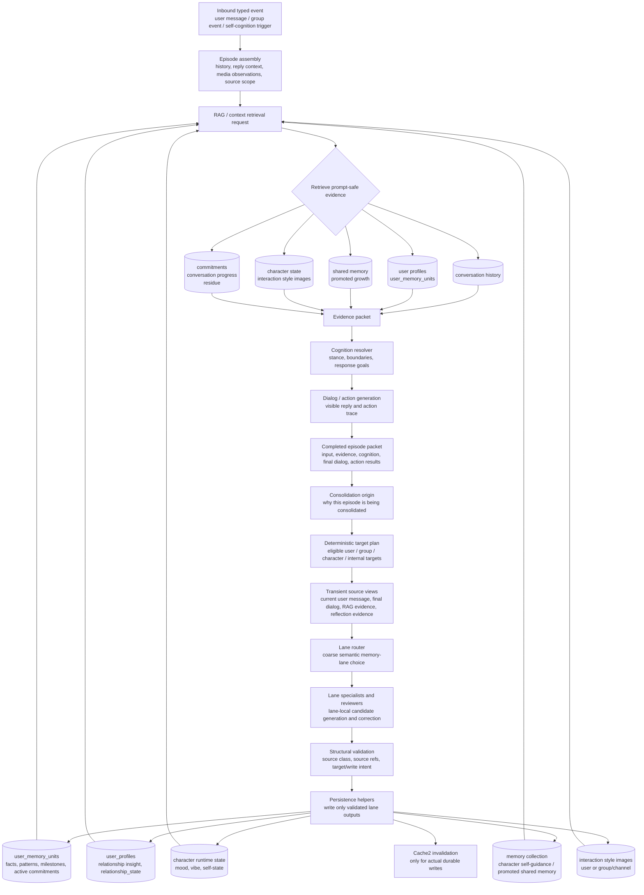
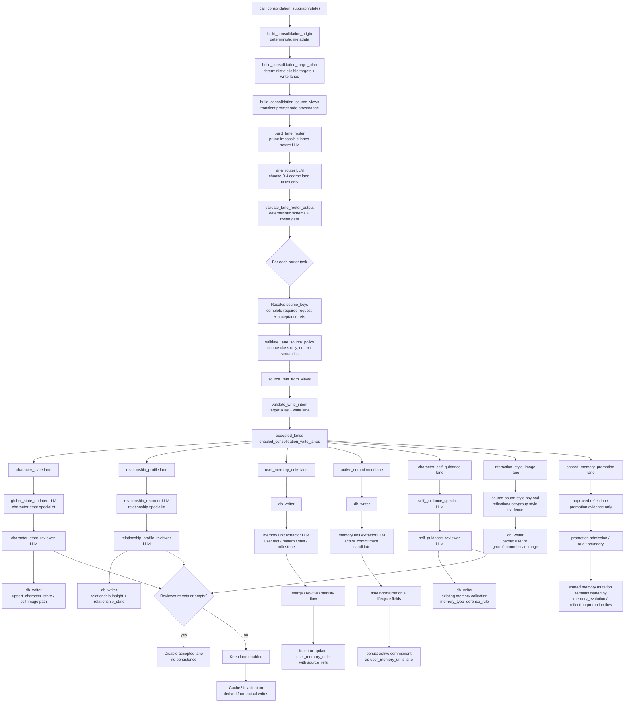

# Consolidation Interface Control Document

## Document Control

- ICD id: `CONS-ICD-001`
- Owning package: `kazusa_ai_chatbot.consolidation`
- Interface boundary: persona and self-cognition state -> deterministic
  target planning -> source views -> lane router -> lane specialists and
  reviewers -> write-intent validation -> target-specific persistence
- Runtime consumers: persona graph, self-cognition runner, brain service
  background consolidation, and consolidation tests
- Upstream owners: cognition, dialog, action-spec execution, and
  self-cognition source collectors
- Downstream owners: database facade helpers, group-channel persistence
  helpers, cache invalidation, and operator lifecycle diagnostics
- Primary implementation files:
  - `src/kazusa_ai_chatbot/consolidation/core.py`
  - `src/kazusa_ai_chatbot/consolidation/target.py`
  - `src/kazusa_ai_chatbot/consolidation/group_channel.py`
  - `src/kazusa_ai_chatbot/consolidation/schema.py`
  - `src/kazusa_ai_chatbot/consolidation/origin.py`
  - `src/kazusa_ai_chatbot/consolidation/origin_policy.py`
  - `src/kazusa_ai_chatbot/consolidation/source_policy.py`
  - `src/kazusa_ai_chatbot/consolidation/lane_router.py`
  - `src/kazusa_ai_chatbot/consolidation/character_self_guidance.py`
  - `src/kazusa_ai_chatbot/consolidation/reflection.py`
  - `src/kazusa_ai_chatbot/consolidation/images.py`
  - `src/kazusa_ai_chatbot/consolidation/memory_units.py`
  - `src/kazusa_ai_chatbot/consolidation/persistence.py`
  - `src/kazusa_ai_chatbot/db/script_operations.py`

This ICD owns the caller-facing consolidation contract. Runtime callers enter
through `kazusa_ai_chatbot.consolidation.core`, not through legacy node-module
entrypoints. The package separates semantic extraction from durable write
eligibility so user, group-channel, character, and internal lanes cannot
silently share the user-profile write path.

## Purpose

Consolidation turns a completed live or background episode into durable state:
relationship insights, user memory units, relationship_state changes, interaction-style
images, character state, character self-image, accepted character
self-guidance, group-channel style state, shared-memory promotion admission,
and audit/internal artifacts.

The consolidation package does not decide what the character should say. It
only processes already produced cognition, dialog, action results, and
prompt-safe episode traces after the live response decision has been made.

User-memory deduplication, extractor prompt context, and surfaced merge
candidates consume the canonical RAG `user_memory_unit_candidates` list. The
consolidation path does not read a legacy `rag_result.user_image` envelope or
maintain a parallel memory-context vocabulary.
Once `rag_result` reaches consolidation, `user_memory_unit_candidates` is a
required list, including when empty. Missing or malformed candidates fail at
this boundary rather than silently projecting an empty memory context.

The package must preserve these system boundaries:

- LLM extraction may propose semantic facts or state updates.
- Deterministic target planning decides which durable entities exist for the
  episode.
- LLM lane routing, specialists, and reviewers own semantic lane decisions.
- Deterministic write-intent validation rejects writes whose lane does not
  match an eligible target.
- Deterministic source validation checks source class and refs only. It must
  not infer semantic meaning from user text.
- Database helpers persist validated writes and own storage mechanics.

## Scope

This ICD covers:

- The public consolidation entrypoint.
- Deterministic target-plan construction.
- Target aliases, target kinds, and write-intent validation.
- Separation between user-profile lanes and group-channel lanes.
- Character and internal target behavior for self-cognition and background
  episodes.
- Operator lifecycle diagnostics for legacy synthetic-user rows.
- Compatibility rules for adding new durable write lanes.

This ICD does not cover:

- Normal chat API schemas; those live in the Brain Service ICD.
- Raw MongoDB collection ownership; that lives in the Database ICD.
- User-facing wording; dialog and L3 surface nodes own final text.
- Reflection promotion gates; the Reflection Cycle ICD owns them.
- Proactive autonomous contact; the Proactive Output ICD owns preview/outbox
  contracts.

## Parties

### Runtime Callers

Runtime callers are the live persona graph, self-cognition worker, service
background consolidation path, and deterministic tests. They call
`call_consolidation_subgraph(...)` with episode state and source metadata.

Runtime callers must not fabricate user ids from source labels such as
`self_cognition`, `group_chat_review`, `internal_thought`, or scheduler
provenance strings.

### Consolidation Package

The consolidation package owns public entry routing, target-plan construction,
write-intent validation, group-channel helper boundaries, and the extraction
and evaluator helpers that produce durable write candidates.

It may call LLM-backed extraction/evaluation nodes, but target planning itself
is deterministic and has no LLM dependency.

### Persistence Layer

Persistence code receives already validated target information and writes
through public database helpers. It must keep user lanes, group-channel lanes,
character lanes, and audit-only lanes separate.

### Maintenance Scripts

Operator scripts under `src/scripts` call
`kazusa_ai_chatbot.db.script_operations` for lifecycle diagnostics and approved
cleanup. Scripts do not issue raw MongoDB operations directly.

## Boundary Summary

```text
persona or self-cognition state
  -> consolidation.core.call_consolidation_subgraph(...)
  -> consolidation.target.build_consolidation_target_plan(...)
  -> consolidation.source_policy.build_source_views(...)
  -> consolidation.lane_router.run_consolidation_lane_pipeline(...)
  -> lane specialists and one-pass reviewers
  -> consolidation.target.validate_write_intent(...)
  -> target-specific persistence helpers
  -> database facade helpers
```

For maintenance cleanup:

```text
operator
  -> python -m scripts.inspect_consolidation_target_lifecycle
  -> kazusa_ai_chatbot.db.script_operations
  -> exact synthetic-row diagnostics or approved cleanup
```

Historical node-level consolidator modules are not public entrypoints and are
not compatibility surfaces. Runtime callers enter through `consolidation.core`.

## Memory Lifecycle

This diagram shows the memory lifecycle from retrieval through generation and
post-turn consolidation. It simplifies cognition internals that are not
directly responsible for memory write admission.



## Lane Decision Chain

This diagram shows how consolidation decides which memory lane may write. LLM
stages own semantic routing and candidate generation; deterministic stages own
target eligibility, source class validation, source refs, write-intent
validation, persistence, and cache invalidation.



## Public Interface

Approved runtime import:

```python
from kazusa_ai_chatbot.consolidation.core import call_consolidation_subgraph
```

Approved target-contract imports for tests and consolidation internals:

```python
from kazusa_ai_chatbot.consolidation.target import (
    ConsolidationTargetPlan,
    build_consolidation_target_plan,
    validate_write_intent,
)
```

Approved maintenance command:

```powershell
venv\Scripts\python -m scripts.inspect_consolidation_target_lifecycle
venv\Scripts\python -m scripts.inspect_consolidation_target_lifecycle --apply
```

Forbidden runtime imports: node-level consolidator entrypoints or helper
modules.

Runtime callers must not import `db._client`, build raw MongoDB query/update
documents, or call maintenance-only cleanup helpers.

## Target Planning Contract

Target planning is deterministic. `origin_kind` records why cognition ran; it
does not grant persistence permission. `target_kind` records the durable entity
that may be written.

| Target kind | Durable meaning | Allowed lanes |
| --- | --- | --- |
| `user` | Real validated user profile | `relationship_insight`, `user_memory_units`, `active_commitment`, `relationship_state`, `user_style_image` |
| `group_channel` | Platform group/channel image | `group_channel_style_image` |
| `character` | Active character state/self-image and accepted self-guidance | `character_state`, `character_self_image`, `character_self_guidance` |
| `internal` | Audit/local artifact and approved promotion admission | `audit`, `shared_memory_promotion` |

Real user targets require a runtime user profile with a matching
`global_user_id`. Missing profile fields that are required for persistence are
lifecycle bugs and must fail closed instead of receiving read-site defaults.

Group-review and other targetless background episodes may have a group-channel
target, a character target, or an internal target. They must not create a user
target unless a real validated user identity is present.

## Write-Intent Contract

Extraction nodes may produce candidate updates. Before persistence, each
candidate is projected into a write intent with:

- `target_alias`: prompt-safe handle selected from the target plan;
- `target_kind`: durable target category;
- `write_lane`: persistence lane being requested;
- target metadata required by the matching lane.

`validate_write_intent(...)` is the deterministic gate between extraction and
persistence. It must reject:

- user lanes for group-channel targets;
- group-channel lanes for user targets;
- character lanes for user or group-channel targets;
- unknown aliases;
- synthetic source labels used as real user ids;
- missing required real-user profile shape.

Validation failure skips or rejects that write; it must not repair the write by
choosing a different target.

## Persistence Contract

User lanes may call user-profile and user-memory database helpers only after a
validated user target exists.

User-memory and active-commitment writes require persisted `source_refs`.
Source refs are derived from source views after lane review; source-less user
memory writes must fail closed.

Group-channel lanes persist through `consolidation.group_channel` helpers and
must not call:

- `update_relationship_state(...)`
- `update_semantic_relationship_projection(...)`
- `update_user_memory_units_from_state(...)`

Character lanes may update character state and character self-image through
their existing database facade helpers. Accepted character-owned behavior rules
may write `character_self_guidance` through the existing `memory` storage using
conversation source refs. Ordinary chat must not write generic shared/world
memory.

Internal lanes may emit audit metadata. `shared_memory_promotion` is allowed
only for approved reflection or memory-evolution evidence with existing
evidence refs and privacy review.

Cache invalidation remains tied to the actual durable writes performed. Adding
a new lane requires a test proving the correct invalidation event is emitted or
that no invalidation is needed.

## Lifecycle Diagnostics

`scripts.inspect_consolidation_target_lifecycle` is the approved operator
entrypoint for synthetic-user lifecycle diagnostics.

Default mode is read-only. It reports sanitized counts for:

- synthetic `self_cognition` user profiles;
- user profiles missing required relationship_state fields;
- synthetic scheduled events;
- synthetic user-memory units;
- future-cognition attempts missing a real user;
- linked platform accounts that would block cleanup.

`--apply` is mutation mode. It requires explicit operator approval outside the
script, blocks if the synthetic profile has linked platform accounts, fails
synthetic scheduled events with migration metadata, removes synthetic
`source_user_id`, and deletes exact synthetic profile and user-memory rows.

## Caller Responsibilities

Callers must:

- import through `kazusa_ai_chatbot.consolidation.core`;
- pass source metadata without rewriting synthetic provenance into user ids;
- pass real user profile data only when it belongs to the selected user target;
- treat target-plan validation errors as consolidation failures or skipped
  writes, not as prompts to fabricate fallback data;
- keep operator cleanup in maintenance scripts and out of live runtime paths.

Callers must not:

- use `self_cognition` or any source label as `global_user_id`;
- call node-level consolidator modules as public APIs;
- call raw database clients or maintenance cleanup helpers from runtime code;
- persist group-channel state through user-profile lanes;
- persist ordinary chat facts as shared memory;
- add a new write lane without a target-plan contract update and tests.

## Change Control

Any change that adds a durable target, target alias, write lane, persistence
helper, or cleanup behavior must update this ICD and add focused tests for:

- target-plan construction;
- allowed and rejected write intents;
- persistence dispatch;
- cache invalidation or explicit non-invalidation;
- lifecycle diagnostics when the change touches legacy data.

High-risk migrations must also update `development_plans/README.md` through an
approved active plan before implementation.
