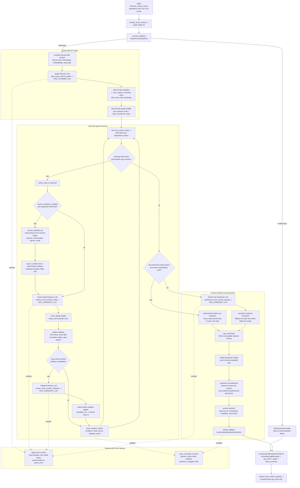

# Local Context Resolver ICD

## Document Control

- Owning package: `kazusa_ai_chatbot.local_context_resolver`
- Runtime role: production local/private context evidence resolver, also known
  as RAG3
- Interface boundary: stable public IO around
  `resolve_local_context(request, context, options=None)`
- Current integration status: production `local_context_recall` is wired
  through the stable public IO. First-cycle shared-memory prewarm stays outside
  this resolver and uses the bounded shared persistent-memory worker lane.
- Production caller status: cognition resolver capability execution and
  standalone/local review paths call `resolve_local_context(...)`; dialog,
  adapters, prewarm, and persistence consume only the retained projected
  evidence
- Source evidence: `contracts.py`, `service.py`, `stages.py`, `graph.py`,
  `constants.py`, and the focused `tests/test_local_context_resolver_*.py`
  suites

This README is the module ICD for implemented RAG3 behavior. If a
development plan, report, or historical artifact disagrees with this file,
read the code and tests first, then update this ICD to match implemented
behavior.

## Purpose

The local-context resolver turns one bounded local-context objective into a
prompt-safe evidence packet. It is aligned with the complex-resolver shape:

```text
objective
  -> bounded semantic graph
  -> one active evidence node at a time
  -> source-owned artifacts
  -> known/lacking/boundary packet
  -> retained rag_result projection
```

The resolver returns evidence. It does not decide whether Kazusa should speak,
what stance she should take, or how final visible text should be worded.
Cognition and dialog keep those responsibilities.

## Ownership Boundary

This package owns:

- public request, context, options, graph, artifact, packet, and future
  subagent contracts;
- structural validation for all public IO and graph objects;
- graph planning, deterministic graph construction, bounded traversal, and
  dependency-safe active-node selection;
- static source hydration for supported local evidence node kinds through
  existing source-owned RAG helper agents;
- active-node semantic evidence extraction from prompt-safe supplied context;
- optional duplicate-node collapse review;
- deterministic or LLM-backed bottom-up packet synthesis;
- prompt-safe `rag_result` projection and metadata redaction;
- process-local Cache2 policy for graph-planner and active-node stage results;
- live review trace records and raw efficiency counters.

This package does not own:

- platform adapter syntax, mention parsing, delivery receipts, or rendering;
- MongoDB query construction, embeddings, or persistence writes;
- durable write-origin cache invalidation events, which remain owned by the
  data writers that changed conversation, memory, profile, or character state;
- cognition stance, action selection, response-gating judgment, or final
  dialog wording;
- consolidation, scheduler, reflection, or accepted-task lifecycle;
- cognition stance, dialog wording, adapter delivery, or persistence writes
  after projected evidence has been returned.

## Public Interfaces

Callers use one public resolver entrypoint:

```python
await resolve_local_context(request, context, options=None)
```

Stable public input contracts:

- `LocalContextResolverRequestV1`
- `LocalContextResolverContextV1`
- `LocalContextResolverOptionsV1`

Stable public output contract:

- `LocalContextResolutionPacketV1`

Projection entrypoint:

```python
project_local_context_packet(packet)
```

`project_local_context_packet(...)` returns only `packet["rag_result"]`.
`graph` and `trace_summary` are debug and supervisor material, not prompt-facing
evidence.

The package also exports validators for each public contract:

- `validate_local_context_resolver_request`
- `validate_local_context_resolver_context`
- `validate_local_context_resolver_options`
- `validate_local_context_node`
- `validate_local_context_graph`
- `validate_local_context_artifact`
- `validate_local_context_resolution_packet`
- `validate_local_context_subagent_request`
- `validate_local_context_subagent_result`

## Architecture

The implemented resolver has a direct standalone interface, a static
source-hydration bridge, and four resolver-local LLM stages. The LLM stages
are stage agents inside `stages.py`, not a package-discovered source-subagent
registry. `source_hydration.py` may call existing source-owned RAG helper
agents for supported node kinds before active-node LLM resolution. It is a
fixed bridge, not a dynamic subagent registry.



The normal optimized path for a single-source resolved objective is:

```text
planner LLM
  -> optional source hydration on production cache miss
  -> active-node LLM
  -> deterministic synthesis and projection
```

That path is two RAG3 LLM calls, plus at most one source-owned helper call for
supported hydrated node kinds. Collapse review runs only when a resolved
same-kind candidate exists. Bottom-up synthesis LLM runs only when
deterministic node-row synthesis is not sufficient, such as unresolved or
blocked graph state.

## Resolver-Local Stage Agents

| Stage agent | Function | Route | Input | Output | Validation owner | Side effects |
|---|---|---|---|---|---|---|
| Graph planner | `plan_local_context_graph(payload)` | `RAG_PLANNER_LLM` | Request, compact context, option limits | JSON `tasks` with objective and node kind | `_planner_tasks`, `_graph_from_planner_response`, graph validators | Process-local Cache2 lookup/store plus stage trace capture on LLM misses |
| Active node resolver | `resolve_local_context_node(payload)` | `RAG_SUBAGENT_LLM` | Request, compact context, optional `source_context`, active node, dependency context, limits | `node_update` plus source-owned artifacts | `_cacheable_active_node_response`, `_merge_source_hydration_response`, `_apply_active_node_response`, `_validated_artifact_for_node`, artifact validators | Process-local Cache2 lookup/store plus static source hydration and stage trace capture on cache misses |
| Collapse reviewer | `review_local_context_collapse(payload)` | `RAG_SUBAGENT_LLM` | Active node and prompt-safe same-kind candidates | `collapse_decision` with `target_candidate_ref` | `_apply_collapse_response` maps prompt ref to internal node id | None beyond stage trace capture |
| Bottom-up synthesizer | `synthesize_local_context_packet(payload)` | `RAG_SUBAGENT_LLM` | Resolved/unresolved node summaries and limits | Packet semantic row fields | `_semantic_synthesis_response`, packet validators | None beyond stage trace capture |

All stage agents use deterministic JSON parsing without a JSON-repair LLM.
Raw control characters inside JSON strings are escaped deterministically after
normal parsing fails. If parsing still fails, the stage records a failed trace
row with raw model output and raises a bounded validation error.

## Source Hydration

Production `local_context_recall` sets `source_hydration_enabled=True` in the
resolver context. On an active-node Cache2 miss, `_resolve_active_node(...)`
first asks `hydrate_source_for_node(...)` for source-backed evidence when the
node kind is supported:

| Node kind | Source helper |
|---|---|
| `memory_evidence` | `MemoryEvidenceAgent` |
| `scoped_memory` | `MemoryEvidenceAgent` with a current-user continuity task prefix |
| `conversation_evidence` | `ConversationEvidenceAgent` |
| `person_context` | `PersonContextAgent` |
| `recall_evidence` | `RecallAgent` |

Unsupported node kinds such as `live_context`, `external_evidence`,
`subtask`, and `synthesis` continue through the LLM-only active-node path.
Source hydration is disabled by default for standalone callers unless the
context explicitly enables it.

The hydration bridge builds trusted source-agent context from the public
resolver context: platform/channel scope, current global user, local time,
active-turn message and conversation row ids, recent/wide chat history,
original query, current node objective, dependency summaries, and the active
character name. This trusted context is not passed directly to LLM prompts.

Hydration output is converted into:

- `source_context` rows for the active-node LLM prompt;
- deterministic `LocalContextArtifactV1` artifacts;
- a deterministic node update merged before the active-node LLM update.

`source_context` rows keep only semantic evidence fields. Memory rows project
content, memory names, source kind/type/status, and scoped-memory provenance.
Conversation rows project bounded speaker/text/summary/url/relation/context
fields. Retrieval scores, cache keys, embeddings, raw DB rows, and platform
ids are stripped before prompt use. Prompt-visible `rag_result` projection
still applies the normal sanitizer after artifact merge.

The active-node Cache2 entry stores the merged source-hydration plus active
LLM result. A warm active-node cache hit skips both source hydration and the
active-node LLM for that node. Cache dependencies are source-aware so durable
memory, user-profile, character-state, and conversation-history writes can
invalidate stale stage entries.

## Future Subagent Protocol

`contracts.py` defines `LocalContextSubagentV1`,
`LocalContextSubagentRequestV1`, and `LocalContextSubagentResultV1` for future
first-class source-owned handlers. This protocol is not used by the current
static hydration bridge. It remains a resolver-local future contract, not a
shared subagent abstraction and not a current registry.

Current contract fields:

| Category | Current contract |
|---|---|
| Family name | Local-context resolver source handler |
| Owning package | `kazusa_ai_chatbot.local_context_resolver` |
| Runtime purpose | Future first-class bounded source-owned retrieval for one local-context node |
| Registry or discovery | None implemented today |
| Identifier | `subagent` in `LocalContextSubagentRequestV1` |
| Supported actions | `action` string, validated as a non-empty semantic action |
| Input contract | `node_id`, `subagent`, `action`, `objective`, `payload`, `constraints` |
| Output contract | `resolved`, `status`, `result`, `attempts`, `cache`, `trace`, `unresolved_items` |
| Validation owner | `validate_local_context_subagent_request` and `validate_local_context_subagent_result` |
| Enablement | None implemented today |
| Cache behavior | Result envelope has `cache`; no current `LocalContextSubagentV1` implementation uses it. Resolver stage caching happens above this protocol through Cache2. |
| Trace or audit | Result envelope has bounded `trace`; service `subagent_calls` counter exists |
| Side-effect boundary | Future source handlers may return evidence only; no stance, dialog, adapter delivery, arbitrary persistence, or shell/tool execution |
| Required tests | Contract tests plus source-handler tests before any implementation is wired |

Until a source-handler registry is implemented, diagrams and callers must not
claim dynamic discovery or generic source-subagent dispatch. Today, RAG3 uses
only the fixed `source_hydration.py` bridge for memory, scoped memory,
conversation, person, and recall evidence; other node kinds rely on supplied
prompt-safe context and active-node LLM resolution.

## Input And Output Contracts

### `LocalContextResolverRequestV1`

```python
{
    "schema_version": "local_context_resolver_request.v1",
    "objective": str,
    "source": "standalone_eval|l2d|prewarm|test|live_llm_review",
    "reason": str,
    "priority": "normal|high",
}
```

`prewarm` remains a validated source value for historical trace compatibility
and local review fixtures. Production first-cycle shared-memory prewarm does
not call this resolver.

### `LocalContextResolverContextV1`

```python
{
    "schema_version": "local_context_resolver_context.v1",
    "character_name": str,
    "platform": str,
    "platform_channel_id": str,
    "global_user_id": str,
    "user_name": str,
    "local_time_context": dict,
    "prompt_message_context": dict,
    "chat_history_recent": list[dict],
    "chat_history_wide": list[dict],
    "conversation_progress": dict,
    "original_user_request": str,  # optional
    "current_timestamp_utc": str,  # optional, trusted source context
    "current_platform_message_id": str,  # optional, trusted source context
    "active_turn_platform_message_ids": list[str],  # optional
    "active_turn_conversation_row_ids": list[str],  # optional
    "source_hydration_enabled": bool,  # optional, default false
}
```

The caller may carry platform and user ids in the public context envelope for
validation and source integration. `_compact_context(...)` strips prompt-unsafe
ids, raw timestamps, storage rows, embeddings, cache keys, and trace fields
before the graph planner sees the context. Source hydration may use trusted
ids internally for filtering and active-turn exclusion, but its projected
`source_context` rows are sanitized before the active-node LLM sees them.

### `LocalContextResolverOptionsV1`

```python
{
    "schema_version": "local_context_resolver_options.v1",
    "max_iterations": int,
    "max_nodes": int,
    "max_depth": int,
    "max_node_attempts": int,
    "max_subagent_attempts": int,
}
```

Default limits:

```python
{
    "max_iterations": 3,
    "max_nodes": 8,
    "max_depth": 3,
    "max_node_attempts": 2,
    "max_subagent_attempts": 1,
}
```

Hard caps:

```python
{
    "max_iterations": 4,
    "max_nodes": 8,
    "max_depth": 3,
    "max_node_attempts": 2,
    "max_subagent_attempts": 1,
}
```

Behavior injection fields such as `planner_llm`, `node_resolver_llm`,
`collapse_llm`, `synthesizer_llm`, `subagents`, and `clock` are rejected.

### `LocalContextNodeV1`

Allowed node kinds:

- `conversation_evidence`
- `external_evidence`
- `live_context`
- `memory_evidence`
- `person_context`
- `recall_evidence`
- `scoped_memory`
- `subtask`
- `synthesis`

Allowed statuses:

- `pending`
- `resolving`
- `resolved`
- `blocked`
- `cannot_answer`
- `collapsed`

Node ids are deterministic service-owned ids such as `root` and `task_1`.
LLM-facing payloads receive compact semantic node projections, not raw graph
internals.

### `LocalContextArtifactV1`

Allowed artifact types:

- `conversation_ref`
- `external_ref`
- `live_context_ref`
- `memory_ref`
- `person_ref`
- `recall_ref`
- `semantic_packet`

Artifacts are source-owned evidence. `producer_node_id` is bound
deterministically; the active-node alias `active_node` is allowed in LLM output
and mapped to the internal active node id before validation.

### `LocalContextResolutionPacketV1`

```python
{
    "schema_version": "local_context_resolution_packet.v1",
    "investigation_summary": list[str],
    "knowledge_we_know_so_far": list[str],
    "knowledge_still_lacking": list[str],
    "recommended_next_iteration": list[str],
    "evidence_boundary_notes": list[str],
    "rag_result": dict,
    "graph": LocalContextGraphV1,
    "trace_summary": dict,
}
```

`rag_result` preserves the retained prompt-facing RAG2-compatible surface:

```python
{
    "answer": str,
    "user_image": dict,
    "user_memory_unit_candidates": list,
    "character_image": dict,
    "third_party_profiles": list,
    "memory_evidence": list,
    "recall_evidence": list,
    "conversation_evidence": list,
    "external_evidence": list,
    "supervisor_trace": dict,
}
```

## Runtime Flow

1. `resolve_local_context(...)` validates request, context, and options. Invalid
   input returns a bounded blocked packet instead of raising to callers.
2. `_plan_graph(...)` calls the graph planner LLM and maps semantic task rows
   into a strict `LocalContextGraphV1`.
3. `_run_graph_traversal(...)` repeatedly selects the next dependency-ready
   pending node through `find_next_active_node(...)`.
4. On an active-node cache miss, supported node kinds may run static source
   hydration through existing source-owned helpers. The resulting
   `source_context`, artifacts, and node update are merged into the active
   resolution path.
5. The active-node LLM resolves the node from compact context, optional
   source context, and dependency summaries; the service applies artifacts and
   optionally reviews same-kind collapse candidates.
6. `_synthesize_packet(...)` uses deterministic synthesis when resolved
   node-owned rows are sufficient. Otherwise it calls the bottom-up synthesis
   LLM and normalizes the result.
7. `_rag_result_from_artifacts(...)` builds a fresh retained `rag_result`,
   merges prompt-visible artifacts, normalizes source fields, projects
   structured live context, sanitizes prompt-facing rows, and deduplicates
   repeated payload items.
8. `validate_local_context_resolution_packet(...)` validates the final packet
   before returning it.

## Projection Rules

Projection is source-owned and prompt-safe.

- `memory_ref` writes durable/shared memory to `memory_evidence`.
- `memory_ref` rows sourced from `user_memory_units` or user-scoped memory move
  to `user_memory_unit_candidates`.
- `conversation_ref` writes chat messages, speakers, exact phrases, URL
  provenance, direct-address anchors, reply context, and nearby dialog to
  `conversation_evidence`.
- `conversation_ref` artifacts cannot populate `recall_evidence`.
- Raw `conversation_ref` projection payloads may carry trace-only source refs
  such as `conversation_row_id` or `_id`. These refs are copied only to
  `rag_result["supervisor_trace"]["dispatched"][*]["source_refs"]` for private
  past-dialog cognition consumers, then stripped from prompt-visible evidence.
- `recall_ref` writes active agreements, commitments, plans, and episode state
  to `recall_evidence`; when recall evidence is present, duplicate
  `conversation_evidence` rows from that same artifact are dropped.
- `person_ref` writes profile, identity, relationship, or impression evidence
  to `third_party_profiles`, `user_image`, or `character_image`.
- `external_ref` writes supplied public URL or web-content evidence to
  `external_evidence`.
- `live_context_ref` has no dedicated retained top-level field; structured
  live context is projected into `conversation_evidence` with source
  `live_context`.

The sanitizer strips forbidden keys and embedded metadata such as raw message
ids, adapter ids, platform ids, conversation row ids, database ids, raw UTC
timestamps, cache keys, trace ids, embeddings, and local storage timestamps.

## Configuration

LLM stages use route-specific configuration through `LLInterface`:

- Graph planner: `RAG_PLANNER_LLM`
- Active-node resolver: `RAG_SUBAGENT_LLM`
- Collapse reviewer: `RAG_SUBAGENT_LLM`
- Bottom-up synthesizer: `RAG_SUBAGENT_LLM`

Stage generation defaults in `constants.py`:

- `STAGE_LLM_TEMPERATURE = 0.1`
- `STAGE_LLM_TOP_P = 0.7`

The package does not read environment variables directly; route configuration
is imported through `kazusa_ai_chatbot.config`.

## Persistence And Side Effects

The resolver has no direct persistence writes. It does not upsert memory,
update conversation history, write scheduler rows, send adapter messages,
write persistent Cache2 rows, or execute shell tools. Source hydration may
call existing read-only retrieval helpers, which can read MongoDB-backed
memory, conversation, profile, and recall sources and may use their own
process-local Cache2 worker caches.

It does use the process-local Cache2 runtime for stage result reuse:

- planner-stage entries cache validated task-list JSON and are long-lived
  until LRU eviction, prompt/model/cache-policy changes, or process restart;
- active-node entries cache normalized validated node-update/artifact JSON;
- active-node keys include the exact compact prompt-safe context digest,
  dependency-context digest, source-hydration enablement flag, node kind,
  objective, prompt/model identity, scope, and limits, so changed supplied
  evidence or source mode naturally misses;
- stable local data domains such as memory, conversation, person, scoped
  memory, and recall use no TTL and rely on key versioning plus Cache2
  dependency invalidation;
- live-context node entries use a short TTL;
- external-evidence node entries use a longer TTL because supplied URL/content
  evidence is usually less volatile than live clock data;
- final `LocalContextResolutionPacketV1` and final dialog are not cached.

Cache keys and Cache2 metadata remain operational state. They must not enter
`rag_result`, resolver observations, cognition prompts, or dialog prompts.

Stage trace records are process-local review material returned by
`drain_stage_trace_records()` in `stages.py`. They are used by live LLM review
tests and are not part of prompt-facing `rag_result`.

## Failure Behavior

- Public input validation failure returns a bounded blocked packet with
  `failure_stage = "input_validation"` in `trace_summary`.
- Local graph, stage, artifact, or packet validation failure returns a bounded
  blocked packet with `failure_stage = "local_resolution"`.
- Bounded blocked packets contain safe missing-knowledge rows and an empty
  evidence surface except `supervisor_trace`.
- LLM JSON parsing uses deterministic parsing only. It may extract the outer
  JSON object and escape raw control characters inside JSON strings, but it
  does not call `JSON_REPAIR_LLM`.
- Failed stage parsing records raw output and a `parse_error` in stage trace
  records before raising a validation error.
- Collapse review is skipped deterministically when no same-kind resolved
  candidate exists.
- Collapse application is ignored unless the active node is resolved and the
  model-selected `target_candidate_ref` maps to a valid same-kind candidate.

## Observability

`trace_summary` includes raw counters needed for review:

- `iterations`
- `node_count`
- `max_depth_observed`
- `resolved_node_count`
- `blocked_node_count`
- `planner_calls`
- `active_node_calls`
- `collapse_calls`
- `synthesis_calls`
- `subagent_calls`
- `collapse_count`
- `planner_cache_hits`
- `active_node_cache_hits`
- `cache_hits`

Stage trace records include:

- stage name and prompt id;
- route name and model;
- model-facing input payload;
- raw model output;
- parsed output, or `parse_error` when deterministic parsing fails.

`trace_summary` and stage traces are diagnostic material. They must not become
cognition evidence or dialog input.

## Testing Contract

Use `venv\Scripts\python.exe`.

Deterministic package tests:

```powershell
venv\Scripts\python.exe -m pytest tests\test_local_context_resolver_standalone.py tests\test_local_context_resolver_contracts.py tests\test_local_context_resolver_graph.py tests\test_local_context_resolver_projection.py -q
```

Standalone live LLM review tests must be run one case at a time with
`-m live_llm`. Current live review files include:

- `tests/test_local_context_resolver_live_llm.py`
- `tests/test_local_context_resolver_rag2_vs_rag3_live_llm.py`
- `tests/test_local_context_resolver_full_matrix_live_llm.py`

The full-matrix live harness covers the current RAG2 behavior matrix plus
additional RAG3 cases for real group-history adjacency, `#napcat`, scoped user
memory, URL provenance, external content, topic participants, reply-parent
context, and cascaded phrase/person/link dependency.

## Forbidden Paths

- Do not add a second production recall path, fallback to the retired RAG2
  supervisor, or dual-run compatibility bridge around this package.
- Do not add an experiment-only request, context, options, packet, or adapter
  wrapper shape.
- Do not compile RAG3 graphs back into RAG2 `unknown_slots`.
- Do not introduce compatibility shims, alias modules, fallback mappers, or
  dual production paths to preserve RAG2 supervisor internals.
- Do not expose graph ids, raw stage traces, raw database ids, adapter ids,
  platform ids, cache keys, embeddings, prompt text, raw wire syntax, or raw
  timestamps in `rag_result`.
- Do not cache final packets or final dialog text as a production shortcut.
- Do not ask LLM stages to generate MongoDB filters, index names, embedding
  settings, adapter delivery behavior, persistence decisions, or final visible
  dialog.
- Do not use JSON repair LLM calls or unbounded retry loops for malformed
  local-context stage output.
- Do not treat retrieved evidence as persona stance, character judgment, or
  final user-visible wording.
- Do not claim dynamic source-subagent registry behavior until concrete
  source-handler modules, discovery, dispatch, and tests exist.

## Change Control

Any change to public contracts, node kinds, artifact types, prompt-facing
projection, LLM stage prompts, traversal caps, trace fields, or production
wiring must update this ICD in the same change.

Prompt changes require focused deterministic tests and selected one-case-at-a-
time live LLM review. Production wiring changes must preserve the public IO
described here and keep `rag_result` as the only prompt-facing evidence
surface.
